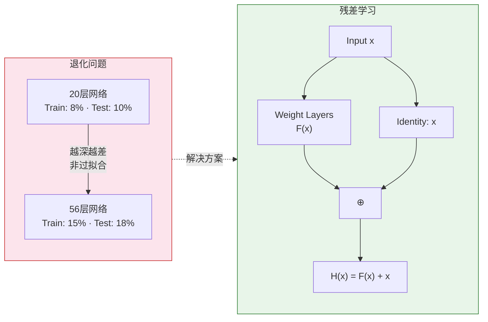
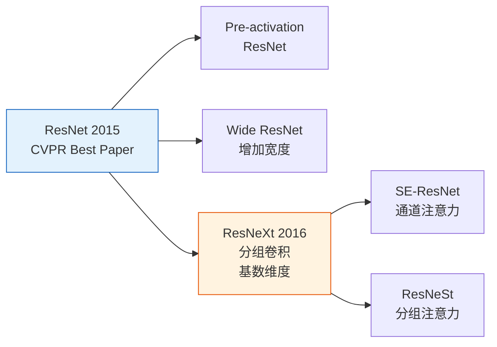

# ResNet与ResNeXt：残差网络的革命

## 引言

在AlexNet之后，深度学习研究者逐渐形成了一个观念：**"网络越深效果越好"**。VGG和GoogLeNet都在探索更深的网络。然而，研究者很快发现了一个令人困惑的现象：**网络深度到达一定程度后，性能不升反降**。

这不是过拟合，也不是梯度消失，而是一种新的问题——**退化(Degradation)** <cite>[1]</cite>。2015年，何凯明团队提出的**残差学习(Residual Learning)**，优雅地解决了这个问题。

## ResNet (2015)



### 辉煌成绩

* 🥇 ImageNet 2015 分类任务第一名
* 🥇 ImageNet 2015 目标检测任务第一名
* 🥇 COCO 2015 目标检测任务第一名
* 🥇 COCO 2015 图像分割任务第一名

## 退化问题

### 什么是退化？


**实验观察**：
* 20层网络：训练误差8%，测试误差10%
* 56层网络：训练误差15%，测试误差18%

**这不是过拟合**！因为训练误差也变大了。

### 理论分析

假设浅层网络已经能达到不错的效果，那么深层网络理论上至少应该能做到：
* 前面几层：学习有用的特征
* 后面几层：学习**恒等映射(Identity Mapping)**

$$
H(x) = x
$$

但实际上，深层网络很难学到这种恒等映射，导致性能下降。



## 残差学习

### 核心思想

与其让网络学习完整的映射 \(H(x)\)，不如让它学习残差 \(F(x) = H(x) - x\)。

**残差结构**：
$$
H(x) = F(x) + x
$$

**优势**：
* 如果恒等映射是最优解，网络只需学习 \(F(x) = 0\)
* 学习 \(F(x) = 0\) 比学习 \(H(x) = x\) 容易得多

### 残差模块


#### Basic Block (ResNet-18/34)

```python
import torch.nn as nn

class BasicBlock(nn.Module):
    """ResNet基础残差块，用于ResNet-18/34"""
    expansion = 1
    
    def __init__(self, in_channels, out_channels, stride=1):
        super(BasicBlock, self).__init__()
        
        # 主路径
        self.conv1 = nn.Conv2d(in_channels, out_channels, 
                              kernel_size=3, stride=stride, padding=1, bias=False)
        self.bn1 = nn.BatchNorm2d(out_channels)
        self.relu = nn.ReLU(inplace=True)
        
        self.conv2 = nn.Conv2d(out_channels, out_channels, 
                              kernel_size=3, stride=1, padding=1, bias=False)
        self.bn2 = nn.BatchNorm2d(out_channels)
        
        # 残差连接（shortcut）
        self.shortcut = nn.Sequential()
        if stride != 1 or in_channels != out_channels:
            self.shortcut = nn.Sequential(
                nn.Conv2d(in_channels, out_channels, 
                         kernel_size=1, stride=stride, bias=False),
                nn.BatchNorm2d(out_channels)
            )
    
    def forward(self, x):
        identity = x
        
        # 主路径
        out = self.conv1(x)
        out = self.bn1(out)
        out = self.relu(out)
        
        out = self.conv2(out)
        out = self.bn2(out)
        
        # 残差连接
        out += self.shortcut(identity)
        out = self.relu(out)
        
        return out
```

#### Bottleneck Block (ResNet-50/101/152)

```python
class Bottleneck(nn.Module):
    """ResNet瓶颈残差块，用于ResNet-50/101/152"""
    expansion = 4
    
    def __init__(self, in_channels, out_channels, stride=1):
        super(Bottleneck, self).__init__()
        
        # 主路径：1×1降维 → 3×3处理 → 1×1升维
        self.conv1 = nn.Conv2d(in_channels, out_channels, 
                              kernel_size=1, bias=False)
        self.bn1 = nn.BatchNorm2d(out_channels)
        
        self.conv2 = nn.Conv2d(out_channels, out_channels, 
                              kernel_size=3, stride=stride, padding=1, bias=False)
        self.bn2 = nn.BatchNorm2d(out_channels)
        
        self.conv3 = nn.Conv2d(out_channels, out_channels * self.expansion, 
                              kernel_size=1, bias=False)
        self.bn3 = nn.BatchNorm2d(out_channels * self.expansion)
        
        self.relu = nn.ReLU(inplace=True)
        
        # 残差连接
        self.shortcut = nn.Sequential()
        if stride != 1 or in_channels != out_channels * self.expansion:
            self.shortcut = nn.Sequential(
                nn.Conv2d(in_channels, out_channels * self.expansion, 
                         kernel_size=1, stride=stride, bias=False),
                nn.BatchNorm2d(out_channels * self.expansion)
            )
    
    def forward(self, x):
        identity = x
        
        out = self.conv1(x)
        out = self.bn1(out)
        out = self.relu(out)
        
        out = self.conv2(out)
        out = self.bn2(out)
        out = self.relu(out)
        
        out = self.conv3(out)
        out = self.bn3(out)
        
        out += self.shortcut(identity)
        out = self.relu(out)
        
        return out
```

## ResNet架构

### 不同深度的配置

| 模型 | 层数 | 参数量 | FLOPs | Top-1错误率 | Top-5错误率 |
|------|------|--------|-------|------------|------------|
| ResNet-18 | 18 | 11.7M | 1.8G | 30.2% | 10.9% |
| ResNet-34 | 34 | 21.8M | 3.7G | 26.7% | 8.6% |
| ResNet-50 | 50 | 25.6M | 4.1G | 24.0% | 7.1% |
| ResNet-101 | 101 | 44.5M | 7.8G | 22.4% | 6.2% |
| ResNet-152 | 152 | 60.2M | 11.6G | 21.7% | 5.9% |

### ResNet vs VGG

ResNet相比VGG的优势：

| 指标 | ResNet-34 | VGG-19 |
|------|-----------|--------|
| 参数量 | 21.8M | 144M |
| 计算量 | 3.7G | 19.6G |
| 准确率 | 更高 | 较低 |

**ResNet-34的计算量约为VGG-19的18%，但准确率却远高于后者！**

## 主要贡献

### 残差学习框架

提出了优雅的残差学习框架，解决了深度网络的退化问题。

### 超深网络

突破了200层，证明了残差连接能支持极深的网络。

### 简化设计

* 采用BatchNorm加速训练
* 丢弃Dropout结构
* 结构简单统一

### 高效性

参数量和计算量都远小于VGG，但效果更好。

## 残差连接的数学解释

### 前向传播

$$
x_{l+1} = x_l + \mathcal{F}(x_l, \mathcal{W}_l)
$$

### 反向传播

$$
\frac{\partial \mathcal{L}}{\partial x_l} = \frac{\partial \mathcal{L}}{\partial x_{l+1}} \left(1 + \frac{\partial \mathcal{F}}{\partial x_l}\right)
$$

**关键点**：梯度中有一个恒定的"1"，确保梯度能够顺畅传播。

### 多层叠加

对于L层的ResNet：

$$
x_L = x_l + \sum_{i=l}^{L-1} \mathcal{F}(x_i, \mathcal{W}_i)
$$

**任何浅层都与深层有直接连接，梯度可以直接传播！**

## 模型复现

我在PyTorch平台上复现了ResNet模型：

* **平台**：PyTorch
* **主要库**：torchvision, torch, matplotlib, tqdm
* **数据集**：Oxford Flower102花分类数据集
* **代码地址**：[GitHub - DeepLearning/model_classification/ResNet_ResNeXt](https://github.com/YangCazz/DeepLearning/tree/master/model_classification/ResNet_ResNeXt)

## ResNeXt (2016)



### 核心思想

ResNeXt是ResNet的升级版，融入了GoogLeNet的Inception思想，但采用了更规整的设计 <cite>[2]</cite>。


### Split-Transform-Merge

**数学表达**：
$$
\mathcal{F}(x) = \sum_{i=1}^{C} \mathcal{T}_i(x)
$$

加上残差连接：
$$
y = x + \sum_{i=1}^{C} \mathcal{T}_i(x)
$$

其中C被称为**基数(Cardinality)**。

### ResNeXt模块


```python
class ResNeXtBlock(nn.Module):
    """ResNeXt残差块"""
    expansion = 2
    
    def __init__(self, in_channels, out_channels, cardinality=32, stride=1):
        super(ResNeXtBlock, self).__init__()
        
        # 分组卷积的通道数
        D = out_channels // 2  # bottleneck width
        
        # 主路径
        self.conv1 = nn.Conv2d(in_channels, D * cardinality, 
                              kernel_size=1, bias=False)
        self.bn1 = nn.BatchNorm2d(D * cardinality)
        
        # 分组卷积：关键创新
        self.conv2 = nn.Conv2d(D * cardinality, D * cardinality, 
                              kernel_size=3, stride=stride, padding=1,
                              groups=cardinality, bias=False)
        self.bn2 = nn.BatchNorm2d(D * cardinality)
        
        self.conv3 = nn.Conv2d(D * cardinality, out_channels * self.expansion, 
                              kernel_size=1, bias=False)
        self.bn3 = nn.BatchNorm2d(out_channels * self.expansion)
        
        self.relu = nn.ReLU(inplace=True)
        
        # 残差连接
        self.shortcut = nn.Sequential()
        if stride != 1 or in_channels != out_channels * self.expansion:
            self.shortcut = nn.Sequential(
                nn.Conv2d(in_channels, out_channels * self.expansion, 
                         kernel_size=1, stride=stride, bias=False),
                nn.BatchNorm2d(out_channels * self.expansion)
            )
    
    def forward(self, x):
        identity = x
        
        out = self.conv1(x)
        out = self.bn1(out)
        out = self.relu(out)
        
        # 分组卷积
        out = self.conv2(out)
        out = self.bn2(out)
        out = self.relu(out)
        
        out = self.conv3(out)
        out = self.bn3(out)
        
        out += self.shortcut(identity)
        out = self.relu(out)
        
        return out
```

### 关键创新：组卷积

**组卷积(Grouped Convolution)**：

将输入通道分成C组，每组独立进行卷积，最后拼接。

```python
# PyTorch中的组卷积
nn.Conv2d(in_channels=64, out_channels=64, 
          kernel_size=3, groups=32)
# 相当于32个独立的小卷积
```

**优势**：
* 减少参数量
* 增加特征多样性
* 提升性能

### ResNeXt vs ResNet vs Inception

| 特性 | ResNet | Inception | ResNeXt |
|------|--------|-----------|---------|
| 设计方式 | 人工设计 | 人工设计（复杂） | 自动化（规整） |
| 分支结构 | 单路径 | 多尺度（不同） | 多路径（相同） |
| 参数调节 | 深度、宽度 | 复杂 | 基数(Cardinality) |
| 实现难度 | 简单 | 复杂 | 中等 |

## 性能对比

### ResNet vs ResNeXt

在相同参数量下：

| 模型 | 参数量 | Top-1错误率 | Top-5错误率 |
|------|--------|------------|------------|
| ResNet-50 | 25.6M | 24.0% | 7.1% |
| ResNeXt-50 (32×4d) | 25.0M | 22.9% | 6.5% |

**结论**：增加基数(Cardinality)比增加深度或宽度更有效！

## ResNet的变体

ResNet提出后，涌现出许多变体：



## 实践经验

### 残差连接的实现细节

```python
# ❌ 错误的实现
out = self.conv(x) + x  # 可能导致数值不稳定

# ✅ 正确的实现
identity = x
out = self.conv(x)
out = out + identity  # 先保存identity，再相加
```

### 预训练模型的使用

```python
import torchvision.models as models

# 加载预训练的ResNet
model = models.resnet50(pretrained=True)

# 修改最后一层用于自己的任务
num_classes = 10
model.fc = nn.Linear(model.fc.in_features, num_classes)

# 冻结前面的层，只训练最后一层
for param in model.parameters():
    param.requires_grad = False
model.fc.weight.requires_grad = True
model.fc.bias.requires_grad = True
```

### 学习率策略

```python
# ResNet适合使用余弦退火学习率
from torch.optim.lr_scheduler import CosineAnnealingLR

optimizer = torch.optim.SGD(model.parameters(), lr=0.1, momentum=0.9)
scheduler = CosineAnnealingLR(optimizer, T_max=200)
```

## 为什么残差网络如此成功？

### 解决退化问题

通过残差连接，网络可以轻松学习恒等映射。

### 梯度传播顺畅

残差连接提供了梯度的"高速公路"，缓解梯度消失。

### 集成学习的视角

ResNet可以看作是多个不同深度网络的集成。

### 简单而有效

设计简单，易于实现，效果卓越。

## 总结

### ResNet的主要贡献

1. **残差学习**：优雅地解决退化问题
2. **超深网络**：成功训练152层甚至1000层网络
3. **高效性**：参数少、计算快、效果好
4. **通用性**：在各类视觉任务上都表现优异

### ResNeXt的主要贡献

1. **规整的多路径设计**：简化了Inception的复杂性
2. **基数维度**：提供了新的网络设计维度
3. **更好的性能**：在相同参数下超越ResNet

### 关键启示

* **简单的想法往往最有效**：残差连接的思想极其简单
* **深度很重要**：残差连接使得极深网络成为可能
* **多路径有帮助**：ResNeXt证明了多路径的价值
* **设计需要规整**：统一的设计更容易扩展

## 影响与应用

ResNet自提出以来：
* 📊 被引用超过10万次
* 🏆 获得CVPR 2016最佳论文奖
* 🔧 成为计算机视觉的标准Backbone
* 🚀 广泛应用于目标检测、分割、识别等任务

**ResNet是深度学习历史上最具影响力的工作之一！**

## 参考文献

<ol class="references">
<li>He, K., Zhang, X., Ren, S., &amp; Sun, J. <em>Deep Residual Learning for Image Recognition</em>. IEEE Conference on Computer Vision and Pattern Recognition (CVPR), 2016. <strong>CVPR 2016 Best Paper Award</strong>. arXiv: <a href="https://arxiv.org/abs/1512.03385">1512.03385</a></li>

<li>Xie, S., Girshick, R., Dollar, P., Tu, Z., &amp; He, K. <em>Aggregated Residual Transformations for Deep Neural Networks</em>. IEEE Conference on Computer Vision and Pattern Recognition (CVPR), 2017. arXiv: <a href="https://arxiv.org/abs/1611.05431">1611.05431</a></li>
</ol>

---



