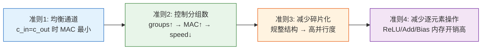

# ShuffleNet：高效网络设计的艺术

## 引言

ShuffleNet是AI四小龙之一**旷视科技（Face++）**的代表之作，算是一个里程碑式的成果<cite>[1]</cite>。第一作者张祥雨也是ResNet的作者之一。

ShuffleNet和Google的MobileNet一样，都是轻量级模型的代表作。正如其名，ShuffleNet融入了**Channel Shuffle（通道重排）**机制，目的在于**解决组卷积中组内关联性低的问题**<cite>[1]</cite>。

更重要的是，ShuffleNet V2提出了设计轻量级网络的**通用准则**<cite>[2]</cite>，这些准则对后续研究有重要指导意义。

## 系列概览

### 论文列表

* **[2017] ShuffleNet V1**：[ShuffleNet: An Extremely Efficient Convolutional Neural Network for Mobile Devices](https://arxiv.org/abs/1707.01083v1)
* **[2018] ShuffleNet V2**：[ShuffleNet V2: Practical Guidelines for Efficient CNN Architecture Design](https://arxiv.org/abs/1807.11164)

## 1. ShuffleNet V1 (2017)



**目标**：设计极致轻量的CNN，解决1×1卷积的计算瓶颈

### 核心问题

MobileNet使用深度可分离卷积大幅减少了3×3卷积的计算量，但**1×1卷积仍然占据了大量计算**！

### 核心创新

#### 1. 组卷积（Group Convolution）


**思想**：将输入通道分成g组，每组独立进行卷积。

```python
# 标准卷积
nn.Conv2d(in_channels=256, out_channels=256, kernel_size=1)
# 参数量：256 × 256 = 65,536

# 组卷积 (groups=4)
nn.Conv2d(in_channels=256, out_channels=256, kernel_size=1, groups=4)
# 参数量：(256/4) × (256/4) × 4 = 16,384  # 减少75%！
```

**组卷积与DW卷积的关系**：
* **DW卷积**：`groups = in_channels`（每个通道一组）
* **组卷积**：`groups = g`（多个通道一组）

#### 2. Channel Shuffle（通道重排）


**问题**：组卷积导致组间信息无法交流！

**解决方案**：在组卷积之间插入Channel Shuffle操作。

```python
def channel_shuffle(x, groups):
    """通道重排操作"""
    batch_size, num_channels, height, width = x.size()
    channels_per_group = num_channels // groups
    
    # reshape
    x = x.view(batch_size, groups, channels_per_group, height, width)
    
    # transpose
    x = torch.transpose(x, 1, 2).contiguous()
    
    # flatten
    x = x.view(batch_size, -1, height, width)
    
    return x
```

**效果**：
* 组1的输出 → 分散到所有组的输入
* 组2的输出 → 分散到所有组的输入
* ...
* 实现组间信息交流！


### ShuffleNet单元


```python
class ShuffleNetV1Block(nn.Module):
    def __init__(self, in_channels, out_channels, stride, groups):
        super(ShuffleNetV1Block, self).__init__()
        
        mid_channels = out_channels // 4
        
        # 1×1组卷积 + Channel Shuffle
        self.conv1 = nn.Sequential(
            nn.Conv2d(in_channels, mid_channels, kernel_size=1, 
                     groups=groups, bias=False),
            nn.BatchNorm2d(mid_channels),
            nn.ReLU(inplace=True)
        )
        
        # 3×3深度卷积
        self.conv2 = nn.Sequential(
            nn.Conv2d(mid_channels, mid_channels, kernel_size=3, 
                     stride=stride, padding=1, groups=mid_channels, bias=False),
            nn.BatchNorm2d(mid_channels)
        )
        
        # 1×1组卷积
        self.conv3 = nn.Sequential(
            nn.Conv2d(mid_channels, out_channels, kernel_size=1, 
                     groups=groups, bias=False),
            nn.BatchNorm2d(out_channels)
        )
        
        # Shortcut
        self.shortcut = nn.Sequential()
        if stride != 1 or in_channels != out_channels:
            self.shortcut = nn.Sequential(
                nn.AvgPool2d(kernel_size=3, stride=stride, padding=1)
            )
        
        self.relu = nn.ReLU(inplace=True)
        self.groups = groups
    
    def forward(self, x):
        identity = self.shortcut(x)
        
        x = self.conv1(x)
        x = channel_shuffle(x, self.groups)  # 关键！
        x = self.conv2(x)
        x = self.conv3(x)
        
        if identity.size(1) != x.size(1):
            x = torch.cat([identity, x], dim=1)
        else:
            x = x + identity
        
        x = self.relu(x)
        return x
```

### 网络结构


### 主要贡献

1. **组卷积用于1×1卷积**：大幅减少计算量 <cite>[1]</cite>
2. **Channel Shuffle**：解决组间信息交流问题 <cite>[1]</cite>
3. **评价指标的讨论**：强调直接指标（速度）vs 间接指标（FLOPs） <cite>[1]</cite>

### 评价指标的思考

**FLOPs不等于速度**<cite>[1]</cite>！

作者指出：
* ❌ FLOPs只是理论计算量
* ✅ 实际速度还受到：
  - 内存访问成本（MAC）
  - 并行度
  - 硬件实现效率

**真正的评价指标**：
* Images/sec（每秒处理图像数）
* Batches/sec（每秒处理批次数）
* 实际推理延迟（ms）

## 2. ShuffleNet V2 (2018)

### 核心观点

V2最重要的贡献是总结出**设计轻量级网络的实用准则**<cite>[2]</cite>。

### 四大设计准则

#### 准则1：通道数相同时MAC最小

**内存访问成本（Memory Access Cost, MAC）**：

对于1×1卷积：
$$
\text{MAC} = hw(c_1 + c_2) + c_1 c_2
$$

当 \(c_1 = c_2\) 时，MAC最小！

**结论**：输入通道数 = 输出通道数时，速度最快。

#### 准则2：过多分组会增加MAC

**实验发现**：
* groups = 1：速度最快
* groups = 2：速度略慢
* groups = 4：速度明显下降
* groups = 8：速度大幅下降

**原因**：
* 分组增加了内存访问次数
* 降低了缓存利用率
* 减少了并行度

**结论**：谨慎使用分组卷积，分组数不宜过多。

#### 准则3：网络碎片化降低并行度

**网络碎片化**：采用多路并行结构（如Inception）。

**问题**：
* 多路结构需要多次kernel launch
* 降低GPU并行效率
* 增加同步开销

**结论**：减少碎片化操作，使用更规整的结构。

#### 准则4：元素级操作不能忽视

**元素级操作**：
* ReLU
* Add（残差连接）
* Bias Add
* ...

这些操作：
* FLOPs很少（几乎为0）
* 但MAC很大！
* 影响实际速度

**实验**：去掉残差连接中的ReLU和shortcut，速度提升20%！

**结论**：减少元素级操作。



### V2的设计

基于四大准则，V2重新设计了ShuffleNet单元<cite>[2]</cite>：


```python
class ShuffleNetV2Block(nn.Module):
    def __init__(self, in_channels, out_channels, stride):
        super(ShuffleNetV2Block, self).__init__()
        
        if stride == 1:
            assert in_channels == out_channels
            branch_channels = in_channels // 2
        else:
            branch_channels = out_channels // 2
        
        # 分支1：直连（stride=1）或下采样（stride=2）
        if stride == 1:
            self.branch1 = nn.Sequential()  # identity
        else:
            self.branch1 = nn.Sequential(
                nn.Conv2d(in_channels, in_channels, kernel_size=3, 
                         stride=stride, padding=1, groups=in_channels, bias=False),
                nn.BatchNorm2d(in_channels),
                nn.Conv2d(in_channels, branch_channels, kernel_size=1, bias=False),
                nn.BatchNorm2d(branch_channels),
                nn.ReLU(inplace=True)
            )
        
        # 分支2：处理分支
        self.branch2 = nn.Sequential(
            nn.Conv2d(in_channels if stride > 1 else branch_channels, 
                     branch_channels, kernel_size=1, bias=False),
            nn.BatchNorm2d(branch_channels),
            nn.ReLU(inplace=True),
            nn.Conv2d(branch_channels, branch_channels, kernel_size=3, 
                     stride=stride, padding=1, groups=branch_channels, bias=False),
            nn.BatchNorm2d(branch_channels),
            nn.Conv2d(branch_channels, branch_channels, kernel_size=1, bias=False),
            nn.BatchNorm2d(branch_channels),
            nn.ReLU(inplace=True)
        )
    
    def forward(self, x):
        if isinstance(self.branch1, nn.Sequential) and len(self.branch1) == 0:
            # stride = 1: channel split
            x1, x2 = x.chunk(2, dim=1)
            out = torch.cat([x1, self.branch2(x2)], dim=1)
        else:
            # stride = 2: two branches
            out = torch.cat([self.branch1(x), self.branch2(x)], dim=1)
        
        # Channel Shuffle
        out = channel_shuffle(out, groups=2)
        
        return out
```

### V1 vs V2对比

| 特性 | V1 | V2 |
|------|----|----|
| 分组卷积 | 大量使用 | 减少使用 |
| 残差连接 | Add | Concat |
| Channel Shuffle | 多处使用 | 简化使用 |
| 碎片化 | 较多 | 减少 |
| 设计依据 | 经验 | 系统性准则 |

### 性能对比

| 模型 | 参数量(M) | FLOPs(M) | 速度(ms) | Top-1准确率 |
|------|----------|---------|---------|-----------|
| ShuffleNet V1 1.0× | 1.9 | 140 | 7.3 | 67.6% |
| ShuffleNet V2 1.0× | 2.3 | 146 | **5.8** | **69.4%** |

**V2更快、更准！**<cite>[2]</cite>

## 设计准则的启示

### 为什么FLOPs不等于速度？

$$
\text{实际延迟} = \frac{\text{FLOPs}}{\text{算力}} + \text{MAC} + \text{Overhead}
$$

影响因素：
1. **内存访问**：读写数据的时间
2. **并行度**：GPU利用率
3. **数据搬运**：不同内存层级间的传输
4. **kernel启动**：操作启动的开销

### 实用建议

1. **优先使用规整结构**：减少碎片化
2. **注意通道数平衡**：输入输出通道数接近
3. **谨慎使用分组**：分组数不宜过多
4. **减少元素操作**：每个ReLU都有成本

## 实践经验

### 1. 选择合适的版本

```python
# 高精度场景
from torchvision.models import shufflenet_v2_x2_0
model = shufflenet_v2_x2_0(pretrained=True)

# 平衡场景
from torchvision.models import shufflenet_v2_x1_0
model = shufflenet_v2_x1_0(pretrained=True)

# 极致轻量
from torchvision.models import shufflenet_v2_x0_5
model = shufflenet_v2_x0_5(pretrained=True)
```

### 2. 硬件加速

```python
# 确保硬件支持分组卷积
# 在某些硬件上，分组卷积可能反而更慢！

# 可以使用benchmark测试
torch.backends.cudnn.benchmark = True
```

### 3. 模型部署

```python
# 转换为ONNX
import torch.onnx

model.eval()
dummy_input = torch.randn(1, 3, 224, 224)

torch.onnx.export(
    model,
    dummy_input,
    "shufflenet_v2.onnx",
    opset_version=11,
    input_names=['input'],
    output_names=['output'],
    dynamic_axes={'input': {0: 'batch_size'},
                  'output': {0: 'batch_size'}}
)
```

## ShuffleNet vs MobileNet

| 维度 | ShuffleNet V2 | MobileNet V2 |
|------|--------------|--------------|
| 核心技术 | Channel Shuffle | 逆残差 |
| 设计理念 | 速度优先 | FLOPs优先 |
| 理论基础 | 实用准则 | 信息流优化 |
| 参数量 | 更少 | 较少 |
| 实际速度 | 更快 | 较快 |
| 精度 | 相当 | 相当 |

## 应用场景

ShuffleNet特别适合：
* 📱 **移动端实时应用**：AR、人脸识别
* 🎥 **视频流处理**：实时目标检测
* 🤖 **边缘设备**：IoT、嵌入式系统
* 🚗 **自动驾驶**：实时感知系统

## 模型复现

我在PyTorch平台上复现了ShuffleNet系列：

* **平台**：PyTorch
* **主要库**：torchvision, torch, matplotlib, tqdm
* **数据集**：Oxford Flower102花分类数据集
* **代码地址**：[GitHub - DeepLearning/model_classification/ShuffleNet](https://github.com/YangCazz/DeepLearning/tree/master/model_classification/ShuffleNet)

## 总结

### ShuffleNet V1的贡献 <cite>[1]</cite>

1. **组卷积的创新应用**：用于1×1卷积
2. **Channel Shuffle**：解决组间信息交流
3. **评价指标的思考**：强调实际速度

### ShuffleNet V2的贡献 <cite>[2]</cite>

1. **四大设计准则**：系统性的网络设计指导
2. **更好的性能**：更快、更准
3. **实用主义**：从实际部署角度设计网络

### 关键启示

* **FLOPs不等于速度**：要关注MAC和并行度
* **简单即美**：规整的结构更高效
* **理论指导实践**：系统的准则胜过经验
* **端到端优化**：从设计到部署全流程考虑

## 影响

ShuffleNet系列：
* 📊 提出了系统性的轻量化网络设计准则
* 🔧 推动了移动端AI的发展
* 🚀 在工业界得到广泛应用
* 🎓 启发了后续众多研究

**ShuffleNet证明了：设计网络不仅是艺术，更是科学！**

## 参考文献

<ol class="references">
<li>Zhang, X., et al. <em>ShuffleNet: An Extremely Efficient Convolutional Neural Network for Mobile Devices</em>. CVPR, 2018. arXiv: <a href="https://arxiv.org/abs/1707.01083">1707.01083</a></li>
<li>Ma, N., et al. <em>ShuffleNet V2: Practical Guidelines for Efficient CNN Architecture Design</em>. ECCV, 2018. arXiv: <a href="https://arxiv.org/abs/1807.11164">1807.11164</a></li>
<li>我的GitHub代码仓库: <a href="https://github.com/YangCazz/DeepLearning">https://github.com/YangCazz/DeepLearning</a></li>
</ol>

---



