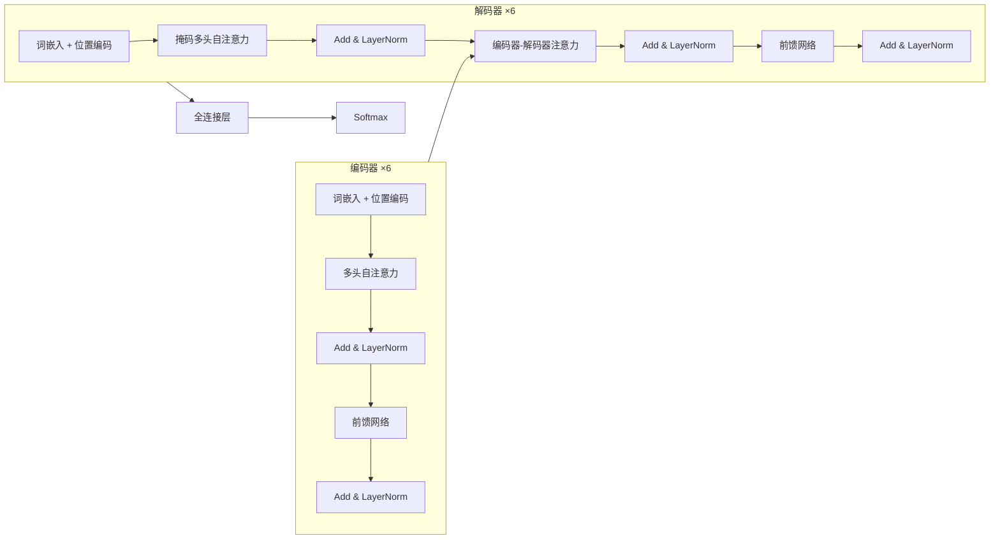
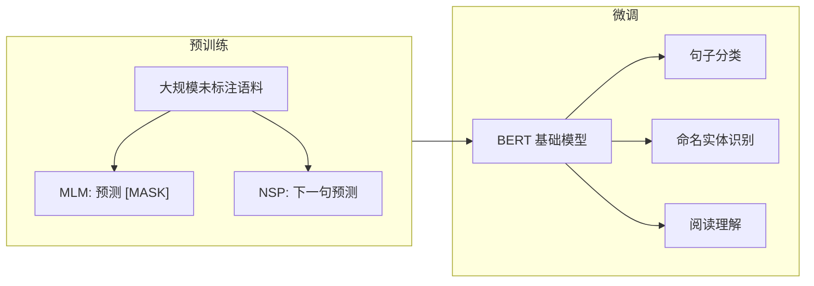

# Transformer与BERT：自然语言处理的革命

## 引言

2017年，Google发表了论文《Attention Is All You Need》<cite>[1]</cite>，提出了Transformer架构。这一工作不仅革新了NLP领域，更影响了整个深度学习的发展方向。

**"Attention Is All You Need"** —— 你只需要注意力机制，不需要RNN和CNN！

## Transformer (2017)



**影响**：NLP领域的里程碑

### 为什么需要Transformer？

#### RNN/CNN的局限

**RNN的问题**：
* ❌ 无法并行计算
* ❌ 长依赖问题
* ❌ 梯度消失/爆炸

**CNN的问题**：
* ❌ 感受野受限
* ❌ 难以建模长距离依赖

**解决方案**<cite>[1]</cite>：**完全基于Attention机制！**

### Transformer架构


#### 整体结构

**Encoder-Decoder架构**：
* **Encoder**：6层（论文中）
  - Multi-Head Self-Attention
  - Position-wise Feed-Forward Network
  
* **Decoder**：6层
  - Masked Multi-Head Self-Attention
  - Encoder-Decoder Attention
  - Position-wise Feed-Forward Network



### 核心组件详解

#### Multi-Head Self-Attention


**单头注意力**<cite>[1]</cite>：

$$
\text{Attention}(Q, K, V) = \text{softmax}\left(\frac{QK^T}{\sqrt{d_k}}\right)V
$$

**多头注意力**：


$$
\text{MultiHead}(Q, K, V) = \text{Concat}(head_1, ..., head_h)W^O
$$

$$
head_i = \text{Attention}(QW_i^Q, KW_i^K, VW_i^V)
$$

```python
import torch
import torch.nn as nn
import torch.nn.functional as F
import math

class MultiHeadAttention(nn.Module):
    def __init__(self, d_model, num_heads, dropout=0.1):
        super(MultiHeadAttention, self).__init__()
        assert d_model % num_heads == 0
        
        self.d_model = d_model
        self.num_heads = num_heads
        self.d_k = d_model // num_heads
        
        # Q, K, V线性变换
        self.W_q = nn.Linear(d_model, d_model)
        self.W_k = nn.Linear(d_model, d_model)
        self.W_v = nn.Linear(d_model, d_model)
        
        # 输出线性变换
        self.W_o = nn.Linear(d_model, d_model)
        
        self.dropout = nn.Dropout(dropout)
    
    def scaled_dot_product_attention(self, Q, K, V, mask=None):
        """缩放点积注意力"""
        # Q, K, V: (batch, num_heads, seq_len, d_k)
        
        # 1. 计算注意力分数
        scores = torch.matmul(Q, K.transpose(-2, -1)) / math.sqrt(self.d_k)
        # scores: (batch, num_heads, seq_len, seq_len)
        
        # 2. 应用mask（可选）
        if mask is not None:
            scores = scores.masked_fill(mask == 0, -1e9)
        
        # 3. Softmax
        attention = F.softmax(scores, dim=-1)
        attention = self.dropout(attention)
        
        # 4. 加权求和
        output = torch.matmul(attention, V)
        # output: (batch, num_heads, seq_len, d_k)
        
        return output, attention
    
    def forward(self, query, key, value, mask=None):
        batch_size = query.size(0)
        
        # 1. 线性变换
        Q = self.W_q(query)  # (batch, seq_len, d_model)
        K = self.W_k(key)
        V = self.W_v(value)
        
        # 2. 分割成多头
        Q = Q.view(batch_size, -1, self.num_heads, self.d_k).transpose(1, 2)
        K = K.view(batch_size, -1, self.num_heads, self.d_k).transpose(1, 2)
        V = V.view(batch_size, -1, self.num_heads, self.d_k).transpose(1, 2)
        # Q, K, V: (batch, num_heads, seq_len, d_k)
        
        # 3. 缩放点积注意力
        x, attention = self.scaled_dot_product_attention(Q, K, V, mask)
        # x: (batch, num_heads, seq_len, d_k)
        
        # 4. 合并多头
        x = x.transpose(1, 2).contiguous()
        # x: (batch, seq_len, num_heads, d_k)
        
        x = x.view(batch_size, -1, self.d_model)
        # x: (batch, seq_len, d_model)
        
        # 5. 输出投影
        x = self.W_o(x)
        
        return x, attention
```

#### Position-wise Feed-Forward Network

**前馈网络**：两层全连接，第一层带ReLU激活。

$$
\text{FFN}(x) = \max(0, xW_1 + b_1)W_2 + b_2
$$

```python
class PositionwiseFeedForward(nn.Module):
    def __init__(self, d_model, d_ff, dropout=0.1):
        super(PositionwiseFeedForward, self).__init__()
        
        self.fc1 = nn.Linear(d_model, d_ff)
        self.fc2 = nn.Linear(d_ff, d_model)
        self.dropout = nn.Dropout(dropout)
        self.relu = nn.ReLU()
    
    def forward(self, x):
        # x: (batch, seq_len, d_model)
        x = self.fc1(x)      # (batch, seq_len, d_ff)
        x = self.relu(x)
        x = self.dropout(x)
        x = self.fc2(x)      # (batch, seq_len, d_model)
        return x
```

#### Positional Encoding

**位置编码**<cite>[1]</cite>：由于Self-Attention本身不考虑位置，需要添加位置信息。

$$
PE_{(pos, 2i)} = \sin\left(\frac{pos}{10000^{2i/d_{model}}}\right)
$$

$$
PE_{(pos, 2i+1)} = \cos\left(\frac{pos}{10000^{2i/d_{model}}}\right)
$$

```python
class PositionalEncoding(nn.Module):
    def __init__(self, d_model, max_len=5000, dropout=0.1):
        super(PositionalEncoding, self).__init__()
        self.dropout = nn.Dropout(dropout)
        
        # 创建位置编码矩阵
        pe = torch.zeros(max_len, d_model)
        position = torch.arange(0, max_len, dtype=torch.float).unsqueeze(1)
        div_term = torch.exp(torch.arange(0, d_model, 2).float() * 
                            (-math.log(10000.0) / d_model))
        
        pe[:, 0::2] = torch.sin(position * div_term)
        pe[:, 1::2] = torch.cos(position * div_term)
        
        pe = pe.unsqueeze(0)  # (1, max_len, d_model)
        self.register_buffer('pe', pe)
    
    def forward(self, x):
        # x: (batch, seq_len, d_model)
        x = x + self.pe[:, :x.size(1), :]
        return self.dropout(x)
```

#### Layer Normalization

**层归一化**：在特征维度上归一化。

$$
\text{LayerNorm}(x) = \gamma \cdot \frac{x - \mu}{\sqrt{\sigma^2 + \epsilon}} + \beta
$$

```python
class LayerNorm(nn.Module):
    def __init__(self, features, eps=1e-6):
        super(LayerNorm, self).__init__()
        self.gamma = nn.Parameter(torch.ones(features))
        self.beta = nn.Parameter(torch.zeros(features))
        self.eps = eps
    
    def forward(self, x):
        # x: (batch, seq_len, features)
        mean = x.mean(-1, keepdim=True)
        std = x.std(-1, keepdim=True)
        return self.gamma * (x - mean) / (std + self.eps) + self.beta
```

#### 残差连接

**Add & Norm**：每个子层都有残差连接和层归一化。

$$
\text{Output} = \text{LayerNorm}(x + \text{Sublayer}(x))
$$

### Encoder Layer

```python
class EncoderLayer(nn.Module):
    def __init__(self, d_model, num_heads, d_ff, dropout=0.1):
        super(EncoderLayer, self).__init__()
        
        # Multi-Head Self-Attention
        self.self_attn = MultiHeadAttention(d_model, num_heads, dropout)
        
        # Feed-Forward Network
        self.ffn = PositionwiseFeedForward(d_model, d_ff, dropout)
        
        # Layer Normalization
        self.norm1 = nn.LayerNorm(d_model)
        self.norm2 = nn.LayerNorm(d_model)
        
        # Dropout
        self.dropout = nn.Dropout(dropout)
    
    def forward(self, x, mask=None):
        # x: (batch, seq_len, d_model)
        
        # 1. Multi-Head Self-Attention + Add & Norm
        attn_output, _ = self.self_attn(x, x, x, mask)
        x = self.norm1(x + self.dropout(attn_output))
        
        # 2. Feed-Forward Network + Add & Norm
        ffn_output = self.ffn(x)
        x = self.norm2(x + self.dropout(ffn_output))
        
        return x
```

### Decoder Layer

```python
class DecoderLayer(nn.Module):
    def __init__(self, d_model, num_heads, d_ff, dropout=0.1):
        super(DecoderLayer, self).__init__()
        
        # Masked Multi-Head Self-Attention
        self.masked_self_attn = MultiHeadAttention(d_model, num_heads, dropout)
        
        # Encoder-Decoder Attention
        self.enc_dec_attn = MultiHeadAttention(d_model, num_heads, dropout)
        
        # Feed-Forward Network
        self.ffn = PositionwiseFeedForward(d_model, d_ff, dropout)
        
        # Layer Normalization
        self.norm1 = nn.LayerNorm(d_model)
        self.norm2 = nn.LayerNorm(d_model)
        self.norm3 = nn.LayerNorm(d_model)
        
        # Dropout
        self.dropout = nn.Dropout(dropout)
    
    def forward(self, x, enc_output, src_mask=None, tgt_mask=None):
        # x: (batch, tgt_seq_len, d_model)
        # enc_output: (batch, src_seq_len, d_model)
        
        # 1. Masked Multi-Head Self-Attention
        attn_output, _ = self.masked_self_attn(x, x, x, tgt_mask)
        x = self.norm1(x + self.dropout(attn_output))
        
        # 2. Encoder-Decoder Attention
        attn_output, _ = self.enc_dec_attn(x, enc_output, enc_output, src_mask)
        x = self.norm2(x + self.dropout(attn_output))
        
        # 3. Feed-Forward Network
        ffn_output = self.ffn(x)
        x = self.norm3(x + self.dropout(ffn_output))
        
        return x
```

### 完整Transformer

```python
class Transformer(nn.Module):
    def __init__(self, src_vocab_size, tgt_vocab_size, d_model=512, num_heads=8, 
                 num_encoder_layers=6, num_decoder_layers=6, d_ff=2048, 
                 max_seq_len=5000, dropout=0.1):
        super(Transformer, self).__init__()
        
        # Embeddings
        self.src_embedding = nn.Embedding(src_vocab_size, d_model)
        self.tgt_embedding = nn.Embedding(tgt_vocab_size, d_model)
        
        # Positional Encoding
        self.pos_encoding = PositionalEncoding(d_model, max_seq_len, dropout)
        
        # Encoder
        self.encoder_layers = nn.ModuleList([
            EncoderLayer(d_model, num_heads, d_ff, dropout) 
            for _ in range(num_encoder_layers)
        ])
        
        # Decoder
        self.decoder_layers = nn.ModuleList([
            DecoderLayer(d_model, num_heads, d_ff, dropout)
            for _ in range(num_decoder_layers)
        ])
        
        # 输出层
        self.fc_out = nn.Linear(d_model, tgt_vocab_size)
        
        self.dropout = nn.Dropout(dropout)
        self.d_model = d_model
    
    def forward(self, src, tgt, src_mask=None, tgt_mask=None):
        # src: (batch, src_seq_len)
        # tgt: (batch, tgt_seq_len)
        
        # 1. Embedding + Positional Encoding
        src = self.src_embedding(src) * math.sqrt(self.d_model)
        src = self.pos_encoding(src)
        
        tgt = self.tgt_embedding(tgt) * math.sqrt(self.d_model)
        tgt = self.pos_encoding(tgt)
        
        # 2. Encoder
        for layer in self.encoder_layers:
            src = layer(src, src_mask)
        
        # 3. Decoder
        for layer in self.decoder_layers:
            tgt = layer(tgt, src, src_mask, tgt_mask)
        
        # 4. 输出
        output = self.fc_out(tgt)
        
        return output
```

### Transformer的优势

1. **并行化**：完全并行，训练快
2. **长依赖**：直接建模任意距离的依赖
3. **可解释性**：注意力权重可视化
4. **通用性**：适用于各类序列任务

### Transformer的应用

* ✅ **机器翻译**：Google Translate
* ✅ **文本生成**：GPT系列<cite>[3]</cite>
* ✅ **语言理解**：BERT系列<cite>[2]</cite>
* ✅ **对话系统**：ChatGPT
* ✅ **代码生成**：Codex, GitHub Copilot
* ✅ **计算机视觉**：Vision Transformer

## BERT (2018)



### BERT的创新

#### 双向Transformer


**与GPT的区别**：
* **GPT**<cite>[3]</cite>：单向（从左到右）
* **BERT**<cite>[2]</cite>：双向（同时看左右）

**优势**<cite>[2]</cite>：更好地理解上下文。

#### 预训练 + 微调范式

**两阶段训练**：
1. **Pre-training**：在大规模无标注数据上预训练
2. **Fine-tuning**：在下游任务上微调

#### 三种嵌入

**Token Embedding + Segment Embedding + Position Embedding**

```python
# BERT的输入表示
input_embedding = token_embedding + segment_embedding + position_embedding
```

### BERT的预训练任务

#### 任务1：Masked Language Model (MLM)

**思想**<cite>[2]</cite>：随机遮蔽15%的词，让模型预测。

```
输入：The [MASK] sat on the [MASK].
目标：预测 cat 和 mat
```

**实现**：
* 80%的时间：用[MASK]替换
* 10%的时间：用随机词替换
* 10%的时间：保持不变

#### 任务2：Next Sentence Prediction (NSP)

**思想**<cite>[2]</cite>：判断两个句子是否相邻。

```
输入A：[CLS] The cat sat. [SEP] It was tired. [SEP]
标签：IsNext

输入B：[CLS] The cat sat. [SEP] The dog ran. [SEP]
标签：NotNext
```



### BERT的架构

**两种规模**<cite>[2]</cite>：

| 模型 | 层数 | 隐藏层大小 | 注意力头数 | 参数量 |
|------|------|-----------|----------|--------|
| BERT-Base | 12 | 768 | 12 | 110M |
| BERT-Large | 24 | 1024 | 16 | 340M |

### BERT的使用

#### 句子分类

```python
# 使用[CLS]的输出
class BERTClassifier(nn.Module):
    def __init__(self, bert_model, num_classes):
        super(BERTClassifier, self).__init__()
        self.bert = bert_model
        self.classifier = nn.Linear(bert_model.config.hidden_size, num_classes)
    
    def forward(self, input_ids, attention_mask):
        outputs = self.bert(input_ids, attention_mask=attention_mask)
        cls_output = outputs.last_hidden_state[:, 0, :]  # [CLS] token
        logits = self.classifier(cls_output)
        return logits
```

#### Token分类（NER）

```python
# 使用每个token的输出
class BERTTokenClassifier(nn.Module):
    def __init__(self, bert_model, num_labels):
        super(BERTTokenClassifier, self).__init__()
        self.bert = bert_model
        self.classifier = nn.Linear(bert_model.config.hidden_size, num_labels)
    
    def forward(self, input_ids, attention_mask):
        outputs = self.bert(input_ids, attention_mask=attention_mask)
        sequence_output = outputs.last_hidden_state  # All tokens
        logits = self.classifier(sequence_output)
        return logits
```

#### 问答系统

```python
# 预测答案的起始和结束位置
class BERTForQuestionAnswering(nn.Module):
    def __init__(self, bert_model):
        super(BERTForQuestionAnswering, self).__init__()
        self.bert = bert_model
        self.qa_outputs = nn.Linear(bert_model.config.hidden_size, 2)  # start & end
    
    def forward(self, input_ids, attention_mask):
        outputs = self.bert(input_ids, attention_mask=attention_mask)
        sequence_output = outputs.last_hidden_state
        
        logits = self.qa_outputs(sequence_output)
        start_logits, end_logits = logits.split(1, dim=-1)
        
        return start_logits.squeeze(-1), end_logits.squeeze(-1)
```

### BERT的影响

**BERT开启了预训练语言模型的时代**：

```
BERT (2018)
  ↓
RoBERTa (2019): 改进训练策略
  ↓
ALBERT (2019): 参数共享
  ↓
ELECTRA (2020): 更高效的预训练
  ↓
DeBERTa (2020): 解耦注意力
```

### 性能提升

BERT在11个NLP任务上刷新SOTA<cite>[2]</cite>：

| 任务 | 之前SOTA | BERT-Base | BERT-Large |
|------|---------|-----------|-----------|
| GLUE | 68.9 | 78.5 | 80.4 |
| SQuAD 1.1 | 84.1 | 88.5 | 90.9 |
| SQuAD 2.0 | 66.3 | 73.7 | 80.0 |

## Transformer vs RNN vs CNN

| 维度 | RNN | CNN | Transformer |
|------|-----|-----|-------------|
| 计算复杂度 | O(n) | O(1) | O(n²) |
| 序列操作数 | O(n) | O(log n) | O(1) |
| 最长路径 | O(n) | O(log n) | O(1) |
| 并行性 | 低 | 高 | 高 |
| 长依赖 | 差 | 中 | 好 |

## 实践建议

### 使用预训练BERT

```python
from transformers import BertModel, BertTokenizer

# 加载预训练模型
tokenizer = BertTokenizer.from_pretrained('bert-base-uncased')
model = BertModel.from_pretrained('bert-base-uncased')

# 编码文本
text = "Hello, how are you?"
encoded = tokenizer(text, return_tensors='pt')

# 获取表示
with torch.no_grad():
    outputs = model(**encoded)
    last_hidden_state = outputs.last_hidden_state
```

### 微调技巧

```python
# 1. 使用较小的学习率
optimizer = torch.optim.AdamW(model.parameters(), lr=2e-5)

# 2. 使用warmup
from transformers import get_linear_schedule_with_warmup

scheduler = get_linear_schedule_with_warmup(
    optimizer,
    num_warmup_steps=500,
    num_training_steps=10000
)

# 3. 梯度裁剪
torch.nn.utils.clip_grad_norm_(model.parameters(), max_norm=1.0)
```

### 节省内存

```python
# 1. 梯度累积
accumulation_steps = 4

for i, batch in enumerate(train_loader):
    loss = model(batch) / accumulation_steps
    loss.backward()
    
    if (i + 1) % accumulation_steps == 0:
        optimizer.step()
        optimizer.zero_grad()

# 2. 混合精度训练
from torch.cuda.amp import autocast, GradScaler

scaler = GradScaler()

with autocast():
    outputs = model(**inputs)
    loss = criterion(outputs, labels)

scaler.scale(loss).backward()
scaler.step(optimizer)
scaler.update()
```

## 总结

### Transformer的革命性

1. **Attention Is All You Need**：摒弃RNN和CNN
2. **完全并行**：训练速度大幅提升
3. **长依赖建模**：任意距离直接连接
4. **通用架构**：适用于NLP和CV

### BERT的突破

1. **双向建模**：更好的上下文理解
2. **预训练-微调范式**：迁移学习新高度
3. **刷新SOTA**：11个任务全面领先
4. **催生生态**：无数变体和应用

### 关键启示

* **预训练很重要**：大规模无监督学习
* **双向更强**：同时看左右上下文
* **规模效应**：更大的模型，更好的效果
* **迁移学习**：一次预训练，处处使用

## 影响与应用

Transformer和BERT：
* 📊 革新了NLP领域的方法论
* 🔧 催生了GPT、ChatGPT等大语言模型<cite>[3]</cite>
* 🚀 扩展到计算机视觉（ViT）
* 🎓 成为深度学习的主流架构

**Transformer改变了AI的未来！**

## 参考文献

<ol class="references">
<li>Vaswani, A., Shazeer, N., Parmar, N., Uszkoreit, J., Jones, L., Gomez, A. N., Kaiser, L., and Polosukhin, I. <em>Attention Is All You Need</em>. NeurIPS, 2017. arXiv: <a href="https://arxiv.org/abs/1706.03762">1706.03762</a></li>
<li>Devlin, J., Chang, M.-W., Lee, K., and Toutanova, K. <em>BERT: Pre-training of Deep Bidirectional Transformers for Language Understanding</em>. NAACL, 2019. arXiv: <a href="https://arxiv.org/abs/1810.04805">1810.04805</a></li>
<li>Radford, A., Narasimhan, K., Salimans, T., and Sutskever, I. <em>Improving Language Understanding by Generative Pre-Training</em>. 2018.</li>
</ol>

---



