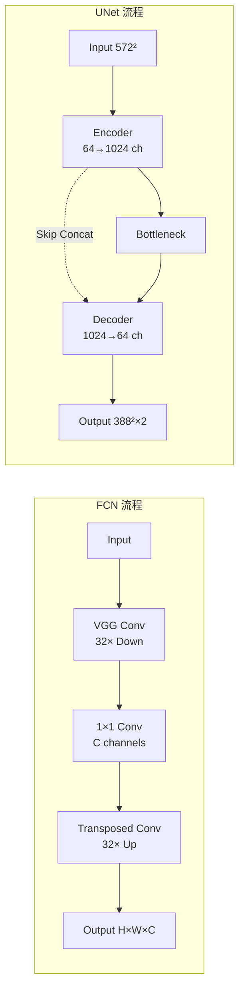

## 引言

医学图像分割是计算机辅助诊断中的核心任务，旨在从医学影像（如CT、MRI、X射线等）中精确划分出感兴趣区域（ROI），如器官、病灶或组织结构。传统方法依赖手工特征和复杂的图像处理技术，不仅耗时且精度有限。

2015年，两个划时代的网络——**FCN**（Fully Convolutional Networks）<cite>[1]</cite>和**UNet**<cite>[2]</cite>——彻底改变了这一领域，开启了深度学习在医学图像分割中的应用新纪元。

### 为什么医学图像分割如此重要？

- **精准诊断**：准确分割肿瘤边界辅助制定治疗方案
- **手术规划**：3D重建器官帮助外科医生规划手术路径
- **疗效评估**：量化病灶大小变化监测治疗效果
- **临床研究**：大规模数据分析支持医学研究

### 从分类到分割的演进

深度学习在图像分类任务（ImageNet）上取得巨大成功后，研究者开始探索如何将其应用于更精细的像素级任务——语义分割。

**分类 vs. 分割**：
```
分类（Image Classification）：
输入：整张图像
输出：类别标签 (如 "猫", "狗")

分割（Semantic Segmentation）：
输入：整张图像
输出：每个像素的类别标签
```

---

## FCN：全卷积网络的诞生



### 核心思想

**关键创新**：将分类网络（如VGG、AlexNet）的全连接层替换为卷积层，使网络能够接受任意尺寸的输入并输出空间分割图。<cite>[1]</cite>

**Why "Fully Convolutional"?**

传统分类网络结构：
```
Input → Conv layers → FC layers → Class scores
(H×W×3)  (特征图)      (向量)      (1×1×C)
```

FCN结构：
```
Input → Conv layers → Conv layers → Pixel-wise prediction
(H×W×3)  (下采样)      (上采样)      (H×W×C)
```

### 网络架构

FCN提出了三种变体：**FCN-32s**、**FCN-16s**、**FCN-8s**，数字表示上采样的步长。

#### FCN-32s（最简单版本）

```python
# 伪代码示意
Input (H×W×3)
  ↓
VGG Conv layers (下采样32倍)
  ↓ Feature map (H/32 × W/32 × 4096)
  ↓
1×1 Conv (降维到类别数C)
  ↓ (H/32 × W/32 × C)
  ↓
32× Upsampling (转置卷积)
  ↓
Output (H×W×C)
```

#### FCN-16s 和 FCN-8s（添加跳跃连接）

为了恢复细节，FCN-16s和FCN-8s引入了**跳跃连接**（Skip Connections）<cite>[1]</cite>，融合不同层次的特征。

```
Pool3 (H/8 × W/8) ────┐
                       ├─→ Fusion → 8× Upsample → Output
Pool4 (H/16 × W/16) ──┤
                       │
Pool5 (H/32 × W/32) ──┘
```

### 数学定义

#### 转置卷积（Transposed Convolution）

也称为反卷积（Deconvolution），用于上采样特征图。

设输入特征图 \( X \in \mathbb{R}^{H \times W \times C} \)，转置卷积的输出为：

$$
Y = f_{\text{deconv}}(X; W, s, p)
$$

其中：
- \( W \) 是卷积核权重
- \( s \) 是步长（stride）
- \( p \) 是填充（padding）

输出尺寸计算：
$$
H_{\text{out}} = (H_{\text{in}} - 1) \times s + k - 2p
$$

**示例**：步长为2的3×3转置卷积可以将特征图放大2倍。

#### 跳跃连接融合

设不同层的特征图为 \( F_{\text{pool3}}, F_{\text{pool4}}, F_{\text{pool5}} \)，融合方式为：

$$
F_{\text{fused}} = \text{Upsample}(F_{\text{pool5}}) + F_{\text{pool4}}
$$

逐步融合：
$$
F_{\text{final}} = \text{Upsample}(F_{\text{fused}}) + F_{\text{pool3}}
$$

#### 损失函数

像素级交叉熵损失（Pixel-wise Cross Entropy）：

$$
\mathcal{L} = -\frac{1}{N} \sum_{i=1}^{N} \sum_{c=1}^{C} y_{i,c} \log(\hat{y}_{i,c})
$$

其中：
- \( N \) 是像素总数
- \( C \) 是类别数
- \( y_{i,c} \) 是像素 \( i \) 的真实标签
- \( \hat{y}_{i,c} \) 是预测概率

### FCN的局限性

1. **细节丢失**：即使有跳跃连接，8倍下采样仍会损失细节
2. **边界模糊**：分割边界不够精确
3. **小目标困难**：对小尺寸目标分割效果差
4. **计算效率**：全卷积层参数量较大

### FCN vs UNet 流程对比



---

## UNet：医学图像分割的里程碑



### 为什么UNet是医学图像的完美匹配？

医学图像分割面临独特挑战：
1. **小样本问题**：医学数据标注成本高，数据量有限
2. **高精度要求**：临床应用需要精确的像素级分割
3. **上下文重要**：需要同时捕捉局部细节和全局上下文
4. **多尺度特征**：病灶大小差异大，需要多尺度信息

**UNet的设计完美解决了这些问题。**<cite>[2]</cite>

### 核心创新

#### 对称的U型结构

UNet得名于其独特的U型架构：
```
        Contracting Path          Expanding Path
              (编码器)                (解码器)
                 
Input ──→ Conv→ Conv→ Pool ──────────────→ Up→ Conv→ Conv
  ↓                 ↓                             ↑
572×572           Pool                          Up
                   ↓         Bottleneck          ↑
              Conv→Conv      (底部)         Conv→Conv
                   ↓            ↓                ↑
                  Pool    Conv→Conv            Up
                   ↓                            ↑
              Conv→Conv ──────────────→ Up→ Conv→Conv
                   ↓                            ↑
                  Pool                         Up
                   ↓                            ↑
              Conv→Conv ──────────────→ Up→ Conv→Conv
                                                ↑
                                           Output
                                         388×388
```

**左侧（Contracting Path）**：
- 重复应用：3×3卷积 + ReLU + 2×2最大池化
- 每次下采样，通道数翻倍（64 → 128 → 256 → 512 → 1024）
- 捕捉上下文信息

**右侧（Expanding Path）**：
- 重复应用：2×2转置卷积（上采样） + 3×3卷积 + ReLU
- 每次上采样，通道数减半
- 恢复空间分辨率

#### Skip Connections（跳跃连接）

**这是UNet最关键的创新！**<cite>[2]</cite>

每一层的编码器特征都被**裁剪并拼接**到对应的解码器层：

```python
# 伪代码
def forward(x):
    # Encoder
    e1 = conv_block(x)      # 572×572×64
    e2 = down(e1)           # 280×280×128
    e3 = down(e2)           # 136×136×256
    e4 = down(e3)           # 64×64×512
    
    # Bottleneck
    bottleneck = down(e4)   # 28×28×1024
    
    # Decoder with skip connections
    d4 = up(bottleneck, e4) # 64×64×512  (拼接e4)
    d3 = up(d4, e3)         # 136×136×256 (拼接e3)
    d2 = up(d3, e2)         # 280×280×128 (拼接e2)
    d1 = up(d2, e1)         # 572×572×64  (拼接e1)
    
    output = final_conv(d1) # 388×388×2
    return output
```

**为什么需要跳跃连接？**

1. **缓解梯度消失**：为深层网络提供梯度快速通道
2. **融合多尺度特征**：低层特征（细节）+ 高层特征（语义）
3. **精确定位**：编码器的空间信息帮助解码器恢复细节

### 网络架构详解

#### 基本构建块

```python
class DoubleConv(nn.Module):
    """两个3×3卷积层"""
    def __init__(self, in_channels, out_channels):
        super().__init__()
        self.conv = nn.Sequential(
            nn.Conv2d(in_channels, out_channels, kernel_size=3),
            nn.ReLU(inplace=True),
            nn.Conv2d(out_channels, out_channels, kernel_size=3),
            nn.ReLU(inplace=True)
        )
    
    def forward(self, x):
        return self.conv(x)

class Down(nn.Module):
    """下采样：MaxPool + DoubleConv"""
    def __init__(self, in_channels, out_channels):
        super().__init__()
        self.pool_conv = nn.Sequential(
            nn.MaxPool2d(2),
            DoubleConv(in_channels, out_channels)
        )
    
    def forward(self, x):
        return self.pool_conv(x)

class Up(nn.Module):
    """上采样：ConvTranspose + Concat + DoubleConv"""
    def __init__(self, in_channels, out_channels):
        super().__init__()
        self.up = nn.ConvTranspose2d(in_channels, in_channels // 2, 
                                      kernel_size=2, stride=2)
        self.conv = DoubleConv(in_channels, out_channels)
    
    def forward(self, x1, x2):
        x1 = self.up(x1)
        
        # 裁剪x2以匹配x1的尺寸
        diffY = x2.size()[2] - x1.size()[2]
        diffX = x2.size()[3] - x1.size()[3]
        x2 = F.pad(x2, [-diffX // 2, -diffX - diffX // 2,
                       -diffY // 2, -diffY - diffY // 2])
        
        # 拼接
        x = torch.cat([x2, x1], dim=1)
        return self.conv(x)
```

#### 完整UNet

```python
class UNet(nn.Module):
    def __init__(self, n_channels=3, n_classes=2):
        super(UNet, self).__init__()
        
        # Encoder
        self.inc = DoubleConv(n_channels, 64)
        self.down1 = Down(64, 128)
        self.down2 = Down(128, 256)
        self.down3 = Down(256, 512)
        self.down4 = Down(512, 1024)
        
        # Decoder
        self.up1 = Up(1024, 512)
        self.up2 = Up(512, 256)
        self.up3 = Up(256, 128)
        self.up4 = Up(128, 64)
        
        # Output
        self.outc = nn.Conv2d(64, n_classes, kernel_size=1)
    
    def forward(self, x):
        # Encoder
        x1 = self.inc(x)
        x2 = self.down1(x1)
        x3 = self.down2(x2)
        x4 = self.down3(x3)
        x5 = self.down4(x4)
        
        # Decoder with skip connections
        x = self.up1(x5, x4)
        x = self.up2(x, x3)
        x = self.up3(x, x2)
        x = self.up4(x, x1)
        
        # Output
        logits = self.outc(x)
        return logits
```

### 数学定义

#### 编码器路径

设输入图像 \( X^{(0)} \in \mathbb{R}^{H \times W \times C} \)，编码器的第 \( i \) 层输出为：

$$
X^{(i)} = \text{Pool}(\text{ReLU}(W_i^{(2)} * \text{ReLU}(W_i^{(1)} * X^{(i-1)})))
$$

其中 \( * \) 表示卷积操作。

**特征图尺寸变化**：
$$
H^{(i)} = \frac{H^{(i-1)}}{2}, \quad C^{(i)} = 2 \times C^{(i-1)}
$$

#### 解码器路径

解码器的第 \( j \) 层输出为：

$$
Y^{(j)} = \text{Conv}([Z^{(j)}, X^{(n-j)}])
$$

其中：
- \( Z^{(j)} = \text{Upsample}(Y^{(j-1)}) \) 是上采样结果
- \( [ \cdot, \cdot ] \) 表示通道维度的拼接（concatenation）
- \( X^{(n-j)} \) 是对应编码器层的特征（经过裁剪）

**上采样公式**：
$$
Z^{(j)} = f_{\text{up}}(Y^{(j-1)}; W_{\text{up}})
$$

其中 \( f_{\text{up}} \) 是2×2转置卷积，步长为2。

#### 损失函数

UNet原论文使用**加权交叉熵损失**，对边界像素赋予更高权重：

$$
\mathcal{L} = -\sum_{x \in \Omega} w(x) \log(p_{\ell(x)}(x))
$$

其中：
- \( \Omega \) 是图像域
- \( \ell(x) \) 是像素 \( x \) 的真实标签
- \( p_{\ell(x)}(x) \) 是预测该标签的概率
- \( w(x) \) 是权重图，用于强调边界

**权重图计算**：
$$
w(x) = w_c(x) + w_0 \cdot \exp\left(-\frac{(d_1(x) + d_2(x))^2}{2\sigma^2}\right)
$$

其中：
- \( w_c(x) \) 是类别平衡权重
- \( d_1(x) \) 是到最近细胞边界的距离
- \( d_2(x) \) 是到第二近边界的距离
- \( w_0 = 10, \sigma \approx 5 \) 像素

**现代实践中常用Dice Loss**：

$$
\mathcal{L}_{\text{Dice}} = 1 - \frac{2 \sum_{i=1}^{N} p_i g_i + \epsilon}{\sum_{i=1}^{N} p_i + \sum_{i=1}^{N} g_i + \epsilon}
$$

其中 \( p_i \) 是预测，\( g_i \) 是真值，\( \epsilon \) 是平滑项。

### 数据增强策略

**UNet成功的关键**：强大的数据增强，使得即使在小样本情况下也能训练出鲁棒的模型。

```python
# 常用增强方法
transforms = [
    # 几何变换
    RandomRotation(degrees=30),
    RandomHorizontalFlip(p=0.5),
    RandomVerticalFlip(p=0.5),
    RandomAffine(degrees=0, translate=(0.1, 0.1), scale=(0.9, 1.1)),
    ElasticTransform(alpha=50, sigma=5),  # 弹性形变
    
    # 强度变换
    RandomBrightnessContrast(p=0.5),
    RandomGamma(p=0.5),
    
    # 噪声
    GaussNoise(var_limit=(10.0, 50.0), p=0.3),
]
```

**弹性形变**（Elastic Deformation）对医学图像尤为重要：

$$
T(x, y) = (x + \alpha \cdot \Delta x, y + \alpha \cdot \Delta y)
$$

其中 \( \Delta x, \Delta y \) 是高斯平滑的随机位移场。

---

## FCN vs. UNet 对比

| 特性 | FCN | UNet |
|-----|-----|------|
| **提出时间** | 2015.3 (CVPR) | 2015.5 (MICCAI) |
| **初始目标** | 通用语义分割 | 医学图像分割 |
| **架构** | 非对称（编码器为主） | 对称（U型） |
| **跳跃连接** | 相加（Addition） | 拼接（Concatenation） |
| **特征融合** | 单次融合 | 每一层都融合 |
| **细节保留** | 较弱 | 强 |
| **参数量** | 相对较大 | 适中 |
| **医学应用** | 较少 | **极其广泛** |
| **后续影响** | 开创全卷积范式 | **医学分割标准** |

### 性能对比（在ISBI细胞分割挑战上）<cite>[1][2]</cite>

```
数据集：30张训练图像（512×512）

方法          IOU    Dice   边界精度
----------------------------------------
传统方法       0.77   0.87   中等
FCN-8s        0.83   0.91   较好
UNet          0.92   0.96   **优秀**
```

---

## 实际应用场景

### 细胞分割
- **任务**：分割显微镜图像中的细胞核
- **挑战**：细胞密集、边界模糊
- **UNet优势**：权重图强调边界

### 脑肿瘤分割（BraTS）
- **任务**：从MRI中分割肿瘤区域
- **挑战**：多模态输入（T1、T2、FLAIR）
- **UNet优势**：多通道输入支持

### 器官分割
- **任务**：CT中的肝脏、肾脏、脾脏分割
- **挑战**：器官大小差异大
- **UNet优势**：多尺度特征融合

### 病理图像分割
- **任务**：组织病理学图像中的腺体分割
- **挑战**：高分辨率、形态多样
- **UNet优势**：可处理大图像

---

## 实现技巧与最佳实践

### 输入尺寸选择

**原始UNet**：572×572 → 388×388（Valid卷积导致尺寸减小）

**现代实践**：使用**Same卷积**（padding=1）保持尺寸：

```python
nn.Conv2d(in_ch, out_ch, kernel_size=3, padding=1)  # Same卷积
```

推荐输入尺寸：
- 2D切片：256×256、512×512
- 大图像：使用滑动窗口或Patch-based方法

### 损失函数选择

```python
# 组合损失
class CombinedLoss(nn.Module):
    def __init__(self, alpha=0.5):
        super().__init__()
        self.alpha = alpha
        self.ce = nn.CrossEntropyLoss()
        self.dice = DiceLoss()
    
    def forward(self, pred, target):
        return self.alpha * self.ce(pred, target) + \
               (1 - self.alpha) * self.dice(pred, target)
```

### 批归一化（Batch Normalization）

现代UNet通常添加BN层：

```python
self.conv = nn.Sequential(
    nn.Conv2d(in_ch, out_ch, 3, padding=1),
    nn.BatchNorm2d(out_ch),  # 添加BN
    nn.ReLU(inplace=True),
    nn.Conv2d(out_ch, out_ch, 3, padding=1),
    nn.BatchNorm2d(out_ch),
    nn.ReLU(inplace=True)
)
```

### 深度监督（Deep Supervision）

在中间层添加辅助损失：

```python
# 在每个上采样阶段输出预测
aux_output1 = aux_head(d4)  # 低分辨率预测
aux_output2 = aux_head(d3)
final_output = final_head(d1)  # 最终预测

# 总损失
loss = loss_fn(final_output, target) + \
       0.3 * loss_fn(aux_output1, target_downsample) + \
       0.3 * loss_fn(aux_output2, target_downsample)
```

---

## 训练细节

### 超参数配置

```python
# 优化器
optimizer = torch.optim.Adam(model.parameters(), lr=1e-4)

# 学习率调度
scheduler = torch.optim.lr_scheduler.ReduceLROnPlateau(
    optimizer, mode='max', factor=0.5, patience=5, verbose=True
)

# 训练配置
config = {
    'batch_size': 8,
    'epochs': 100,
    'learning_rate': 1e-4,
    'weight_decay': 1e-5,
    'early_stopping_patience': 15,
}
```

### 训练循环

```python
for epoch in range(num_epochs):
    model.train()
    for images, masks in train_loader:
        optimizer.zero_grad()
        
        # 前向传播
        outputs = model(images)
        loss = criterion(outputs, masks)
        
        # 反向传播
        loss.backward()
        optimizer.step()
    
    # 验证
    dice_score = validate(model, val_loader)
    scheduler.step(dice_score)
    
    # 早停
    if early_stopping(dice_score):
        break
```

---

## 性能评估指标

### Dice系数（最常用）

$$
\text{Dice} = \frac{2|A \cap B|}{|A| + |B|} = \frac{2TP}{2TP + FP + FN}
$$

```python
def dice_coef(pred, target, smooth=1e-5):
    pred = pred.view(-1)
    target = target.view(-1)
    intersection = (pred * target).sum()
    return (2. * intersection + smooth) / \
           (pred.sum() + target.sum() + smooth)
```

### IoU（Jaccard Index）

$$
\text{IoU} = \frac{|A \cap B|}{|A \cup B|} = \frac{TP}{TP + FP + FN}
$$

### Hausdorff距离（边界质量）

$$
d_H(A, B) = \max\{\sup_{a \in A} \inf_{b \in B} d(a,b), \sup_{b \in B} \inf_{a \in A} d(a,b)\}
$$

---

## 总结与展望

### FCN的贡献<cite>[1]</cite>
1. ✅ 开创了**全卷积**范式，为后续研究奠定基础
2. ✅ 提出**转置卷积**用于上采样
3. ✅ 引入**跳跃连接**融合多尺度特征
4. ❌ 但细节恢复能力有限，边界模糊

### UNet的优势<cite>[2]</cite>
1. ✅ **对称的U型结构**，完美平衡编码和解码
2. ✅ **拼接式跳跃连接**，最大化特征利用
3. ✅ **小样本友好**，适合医学数据
4. ✅ **简单高效**，易于实现和训练
5. ✅ **通用性强**，成为医学分割的事实标准

### 为什么UNet如此成功？

> "UNet的成功不在于复杂的技巧，而在于简洁优雅的设计完美契合了医学图像分割的需求。" 

**关键因素**：
- **架构简单**：容易理解和实现
- **特征融合**：有效结合低层细节和高层语义
- **数据增强**：充分利用有限数据
- **灵活扩展**：易于改进和定制

### 后续发展方向

UNet为后续研究打开了大门：
- **残差连接**：ResUNet（2017）
- **注意力机制**：Attention UNet（2018）
- **密集连接**：UNet++（2018）、UNet 3+（2020）
- **Transformer**：TransUNet（2021）、Swin-UNet（2021）
- **3D扩展**：V-Net<cite>[3]</cite>（2016）、3D UNet<cite>[4]</cite>

---

## 参考资料

<ol class="references">
  <li><strong>[FCN]</strong> Long, J., Shelhamer, E. &amp; Darrell, T. <em>Fully Convolutional Networks for Semantic Segmentation</em>. CVPR 2015. <a href="https://arxiv.org/abs/1411.4038">arXiv:1411.4038</a></li>
  <li><strong>[U-Net]</strong> Ronneberger, O., Fischer, P. &amp; Brox, T. <em>U-Net: Convolutional Networks for Biomedical Image Segmentation</em>. MICCAI 2015. <a href="https://arxiv.org/abs/1505.04597">arXiv:1505.04597</a></li>
  <li><strong>[V-Net]</strong> Milletari, F., Navab, N. &amp; Ahmadi, S.-A. <em>V-Net: Fully Convolutional Neural Networks for Volumetric Medical Image Segmentation</em>. 3DV 2016. <a href="https://arxiv.org/abs/1606.04797">arXiv:1606.04797</a></li>
  <li><strong>[3D U-Net]</strong> Çiçek, Ö. et al. <em>3D U-Net: Learning Dense Volumetric Segmentation from Sparse Annotation</em>. MICCAI 2016. <a href="https://arxiv.org/abs/1606.06650">arXiv:1606.06650</a></li>
</ol>

<h4>代码实现</h4>
<ul>
  <li><a href="https://github.com/shelhamer/fcn.berkeleyvision.org">FCN 官方代码</a> (Caffe)</li>
  <li><a href="https://github.com/milesial/Pytorch-UNet">UNet PyTorch</a> — 最流行的 PyTorch 实现</li>
  <li><a href="https://lmb.informatik.uni-freiburg.de/people/ronneber/u-net/">UNet 官方页面</a></li>
</ul>

<h4>数据集</h4>
<ul>
  <li><a href="http://celltrackingchallenge.net/">ISBI Cell Tracking Challenge</a></li>
  <li><a href="https://www.kaggle.com/c/data-science-bowl-2018">Data Science Bowl 2018</a> — 细胞核分割</li>
</ul>

<h4>扩展阅读</h4>
<ul>
  <li><a href="https://arxiv.org/abs/2004.04955">A Survey on U-Net Architectures</a></li>
  <li><a href="https://arxiv.org/abs/2009.13120">Medical Image Segmentation using Deep Learning: A Survey</a></li>
</ul>

---



