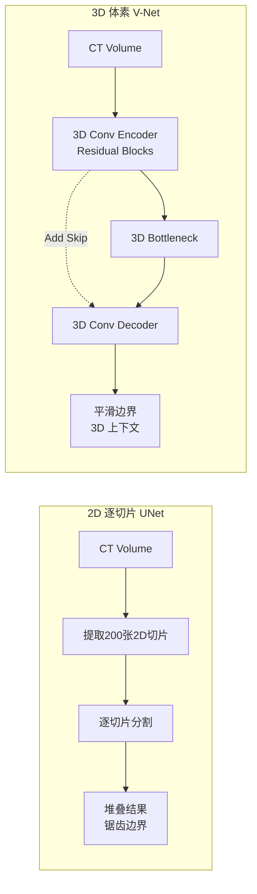

## 引言

在上一篇文章中，我们深入学习了[FCN和UNet](/2025/02/01/fcn-unet-foundation/)如何奠定2D医学图像分割的基础。然而，医学成像通常是**三维的**（如CT、MRI扫描），仅处理单个2D切片会丢失重要的空间上下文信息。

**V-Net**<cite>[3]</cite>（2016）是第一个成功的端到端3D医学图像分割网络，它不仅将UNet扩展到3D，还引入了多项关键创新：
- ✅ **3D卷积**：直接处理体积数据
- ✅ **残差连接**：深层网络的有效训练
- ✅ **Dice Loss**：直接优化分割指标

### 为什么需要3D分割？

**2D切片分割的局限性**：
```
2D方法：逐层处理
CT Volume (512×512×200) → 200个2D切片 → 分别分割 → 堆叠
问题：
  ❌ 丢失层间关系
  ❌ 不连续性（锯齿状边界）
  ❌ 无法利用3D上下文
  ❌ 小病灶可能被遗漏
```

**3D分割的优势**：
```
3D方法：整体处理
CT Volume (512×512×200) → 直接3D分割 → 连续体积
优势：
  ✅ 保留空间连续性
  ✅ 利用3D上下文信息
  ✅ 更准确的体积测量
  ✅ 更平滑的分割边界
```

**典型应用场景**：
- 器官体积测量（肝脏、肾脏）
- 肿瘤生长监测
- 手术规划（3D重建）
- 放疗靶区勾画

### 2D vs 3D 流程对比



---



## V-Net：核心创新

### 三大核心创新<cite>[3]</cite>

#### 3D卷积架构

从2D到3D的扩展看似简单，实则面临诸多挑战：

**2D卷积 vs. 3D卷积**：

$$
\text{2D Conv: } \quad Y(x, y, c) = \sum_{i,j,k} W(i, j, k) \cdot X(x+i, y+j, k) + b
$$

$$
\text{3D Conv: } \quad Y(x, y, z, c) = \sum_{i,j,k,l} W(i, j, k, l) \cdot X(x+i, y+j, z+k, l) + b
$$

**参数量对比**：
```
2D: 3×3卷积核 → 9个参数/通道
3D: 3×3×3卷积核 → 27个参数/通道（3倍！）

示例：64通道→128通道
2D: 9 × 64 × 128 = 73,728
3D: 27 × 64 × 128 = 221,184（3倍参数量）
```

**计算量对比**：
```
Input: 128×128×128
2D处理128层: 128 × (128×128×9) = 201M FLOPs
3D整体处理: 128×128×128×27 = 566M FLOPs（约3倍）
```

**内存挑战**：
```
2D: 128×128×64 = 1M → 4MB（float32）
3D: 128×128×128×64 = 128M → 512MB（128倍！）
```

#### 残差连接（Residual Connections）

V-Net借鉴了ResNet的思想，在每个阶段引入残差连接，使得可以训练更深的网络。

**标准卷积块 vs. 残差块**：

```python
# 标准卷积块
def conv_block(x):
    x = Conv3D(x)
    x = BN(x)
    x = ReLU(x)
    return x

# 残差块
def residual_block(x):
    residual = x  # 保存输入
    x = Conv3D(x)
    x = BN(x)
    x = ReLU(x)
    x = Conv3D(x)
    x = BN(x)
    x = x + residual  # 残差连接
    x = ReLU(x)
    return x
```

**数学表示**：

设输入为 \( x \)，残差块的输出为：

$$
y = \mathcal{F}(x, \{W_i\}) + x
$$

其中 \( \mathcal{F}(x, \{W_i\}) \) 是残差映射（卷积层学习的部分）。

**为什么需要残差连接？**

1. **缓解梯度消失**：
   
   $$
   \frac{\partial \mathcal{L}}{\partial x} = \frac{\partial \mathcal{L}}{\partial y} \left(1 + \frac{\partial \mathcal{F}}{\partial x}\right)
   $$
   
   即使 \( \frac{\partial \mathcal{F}}{\partial x} \to 0 \)，梯度仍至少为 \( \frac{\partial \mathcal{L}}{\partial y} \)。

2. **学习恒等映射更容易**：网络可以学习 \( \mathcal{F}(x) = 0 \)，使 \( y = x \)。

3. **特征重用**：低层特征可以直接传递到高层。

#### Dice Loss

这是V-Net最重要的贡献之一<cite>[3]</cite>！传统的像素级交叉熵存在类别不平衡问题：

**问题示例**：
```
前列腺MRI体积分割
Total voxels: 128×128×128 = 2,097,152
Prostate voxels: ~50,000 (2.4%)
Background voxels: ~2,047,152 (97.6%)

交叉熵损失会被背景主导！
```

**Dice Loss直接优化Dice系数**：

$$
\mathcal{L}_{\text{Dice}} = 1 - \frac{2 \sum_{i=1}^{N} p_i g_i}{\sum_{i=1}^{N} p_i + \sum_{i=1}^{N} g_i}
$$

其中：
- \( p_i \in [0, 1] \) 是像素 \( i \) 的预测概率（Sigmoid输出）
- \( g_i \in \{0, 1\} \) 是真实标签
- \( N \) 是体素总数

**为什么Dice Loss有效？**

1. **类别不平衡鲁棒**：只关注前景和背景的重叠，不受类别比例影响
2. **直接优化目标**：Dice系数是评价指标，直接优化它
3. **平滑可导**：概率形式使其可微分

**Dice Loss的梯度**：

对 \( p_i \) 求导：

$$
\frac{\partial \mathcal{L}_{\text{Dice}}}{\partial p_i} = -2 \left[ \frac{g_i(\sum p_j + \sum g_j) - 2\sum p_j g_j}{(\sum p_j + \sum g_j)^2} \right]
$$

---

## V-Net网络架构

### 整体结构

V-Net采用与UNet相似的编码器-解码器结构，但全部使用3D卷积：

```
                  Contracting Path          Expanding Path
                      (编码器)                 (解码器)

Input ──→ ResBlock──→ Down ──────────────────→ Up──→ ResBlock
128³×1         64        64                    64        64
                │                                         │
                ↓                                         ↑
            ResBlock──→ Down ────────────→ Up──→ ResBlock
            64×64³        128              128       128
                │                                         │
                ↓                                         ↑
            ResBlock──→ Down ────────→ Up──→ ResBlock
            64×32³        256          256       256
                │                                         │
                ↓          Bottleneck                    ↑
            ResBlock──→ ResBlock ───→ ResBlock
            32×16³        512          512

                                                    ↓
                                             Output (128³×2)
```

**关键参数**：
- **输入尺寸**: 128×128×128×1（单通道MRI）
- **输出尺寸**: 128×128×128×2（前景/背景）
- **下采样**: 4次2×2×2池化（或步长卷积）
- **通道数**: 64 → 128 → 256 → 512
- **残差块**: 每个阶段1-3个残差块

### 详细模块设计

#### 残差块（Residual Block）

```python
class ResidualBlock3D(nn.Module):
    def __init__(self, channels, num_conv=2):
        super().__init__()
        layers = []
        for i in range(num_conv):
            layers.append(nn.Conv3d(channels, channels, 
                                   kernel_size=5, padding=2))
            if i < num_conv - 1:  # 最后一个卷积后不加激活
                layers.append(nn.ReLU(inplace=True))
        
        self.conv = nn.Sequential(*layers)
        self.relu = nn.ReLU(inplace=True)
    
    def forward(self, x):
        residual = x
        out = self.conv(x)
        out += residual  # 残差连接
        out = self.relu(out)
        return out
```

**V-Net使用5×5×5卷积**（而非常见的3×3×3），增加感受野：
```
感受野：
3×3×3卷积: 3×3×3 = 27个体素
5×5×5卷积: 5×5×5 = 125个体素（约5倍）
```

#### 下采样（Downsampling）

V-Net使用**步长卷积**（而非池化）进行下采样：

```python
class DownConv(nn.Module):
    def __init__(self, in_channels, out_channels):
        super().__init__()
        self.down = nn.Conv3d(in_channels, out_channels,
                             kernel_size=2, stride=2)  # 步长2
        self.relu = nn.ReLU(inplace=True)
    
    def forward(self, x):
        return self.relu(self.down(x))
```

**为什么用步长卷积？**
- ✅ 可学习的下采样（池化固定）
- ✅ 同时降低分辨率和增加通道数
- ✅ 减少信息丢失

#### 上采样（Upsampling）

```python
class UpConv(nn.Module):
    def __init__(self, in_channels, out_channels):
        super().__init__()
        self.up = nn.ConvTranspose3d(in_channels, out_channels,
                                     kernel_size=2, stride=2)
        self.relu = nn.ReLU(inplace=True)
    
    def forward(self, x):
        return self.relu(self.up(x))
```

#### 跳跃连接（Skip Connections）

V-Net使用**相加**方式融合特征（而UNet使用拼接）：

```python
def forward(self, x_encoder, x_decoder):
    # UNet方式: 拼接
    # x = torch.cat([x_encoder, x_decoder], dim=1)
    
    # V-Net方式: 相加
    x = x_encoder + x_decoder
    return x
```

**相加 vs. 拼接**：
```
相加（Addition）:
- 通道数不变
- 参数量更少
- 要求输入通道数相同

拼接（Concatenation）:
- 通道数翻倍
- 保留更多信息
- 参数量更大
```

### 完整V-Net实现

```python
class VNet(nn.Module):
    def __init__(self, in_channels=1, num_classes=2):
        super(VNet, self).__init__()
        
        # Encoder (左侧下采样路径)
        self.enc1 = ResidualBlock3D(16, num_conv=1)
        self.down1 = DownConv(16, 32)
        
        self.enc2 = ResidualBlock3D(32, num_conv=2)
        self.down2 = DownConv(32, 64)
        
        self.enc3 = ResidualBlock3D(64, num_conv=3)
        self.down3 = DownConv(64, 128)
        
        self.enc4 = ResidualBlock3D(128, num_conv=3)
        self.down4 = DownConv(128, 256)
        
        # Bottleneck
        self.bottleneck = ResidualBlock3D(256, num_conv=3)
        
        # Decoder (右侧上采样路径)
        self.up4 = UpConv(256, 128)
        self.dec4 = ResidualBlock3D(128, num_conv=3)
        
        self.up3 = UpConv(128, 64)
        self.dec3 = ResidualBlock3D(64, num_conv=3)
        
        self.up2 = UpConv(64, 32)
        self.dec2 = ResidualBlock3D(32, num_conv=2)
        
        self.up1 = UpConv(32, 16)
        self.dec1 = ResidualBlock3D(16, num_conv=1)
        
        # 最终输出
        self.output = nn.Conv3d(16, num_classes, kernel_size=1)
        
        # 初始化
        self._initialize_weights()
    
    def forward(self, x):
        # Encoder
        e1 = self.enc1(x)      # 128³×16
        d1 = self.down1(e1)    # 64³×32
        
        e2 = self.enc2(d1)     # 64³×32
        d2 = self.down2(e2)    # 32³×64
        
        e3 = self.enc3(d2)     # 32³×64
        d3 = self.down3(e3)    # 16³×128
        
        e4 = self.enc4(d3)     # 16³×128
        d4 = self.down4(e4)    # 8³×256
        
        # Bottleneck
        b = self.bottleneck(d4)  # 8³×256
        
        # Decoder with skip connections
        u4 = self.up4(b)       # 16³×128
        u4 = u4 + e4           # 跳跃连接（相加）
        d4 = self.dec4(u4)     # 16³×128
        
        u3 = self.up3(d4)      # 32³×64
        u3 = u3 + e3
        d3 = self.dec3(u3)     # 32³×64
        
        u2 = self.up2(d3)      # 64³×32
        u2 = u2 + e2
        d2 = self.dec2(u2)     # 64³×32
        
        u1 = self.up1(d2)      # 128³×16
        u1 = u1 + e1
        d1 = self.dec1(u1)     # 128³×16
        
        # 输出
        out = self.output(d1)  # 128³×2
        return out
    
    def _initialize_weights(self):
        for m in self.modules():
            if isinstance(m, nn.Conv3d):
                nn.init.kaiming_normal_(m.weight, 
                                       mode='fan_out', 
                                       nonlinearity='relu')
                if m.bias is not None:
                    nn.init.constant_(m.bias, 0)
```

---

## 数学定义

### 3D卷积操作

设3D输入特征图 \( X \in \mathbb{R}^{D \times H \times W \times C_{\text{in}}} \)，卷积核 \( W \in \mathbb{R}^{k \times k \times k \times C_{\text{in}} \times C_{\text{out}}} \)，输出为：

$$
Y(d, h, w, c_{\text{out}}) = \sum_{c_{\text{in}}=1}^{C_{\text{in}}} \sum_{i=0}^{k-1} \sum_{j=0}^{k-1} \sum_{l=0}^{k-1} W(i, j, l, c_{\text{in}}, c_{\text{out}}) \cdot X(d+i, h+j, w+l, c_{\text{in}}) + b_{c_{\text{out}}}
$$

**输出尺寸**（padding=\(p\), stride=\(s\)）：

$$
D_{\text{out}} = \left\lfloor \frac{D + 2p - k}{s} \right\rfloor + 1
$$

同理适用于 \( H \) 和 \( W \) 维度。

### Dice Loss推导

Dice系数定义：

$$
\text{Dice}(P, G) = \frac{2|P \cap G|}{|P| + |G|}
$$

对于概率预测，软Dice系数为：

$$
\text{Soft Dice} = \frac{2\sum_{i=1}^{N} p_i g_i + \epsilon}{\sum_{i=1}^{N} p_i + \sum_{i=1}^{N} g_i + \epsilon}
$$

其中 \( \epsilon = 10^{-5} \) 是平滑项，防止分母为0。

**Dice Loss**：

$$
\mathcal{L}_{\text{Dice}} = 1 - \text{Soft Dice} = 1 - \frac{2\sum p_i g_i + \epsilon}{\sum p_i + \sum g_i + \epsilon}
$$

**梯度计算**：

设 \( S = \sum p_i, T = \sum g_i, I = \sum p_i g_i \)，则：

$$
\frac{\partial \mathcal{L}_{\text{Dice}}}{\partial p_i} = -2 \left[ \frac{g_i(S + T + \epsilon) - 2I}{(S + T + \epsilon)^2} \right]
$$

**PyTorch实现**：

```python
class DiceLoss(nn.Module):
    def __init__(self, smooth=1e-5):
        super(DiceLoss, self).__init__()
        self.smooth = smooth
    
    def forward(self, pred, target):
        """
        pred: (B, C, D, H, W) - 预测概率（Sigmoid/Softmax后）
        target: (B, C, D, H, W) - 真实标签（one-hot编码）
        """
        # 展平
        pred = pred.view(-1)
        target = target.view(-1)
        
        # 计算Dice
        intersection = (pred * target).sum()
        union = pred.sum() + target.sum()
        
        dice = (2. * intersection + self.smooth) / \
               (union + self.smooth)
        
        return 1 - dice

# 多类别Dice Loss
class MultiClassDiceLoss(nn.Module):
    def __init__(self, num_classes, smooth=1e-5):
        super().__init__()
        self.num_classes = num_classes
        self.smooth = smooth
    
    def forward(self, pred, target):
        """
        pred: (B, C, D, H, W)
        target: (B, D, H, W) - 类别索引
        """
        # 转为one-hot
        target_one_hot = F.one_hot(target, self.num_classes)
        target_one_hot = target_one_hot.permute(0, 4, 1, 2, 3).float()
        
        # Softmax
        pred = F.softmax(pred, dim=1)
        
        # 计算每个类别的Dice
        dice_per_class = []
        for c in range(self.num_classes):
            pred_c = pred[:, c, ...]
            target_c = target_one_hot[:, c, ...]
            
            intersection = (pred_c * target_c).sum()
            union = pred_c.sum() + target_c.sum()
            dice_c = (2. * intersection + self.smooth) / \
                     (union + self.smooth)
            dice_per_class.append(dice_c)
        
        # 平均Dice
        mean_dice = sum(dice_per_class) / self.num_classes
        return 1 - mean_dice
```

### 残差块的数学表示

设输入 \( x \)，残差块包含两个卷积层，输出为：

$$
\begin{aligned}
h_1 &= \text{ReLU}(\text{BN}(W_1 * x + b_1)) \\
h_2 &= \text{BN}(W_2 * h_1 + b_2) \\
y &= \text{ReLU}(h_2 + x)
\end{aligned}
$$

**恒等映射**：

在最优情况下，如果 \( W_1, W_2 \) 学习到 \( W_1 * W_2 \approx 0 \)，则 \( y \approx x \)，网络可以保持恒等映射。

---

## 训练策略

### 数据预处理

```python
def preprocess_mri(volume):
    """前列腺MRI预处理"""
    # 1. 强度归一化
    volume = (volume - volume.mean()) / volume.std()
    
    # 2. 裁剪到ROI
    volume = crop_to_roi(volume, margin=10)
    
    # 3. 调整尺寸
    volume = resize(volume, (128, 128, 128))
    
    # 4. 范围限制
    volume = np.clip(volume, -3, 3)
    
    return volume
```

### 数据增强

3D数据增强比2D更复杂：

```python
# 3D数据增强
transforms_3d = Compose([
    # 几何变换
    RandomRotation3D(degrees=10),  # 3D旋转
    RandomFlip3D(axis=[0, 1, 2], p=0.5),  # 三个轴翻转
    RandomAffine3D(
        translate=(0.05, 0.05, 0.05),  # 平移
        scale=(0.9, 1.1),               # 缩放
        shear=(5, 5, 5)                 # 剪切
    ),
    
    # 弹性形变
    ElasticDeformation3D(
        alpha=50,
        sigma=5,
        p=0.3
    ),
    
    # 强度变换
    RandomGamma(gamma_range=(0.8, 1.2)),
    RandomBrightnessContrast(
        brightness_limit=0.2,
        contrast_limit=0.2
    ),
    
    # 噪声
    GaussianNoise3D(sigma_range=(0.01, 0.05)),
])
```

### 训练配置

```python
# 模型
model = VNet(in_channels=1, num_classes=2).cuda()

# 损失函数
criterion = DiceLoss()

# 优化器（原论文使用SGD + Momentum）
optimizer = torch.optim.SGD(
    model.parameters(),
    lr=0.01,
    momentum=0.99,
    weight_decay=1e-5
)

# 学习率调度
scheduler = torch.optim.lr_scheduler.StepLR(
    optimizer,
    step_size=20,
    gamma=0.5
)

# 训练参数
config = {
    'batch_size': 2,  # 3D数据内存占用大，batch小
    'epochs': 100,
    'patch_size': (128, 128, 128),
    'num_workers': 4,
}
```

### 训练循环

```python
for epoch in range(num_epochs):
    model.train()
    epoch_loss = 0
    
    for batch_idx, (volumes, masks) in enumerate(train_loader):
        volumes = volumes.cuda()  # (B, 1, D, H, W)
        masks = masks.cuda()      # (B, D, H, W)
        
        # 前向传播
        outputs = model(volumes)  # (B, 2, D, H, W)
        
        # 计算损失
        loss = criterion(outputs, masks)
        
        # 反向传播
        optimizer.zero_grad()
        loss.backward()
        
        # 梯度裁剪（防止梯度爆炸）
        torch.nn.utils.clip_grad_norm_(model.parameters(), max_norm=1.0)
        
        optimizer.step()
        
        epoch_loss += loss.item()
    
    # 验证
    dice_score = validate(model, val_loader)
    print(f'Epoch {epoch}: Loss={epoch_loss/len(train_loader):.4f}, '
          f'Dice={dice_score:.4f}')
    
    scheduler.step()
```

### 推理策略

**滑动窗口（Sliding Window）**：

由于内存限制，大体积通常需要分块处理：

```python
def sliding_window_inference(model, volume, window_size=(128, 128, 128), 
                             overlap=0.5):
    """
    滑动窗口推理
    
    Args:
        volume: (D, H, W) 输入体积
        window_size: 窗口大小
        overlap: 重叠率
    """
    D, H, W = volume.shape
    d, h, w = window_size
    
    # 计算步长
    stride_d = int(d * (1 - overlap))
    stride_h = int(h * (1 - overlap))
    stride_w = int(w * (1 - overlap))
    
    # 初始化输出
    output = np.zeros((2, D, H, W))  # 2类
    count = np.zeros((D, H, W))  # 计数（用于平均）
    
    # 滑动窗口
    for z in range(0, D - d + 1, stride_d):
        for y in range(0, H - h + 1, stride_h):
            for x in range(0, W - w + 1, stride_w):
                # 提取patch
                patch = volume[z:z+d, y:y+h, x:x+w]
                patch = torch.from_numpy(patch[None, None, ...]).float().cuda()
                
                # 推理
                with torch.no_grad():
                    pred = model(patch)  # (1, 2, d, h, w)
                    pred = F.softmax(pred, dim=1)[0].cpu().numpy()
                
                # 累加到输出
                output[:, z:z+d, y:y+h, x:x+w] += pred
                count[z:z+d, y:y+h, x:x+w] += 1
    
    # 平均（处理重叠区域）
    output = output / (count + 1e-5)
    
    # 取最大概率类别
    seg = np.argmax(output, axis=0)
    return seg
```

---

## 实验结果

### 数据集：PROMISE12

**PROMISE12** (Prostate MR Image Segmentation 2012) 是前列腺MRI分割的标准数据集<cite>[3]</cite>：

- **训练集**: 50例患者
- **测试集**: 30例患者
- **模态**: T2加权MRI
- **分辨率**: 约0.6×0.6×3.6 mm³
- **标注**: 前列腺精确轮廓

### 性能指标

| 方法 | Dice系数 | Hausdorff距离 (mm) |
|------|---------|-------------------|
| 传统方法（Atlas-based） | 0.82 | 8.5 |
| 2D UNet（逐层） | 0.85 | 7.2 |
| **V-Net**<cite>[3]</cite> | **0.89** | **5.8** |

**关键观察**：
- ✅ V-Net比2D方法提升4%的Dice
- ✅ 边界更平滑（Hausdorff距离降低20%）
- ✅ 3D连续性显著改善

### 消融实验<cite>[3]</cite>

| 配置 | Dice |  Delta |
|------|------|--------|
| 基础3D UNet | 0.87 | - |
| + 残差连接 | 0.88 | +0.01 |
| + Dice Loss | **0.89** | **+0.02** |

**结论**：
- 残差连接提升1%（梯度流改善）
- **Dice Loss提升2%**（直接优化目标指标）

---

## V-Net的优势与局限

### ✅ 优势

1. **端到端3D处理**
   - 保留空间连续性
   - 利用3D上下文
   - 更准确的体积测量

2. **残差连接**
   - 支持更深网络
   - 梯度流畅通
   - 特征重用

3. **Dice Loss**
   - 类别不平衡鲁棒
   - 直接优化评价指标
   - 训练稳定

4. **简洁高效**
   - 架构清晰
   - 易于实现
   - 训练相对容易

### ❌ 局限

1. **内存消耗大**
   ```
   示例：batch_size=1, 128³×64通道
   内存需求：128³×64×4字节 ≈ 512MB（单层特征图！）
   完整网络：数GB显存
   ```
   
   **解决方案**：
   - 降低输入分辨率
   - 使用滑动窗口
   - 梯度检查点（Gradient Checkpointing）

2. **计算量大**
   ```
   V-Net vs. 2D UNet（相同参数）
   计算量：约100倍
   训练时间：数小时 vs. 数天
   ```

3. **数据需求**
   - 3D标注成本高
   - 样本量通常有限
   - 容易过拟合

4. **各向异性问题**
   ```
   CT/MRI分辨率通常不均匀：
   XY平面：0.6×0.6 mm
   Z轴：   3-5 mm（厚层）
   
   → 3×3×3卷积在不同方向感受野不同
   ```

---

## 后续改进与变种

V-Net激发了大量后续工作：

### 3D UNet (2016)<cite>[4]</cite>

简化版V-Net，去除残差连接，使用3×3×3卷积：

```python
# 更轻量的3D UNet
class UNet3D(nn.Module):
    def __init__(self):
        # 使用标准卷积块（非残差）
        # 3×3×3卷积（而非5×5×5）
        # 拼接式skip connections
```

**论文**: <cite>[4]</cite> [3D U-Net: Learning Dense Volumetric Segmentation](https://arxiv.org/abs/1606.06650)

### nnU-Net

自适应配置的3D分割框架，基于V-Net/3D UNet：

```python
# 自动选择
if dataset.anisotropy > 3:
    model = UNet2D()  # 使用2D
else:
    model = UNet3D()  # 使用3D
```

**论文**: [nnU-Net: Self-adapting Framework](https://arxiv.org/abs/1809.10486)

### HD-Net (High-Resolution Decoder)

多分辨率解码器，保留更多细节：

```python
# 并行多尺度解码
low_res_out = decoder_low(features)
mid_res_out = decoder_mid(features)
high_res_out = decoder_high(features)
final = fuse([low_res_out, mid_res_out, high_res_out])
```

### CoTr (Contextual Transformer)

结合Transformer和3D卷积：

```python
# 编码器：3D Conv（局部）
# Bottleneck：Transformer（全局）
# 解码器：3D Conv（恢复）
```

---

## 实践建议

### 何时使用V-Net？

**适合场景**：
- ✅ 3D医学图像（CT、MRI）
- ✅ 器官/病灶分割
- ✅ 需要体积测量
- ✅ 有充足显存（≥16GB）

**不适合场景**：
- ❌ 2D图像（用UNet更好）
- ❌ 实时应用（太慢）
- ❌ 显存有限（<8GB）
- ❌ 极大体积（>512³）

### 超参数调优

```python
# 关键超参数
config = {
    # 网络结构
    'initial_channels': 16,  # 初始通道数
    'depth': 4,              # 下采样次数
    'kernel_size': 5,        # 5×5×5（原论文）或3×3×3
    
    # 训练
    'batch_size': 2,         # 显存允许的最大值
    'learning_rate': 0.01,   # SGD: 0.01, Adam: 1e-4
    'optimizer': 'SGD',      # SGD+Momentum更稳定
    'momentum': 0.99,
    
    # 数据增强
    'augmentation_prob': 0.8,  # 高概率增强
    'elastic_deform': True,    # 弹性形变重要
    
    # 损失函数
    'loss': 'dice',          # 或 'dice+ce'组合
}
```

### 内存优化技巧

```python
# 1. 混合精度训练
from torch.cuda.amp import autocast, GradScaler

scaler = GradScaler()

with autocast():  # 自动使用FP16
    outputs = model(inputs)
    loss = criterion(outputs, targets)

scaler.scale(loss).backward()
scaler.step(optimizer)
scaler.update()

# 2. 梯度检查点
from torch.utils.checkpoint import checkpoint

def forward_with_checkpoint(self, x):
    # 只保存检查点，重新计算中间激活
    x = checkpoint(self.enc1, x)
    x = checkpoint(self.enc2, x)
    # ...
    return x

# 3. 减少通道数
# 16→32→64→128（而非64→128→256→512）
```

---

## 总结

V-Net<cite>[3]</cite>在2016年开创性地将UNet扩展到3D，并引入了两项关键创新：

1. **残差连接** - 使深层3D网络可训练
2. **Dice Loss** - 直接优化分割指标，对类别不平衡鲁棒

虽然计算和内存需求大，但在3D医学图像分割任务上，V-Net仍然是**基础和标准方法**。

**核心思想**：
> 不是简单地将2D方法扩展到3D，而是针对3D数据的特点（空间连续性、计算复杂度）进行专门设计。

---

## 参考资料

<ol class="references">
  <li><strong>[FCN]</strong> Long, J., Shelhamer, E. &amp; Darrell, T. <em>Fully Convolutional Networks for Semantic Segmentation</em>. CVPR 2015. <a href="https://arxiv.org/abs/1411.4038">arXiv:1411.4038</a></li>
  <li><strong>[U-Net]</strong> Ronneberger, O., Fischer, P. &amp; Brox, T. <em>U-Net: Convolutional Networks for Biomedical Image Segmentation</em>. MICCAI 2015. <a href="https://arxiv.org/abs/1505.04597">arXiv:1505.04597</a></li>
  <li><strong>[V-Net]</strong> Milletari, F., Navab, N. &amp; Ahmadi, S.-A. <em>V-Net: Fully Convolutional Neural Networks for Volumetric Medical Image Segmentation</em>. 3DV 2016. <a href="https://arxiv.org/abs/1606.04797">arXiv:1606.04797</a></li>
  <li><strong>[3D U-Net]</strong> Çiçek, Ö. et al. <em>3D U-Net: Learning Dense Volumetric Segmentation from Sparse Annotation</em>. MICCAI 2016. <a href="https://arxiv.org/abs/1606.06650">arXiv:1606.06650</a></li>
</ol>

<h4>代码实现</h4>
<ul>
  <li><a href="https://github.com/mattmacy/vnet.pytorch">V-Net PyTorch</a> — 完整实现</li>
  <li><a href="https://github.com/wolny/pytorch-3dunet">3D UNet PyTorch</a></li>
  <li><a href="https://github.com/Project-MONAI/MONAI">MONAI</a> — 医学图像深度学习框架（包含 V-Net）</li>
</ul>

<h4>数据集</h4>
<ul>
  <li><a href="https://promise12.grand-challenge.org/">PROMISE12</a> — 前列腺 MRI 分割</li>
  <li><a href="http://braintumorsegmentation.org/">BraTS</a> — 脑肿瘤分割</li>
  <li><a href="http://medicaldecathlon.com/">Medical Segmentation Decathlon</a> — 10 个器官分割任务</li>
</ul>

<h4>工具库</h4>
<ul>
  <li><a href="https://monai.io/">MONAI</a> — PyTorch 医学影像库</li>
  <li><a href="https://torchio.readthedocs.io/">TorchIO</a> — 3D 医学图像处理</li>
  <li><a href="https://nipy.org/nibabel/">NiBabel</a> — 医学图像格式读取</li>
</ul>

---



