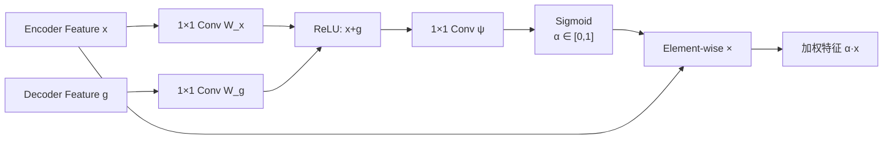

## 引言

在前面的文章中，我们学习了[UNet](/2025/02/01/fcn-unet-foundation/)的对称U型结构和[V-Net](/2025/02/05/vnet-3d-segmentation/)的3D扩展。这些网络虽然强大，但存在一个问题：**Skip Connections盲目地传递所有特征**，无法区分哪些特征是重要的，哪些是噪声。

**Attention UNet**（2018）引入了**注意力门控（Attention Gates）**机制<cite>[1]</cite>，让网络学会"看哪里"——自动聚焦于与任务相关的区域，抑制无关背景。

### 为什么需要注意力机制？

**传统UNet的问题**：
```
编码器 ──→ [所有特征] ──→ 解码器
         ↑
    包含大量背景噪声
```

**示例：胰腺分割**
```
CT图像：512×512
胰腺区域：约50×30（仅占3%）
背景：97%

传统UNet：
✓ 编码器提取特征
✗ Skip传递所有特征（包括97%的无关背景）
✗ 解码器被大量背景信息干扰
```

**Attention UNet的改进**：
```
编码器 ──→ [所有特征] ──→ Attention Gate ──→ [加权特征] ──→ 解码器
                              ↑
                         自动学习重要性
                         ✓ 突出前景（胰腺）
                         ✗ 抑制背景
```

---



## Attention UNet：核心创新

### 核心思想：注意力门控（Attention Gates）

**Attention Gate**是插入在Skip Connection中的模块<cite>[1][2]</cite>，作用是：
1. 接收**两个输入**：编码器特征（\(x^l\)）和解码器特征（\(g\)）
2. 计算**注意力系数**（\(\alpha\)）：判断编码器特征的每个位置是否重要
3. 输出**加权特征**：\(\hat{x}^l = \alpha \odot x^l\)（\(\odot\)表示逐元素乘法）

**关键优势**<cite>[1][2]</cite>：
- ✅ **自动学习**：无需手工标注感兴趣区域
- ✅ **端到端训练**：注意力权重通过反向传播学习
- ✅ **可解释性**：可视化注意力图，了解网络关注哪里
- ✅ **无额外监督**：仅用分割标签，不需要额外注释

---

## Attention Gate详解

### 1. 整体架构

Attention UNet基于标准UNet，在每个Skip Connection处添加Attention Gate：

```
编码器路径                    解码器路径
                              
Input                          Output
  ↓                              ↑
Conv ──────[AG]─────→ UpConv + Concat
  ↓          ↑                  ↑
Pool         │                  │
  ↓          │                  │
Conv ──────[AG]─────→ UpConv + Concat
  ↓          ↑                  ↑
Pool         │                  │
  ↓          │                  │
Conv ──────[AG]─────→ UpConv + Concat
  ↓          ↑                  ↑
Pool         │                  │
  ↓          │                  │
Bottleneck ──┘                  │
  │                             │
  └─────────────────────────────┘

[AG] = Attention Gate（门控单元）
```

**关键点**：
- Attention Gate使用**解码器特征作为query**（"我现在需要什么信息？"）
- Attention Gate使用**编码器特征作为key/value**（"我有哪些信息？"）
- 输出加权的编码器特征，传递给解码器

### 2. Attention Gate的数学定义

设编码器特征为 \(x^l \in \mathbb{R}^{H \times W \times C}\)，解码器特征为 \(g \in \mathbb{R}^{H' \times W' \times C'}\)。

**步骤1：特征变换**

将两个输入映射到相同的通道空间：

$$
\begin{aligned}
W_x * x^l &\in \mathbb{R}^{H \times W \times F_{\text{int}}} \\
W_g * g &\in \mathbb{R}^{H \times W \times F_{\text{int}}}
\end{aligned}
$$

其中 \(F_{\text{int}}\) 是中间特征维度（通常为 \(C/2\)）。

**步骤2：相加并激活**

$$
q_{\text{att}} = \text{ReLU}(W_x * x^l + W_g * g + b)
$$

这里 \(g\) 通过上采样或1×1卷积调整到与 \(x^l\) 相同的空间尺寸。

**步骤3：计算注意力系数**

$$
\alpha^l = \sigma(\psi^T * q_{\text{att}} + b_{\psi})
$$

其中：
- \(\psi\) 是1×1卷积（降维到1通道）
- \(\sigma\) 是Sigmoid函数，输出范围[0, 1]
- \(\alpha^l \in \mathbb{R}^{H \times W \times 1}\)

**步骤4：特征加权**

$$
\hat{x}^l = \alpha^l \odot x^l
$$

逐元素相乘，重要区域 \(\alpha \approx 1\)，不重要区域 \(\alpha \approx 0\)。

### 3. 完整公式

将上述步骤整合：

$$
\alpha^l(i, j) = \sigma_1 \left( \psi^T \left( \sigma_2(W_x x^l_{i,j} + W_g g_i + b) \right) + b_{\psi} \right)
$$

其中：
- \((i, j)\) 是空间位置
- \(\sigma_1\) 是Sigmoid（输出注意力系数）
- \(\sigma_2\) 是ReLU（非线性激活）

**输出**：

$$
\hat{x}^l = x^l \odot \alpha^l
$$

### 4. PyTorch实现

```python
class AttentionGate(nn.Module):
    def __init__(self, F_g, F_l, F_int):
        """
        Attention Gate
        Args:
            F_g: 解码器特征通道数 (gating signal)
            F_l: 编码器特征通道数 (input feature)
            F_int: 中间层通道数
        """
        super(AttentionGate, self).__init__()
        
        # 特征变换
        self.W_g = nn.Sequential(
            nn.Conv2d(F_g, F_int, kernel_size=1, padding=0, bias=True),
            nn.BatchNorm2d(F_int)
        )
        
        self.W_x = nn.Sequential(
            nn.Conv2d(F_l, F_int, kernel_size=1, padding=0, bias=True),
            nn.BatchNorm2d(F_int)
        )
        
        # 注意力系数计算
        self.psi = nn.Sequential(
            nn.Conv2d(F_int, 1, kernel_size=1, padding=0, bias=True),
            nn.BatchNorm2d(1),
            nn.Sigmoid()
        )
        
        self.relu = nn.ReLU(inplace=True)
    
    def forward(self, g, x):
        """
        Args:
            g: 解码器特征 (gating signal) - (B, F_g, H', W')
            x: 编码器特征 (input feature) - (B, F_l, H, W)
        Returns:
            attention-weighted features - (B, F_l, H, W)
        """
        # 1. 对齐空间尺寸（如果g比x小，需要上采样）
        g1 = self.W_g(g)  # (B, F_int, H', W')
        
        # 双线性插值，将g上采样到与x相同的尺寸
        g1 = F.interpolate(g1, size=x.size()[2:], 
                          mode='bilinear', align_corners=True)
        
        # 2. 编码器特征变换
        x1 = self.W_x(x)  # (B, F_int, H, W)
        
        # 3. 相加并激活
        psi = self.relu(g1 + x1)  # (B, F_int, H, W)
        
        # 4. 计算注意力系数
        psi = self.psi(psi)  # (B, 1, H, W)
        
        # 5. 特征加权
        out = x * psi  # (B, F_l, H, W)
        
        return out


# 完整Attention UNet
class AttentionUNet(nn.Module):
    def __init__(self, in_channels=1, num_classes=2):
        super(AttentionUNet, self).__init__()
        
        # Encoder
        self.enc1 = DoubleConv(in_channels, 64)
        self.enc2 = DoubleConv(64, 128)
        self.enc3 = DoubleConv(128, 256)
        self.enc4 = DoubleConv(256, 512)
        
        self.pool = nn.MaxPool2d(2)
        
        # Bottleneck
        self.bottleneck = DoubleConv(512, 1024)
        
        # Attention Gates
        self.att4 = AttentionGate(F_g=1024, F_l=512, F_int=256)
        self.att3 = AttentionGate(F_g=512, F_l=256, F_int=128)
        self.att2 = AttentionGate(F_g=256, F_l=128, F_int=64)
        self.att1 = AttentionGate(F_g=128, F_l=64, F_int=32)
        
        # Decoder
        self.up4 = nn.ConvTranspose2d(1024, 512, kernel_size=2, stride=2)
        self.dec4 = DoubleConv(1024, 512)
        
        self.up3 = nn.ConvTranspose2d(512, 256, kernel_size=2, stride=2)
        self.dec3 = DoubleConv(512, 256)
        
        self.up2 = nn.ConvTranspose2d(256, 128, kernel_size=2, stride=2)
        self.dec2 = DoubleConv(256, 128)
        
        self.up1 = nn.ConvTranspose2d(128, 64, kernel_size=2, stride=2)
        self.dec1 = DoubleConv(128, 64)
        
        # Output
        self.out = nn.Conv2d(64, num_classes, kernel_size=1)
    
    def forward(self, x):
        # Encoder
        e1 = self.enc1(x)       # 64
        e2 = self.enc2(self.pool(e1))  # 128
        e3 = self.enc3(self.pool(e2))  # 256
        e4 = self.enc4(self.pool(e3))  # 512
        
        # Bottleneck
        b = self.bottleneck(self.pool(e4))  # 1024
        
        # Decoder with Attention
        d4 = self.up4(b)  # 512
        e4_att = self.att4(g=d4, x=e4)  # 注意力加权
        d4 = torch.cat([e4_att, d4], dim=1)  # 1024
        d4 = self.dec4(d4)  # 512
        
        d3 = self.up3(d4)  # 256
        e3_att = self.att3(g=d3, x=e3)
        d3 = torch.cat([e3_att, d3], dim=1)  # 512
        d3 = self.dec3(d3)  # 256
        
        d2 = self.up2(d3)  # 128
        e2_att = self.att2(g=d2, x=e2)
        d2 = torch.cat([e2_att, d2], dim=1)  # 256
        d2 = self.dec2(d2)  # 128
        
        d1 = self.up1(d2)  # 64
        e1_att = self.att1(g=d1, x=e1)
        d1 = torch.cat([e1_att, d1], dim=1)  # 128
        d1 = self.dec1(d1)  # 64
        
        # Output
        out = self.out(d1)
        return out
```

### 5. 注意力机制的直观理解

**可视化注意力权重**：

```python
def visualize_attention(model, image):
    """可视化各层注意力图"""
    model.eval()
    
    # 前向传播，提取注意力权重
    with torch.no_grad():
        # ... (省略细节)
        att_maps = model.get_attention_maps(image)
    
    # 绘制
    fig, axes = plt.subplots(1, 5, figsize=(20, 4))
    axes[0].imshow(image[0, 0].cpu(), cmap='gray')
    axes[0].set_title('Input Image')
    
    for i, att_map in enumerate(att_maps):
        axes[i+1].imshow(att_map[0, 0].cpu(), cmap='jet', vmin=0, vmax=1)
        axes[i+1].set_title(f'Attention Layer {i+1}')
    
    plt.show()
```

**典型的注意力图**<cite>[1]</cite>：
```
浅层（Layer 1-2）：
- 关注器官边界和纹理细节
- 注意力较分散

中层（Layer 3）：
- 开始聚焦于目标器官
- 背景被部分抑制

深层（Layer 4）：
- 高度聚焦于目标区域（如胰腺）
- 背景几乎完全被抑制（α ≈ 0）
```

### Attention Gate 数据流



---

## 实验结果

### 数据集

**1. Pancreas-CT**
- **任务**: CT图像中的胰腺分割
- **挑战**: 
  - 胰腺体积小（约占图像的3%）
  - 形状多变
  - 与周围组织对比度低
- **数据**: 82例患者，12,000+切片

**2. Liver Tumor**
- **任务**: 肝脏和肝肿瘤分割
- **数据**: 131例患者

### 性能对比

#### Pancreas-CT数据集 <cite>[1]</cite>

| 方法 | Dice系数 | Sensitivity | Specificity |
|------|---------|-------------|-------------|
| FCN | 0.68 | 0.65 | 0.98 |
| UNet | 0.82 | 0.80 | 0.99 |
| ResUNet | 0.84 | 0.82 | 0.99 |
| **Attention UNet** | **0.86** | **0.85** | **0.99** |

**提升**<cite>[1]</cite>：
- Dice: +4% vs. ResUNet, +18% vs. FCN
- Sensitivity: +3% vs. ResUNet（减少漏检）

#### 消融实验 <cite>[1]</cite>

| 配置 | Dice | 说明 |
|------|------|------|
| UNet（基线） | 0.82 | - |
| + Attention (仅深层) | 0.84 | 仅在Layer 4添加AG |
| + Attention (所有层) | **0.86** | 在所有层添加AG |
| + Deep Supervision | 0.87 | 额外添加深度监督 |

**结论**：
- 多层注意力比单层效果更好（+2%）
- 深度监督进一步提升（+1%）

### 可视化分析

**注意力图的演进**：
```
输入图像：胰腺CT切片（512×512）

Layer 1注意力图：
- 边界和纹理被突出
- 背景部分被抑制
- α_background ≈ 0.3-0.5

Layer 2注意力图：
- 胰腺区域更加明显
- 背景进一步抑制
- α_background ≈ 0.1-0.3

Layer 3注意力图：
- 胰腺区域高亮（α ≈ 0.9）
- 背景几乎消失（α ≈ 0.05）
- 焦点区域清晰

Layer 4注意力图（最深层）：
- 胰腺区域完全激活（α ≈ 1.0）
- 背景完全抑制（α ≈ 0.01）
- 类似于粗糙的分割mask
```

---

## Attention UNet的优势与局限

### ✅ 优势

#### 1. 提升小目标分割

**对比UNet**：
```
场景：胰腺分割（占图像3%）

UNet：
- 编码器特征包含97%背景
- Skip传递全部特征
- 解码器被背景干扰
- Dice: 0.82

Attention UNet：
- 注意力门控抑制97%背景
- Skip仅传递重要特征
- 解码器专注前景
- Dice: 0.86（+4%）<cite>[1]</cite>
```

#### 2. 可解释性

```python
# 可视化注意力，理解网络决策
att_maps = model.get_attention_maps(image)

for i, att in enumerate(att_maps):
    print(f"Layer {i}: 关注区域比例 = {(att > 0.5).float().mean():.2%}")

输出：
Layer 1: 关注区域比例 = 45%  （广泛关注）
Layer 2: 关注区域比例 = 25%  （开始聚焦）
Layer 3: 关注区域比例 = 8%   （高度聚焦）
Layer 4: 关注区域比例 = 3%   （精确定位）
```

#### 3. 无需额外标注

- ✅ 仅用分割mask训练，无需ROI标注
- ✅ 注意力权重自动学习
- ✅ 端到端优化

#### 4. 计算效率高

**参数量对比**<cite>[1]</cite>：
```
UNet: 31.0M 参数
Attention UNet: 34.5M 参数（+11%）

额外计算：
- 每个AG: 2次1×1卷积 + 1次插值
- 总额外计算: 约5%
```

相比增加网络深度或宽度，注意力机制的代价很小。

### ❌ 局限

#### 1. 多类别分割挑战

```
问题：注意力是全局的，难以同时关注多个目标

示例：同时分割肝脏和肿瘤
- 肝脏：大目标（占30%）
- 肿瘤：小目标（占2%）

Attention UNet倾向于：
- 关注肝脏（大目标更显著）
- 忽略肿瘤（小目标被抑制）

解决方案：
- 使用多个注意力头（Multi-head Attention）
- 或分别训练两个网络
```

#### 2. 依赖解码器质量

```
注意力门控依赖解码器特征g作为query

如果解码器特征质量差：
→ 注意力权重不准确
→ 反而降低性能

示例：
Early Epoch: 解码器未收敛
→ g包含大量噪声
→ 注意力图混乱
→ 性能差于标准UNet

Later Epoch: 解码器收敛
→ g准确表示目标语义
→ 注意力图精确
→ 性能超越UNet
```

#### 3. 训练不稳定

```python
# 注意力门控可能导致梯度问题

问题1：注意力饱和
α → 1（始终激活）或 α → 0（始终抑制）
→ 梯度消失

解决方案：
- 使用Batch Normalization
- 适当的初始化
- 梯度裁剪

# 示例：改进的AG
class StableAttentionGate(nn.Module):
    def __init__(self, F_g, F_l, F_int):
        super().__init__()
        # ...
        
        # 初始化为恒等映射
        self.psi[-1].weight.data.zero_()  # Sigmoid输入接近0
        self.psi[-1].bias.data.fill_(1.0)  # α初始接近0.73
    
    def forward(self, g, x):
        # ...
        psi = self.psi(psi)
        
        # 防止注意力饱和
        psi = psi.clamp(min=0.01, max=0.99)
        
        return x * psi
```

---

## 变种与扩展

### 1. Dual Attention UNet

**思想**: 空间注意力 + 通道注意力

```python
class DualAttentionGate(nn.Module):
    def __init__(self, F_g, F_l, F_int):
        super().__init__()
        # 空间注意力（原版AG）
        self.spatial_att = AttentionGate(F_g, F_l, F_int)
        
        # 通道注意力
        self.channel_att = nn.Sequential(
            nn.AdaptiveAvgPool2d(1),
            nn.Conv2d(F_l, F_l // 16, 1),
            nn.ReLU(),
            nn.Conv2d(F_l // 16, F_l, 1),
            nn.Sigmoid()
        )
    
    def forward(self, g, x):
        # 空间注意力
        x_spatial = self.spatial_att(g, x)
        
        # 通道注意力
        channel_weight = self.channel_att(x_spatial)
        x_channel = x_spatial * channel_weight
        
        return x_channel
```

### 2. 3D Attention UNet

扩展到3D医学图像：

```python
class AttentionGate3D(nn.Module):
    def __init__(self, F_g, F_l, F_int):
        super().__init__()
        self.W_g = nn.Conv3d(F_g, F_int, 1)  # 3D卷积
        self.W_x = nn.Conv3d(F_l, F_int, 1)
        self.psi = nn.Conv3d(F_int, 1, 1)
        self.sigmoid = nn.Sigmoid()
    
    def forward(self, g, x):
        g1 = self.W_g(g)
        g1 = F.interpolate(g1, size=x.size()[2:], mode='trilinear')
        x1 = self.W_x(x)
        psi = self.sigmoid(self.psi(F.relu(g1 + x1)))
        return x * psi
```

### 3. Multi-scale Attention

**思想**: 不同尺度的注意力

```python
class MultiScaleAttention(nn.Module):
    def __init__(self, F_g, F_l):
        super().__init__()
        # 多尺度注意力
        self.att_1x = AttentionGate(F_g, F_l, F_l // 2)
        self.att_2x = AttentionGate(F_g, F_l, F_l // 2)
        self.att_4x = AttentionGate(F_g, F_l, F_l // 2)
    
    def forward(self, g, x):
        # 不同下采样率的g
        g_1x = g
        g_2x = F.avg_pool2d(g, 2)
        g_4x = F.avg_pool2d(g, 4)
        
        # 多尺度注意力
        att_1x = self.att_1x(g_1x, x)
        att_2x = self.att_2x(g_2x, x)
        att_4x = self.att_4x(g_4x, x)
        
        # 融合
        return (att_1x + att_2x + att_4x) / 3
```

---

## 训练技巧

### 1. 损失函数

```python
# 组合损失
class CombinedLoss(nn.Module):
    def __init__(self):
        super().__init__()
        self.dice = DiceLoss()
        self.ce = nn.CrossEntropyLoss()
        self.focal = FocalLoss()  # 针对小目标
    
    def forward(self, pred, target):
        dice_loss = self.dice(pred, target)
        ce_loss = self.ce(pred, target)
        focal_loss = self.focal(pred, target)
        
        # 加权组合
        return 0.4 * dice_loss + 0.3 * ce_loss + 0.3 * focal_loss
```

### 2. 数据增强

胰腺等小器官分割需要强数据增强：

```python
transforms = A.Compose([
    # 几何变换
    A.RandomRotate90(p=0.5),
    A.HorizontalFlip(p=0.5),
    A.ShiftScaleRotate(
        shift_limit=0.1,
        scale_limit=0.2,
        rotate_limit=30,
        p=0.8
    ),
    A.ElasticTransform(alpha=50, sigma=5, p=0.5),
    
    # 强度变换
    A.RandomBrightnessContrast(p=0.5),
    A.RandomGamma(p=0.5),
    
    # 噪声
    A.GaussNoise(p=0.3),
    
    # 模糊
    A.GaussianBlur(p=0.3),
])
```

### 3. 学习率调度

```python
# Warm-up + Cosine Annealing
optimizer = torch.optim.Adam(model.parameters(), lr=1e-4)

# Warm-up: 前5个epoch线性增加
warmup_scheduler = torch.optim.lr_scheduler.LinearLR(
    optimizer,
    start_factor=0.1,
    end_factor=1.0,
    total_iters=5
)

# Cosine Annealing: 后续epoch余弦衰减
cosine_scheduler = torch.optim.lr_scheduler.CosineAnnealingLR(
    optimizer,
    T_max=95,
    eta_min=1e-6
)

scheduler = torch.optim.lr_scheduler.SequentialLR(
    optimizer,
    schedulers=[warmup_scheduler, cosine_scheduler],
    milestones=[5]
)
```

### 4. 渐进式训练

```python
# 先训练标准UNet，再fine-tune Attention
# 阶段1：冻结AG，训练UNet主干
for epoch in range(50):
    # 冻结AG
    for name, param in model.named_parameters():
        if 'att' in name:
            param.requires_grad = False
    
    train_epoch(model, train_loader)

# 阶段2：解冻AG，fine-tune全网络
for epoch in range(50, 100):
    # 解冻AG
    for param in model.parameters():
        param.requires_grad = True
    
    train_epoch(model, train_loader)
```

---

## 总结

### Attention UNet的贡献

1. **自动特征选择**
   - Skip Connection不再盲目传递所有特征
   - 网络学会关注重要区域，抑制噪声

2. **提升小目标分割**
   - 在胰腺、病灶等小目标上显著提升
   - Dice系数提升2-4%

3. **增强可解释性**
   - 可视化注意力图，理解网络决策
   - 辅助临床诊断

4. **计算高效**<cite>[1]</cite>
   - 仅增加11%参数，5%计算量
   - 性价比极高的改进

### 核心思想总结

> **Attention UNet教会了网络"看哪里"**：在解码阶段，网络不是被动接受编码器的所有特征，而是主动选择需要的信息。

**数学本质**：

$$
\text{Standard UNet: } \quad y = \text{Decoder}(x_{\text{enc}} \oplus x_{\text{dec}})
$$

$$
\text{Attention UNet: } \quad y = \text{Decoder}(\underbrace{\alpha \odot x_{\text{enc}}}_{\text{加权特征}} \oplus x_{\text{dec}})
$$

其中 \(\alpha = f(x_{\text{enc}}, x_{\text{dec}})\) 是学习到的注意力权重。

### 后续影响

Attention UNet开启了医学图像分割中的"注意力时代"：
- ✅ UNet++、UNet 3+ 采用类似机制
- ✅ Transformer（TransUNet、Swin-UNet）的自注意力
- ✅ 成为现代分割网络的标配模块

---

## 参考资料

<ol class="references">
  <li><strong>Oktay, O.</strong>, Schlemper, J., Le Folgoc, L., Lee, M., Heinrich, M., Misawa, K., Mori, K., McDonagh, S., Hammerla, N. Y., Kainz, B., Glocker, B., and Rueckert, D. "Attention U-Net: Learning Where to Look for the Pancreas." In <em>Medical Imaging with Deep Learning (MIDL)</em>, 2018. <a href="https://arxiv.org/abs/1804.03999">arXiv:1804.03999</a></li>
  <li><strong>Schlemper, J.</strong>, Oktay, O., Schaap, M., Heinrich, M., Kainz, B., Glocker, B., and Rueckert, D. "Attention Gated Networks: Learning to Leverage Salient Regions in Medical Images." <em>Medical Image Analysis</em>, vol. 53, pp. 197-207, 2019. <a href="https://doi.org/10.1016/j.media.2019.01.012">DOI: 10.1016/j.media.2019.01.012</a></li>
  <li>Ronneberger, O., Fischer, P., and Brox, T. "U-Net: Convolutional Networks for Biomedical Image Segmentation." In <em>Medical Image Computing and Computer-Assisted Intervention (MICCAI)</em>, pp. 234-241, 2015. <a href="https://arxiv.org/abs/1505.04597">arXiv:1505.04597</a></li>
</ol>

### 代码实现
- [Attention UNet官方](https://github.com/ozan-octopus/attention-unet) - 原始实现
- [PyTorch实现](https://github.com/LeeJunHyun/Image_Segmentation) - 清晰的PyTorch版本
- [医学图像工具包](https://github.com/Project-MONAI/MONAI) - MONAI框架包含Attention UNet

### 数据集
- [Pancreas-CT](https://wiki.cancerimagingarchive.net/display/Public/Pancreas-CT) - 胰腺分割数据集
- [LiTS](https://competitions.codalab.org/competitions/17094) - 肝脏肿瘤分割
- [Medical Segmentation Decathlon](http://medicaldecathlon.com/) - 多器官分割挑战

### 扩展阅读
- [注意力机制综述](https://arxiv.org/abs/2103.16563)
- [医学图像分割中的注意力](https://arxiv.org/abs/2012.12453)

---



