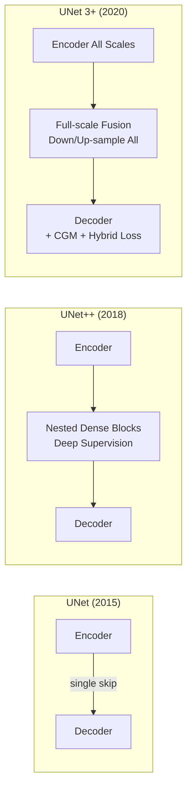

## 引言

在前面的文章中，我们学习了[UNet](/2025/02/01/fcn-unet-foundation/)的基础架构、[V-Net](/2025/02/05/vnet-3d-segmentation/)的3D扩展，以及[Attention UNet](/2025/02/10/attention-unet/)的注意力机制。这些改进主要关注**如何选择特征**，但忽略了一个根本问题：

**编码器和解码器之间的语义鸿沟**（Semantic Gap）

```
问题：
编码器深层（low-level）：边缘、纹理
解码器浅层（high-level）：语义、类别

直接skip连接：
Low-level ────→ High-level
      ↑            ↑
   语义差距大，融合效果差
```

**UNet++**（2018）<cite>[1]</cite>和**UNet 3+**（2020）<cite>[2]</cite>通过**密集连接**（Dense Connections）解决这个问题，分别提出：
- **UNet++**: 嵌套的Skip Connections（Nested Skip Pathways）
- **UNet 3+**: 全尺度Skip Connections（Full-scale Skip Connections）

---

## Part 1: UNet++ (2018)



### 核心思想：嵌套Skip Connections

**标准UNet的问题**：

```
编码器 X^0,0 ─────────────→ 解码器 X^0,4
       ↓                          ↑
      Pool                    直接连接
       ↓                          ↑
       X^1,0 ──────────────→ X^1,3
       
语义鸿沟：
X^0,0: 浅层特征（边缘、纹理）
X^0,4: 深层语义（类别、对象）
→ 融合困难
```

**UNet++的解决方案**：

在编码器和解码器之间插入**密集卷积块**，逐步弥合语义差距：

```
X^0,0 ─→ X^0,1 ─→ X^0,2 ─→ X^0,3 ─→ X^0,4
 ↓        ↑ ↓      ↑ ↓      ↑ ↓      ↑
Pool     │ Pool   │ Pool   │ Pool   Up
 ↓        │  ↓      │  ↓      │  ↓      
X^1,0 ───┘ X^1,1 ──┘ X^1,2 ──┘ X^1,3
 ↓           ↑ ↓       ↑ ↓       ↑
Pool        │ Pool    │ Pool    Up
 ↓           │  ↓       │  ↓      
X^2,0 ──────┘ X^2,1 ───┘ X^2,2
 ↓              ↑ ↓        ↑
Pool           │ Pool     Up
 ↓              │  ↓       
X^3,0 ─────────┘ X^3,1
 ↓                 ↑
Pool              Up
 ↓                 
X^4,0 (Bottleneck)
```

**符号说明**：
- \( X^{i,j} \): 第\(i\)层（下采样级别），第\(j\)列（上采样步骤）
- \( i \in [0, 4] \): 0为最浅层，4为最深层
- \( j \in [0, 4] \): 0为编码器，4为解码器最终输出

### 数学定义

设 \( X^{i,j} \) 为第\(i\)层、第\(j\)列的特征，计算公式为：

$$
X^{i,j} = 
\begin{cases}
\mathcal{H}(X^{i-1,j}) & j = 0 \text{ (编码器路径)} \\
\mathcal{H}\left( \left[ \left[ X^{i,k} \right]_{k=0}^{j-1}, \mathcal{U}(X^{i+1,j-1}) \right] \right) & j > 0 \text{ (密集skip)}
\end{cases}
$$

其中：
- \( \mathcal{H}(\cdot) \): 卷积操作（通常是两个3×3卷积 + ReLU + BN）
- \( \mathcal{U}(\cdot) \): 上采样操作（转置卷积或双线性插值）
- \( [\cdot, \cdot] \): 通道维度拼接
- \( \left[ X^{i,k} \right]_{k=0}^{j-1} \): 同一层所有前面列的特征

**关键点**<cite>[1]</cite>：每个节点 \( X^{i,j} \) 接收：
1. **同层所有前面节点**：\( X^{i,0}, X^{i,1}, \ldots, X^{i,j-1} \)
2. **下一层上采样**：\( \mathcal{U}(X^{i+1,j-1}) \)

### PyTorch实现

```python
class UNetPlusPlus(nn.Module):
    def __init__(self, in_channels=1, num_classes=2, deep_supervision=True):
        super(UNetPlusPlus, self).__init__()
        
        self.deep_supervision = deep_supervision
        
        # 编码器（第0列）
        self.conv0_0 = DoubleConv(in_channels, 64)
        self.conv1_0 = DoubleConv(64, 128)
        self.conv2_0 = DoubleConv(128, 256)
        self.conv3_0 = DoubleConv(256, 512)
        self.conv4_0 = DoubleConv(512, 1024)
        
        self.pool = nn.MaxPool2d(2)
        self.up = nn.Upsample(scale_factor=2, mode='bilinear', align_corners=True)
        
        # 嵌套卷积块
        # 第1列
        self.conv0_1 = DoubleConv(64 + 128, 64)
        self.conv1_1 = DoubleConv(128 + 256, 128)
        self.conv2_1 = DoubleConv(256 + 512, 256)
        self.conv3_1 = DoubleConv(512 + 1024, 512)
        
        # 第2列
        self.conv0_2 = DoubleConv(64 * 2 + 128, 64)
        self.conv1_2 = DoubleConv(128 * 2 + 256, 128)
        self.conv2_2 = DoubleConv(256 * 2 + 512, 256)
        
        # 第3列
        self.conv0_3 = DoubleConv(64 * 3 + 128, 64)
        self.conv1_3 = DoubleConv(128 * 3 + 256, 128)
        
        # 第4列
        self.conv0_4 = DoubleConv(64 * 4 + 128, 64)
        
        # 输出层（Deep Supervision）
        if deep_supervision:
            self.out1 = nn.Conv2d(64, num_classes, 1)
            self.out2 = nn.Conv2d(64, num_classes, 1)
            self.out3 = nn.Conv2d(64, num_classes, 1)
            self.out4 = nn.Conv2d(64, num_classes, 1)
        else:
            self.out = nn.Conv2d(64, num_classes, 1)
    
    def forward(self, x):
        # 编码器（列0）
        x0_0 = self.conv0_0(x)
        x1_0 = self.conv1_0(self.pool(x0_0))
        x2_0 = self.conv2_0(self.pool(x1_0))
        x3_0 = self.conv3_0(self.pool(x2_0))
        x4_0 = self.conv4_0(self.pool(x3_0))
        
        # 列1
        x0_1 = self.conv0_1(torch.cat([x0_0, self.up(x1_0)], 1))
        x1_1 = self.conv1_1(torch.cat([x1_0, self.up(x2_0)], 1))
        x2_1 = self.conv2_1(torch.cat([x2_0, self.up(x3_0)], 1))
        x3_1 = self.conv3_1(torch.cat([x3_0, self.up(x4_0)], 1))
        
        # 列2
        x0_2 = self.conv0_2(torch.cat([x0_0, x0_1, self.up(x1_1)], 1))
        x1_2 = self.conv1_2(torch.cat([x1_0, x1_1, self.up(x2_1)], 1))
        x2_2 = self.conv2_2(torch.cat([x2_0, x2_1, self.up(x3_1)], 1))
        
        # 列3
        x0_3 = self.conv0_3(torch.cat([x0_0, x0_1, x0_2, self.up(x1_2)], 1))
        x1_3 = self.conv1_3(torch.cat([x1_0, x1_1, x1_2, self.up(x2_2)], 1))
        
        # 列4（最终输出）
        x0_4 = self.conv0_4(torch.cat([x0_0, x0_1, x0_2, x0_3, self.up(x1_3)], 1))
        
        # 输出
        if self.deep_supervision:
            # 深度监督：返回多个分辨率的输出
            out1 = self.out1(x0_1)
            out2 = self.out2(x0_2)
            out3 = self.out3(x0_3)
            out4 = self.out4(x0_4)
            return [out1, out2, out3, out4]
        else:
            return self.out(x0_4)
```

### Deep Supervision（深度监督）

UNet++的另一个重要创新<cite>[1]</cite>：在每一列都添加输出层。

**标准UNet**：
```
Input → Encoder → Bottleneck → Decoder → Output (单一监督)
```

**UNet++ with Deep Supervision**：
```
Input → Nested Blocks → Output1 (from column 1)
                      → Output2 (from column 2)
                      → Output3 (from column 3)
                      → Output4 (from column 4, 最终)
```

**损失函数**：

$$
\mathcal{L}_{\text{total}} = \sum_{i=1}^{4} \mathcal{L}(Y^{i}, \hat{Y}^{i})
$$

其中 \( Y^{i} \) 是真实标签，\( \hat{Y}^{i} \) 是第\(i\)列的输出。

**优势**：
1. **缓解梯度消失**：中间层直接接收监督信号
2. **多尺度监督**：不同列学习不同粒度的特征
3. **模型剪枝**：推理时可以只使用前面几列（速度更快）

**模型剪枝**：

```python
# 训练时使用深度监督
model.train()
outputs = model(images)  # [out1, out2, out3, out4]
loss = sum([criterion(out, targets) for out in outputs])

# 推理时可选择不同精度
model.eval()

# 模式L1：仅使用列1（最快，精度较低）
out_L1 = model.forward_L1(image)

# 模式L2：使用列1-2（平衡）
out_L2 = model.forward_L2(image)

# 模式L4：使用所有列（最慢，精度最高）
out_L4 = model.forward_L4(image)
```

---

## Part 2: UNet 3+ (2020)



### 核心思想：全尺度Skip Connections

**UNet++的局限**：

虽然UNet++通过嵌套卷积块弥合了语义鸿沟，但：
- ❌ 只在相邻层之间连接
- ❌ 深层特征难以直接到达浅层解码器
- ❌ 多尺度信息融合不充分

**UNet 3+的解决方案**：

**Full-scale Skip Connections**<cite>[2]</cite> - 每个解码器层接收**所有尺度**的特征：

```
编码器                    解码器
E1 (H×W)    ────┐
E2 (H/2×W/2) ───┼──┐
E3 (H/4×W/4) ───┼──┼──┐
E4 (H/8×W/8) ───┼──┼──┼──┐
E5 (H/16×W/16)──┼──┼──┼──┼──→ D4 (H/8×W/8)
                │  │  │  │
                ↓  ↓  ↓  ↓
            [E1, E2, E3, E4, D5] → 融合 → D4

每个解码器层接收：
- 所有编码器层的特征（多尺度）
- 下一层解码器的特征（上下文）
```

**关键特点**：
- ✅ 任意编码器层可直接连接到任意解码器层
- ✅ 充分融合低层细节和高层语义
- ✅ 更丰富的多尺度信息

### 数学定义

设第\(i\)层解码器特征为 \( D^i \)，它由以下5部分融合而成：

$$
D^i = \mathcal{H} \left( \bigoplus_{j=1}^{5} X^{i}_{\text{en}}(j) \right)
$$

其中 \( \bigoplus \) 表示拼接，\( X^{i}_{\text{en}}(j) \) 是来自不同源的特征：

**1. 来自编码器的特征**（j = 1, 2, ..., i-1, i, i+1, ..., 5）

- 如果编码器特征**分辨率更高**（\(j < i\)）：需要**下采样**
  $$
  X^{i}_{\text{en}}(j) = \text{MaxPool}^{i-j}(E^j)
  $$

- 如果编码器特征**分辨率相同**（\(j = i\)）：直接使用
  $$
  X^{i}_{\text{en}}(i) = E^i
  $$

- 如果编码器特征**分辨率更低**（\(j > i\)）：需要**上采样**
  $$
  X^{i}_{\text{en}}(j) = \text{Upsample}^{j-i}(E^j)
  $$

**2. 来自下一层解码器**（j = i+1）

$$
X^{i}_{\text{de}} = \text{Upsample}(D^{i+1})
$$

**完整公式**：

$$
D^i = \mathcal{H} \left( \left[ X^{i}_{\text{en}}(1), \ldots, X^{i}_{\text{en}}(5), X^{i}_{\text{de}} \right] \right)
$$

**示例：D4的计算**（\(H/8 \times W/8\)分辨率）

$$
\begin{aligned}
D^4 = \mathcal{H} \bigg( & \text{MaxPool}^3(E^1), \quad & \text{(从 H×W 下采样到 H/8×W/8)} \\
                         & \text{MaxPool}^2(E^2), \quad & \text{(从 H/2×W/2 下采样)} \\
                         & \text{MaxPool}(E^3), \quad & \text{(从 H/4×W/4 下采样)} \\
                         & E^4, \quad & \text{(相同分辨率，直接使用)} \\
                         & \text{Upsample}(E^5), \quad & \text{(从 H/16×W/16 上采样)} \\
                         & \text{Upsample}(D^5) \quad & \text{(解码器特征上采样)} \bigg)
\end{aligned}
$$

### PyTorch实现

```python
class UNet3Plus(nn.Module):
    def __init__(self, in_channels=1, num_classes=2, feature_channels=64):
        super(UNet3Plus, self).__init__()
        
        filters = [feature_channels, feature_channels * 2, 
                   feature_channels * 4, feature_channels * 8, 
                   feature_channels * 16]
        
        # 编码器
        self.enc1 = DoubleConv(in_channels, filters[0])
        self.enc2 = DoubleConv(filters[0], filters[1])
        self.enc3 = DoubleConv(filters[1], filters[2])
        self.enc4 = DoubleConv(filters[2], filters[3])
        self.enc5 = DoubleConv(filters[3], filters[4])
        
        self.pool = nn.MaxPool2d(2)
        
        # CatChannels：每个解码器层接收5个编码器层 + 1个解码器层
        CatChannels = filters[0]
        CatBlocks = 6  # 5编码器 + 1解码器
        UpChannels = CatChannels * CatBlocks
        
        ### 解码器4 ###
        # 来自编码器e1的特征（需要3次下采样）
        self.d4_e1 = nn.Sequential(
            nn.MaxPool2d(8),
            nn.Conv2d(filters[0], CatChannels, 3, padding=1),
            nn.BatchNorm2d(CatChannels),
            nn.ReLU(inplace=True)
        )
        # 来自e2（需要2次下采样）
        self.d4_e2 = nn.Sequential(
            nn.MaxPool2d(4),
            nn.Conv2d(filters[1], CatChannels, 3, padding=1),
            nn.BatchNorm2d(CatChannels),
            nn.ReLU(inplace=True)
        )
        # 来自e3（需要1次下采样）
        self.d4_e3 = nn.Sequential(
            nn.MaxPool2d(2),
            nn.Conv2d(filters[2], CatChannels, 3, padding=1),
            nn.BatchNorm2d(CatChannels),
            nn.ReLU(inplace=True)
        )
        # 来自e4（相同分辨率）
        self.d4_e4 = nn.Sequential(
            nn.Conv2d(filters[3], CatChannels, 3, padding=1),
            nn.BatchNorm2d(CatChannels),
            nn.ReLU(inplace=True)
        )
        # 来自e5（需要上采样）
        self.d4_e5 = nn.Sequential(
            nn.Upsample(scale_factor=2, mode='bilinear', align_corners=True),
            nn.Conv2d(filters[4], CatChannels, 3, padding=1),
            nn.BatchNorm2d(CatChannels),
            nn.ReLU(inplace=True)
        )
        # 融合
        self.d4_conv = nn.Sequential(
            nn.Conv2d(UpChannels, UpChannels, 3, padding=1),
            nn.BatchNorm2d(UpChannels),
            nn.ReLU(inplace=True)
        )
        
        ### 解码器3 ###（类似d4，省略详细代码）
        self.d3_e1 = nn.Sequential(nn.MaxPool2d(4), ...)
        self.d3_e2 = nn.Sequential(nn.MaxPool2d(2), ...)
        self.d3_e3 = nn.Sequential(...)
        self.d3_e4 = nn.Sequential(nn.Upsample(scale_factor=2, mode='bilinear'), ...)
        self.d3_e5 = nn.Sequential(nn.Upsample(scale_factor=4, mode='bilinear'), ...)
        self.d3_d4 = nn.Sequential(nn.Upsample(scale_factor=2, mode='bilinear'), ...)
        self.d3_conv = nn.Sequential(...)
        
        ### 解码器2, 1 ###（类似）
        # ...
        
        # 输出层
        self.output = nn.Conv2d(UpChannels, num_classes, 1)
    
    def forward(self, x):
        # 编码器
        e1 = self.enc1(x)       # H×W×64
        e2 = self.enc2(self.pool(e1))  # H/2×W/2×128
        e3 = self.enc3(self.pool(e2))  # H/4×W/4×256
        e4 = self.enc4(self.pool(e3))  # H/8×W/8×512
        e5 = self.enc5(self.pool(e4))  # H/16×W/16×1024
        
        # 解码器4 (H/8×W/8)
        d4_inputs = [
            self.d4_e1(e1),  # 从e1下采样
            self.d4_e2(e2),  # 从e2下采样
            self.d4_e3(e3),  # 从e3下采样
            self.d4_e4(e4),  # 从e4直接
            self.d4_e5(e5),  # 从e5上采样
        ]
        d4 = self.d4_conv(torch.cat(d4_inputs, 1))
        
        # 解码器3, 2, 1（类似）
        # ...
        
        # 输出
        out = self.output(d1)
        return out
```

### UNet 3+的独特优势

#### 1. Classification-Guided Module（CGM） <cite>[2]</cite>

UNet 3+添加了一个**分类分支**，用于图像级别的监督：

```python
class ClassificationGuidedModule(nn.Module):
    def __init__(self, in_channels):
        super().__init__()
        self.cls = nn.Sequential(
            nn.Dropout(0.5),
            nn.Conv2d(in_channels, 2, 1),  # 2类：有/无目标
            nn.AdaptiveAvgPool2d(1),
            nn.Sigmoid()
        )
    
    def forward(self, x):
        cls_output = self.cls(x)  # (B, 2, 1, 1)
        return cls_output.view(-1, 2)

# 联合损失
total_loss = seg_loss + 0.5 * cls_loss
```

**作用**：
- 提供图像级监督（是否包含目标）
- 减少假阳性（避免在空白图像中分割）
- 作为质量控制机制

#### 2. Hybrid Loss Function <cite>[2]</cite>

$$
\mathcal{L}_{\text{total}} = \mathcal{L}_{\text{seg}} + \lambda_1 \mathcal{L}_{\text{ms-ssim}} + \lambda_2 \mathcal{L}_{\text{IoU}} + \lambda_3 \mathcal{L}_{\text{cls}}
$$

- \( \mathcal{L}_{\text{seg}} \): 标准分割损失（Dice + CE）
- \( \mathcal{L}_{\text{ms-ssim}} \): 多尺度结构相似性损失（保持边界）
- \( \mathcal{L}_{\text{IoU}} \): IoU损失（直接优化评价指标）
- \( \mathcal{L}_{\text{cls}} \): 分类损失（图像级监督）

---

## 性能对比

### 数据集

| 数据集 | 任务 | 模态 | 挑战 |
|--------|------|------|------|
| **ISIC 2018** | 皮肤病变分割 | 皮肤镜图像 | 边界模糊 |
| **LiTS** | 肝脏&肿瘤分割 | CT | 多类别，尺度差异大 |
| **Kvasir-SEG** | 息肉分割 | 内窥镜 | 形态多样 |

### 实验结果

#### ISIC 2018（皮肤病变分割） <cite>[1][2]</cite>

| 方法 | Dice | IoU | Sensitivity | Specificity |
|------|------|-----|-------------|-------------|
| UNet | 0.847 | 0.735 | 0.865 | 0.942 |
| Attention UNet | 0.858 | 0.752 | 0.875 | 0.948 |
| **UNet++** | **0.868** | **0.767** | **0.884** | **0.953** |
| **UNet 3+** | **0.873** | **0.778** | **0.890** | **0.957** |

**提升**：
- UNet++ vs. UNet: +2.1% Dice
- UNet 3+ vs. UNet: +2.6% Dice
- UNet 3+ vs. UNet++: +0.5% Dice

#### LiTS（肝脏肿瘤分割） <cite>[2]</cite>

| 方法 | Liver Dice | Tumor Dice | 平均 Dice |
|------|-----------|------------|----------|
| UNet | 0.952 | 0.673 | 0.813 |
| UNet++ | 0.960 | 0.712 | 0.836 |
| **UNet 3+** | **0.965** | **0.738** | **0.852** |

**观察**：
- 对小目标（肿瘤）提升更明显（+6.5%）
- 大目标（肝脏）也有提升（+1.3%）

### 消融实验

#### UNet++消融 <cite>[1]</cite>

| 配置 | Dice | 说明 |
|------|------|------|
| UNet（基线） | 0.847 | - |
| + Nested Skip | 0.859 | 嵌套连接 (+1.2%) |
| + Deep Supervision | **0.868** | 深度监督 (+0.9%) |

#### UNet 3+消融 <cite>[2]</cite>

| 配置 | Dice | 说明 |
|------|------|------|
| UNet | 0.847 | - |
| + Full-scale Skip | 0.865 | 全尺度连接 (+1.8%) |
| + CGM | 0.870 | 分类引导 (+0.5%) |
| + Hybrid Loss | **0.873** | 混合损失 (+0.3%) |

### Skip Connection 演进



---

## UNet++与UNet 3+对比 <cite>[1][2]</cite>

| 维度 | UNet++ | UNet 3+ |
|------|--------|---------|
| **Skip策略** | 嵌套，相邻层连接 | 全尺度，任意层连接 |
| **特征融合** | 渐进式弥合鸿沟 | 直接融合多尺度 |
| **参数量** | 约9.0M（×2.9） | 约26.9M（×8.7） |
| **计算量** | 约54.7 GFLOPs（×2.1） | 约157.2 GFLOPs（×6.1） |
| **训练速度** | 中等 | 较慢 |
| **推理速度** | 可剪枝加速 | 较慢 |
| **精度（Dice）** | +2.1% vs. UNet | +2.6% vs. UNet |
| **适用场景** | 通用分割 | 精度优先任务 |

**选择建议**：
- 实时应用 → UNet++（支持剪枝）
- 离线高精度 → UNet 3+
- 资源受限 → UNet++ L1/L2模式
- 多类别复杂场景 → UNet 3+

---

## 训练技巧

### 1. 深度监督训练策略

```python
def train_with_deep_supervision(model, data_loader):
    for images, masks in data_loader:
        optimizer.zero_grad()
        
        # 前向传播
        outputs = model(images)  # [out1, out2, out3, out4]
        
        # 计算每个输出的损失
        losses = []
        for out in outputs:
            loss = dice_loss(out, masks) + ce_loss(out, masks)
            losses.append(loss)
        
        # 总损失（可选择不同权重）
        # 方案1：等权重
        total_loss = sum(losses)
        
        # 方案2：递增权重（后面列更重要）
        weights = [0.1, 0.2, 0.3, 0.4]
        total_loss = sum([w * l for w, l in zip(weights, losses)])
        
        # 反向传播
        total_loss.backward()
        optimizer.step()
```

### 2. 渐进式解冻训练

```python
# UNet 3+由于参数量大，容易过拟合
# 采用渐进式解冻策略

# 阶段1：仅训练编码器
for epoch in range(20):
    for name, param in model.named_parameters():
        if 'enc' in name:
            param.requires_grad = True
        else:
            param.requires_grad = False
    train_epoch()

# 阶段2：解冻解码器
for epoch in range(20, 50):
    for name, param in model.named_parameters():
        if 'dec' in name or 'enc' in name:
            param.requires_grad = True
        else:
            param.requires_grad = False
    train_epoch()

# 阶段3：全网络fine-tune
for epoch in range(50, 100):
    for param in model.parameters():
        param.requires_grad = True
    train_epoch()
```

### 3. 混合损失权重调优

```python
# UNet 3+的混合损失需要仔细调优
class HybridLoss(nn.Module):
    def __init__(self, w_seg=1.0, w_ssim=0.5, w_iou=0.5, w_cls=0.5):
        super().__init__()
        self.w_seg = w_seg
        self.w_ssim = w_ssim
        self.w_iou = w_iou
        self.w_cls = w_cls
        
        self.dice = DiceLoss()
        self.ce = nn.CrossEntropyLoss()
        self.ssim = MS_SSIM_Loss()
        self.iou = IoULoss()
        self.bce = nn.BCEWithLogitsLoss()
    
    def forward(self, seg_pred, cls_pred, seg_target, cls_target):
        # 分割损失
        l_dice = self.dice(seg_pred, seg_target)
        l_ce = self.ce(seg_pred, seg_target)
        l_seg = l_dice + l_ce
        
        # MS-SSIM损失（保持结构）
        l_ssim = self.ssim(seg_pred, seg_target)
        
        # IoU损失
        l_iou = self.iou(seg_pred, seg_target)
        
        # 分类损失
        l_cls = self.bce(cls_pred, cls_target)
        
        # 总损失
        total = (self.w_seg * l_seg + 
                 self.w_ssim * l_ssim + 
                 self.w_iou * l_iou + 
                 self.w_cls * l_cls)
        
        return total
```

---

## 总结

### 密集连接的演进

```
UNet (2015):
编码器 ────→ 解码器（单一skip）

UNet++ (2018):
编码器 ──→ 中间层 ──→ 解码器（嵌套skip）

UNet 3+ (2020):
编码器（所有层） ──→ 解码器（全尺度skip）
```

### 核心贡献

**UNet++**：
1. ✅ 嵌套Skip Connections弥合语义鸿沟
2. ✅ Deep Supervision提供多尺度监督
3. ✅ 模型剪枝支持速度-精度平衡

**UNet 3+**：
1. ✅ Full-scale Skip Connections充分融合多尺度
2. ✅ Classification-Guided Module减少假阳性
3. ✅ Hybrid Loss Function多角度优化

### 适用场景建议

| 场景 | 推荐方法 | 理由 |
|------|---------|------|
| **边界精细** | UNet 3+ | 全尺度特征保留细节 |
| **小目标** | UNet 3+ | 多尺度融合增强感知 |
| **实时应用** | UNet++ (L1/L2) | 支持剪枝 |
| **资源受限** | UNet++ | 参数量适中 |
| **多类别** | UNet 3+ | CGM辅助分类 |
| **通用分割** | UNet++ | 性价比高 |

---

## 参考资料

<ol class="references">
  <li><strong>Zhou, Z.</strong>, Rahman Siddiquee, M. M., Tajbakhsh, N., and Liang, J. "UNet++: A Nested U-Net Architecture for Medical Image Segmentation." In <em>Deep Learning in Medical Image Analysis and Multimodal Learning for Clinical Decision Support (DLMIA/MICCAI)</em>, pp. 3-11, 2018. <a href="https://arxiv.org/abs/1807.10165">arXiv:1807.10165</a></li>
  <li><strong>Huang, H.</strong>, Lin, L., Tong, R., Hu, H., Zhang, Q., Iwamoto, Y., Han, X., Chen, Y.-W., and Wu, J. "UNet 3+: A Full-Scale Connected UNet for Medical Image Segmentation." In <em>IEEE International Conference on Acoustics, Speech and Signal Processing (ICASSP)</em>, 2020. <a href="https://arxiv.org/abs/2004.08790">arXiv:2004.08790</a></li>
  <li>Huang, G., Liu, Z., Van Der Maaten, L., and Weinberger, K. Q. "Densely Connected Convolutional Networks." In <em>IEEE Conference on Computer Vision and Pattern Recognition (CVPR)</em>, 2017. <a href="https://arxiv.org/abs/1608.06993">arXiv:1608.06993</a></li>
</ol>

### 代码实现
- [UNet++官方](https://github.com/MrGiovanni/UNetPlusPlus) - 原始Keras实现
- [UNet 3+官方](https://github.com/ZJUGiveLab/UNet-Version) - 原始PyTorch实现
- [Segmentation Models PyTorch](https://github.com/qubvel/segmentation_models.pytorch) - 包含两者的库

### 数据集
- [ISIC 2018](https://challenge.isic-archive.com/landing/2018/) - 皮肤病变
- [LiTS](https://competitions.codalab.org/competitions/17094) - 肝脏肿瘤
- [Kvasir-SEG](https://datasets.simula.no/kvasir-seg/) - 息肉分割

---



