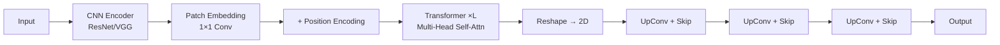

## 引言

在前面的文章中，我们学习了基于CNN的各种UNet变种：[标准UNet](/2025/02/01/fcn-unet-foundation/)、[Attention UNet](/2025/02/10/attention-unet/)、[UNet++/UNet 3+](/2025/02/15/unet-plus-series/)。这些方法虽然强大，但都存在一个根本性限制：

**CNN的局部感受野**

```
问题：卷积操作只能看到局部区域

3×3卷积：感受野3×3
堆叠5层：感受野仅11×11
                ↓
          难以建模远距离依赖
```

**医学图像的挑战**：
- 器官结构跨越大范围（如主动脉从心脏延伸到腹部）
- 病灶位置需要全局上下文（如转移瘤的相对位置）
- 多器官分割需要理解空间关系

**TransUNet**<cite>[1]</cite>（2021）引入**Transformer**，实现真正的**全局建模**：
- ✅ 自注意力机制：任意两点直接交互
- ✅ 长距离依赖：无需堆叠多层即可感知全图
- ✅ CNN + Transformer混合：兼顾局部细节和全局语义

---



## Transformer基础回顾

在深入TransUNet之前，让我们快速回顾Transformer的核心机制。

### 自注意力（Self-Attention）

**核心思想**<cite>[3]</cite>：计算每个位置与所有位置的相关性。

给定输入序列 \( X \in \mathbb{R}^{N \times D} \)（\(N\)个token，每个维度\(D\)）：

**步骤1：线性变换**

$$
\begin{aligned}
Q &= XW_Q \in \mathbb{R}^{N \times d_k} \quad \text{(Query)} \\
K &= XW_K \in \mathbb{R}^{N \times d_k} \quad \text{(Key)} \\
V &= XW_V \in \mathbb{R}^{N \times d_v} \quad \text{(Value)}
\end{aligned}
$$

**步骤2：计算注意力权重**

$$
\text{Attention}(Q, K, V) = \text{softmax}\left( \frac{QK^T}{\sqrt{d_k}} \right) V
$$

- \( QK^T \in \mathbb{R}^{N \times N} \)：相似度矩阵
- \( \text{softmax} \)：归一化为概率分布
- 乘以 \( V \)：加权聚合特征

**可视化**：

```
输入：[x1, x2, x3, x4]

注意力矩阵（QK^T）：
     x1   x2   x3   x4
x1 [0.8  0.1  0.05 0.05]  ← x1主要关注自己
x2 [0.1  0.6  0.2  0.1 ]  ← x2关注x2和x3
x3 [0.05 0.3  0.5  0.15]  ← x3关注x2和x3
x4 [0.05 0.1  0.1  0.75]  ← x4主要关注自己

输出：每个位置是所有位置的加权和
```

**关键优势**：
- ✅ 每个token可以直接看到所有token（全局感受野）
- ✅ 计算并行化（不像RNN需要串行）
- ✅ 权重可视化（可解释性）

### Multi-Head Attention

**思想**：多个注意力头学习不同的交互模式。

$$
\begin{aligned}
\text{head}_i &= \text{Attention}(XW_Q^i, XW_K^i, XW_V^i) \\
\text{MultiHead}(X) &= \text{Concat}(\text{head}_1, \ldots, \text{head}_h) W_O
\end{aligned}
$$

**示例**：8个head
- Head 1：关注局部邻域
- Head 2：关注长距离依赖
- Head 3：关注对称位置
- ...

### Transformer Block

```
Input
  ↓
Multi-Head Self-Attention
  ↓
Add & Norm (残差连接)
  ↓
Feed-Forward Network (MLP)
  ↓
Add & Norm
  ↓
Output
```

**完整公式**：

$$
\begin{aligned}
Z' &= \text{LayerNorm}(X + \text{MultiHeadAttention}(X)) \\
Z &= \text{LayerNorm}(Z' + \text{FFN}(Z'))
\end{aligned}
$$

其中 FFN（Feed-Forward Network）：

$$
\text{FFN}(Z) = \text{GELU}(ZW_1 + b_1)W_2 + b_2
$$

---

## TransUNet：混合架构

### 整体架构

TransUNet = **CNN编码器** + **Transformer** + **CNN解码器**

```
输入图像 (H×W×3)
      ↓
====================
CNN编码器（降采样）
====================
Conv 3×3  →  (H/2×W/2×64)   [e1]
      ↓
Pool + Conv  →  (H/4×W/4×128)  [e2]
      ↓
Pool + Conv  →  (H/8×W/8×256)  [e3]
      ↓
====================
Transformer层
====================
Patch Embedding  →  (P×P tokens, D维)
      ↓
Transformer × L  →  (P×P tokens, D维)
      ↓
Reshape  →  (H/8×W/8×D)  [bottleneck]
      ↓
====================
CNN解码器（上采样）
====================
UpConv + e3  →  (H/4×W/4×256)
      ↓
UpConv + e2  →  (H/2×W/2×128)
      ↓
UpConv + e1  →  (H×W×64)
      ↓
Conv 1×1  →  (H×W×num_classes)
```

### TransUNet 混合流程



### 关键组件详解

#### 1. Patch Embedding

**问题**：Transformer处理序列，如何将2D图像转换为序列？

**解决方案**：将图像划分为固定大小的patch，展平为token序列。

```python
class PatchEmbedding(nn.Module):
    def __init__(self, in_channels=256, embed_dim=768, patch_size=1):
        super().__init__()
        self.proj = nn.Conv2d(
            in_channels, 
            embed_dim,
            kernel_size=patch_size,
            stride=patch_size
        )
    
    def forward(self, x):
        # x: (B, 256, H/8, W/8)
        x = self.proj(x)  # (B, 768, H/8, W/8)
        
        # 展平为序列
        B, C, H, W = x.shape
        x = x.flatten(2)  # (B, 768, H*W)
        x = x.transpose(1, 2)  # (B, H*W, 768)
        
        return x, (H, W)  # 返回序列和空间尺寸
```

**数学表示**：

设输入特征图 \( F \in \mathbb{R}^{H \times W \times C} \)，patch大小为 \( p \times p \)。

$$
\begin{aligned}
\text{num\_patches} &= \frac{H}{p} \times \frac{W}{p} \\
\text{patch}_i &= \text{Flatten}(F[i \cdot p : (i+1) \cdot p, :]) \in \mathbb{R}^{p^2 C} \\
\text{embedding}_i &= \text{patch}_i \cdot W_{\text{proj}} \in \mathbb{R}^D
\end{aligned}
$$

**TransUNet的选择**：patch_size = 1（每个像素一个token）

#### 2. Positional Encoding

**问题**：Transformer是排列不变的（permutation-invariant），无法区分位置。

**解决方案**：添加位置编码。

```python
class PositionalEncoding2D(nn.Module):
    def __init__(self, num_patches, embed_dim):
        super().__init__()
        # 可学习的位置嵌入
        self.pos_embed = nn.Parameter(
            torch.zeros(1, num_patches, embed_dim)
        )
    
    def forward(self, x):
        # x: (B, N, D)
        return x + self.pos_embed
```

**两种方案**：

1. **固定位置编码**（正弦/余弦）：

$$
\text{PE}(pos, 2i) = \sin\left( \frac{pos}{10000^{2i/D}} \right)
$$

$$
\text{PE}(pos, 2i+1) = \cos\left( \frac{pos}{10000^{2i/D}} \right)
$$

2. **可学习位置编码**（TransUNet采用）：

$$
X_{\text{pos}} = X + E_{\text{pos}}
$$

其中 \( E_{\text{pos}} \in \mathbb{R}^{N \times D} \) 是可学习参数。

#### 3. Transformer Encoder

```python
class TransformerEncoder(nn.Module):
    def __init__(self, embed_dim=768, num_heads=12, mlp_ratio=4, depth=12):
        super().__init__()
        self.layers = nn.ModuleList([
            TransformerBlock(embed_dim, num_heads, mlp_ratio)
            for _ in range(depth)
        ])
    
    def forward(self, x):
        for layer in self.layers:
            x = layer(x)
        return x


class TransformerBlock(nn.Module):
    def __init__(self, dim, num_heads, mlp_ratio):
        super().__init__()
        self.norm1 = nn.LayerNorm(dim)
        self.attn = nn.MultiheadAttention(dim, num_heads)
        
        self.norm2 = nn.LayerNorm(dim)
        self.mlp = nn.Sequential(
            nn.Linear(dim, dim * mlp_ratio),
            nn.GELU(),
            nn.Linear(dim * mlp_ratio, dim)
        )
    
    def forward(self, x):
        # Multi-Head Self-Attention
        x_norm = self.norm1(x)
        attn_out, _ = self.attn(x_norm, x_norm, x_norm)
        x = x + attn_out  # 残差连接
        
        # Feed-Forward Network
        x = x + self.mlp(self.norm2(x))
        
        return x
```

#### 4. 完整TransUNet实现

```python
class TransUNet(nn.Module):
    def __init__(self, 
                 img_size=224, 
                 in_channels=3,
                 num_classes=2,
                 embed_dim=768,
                 num_heads=12,
                 depth=12):
        super().__init__()
        
        ### CNN编码器 ###
        self.enc1 = nn.Sequential(
            nn.Conv2d(in_channels, 64, 3, padding=1),
            nn.BatchNorm2d(64),
            nn.ReLU(inplace=True),
            nn.Conv2d(64, 64, 3, padding=1),
            nn.BatchNorm2d(64),
            nn.ReLU(inplace=True)
        )  # H×W×64
        
        self.enc2 = nn.Sequential(
            nn.MaxPool2d(2),
            nn.Conv2d(64, 128, 3, padding=1),
            nn.BatchNorm2d(128),
            nn.ReLU(inplace=True),
            nn.Conv2d(128, 128, 3, padding=1),
            nn.BatchNorm2d(128),
            nn.ReLU(inplace=True)
        )  # H/2×W/2×128
        
        self.enc3 = nn.Sequential(
            nn.MaxPool2d(2),
            nn.Conv2d(128, 256, 3, padding=1),
            nn.BatchNorm2d(256),
            nn.ReLU(inplace=True),
            nn.Conv2d(256, 256, 3, padding=1),
            nn.BatchNorm2d(256),
            nn.ReLU(inplace=True)
        )  # H/4×W/4×256
        
        self.enc4 = nn.Sequential(
            nn.MaxPool2d(2),
            nn.Conv2d(256, 512, 3, padding=1),
            nn.BatchNorm2d(512),
            nn.ReLU(inplace=True)
        )  # H/8×W/8×512
        
        ### Transformer ###
        num_patches = (img_size // 8) ** 2
        
        self.patch_embed = PatchEmbedding(512, embed_dim, patch_size=1)
        self.pos_embed = nn.Parameter(torch.zeros(1, num_patches, embed_dim))
        
        self.transformer = TransformerEncoder(embed_dim, num_heads, depth=depth)
        
        ### CNN解码器 ###
        self.dec3 = nn.Sequential(
            nn.ConvTranspose2d(embed_dim, 256, 2, stride=2),
            nn.BatchNorm2d(256),
            nn.ReLU(inplace=True),
            nn.Conv2d(512, 256, 3, padding=1),  # 512 = 256(skip) + 256(up)
            nn.BatchNorm2d(256),
            nn.ReLU(inplace=True)
        )  # H/4×W/4×256
        
        self.dec2 = nn.Sequential(
            nn.ConvTranspose2d(256, 128, 2, stride=2),
            nn.BatchNorm2d(128),
            nn.ReLU(inplace=True),
            nn.Conv2d(256, 128, 3, padding=1),
            nn.BatchNorm2d(128),
            nn.ReLU(inplace=True)
        )  # H/2×W/2×128
        
        self.dec1 = nn.Sequential(
            nn.ConvTranspose2d(128, 64, 2, stride=2),
            nn.BatchNorm2d(64),
            nn.ReLU(inplace=True),
            nn.Conv2d(128, 64, 3, padding=1),
            nn.BatchNorm2d(64),
            nn.ReLU(inplace=True)
        )  # H×W×64
        
        self.out = nn.Conv2d(64, num_classes, 1)
    
    def forward(self, x):
        # CNN编码器
        e1 = self.enc1(x)  # (B, 64, H, W)
        e2 = self.enc2(e1)  # (B, 128, H/2, W/2)
        e3 = self.enc3(e2)  # (B, 256, H/4, W/4)
        e4 = self.enc4(e3)  # (B, 512, H/8, W/8)
        
        # Transformer
        B, C, H, W = e4.shape
        x_tokens, (h, w) = self.patch_embed(e4)  # (B, H*W, 768)
        x_tokens = x_tokens + self.pos_embed  # 位置编码
        
        x_trans = self.transformer(x_tokens)  # (B, H*W, 768)
        
        # Reshape回2D特征图
        x_trans = x_trans.transpose(1, 2).view(B, -1, h, w)  # (B, 768, H/8, W/8)
        
        # CNN解码器 + Skip Connections
        d3 = self.dec3(x_trans)  # 上采样
        d3 = torch.cat([d3, e3], dim=1)  # Skip连接
        d3 = self.dec3[2:](d3)  # 卷积融合
        
        d2 = self.dec2(d3)
        d2 = torch.cat([d2, e2], dim=1)
        d2 = self.dec2[2:](d2)
        
        d1 = self.dec1(d2)
        d1 = torch.cat([d1, e1], dim=1)
        d1 = self.dec1[2:](d1)
        
        # 输出
        out = self.out(d1)  # (B, num_classes, H, W)
        return out
```

---

## 实验结果

### 数据集

| 数据集 | 任务 | 模态 | 样本数 | 挑战 |
|--------|------|------|--------|------|
| **Synapse multi-organ** | 多器官分割（8类） | CT | 30例，18训练/12测试 | 器官尺度差异大 |
| **ACDC** | 心脏分割 | MRI | 100例，70训练/30测试 | 边界模糊 |

### 性能对比

#### Synapse数据集（8器官分割）

| 方法 | 平均Dice | 平均HD95 | 参数量 |
|------|---------|---------|---------|
| UNet | 76.85 | 39.70 | 31M |
| Attention UNet | 77.77 | 36.02 | 35M |
| UNet++ | 78.32 | 34.16 | 45M |
| **TransUNet** | **81.87** | **28.78** | **105M** |

**各器官Dice**：

| 器官 | UNet | Attention UNet | UNet++ | **TransUNet** |
|------|------|---------------|--------|--------------|
| 主动脉 | 87.23 | 88.61 | 89.07 | **90.75** |
| 胆囊 | 68.60 | 70.30 | 71.15 | **77.42** |
| 左肾 | 84.18 | 84.66 | 85.92 | **88.31** |
| 右肾 | 77.98 | 79.24 | 80.11 | **84.22** |
| 肝脏 | 93.88 | 93.57 | 94.05 | **94.99** |
| 胰腺 | 56.45 | 60.63 | 61.21 | **70.84** |
| 脾脏 | 88.11 | 88.59 | 89.16 | **92.13** |
| 胃 | 75.62 | 76.51 | 76.88 | **82.30** |

**关键观察**<cite>[1]</cite>：
- ✅ **小器官提升明显**：胆囊（+6.3%）、胰腺（+9.6%）
- ✅ **大器官也有提升**：主动脉（+1.7%）、脾脏（+4.0%）
- ✅ **平均HD95大幅下降**：39.70 → 28.78（-27.5%）

#### ACDC数据集（心脏分割）

| 方法 | RV Dice | Myo Dice | LV Dice | 平均Dice |
|------|---------|----------|---------|---------|
| UNet | 87.55 | 80.83 | 94.05 | 87.48 |
| Attention UNet | 88.39 | 81.24 | 94.56 | 88.06 |
| **TransUNet** | **89.71** | **84.53** | **95.73** | **90.00** |

**提升**：+2.5% Dice vs. UNet

---

## TransUNet的优势与挑战

### ✅ 优势

#### 1. 全局建模能力

**示例：主动脉分割**

```
标准UNet：
- 只能通过多层卷积逐步扩大感受野
- 难以捕捉主动脉从心脏到腹部的连续性

TransUNet：
- Transformer直接建模全图依赖
- 理解主动脉的完整走向
- Dice: 87.23% → 90.75%（+3.5%）
```

**可视化注意力图**：

```python
# 提取Transformer的注意力权重
def visualize_attention(model, image):
    with torch.no_grad():
        _ = model(image)
        # 获取最后一层Transformer的注意力
        attn_weights = model.transformer.layers[-1].attn.attn_weights
        # attn_weights: (B, num_heads, N, N)
        
    # 平均所有head
    attn_avg = attn_weights.mean(dim=1)  # (B, N, N)
    
    # 可视化第一个token关注的区域
    attn_map = attn_avg[0, 0, :].view(h, w)
    
    plt.imshow(attn_map.cpu(), cmap='hot')
    plt.title('Attention Map from Token 1')
    plt.show()
```

**典型模式**：
- 浅层head：关注局部邻域（类似卷积）
- 深层head：关注远距离依赖（独特优势）

#### 2. 处理多尺度目标

```
场景：同时分割大器官（肝脏94%）和小器官（胆囊2%）

CNN的困境：
- 浅层特征：高分辨率，适合小目标
- 深层特征：低分辨率，适合大目标
- Skip连接融合效果有限

Transformer的优势：
- 自注意力在任意尺度都能感知全图
- 小器官（胆囊）可以直接"看到"大器官（肝脏）作为参考
- 胆囊Dice: 68.60% → 77.42%（+8.8%）
```

#### 3. 更少的归纳偏置

**CNN的归纳偏置**：
- 局部性（locality）：卷积只看局部
- 平移等变性（translation equivariance）：特征图平移，输出也平移

**Transformer的优势**：
- 更少假设，更强表达能力
- 通过大量数据学习最优结构
- 更好的泛化性

### ❌ 挑战

#### 1. 计算复杂度高

**自注意力的复杂度**：\( O(N^2 D) \)

```
计算量分析：

输入图像：224×224
下采样到：H/8 × W/8 = 28×28 = 784 tokens

标准UNet：
- 参数：31M
- FLOPs：约50 GFLOPs

TransUNet：
- 参数：105M（+3.4×）
- FLOPs：约200 GFLOPs（+4×）
- 注意力矩阵：784×784 = 614,656（每层每个head）
```

**内存占用**：

$$
\text{Memory}_{\text{attn}} = B \times H \times N \times N \times 4 \text{ bytes}
$$

示例：Batch=4, Heads=12, N=784

$$
\text{Memory} = 4 \times 12 \times 784 \times 784 \times 4 \approx 118 \text{ MB（仅注意力矩阵）}
$$

#### 2. 需要大量数据

**Transformer缺乏归纳偏置，需要更多数据**：

```
ImageNet预训练（1.2M图像）：
- TransUNet性能显著提升
- 无预训练时性能下降5-7% Dice

小数据集（<100例）：
- Transformer可能过拟合
- UNet仍然更稳定
```

**解决方案**：
- 使用ImageNet预训练的ViT<cite>[2]</cite>
- 数据增强（旋转、翻转、弹性变形）
- 正则化（Dropout、StochasticDepth）

#### 3. 高分辨率图像困难

**问题**：医学图像通常很大（512×512或更大）

```
512×512图像：
下采样到H/8 × W/8 = 64×64 = 4096 tokens

注意力复杂度：
O(4096^2) ≈ 16.8M次乘法（每层每个head）

内存爆炸：
Batch=2, Heads=12, N=4096
→ 内存需求：约3GB（仅注意力）
```

**解决方案**：
- 更aggressive的下采样（H/16）
- Patch merging（如Swin Transformer）
- Window-based attention（局部注意力）

---

## TransUNet的变种

### 1. MedT（Medical Transformer）

**改进**：Gated Axial Attention（门控轴向注意力）

```python
class GatedAxialAttention(nn.Module):
    """
    将2D注意力分解为行注意力+列注意力
    复杂度：O(H×W×(H+W)) vs. O(H^2×W^2)
    """
    def __init__(self, dim):
        super().__init__()
        self.row_attn = AxialAttention(dim, axis=0)
        self.col_attn = AxialAttention(dim, axis=1)
        self.gate = nn.Parameter(torch.ones(1))
    
    def forward(self, x):
        # x: (B, C, H, W)
        x_row = self.row_attn(x)
        x_col = self.col_attn(x)
        return self.gate * x_row + (1 - self.gate) * x_col
```

**优势**：
- 计算量降低：\( O(N^2) \rightarrow O(N\sqrt{N}) \)
- 适合高分辨率医学图像

### 2. UNETR

**改进**：纯Transformer编码器，无CNN

```
输入  →  Patch Embedding  →  Transformer × 12
                                     ↓
                        每3层提取特征作为skip
                                     ↓
                              CNN解码器
```

**特点**：
- 更彻底的Transformer设计
- 性能与TransUNet相当
- 参数量略小

### 3. CoTr (Contextual Transformer)

**改进**：多尺度Transformer

```
编码器：
├─ Transformer @ H/8（高分辨率）
├─ Transformer @ H/16（中分辨率）
└─ Transformer @ H/32（低分辨率）

解码器融合多尺度特征
```

---

## 训练技巧

### 1. 预训练策略

```python
# 使用ImageNet预训练的ViT权重
def load_pretrained_vit(model, vit_name='vit_base_patch16_224'):
    import timm
    
    # 加载预训练ViT
    pretrained_vit = timm.create_model(vit_name, pretrained=True)
    
    # 提取Transformer权重
    model_dict = model.state_dict()
    pretrained_dict = pretrained_vit.state_dict()
    
    # 仅加载Transformer部分
    pretrained_dict = {
        k: v for k, v in pretrained_dict.items() 
        if 'blocks' in k and k in model_dict
    }
    
    model_dict.update(pretrained_dict)
    model.load_state_dict(model_dict)
    
    print(f"Loaded {len(pretrained_dict)} layers from {vit_name}")
```

### 2. 两阶段训练

```python
# 阶段1：冻结Transformer，训练CNN部分
for epoch in range(50):
    # 冻结Transformer
    for name, param in model.named_parameters():
        if 'transformer' in name:
            param.requires_grad = False
    
    train_epoch(model, train_loader)

# 阶段2：解冻Transformer，fine-tune全网络
for epoch in range(50, 150):
    # 解冻Transformer
    for param in model.parameters():
        param.requires_grad = True
    
    # 使用更小的学习率
    optimizer = torch.optim.Adam(model.parameters(), lr=1e-5)
    train_epoch(model, train_loader)
```

### 3. 混合精度训练

```python
from torch.cuda.amp import autocast, GradScaler

scaler = GradScaler()

for images, masks in train_loader:
    optimizer.zero_grad()
    
    # 自动混合精度
    with autocast():
        outputs = model(images)
        loss = criterion(outputs, masks)
    
    # 缩放损失并反向传播
    scaler.scale(loss).backward()
    scaler.step(optimizer)
    scaler.update()
```

**优势**：
- 减少50%内存占用
- 加速20-30%训练
- 精度几乎无损失

---

## 总结

### TransUNet的核心贡献

1. **首次将Transformer成功应用于医学图像分割**<cite>[1]</cite>
   - 证明全局建模对医学图像的重要性
   - Dice提升：76.85% → 81.87%（+5%）

2. **混合架构设计**
   - CNN提取局部特征
   - Transformer建模全局依赖
   - 两者优势互补

3. **开启医学分割Transformer时代**<cite>[1]</cite>
   - 后续涌现大量Transformer分割网络
   - 成为新范式的基石

### 适用场景

| 场景 | 是否适合 | 原因 |
|------|---------|------|
| 大器官（肝脏、肺） | ✅ | 全局结构建模 |
| 小器官（胰腺、胆囊） | ✅✅ | 长距离依赖 |
| 多类别分割 | ✅✅ | 全局上下文 |
| 小数据集（<50例） | ❌ | 需要预训练 |
| 实时应用 | ❌ | 计算量大 |
| 高分辨率（>512） | ⚠️ | 需要优化 |

---

## 参考资料

<ol class="references">
  <li><strong>Chen, J. et al.</strong> "TransUNet: Transformers Make Strong Encoders for Medical Image Segmentation", arXiv:2102.04306, 2021. <a href="https://arxiv.org/abs/2102.04306">arXiv:2102.04306</a> <span class="code-link">[<a href="https://github.com/Beckschen/TransUNet">Code</a>]</span></li>
  <li><strong>Dosovitskiy, A. et al.</strong> "An Image is Worth 16x16 Words: Transformers for Image Recognition at Scale", ICLR 2021. <a href="https://arxiv.org/abs/2010.11929">arXiv:2010.11929</a></li>
  <li><strong>Vaswani, A. et al.</strong> "Attention is All You Need", NeurIPS 2017. <a href="https://arxiv.org/abs/1706.03762">arXiv:1706.03762</a></li>
  <li>UNETR 代码实现 (MONAI). <a href="https://github.com/Project-MONAI/research-contributions/tree/main/UNETR">https://github.com/Project-MONAI/research-contributions/tree/main/UNETR</a></li>
  <li>Medical Transformer 代码库. <a href="https://github.com/jeya-maria-jose/Medical-Transformer">https://github.com/jeya-maria-jose/Medical-Transformer</a></li>
  <li>Synapse Multi-organ 数据集. <a href="https://www.synapse.org/#!Synapse:syn3193805/wiki/217789">https://www.synapse.org/#!Synapse:syn3193805/wiki/217789</a></li>
  <li>ACDC 数据集. <a href="https://www.creatis.insa-lyon.fr/Challenge/acdc/">https://www.creatis.insa-lyon.fr/Challenge/acdc/</a></li>
</ol>

---



