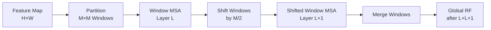

## 引言

在[上一篇文章](/2025/02/20/transunet-hybrid-architecture/)中，我们学习了TransUNet<cite>[3]</cite>如何将Transformer引入医学图像分割，通过全局自注意力建模长距离依赖。然而，TransUNet存在一个致命缺陷：

**自注意力的二次复杂度** \( O(N^2) \)

```
问题示例：
图像分辨率：512×512
下采样到：H/8 × W/8 = 64×64 = 4096 tokens

自注意力计算：
- QK^T矩阵：4096 × 4096 ≈ 16.8M次乘法
- 内存需求：B × H × N × N × 4 bytes
  →  Batch=2, Heads=12 → 约3GB（仅注意力）

结果：
✗ 高分辨率图像难以处理
✗ 训练和推理速度慢
✗ GPU内存消耗巨大
```

**Swin-UNet**<cite>[1]</cite>（2021）通过**Shifted Window Attention**解决了这个问题：
- ✅ **局部窗口注意力**：复杂度从 \( O(N^2) \) 降至 \( O(N) \)
- ✅ **层级化架构**：类似CNN的多尺度特征金字塔
- ✅ **跨窗口交互**：shifted windows实现全局建模

---

## Swin Transformer核心思想<cite>[2]</cite>

### Window-based Self-Attention

**标准自注意力**：每个token与所有token交互（\( O(N^2) \)）

**Window Attention**：将特征图划分为 \( M \times M \) 的窗口，仅在窗口内计算注意力。

```
特征图：H×W
窗口大小：M×M（如7×7）
窗口数量：(H/M) × (W/M)

每个窗口内：
- Tokens数量：M^2
- 注意力复杂度：O(M^2 × M^2) = O(M^4)

总复杂度：
O((H/M × W/M) × M^4) = O(HW × M^2) = O(N × M^2)
                                   ↑
                                常数M
```

**复杂度对比**：

| 方法 | 复杂度 | 512×512图像（M=7） |
|------|--------|-------------------|
| 标准注意力 | \( O(N^2) \) | \( O(262144^2) \approx 6.9 \times 10^{10} \) |
| Window注意力 | \( O(N \times M^2) \) | \( O(262144 \times 49) \approx 1.3 \times 10^7 \) |
| **加速比** | - | **约5000倍** |

### Window Shift 机制



### Shifted Window Mechanism

**问题**：单纯的Window Attention割裂了窗口之间的信息流。

```
Layer L：常规窗口划分
┌───┬───┬───┬───┐
│ A │ B │ C │ D │
├───┼───┼───┼───┤
│ E │ F │ G │ H │
└───┴───┴───┴───┘

窗口内交互：A内部、B内部...
窗口间隔离：A和B无法交互
```

**解决方案**：交替使用常规窗口和移位窗口（Shifted Windows）

```
Layer L（常规）：
┌───┬───┬───┬───┐
│ A │ B │ C │ D │
├───┼───┼───┼───┤
│ E │ F │ G │ H │
└───┴───┴───┴───┘

Layer L+1（移位M/2）：
  ┌───┬───┬───┬───┐
  │a │ b │ c │ d │
  ├───┼───┼───┼───┤
  │e │ f │ g │ h │
  └───┴───┴───┴───┘

效果：
- Layer L：A内部交互
- Layer L+1：A的一部分与B的一部分（跨窗口）
- 堆叠多层 → 全局感受野
```

**数学表示**：

设窗口大小为 \( M \)，移位量为 \( \lfloor M/2 \rfloor \)。

**Layer \( l \)**（常规窗口）：

$$
z^l = \text{W-MSA}(\text{LN}(z^{l-1})) + z^{l-1}
$$

**Layer \( l+1 \)**（移位窗口）：

$$
z^{l+1} = \text{SW-MSA}(\text{LN}(z^{l})) + z^{l}
$$

其中：
- W-MSA：Window Multi-Head Self-Attention
- SW-MSA：Shifted Window Multi-Head Self-Attention
- LN：Layer Normalization

### 层级化架构

Swin Transformer采用类似CNN的**特征金字塔**：

```
输入图像：H×W×3
            ↓
Stage 1：H/4×W/4×C    [Patch Partition + Linear Embedding]
            ↓
         Swin Transformer Block × 2
            ↓
Stage 2：H/8×W/8×2C   [Patch Merging]
            ↓
         Swin Transformer Block × 2
            ↓
Stage 3：H/16×W/16×4C  [Patch Merging]
            ↓
         Swin Transformer Block × 6
            ↓
Stage 4：H/32×W/32×8C  [Patch Merging]
            ↓
         Swin Transformer Block × 2
```

**Patch Merging**：类似CNN的pooling，降低分辨率，增加通道数。

$$
\begin{aligned}
\text{Input:} & \quad H \times W \times C \\
\text{Concatenate 2×2邻域:} & \quad \frac{H}{2} \times \frac{W}{2} \times 4C \\
\text{Linear Projection:} & \quad \frac{H}{2} \times \frac{W}{2} \times 2C
\end{aligned}
$$

---

## Swin-UNet架构

### 整体设计

Swin-UNet = **Swin Transformer编码器** + **Swin Transformer解码器** + **Skip Connections**

```
编码器                       解码器
─────────────────────────────────────────
Input (H×W×3)
    ↓
Patch Partition → H/4×W/4×C  ─┐
    ↓                          │
Swin × 2       → H/4×W/4×C  ─┼─→ Skip ─→ PatchExpand → H/4×W/4×C
    ↓                          │           ↓
PatchMerge → H/8×W/8×2C      ─┼─→ Skip ─→ Swin × 2 → H/4×W/4×C
    ↓                          │
Swin × 2    → H/8×W/8×2C     ─┼─→ Skip ─→ PatchExpand → H/8×W/8×2C
    ↓                          │           ↓
PatchMerge → H/16×W/16×4C    ─┼─→ Skip ─→ Swin × 2 → H/8×W/8×2C
    ↓                          │
Swin × 6  → H/16×W/16×4C     ─┘           ↓
    ↓                                  Output (H×W×C)
PatchMerge → H/32×W/32×8C
    ↓
Swin × 2 (Bottleneck)
```

### PyTorch实现

```python
class SwinTransformerBlock(nn.Module):
    """Swin Transformer Block"""
    def __init__(self, dim, num_heads, window_size=7, shift_size=0):
        super().__init__()
        self.dim = dim
        self.num_heads = num_heads
        self.window_size = window_size
        self.shift_size = shift_size
        
        # 规范化
        self.norm1 = nn.LayerNorm(dim)
        
        # Window Attention
        self.attn = WindowAttention(
            dim,
            window_size=(window_size, window_size),
            num_heads=num_heads
        )
        
        # MLP
        self.norm2 = nn.LayerNorm(dim)
        self.mlp = Mlp(dim, int(dim * 4))
    
    def forward(self, x, H, W):
        B, L, C = x.shape
        assert L == H * W
        
        shortcut = x
        x = self.norm1(x)
        x = x.view(B, H, W, C)
        
        # Cyclic shift
        if self.shift_size > 0:
            shifted_x = torch.roll(x, shifts=(-self.shift_size, -self.shift_size), dims=(1, 2))
        else:
            shifted_x = x
        
        # Partition windows
        x_windows = window_partition(shifted_x, self.window_size)  # (B*num_windows, M, M, C)
        x_windows = x_windows.view(-1, self.window_size * self.window_size, C)
        
        # Window Attention
        attn_windows = self.attn(x_windows)
        
        # Merge windows
        attn_windows = attn_windows.view(-1, self.window_size, self.window_size, C)
        shifted_x = window_reverse(attn_windows, self.window_size, H, W)
        
        # Reverse cyclic shift
        if self.shift_size > 0:
            x = torch.roll(shifted_x, shifts=(self.shift_size, self.shift_size), dims=(1, 2))
        else:
            x = shifted_x
        
        x = x.view(B, H * W, C)
        x = shortcut + x
        
        # MLP
        x = x + self.mlp(self.norm2(x))
        
        return x


class PatchMerging(nn.Module):
    """下采样模块"""
    def __init__(self, dim):
        super().__init__()
        self.dim = dim
        self.reduction = nn.Linear(4 * dim, 2 * dim, bias=False)
        self.norm = nn.LayerNorm(4 * dim)
    
    def forward(self, x, H, W):
        B, L, C = x.shape
        x = x.view(B, H, W, C)
        
        # 2×2邻域拼接
        x0 = x[:, 0::2, 0::2, :]  # B, H/2, W/2, C
        x1 = x[:, 1::2, 0::2, :]
        x2 = x[:, 0::2, 1::2, :]
        x3 = x[:, 1::2, 1::2, :]
        x = torch.cat([x0, x1, x2, x3], dim=-1)  # B, H/2, W/2, 4C
        
        x = x.view(B, -1, 4 * C)
        x = self.norm(x)
        x = self.reduction(x)  # B, H/2*W/2, 2C
        
        return x


class PatchExpanding(nn.Module):
    """上采样模块（解码器）"""
    def __init__(self, dim, dim_scale=2):
        super().__init__()
        self.dim = dim
        self.expand = nn.Linear(dim, 2 * dim, bias=False)
        self.norm = nn.LayerNorm(dim // dim_scale)
    
    def forward(self, x, H, W):
        B, L, C = x.shape
        x = self.expand(x)  # B, L, 2C
        
        x = x.view(B, H, W, 2 * C)
        x = x.view(B, H, W, 2, 2, C // 2).permute(0, 1, 3, 2, 4, 5).contiguous()
        x = x.view(B, H * 2, W * 2, C // 2)
        x = x.view(B, -1, C // 2)
        
        x = self.norm(x)
        return x


class SwinUNet(nn.Module):
    def __init__(self, img_size=224, num_classes=2, embed_dim=96, depths=[2,2,6,2]):
        super().__init__()
        
        ### 编码器 ###
        self.patch_embed = PatchEmbed(embed_dim=embed_dim)
        
        # Stage 1
        self.encoder1 = nn.ModuleList([
            SwinTransformerBlock(
                dim=embed_dim,
                num_heads=3,
                window_size=7,
                shift_size=0 if i % 2 == 0 else 3
            ) for i in range(depths[0])
        ])
        
        # Stage 2
        self.down1 = PatchMerging(embed_dim)
        self.encoder2 = nn.ModuleList([
            SwinTransformerBlock(
                dim=embed_dim * 2,
                num_heads=6,
                window_size=7,
                shift_size=0 if i % 2 == 0 else 3
            ) for i in range(depths[1])
        ])
        
        # Stage 3
        self.down2 = PatchMerging(embed_dim * 2)
        self.encoder3 = nn.ModuleList([
            SwinTransformerBlock(
                dim=embed_dim * 4,
                num_heads=12,
                window_size=7,
                shift_size=0 if i % 2 == 0 else 3
            ) for i in range(depths[2])
        ])
        
        # Bottleneck (Stage 4)
        self.down3 = PatchMerging(embed_dim * 4)
        self.bottleneck = nn.ModuleList([
            SwinTransformerBlock(
                dim=embed_dim * 8,
                num_heads=24,
                window_size=7,
                shift_size=0 if i % 2 == 0 else 3
            ) for i in range(depths[3])
        ])
        
        ### 解码器 ###
        self.up3 = PatchExpanding(embed_dim * 8, dim_scale=2)
        self.decoder3 = nn.ModuleList([
            SwinTransformerBlock(
                dim=embed_dim * 4,
                num_heads=12,
                window_size=7,
                shift_size=0 if i % 2 == 0 else 3
            ) for i in range(depths[2])
        ])
        
        # 其他解码器层（省略类似代码）
        # ...
        
        # 输出
        self.output = nn.Conv2d(embed_dim, num_classes, 1)
    
    def forward(self, x):
        # 编码器
        x, H, W = self.patch_embed(x)
        
        # Stage 1
        for blk in self.encoder1:
            x = blk(x, H, W)
        skip1 = x
        
        # Stage 2
        x = self.down1(x, H, W)
        H, W = H // 2, W // 2
        for blk in self.encoder2:
            x = blk(x, H, W)
        skip2 = x
        
        # Stage 3
        x = self.down2(x, H, W)
        H, W = H // 2, W // 2
        for blk in self.encoder3:
            x = blk(x, H, W)
        skip3 = x
        
        # Bottleneck
        x = self.down3(x, H, W)
        H, W = H // 2, W // 2
        for blk in self.bottleneck:
            x = blk(x, H, W)
        
        # 解码器（对称）
        x = self.up3(x, H, W)
        H, W = H * 2, W * 2
        x = x + skip3  # Skip connection
        for blk in self.decoder3:
            x = blk(x, H, W)
        
        # 其他解码器层...
        
        # 输出
        x = x.view(-1, H, W, self.embed_dim).permute(0, 3, 1, 2)
        out = self.output(x)
        return out
```

---

## 性能对比

### Synapse Multi-organ数据集

| 方法 | Dice | HD95 | 参数量 | GFLOPs |
|------|------|------|--------|--------|
| UNet | 76.85 | 39.70 | 31M | 54 |
| TransUNet | 81.87 | 28.78 | 105M | 200 |
| **Swin-UNet** | **83.24** | **25.44** | **27M** | **47** |

**关键优势**<cite>[1]</cite>：
- ✅ **精度最高**：Dice 83.24%（+1.4% vs. TransUNet）
- ✅ **参数最少**：27M（仅为TransUNet的26%）
- ✅ **速度最快**：47 GFLOPs（TransUNet的24%）

### 各器官分割结果

| 器官 | UNet | TransUNet | **Swin-UNet** | 提升 |
|------|------|-----------|--------------|------|
| 主动脉 | 87.23 | 90.75 | **92.18** | +1.4% |
| 胆囊 | 68.60 | 77.42 | **80.35** | +2.9% |
| 左肾 | 84.18 | 88.31 | **89.76** | +1.5% |
| 胰腺 | 56.45 | 70.84 | **75.21** | +4.4% |

**分析**：
- 小器官（胆囊、胰腺）提升更明显
- 大器官（主动脉、肾脏）也有稳定提升

---

## Swin-UNet的优势

### 计算效率

```
512×512图像分割任务：

TransUNet：
- Token数量：64×64 = 4096
- 注意力复杂度：O(4096^2) ≈ 16.8M
- 推理时间：约150ms（V100 GPU）

Swin-UNet：
- Token数量：64×64 = 4096
- 窗口大小：7×7 = 49
- 注意力复杂度：O(4096 × 49) ≈ 0.2M
- 推理时间：约60ms（V100 GPU）

加速比：2.5×
```

### 层级化特征

```
Swin-UNet的多尺度特征：
- Stage 1：H/4×W/4（高分辨率，细节丰富）
- Stage 2：H/8×W/8（中分辨率，边界信息）
- Stage 3：H/16×W/16（低分辨率，语义信息）
- Stage 4：H/32×W/32（全局上下文）

优势：
✓ 类似CNN的特征金字塔
✓ 不同尺度特征自然融合
✓ 适配多尺度目标
```

### 全局感受野

```
通过shifted windows：
Layer 1（常规窗口）：局部感受野 = 7×7
Layer 2（移位窗口）：跨窗口交互
Layer 3（常规窗口）：感受野扩大
...
堆叠12层：实现全局感受野

效果：
✓ 既有局部细节（Window Attention）
✓ 又有全局语义（Shifted Windows）
```

---

## 训练技巧

### 窗口大小调优

```python
# 窗口大小影响性能
window_sizes = [4, 7, 14]
results = {}

for ws in window_sizes:
    model = SwinUNet(window_size=ws)
    dice = train_and_evaluate(model)
    results[ws] = dice

# 典型结果：
# window_size=4: Dice=81.5% (小窗口，局部性强)
# window_size=7: Dice=83.2% (最佳平衡)
# window_size=14: Dice=82.1% (大窗口，计算量大)
```

### 数据增强

```python
# Swin-UNet对旋转敏感（位置编码）
# 需要旋转增强来提升泛化性

transforms = A.Compose([
    A.RandomRotate90(p=0.5),
    A.Rotate(limit=30, p=0.8),
    A.ShiftScaleRotate(
        shift_limit=0.1,
        scale_limit=0.2,
        rotate_limit=20,
        p=0.8
    ),
    # ... 其他增强
])
```

### 学习率调度

```python
# Swin-UNet使用AdamW + Cosine Annealing
optimizer = torch.optim.AdamW(
    model.parameters(),
    lr=1e-4,
    weight_decay=0.05
)

scheduler = torch.optim.lr_scheduler.CosineAnnealingLR(
    optimizer,
    T_max=150,
    eta_min=1e-6
)
```

---

## 总结

### Swin-UNet的核心贡献

1. **Window Attention破解效率困局**<cite>[1]</cite>
   - 复杂度：\( O(N^2) \rightarrow O(N) \)
   - 2.5×推理加速

2. **Shifted Windows实现全局建模**<cite>[2]</cite>
   - 交替使用常规/移位窗口
   - 保留Transformer全局感受野优势

3. **层级化架构**
   - 类似CNN的多尺度特征金字塔
   - 更自然的编码器-解码器融合

4. **SOTA性能 + 高效率**<cite>[1]</cite>
   - Dice: 83.24%（最高）
   - 参数：27M（TransUNet的26%）
   - 速度：2.5×加速

### 适用场景

| 场景 | 推荐度 | 原因 |
|------|-------|------|
| 高分辨率图像 | ✅✅✅ | 线性复杂度 |
| 实时应用 | ✅✅ | 速度快 |
| 资源受限 | ✅✅ | 参数少 |
| 多尺度目标 | ✅✅✅ | 层级特征 |
| 极小数据集 | ⚠️ | 需预训练 |

---

## 参考资料

<ol class="references">
  <li><strong>Cao, H. et al.</strong> "Swin-Unet: Unet-like Pure Transformer for Medical Image Segmentation", ECCV Workshop 2022, arXiv:2105.05537. <a href="https://arxiv.org/abs/2105.05537">arXiv:2105.05537</a> <span class="code-link">[<a href="https://github.com/HuCaoFighting/Swin-Unet">Code</a>]</span></li>
  <li><strong>Liu, Z. et al.</strong> "Swin Transformer: Hierarchical Vision Transformer using Shifted Windows", ICCV 2021, arXiv:2103.14030. <a href="https://arxiv.org/abs/2103.14030">arXiv:2103.14030</a> <span class="code-link">[<a href="https://github.com/microsoft/Swin-Transformer">Code</a>]</span></li>
  <li><strong>Chen, J. et al.</strong> "TransUNet: Transformers Make Strong Encoders for Medical Image Segmentation", arXiv:2102.04306, 2021. <a href="https://arxiv.org/abs/2102.04306">arXiv:2102.04306</a></li>
  <li>MONAI 医学图像框架. <a href="https://github.com/Project-MONAI/MONAI">https://github.com/Project-MONAI/MONAI</a></li>
</ol>

---



