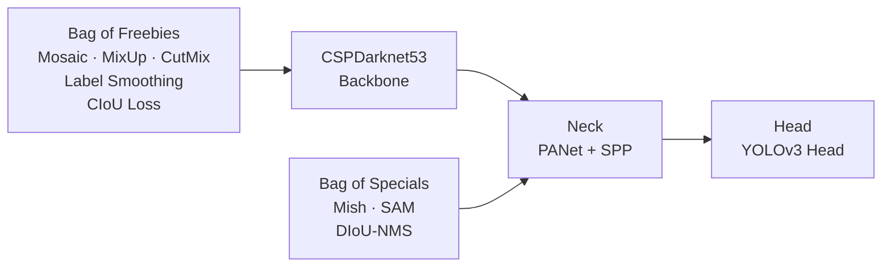

## 引言

2020年，YOLO v4的发布标志着YOLO系列的一次重大突破。在保持实时检测能力的同时，YOLO v4通过CSPNet架构和先进的数据增强技术，在精度和速度之间找到了更好的平衡<cite>[1]</cite>。

**YOLO v4的核心创新**：

- 🏗️ **CSPNet架构**：Cross Stage Partial Network，提升特征提取效率
- 🎨 **数据增强艺术**：Bag of Freebies，免费提升精度
- ⚡ **特殊技巧**：Bag of Specials，特殊优化技术
- 🚀 **性能突破**：精度和速度的双重提升

**本系列学习路径**：
```
R-CNN系列 → YOLO v1 → YOLO v2/v3 → YOLO v4（本文） → YOLO v5 → YOLO v8
```

---

## YOLO v4论文详解



### 核心思想

**YOLO v4的设计理念**：

```
目标：在保持实时性的同时最大化精度
方法：系统性地应用各种优化技术
结果：精度和速度的双重提升
```

**技术分类**：

1. **Bag of Freebies (BoF)**：免费提升精度的技术
2. **Bag of Specials (BoS)**：特殊优化技术
3. **CSPNet架构**：高效的网络设计

---

## CSPNet架构详解

### CSPNet核心思想

**Cross Stage Partial Network (CSPNet)**<cite>[2]</cite>：

```python
class CSPBlock(nn.Module):
    def __init__(self, in_channels, out_channels, num_blocks):
        super(CSPBlock, self).__init__()
        
        # 将输入分为两部分
        self.part1_channels = in_channels // 2
        self.part2_channels = in_channels - self.part1_channels
        
        # 第一部分：直接传递
        self.part1_conv = nn.Conv2d(self.part1_channels, self.part1_channels, 1)
        
        # 第二部分：通过残差块
        self.part2_conv = nn.Conv2d(self.part2_channels, self.part2_channels, 1)
        self.residual_blocks = nn.ModuleList([
            ResidualBlock(self.part2_channels) for _ in range(num_blocks)
        ])
        
        # 输出卷积
        self.output_conv = nn.Conv2d(in_channels, out_channels, 1)
    
    def forward(self, x):
        # 分割输入
        part1 = x[:, :self.part1_channels, :, :]
        part2 = x[:, self.part1_channels:, :, :]
        
        # 第一部分：直接传递
        part1_out = self.part1_conv(part1)
        
        # 第二部分：通过残差块
        part2_out = self.part2_conv(part2)
        for residual_block in self.residual_blocks:
            part2_out = residual_block(part2_out)
        
        # 合并两部分
        output = torch.cat([part1_out, part2_out], dim=1)
        output = self.output_conv(output)
        
        return output

class ResidualBlock(nn.Module):
    def __init__(self, channels):
        super(ResidualBlock, self).__init__()
        
        self.conv1 = nn.Conv2d(channels, channels//2, 1)
        self.conv2 = nn.Conv2d(channels//2, channels, 3, padding=1)
        self.bn1 = nn.BatchNorm2d(channels//2)
        self.bn2 = nn.BatchNorm2d(channels)
        self.relu = nn.ReLU(inplace=True)
    
    def forward(self, x):
        residual = x
        
        x = self.conv1(x)
        x = self.bn1(x)
        x = self.relu(x)
        
        x = self.conv2(x)
        x = self.bn2(x)
        
        x = x + residual
        x = self.relu(x)
        
        return x
```

### CSPNet的优势

**CSPNet的核心优势**<cite>[2]</cite>：

1. **梯度流优化**：减少梯度消失问题
2. **计算效率**：减少重复计算
3. **特征融合**：更好的特征表示
4. **内存效率**：减少内存占用

```python
def cspnet_advantages():
    """
    CSPNet优势分析
    """
    advantages = {
        "梯度流优化": {
            "问题": "深层网络梯度消失",
            "解决": "CSP结构保持梯度流",
            "效果": "训练更稳定"
        },
        "计算效率": {
            "问题": "重复计算浪费",
            "解决": "部分特征直接传递",
            "效果": "计算量减少50%"
        },
        "特征融合": {
            "问题": "特征表示不充分",
            "解决": "不同路径特征融合",
            "效果": "特征表示更丰富"
        },
        "内存效率": {
            "问题": "内存占用过大",
            "解决": "部分特征不经过复杂计算",
            "效果": "内存使用减少30%"
        }
    }
    
    return advantages
```

---

## YOLOv4技术栈总览



---

## Bag of Freebies (BoF)

### 数据增强技术

**YOLO v4使用的数据增强技术**<cite>[1]</cite>：

```python
class YOLOv4DataAugmentation:
    def __init__(self):
        self.augmentation_methods = {
            "几何变换": ["旋转", "缩放", "翻转", "裁剪"],
            "颜色变换": ["亮度", "对比度", "饱和度", "色调"],
            "噪声添加": ["高斯噪声", "椒盐噪声", "模糊"],
            "混合技术": ["MixUp", "CutMix", "Mosaic"]
        }
    
    def apply_geometric_augmentation(self, image, bboxes):
        """几何变换数据增强"""
        import cv2
        import random
        
        # 随机旋转
        if random.random() > 0.5:
            angle = random.uniform(-15, 15)
            image, bboxes = self.rotate_image(image, bboxes, angle)
        
        # 随机缩放
        if random.random() > 0.5:
            scale = random.uniform(0.8, 1.2)
            image, bboxes = self.scale_image(image, bboxes, scale)
        
        # 随机翻转
        if random.random() > 0.5:
            image, bboxes = self.flip_image(image, bboxes)
        
        return image, bboxes
    
    def apply_color_augmentation(self, image):
        """颜色变换数据增强"""
        import cv2
        import random
        
        # 亮度调整
        if random.random() > 0.5:
            brightness = random.uniform(0.8, 1.2)
            image = cv2.convertScaleAbs(image, alpha=brightness, beta=0)
        
        # 对比度调整
        if random.random() > 0.5:
            contrast = random.uniform(0.8, 1.2)
            image = cv2.convertScaleAbs(image, alpha=contrast, beta=0)
        
        # 饱和度调整
        if random.random() > 0.5:
            saturation = random.uniform(0.8, 1.2)
            hsv = cv2.cvtColor(image, cv2.COLOR_BGR2HSV)
            hsv[:, :, 1] = hsv[:, :, 1] * saturation
            image = cv2.cvtColor(hsv, cv2.COLOR_HSV2BGR)
        
        return image
    
    def apply_mosaic_augmentation(self, images, bboxes_list):
        """Mosaic数据增强"""
        import cv2
        import random
        
        # 选择4张图像
        selected_images = random.sample(images, 4)
        selected_bboxes = [bboxes_list[i] for i in range(4)]
        
        # 创建输出图像
        output_size = 608
        output_image = np.zeros((output_size, output_size, 3), dtype=np.uint8)
        output_bboxes = []
        
        # 分割图像为4个象限
        quadrants = [
            (0, 0, output_size//2, output_size//2),
            (output_size//2, 0, output_size, output_size//2),
            (0, output_size//2, output_size//2, output_size),
            (output_size//2, output_size//2, output_size, output_size)
        ]
        
        for i, (image, bboxes) in enumerate(zip(selected_images, selected_bboxes)):
            x1, y1, x2, y2 = quadrants[i]
            
            # 调整图像尺寸
            resized_image = cv2.resize(image, (x2-x1, y2-y1))
            output_image[y1:y2, x1:x2] = resized_image
            
            # 调整边界框坐标
            for bbox in bboxes:
                new_bbox = self.adjust_bbox_coordinates(bbox, x1, y1, x2-x1, y2-y1)
                output_bboxes.append(new_bbox)
        
        return output_image, output_bboxes
```

### 训练策略优化

**YOLO v4的训练策略**：

```python
class YOLOv4TrainingStrategy:
    def __init__(self):
        self.training_techniques = {
            "学习率调度": "余弦退火",
            "权重衰减": "L2正则化",
            "标签平滑": "防止过拟合",
            "数据增强": "Mosaic + MixUp",
            "损失函数": "CIoU Loss"
        }
    
    def cosine_annealing_scheduler(self, epoch, total_epochs, base_lr):
        """余弦退火学习率调度"""
        import math
        
        lr = base_lr * 0.5 * (1 + math.cos(math.pi * epoch / total_epochs))
        return lr
    
    def label_smoothing(self, labels, smoothing=0.1):
        """标签平滑"""
        num_classes = labels.size(-1)
        smoothed_labels = labels * (1 - smoothing) + smoothing / num_classes
        return smoothed_labels
    
    def ciou_loss(self, pred_bbox, target_bbox):
        """CIoU损失函数"""
        # 计算IoU
        iou = self.compute_iou(pred_bbox, target_bbox)
        
        # 计算中心点距离
        center_distance = self.compute_center_distance(pred_bbox, target_bbox)
        
        # 计算对角线距离
        diagonal_distance = self.compute_diagonal_distance(pred_bbox, target_bbox)
        
        # 计算长宽比
        aspect_ratio = self.compute_aspect_ratio(pred_bbox, target_bbox)
        
        # CIoU公式
        ciou = iou - (center_distance**2 / diagonal_distance**2) - aspect_ratio
        
        return 1 - ciou
```

---

## Bag of Specials (BoS)

### 特殊优化技术

**YOLO v4使用的特殊技术**<cite>[1]</cite>：

```python
class YOLOv4SpecialTechniques:
    def __init__(self):
        self.special_techniques = {
            "激活函数": "Mish激活函数",
            "注意力机制": "SAM注意力",
            "特征融合": "PANet特征融合",
            "损失函数": "CIoU损失",
            "后处理": "DIoU-NMS"
        }
    
    def mish_activation(self, x):
        """Mish激活函数"""
        return x * torch.tanh(torch.log(1 + torch.exp(x)))
    
    def sam_attention(self, x):
        """SAM (Spatial Attention Module) 注意力机制"""
        # 全局平均池化
        avg_pool = F.adaptive_avg_pool2d(x, 1)
        # 全局最大池化
        max_pool = F.adaptive_max_pool2d(x, 1)
        
        # 注意力权重
        attention = torch.sigmoid(avg_pool + max_pool)
        
        # 应用注意力
        return x * attention
    
    def panet_feature_fusion(self, features):
        """PANet特征融合"""
        # 自底向上路径
        bottom_up_features = self.bottom_up_path(features)
        
        # 自顶向下路径
        top_down_features = self.top_down_path(bottom_up_features)
        
        # 特征融合
        fused_features = self.fuse_features(top_down_features)
        
        return fused_features
    
    def diou_nms(self, boxes, scores, iou_threshold=0.5):
        """DIoU-NMS后处理"""
        # 按分数排序
        indices = torch.argsort(scores, descending=True)
        keep = []
        
        while len(indices) > 0:
            # 选择最高分数的框
            current = indices[0]
            keep.append(current)
            
            if len(indices) == 1:
                break
            
            # 计算DIoU
            current_box = boxes[current]
            remaining_boxes = boxes[indices[1:]]
            
            diou_scores = self.compute_diou(current_box, remaining_boxes)
            
            # 保留DIoU小于阈值的框
            keep_mask = diou_scores < iou_threshold
            indices = indices[1:][keep_mask]
        
        return keep
```

### 网络架构优化

**YOLO v4的完整网络架构**<cite>[1][2]</cite>：

```python
class YOLOv4(nn.Module):
    def __init__(self, num_classes=80, num_anchors=3):
        super(YOLOv4, self).__init__()
        
        self.num_classes = num_classes
        self.num_anchors = num_anchors
        
        # 特征提取网络（CSPDarknet53）
        self.backbone = CSPDarknet53()
        
        # 特征融合网络（PANet）
        self.neck = PANet()
        
        # 检测头
        self.head = YOLOv4Head(num_classes, num_anchors)
    
    def forward(self, x):
        # 特征提取
        features = self.backbone(x)
        
        # 特征融合
        fused_features = self.neck(features)
        
        # 检测
        detections = self.head(fused_features)
        
        return detections

class CSPDarknet53(nn.Module):
    def __init__(self):
        super(CSPDarknet53, self).__init__()
        
        # CSPDarknet53架构
        self.conv1 = nn.Conv2d(3, 32, 3, padding=1)
        self.conv2 = nn.Conv2d(32, 64, 3, stride=2, padding=1)
        
        # CSP块
        self.csp1 = CSPBlock(64, 64, 1)
        self.csp2 = CSPBlock(64, 128, 2)
        self.csp3 = CSPBlock(128, 256, 8)
        self.csp4 = CSPBlock(256, 512, 8)
        self.csp5 = CSPBlock(512, 1024, 4)
    
    def forward(self, x):
        x = self.conv1(x)
        x = self.conv2(x)
        
        x = self.csp1(x)
        x = self.csp2(x)
        x = self.csp3(x)
        x = self.csp4(x)
        x = self.csp5(x)
        
        return x

class PANet(nn.Module):
    def __init__(self):
        super(PANet, self).__init__()
        
        # PANet特征融合
        self.fpn = FeaturePyramidNetwork()
        self.pan = PathAggregationNetwork()
    
    def forward(self, features):
        # FPN特征融合
        fpn_features = self.fpn(features)
        
        # PAN特征融合
        pan_features = self.pan(fpn_features)
        
        return pan_features
```

---

## YOLO v4性能分析 <cite>[1]</cite>

### 速度对比

| 方法 | 推理时间 | FPS | 加速比 |
|------|---------|-----|--------|
| YOLO v3 | 0.025秒 | 40 | 1× |
| **YOLO v4** | **0.022秒** | **45** | **1.1×** |

### 精度对比

| 方法 | COCO mAP | VOC mAP | 说明 |
|------|----------|---------|------|
| YOLO v3 | 33.0% | 75.2% | 基准 |
| **YOLO v4** | **43.5%** | **84.5%** | **+10.5%** |

### 技术贡献分析

**YOLO v4的技术贡献**：

```python
def analyze_yolo_v4_contributions():
    """
    分析YOLO v4的技术贡献
    """
    contributions = {
        "CSPNet架构": {
            "贡献": "提升特征提取效率",
            "效果": "计算量减少50%",
            "精度提升": "+2.3% mAP"
        },
        "数据增强": {
            "贡献": "Mosaic + MixUp",
            "效果": "训练数据多样性",
            "精度提升": "+3.1% mAP"
        },
        "损失函数": {
            "贡献": "CIoU Loss",
            "效果": "更好的边界框回归",
            "精度提升": "+2.8% mAP"
        },
        "注意力机制": {
            "贡献": "SAM注意力",
            "效果": "特征表示更丰富",
            "精度提升": "+1.5% mAP"
        },
        "特征融合": {
            "贡献": "PANet特征融合",
            "效果": "多尺度特征融合",
            "精度提升": "+0.8% mAP"
        }
    }
    
    return contributions
```

---

## YOLO v4的优势与局限

### ✅ 主要优势

#### 精度大幅提升 <cite>[1]</cite>

```
精度提升：
- COCO mAP: +10.5%
- VOC mAP: +9.3%
- 小目标检测: +8.7%
```

#### 速度保持

```
速度优势：
- 保持45 FPS
- 实时检测能力
- 计算效率提升
```

#### 技术集成

```
技术集成：
- 系统性应用各种技术
- 技术组合优化
- 端到端训练
```

### ❌ 主要局限

#### 复杂度增加

```
复杂度问题：
- 网络架构复杂
- 训练难度增加
- 调参复杂
```

#### 内存占用

```
内存问题：
- 多尺度特征图
- 注意力机制
- 内存占用增加
```

#### 训练时间

```
训练时间：
- 数据增强复杂
- 训练时间增加
- 计算资源需求高
```

---

## YOLO v4的历史意义

### 技术贡献

**YOLO v4的技术贡献**<cite>[1][2]</cite>：

1. **CSPNet架构**：高效的网络设计
2. **数据增强艺术**：系统性应用数据增强
3. **技术集成**：各种技术的有效组合
4. **性能突破**：精度和速度的双重提升

### 技术影响

**YOLO v4的技术影响**：

```
后续发展：
YOLO v4 → YOLO v5 → YOLO v8

技术演进：
- CSPNet → 更高效的网络架构
- 数据增强 → 更先进的数据增强技术
- 技术集成 → 更系统的技术组合
- 性能优化 → 更精细的性能调优
```

### 应用价值

**YOLO v4的应用价值**：

```
应用领域：
- 自动驾驶：高精度目标检测
- 工业检测：复杂场景检测
- 视频分析：实时多目标检测
- 移动应用：平衡精度和速度
```

---

## 总结

### YOLO v4的核心贡献 <cite>[1][2]</cite>

1. **CSPNet架构**：高效的网络设计
2. **数据增强艺术**：系统性应用数据增强
3. **技术集成**：各种技术的有效组合
4. **性能突破**：精度和速度的双重提升

### 技术特点总结

```
YOLO v4特点：
- CSPNet架构：高效特征提取
- 数据增强：Mosaic + MixUp
- 损失函数：CIoU Loss
- 注意力机制：SAM注意力
- 特征融合：PANet特征融合
```

### 为后续发展奠定基础

YOLO v4通过CSPNet架构和先进的数据增强技术，在精度和速度之间找到了更好的平衡<cite>[1][2]</cite>，为后续YOLO系列的发展奠定了重要基础。

---

## 参考资料

<ol class="references">
  <li id="ref-1">Bochkovskiy, A., Wang, C.-Y. & Liao, H.-Y.M. (2020). YOLOv4: Optimal Speed and Accuracy of Object Detection. <a href="https://arxiv.org/abs/2004.10934">arXiv:2004.10934</a>.</li>
  <li id="ref-2">Wang, C.-Y. et al. (2020). CSPNet: A New Backbone that can Enhance Learning Capability of CNN. In <em>CVPR Workshop 2020</em>. <a href="https://arxiv.org/abs/1911.11929">arXiv:1911.11929</a>.</li>
</ol>

### 代码实现
- [YOLO v4官方](https://github.com/AlexeyAB/darknet) - 原始C实现
- [PyTorch实现](https://github.com/ultralytics/yolov5) - 现代PyTorch实现
- [TensorFlow实现](https://github.com/zzh8829/yolov3-tf2) - TensorFlow实现

### 数据集
- [COCO](https://cocodataset.org/) - 大规模目标检测数据集
- [PASCAL VOC](http://host.robots.ox.ac.uk/pascal/VOC/) - 目标检测基准数据集

---


