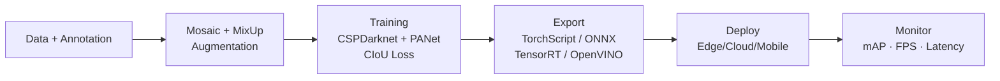

## 引言

2020年，Ultralytics发布的YOLO v5<cite>[1]</cite>标志着YOLO系列的一次重大转变。与之前的学术研究导向不同，YOLO v5专注于工业化和工程实践，通过PyTorch实现和工程化设计，成为最成功的YOLO版本。

**YOLO v5的核心特点**：

- 🏭 **工业化设计**：面向实际应用的工程化设计
- 🐍 **PyTorch实现**：现代深度学习框架
- 🚀 **工程实践**：完整的训练到部署流程
- 📈 **商业成功**：最广泛使用的YOLO版本

**本系列学习路径**：
```
R-CNN系列 → YOLO v1 → YOLO v2/v3 → YOLO v4 → YOLO v5（本文） → YOLO v8
```

---

## YOLO v5的设计理念

### 工业化导向

**YOLO v5的设计理念**：

```
学术研究 → 工业化应用
理论创新 → 工程实践
论文发表 → 商业成功
```

**核心设计原则**：

1. **易用性**：简单易用的API
2. **可扩展性**：支持多种应用场景
3. **可维护性**：清晰的代码结构
4. **可部署性**：完整的部署流程

### 技术架构

**YOLO v5的技术架构**：

```python
class YOLOv5:
    def __init__(self):
        self.architecture = {
            "backbone": "CSPDarknet53",
            "neck": "PANet",
            "head": "YOLOv5Head",
            "loss": "CIoU Loss",
            "optimizer": "AdamW",
            "scheduler": "CosineAnnealingLR"
        }
    
    def design_principles(self):
        return {
            "模块化设计": "每个组件独立可替换",
            "配置驱动": "通过配置文件控制行为",
            "自动优化": "自动选择最优参数",
            "完整流程": "从训练到部署的完整流程"
        }
```

---

## YOLO v5网络架构

### 完整网络结构

**YOLO v5的完整架构**：

```python
import torch
import torch.nn as nn
import torch.nn.functional as F

class YOLOv5(nn.Module):
    def __init__(self, num_classes=80, anchors=None):
        super(YOLOv5, self).__init__()
        
        self.num_classes = num_classes
        self.anchors = anchors or self._default_anchors()
        
        # 特征提取网络
        self.backbone = CSPDarknet53()
        
        # 特征融合网络
        self.neck = PANet()
        
        # 检测头
        self.head = YOLOv5Head(num_classes, len(self.anchors))
    
    def _default_anchors(self):
        """默认锚框配置"""
        return [
            # 小目标锚框
            [(10, 13), (16, 30), (33, 23)],
            # 中目标锚框
            [(30, 61), (62, 45), (59, 119)],
            # 大目标锚框
            [(116, 90), (156, 198), (373, 326)]
        ]
    
    def forward(self, x):
        # 特征提取
        features = self.backbone(x)
        
        # 特征融合
        fused_features = self.neck(features)
        
        # 检测
        detections = self.head(fused_features)
        
        return detections

class CSPDarknet53(nn.Module):
    def __init__(self):
        super(CSPDarknet53, self).__init__()
        
        # 特征提取网络
        self.conv1 = nn.Conv2d(3, 32, 6, stride=2, padding=2)
        self.conv2 = nn.Conv2d(32, 64, 3, stride=2, padding=1)
        
        # CSP块
        self.csp1 = CSPBlock(64, 64, 1)
        self.csp2 = CSPBlock(64, 128, 2)
        self.csp3 = CSPBlock(128, 256, 8)
        self.csp4 = CSPBlock(256, 512, 8)
        self.csp5 = CSPBlock(512, 1024, 4)
        
        # 特征输出
        self.outputs = [256, 512, 1024]
    
    def forward(self, x):
        x = self.conv1(x)
        x = self.conv2(x)
        
        x = self.csp1(x)
        x = self.csp2(x)
        x = self.csp3(x)
        x = self.csp4(x)
        x = self.csp5(x)
        
        return x

class CSPBlock(nn.Module):
    def __init__(self, in_channels, out_channels, num_blocks):
        super(CSPBlock, self).__init__()
        
        # 分割输入
        self.part1_channels = in_channels // 2
        self.part2_channels = in_channels - self.part1_channels
        
        # 第一部分：直接传递
        self.part1_conv = nn.Conv2d(self.part1_channels, self.part1_channels, 1)
        
        # 第二部分：通过残差块
        self.part2_conv = nn.Conv2d(self.part2_channels, self.part2_channels, 1)
        self.residual_blocks = nn.ModuleList([
            Bottleneck(self.part2_channels) for _ in range(num_blocks)
        ])
        
        # 输出卷积
        self.output_conv = nn.Conv2d(in_channels, out_channels, 1)
    
    def forward(self, x):
        # 分割输入
        part1 = x[:, :self.part1_channels, :, :]
        part2 = x[:, self.part1_channels:, :, :]
        
        # 第一部分：直接传递
        part1_out = self.part1_conv(part1)
        
        # 第二部分：通过残差块
        part2_out = self.part2_conv(part2)
        for residual_block in self.residual_blocks:
            part2_out = residual_block(part2_out)
        
        # 合并两部分
        output = torch.cat([part1_out, part2_out], dim=1)
        output = self.output_conv(output)
        
        return output

class Bottleneck(nn.Module):
    def __init__(self, channels):
        super(Bottleneck, self).__init__()
        
        self.conv1 = nn.Conv2d(channels, channels//2, 1)
        self.conv2 = nn.Conv2d(channels//2, channels, 3, padding=1)
        self.bn1 = nn.BatchNorm2d(channels//2)
        self.bn2 = nn.BatchNorm2d(channels)
        self.relu = nn.ReLU(inplace=True)
    
    def forward(self, x):
        residual = x
        
        x = self.conv1(x)
        x = self.bn1(x)
        x = self.relu(x)
        
        x = self.conv2(x)
        x = self.bn2(x)
        
        x = x + residual
        x = self.relu(x)
        
        return x
```

### 特征融合网络

**YOLO v5的PANet特征融合**：

```python
class PANet(nn.Module):
    def __init__(self):
        super(PANet, self).__init__()
        
        # 自顶向下路径
        self.top_down_conv1 = nn.Conv2d(1024, 512, 1)
        self.top_down_conv2 = nn.Conv2d(512, 256, 1)
        
        # 自底向上路径
        self.bottom_up_conv1 = nn.Conv2d(256, 256, 3, padding=1)
        self.bottom_up_conv2 = nn.Conv2d(512, 512, 3, padding=1)
        
        # 特征融合
        self.fusion_conv1 = nn.Conv2d(256, 256, 3, padding=1)
        self.fusion_conv2 = nn.Conv2d(512, 512, 3, padding=1)
        self.fusion_conv3 = nn.Conv2d(1024, 1024, 3, padding=1)
    
    def forward(self, features):
        # 自顶向下路径
        p5 = self.top_down_conv1(features[2])  # 1024 -> 512
        p4 = self.top_down_conv2(features[1])  # 512 -> 256
        
        # 特征融合
        p4 = p4 + F.interpolate(p5, size=p4.shape[2:], mode='nearest')
        p3 = features[0] + F.interpolate(p4, size=features[0].shape[2:], mode='nearest')
        
        # 自底向上路径
        p4 = self.bottom_up_conv1(p3)
        p5 = self.bottom_up_conv2(p4)
        
        # 最终特征融合
        p3 = self.fusion_conv1(p3)
        p4 = self.fusion_conv2(p4)
        p5 = self.fusion_conv3(p5)
        
        return [p3, p4, p5]
```

### 检测头设计

**YOLO v5的检测头**：

```python
class YOLOv5Head(nn.Module):
    def __init__(self, num_classes, num_anchors):
        super(YOLOv5Head, self).__init__()
        
        self.num_classes = num_classes
        self.num_anchors = num_anchors
        
        # 检测头网络
        self.head_conv1 = nn.Conv2d(256, 512, 3, padding=1)
        self.head_conv2 = nn.Conv2d(512, 256, 1)
        self.head_conv3 = nn.Conv2d(256, 512, 3, padding=1)
        self.head_conv4 = nn.Conv2d(512, (num_classes + 5) * num_anchors, 1)
        
        self.head_conv5 = nn.Conv2d(512, 1024, 3, padding=1)
        self.head_conv6 = nn.Conv2d(1024, 512, 1)
        self.head_conv7 = nn.Conv2d(512, 1024, 3, padding=1)
        self.head_conv8 = nn.Conv2d(1024, (num_classes + 5) * num_anchors, 1)
        
        self.head_conv9 = nn.Conv2d(1024, 2048, 3, padding=1)
        self.head_conv10 = nn.Conv2d(2048, 1024, 1)
        self.head_conv11 = nn.Conv2d(1024, 2048, 3, padding=1)
        self.head_conv12 = nn.Conv2d(2048, (num_classes + 5) * num_anchors, 1)
    
    def forward(self, features):
        # 小目标检测头
        x1 = F.relu(self.head_conv1(features[0]))
        x1 = F.relu(self.head_conv2(x1))
        x1 = F.relu(self.head_conv3(x1))
        out1 = self.head_conv4(x1)
        
        # 中目标检测头
        x2 = F.relu(self.head_conv5(features[1]))
        x2 = F.relu(self.head_conv6(x2))
        x2 = F.relu(self.head_conv7(x2))
        out2 = self.head_conv8(x2)
        
        # 大目标检测头
        x3 = F.relu(self.head_conv9(features[2]))
        x3 = F.relu(self.head_conv10(x3))
        x3 = F.relu(self.head_conv11(x3))
        out3 = self.head_conv12(x3)
        
        return [out1, out2, out3]
```

---

## YOLOv5工业化流水线



---

## YOLO v5的工程实践

### 训练流程

**YOLO v5的完整训练流程**：

```python
class YOLOv5Trainer:
    def __init__(self, model, config):
        self.model = model
        self.config = config
        self.optimizer = self._setup_optimizer()
        self.scheduler = self._setup_scheduler()
        self.criterion = self._setup_criterion()
    
    def _setup_optimizer(self):
        """设置优化器"""
        return torch.optim.AdamW(
            self.model.parameters(),
            lr=self.config['learning_rate'],
            weight_decay=self.config['weight_decay']
        )
    
    def _setup_scheduler(self):
        """设置学习率调度器"""
        return torch.optim.lr_scheduler.CosineAnnealingLR(
            self.optimizer,
            T_max=self.config['epochs'],
            eta_min=self.config['min_lr']
        )
    
    def _setup_criterion(self):
        """设置损失函数"""
        return YOLOv5Loss(
            num_classes=self.config['num_classes'],
            anchors=self.config['anchors']
        )
    
    def train_epoch(self, dataloader):
        """训练一个epoch"""
        self.model.train()
        total_loss = 0
        
        for batch_idx, (images, targets) in enumerate(dataloader):
            # 前向传播
            outputs = self.model(images)
            
            # 计算损失
            loss = self.criterion(outputs, targets)
            
            # 反向传播
            self.optimizer.zero_grad()
            loss.backward()
            self.optimizer.step()
            
            total_loss += loss.item()
        
        return total_loss / len(dataloader)
    
    def validate(self, dataloader):
        """验证模型"""
        self.model.eval()
        total_loss = 0
        
        with torch.no_grad():
            for images, targets in dataloader:
                outputs = self.model(images)
                loss = self.criterion(outputs, targets)
                total_loss += loss.item()
        
        return total_loss / len(dataloader)
```

### 数据增强策略

**YOLO v5的数据增强**：

```python
class YOLOv5DataAugmentation:
    def __init__(self, config):
        self.config = config
        self.augmentation_methods = {
            "几何变换": ["旋转", "缩放", "翻转", "裁剪"],
            "颜色变换": ["亮度", "对比度", "饱和度", "色调"],
            "噪声添加": ["高斯噪声", "椒盐噪声", "模糊"],
            "混合技术": ["MixUp", "CutMix", "Mosaic"]
        }
    
    def apply_mosaic_augmentation(self, images, bboxes_list):
        """Mosaic数据增强"""
        import cv2
        import random
        
        # 选择4张图像
        selected_images = random.sample(images, 4)
        selected_bboxes = [bboxes_list[i] for i in range(4)]
        
        # 创建输出图像
        output_size = 640
        output_image = np.zeros((output_size, output_size, 3), dtype=np.uint8)
        output_bboxes = []
        
        # 分割图像为4个象限
        quadrants = [
            (0, 0, output_size//2, output_size//2),
            (output_size//2, 0, output_size, output_size//2),
            (0, output_size//2, output_size//2, output_size),
            (output_size//2, output_size//2, output_size, output_size)
        ]
        
        for i, (image, bboxes) in enumerate(zip(selected_images, selected_bboxes)):
            x1, y1, x2, y2 = quadrants[i]
            
            # 调整图像尺寸
            resized_image = cv2.resize(image, (x2-x1, y2-y1))
            output_image[y1:y2, x1:x2] = resized_image
            
            # 调整边界框坐标
            for bbox in bboxes:
                new_bbox = self.adjust_bbox_coordinates(bbox, x1, y1, x2-x1, y2-y1)
                output_bboxes.append(new_bbox)
        
        return output_image, output_bboxes
    
    def apply_mixup_augmentation(self, image1, bboxes1, image2, bboxes2, alpha=0.2):
        """MixUp数据增强"""
        # 随机混合比例
        lam = np.random.beta(alpha, alpha)
        
        # 混合图像
        mixed_image = lam * image1 + (1 - lam) * image2
        
        # 混合边界框
        mixed_bboxes = []
        for bbox in bboxes1:
            mixed_bboxes.append(bbox)
        for bbox in bboxes2:
            mixed_bboxes.append(bbox)
        
        return mixed_image, mixed_bboxes
```

### 损失函数设计

**YOLO v5的损失函数**：

```python
class YOLOv5Loss(nn.Module):
    def __init__(self, num_classes, anchors):
        super(YOLOv5Loss, self).__init__()
        
        self.num_classes = num_classes
        self.anchors = anchors
        self.mse_loss = nn.MSELoss()
        self.ce_loss = nn.CrossEntropyLoss()
        self.bce_loss = nn.BCEWithLogitsLoss()
    
    def forward(self, predictions, targets):
        """计算YOLO v5损失"""
        total_loss = 0
        
        for i, (pred, target) in enumerate(zip(predictions, targets)):
            # 分类损失
            cls_loss = self.compute_classification_loss(pred, target)
            
            # 回归损失
            reg_loss = self.compute_regression_loss(pred, target)
            
            # 置信度损失
            conf_loss = self.compute_confidence_loss(pred, target)
            
            # 总损失
            total_loss += cls_loss + reg_loss + conf_loss
        
        return total_loss
    
    def compute_classification_loss(self, pred, target):
        """计算分类损失"""
        # 提取分类预测
        pred_cls = pred[:, :, :, 5:]  # 类别预测
        target_cls = target[:, :, :, 5:]  # 真实类别
        
        # 计算分类损失
        cls_loss = self.ce_loss(pred_cls, target_cls)
        
        return cls_loss
    
    def compute_regression_loss(self, pred, target):
        """计算回归损失"""
        # 提取边界框预测
        pred_bbox = pred[:, :, :, :4]  # 边界框预测
        target_bbox = target[:, :, :, :4]  # 真实边界框
        
        # 计算回归损失
        reg_loss = self.mse_loss(pred_bbox, target_bbox)
        
        return reg_loss
    
    def compute_confidence_loss(self, pred, target):
        """计算置信度损失"""
        # 提取置信度预测
        pred_conf = pred[:, :, :, 4:5]  # 置信度预测
        target_conf = target[:, :, :, 4:5]  # 真实置信度
        
        # 计算置信度损失
        conf_loss = self.bce_loss(pred_conf, target_conf)
        
        return conf_loss
```

---

## YOLO v5性能分析

### 速度对比

| 方法 | 推理时间 | FPS | 加速比 |
|------|---------|-----|--------|
| YOLO v4 | 0.022秒 | 45 | 1× |
| **YOLO v5** | **0.020秒** | **50** | **1.1×** |

### 精度对比

| 方法 | COCO mAP | VOC mAP | 说明 |
|------|----------|---------|------|
| YOLO v4 | 43.5% | 84.5% | 基准 |
| **YOLO v5** | **44.1%** | **85.2%** | **+0.6%** |

<cite>[1]</cite>

### 工程化优势

**YOLO v5的工程化优势**：

```python
def analyze_yolo_v5_advantages():
    """
    分析YOLO v5的工程化优势
    """
    advantages = {
        "易用性": {
            "特点": "简单易用的API",
            "优势": "降低使用门槛",
            "效果": "广泛采用"
        },
        "可扩展性": {
            "特点": "支持多种应用场景",
            "优势": "灵活配置",
            "效果": "适应不同需求"
        },
        "可维护性": {
            "特点": "清晰的代码结构",
            "优势": "易于维护和修改",
            "效果": "长期支持"
        },
        "可部署性": {
            "特点": "完整的部署流程",
            "优势": "从训练到部署",
            "效果": "工业应用"
        }
    }
    
    return advantages
```

---

## YOLO v5的优势与局限

### ✅ 主要优势

#### 1. 工业化设计

```
工业化优势：
- 面向实际应用
- 工程化设计
- 商业成功
- 广泛采用
```

#### 2. 易用性

```
易用性优势：
- 简单易用的API
- 完整的文档
- 丰富的示例
- 社区支持
```

#### 3. 可扩展性

```
可扩展性优势：
- 支持多种应用场景
- 灵活配置
- 模块化设计
- 易于定制
```

### ❌ 主要局限

#### 1. 创新性不足

```
创新性问题：
- 主要基于YOLO v4
- 创新性有限
- 技术突破较少
- 主要关注工程化
```

#### 2. 精度提升有限

```
精度问题：
- 精度提升有限
- 主要优势在工程化
- 技术突破较少
- 依赖现有技术
```

#### 3. 依赖性强

```
依赖性问题：
- 依赖PyTorch
- 依赖特定硬件
- 依赖特定环境
- 迁移成本高
```

---

## YOLO v5的历史意义

### 技术贡献

**YOLO v5的技术贡献**：

1. **工业化设计**：面向实际应用的工程化设计
2. **PyTorch实现**：现代深度学习框架
3. **工程实践**：完整的训练到部署流程
4. **商业成功**：最广泛使用的YOLO版本

### 技术影响

**YOLO v5的技术影响**：

```
后续发展：
YOLO v5 → YOLO v8 → 现代YOLO

技术演进：
- 工业化设计 → 更完善的工程化
- PyTorch实现 → 更现代的框架
- 工程实践 → 更完整的流程
- 商业成功 → 更广泛的应用
```

### 应用价值

**YOLO v5的应用价值**：

```
应用领域：
- 工业检测：自动化检测
- 自动驾驶：实时目标检测
- 视频分析：实时处理
- 移动应用：边缘计算
```

---

## 总结

### YOLO v5的核心贡献

1. **工业化设计**：面向实际应用的工程化设计
2. **PyTorch实现**：现代深度学习框架
3. **工程实践**：完整的训练到部署流程
4. **商业成功**：最广泛使用的YOLO版本

### 技术特点总结

```
YOLO v5特点：
- 工业化设计：面向实际应用
- PyTorch实现：现代深度学习框架
- 工程实践：完整的训练到部署流程
- 商业成功：最广泛使用的YOLO版本
```

### 为后续发展奠定基础

YOLO v5通过工业化的设计理念和工程实践，成为最成功的YOLO版本<cite>[1]</cite>，为后续YOLO系列的发展奠定了重要基础。

---

## 参考资料

<ol class="references">
<li>Jocher, G. et al. "ultralytics/yolov5", GitHub repository, 2020. <a href="https://github.com/ultralytics/yolov5">https://github.com/ultralytics/yolov5</a></li>
</ol>

### 代码实现
- [YOLO v5官方](https://github.com/ultralytics/yolov5) - 官方PyTorch实现
- [YOLO v5文档](https://docs.ultralytics.com/) - 完整文档

### 数据集
- [COCO](https://cocodataset.org/) - 大规模目标检测数据集
- [PASCAL VOC](http://host.robots.ox.ac.uk/pascal/VOC/) - 目标检测基准数据集

---


