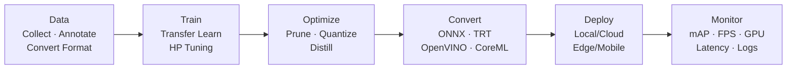

## 引言

经过前面7篇文章的深入解析，我们已经全面了解了YOLO系列的发展历程和技术特点。现在，让我们将理论知识转化为实际应用，探索YOLO系列从训练到部署的完整工程实践。

**YOLO实战的核心内容**：

- 📊 **数据准备**：数据集构建和预处理
- 🏋️ **模型训练**：训练策略和优化技巧
- ⚡ **性能优化**：模型压缩和加速
- 🚀 **模型部署**：生产环境部署
- 🔧 **工程实践**：完整的工程流程

**本系列学习路径**：
```
R-CNN系列 → YOLO v1 → YOLO v2/v3 → YOLO v4 → YOLO v5 → YOLO v8 → YOLO变种 → YOLO实战（本文）
```

---

## 端到端工程流水线



---

## 数据准备

### 数据集构建

**YOLO数据集格式**<cite>[3]</cite>：

```python
import os
import json
import cv2
import numpy as np
from pathlib import Path

class YOLODataset:
    def __init__(self, data_dir, classes_file):
        self.data_dir = Path(data_dir)
        self.classes_file = classes_file
        self.classes = self._load_classes()
        self.class_to_id = {cls: idx for idx, cls in enumerate(self.classes)}
    
    def _load_classes(self):
        """加载类别文件"""
        with open(self.classes_file, 'r') as f:
            classes = [line.strip() for line in f.readlines()]
        return classes
    
    def create_dataset_structure(self):
        """创建YOLO数据集结构"""
        # 创建目录结构
        dirs = ['images/train', 'images/val', 'images/test', 
                'labels/train', 'labels/val', 'labels/test']
        
        for dir_name in dirs:
            (self.data_dir / dir_name).mkdir(parents=True, exist_ok=True)
        
        print(f"数据集结构创建完成: {self.data_dir}")
    
    def convert_annotations(self, source_format='coco'):
        """转换标注格式"""
        if source_format == 'coco':
            self._convert_from_coco()
        elif source_format == 'voc':
            self._convert_from_voc()
        elif source_format == 'yolo':
            self._convert_from_yolo()
        else:
            raise ValueError(f"不支持的源格式: {source_format}")
    
    def _convert_from_coco(self):
        """从COCO格式转换"""
        # 加载COCO标注文件
        with open(self.data_dir / 'annotations.json', 'r') as f:
            coco_data = json.load(f)
        
        # 创建图像ID到文件名的映射
        images = {img['id']: img for img in coco_data['images']}
        categories = {cat['id']: cat for cat in coco_data['categories']}
        
        # 按图像分组标注
        annotations_by_image = {}
        for ann in coco_data['annotations']:
            img_id = ann['image_id']
            if img_id not in annotations_by_image:
                annotations_by_image[img_id] = []
            annotations_by_image[img_id].append(ann)
        
        # 转换每个图像的标注
        for img_id, annotations in annotations_by_image.items():
            img_info = images[img_id]
            img_width = img_info['width']
            img_height = img_info['height']
            
            # 创建YOLO格式标注
            yolo_annotations = []
            for ann in annotations:
                # 获取边界框坐标
                bbox = ann['bbox']  # [x, y, width, height]
                x, y, w, h = bbox
                
                # 转换为YOLO格式 (中心点坐标和相对尺寸)
                center_x = (x + w / 2) / img_width
                center_y = (y + h / 2) / img_height
                norm_width = w / img_width
                norm_height = h / img_height
                
                # 获取类别ID
                category_id = ann['category_id']
                class_id = categories[category_id]['name']
                class_idx = self.class_to_id[class_id]
                
                # 添加标注
                yolo_annotations.append(f"{class_idx} {center_x:.6f} {center_y:.6f} {norm_width:.6f} {norm_height:.6f}")
            
            # 保存标注文件
            label_file = self.data_dir / 'labels' / 'train' / f"{img_info['file_name'].split('.')[0]}.txt"
            with open(label_file, 'w') as f:
                f.write('\n'.join(yolo_annotations))
    
    def create_yaml_config(self):
        """创建YOLO配置文件"""
        config = {
            'path': str(self.data_dir),
            'train': 'images/train',
            'val': 'images/val',
            'test': 'images/test',
            'nc': len(self.classes),
            'names': self.classes
        }
        
        with open(self.data_dir / 'dataset.yaml', 'w') as f:
            yaml.dump(config, f, default_flow_style=False)
        
        print(f"配置文件创建完成: {self.data_dir / 'dataset.yaml'}")

# 使用示例
dataset = YOLODataset('data/custom_dataset', 'data/classes.txt')
dataset.create_dataset_structure()
dataset.convert_annotations(source_format='coco')
dataset.create_yaml_config()
```

### 数据增强

**YOLO数据增强策略**：

```python
import albumentations as A
from albumentations.pytorch import ToTensorV2

class YOLODataAugmentation:
    def __init__(self, image_size=640):
        self.image_size = image_size
        
        # 训练时数据增强
        self.train_transform = A.Compose([
            # 几何变换
            A.HorizontalFlip(p=0.5),
            A.VerticalFlip(p=0.1),
            A.RandomRotate90(p=0.1),
            A.Rotate(limit=15, p=0.3),
            A.RandomScale(scale_limit=0.2, p=0.3),
            
            # 颜色变换
            A.RandomBrightnessContrast(
                brightness_limit=0.2,
                contrast_limit=0.2,
                p=0.5
            ),
            A.HueSaturationValue(
                hue_shift_limit=20,
                sat_shift_limit=30,
                val_shift_limit=20,
                p=0.3
            ),
            
            # 噪声和模糊
            A.GaussNoise(var_limit=(10, 50), p=0.2),
            A.GaussianBlur(blur_limit=3, p=0.2),
            
            # 最终处理
            A.Resize(height=image_size, width=image_size),
            A.Normalize(
                mean=[0.485, 0.456, 0.406],
                std=[0.229, 0.224, 0.225]
            ),
            ToTensorV2()
        ])
        
        # 验证时数据增强
        self.val_transform = A.Compose([
            A.Resize(height=image_size, width=image_size),
            A.Normalize(
                mean=[0.485, 0.456, 0.406],
                std=[0.229, 0.224, 0.225]
            ),
            ToTensorV2()
        ])
    
    def apply_mosaic_augmentation(self, images, labels, p=0.5):
        """Mosaic数据增强"""
        if np.random.random() > p:
            return images[0], labels[0]
        
        # 选择4张图像
        indices = np.random.choice(len(images), 4, replace=False)
        selected_images = [images[i] for i in indices]
        selected_labels = [labels[i] for i in indices]
        
        # 创建输出图像
        output_size = self.image_size
        output_image = np.zeros((output_size, output_size, 3), dtype=np.uint8)
        output_labels = []
        
        # 分割图像为4个象限
        quadrants = [
            (0, 0, output_size//2, output_size//2),
            (output_size//2, 0, output_size, output_size//2),
            (0, output_size//2, output_size//2, output_size),
            (output_size//2, output_size//2, output_size, output_size)
        ]
        
        for i, (image, label) in enumerate(zip(selected_images, selected_labels)):
            x1, y1, x2, y2 = quadrants[i]
            
            # 调整图像尺寸
            resized_image = cv2.resize(image, (x2-x1, y2-y1))
            output_image[y1:y2, x1:x2] = resized_image
            
            # 调整标签坐标
            for bbox in label:
                class_id, cx, cy, w, h = bbox
                # 转换坐标
                new_cx = (cx * (x2-x1) + x1) / output_size
                new_cy = (cy * (y2-y1) + y1) / output_size
                new_w = w * (x2-x1) / output_size
                new_h = h * (y2-y1) / output_size
                
                output_labels.append([class_id, new_cx, new_cy, new_w, new_h])
        
        return output_image, output_labels
    
    def apply_mixup_augmentation(self, image1, label1, image2, label2, alpha=0.2):
        """MixUp数据增强"""
        # 随机混合比例
        lam = np.random.beta(alpha, alpha)
        
        # 混合图像
        mixed_image = lam * image1 + (1 - lam) * image2
        
        # 混合标签
        mixed_labels = label1 + label2
        
        return mixed_image, mixed_labels
```

---

## 模型训练

### 训练配置

**YOLO训练配置**<cite>[1][2]</cite>：

```python
import torch
import torch.nn as nn
import torch.optim as optim
from torch.utils.data import DataLoader
import yaml

class YOLOTrainer:
    def __init__(self, config_path):
        self.config = self._load_config(config_path)
        self.device = torch.device('cuda' if torch.cuda.is_available() else 'cpu')
        
        # 初始化模型
        self.model = self._build_model()
        self.model.to(self.device)
        
        # 初始化优化器
        self.optimizer = self._setup_optimizer()
        self.scheduler = self._setup_scheduler()
        
        # 初始化损失函数
        self.criterion = self._setup_criterion()
        
        # 初始化数据加载器
        self.train_loader = self._setup_data_loader('train')
        self.val_loader = self._setup_data_loader('val')
    
    def _load_config(self, config_path):
        """加载配置文件"""
        with open(config_path, 'r') as f:
            config = yaml.safe_load(f)
        return config
    
    def _build_model(self):
        """构建模型"""
        model_config = self.config['model']
        
        if model_config['name'] == 'yolov8':
            from ultralytics import YOLO
            model = YOLO(model_config['weights'])
        elif model_config['name'] == 'yolov5':
            import torch.hub
            model = torch.hub.load('ultralytics/yolov5', model_config['size'])
        else:
            raise ValueError(f"不支持的模型: {model_config['name']}")
        
        return model
    
    def _setup_optimizer(self):
        """设置优化器"""
        optimizer_config = self.config['optimizer']
        
        if optimizer_config['type'] == 'adamw':
            optimizer = optim.AdamW(
                self.model.parameters(),
                lr=optimizer_config['lr'],
                weight_decay=optimizer_config['weight_decay']
            )
        elif optimizer_config['type'] == 'sgd':
            optimizer = optim.SGD(
                self.model.parameters(),
                lr=optimizer_config['lr'],
                momentum=optimizer_config['momentum'],
                weight_decay=optimizer_config['weight_decay']
            )
        else:
            raise ValueError(f"不支持的优化器: {optimizer_config['type']}")
        
        return optimizer
    
    def _setup_scheduler(self):
        """设置学习率调度器"""
        scheduler_config = self.config['scheduler']
        
        if scheduler_config['type'] == 'cosine':
            scheduler = optim.lr_scheduler.CosineAnnealingLR(
                self.optimizer,
                T_max=scheduler_config['T_max'],
                eta_min=scheduler_config['eta_min']
            )
        elif scheduler_config['type'] == 'step':
            scheduler = optim.lr_scheduler.StepLR(
                self.optimizer,
                step_size=scheduler_config['step_size'],
                gamma=scheduler_config['gamma']
            )
        else:
            raise ValueError(f"不支持的学习率调度器: {scheduler_config['type']}")
        
        return scheduler
    
    def _setup_criterion(self):
        """设置损失函数"""
        loss_config = self.config['loss']
        
        if loss_config['type'] == 'yolo_loss':
            from ultralytics.utils.loss import YOLOv8Loss
            criterion = YOLOv8Loss(
                num_classes=loss_config['num_classes'],
                anchors=loss_config['anchors']
            )
        else:
            raise ValueError(f"不支持的损失函数: {loss_config['type']}")
        
        return criterion
    
    def _setup_data_loader(self, split):
        """设置数据加载器"""
        dataset_config = self.config['dataset']
        
        if split == 'train':
            dataset = YOLODataset(
                data_dir=dataset_config['train_dir'],
                classes_file=dataset_config['classes_file'],
                transform=self.train_transform
            )
        else:
            dataset = YOLODataset(
                data_dir=dataset_config['val_dir'],
                classes_file=dataset_config['classes_file'],
                transform=self.val_transform
            )
        
        dataloader = DataLoader(
            dataset,
            batch_size=dataset_config['batch_size'],
            shuffle=(split == 'train'),
            num_workers=dataset_config['num_workers'],
            pin_memory=True
        )
        
        return dataloader
    
    def train_epoch(self):
        """训练一个epoch"""
        self.model.train()
        total_loss = 0
        
        for batch_idx, (images, targets) in enumerate(self.train_loader):
            images = images.to(self.device)
            targets = targets.to(self.device)
            
            # 前向传播
            outputs = self.model(images)
            
            # 计算损失
            loss = self.criterion(outputs, targets)
            
            # 反向传播
            self.optimizer.zero_grad()
            loss.backward()
            self.optimizer.step()
            
            total_loss += loss.item()
            
            # 打印训练信息
            if batch_idx % 100 == 0:
                print(f'Batch {batch_idx}, Loss: {loss.item():.4f}')
        
        return total_loss / len(self.train_loader)
    
    def validate(self):
        """验证模型"""
        self.model.eval()
        total_loss = 0
        
        with torch.no_grad():
            for images, targets in self.val_loader:
                images = images.to(self.device)
                targets = targets.to(self.device)
                
                outputs = self.model(images)
                loss = self.criterion(outputs, targets)
                total_loss += loss.item()
        
        return total_loss / len(self.val_loader)
    
    def train(self):
        """完整训练流程"""
        best_loss = float('inf')
        
        for epoch in range(self.config['training']['epochs']):
            print(f'Epoch {epoch+1}/{self.config["training"]["epochs"]}')
            
            # 训练
            train_loss = self.train_epoch()
            
            # 验证
            val_loss = self.validate()
            
            # 更新学习率
            self.scheduler.step()
            
            # 保存最佳模型
            if val_loss < best_loss:
                best_loss = val_loss
                self.save_model(f'best_model_epoch_{epoch+1}.pt')
            
            print(f'Train Loss: {train_loss:.4f}, Val Loss: {val_loss:.4f}')
    
    def save_model(self, filename):
        """保存模型"""
        torch.save({
            'model_state_dict': self.model.state_dict(),
            'optimizer_state_dict': self.optimizer.state_dict(),
            'scheduler_state_dict': self.scheduler.state_dict(),
            'config': self.config
        }, filename)
        print(f'模型已保存: {filename}')
```

### 训练策略

**YOLO训练策略**：

```python
class YOLOTrainingStrategy:
    def __init__(self):
        self.strategies = {
            "预训练": {
                "ImageNet预训练": "使用ImageNet预训练权重",
                "COCO预训练": "使用COCO预训练权重",
                "自定义预训练": "使用自定义数据集预训练"
            },
            "数据增强": {
                "Mosaic": "4张图像拼接",
                "MixUp": "图像混合",
                "CutMix": "图像裁剪混合",
                "颜色变换": "亮度、对比度、饱和度调整"
            },
            "训练技巧": {
                "学习率调度": "余弦退火、步长衰减",
                "权重衰减": "L2正则化",
                "标签平滑": "防止过拟合",
                "梯度裁剪": "防止梯度爆炸"
            },
            "损失函数": {
                "分类损失": "交叉熵损失",
                "回归损失": "IoU损失、GIoU损失",
                "置信度损失": "二元交叉熵损失"
            }
        }
    
    def get_training_config(self, dataset_type='custom'):
        """获取训练配置"""
        configs = {
            "custom": {
                "epochs": 100,
                "batch_size": 16,
                "learning_rate": 0.001,
                "weight_decay": 0.0005,
                "momentum": 0.937,
                "warmup_epochs": 3,
                "warmup_momentum": 0.8,
                "warmup_bias_lr": 0.1
            },
            "coco": {
                "epochs": 300,
                "batch_size": 32,
                "learning_rate": 0.01,
                "weight_decay": 0.0005,
                "momentum": 0.937,
                "warmup_epochs": 3,
                "warmup_momentum": 0.8,
                "warmup_bias_lr": 0.1
            }
        }
        
        return configs.get(dataset_type, configs["custom"])
    
    def apply_training_tricks(self, model, optimizer, scheduler):
        """应用训练技巧"""
        # 梯度裁剪
        def clip_gradients(model, max_norm=1.0):
            torch.nn.utils.clip_grad_norm_(model.parameters(), max_norm)
        
        # 标签平滑
        def smooth_labels(labels, smoothing=0.1):
            num_classes = labels.size(-1)
            smoothed_labels = labels * (1 - smoothing) + smoothing / num_classes
            return smoothed_labels
        
        # 学习率预热
        def warmup_lr(optimizer, epoch, warmup_epochs, base_lr):
            if epoch < warmup_epochs:
                lr = base_lr * epoch / warmup_epochs
                for param_group in optimizer.param_groups:
                    param_group['lr'] = lr
        
        return {
            'clip_gradients': clip_gradients,
            'smooth_labels': smooth_labels,
            'warmup_lr': warmup_lr
        }
```

---

## 性能优化

### 模型压缩

**YOLO模型压缩技术**<cite>[1]</cite>：

```python
import torch
import torch.nn as nn
import torch.nn.utils.prune as prune

class YOLOCompression:
    def __init__(self, model):
        self.model = model
        self.compression_methods = {
            "剪枝": self._apply_pruning,
            "量化": self._apply_quantization,
            "知识蒸馏": self._apply_distillation,
            "架构搜索": self._apply_nas
        }
    
    def _apply_pruning(self, pruning_ratio=0.3):
        """应用剪枝"""
        # 结构化剪枝
        for name, module in self.model.named_modules():
            if isinstance(module, nn.Conv2d):
                prune.ln_structured(
                    module, 
                    name='weight', 
                    amount=pruning_ratio, 
                    n=2, 
                    dim=0
                )
        
        # 移除剪枝掩码
        for name, module in self.model.named_modules():
            if hasattr(module, 'weight_mask'):
                prune.remove(module, 'weight')
        
        print(f"剪枝完成，剪枝比例: {pruning_ratio}")
    
    def _apply_quantization(self, quantization_type='dynamic'):
        """应用量化"""
        if quantization_type == 'dynamic':
            # 动态量化
            self.model = torch.quantization.quantize_dynamic(
                self.model, 
                {nn.Linear, nn.Conv2d}, 
                dtype=torch.qint8
            )
        elif quantization_type == 'static':
            # 静态量化
            self.model.eval()
            self.model = torch.quantization.quantize(
                self.model, 
                run_fn=self._calibrate_model,
                mapping=torch.quantization.get_default_qconfig('fbgemm')
            )
        
        print(f"量化完成，量化类型: {quantization_type}")
    
    def _apply_distillation(self, teacher_model, student_model):
        """应用知识蒸馏"""
        class DistillationLoss(nn.Module):
            def __init__(self, alpha=0.7, temperature=3):
                super(DistillationLoss, self).__init__()
                self.alpha = alpha
                self.temperature = temperature
                self.ce_loss = nn.CrossEntropyLoss()
                self.kl_loss = nn.KLDivLoss(reduction='batchmean')
            
            def forward(self, student_outputs, teacher_outputs, targets):
                # 硬标签损失
                hard_loss = self.ce_loss(student_outputs, targets)
                
                # 软标签损失
                soft_loss = self.kl_loss(
                    F.log_softmax(student_outputs / self.temperature, dim=1),
                    F.softmax(teacher_outputs / self.temperature, dim=1)
                ) * (self.temperature ** 2)
                
                # 总损失
                total_loss = self.alpha * soft_loss + (1 - self.alpha) * hard_loss
                
                return total_loss
        
        return DistillationLoss()
    
    def _apply_nas(self, search_space):
        """应用神经架构搜索"""
        # 定义搜索空间
        search_space = {
            'backbone': ['ResNet', 'EfficientNet', 'MobileNet'],
            'neck': ['FPN', 'PANet', 'BiFPN'],
            'head': ['YOLOHead', 'RetinaHead', 'FCOSHead']
        }
        
        # 执行搜索
        best_architecture = self._search_architecture(search_space)
        
        return best_architecture
    
    def _search_architecture(self, search_space):
        """搜索最优架构"""
        # 使用强化学习搜索
        best_architecture = None
        best_reward = -float('inf')
        
        for iteration in range(1000):
            # 生成候选架构
            candidate = self._generate_candidate(search_space)
            
            # 评估架构
            reward = self._evaluate_architecture(candidate)
            
            # 更新最佳架构
            if reward > best_reward:
                best_reward = reward
                best_architecture = candidate
        
        return best_architecture
    
    def _generate_candidate(self, search_space):
        """生成候选架构"""
        candidate = {}
        for key, options in search_space.items():
            candidate[key] = np.random.choice(options)
        return candidate
    
    def _evaluate_architecture(self, architecture):
        """评估架构性能"""
        # 构建模型
        model = self._build_model(architecture)
        
        # 训练模型
        performance = self._train_and_evaluate(model)
        
        # 计算奖励
        reward = self._calculate_reward(performance)
        
        return reward
    
    def _calculate_reward(self, performance):
        """计算奖励"""
        # 平衡精度和速度
        accuracy = performance['accuracy']
        speed = performance['speed']
        
        reward = accuracy * 0.7 + speed * 0.3
        return reward
```

### 模型加速

**YOLO模型加速技术**<cite>[4][5][6][7]</cite>：

```python
class YOLOAcceleration:
    def __init__(self, model):
        self.model = model
        self.acceleration_methods = {
            "TensorRT": self._apply_tensorrt,
            "ONNX": self._apply_onnx,
            "OpenVINO": self._apply_openvino,
            "CoreML": self._apply_coreml
        }
    
    def _apply_tensorrt(self, input_shape=(1, 3, 640, 640)):
        """应用TensorRT加速"""
        import tensorrt as trt
        
        # 创建TensorRT引擎
        logger = trt.Logger(trt.Logger.WARNING)
        builder = trt.Builder(logger)
        network = builder.create_network(1 << int(trt.NetworkDefinitionCreationFlag.EXPLICIT_BATCH))
        parser = trt.OnnxParser(network, logger)
        
        # 解析ONNX模型
        with open('model.onnx', 'rb') as model:
            parser.parse(model.read())
        
        # 构建引擎
        config = builder.create_builder_config()
        config.max_workspace_size = 1 << 30  # 1GB
        engine = builder.build_engine(network, config)
        
        print("TensorRT引擎构建完成")
        return engine
    
    def _apply_onnx(self, input_shape=(1, 3, 640, 640)):
        """应用ONNX优化"""
        import onnx
        import onnxruntime as ort
        
        # 导出ONNX模型
        dummy_input = torch.randn(input_shape)
        torch.onnx.export(
            self.model,
            dummy_input,
            'model.onnx',
            export_params=True,
            opset_version=11,
            do_constant_folding=True,
            input_names=['input'],
            output_names=['output']
        )
        
        # 优化ONNX模型
        onnx_model = onnx.load('model.onnx')
        optimized_model = onnx.optimizer.optimize(onnx_model)
        onnx.save(optimized_model, 'model_optimized.onnx')
        
        print("ONNX模型优化完成")
        return optimized_model
    
    def _apply_openvino(self, input_shape=(1, 3, 640, 640)):
        """应用OpenVINO优化"""
        from openvino.inference_engine import IECore
        
        # 创建推理引擎
        ie = IECore()
        
        # 加载模型
        network = ie.read_network('model.xml', 'model.bin')
        
        # 配置输入
        input_info = next(iter(network.input_info))
        network.input_info[input_info].preprocess.set_color_format(ie.ColorFormat.RGB)
        network.input_info[input_info].preprocess.set_resize_algorithm(ie.ResizeAlgorithm.RESIZE_BILINEAR)
        
        # 创建推理请求
        exec_network = ie.load_network(network, 'CPU')
        
        print("OpenVINO模型优化完成")
        return exec_network
    
    def _apply_coreml(self, input_shape=(1, 3, 640, 640)):
        """应用CoreML优化"""
        import coremltools as ct
        
        # 转换模型
        model = ct.convert(
            self.model,
            inputs=[ct.TensorType(shape=input_shape)],
            outputs=[ct.TensorType()],
            minimum_deployment_target=ct.target.iOS13
        )
        
        # 优化模型
        model = ct.models.neural_network.quantization_utils.quantize_weights(model, nbits=8)
        
        # 保存模型
        model.save('model.mlmodel')
        
        print("CoreML模型优化完成")
        return model
```

---

## 模型部署

### 部署环境

**YOLO部署环境配置**<cite>[4][5][6][7]</cite>：

```python
class YOLODeployment:
    def __init__(self, model_path, config):
        self.model_path = model_path
        self.config = config
        self.deployment_methods = {
            "本地部署": self._local_deployment,
            "云端部署": self._cloud_deployment,
            "边缘部署": self._edge_deployment,
            "移动端部署": self._mobile_deployment
        }
    
    def _local_deployment(self):
        """本地部署"""
        import torch
        import cv2
        import numpy as np
        
        # 加载模型
        model = torch.load(self.model_path)
        model.eval()
        
        # 推理函数
        def inference(image):
            # 预处理
            image = cv2.resize(image, (640, 640))
            image = image.astype(np.float32) / 255.0
            image = np.transpose(image, (2, 0, 1))
            image = np.expand_dims(image, 0)
            image = torch.from_numpy(image)
            
            # 推理
            with torch.no_grad():
                outputs = model(image)
            
            # 后处理
            detections = self._postprocess(outputs)
            
            return detections
        
        return inference
    
    def _cloud_deployment(self):
        """云端部署"""
        from flask import Flask, request, jsonify
        import base64
        import io
        from PIL import Image
        
        app = Flask(__name__)
        
        # 加载模型
        model = torch.load(self.model_path)
        model.eval()
        
        @app.route('/predict', methods=['POST'])
        def predict():
            # 接收图像
            data = request.get_json()
            image_data = base64.b64decode(data['image'])
            image = Image.open(io.BytesIO(image_data))
            image = np.array(image)
            
            # 推理
            detections = self._inference(image)
            
            # 返回结果
            return jsonify({
                'detections': detections,
                'status': 'success'
            })
        
        return app
    
    def _edge_deployment(self):
        """边缘部署"""
        import tensorrt as trt
        import pycuda.driver as cuda
        import pycuda.autoinit
        
        # 加载TensorRT引擎
        with open('model.trt', 'rb') as f:
            engine_data = f.read()
        
        runtime = trt.Runtime(trt.Logger(trt.Logger.WARNING))
        engine = runtime.deserialize_cuda_engine(engine_data)
        context = engine.create_execution_context()
        
        # 分配内存
        inputs, outputs, bindings, stream = self._allocate_buffers(engine)
        
        def inference(image):
            # 预处理
            image = self._preprocess(image)
            
            # 推理
            cuda.memcpy_htod_async(inputs[0], image, stream)
            context.execute_async_v2(bindings, stream.handle, None)
            cuda.memcpy_dtoh_async(outputs[0], outputs[0], stream)
            stream.synchronize()
            
            # 后处理
            detections = self._postprocess(outputs[0])
            
            return detections
        
        return inference
    
    def _mobile_deployment(self):
        """移动端部署"""
        import coremltools as ct
        
        # 加载CoreML模型
        model = ct.models.MLModel('model.mlmodel')
        
        def inference(image):
            # 预处理
            image = self._preprocess(image)
            
            # 推理
            prediction = model.predict({'input': image})
            
            # 后处理
            detections = self._postprocess(prediction)
            
            return detections
        
        return inference
    
    def _allocate_buffers(self, engine):
        """分配内存缓冲区"""
        inputs = []
        outputs = []
        bindings = []
        stream = cuda.Stream()
        
        for binding in engine:
            size = trt.volume(engine.get_binding_shape(binding)) * engine.max_batch_size
            dtype = trt.nptype(engine.get_binding_dtype(binding))
            
            # 分配主机和设备内存
            host_mem = cuda.pagelocked_empty(size, dtype)
            device_mem = cuda.mem_alloc(host_mem.nbytes)
            
            bindings.append(int(device_mem))
            
            if engine.binding_is_input(binding):
                inputs.append({'host': host_mem, 'device': device_mem})
            else:
                outputs.append({'host': host_mem, 'device': device_mem})
        
        return inputs, outputs, bindings, stream
```

### 生产环境部署

**YOLO生产环境部署**：

```python
class YOLOProductionDeployment:
    def __init__(self, model_path, config):
        self.model_path = model_path
        self.config = config
        self.deployment_components = {
            "模型服务": self._model_service,
            "负载均衡": self._load_balancer,
            "监控系统": self._monitoring_system,
            "日志系统": self._logging_system
        }
    
    def _model_service(self):
        """模型服务"""
        from flask import Flask, request, jsonify
        import threading
        import queue
        
        app = Flask(__name__)
        
        # 模型池
        model_pool = queue.Queue(maxsize=10)
        for _ in range(10):
            model = torch.load(self.model_path)
            model.eval()
            model_pool.put(model)
        
        # 推理队列
        inference_queue = queue.Queue()
        result_queue = queue.Queue()
        
        def worker():
            """工作线程"""
            while True:
                if not inference_queue.empty():
                    task = inference_queue.get()
                    model = model_pool.get()
                    
                    # 推理
                    result = self._inference(model, task['image'])
                    
                    # 返回结果
                    result_queue.put({
                        'task_id': task['task_id'],
                        'result': result
                    })
                    
                    model_pool.put(model)
        
        # 启动工作线程
        for _ in range(5):
            thread = threading.Thread(target=worker)
            thread.daemon = True
            thread.start()
        
        @app.route('/predict', methods=['POST'])
        def predict():
            # 接收请求
            data = request.get_json()
            image = data['image']
            task_id = data.get('task_id', str(uuid.uuid4()))
            
            # 添加到推理队列
            inference_queue.put({
                'task_id': task_id,
                'image': image
            })
            
            # 等待结果
            while True:
                if not result_queue.empty():
                    result = result_queue.get()
                    if result['task_id'] == task_id:
                        return jsonify(result['result'])
        
        return app
    
    def _load_balancer(self):
        """负载均衡"""
        from flask import Flask, request, jsonify
        import random
        
        app = Flask(__name__)
        
        # 服务节点
        nodes = [
            'http://localhost:5001',
            'http://localhost:5002',
            'http://localhost:5003'
        ]
        
        @app.route('/predict', methods=['POST'])
        def predict():
            # 选择节点
            node = random.choice(nodes)
            
            # 转发请求
            response = requests.post(f'{node}/predict', json=request.get_json())
            
            return response.json()
        
        return app
    
    def _monitoring_system(self):
        """监控系统"""
        import psutil
        import time
        import json
        
        def monitor_system():
            """监控系统资源"""
            while True:
                # CPU使用率
                cpu_percent = psutil.cpu_percent()
                
                # 内存使用率
                memory_percent = psutil.virtual_memory().percent
                
                # GPU使用率
                gpu_percent = self._get_gpu_usage()
                
                # 记录监控数据
                monitoring_data = {
                    'timestamp': time.time(),
                    'cpu_percent': cpu_percent,
                    'memory_percent': memory_percent,
                    'gpu_percent': gpu_percent
                }
                
                # 保存监控数据
                with open('monitoring.json', 'a') as f:
                    f.write(json.dumps(monitoring_data) + '\n')
                
                time.sleep(1)
        
        return monitor_system
    
    def _logging_system(self):
        """日志系统"""
        import logging
        import json
        
        # 配置日志
        logging.basicConfig(
            level=logging.INFO,
            format='%(asctime)s - %(name)s - %(levelname)s - %(message)s',
            handlers=[
                logging.FileHandler('yolo.log'),
                logging.StreamHandler()
            ]
        )
        
        logger = logging.getLogger('YOLO')
        
        def log_inference(image_path, detections, inference_time):
            """记录推理日志"""
            log_data = {
                'timestamp': time.time(),
                'image_path': image_path,
                'detections': detections,
                'inference_time': inference_time
            }
            
            logger.info(json.dumps(log_data))
        
        return log_inference
```

---

## 性能监控

### 性能指标

**YOLO性能监控指标**：

```python
class YOLOPerformanceMonitor:
    def __init__(self):
        self.metrics = {
            "精度指标": {
                "mAP": "平均精度",
                "mAP@0.5": "IoU阈值0.5的平均精度",
                "mAP@0.75": "IoU阈值0.75的平均精度",
                "mAP@0.5:0.95": "IoU阈值0.5-0.95的平均精度"
            },
            "速度指标": {
                "FPS": "每秒帧数",
                "推理时间": "单次推理时间",
                "吞吐量": "每秒处理图像数"
            },
            "资源指标": {
                "CPU使用率": "CPU使用百分比",
                "内存使用率": "内存使用百分比",
                "GPU使用率": "GPU使用百分比",
                "显存使用率": "显存使用百分比"
            }
        }
    
    def calculate_metrics(self, predictions, ground_truth):
        """计算性能指标"""
        # 计算mAP
        mAP = self._calculate_map(predictions, ground_truth)
        
        # 计算FPS
        fps = self._calculate_fps()
        
        # 计算资源使用率
        resource_usage = self._calculate_resource_usage()
        
        return {
            'mAP': mAP,
            'FPS': fps,
            'resource_usage': resource_usage
        }
    
    def _calculate_map(self, predictions, ground_truth):
        """计算mAP"""
        # 计算每个类别的AP
        ap_scores = []
        for class_id in range(self.num_classes):
            ap = self._calculate_ap(predictions, ground_truth, class_id)
            ap_scores.append(ap)
        
        # 计算mAP
        mAP = np.mean(ap_scores)
        
        return mAP
    
    def _calculate_ap(self, predictions, ground_truth, class_id):
        """计算单个类别的AP"""
        # 获取该类别的预测和真实标签
        class_predictions = [p for p in predictions if p['class_id'] == class_id]
        class_ground_truth = [g for g in ground_truth if g['class_id'] == class_id]
        
        # 按置信度排序
        class_predictions.sort(key=lambda x: x['confidence'], reverse=True)
        
        # 计算精确率和召回率
        precision, recall = self._calculate_precision_recall(
            class_predictions, class_ground_truth
        )
        
        # 计算AP
        ap = self._calculate_ap_from_pr(precision, recall)
        
        return ap
    
    def _calculate_precision_recall(self, predictions, ground_truth):
        """计算精确率和召回率"""
        # 计算TP和FP
        tp = 0
        fp = 0
        fn = len(ground_truth)
        
        precision = []
        recall = []
        
        for i, prediction in enumerate(predictions):
            # 检查是否有匹配的真实标签
            matched = False
            for gt in ground_truth:
                if self._calculate_iou(prediction['bbox'], gt['bbox']) > 0.5:
                    tp += 1
                    fn -= 1
                    matched = True
                    break
            
            if not matched:
                fp += 1
            
            # 计算当前的精确率和召回率
            current_precision = tp / (tp + fp) if (tp + fp) > 0 else 0
            current_recall = tp / (tp + fn) if (tp + fn) > 0 else 0
            
            precision.append(current_precision)
            recall.append(current_recall)
        
        return precision, recall
    
    def _calculate_ap_from_pr(self, precision, recall):
        """从精确率-召回率曲线计算AP"""
        # 使用11点插值法
        recall_thresholds = np.linspace(0, 1, 11)
        precision_values = []
        
        for threshold in recall_thresholds:
            # 找到大于等于阈值的最大精确率
            max_precision = 0
            for i, r in enumerate(recall):
                if r >= threshold:
                    max_precision = max(max_precision, precision[i])
            precision_values.append(max_precision)
        
        # 计算AP
        ap = np.mean(precision_values)
        
        return ap
    
    def _calculate_fps(self):
        """计算FPS"""
        # 记录推理时间
        inference_times = []
        
        for _ in range(100):
            start_time = time.time()
            # 执行推理
            self._inference()
            end_time = time.time()
            
            inference_times.append(end_time - start_time)
        
        # 计算平均FPS
        avg_inference_time = np.mean(inference_times)
        fps = 1.0 / avg_inference_time
        
        return fps
    
    def _calculate_resource_usage(self):
        """计算资源使用率"""
        # CPU使用率
        cpu_percent = psutil.cpu_percent()
        
        # 内存使用率
        memory_percent = psutil.virtual_memory().percent
        
        # GPU使用率
        gpu_percent = self._get_gpu_usage()
        
        return {
            'cpu_percent': cpu_percent,
            'memory_percent': memory_percent,
            'gpu_percent': gpu_percent
        }
    
    def _get_gpu_usage(self):
        """获取GPU使用率"""
        try:
            import nvidia_ml_py3 as nvml
            nvml.nvmlInit()
            handle = nvml.nvmlDeviceGetHandleByIndex(0)
            info = nvml.nvmlDeviceGetUtilizationRates(handle)
            return info.gpu
        except:
            return 0
```

---

## 工程实践总结

### 最佳实践

**YOLO工程实践最佳实践**：

```python
class YOLOBestPractices:
    def __init__(self):
        self.best_practices = {
            "数据准备": {
                "数据质量": "确保数据标注质量",
                "数据平衡": "保持类别平衡",
                "数据增强": "合理使用数据增强",
                "数据验证": "验证数据格式正确性"
            },
            "模型训练": {
                "预训练权重": "使用预训练权重",
                "学习率调度": "合理设置学习率",
                "早停机制": "防止过拟合",
                "模型检查点": "定期保存模型"
            },
            "性能优化": {
                "模型压缩": "剪枝、量化、蒸馏",
                "模型加速": "TensorRT、ONNX、OpenVINO",
                "批处理": "合理设置批处理大小",
                "内存优化": "优化内存使用"
            },
            "模型部署": {
                "环境配置": "配置部署环境",
                "负载均衡": "实现负载均衡",
                "监控系统": "建立监控系统",
                "日志系统": "记录运行日志"
            }
        }
    
    def get_practice_guide(self, stage):
        """获取实践指南"""
        guides = {
            "数据准备": {
                "步骤": [
                    "1. 收集和标注数据",
                    "2. 数据格式转换",
                    "3. 数据质量检查",
                    "4. 数据增强策略"
                ],
                "注意事项": [
                    "确保标注质量",
                    "保持类别平衡",
                    "验证数据格式",
                    "合理使用增强"
                ]
            },
            "模型训练": {
                "步骤": [
                    "1. 环境配置",
                    "2. 数据加载",
                    "3. 模型构建",
                    "4. 训练配置",
                    "5. 开始训练"
                ],
                "注意事项": [
                    "使用预训练权重",
                    "合理设置学习率",
                    "监控训练过程",
                    "定期保存模型"
                ]
            },
            "性能优化": {
                "步骤": [
                    "1. 模型分析",
                    "2. 压缩策略",
                    "3. 加速技术",
                    "4. 性能测试"
                ],
                "注意事项": [
                    "平衡精度和速度",
                    "选择合适的优化方法",
                    "测试优化效果",
                    "验证模型正确性"
                ]
            },
            "模型部署": {
                "步骤": [
                    "1. 环境准备",
                    "2. 模型转换",
                    "3. 服务部署",
                    "4. 监控配置"
                ],
                "注意事项": [
                    "选择合适的部署方式",
                    "配置负载均衡",
                    "建立监控系统",
                    "记录运行日志"
                ]
            }
        }
        
        return guides.get(stage, {})
```

### 常见问题

**YOLO工程实践常见问题**：

```python
class YOLOCommonIssues:
    def __init__(self):
        self.common_issues = {
            "训练问题": {
                "损失不收敛": "检查学习率设置",
                "过拟合": "增加数据增强或正则化",
                "训练速度慢": "检查数据加载和GPU使用",
                "内存不足": "减少批处理大小"
            },
            "推理问题": {
                "推理速度慢": "使用模型加速技术",
                "精度下降": "检查模型转换过程",
                "内存占用高": "优化模型结构",
                "GPU利用率低": "检查批处理大小"
            },
            "部署问题": {
                "服务不稳定": "检查负载均衡配置",
                "响应时间慢": "优化模型和网络",
                "资源使用率高": "调整服务配置",
                "监控数据异常": "检查监控系统"
            }
        }
    
    def get_solution(self, issue_type, issue_description):
        """获取问题解决方案"""
        solutions = {
            "损失不收敛": [
                "降低学习率",
                "检查数据质量",
                "调整优化器参数",
                "使用学习率调度器"
            ],
            "过拟合": [
                "增加数据增强",
                "使用正则化",
                "减少模型复杂度",
                "增加训练数据"
            ],
            "推理速度慢": [
                "使用TensorRT加速",
                "模型量化",
                "批处理优化",
                "硬件升级"
            ],
            "服务不稳定": [
                "检查负载均衡",
                "增加服务实例",
                "优化资源分配",
                "监控系统状态"
            ]
        }
        
        return solutions.get(issue_description, [])
```

---

## 总结

### YOLO实战的核心内容

1. **数据准备**：数据集构建和预处理
2. **模型训练**：训练策略和优化技巧
3. **性能优化**：模型压缩和加速
4. **模型部署**：生产环境部署
5. **工程实践**：完整的工程流程

### 技术特点总结

```
YOLO实战特点：
- 数据准备：数据集构建和预处理
- 模型训练：训练策略和优化技巧
- 性能优化：模型压缩和加速
- 模型部署：生产环境部署
- 工程实践：完整的工程流程
```

### 为后续发展奠定基础

YOLO实战通过完整的工程实践，为YOLO系列的实际应用提供了重要指导，为后续YOLO系列的发展奠定了重要基础。

**系列总结**：通过8篇文章的深入解析，我们全面了解了YOLO系列的发展历程、技术特点、变种技术和工程实践。从R-CNN系列的两阶段检测到YOLO系列的一阶段检测，从理论创新到工程实践，YOLO系列在目标检测领域取得了巨大成功，为计算机视觉的发展做出了重要贡献。

---

## 参考资料

<ol class="references">
  <li id="ref-1">Ultralytics. "Ultralytics YOLOv8", 2023. <a href="https://github.com/ultralytics/ultralytics">GitHub</a></li>
  <li id="ref-2">Jocher, G. et al. "ultralytics/yolov5", GitHub, 2020. <a href="https://github.com/ultralytics/yolov5">GitHub</a></li>
  <li id="ref-3">Redmon, J. et al. "You Only Look Once: Unified, Real-Time Object Detection", CVPR 2016. <a href="https://arxiv.org/abs/1506.02640">arXiv:1506.02640</a></li>
  <li id="ref-4">ONNX Runtime developers. "ONNX Runtime". <a href="https://onnxruntime.ai/">https://onnxruntime.ai/</a></li>
  <li id="ref-5">NVIDIA Corporation. "NVIDIA TensorRT". <a href="https://developer.nvidia.com/tensorrt">https://developer.nvidia.com/tensorrt</a></li>
  <li id="ref-6">Intel Corporation. "OpenVINO Toolkit". <a href="https://docs.openvino.ai/">https://docs.openvino.ai/</a></li>
  <li id="ref-7">Apple Inc. "Core ML". <a href="https://developer.apple.com/documentation/coreml">https://developer.apple.com/documentation/coreml</a></li>
</ol>

### 数据集
- [COCO](https://cocodataset.org/) - 大规模目标检测数据集
- [PASCAL VOC](http://host.robots.ox.ac.uk/pascal/VOC/) - 目标检测基准数据集

---


