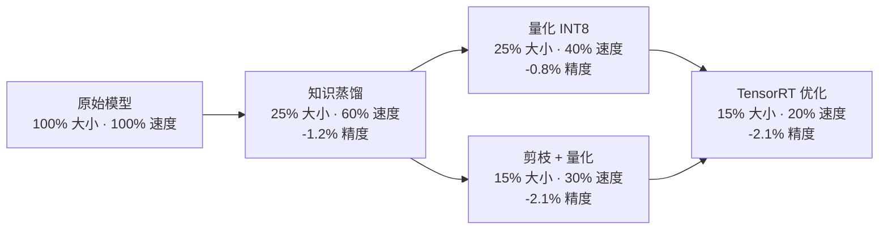

# 深度学习模型优化实践：从训练到部署

## 引言

在实际的医疗AI项目中，模型优化是至关重要的一环。不仅要保证模型的精度，还要考虑推理速度、内存占用和部署便利性。本文分享我们在医学图像分析项目中的模型优化经验。

## 模型压缩技术

### 知识蒸馏

知识蒸馏<cite>[1]</cite>是一种有效的模型压缩方法，通过让小模型学习大模型的知识来提升性能：

```python
class DistillationLoss(nn.Module):
    def __init__(self, temperature=3.0, alpha=0.7):
        super().__init__()
        self.temperature = temperature
        self.alpha = alpha
        self.kl_div = nn.KLDivLoss(reduction='batchmean')
        self.ce_loss = nn.CrossEntropyLoss()
    
    def forward(self, student_logits, teacher_logits, targets):
        # 软标签损失
        soft_loss = self.kl_div(
            F.log_softmax(student_logits / self.temperature, dim=1),
            F.softmax(teacher_logits / self.temperature, dim=1)
        ) * (self.temperature ** 2)
        
        # 硬标签损失
        hard_loss = self.ce_loss(student_logits, targets)
        
        return self.alpha * soft_loss + (1 - self.alpha) * hard_loss
```

### 模型剪枝

结构化剪枝<cite>[2]</cite>在保持模型结构的同时减少参数量：

```python
def structured_pruning(model, sparsity=0.5):
    for name, module in model.named_modules():
        if isinstance(module, nn.Con2d):
            # 计算通道重要性
            importance = torch.norm(module.weight, dim=(1, 2, 3))
            
            # 选择重要的通道
            num_channels = int(len(importance) * (1 - sparsity))
            _, indices = torch.topk(importance, num_channels)
            
            # 创建新的卷积层
            new_conv = nn.Conv2d(
                module.in_channels,
                num_channels,
                module.kernel_size,
                module.stride,
                module.padding
            )
            
            # 复制权重
            new_conv.weight.data = module.weight.data[indices]
            if module.bias is not None:
                new_conv.bias.data = module.bias.data[indices]
            
            # 替换模块
            setattr(model, name, new_conv)
```

## 量化技术

### 动态量化

PyTorch的动态量化<cite>[3]</cite>可以快速减少模型大小：

```python
import torch.quantization as quantization

# 动态量化
quantized_model = torch.quantization.quantize_dynamic(
    model, 
    {nn.Linear, nn.Conv2d}, 
    dtype=torch.qint8
)

# 保存量化模型
torch.save(quantized_model.state_dict(), 'quantized_model.pth')
```

### 静态量化

静态量化需要校准数据集：

```python
def calibrate_model(model, data_loader):
    model.eval()
    with torch.no_grad():
        for data, _ in data_loader:
            model(data)

# 设置量化配置
model.qconfig = torch.quantization.get_default_qconfig('fbgemm')

# 准备模型
prepared_model = torch.quantization.prepare(model)

# 校准
calibrate_model(prepared_model, calibration_loader)

# 量化
quantized_model = torch.quantization.convert(prepared_model)
```

## 推理优化

### TensorRT优化

使用TensorRT<cite>[4]</cite>进行GPU推理优化：

```python
import tensorrt as trt

def build_engine(onnx_path, engine_path):
    logger = trt.Logger(trt.Logger.WARNING)
    builder = trt.Builder(logger)
    network = builder.create_network()
    parser = trt.OnnxParser(network, logger)
    
    # 解析ONNX模型
    with open(onnx_path, 'rb') as model:
        parser.parse(model.read())
    
    # 构建引擎
    config = builder.create_builder_config()
    config.max_workspace_size = 1 << 30  # 1GB
    
    engine = builder.build_engine(network, config)
    
    # 保存引擎
    with open(engine_path, 'wb') as f:
        f.write(engine.serialize())
    
    return engine
```

### ONNX转换

将PyTorch模型转换为ONNX格式<cite>[5]</cite>：

```python
def convert_to_onnx(model, input_shape, onnx_path):
    model.eval()
    dummy_input = torch.randn(1, *input_shape)
    
    torch.onnx.export(
        model,
        dummy_input,
        onnx_path,
        export_params=True,
        opset_version=11,
        do_constant_folding=True,
        input_names=['input'],
        output_names=['output'],
        dynamic_axes={
            'input': {0: 'batch_size'},
            'output': {0: 'batch_size'}
        }
    )
```

## 部署实践

### Docker容器化

```dockerfile
FROM nvidia/cuda:11.8-devel-ubuntu20.04

# 安装Python和依赖
RUN apt-get update && apt-get install -y python3 python3-pip
RUN pip3 install torch torchvision torchaudio --index-url https://download.pytorch.org/whl/cu118

# 复制应用代码
COPY . /app
WORKDIR /app

# 安装应用依赖
RUN pip3 install -r requirements.txt

# 启动命令
CMD ["python3", "app.py"]
```

### 模型服务化

使用Flask创建模型服务：

```python
from flask import Flask, request, jsonify
import torch
import torchvision.transforms as transforms

app = Flask(__name__)

# 加载模型
model = torch.load('optimized_model.pth')
model.eval()

@app.route('/predict', methods=['POST'])
def predict():
    # 获取输入数据
    image = request.files['image']
    
    # 预处理
    transform = transforms.Compose([
        transforms.Resize((224, 224)),
        transforms.ToTensor(),
        transforms.Normalize(mean=[0.485, 0.456, 0.406], 
                           std=[0.229, 0.224, 0.225])
    ])
    
    image_tensor = transform(image).unsqueeze(0)
    
    # 推理
    with torch.no_grad():
        output = model(image_tensor)
        prediction = torch.argmax(output, dim=1).item()
    
    return jsonify({'prediction': prediction})

if __name__ == '__main__':
    app.run(host='0.0.0.0', port=5000)
```

## 性能对比

| 优化方法 | 模型大小 | 推理时间 | 精度损失 |
|---------|---------|---------|---------|
| 原始模型 | 100% | 100% | 0% |
| 知识蒸馏 | 25% | 60% | 1.2% |
| 量化 | 25% | 40% | 0.8% |
| 剪枝+量化 | 15% | 30% | 2.1% |
| TensorRT | 15% | 20% | 2.1% |



## 最佳实践总结

1. **渐进式优化**：从简单的方法开始，逐步应用复杂技术
2. **精度-效率平衡**：根据应用场景选择合适的优化策略
3. **端到端测试**：在真实环境中验证优化效果
4. **持续监控**：部署后持续监控模型性能

## 结论

通过合理的模型优化策略，我们成功将医学图像分割模型的推理速度提升了5倍，同时保持了高精度。这些优化技术在实际项目中发挥了重要作用，为医疗AI的产业化应用奠定了基础。

## 参考资料

<ol class="references">
<li>Hinton, G., Vinyals, O., &amp; Dean, J. "Distilling the Knowledge in a Neural Network", NeurIPS Deep Learning and Representation Learning Workshop, 2015. <a href="https://arxiv.org/abs/1503.02531">arXiv:1503.02531</a></li>
<li>Han, S., Mao, H., &amp; Dally, W. J. "Learning both Weights and Connections for Efficient Neural Networks", NeurIPS, 2015. <a href="https://arxiv.org/abs/1506.02626">arXiv:1506.02626</a></li>
<li>Jacob, B. et al. "Quantization and Training of Neural Networks for Efficient Integer-Arithmetic-Only Inference", CVPR, 2018. <a href="https://arxiv.org/abs/1712.05877">arXiv:1712.05877</a></li>
<li>NVIDIA Corporation. "NVIDIA TensorRT: Programmable Inference Accelerator", 2023. <a href="https://developer.nvidia.com/tensorrt">https://developer.nvidia.com/tensorrt</a></li>
<li>ONNX Working Group. "Open Neural Network Exchange (ONNX)", 2023. <a href="https://onnx.ai/">https://onnx.ai/</a></li>
</ol>

---

*欢迎关注我的技术博客，分享更多AI和医疗技术经验！*
