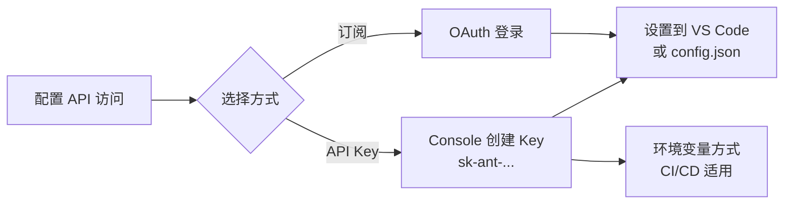
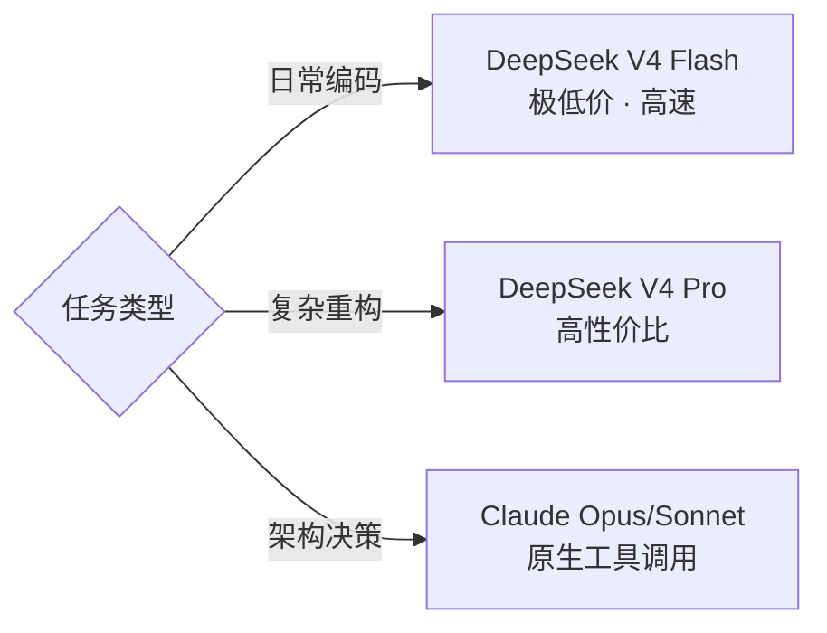

## 引言

上一篇 [Claude Code 实战指南](/2026/05/12/claude-code-practical-guide/) 介绍了 Claude Code 的核心能力和工作流设计。这篇文章聚焦于**环境搭建**——如何在 VS Code 中配置 Claude Code 插件，以及 API Key 的正确设置方式。

> 好的工具值得花时间配好。一次配置到位，后续使用行云流水。

## 两种使用方式

Claude Code 支持两种运行模式：

| 维度 | CLI 终端模式 | VS Code 插件模式 |
|------|-------------|-----------------|
| 启动方式 | 终端输入 `claude` | VS Code 侧边栏 / 快捷键 |
| 文件感知 | 需手动指定路径 | 自动感知当前工作区 |
| 代码引用 | 文本描述文件路径 | 支持文件拖拽、选中代码直接引用 |
| IDE 集成 | 无 | 诊断信息、跳转、Diff 预览 |
| 适用场景 | SSH 远程服务器、CI/CD | 日常本地开发 |
| 安装方式 | `npm install -g @anthropic-ai/claude-code` | VS Code 扩展市场 |

两者共享同一套工具系统和 Memory，可以按场景随时切换。

## VS Code 插件安装

### 方法一：扩展市场（推荐）

1. 打开 VS Code
2. 按 `Ctrl+Shift+X` 打开扩展面板
3. 搜索 **"Claude Code"**
4. 点击 **安装**

<!-- TODO: add image: vscode-extension.png -->

### 方法二：命令行安装

```bash
code --install-extension anthropic.claude-code
```

### 安装后验证

安装完成后，VS Code 左侧活动栏会出现 Claude Code 图标（一个对话气泡标记）。点击即可打开对话面板。

同时，命令面板（`Ctrl+Shift+P`）中会新增以下命令：

```
Claude Code: Open Chat          # 打开对话面板
Claude Code: Explain Code       # 解释选中代码
Claude Code: Fix Code           # 修复选中代码
Claude Code: Generate Tests     # 生成测试
```

## API Key 配置

Claude Code 需要 Anthropic API 的访问凭证。有两种获取方式：

### 方式一：Anthropic API Key（推荐）

**Step 1 — 获取 API Key**

1. 访问 [console.anthropic.com](https://console.anthropic.com)
2. 注册或登录 Anthropic 账号
3. 进入 **API Keys** 页面
4. 点击 **Create Key**，输入名称（如 `claude-code-local`）
5. 复制生成的 key（以 `sk-ant-` 开头）

> 妥善保管 API Key，不要提交到 Git 仓库或分享给他人。

**Step 2 — 设置到 VS Code**

在 VS Code 中，按 `Ctrl+Shift+P`，搜索 **Claude Code: Set API Key**，粘贴你的 key。

或者手动写入配置文件：

- **Windows**: `%APPDATA%\Claude Code\config.json`
- **macOS**: `~/Library/Application Support/Claude Code/config.json`
- **Linux**: `~/.config/Claude Code/config.json`

```json
{
    "apiKey": "sk-ant-api03-your-key-here",
    "model": "claude-sonnet-4-6"
}
```

**Step 3 — 验证连接**

在 Claude Code 对话面板中输入任意问题，如果收到回复则配置成功。

```bash
# CLI 验证方式
claude --version
claude "hello, are you working?"
```

### 方式二：Claude.ai 订阅

如果你有 Claude.ai 的 Pro 或 Max 订阅，可以直接使用订阅账号登录，无需单独申请 API Key。

在 VS Code 中运行 `Claude Code: Sign In`，通过浏览器完成 OAuth 认证。

### 环境变量方式（适用于 CI/CD）

```bash
# Linux / macOS
export ANTHROPIC_API_KEY=sk-ant-api03-your-key-here

# Windows PowerShell
$env:ANTHROPIC_API_KEY="sk-ant-api03-your-key-here"

# Windows CMD
set ANTHROPIC_API_KEY=sk-ant-api03-your-key-here
```

设置后 Claude Code 会自动读取，无需在配置文件中重复写入。



## 模型选择

Claude Code 原生支持 Anthropic 模型系列。同时也允许通过环境变量配置兼容 Anthropic Messages API 格式的第三方模型服务（如 DeepSeek V4）。

### Anthropic 官方模型

| 模型 | 适合场景 | 速度 |
|------|---------|------|
| Claude Opus 4.7 | 复杂架构设计、大规模重构 | 较慢 |
| Claude Sonnet 4.6 | 日常开发（推荐） | 中等 |
| Claude Haiku 4.5 | 简单问答、快速修复 | 快 |

默认模型无需额外配置，Claude Code 会自动使用 Sonnet。

### 使用 DeepSeek V4 模型

DeepSeek V4（2026 年 4 月发布）是 DeepSeek 最新一代 MoE 架构大模型。它提供了兼容 Anthropic Messages API 的 `/anthropic` 端点，可以直接接入 Claude Code。

**Step 1 — 获取 DeepSeek API Key**

1. 访问 [platform.deepseek.com](https://platform.deepseek.com)
2. 注册并登录
3. 进入 **API Keys** 页面，创建新 Key
4. 复制 key（以 `sk-` 开头）

> DeepSeek V4 Flash 约 $0.14/M 输入 tokens，V4 Pro 约 $1.74/M（缓存命中仅 $0.145/M），整体约为 Claude Sonnet 价格的 1/3~1/20，性价比突出。

**Step 2 — 配置环境变量**

Claude Code 通过环境变量来指定第三方 API 端点。推荐写在 `~/.claude/settings.json` 的 `env` 字段中：

```json
{
  "env": {
    "ANTHROPIC_BASE_URL": "https://api.deepseek.com/anthropic",
    "ANTHROPIC_AUTH_TOKEN": "sk-your-deepseek-key",
    "ANTHROPIC_MODEL": "deepseek-v4-pro",
    "ANTHROPIC_SMALL_FAST_MODEL": "deepseek-v4-flash",
    "ANTHROPIC_DEFAULT_HAIKU_MODEL": "deepseek-v4-flash",
    "ANTHROPIC_DEFAULT_OPUS_MODEL": "deepseek-v4-pro"
  }
}
```

关键参数说明：

| 参数 | 说明 |
|------|------|
| `ANTHROPIC_BASE_URL` | DeepSeek 兼容端点，**不要带 `/v1` 后缀**（Claude Code 会自动追加 `/v1/messages`）|
| `ANTHROPIC_AUTH_TOKEN` | DeepSeek API Key（也可以使用 `ANTHROPIC_API_KEY`）|
| `ANTHROPIC_MODEL` | 默认使用的模型名称 |
| `ANTHROPIC_SMALL_FAST_MODEL` | 轻量任务使用的模型（对应 Haiku 角色）|

DeepSeek V4 可选模型：

| 模型 | 参数规模 | 适合场景 |
|------|---------|------|
| `deepseek-v4-pro` | 1.6T 总 / 49B 激活 | 复杂重构、跨文件分析 |
| `deepseek-v4-flash` | 284B 总 / 13B 激活 | 日常编码、快速修复 |

**Step 3 — 临时切换（环境变量方式）**

不想写入配置文件时，可以在终端中临时设置：

```bash
# Linux / macOS / Git Bash
export ANTHROPIC_BASE_URL=https://api.deepseek.com/anthropic
export ANTHROPIC_AUTH_TOKEN=sk-your-deepseek-key
export ANTHROPIC_MODEL=deepseek-v4-pro
export ANTHROPIC_SMALL_FAST_MODEL=deepseek-v4-flash

# Windows PowerShell
$env:ANTHROPIC_BASE_URL="https://api.deepseek.com/anthropic"
$env:ANTHROPIC_AUTH_TOKEN="sk-your-deepseek-key"
$env:ANTHROPIC_MODEL="deepseek-v4-pro"
```

**DeepSeek V4 特点对比**

| 维度 | DeepSeek V4 Pro | DeepSeek V4 Flash | Claude Sonnet 4.6 |
|------|----------------|-------------------|-------------------|
| 编程能力 | 极强（代码生成、重构） | 强（日常编码） | 极强（全局理解、架构） |
| 中文 | 非常自然 | 非常自然 | 良好 |
| 输入价格 | ~$1.74/M tokens | ~$0.14/M tokens | ~$3/M tokens |
| 缓存命中 | ~$0.145/M | ~$0.028/M | ~$0.30/M |
| 上下文窗口 | **1M tokens** | **1M tokens** | 200K tokens |
| 工具调用 | 兼容 Anthropic 格式 | 兼容 | 原生 |
| 速度 | 快 | 非常快 | 中等 |

**适用场景建议**：

- **日常编码、快速修复** → DeepSeek V4 Flash（极低价格，速度快）
- **复杂代码重构、多文件分析** → DeepSeek V4 Pro（性价比高）
- **关键架构决策、复杂设计评审** → Claude Opus/Sonnet（原生工具调用，全局理解更深）
- **混合使用** → 日常 DeepSeek，重要节点切回 Claude



**快速切换配置**

在 `~/.claude/settings.json` 中维护多套注释配置：

```json
{
  "env": {
    // === DeepSeek V4 Pro（日常主力） ===
    "ANTHROPIC_BASE_URL": "https://api.deepseek.com/anthropic",
    "ANTHROPIC_AUTH_TOKEN": "sk-your-deepseek-key",
    "ANTHROPIC_MODEL": "deepseek-v4-pro",
    "ANTHROPIC_SMALL_FAST_MODEL": "deepseek-v4-flash",
    "ANTHROPIC_DEFAULT_HAIKU_MODEL": "deepseek-v4-flash",
    "ANTHROPIC_DEFAULT_OPUS_MODEL": "deepseek-v4-pro"

    // === Claude Sonnet（重要任务切换 — 注释掉上面、启用下面） ===
    // "ANTHROPIC_AUTH_TOKEN": "sk-ant-api03-your-key-here"
    // "ANTHROPIC_MODEL": "claude-sonnet-4-6",
    // 删除 "ANTHROPIC_BASE_URL" 行即可恢复默认
  }
}
```

### DeepSeek 接入注意事项

**Thinking 模式的兼容性**：DeepSeek 的 `/anthropic` 端点在启用 thinking 模式时，要求将服务端返回的 thinking blocks 原样传回后续请求，否则会返回 HTTP 400 错误。如果你在使用 DeepSeek V4 时遇到此问题，可以在对话中避免使用扩展思考模式，或关注 Claude Code 后续版本的兼容性更新。

**VS Code 插件的环境变量读取**：VS Code 桌面版可能无法读取 `~/.claude/settings.json` 中 `env` 字段。推荐做法是从终端启动 VS Code（`code .`），确保环境变量已加载；或直接在系统中设置永久环境变量。

**旧版模型即将下线**：`deepseek-chat` 和 `deepseek-reasoner` 将于 **2026 年 7 月 24 日** 废弃，自动映射至 V4-Flash。建议直接使用 `deepseek-v4-pro` 或 `deepseek-v4-flash`。

## VS Code 插件的独特功能

### 选中代码直接操作

在编辑器中选中代码段，右键选择 Claude Code 操作：

- **Explain Code** — 解释代码逻辑
- **Fix Code** — 自动修复 bug
- **Generate Tests** — 生成单元测试
- **Refactor** — 重构优化

这些操作会直接在编辑器中展示 Diff 预览，确认后一键应用。

### 文件上下文自动感知

VS Code 插件会自动将当前工作区的文件结构作为上下文传递给 Claude Code。你不需要手动描述项目结构——它已经"看到"了。

```
# CLI 模式需要手动说明
"我的项目在 d:/Projects/blog，有 15 个 SCSS 文件..."

# VS Code 模式直接说
"优化 _sass/_resume.scss 中的重复样式"
```

### 内联 Diff 预览

修改代码后，Claude Code 不会直接覆盖文件，而是在编辑器中展示更改预览。你可以逐处接受或拒绝。

### 终端集成

VS Code 插件复用 VS Code 的内置终端来执行 Shell 命令，无需切换窗口。

## Windows 环境注意事项

Windows 用户在使用 Claude Code 时可能遇到几个常见问题：

**Node.js 版本**

Claude Code 需要 Node.js 18+。推荐使用 nvm-windows 管理版本：

```powershell
nvm install 20
nvm use 20
```

**Git Bash 兼容性**

如果需要 CLI 模式，建议在 Git Bash 或 WSL2 中运行，PowerShell 可能有路径转义问题：

```bash
# Git Bash 中安装
npm install -g @anthropic-ai/claude-code
```

**代理配置**

如果网络环境需要代理访问 Anthropic API：

```bash
# Git Bash
export HTTPS_PROXY=http://127.0.0.1:7890

# 或在 config.json 中
{
    "proxy": "http://127.0.0.1:7890"
}
```

**路径分隔符**

在 VS Code 插件中引用 Windows 路径时使用正斜杠：`d:/Projects/blog` 而非 `d:\Projects\blog`。

## 配置最佳实践

### 项目级 .claude 目录

每个项目可以在根目录维护 `.claude/` 配置：

```
项目根目录/
├── .claude/
│   ├── settings.json      # 项目专属设置
│   ├── memory/            # 项目上下文记忆
│   │   └── MEMORY.md
│   └── plans/             # 计划文件
├── .gitignore             # 记得忽略 .claude/
```

建议将 `.claude/` 加入 `.gitignore`：

```gitignore
.claude/
```

### 推荐的 settings.json

```json
{
    "model": "claude-sonnet-4-6",
    "permissions": {
        "allow": [
            "Bash(npm:*)",
            "Bash(git:*)",
            "Bash(bundle:*)"
        ],
        "deny": [
            "Bash(git push:*)",
            "Bash(rm -rf:*)"
        ]
    },
    "hooks": {
        "PreToolUse": [
            {
                "matcher": "Bash",
                "hooks": [
                    {
                        "type": "command",
                        "command": "echo 'Running: $CLAUDE_TOOL_INPUT'"
                    }
                ]
            }
        ]
    }
}
```

## 常见问题排查

### Q: 插件安装后侧边栏没有图标？

检查 VS Code 版本是否 >= 1.82。在 `帮助 → 关于` 中查看。

### Q: "Authentication failed" 错误？

1. 确认 API Key 以 `sk-ant-` 开头
2. 检查是否有足够的 API 额度：[console.anthropic.com/settings/usage](https://console.anthropic.com/settings/usage)
3. 尝试重新设置 Key

### Q: 响应很慢？

- 切换到 Sonnet 或 Haiku 模型
- 检查网络延迟（Anthropic API 服务器在 US）
- 避免超长上下文对话，定期 `/clear`

### Q: CLI 和 VS Code 插件的设置不同步？

它们共享 `~/.claude/` 目录（Windows 下为 `%USERPROFILE%\.claude\`），包括 Memory 和全局设置。项目级 `.claude/` 在当前工作目录下。

## 总结

Claude Code 的 VS Code 插件让 AI 编程体验更加原生——不需要离开编辑器、不需要复制粘贴代码、修改结果以 Diff 形式预览。配好 API Key 后，它就像一个坐在你旁边的 senior engineer，随时等待调用。

环境搭建的投入是一次性的，但带来的效率提升是持续的。下一篇我将深入介绍如何利用 Claude Code 的 Memory 系统和自定义配置，打造真正"懂你项目"的 AI 工作环境。

---

*本文基于 Claude Code v1.x + VS Code 1.82+ 编写，配置方式可能随版本更新变化。*
