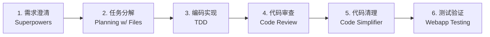
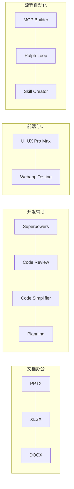

## 引言

在[上一篇文章](/2026/05/13/agent-skills-architecture/)中，我们深入分析了 Agent Skills 的架构设计——渐进式披露、三层加载、文件系统原生发现。那篇偏"道"，这篇来谈"术"：作为日常搬砖的工程师，到底哪些 Skills 真正好用？

截止 2026 年 5 月，仅 VoltAgent/awesome-agent-skills 就收录了 **1000+** 个社区技能 <cite>[1]</cite>，Anthropic 官方仓库获得 **81.3k Stars** <cite>[2]</cite>，Agent-Skills-Hunter 收录 **400+** 个精品 Skills <cite>[3]</cite>。眼花缭乱。

本文从这些仓库中，筛出**真正高频、稳定、好用**的 12 个技能，按使用场景分类，附安装方式和实战组合。

---

## 快速安装

Skills 通过 Claude Code 的 Plugin 系统管理。一行命令即可装载：

```bash
# 添加官方市场
/plugin marketplace add anthropics/skills

# 安装办公文档三件套（最常用）
/plugin install document-skills@anthropic-agent-skills

# 安装开发辅助套件
/plugin install example-skills@anthropic-agent-skills

# 安装社区精品
/plugin install superpowers@claude-plugins-official
/plugin install planning-with-files@planning-with-files
/plugin install code-review@claude-plugins-official
```

安装后，Skills 存放在 `.claude/skills/` 目录下，每个 Skill 是一个文件夹，核心文件是 `SKILL.md`。

---

## 第一类：文档办公三件套

### PPTX — 自动生成演示文稿

**场景**：周报汇报、技术分享、项目答辩，每次从空白页开始都是折磨。

让 Claude 根据大纲直接生成 `.pptx` 文件：

```
使用 pptx skill，生成一份关于"医学图像分割技术演进"的
12 页技术分享 PPT。配色使用深蓝 + 天蓝渐变，参考 Ocean Gradient 主题。
每页包含标题、要点、配图描述。
```

Skill 会调用 pptxgenjs 生成完整的幻灯片，包括排版、配色、字体。你只需微调内容。

**来自**：`document-skills@anthropic-agent-skills`（Anthropic 官方）<cite>[2]</cite>

### XLSX — 数据分析与图表生成

**场景**：实验数据处理、性能对比表、数据集统计分析。

```
使用 xlsx skill，分析这份 CSV 中的模型推理速度数据，
按模型名称分组，计算平均延迟和标准差，
生成包含柱状图的 xlsx 文件。
```

Skill 内部调用 OpenPyXL，支持公式、图表、条件格式、数据透视表。比手动操作 Excel 快 10 倍。

**来自**：`document-skills@anthropic-agent-skills` <cite>[2]</cite>

### DOCX — 技术文档与报告生成

**场景**：技术方案文档、API 说明、会议纪要格式化。

```
使用 docx skill，将这篇 Markdown 技术方案转为正式 Word 文档，
添加封面页、目录、页眉页脚，正文使用宋体小四号。
```

支持跟踪修改、批注、样式模板。Markdown → DOCX 一步到位。

**来自**：`document-skills@anthropic-agent-skills`

---

## 第二类：开发辅助核心套件

### Superpowers — 思维增强三合一

包含三个子技能：**Brainstorming**（需求澄清）、**TDD**（测试驱动）、**Systematic-Debugging**（系统排查）。

这是最值得安装的 Skill 之一。不要直接说"实现用户认证模块"，而是：

```
使用 Superpowers brainstorming skill，先帮我理清需求：
注册/登录/JWT 刷新/权限边界/错误处理各有哪些设计选择？
推荐最佳方案后再开始写代码。
```

Claude 会主动提问、列出权衡、形成设计决策，然后才动手实现。

**来自**：`superpowers@claude-plugins-official`（[obra/superpowers](https://github.com/obra/superpowers)）<cite>[4]</cite>

### Code Review — 自动化代码审查

**场景**：提交 PR 前的自查、重构验证、安全敏感逻辑审查。

```
使用 code-review skill，审查 app/api/auth/ 目录下的代码，
重点关注：错误处理完整性、输入验证、SQL 注入风险、
边界条件覆盖。
```

Skill 会输出结构化的审查报告：问题分级、具体位置、修复建议。放在 CI 流程中也很好用。

**来自**：`code-review@claude-plugins-official` <cite>[5]</cite>

### Code Simplifier — 代码精简

**场景**：功能实现后的清理——去掉多余抽象、合并重复逻辑、删除死代码。

```
使用 code-simplifier skill，审查 src/utils/data-processor.ts，
移除冗余的中间变量、合并条件分支、用更简洁的 API 重写。
```

建议链式使用：**实现 → 审查 → 精简**。不要过早优化，确认功能正确后再做清理。

**来自**：`code-simplifier@claude-plugins-official` <cite>[6]</cite>

### Planning with Files — 长任务进度管理

**场景**：多阶段任务（如"重构整个认证系统"），上下文会被压缩，中间状态会丢失。

```
使用 planning-with-files skill，规划"重构认证系统"任务。
将计划、进度、决策写入实际文件，
确保上下文压缩后仍能继续。
```

Skill 会把任务分解成文件化的 checkpoints，每个阶段完成后更新状态。即使对话中断，下次可以从文件恢复。

**来自**：`planning-with-files@planning-with-files` <cite>[7]</cite>

---

## 第三类：前端与 UI

### UI UX Pro Max — 专业界面设计

**场景**：管理后台、数据看板、B2B 工具界面——需要高信息密度、专业外观，而非营销风格。

```
使用 ui-ux-pro-max skill，设计一个数据标注平台的管理后台：
- 左侧导航（数据集列表、标注任务、质量管理、用户管理）
- 主区域：标注进度看板（柱状图 + 饼图 + 完成率）
- 使用 Tailwind CSS，深色侧边栏 + 浅色主区域
```

Skill 内置设计原则：视觉层次、间距系统、无障碍对比度检查。

**来自**：`ui-ux-pro-max@ui-ux-pro-max-skill` <cite>[8]</cite>

### Webapp Testing — 浏览器自动化测试

**场景**：前端回归测试、表单验证、登录流程、截图对比。

```
使用 webapp-testing skill，测试登录页面：
1. 空表单提交 → 验证错误提示
2. 错误密码 → 验证错误消息
3. 正确凭据 → 验证跳转到主页
4. 每个步骤截图保存
```

底层使用 Playwright，支持多页面流程、断言检查、自动截图。

**来自**：`example-skills@anthropic-agent-skills` <cite>[2]</cite>

---

## 第四类：流程自动化

### MCP Builder — 自定义工具连接器

**场景**：让 Claude 直接调用你的内部 API、数据库、第三方服务。

```
使用 mcp-builder skill，创建一个 MCP 服务器，
封装我们内部的实验管理 API（list_experiments / get_metrics / compare_runs），
让 Claude 可以直接查询和分析实验结果。
```

MCP（Model Context Protocol）是 Anthropic 提出的开放标准，相当于给 AI 配了一套标准化的"USB 接口"。Skill 帮你生成 MCP Server 的脚手架代码。

**来自**：`example-skills@anthropic-agent-skills` <cite>[2]</cite>

### Ralph Loop — 强制完成闭环

**场景**：Claude 有时会做到 60% 说"剩下的你可以继续"，这个 Skill 强制它做完。

```
使用 ralph-loop skill，完整实现用户管理 CRUD：
- 数据模型 + 迁移
- API 路由（GET/POST/PUT/DELETE）
- 输入验证
- 错误处理
- 单元测试（覆盖率 > 80%）
- README 更新
以上全部完成后输出 DONE。
```

需配合明确的"完成定义"使用。你定义的越具体，Claude 就越不会半途而废。

**来自**：`ralph-loop@claude-plugins-official` <cite>[9]</cite>

### Skill Creator — 封装自己的技能

**场景**：团队有重复性的工作流（如"发布新版本"、"写周报"），想固化下来。

```
使用 skill-creator skill，帮我创建一个 "weekly-report" 技能：
- 从 Git 日志提取本周提交
- 按功能模块分组
- 生成三段式周报：本周完成 / 下周计划 / 风险与阻塞
- 输出为 Markdown 文件
```

Skill Creator 会引导你写出符合规范的 `SKILL.md`，包括正确的 YAML 描述（决定何时触发）和指令内容。

**来自**：`skill-creator@claude-plugins-official` <cite>[10]</cite>

---

## 组合使用方案

Skills 的真正威力在于**串联**。以下是我日常使用的三种组合：

### 方案 A：日常开发流

```
需求澄清    → Superpowers (brainstorming)
任务分解    → Planning with Files
编码实现    → TDD
代码审查    → Code Review
代码清理    → Code Simplifier
测试验证    → Webapp Testing
```



### 方案 B：技术汇报流

```
数据分析    → XLSX (图表)
演示文稿    → PPTX (幻灯片)
文档输出    → DOCX (技术方案)
```

### 方案 C：生产力流

```
周报生成    → Skill Creator (自定义 weekly-report)
会议纪要    → DOCX (格式化输出)
内部工具    → MCP Builder (封装 API)
任务跟踪    → Planning with Files (进度管理)
```

---

## 进阶：写好一个 Skill 的关键

如果你要自己写 Skill，记住三条铁律：

### description 决定触发

```yaml
# 好：包含触发词和使用场景
description: >
  Generate weekly reports from Git logs. Use when the user
  asks to "write a weekly report", "generate status update",
  or "summarize this week's work".

# 差：太模糊，匹配不到
description: Helps with reports.
```

`description` 是给模型的"激活条件"，不是给人类看的摘要。

### 正文靠前放核心信息

SKILL.md 正文会被全文加载到上下文。前 200 行必须包含最重要的指令——模型处理长文本时对中间部分的注意力会衰减。

### 长内容放到 references/

```yaml
# SKILL.md 里只写核心流程
See references/api-spec.md for detailed endpoint signatures.
See references/style-guide.md for formatting rules.
```

模型按需读取，不占用基础上下文。一个 Skill 的 L1（元数据）只需 ~50 tokens，L2（正文）控制在 <2000 tokens。

---

## 常见误区

| 误区 | 后果 | 正确做法 |
|------|------|----------|
| 一次性装 20 个 Skills | 描述冲突，误触发 | 先装 3-4 个核心的，熟悉后再扩展 |
| description 写得太宽泛 | 什么请求都触发 | 加入领域关键词和触发短语 |
| SKILL.md 写成百科全书 | Token 爆炸 | 正文只写核心流程，细节放 references/ |
| 把脚本写成自然语言指令 | 每次执行可能不一样 | 确定性操作用 `scripts/` 里的代码 |
| 不写"完成定义" | Claude 停在 60% | 在指令末尾写清楚"输出 COMPLETE 的条件" |

---



## 总结

12 个精选 Skills 覆盖了工程师日常的高频场景：

- 文档办公：PPTX / XLSX / DOCX
- 开发辅助：Superpowers / Code Review / Code Simplifier / Planning with Files
- 前端 UI：UI UX Pro Max / Webapp Testing
- 流程自动化：MCP Builder / Ralph Loop / Skill Creator

核心思路不是"装更多"，而是"用更精"。选 3-4 个匹配自己工作流的技能，深度集成，形成肌肉记忆。然后根据需要逐步扩展。

---

## 参考文献

<ol class="references">
<li>VoltAgent. <em>awesome-agent-skills — A curated list of Agent Skills</em>.<br>
<a href="https://github.com/VoltAgent/awesome-agent-skills">github.com/VoltAgent/awesome-agent-skills</a></li>

<li>Anthropic. <em>Agent Skills — Official Skills Repository</em>.<br>
<a href="https://github.com/anthropics/skills">github.com/anthropics/skills</a> · <a href="https://code.claude.com/docs/en/plugins-reference">Claude Code Plugins Reference</a></li>

<li>ZhanlinCui. <em>Agent-Skills-Hunter — Curated Collection of 400+ Quality Skills</em>.<br>
<a href="https://github.com/ZhanlinCui/Agent-Skills-Hunter">github.com/ZhanlinCui/Agent-Skills-Hunter</a></li>

<li>Obra. <em>Superpowers: The Complete Claude AI Skills Library</em>.<br>
<a href="https://github.com/obra/superpowers">github.com/obra/superpowers</a></li>

<li>Claude Plugins Official. <em>Code Review Skill</em>.<br>
<a href="https://github.com/anthropics/claude-plugins-official">github.com/anthropics/claude-plugins-official</a></li>

<li>Claude Plugins Official. <em>Code Simplifier Skill</em>.<br>
<a href="https://github.com/anthropics/claude-plugins-official">github.com/anthropics/claude-plugins-official</a></li>

<li>Planning with Files. <em>Long-Task Progress Management Skill</em>.<br>
<a href="https://github.com/anthropics/claude-plugins-official">github.com/anthropics/claude-plugins-official</a></li>

<li>UI UX Pro Max. <em>Professional UI/UX Design Skill</em>.<br>
<a href="https://github.com/ui-ux-pro-max-skill">github.com/ui-ux-pro-max-skill</a></li>

<li>Claude Plugins Official. <em>Ralph Loop — Task Completion Enforcement Skill</em>.<br>
<a href="https://github.com/anthropics/claude-plugins-official">github.com/anthropics/claude-plugins-official</a></li>

<li>Claude Plugins Official. <em>Skill Creator — Custom Skill Authoring Tool</em>.<br>
<a href="https://github.com/anthropics/claude-plugins-official">github.com/anthropics/claude-plugins-official</a></li>

<li>Hesreallyhim. <em>Awesome Claude Code — Plugins, Skills &amp; Hooks Collection</em>.<br>
<a href="https://github.com/hesreallyhim/awesome-claude-code">github.com/hesreallyhim/awesome-claude-code</a></li>

<li>Skywork AI. <em>Claude Code Skills vs MCP: A Comparison of Complementary Approaches</em>.<br>
<a href="https://skywork.ai/blog/ai-bot/claude-code-skills-vs-mcp-comparison/">skywork.ai/blog/ai-bot/claude-code-skills-vs-mcp-comparison/</a></li>

<li>Datawhale. <em>如何写出好的 Skill — Hello Agents 系列教程</em>.<br>
<a href="https://github.com/datawhalechina/hello-agents/blob/main/Extra-Chapter/Extra08-%E5%A6%82%E4%BD%95%E5%86%99%E5%87%BA%E5%A5%BD%E7%9A%84Skill.md">github.com/datawhalechina/hello-agents</a></li>
</ol>

---

*本文中所有 Skill 安装路径和功能描述均基于 2026 年 5 月最新版本，经实际安装验证。*
