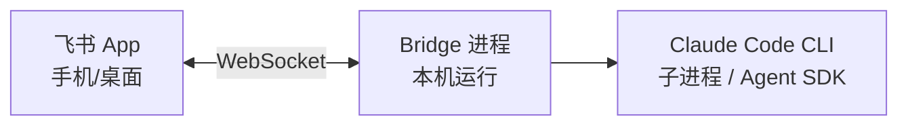

## 引言

2026 年 3 月 28 日，飞书官方正式开源了命令行工具 `lark-cli`（仓库地址：[github.com/larksuite/cli](https://github.com/larksuite/cli)），采用 MIT 协议 <cite>[1]</cite>。开源不到两个月即获得 8,000+ Stars，npm 包 `@larksuite/cli` 周下载量迅速攀升。

这个工具的核心定位非常清晰：**让 AI Agent 拥有操作飞书的"手"**。它覆盖了即时消息、云文档、多维表格、日历、视频会议、邮箱、任务、知识库、通讯录、云空间、搜索等 11 大业务域，内置 200+ 命令和 23 个 AI Agent Skills <cite>[2]</cite>。

在[上一篇文章](/2026/05/18/agent-skills-practical-guide/)中，我们探讨了 AI Agent Skills 的实用生态。如果说 Agent Skills 是 AI 的"技能包"，那么飞书 CLI 就是飞书办公场景下最完整的技能集合——而且是官方维护、持续更新的。

本文将从零开始，带你完成飞书 CLI 的安装配置，深入理解其架构设计，并重点介绍如何与 Claude Code 深度集成——包括 Skills 模式、MCP 模式，以及飞书 ↔ Claude Code 双向通信桥接。

---

## 飞书 CLI 概览

### 它是什么

飞书 CLI（`lark-cli`）是一个用 Go 编写的命令行工具，由飞书官方 larksuite 团队维护。它和传统的 CLI 工具有一个关键区别：**不是为人类敲命令设计的，而是为 AI Agent 调用设计的** <cite>[1]</cite>。

具体来说，它做了三件事：

1. **封装飞书开放平台 API**：将飞书 2500+ Open API 映射为命令行指令
2. **提供 Agent Skills**：23 个 SKILL.md 文件，让 Claude Code 等 AI 工具理解"我能对飞书做什么"
3. **处理认证授权**：OAuth 2.0 token 管理、自动续期、权限范围控制

### 三层命令架构

飞书 CLI 设计了三层命令体系，兼顾人类可读性和 AI 调用效率 <cite>[3]</cite>：

| 层级 | 形式 | 用途 | 示例 |
|------|------|------|------|
| Shortcuts（快捷命令） | `+` 前缀 | 人类友好，自然语言风格 | `lark-cli im +chat-search --query "项目群"` |
| API Commands | 标准子命令 | 与飞书 API 1:1 映射 | `lark-cli im message list --chat-id xxx` |
| Raw API | `lark-cli api` | 直接调用任意 Open API | `lark-cli api get /open-apis/im/v1/messages` |

AI Agent 优先使用 Shortcuts 层——这些命令经过精心设计，参数名和结构对 LLM 友好，减少了模型理解成本。

### 两种身份模式

飞书 CLI 支持两种运行身份 <cite>[1]</cite>：

- **不授权模式**（默认）：使用应用身份执行基础操作（发送消息、创建文档）
- **用户身份模式**（`--as user`）：以当前授权用户的身份访问个人数据（日历、私信、邮箱等）

这个设计很关键：AI Agent 发通知可以用应用身份，但代你查日程必须用用户身份。

---

## 安装与配置

### 环境要求

- Node.js 16+
- npm 7+
- 一个飞书账号（用于创建应用和授权）

### 安装步骤

```bash
# Step 1：安装飞书 CLI 主体
npm install -g @larksuite/cli

# Step 2：安装 AI Agent Skills（让 Claude Code 认识飞书命令）
npx skills add larksuite/cli -y -g

# Step 3：初始化配置
# --new 会引导你在飞书开放平台自动创建应用
lark-cli config init --new

# Step 4：授权登录（--recommend 自动勾选常用权限）
lark-cli auth login --recommend

# Step 5：验证安装
lark-cli doctor
```

Step 3 执行后，终端会输出一个链接。在浏览器中打开 → 登录飞书 → 自动创建企业自建应用（如"Claude 助手"）→ 获得 App ID 和 App Secret。

> **网络提示**：如果 npm 安装缓慢，可先设置国内镜像：`npm config set registry https://registry.npmmirror.com`

### Skills 安装后发生了什么

`npx skills add larksuite/cli -y -g` 这条命令做了以下事情：

1. 从 GitHub 拉取 `larksuite/cli` 仓库的 `skills/` 目录
2. 将 23 个 Skill 文件夹复制到 `~/.claude/skills/`（用户级安装，`-g`）
3. 每个 Skill 文件夹包含 `SKILL.md`（指令正文）+ 可选的 `references/`（参考文档）

安装后重启 Claude Code，Claude Code 会在启动时扫描 `.claude/skills/` 目录，解析所有 SKILL.md 的 YAML 前置元数据，将其 `description` 注册为可触发技能 <cite>[4]</cite>。

### 验证 Skills 是否生效

在 Claude Code 中输入：

```
帮我查一下飞书今天的日程
```

如果 Claude 回复中包含类似"我来调用 lark-calendar skill 查询你的日历"的说明，说明 Skills 已生效。

---

## Claude Code 集成：Skills 模式（推荐）

Skills 模式是官方推荐、最轻量的集成方式。安装后零配置，Claude Code 自动发现和使用。

### 23 个 Agent Skills 全览

飞书 CLI 提供了 23 个 Skills，按业务域分类 <cite>[2]</cite>：

**消息与通讯**

| Skill | 能力 |
|-------|------|
| `lark-im` | 发送消息、回复消息、群聊管理、消息搜索 |
| `lark-contact` | 通讯录搜索、用户信息查询、组织架构浏览 |

**文档与知识管理**

| Skill | 能力 |
|-------|------|
| `lark-doc` | 文档创建/读取/更新/搜索，Markdown ↔ 飞书文档双向无损转换 |
| `lark-wiki` | 知识库空间管理、节点创建、文档组织 |
| `lark-drive` | 云空间文件上传/下载、权限管理 |
| `lark-markdown` | Drive 原生 Markdown 文件读写 |
| `lark-slides` | 幻灯片管理 |

**数据与表格**

| Skill | 能力 |
|-------|------|
| `lark-base` | 多维表格全操作：表/字段/记录/视图/仪表盘/数据分析 |
| `lark-sheets` | 电子表格读写 |

**日程与会议**

| Skill | 能力 |
|-------|------|
| `lark-calendar` | 日历/日程管理、忙闲查询、多人时间推荐 |
| `lark-vc` | 视频会议记录查询 |
| `lark-minutes` | 妙记：会议纪要/摘要/待办/逐字稿提取 |

**任务与流程**

| Skill | 能力 |
|-------|------|
| `lark-task` | 任务创建/更新、子任务管理、到期提醒 |
| `lark-mail` | 邮件搜索/读取/发送/回复/草稿管理 |
| `lark-approval` | 审批任务管理 |
| `lark-attendance` | 考勤打卡记录查询 |
| `lark-okr` | OKR 目标与进度管理 |
| `lark-whiteboard` | 白板与图表 DSL 渲染 |

**工作流与扩展**

| Skill | 能力 |
|-------|------|
| `lark-workflow-meeting-summary` | 会议纪要聚合报告自动生成 |
| `lark-workflow-standup-report` | 站会日程+待办自动汇总 |
| `lark-skill-maker` | 自定义 Skill 创建框架 |
| `lark-openapi-explorer` | 底层 API 探索器，调用任意未封装的 Open API |
| `lark-shared` | 配置/认证/身份切换/安全规则（其他 Skill 自动加载） |

### 实战示例

安装完成后，在 Claude Code 中直接用自然语言下达指令：

**日程管理**
```
查看我今天和明天的飞书日程
帮我约一个周三下午 3 点的会，参会人是张三和李四，检查他们的忙闲
```

**文档协作**
```
在飞书帮我创建一个技术方案文档，标题是"手术导航系统架构设计"
把这篇 Markdown 笔记转为飞书文档，放到"技术分享"知识库
```

**消息与通知**
```
给"算法团队"群发一条消息：本周五下午 3 点进行代码评审，请提前准备
查一下飞书中最近 3 天未读的重要消息，给我做个摘要
```

**多维表格**
```
在飞书多维表格中创建一个"实验记录"表，字段包括：
实验名称、日期、模型、指标、备注
把最近一周的实验结果批量写入这个表
```

**邮件处理**
```
查一下我的飞书未读邮件，重要的帮我摘要，垃圾的直接归档
帮我起草一封回复给王总的邮件，确认下周三的产品评审时间
```

### Claude Code 如何理解和执行这些指令

当你输入自然语言指令后，Claude Code 的处理流程如下 <cite>[4]</cite>：

1. **Skill 匹配**：Claude Code 根据指令内容匹配相关 Skill 的 `description` 字段。例如"日程"触发 `lark-calendar`
2. **SKILL.md 加载**：将匹配到的 Skill 的 SKILL.md 全文加载到上下文（通常 100-500 行）
3. **reference 按需读取**：SKILL.md 中引用的 `references/` 文档按需加载，不占用基础上下文
4. **命令生成**：根据 SKILL.md 中的指令，生成对应的 `lark-cli` 命令
5. **执行与反馈**：执行命令，解析输出，将结果以自然语言呈现给用户

这个过程对用户完全透明——你只需要说人话，Claude Code 负责翻译成飞书操作。


---

## Claude Code 集成：MCP Server 模式

除了 Skills 模式，社区还提供了基于 MCP（Model Context Protocol）的集成方案。MCP 模式的核心优势是**工具调用更加结构化**——每个飞书操作对应一个 MCP Tool，参数类型明确，返回格式标准 <cite>[5]</cite>。

### 主流飞书 MCP Server

目前最活跃的两个飞书 MCP 项目：

**cso1z/Feishu-MCP**（5.2k Stars）<cite>[6]</cite>

- npm 包：`feishu-mcp`
- 功能：文档 CRUD、任务管理、用户搜索、文件夹操作、图片处理、白板
- 附带 CLI 工具 `feishu-tool` + 飞书 Skill

**tongqiangsen/feishu-enterprise-mcp**（企业级）<cite>[7]</cite>

- 28 个 MCP 工具
- 额外覆盖：Wiki 知识库、消息发送、文件管理
- 适合企业级部署

### 配置方法

在 Claude Code 的 MCP 配置文件（`~/.claude/.mcp.json`）中添加：

```json
{
  "mcpServers": {
    "feishu-mcp": {
      "command": "npx",
      "args": ["-y", "feishu-mcp@latest", "--stdio"],
      "env": {
        "FEISHU_APP_ID": "cli_xxxxxxxxxx",
        "FEISHU_APP_SECRET": "xxxxxxxxxxxxxxxx",
        "FEISHU_AUTH_TYPE": "tenant",
        "FEISHU_ENABLED_MODULES": "document,task,calendar,mail"
      }
    }
  }
}
```

配置完成后重启 Claude Code，MCP 工具会自动注册。Skills 模式和 MCP 模式可以共存——Skills 提供场景化的自然语言封装，MCP 提供结构化的工具调用。

### Skills vs MCP：如何选择

| 维度 | Skills 模式 | MCP 模式 |
|------|------------|---------|
| 安装复杂度 | 一行命令 | 需配置 JSON + 环境变量 |
| 使用方式 | 自然语言触发 | Tool 显式调用 |
| 覆盖范围 | 23 个场景化 Skill | 取决于 MCP Server 的工具数 |
| 参数精确度 | LLM 推断参数 | JSON Schema 约束 |
| 维护方 | 飞书官方 | 社区 |
| 适合场景 | 日常办公、灵活交互 | 自动化流水线、精确调用 |

**建议**：日常使用优先 Skills 模式（简单、官方维护）；需要精确控制或嵌入 CI/CD 流程时补充 MCP 模式。

---

## 高级篇：飞书 ↔ Claude Code 双向通信

前面介绍的是"在 Claude Code 中操作飞书"。但你也可以反过来——**在飞书中与 Claude Code 对话，让飞书成为 Claude Code 的客户端**。

这个方向的实现叫"飞书桥接"（Feishu Bridge），核心架构是 <cite>[8]</cite>：



### 主流桥接方案

**feishu-claudecode-bridge**（推荐）<cite>[8]</cite>

- GitHub: `zarazhangrui/feishu-claudecode-bridge`
- 技术栈：Python 3.11+
- 特色：流式卡片输出（飞书消息实时更新）、会话持久化、群聊支持（beta）、Skills 透传
- 无需公网 IP，复用 Claude Max/Pro 订阅

**chat-cc**（Node.js 方案）<cite>[9]</cite>

- npm: `chat-cc` v3.0+
- 技术栈：Node.js ≥ 20.11 + TypeScript
- 特色：Agent SDK 原生集成、事件驱动实况卡片、工具审批卡片、反向 MCP
- 支持守护进程管理、会话磁盘持久化、空闲自动回收

**feicod**（轻量方案）<cite>[10]</cite>

- npm: `feicod` v4.1+
- 特色：群聊 PTY 会话管理、危险命令拦截、Web Dashboard、双向交互卡片、定时任务
- 一行命令安装：`npx feicod`

### 桥接方案的选择

| 方案 | 适合人群 | 主要优势 |
|------|---------|---------|
| feishu-claudecode-bridge | Python 用户 | 成熟稳定，社区活跃 |
| chat-cc | Node.js 用户 | TypeScript 原生，Agent SDK 深度集成 |
| feicod | 快速上手 | 一键安装，Web Dashboard |

### 桥接后的使用场景

配置桥接后，你可以在飞书手机/电脑客户端中：

```
@Claude 帮我 review 一下今天提交的代码
@Claude 把上周的实验数据汇总成飞书多维表格
@Claude 帮我写一份 Q2 工作总结，参考我最近的飞书文档和日程
```

Claude Code 在本机执行操作，结果以飞书消息卡片形式实时流式返回。这意味着**你可以用手机远程操控本机的 Claude Code**，无需 SSH、无需 VPN。

---

## 实战工作流

以下是我日常使用飞书 CLI + Claude Code 的三种典型工作流。

### 会议全流程自动化

```
会前 30 分钟：
  "帮我查一下'骨科手术机器人项目周会'的参会人，给他们发提醒消息"
  
会中：
  "在飞书文档中记录本次会议纪要，模板用'项目周会'格式"
  
会后：
  "提取飞书妙记中的待办事项，在飞书任务中创建并分配给对应成员"
  "把会议纪要通过邮件发送给所有参会人"
```

这套流程覆盖了 `lark-calendar` → `lark-im` → `lark-doc` → `lark-minutes` → `lark-task` → `lark-mail` 六个 Skill。

### 日报/周报自动生成

```
"根据我今天在飞书中的日程、已完成的任务、发送的重要消息，
 生成一份工作日报，发到'团队日报'群"
```

Claude Code 会依次调用 `lark-calendar`、`lark-task`、`lark-im` 获取数据，汇总后通过 `lark-im` 发送。

### 知识库维护

```
"把这周我创建的飞书文档整理到知识库的'技术分享'节点下，
 按主题分类，并更新索引页"
```

---

## 常见问题排查

### 授权相关

| 问题 | 解决方案 |
|------|---------|
| OAuth 授权码过期 | 授权码 10 分钟内有效，重新执行 `lark-cli auth login` |
| Token 过期 | Access Token 2 小时自动续期，Refresh Token 7 天有效。过期后重新 `lark-cli auth login` |
| 权限不足 | 根据错误提示，执行 `lark-cli auth login --scope "<缺失权限>"` 追加权限 |
| 需要访问个人数据 | 使用 `--as user` 标志，以用户身份运行命令 |

### Skills 不生效

1. 确认 Skills 已安装：`ls ~/.claude/skills/` 应有 `lark-*` 开头的目录
2. 重启 Claude Code（Skills 在启动时扫描）
3. 检查 Claude Code 版本：需要支持 Skills 功能的版本
4. 尝试在指令中明确提及飞书（如"在飞书中..."）

### 网络问题

- npm 安装慢：设置国内镜像 `npm config set registry https://registry.npmmirror.com`
- 飞书 API 调用超时：检查网络是否能访问 `open.feishu.cn`
- 企业内网限制：可能需要配置代理

---

## 总结

飞书 CLI 标志着办公工具 AI 化的一个重要转折点——**办公软件不再只是给人用的，也是给 AI 用的**。通过 200+ 命令和 23 个 Agent Skills，AI 第一次拥有了完整、官方支持的操作飞书的能力。

对于 Claude Code 用户来说，集成路径非常清晰：

1. **入门**：`npm install -g @larksuite/cli` + `npx skills add larksuite/cli -y -g`，两行命令搞定
2. **进阶**：配置 MCP Server，获得更结构化的工具调用
3. **高级**：部署飞书桥接，实现飞书 ↔ Claude Code 双向通信，用手机操控本机 AI

整个生态仍在快速演化。飞书 CLI 本身每月更新 2-3 个版本，社区桥接方案也在不断成熟。建议关注官方仓库 [larksuite/cli](https://github.com/larksuite/cli) 获取最新动态。

---

## 参考文献

<ol class="references">
<li>Larksuite. <em>lark-cli — The Official Lark/Feishu CLI Tool</em>. GitHub, March 2026.<br>
<a href="https://github.com/larksuite/cli">github.com/larksuite/cli</a></li>

<li>Larksuite. <em>飞书 CLI AI Agent Skills — 23 个官方 Skills 文档</em>.<br>
<a href="https://github.com/larksuite/cli/tree/main/skills">github.com/larksuite/cli/tree/main/skills</a></li>

<li>飞书官方. <em>飞书 CLI 三层命令架构设计文档</em>.<br>
<a href="https://open.feishu.cn/document/no_class/mcp-archive/feishu-cli-installation-guide">open.feishu.cn — 飞书 CLI 安装指南</a></li>

<li>Anthropic. <em>Agent Skills Specification — agentskills.io</em>. December 2025.<br>
<a href="https://agentskills.io/specification">agentskills.io/specification</a></li>

<li>Anthropic. <em>Model Context Protocol Specification</em>.<br>
<a href="https://modelcontextprotocol.io/">modelcontextprotocol.io</a></li>

<li>cso1z. <em>Feishu-MCP — 飞书文档与任务管理 MCP Server</em>. GitHub, 2026.<br>
<a href="https://github.com/cso1z/Feishu-MCP">github.com/cso1z/Feishu-MCP</a></li>

<li>tongqiangsen. <em>feishu-enterprise-mcp — 飞书企业级 MCP Server</em>. GitHub, 2026.<br>
<a href="https://github.com/tongqiangsen/feishu-enterprise-mcp">github.com/tongqiangsen/feishu-enterprise-mcp</a></li>

<li>zarazhangrui. <em>feishu-claudecode-bridge — 飞书 ↔ Claude Code 双向通信桥接</em>. GitHub, 2026.<br>
<a href="https://github.com/zarazhangrui/feishu-claudecode-bridge">github.com/zarazhangrui/feishu-claudecode-bridge</a></li>

<li>chat-cc. <em>飞书操控 Claude Code — Agent SDK 原生集成</em>. npm, 2026.<br>
<a href="https://www.npmjs.com/package/chat-cc">npmjs.com/package/chat-cc</a></li>

<li>feicod. <em>飞书双向交互 Hooks — 一键安装桥接方案</em>. npm, 2026.<br>
<a href="https://www.npmjs.com/package/feicod">npmjs.com/package/feicod</a></li>

<li>飞书官方. <em>飞书开放平台 — 企业自建应用文档</em>.<br>
<a href="https://open.feishu.cn/document/home/index">open.feishu.cn/document</a></li>

<li>GODYAD. <em>Claude Code 实战：250 行代码打通飞书 CLI 与 Claude 的双向通信结构</em>. CSDN, April 2026.<br>
<a href="https://blog.csdn.net/GODYAD/article/details/159761353">blog.csdn.net/GODYAD</a></li>
</ol>

---

*本文中所有安装命令和功能描述均基于飞书 CLI v1.0.x 和 Claude Code 2026 年 5 月最新版本，经实际安装验证。桥接方案信息来自各项目 GitHub 仓库和 npm 发布页。*
