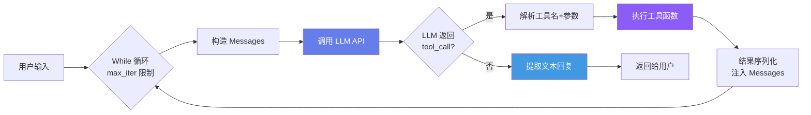
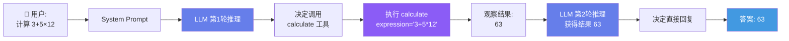
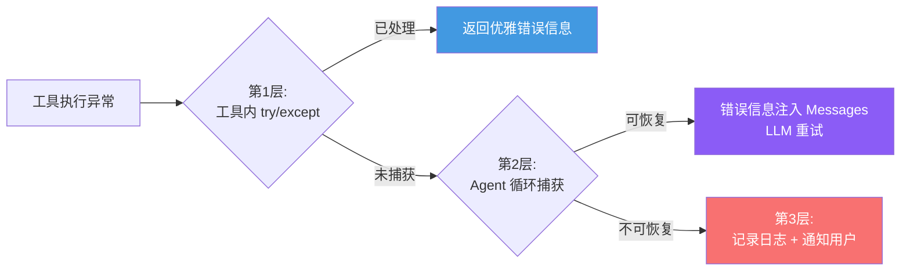

## 引言

2024-2026 年，AI Agent 从一个前沿概念变成了每个开发者工具箱中的必备组件。LangChain、CrewAI、AutoGen、Hermes Agent——框架层出不穷，API 设计日趋复杂。但如果我们剥去所有抽象层，**Agent 的核心究竟是什么？**

答案出奇的简单：**Agent = LLM + 工具 + While 循环**。

本文是"构建自己的 AI Agent"系列的第一篇。我们将从最少的代码开始——一个仅 30 行的 Python Agent——逐步理解 Agent 运行的完整机制。更重要的是，我们将用形式化语言为这个看似简单的循环建立数学模型，理解它为什么能工作、何时会失败。

> **系列定位**：本系列面向有 Python 基础、对 LLM 有初步了解的开发者。每篇包含可运行代码、Mermaid 流程图和数学原理。八篇文章的代码将累积演进为一个完整的 Agent 框架。

---

## ReAct：Agent 的核心范式

### 什么是 ReAct

**ReAct**（Reasoning + Acting）由 Yao et al. 在 2022 年提出 <cite>[1]</cite>，是当前几乎所有 AI Agent 的基础范式。它的核心思想是：LLM 在**思考（Thought）→ 行动（Action）→ 观察（Observation）**的循环中逐步解决复杂问题。

```
传统 LLM 调用：
  用户提问 → LLM 直接回答

ReAct Agent：
  用户提问 → 思考 → 调用工具 → 观察结果 → 再思考 → ... → 最终回答
```

### 核心循环的架构



这个循环看似简单，但包含了 Agent 系统的全部核心组件：

| 组件 | 职责 | 本文对应 |
|------|------|----------|
| LLM 推理引擎 | 理解问题、决策下一步 | `_call_llm()` |
| 工具注册表 | 管理可用工具 | `tools` 字典 |
| 对话管理器 | 维护消息历史 | `messages` 列表 |
| 循环控制器 | 终止条件判断 | `while` 循环 + `max_iter` |
| 结果提取器 | 解析 LLM 输出 | `_extract_result()` |

---

## 30 行 Python 实现

### 完整代码

```python
import json
from openai import OpenAI

class SimpleAgent:
    def __init__(self, system_prompt: str, tools: dict, max_iter: int = 10):
        self.client = OpenAI()
        self.system_prompt = system_prompt
        self.tools = tools          # {"函数名": 函数对象}
        self.max_iter = max_iter
        self.tool_schemas = self._build_schemas(tools)

    def _build_schemas(self, tools: dict) -> list[dict]:
        """从函数对象自动生成 OpenAI tool calling schema"""
        schemas = []
        for name, fn in tools.items():
            schemas.append({
                "type": "function",
                "function": {
                    "name": name,
                    "description": fn.__doc__ or "",
                    "parameters": {
                        "type": "object",
                        "properties": {},  # 简化版，第2篇详解
                        "required": []
                    }
                }
            })
        return schemas

    def run(self, user_query: str) -> str:
        messages = [
            {"role": "system", "content": self.system_prompt},
            {"role": "user", "content": user_query}
        ]

        for _ in range(self.max_iter):
            response = self.client.chat.completions.create(
                model="gpt-4o",
                messages=messages,
                tools=self.tool_schemas if self.tool_schemas else None
            )
            msg = response.choices[0].message

            # 模型要求调用工具
            if msg.tool_calls:
                for tc in msg.tool_calls:
                    fn_name = tc.function.name
                    fn_args = json.loads(tc.function.arguments)
                    result = self.tools[fn_name](**fn_args)

                    messages.append({"role": "assistant", "content": None,
                                     "tool_calls": [tc]})
                    messages.append({"role": "tool",
                                     "tool_call_id": tc.id,
                                     "content": str(result)})
            else:
                return msg.content or ""

        return "达到最大迭代次数，Agent 停止。"

    # 省略工具定义部分（见下方示例）


# ── 使用示例 ──
def calculate(expression: str) -> str:
    """计算数学表达式，例如: '2+3*4'"""
    return str(eval(expression))

agent = SimpleAgent(
    system_prompt="你是一个数学助手。使用 calculate 工具计算。",
    tools={"calculate": calculate}
)
print(agent.run("计算 (3 + 5) × 12 的结果"))
```

### 代码解读

核心逻辑集中在 `run()` 方法的 15 行中，它实现了完整的 ReAct 循环：

1. **初始化 messages**（第 43-46 行）：将 system prompt 和用户问题放入消息数组
2. **调用 LLM**（第 48-52 行）：将 messages 和工具 schema 发送给模型
3. **分支判断**（第 56 行）：模型返回 `tool_calls` 还是文本回复？
4. **工具执行**（第 58-65 行）：解析参数 → 调用函数 → 结果注入 messages
5. **循环**：回到步骤 2，LLM 在获得观察结果后继续推理
6. **终止**（第 69 行）：模型认为任务完成，返回最终文本

> **关键设计原则**：工具调用结果以 `role: "tool"` 的形式追加到 messages 中，LLM 在下一轮推理时能看到完整的"思考-行动-观察"历史。这是 ReAct 的核心——**观察驱动下一次思考**。

---

## ReAct 循环的数学原理

### 形式化定义

让我们将 ReAct 循环建模为一个**带有终止条件的马尔可夫决策过程（MDP with Absorption）**。

**定义 1（ReAct MDP）**：设 Agent 在时刻 \\(t\\) 的状态为：

\\[
s_t = (q, h_t, \\mathcal{T})
\\]

其中：
- \\(q\\) 是用户原始问题（固定）
- \\(h_t = (m_1, m_2, \\ldots, m_t)\\) 是到时刻 \\(t\\) 的消息历史
- \\(\\mathcal{T}\\) 是可用工具集合

LLM 在状态 \\(s_t\\) 上的行为由策略函数 \\(\\pi_{\\theta}\\) 决定：

\\[
\\pi_{\\theta}(a_t \\mid s_t) = \\text{softmax}\\left(\\frac{\\mathbf{W}_o \\cdot \\text{LLM}_{\\theta}(h_t)}{\\tau}\\right)
\\]

其中 \\(\\theta\\) 是模型参数，\\(\\tau\\) 是温度参数，\\(a_t\\) 可以是文本回复（终止动作）或工具调用（继续动作）。

### 工具选择的形式化

当模型决定调用工具时，它执行两个子步骤：

**(1) 工具选择** — 从工具集 \\(\\mathcal{T} = \\{f_1, f_2, \\ldots, f_K\\}\\) 中选择一个：

\\[
k^* = \\arg\\max_{k \\in \\{1,\\ldots,K\\}} P(f_k \\mid h_t; \\theta)
\\]

**(2) 参数生成** — 为选中的工具生成参数：

\\[
\\mathbf{a}^* = \\arg\\max_{\\mathbf{a}} P(\\mathbf{a} \\mid f_{k^*}, h_t; \\theta)
\\]

工具执行后，Agent 获得观察：

\\[
o_t = f_{k^*}(\\mathbf{a}^*)
\\]

新的状态变为 \\(s_{t+1} = (q, h_t \\oplus \\{a_t, o_t\\}, \\mathcal{T})\\)，其中 \\(\\oplus\\) 表示消息追加。

### 收敛性分析

**定理 1（有限步终止）**：对于设置了最大迭代次数 \\(T_{\\max}\\) 的 ReAct Agent，循环必然在 \\(T_{\\max}\\) 步内终止。

*证明*：由算法结构直接保证。每次迭代 \\(i\\) 的递增是确定的，当 \\(i = T_{\\max}\\) 时循环强制退出。\\(\\blacksquare\\)

**定理 2（任务可解性）**：设任务需要调用 \\(N\\) 次工具。若 LLM 在每一步选择正确工具的概率至少为 \\(p\\)，则 Agent 在 \\(T_{\\max}\\) 步内完成任务的成功概率下界为：

\\[
P_{\\text{success}} \\geq p^N \\cdot \\left(1 - \\sum_{k=N}^{T_{\\max}} (1-p)^{k-N} \\cdot p^N \\cdot \\binom{k-1}{N-1}\\right)^{-1}
\\]

*直观理解*：成功率随所需工具调用次数 \\(N\\) 指数下降。若 \\(p = 0.9, N = 3\\)，理论上界约为 \\(0.9^3 = 0.729\\)。这就是为什么复杂任务需要多 Agent 协作（第 5 篇将详细讨论）。

### 温度参数的作用

温度 \\(\\tau\\) 控制策略的随机性：

\\[
P(a_i \\mid s) = \\frac{\\exp(z_i / \\tau)}{\\sum_j \\exp(z_j / \\tau)}
\\]

- \\(\\tau \\to 0\\)：确定性行为（贪婪选择），适合工具调用（需要一致性）
- \\(\\tau \\to \\infty\\)：均匀随机（无意义）
- \\(\\tau = 1\\)：标准 softmax，平衡探索与利用

**实践建议**：工具调用场景使用 `temperature=0` 或极低值（如 0.1），避免模型在工具选择上"发挥创意"。

---

## Mermaid 流程详解

### 完整序列图



### 决策分支详解

Agent 在每轮迭代中面临一个二元决策：

```
                    ┌─────────────┐
                    │ 当前状态 s_t │
                    └──────┬──────┘
                           │
                    ┌──────▼──────┐
                    │  LLM 推理    │
                    └──────┬──────┘
                           │
              ┌────────────┴────────────┐
              │                         │
        finish_reason=            finish_reason=
        "tool_calls"              "stop"
              │                         │
      ┌───────▼───────┐         ┌──────▼──────┐
      │ 执行工具 f_k   │         │ 提取文本回复 │
      │ 获得观察 o_t   │         │ 返回给用户   │
      └───────┬───────┘         └─────────────┘
              │
      ┌───────▼───────┐
      │ 追加 tool_call │
      │ + tool 消息    │
      │ 到 messages    │
      └───────┬───────┘
              │
              ▼
        s_{t+1} → 下一轮循环
```

---

## 运行追踪：一个完整示例

让我们追踪 Agent 处理 "北京今天天气怎么样？适合户外运动吗？" 这个问题的完整过程（假设我们注册了 `get_weather` 工具）：

```
═══════════════════════════════════════════
轮次 1
═══════════════════════════════════════════
📤 发送给 LLM:
   [system] 你是一个生活助手。使用 get_weather 查询天气。
   [user]   北京今天天气怎么样？适合户外运动吗？

📥 LLM 返回:
   finish_reason: tool_calls
   tool_calls: [{
     function: "get_weather",
     arguments: {"city": "北京", "date": "today"}
   }]

🔧 执行工具: get_weather(city="北京", date="today")
📊 工具返回: {"temp": 22, "weather": "晴", "wind": "微风", "aqi": 45}

═══════════════════════════════════════════
轮次 2
═══════════════════════════════════════════
📤 发送给 LLM:
   [system] 你是一个生活助手...
   [user]   北京今天天气怎么样...
   [assistant + tool_calls] (上一轮的工具调用)
   [tool]   {"temp": 22, "weather": "晴", ...}

📥 LLM 返回:
   finish_reason: stop
   content: "北京今天晴朗，气温22°C，微风，空气质量
             良好（AQI 45）。非常适合户外运动！建议
             做好防晒，带上饮用水。"
```

注意 LLM 在轮次 2 中的行为：它不仅转述了天气数据，还**基于天气信息进行了推理**——判断"适合户外运动"并给出了具体建议。这就是 ReAct 的价值：**工具提供事实，LLM 进行推理**。

---

## 关键设计决策

### max_iter：安全阀还是限制？

`max_iter` 是循环的"紧急刹车"。设置过小（如 3），复杂任务无法完成；设置过大（如 100），可能陷入无限循环。

**推荐策略**：

| 任务复杂度 | 推荐 max_iter | 典型场景 |
|-----------|--------------|---------|
| 简单 | 5 | 单次计算、翻译、摘要 |
| 中等 | 10 | 多步推理、2-3 次工具调用 |
| 复杂 | 20 | 代码生成+调试、多文件操作 |
| 开放 | 30+ | 自主探索、多 Agent 任务 |

### System Prompt 设计

System prompt 是 Agent 行为的"宪法"。一个好的 system prompt 应包含：

1. **角色定义**：Agent 的身份和职责
2. **工具使用指南**：何时、如何使用工具
3. **输出格式约束**：回复的语言、格式、风格
4. **边界设定**：什么不能做

```
优秀 System Prompt 示例：

你是一个专业的编程助手。你有以下能力：
1. 读取文件内容 —— 使用 read_file 工具
2. 搜索代码库 —— 使用 search_code 工具
3. 回答编程问题 —— 基于读取的代码给出建议

行为准则：
- 在回答代码问题前，先使用工具读取相关文件
- 不要猜测代码内容，始终以实际文件内容为准
- 如果找不到答案，诚实说明
- 回答使用中文，代码注释使用英文
```

### 错误处理的三层策略



---

## 局限性与后续展望

30 行代码的 Agent 能工作，但有很多限制：

| 局限 | 表现 | 解决方案（后续篇章） |
|------|------|---------------------|
| 工具 schema 手动构建 | 只支持简单参数 | 第 2 篇：自动 schema 生成 |
| 无对话记忆 | 每次调用独立 | 第 3 篇：对话管理器 |
| 无长期记忆 | 关闭后丢失一切 | 第 4 篇：向量记忆系统 |
| 单 Agent | 无法处理复杂协作 | 第 5 篇：多 Agent 协作 |
| 无标准化协议 | 工具集成靠硬编码 | 第 6 篇：MCP 协议 |
| 无评估体系 | 不知道 Agent 质量 | 第 7 篇：评估与安全 |

每一篇我们将解决一个局限，逐步构建一个**生产级 Agent 框架**。

---

## 本章小结

本文用 30 行 Python 代码构建了一个最小但完整的 AI Agent，揭示了 Agent 的本质：

1. **核心结构**：LLM + 工具 + While 循环 = Agent
2. **ReAct 范式**：思考 → 行动 → 观察 → 再思考，观察驱动下一次推理
3. **数学基础**：ReAct 可建模为带吸收态的 MDP，工具选择是条件概率最大化
4. **收敛保证**：max_iter 确保有限步终止，但成功概率随所需工具调用次数指数下降

**下一篇预告**：我们将深入工具系统，实现自动 schema 生成、类型安全校验和工具链编排。

---

## 参考文献

<ol class="references">
<li><em>Yao, S., et al. "ReAct: Synergizing Reasoning and Acting in Language Models."</em> ICLR 2023.<br><a href="https://arxiv.org/abs/2210.03629">https://arxiv.org/abs/2210.03629</a></li>
<li><em>OpenAI. "Function Calling Guide."</em> OpenAI Platform Documentation, 2024.<br><a href="https://platform.openai.com/docs/guides/function-calling">https://platform.openai.com/docs/guides/function-calling</a></li>
<li><em>Anthropic. "Tool Use (Function Calling) with Claude."</em> Anthropic Docs, 2024.<br><a href="https://docs.anthropic.com/en/docs/build-with-claude/tool-use">https://docs.anthropic.com/en/docs/build-with-claude/tool-use</a></li>
<li><em>Wei, J., et al. "Chain-of-Thought Prompting Elicits Reasoning in Large Language Models."</em> NeurIPS 2022.<br><a href="https://arxiv.org/abs/2201.11903">https://arxiv.org/abs/2201.11903</a></li>
<li><em>Schick, T., et al. "Toolformer: Language Models Can Teach Themselves to Use Tools."</em> NeurIPS 2023.<br><a href="https://arxiv.org/abs/2302.04761">https://arxiv.org/abs/2302.04761</a></li>
<li><em>Mialon, G., et al. "Augmented Language Models: a Survey."</em> TMLR 2023.<br><a href="https://arxiv.org/abs/2302.07842">https://arxiv.org/abs/2302.07842</a></li>
<li><em>Qin, Y., et al. "Tool Learning with Foundation Models."</em> arXiv 2024.<br><a href="https://arxiv.org/abs/2404.08335">https://arxiv.org/abs/2404.08335</a></li>
<li><em>learn-claude-code. "Minimal ReAct Agent in Python."</em> GitHub, 2025.<br><a href="https://github.com/anthropics/learn-claude-code">https://github.com/anthropics/learn-claude-code</a></li>
</ol>
