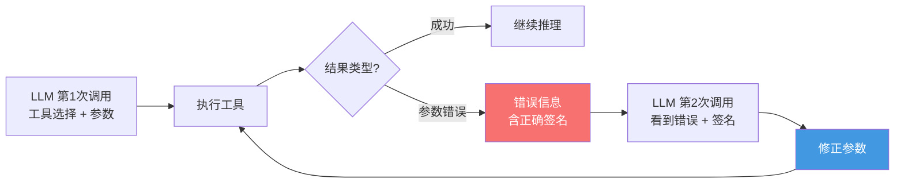
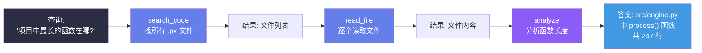

## 引言

上一篇我们用 30 行 Python 构建了最小 Agent，其中工具 schema 是手动拼凑的空壳：

```python
"parameters": {
    "type": "object",
    "properties": {},  # ← 空！什么参数都不接受
    "required": []
}
```

这在实际应用中完全不够。一个真正的工具系统需要解决三个核心问题：

1. **Schema 自动生成**：如何从 Python 函数签名自动生成完整的 JSON Schema？
2. **类型安全**：如何确保 LLM 生成的参数类型正确、范围合法？
3. **错误传播**：工具执行失败时，如何让 LLM 理解错误并自我修正？

本文将构建一个**生产级工具系统**，并用数学语言分析工具选择的本质。

---

## 工具系统的三层架构

```mermaid
graph LR
    Fn[Python 函数<br/>+ 类型注解 + docstring] --> Decorator[@tool 装饰器]
    Decorator --> Schema[自动生成<br/>JSON Schema]
    Decorator --> Validator[参数校验器]
    Schema --> Registry[工具注册表<br/>ToolRegistry]
    Validator --> Registry

    LLM[LLM 返回<br/>tool_call] --> Dispatch{按名称分发}
    Dispatch --> Validator2[参数校验]
    Validator2 -- 通过 --> Execute[执行函数]
    Validator2 -- 失败 --> Error[返回类型错误<br/>供 LLM 重试]
    Execute --> Serialize[结果序列化]
    Serialize --> Context[注入对话上下文]

    style Decorator fill:#8B5CF6,color:#fff
    style Registry fill:#667eea,color:#fff
    style Execute fill:#4299e1,color:#fff
```

三层职责分离：
- **定义层**：Python 开发者用函数定义工具
- **注册层**：ToolRegistry 管理工具的元数据（schema、校验规则）
- **执行层**：运行时解析 LLM 调用 → 校验参数 → 执行 → 序列化结果

---

## 类型映射：Python → JSON Schema

### 基础类型映射表

LLM 的 tool calling API 使用 JSON Schema 描述参数类型。我们需要建立 Python 类型到 JSON Schema 的映射：

| Python 类型 | JSON Schema type | 示例参数 | 生成的 Schema |
|------------|------------------|---------|--------------|
| `str` | `"string"` | `city: str` | `{"type": "string"}` |
| `int` | `"integer"` | `count: int` | `{"type": "integer"}` |
| `float` | `"number"` | `temp: float` | `{"type": "number"}` |
| `bool` | `"boolean"` | `verbose: bool` | `{"type": "boolean"}` |
| `list[str]` | `"array"` | `tags: list[str]` | `{"type": "array", "items": {"type": "string"}}` |
| `Literal["a","b"]` | `"string" + enum` | `mode: Literal["fast","slow"]` | `{"type": "string", "enum": ["fast", "slow"]}` |
| `Optional[int]` | 添加到 required 之外 | `limit: Optional[int]` | schema 加入 `"type": "integer"`，不加入 required |

### 形式化定义

**定义 1（类型映射函数）**：定义映射 \\(\\Phi: \\mathcal{T}_{\\text{Python}} \\to \\mathcal{T}_{\\text{JSON Schema}}\\) 将 Python 类型系统映射到 JSON Schema 类型系统：

\\[
\\Phi(t) = \\begin{cases}
\\{\"type\": \"string\"\\} & \\text{if } t = \\text{str} \\\\
\\{\"type\": \"integer\"\\} & \\text{if } t = \\text{int} \\\\
\\{\"type\": \"number\"\\} & \\text{if } t = \\text{float} \\\\
\\{\"type\": \"boolean\"\\} & \\text{if } t = \\text{bool} \\\\
\\{\"type\": \"array\", \"items\": \\Phi(T)\\} & \\text{if } t = \\text{list}[T] \\\\
\\{\"type\": \"string\", \"enum\": [v_1, \\ldots, v_k]\\} & \\text{if } t = \\text{Literal}[v_1, \\ldots, v_k]
\\end{cases}
\\]

**定义 2（Schema 完整性）**：对于函数 \\(f: (x_1: T_1, \\ldots, x_n: T_n) \\to R\\)，其生成的 JSON Schema \\(S_f\\) 是**完整的**，当且仅当：

\\[
\\forall i \\in \\{1,\\ldots,n\\}, \\quad \\Phi(T_i) \\subseteq S_f[\\\"properties\\\"][x_i]
\\]

其中 \\(\\subseteq\\) 表示 schema 子集关系（所有必填字段都已包含）。

### docstring 作为语义描述

类型映射提供了**语法层**的 schema，但 LLM 还需要**语义层**的理解。我们将函数的 docstring 作为 JSON Schema 的 `description` 字段：

```python
def get_weather(city: str, date: str = "today") -> dict:
    """查询指定城市的天气信息。

    Args:
        city: 城市名称，支持中文或英文，如 '北京' 或 'Beijing'
        date: 日期，格式 YYYY-MM-DD，默认为今天
    """
    # ...
```

生成的 Schema：
```json
{
  "name": "get_weather",
  "description": "查询指定城市的天气信息。",
  "parameters": {
    "type": "object",
    "properties": {
      "city": {
        "type": "string",
        "description": "城市名称，支持中文或英文，如 '北京' 或 'Beijing'"
      },
      "date": {
        "type": "string",
        "description": "日期，格式 YYYY-MM-DD，默认为今天"
      }
    },
    "required": ["city"]
  }
}
```

> **设计原则**：`description` 是 LLM 理解工具用法的唯一渠道。写得越好，LLM 越不容易用错参数。

---

## @tool 装饰器实现

### 完整代码

```python
import inspect
import json
import functools
from typing import get_type_hints, Literal, get_origin, get_args
from dataclasses import dataclass, field

@dataclass
class ToolInfo:
    """工具的完整元数据"""
    name: str
    description: str
    fn: callable
    schema: dict
    param_types: dict

class ToolRegistry:
    """工具注册表 —— 管理所有可用工具"""
    def __init__(self):
        self._tools: dict[str, ToolInfo] = {}

    def register(self, fn=None, *, name=None, description=None):
        """@tool 装饰器的核心实现"""
        if fn is None:
            return lambda f: self.register(f, name=name,
                                           description=description)

        tool_name = name or fn.__name__
        tool_desc = description or (fn.__doc__ or "").split("\n")[0].strip()

        hints = get_type_hints(fn) if hasattr(fn, '__annotations__') else {}
        param_names = list(inspect.signature(fn).parameters.keys())

        properties = {}
        required = []

        for pname, ptype in hints.items():
            if pname == 'return':
                continue
            prop = self._type_to_schema(ptype)
            # 从 docstring 提取参数描述
            param_desc = self._extract_param_desc(fn.__doc__, pname)
            if param_desc:
                prop['description'] = param_desc
            properties[pname] = prop

            # 没有默认值 = 必填
            sig = inspect.signature(fn)
            if sig.parameters[pname].default is inspect.Parameter.empty:
                required.append(pname)

        schema = {
            "type": "function",
            "function": {
                "name": tool_name,
                "description": tool_desc,
                "parameters": {
                    "type": "object",
                    "properties": properties,
                    "required": required
                }
            }
        }

        self._tools[tool_name] = ToolInfo(
            name=tool_name,
            description=tool_desc,
            fn=fn,
            schema=schema,
            param_types=hints
        )
        return fn

    @staticmethod
    def _type_to_schema(ptype) -> dict:
        """核心：Python 类型 → JSON Schema"""
        origin = get_origin(ptype)
        args = get_args(ptype)

        # 处理 Optional[X] = Union[X, None]
        if origin is Union or (hasattr(ptype, '__origin__') and
                                str(ptype).startswith('typing.Optional')):
            non_none = [a for a in args if a is not type(None)]
            if non_none:
                return ToolRegistry._type_to_schema(non_none[0])

        # Literal["a", "b"] → enum
        if origin is Literal:
            return {"type": "string", "enum": list(args)}

        # list[T] → array
        if origin is list:
            return {"type": "array", "items": ToolRegistry._type_to_schema(args[0])}

        # 基础类型
        type_map = {
            str: "string", int: "integer", float: "number",
            bool: "boolean", dict: "object"
        }
        json_type = type_map.get(origin or ptype)
        if json_type:
            return {"type": json_type}

        return {"type": "string"}  # fallback

    @staticmethod
    def _extract_param_desc(docstring: str, param_name: str) -> str | None:
        """从 Google 风格的 docstring 提取参数描述"""
        if not docstring:
            return None
        for line in docstring.split('\n'):
            line = line.strip()
            if line.startswith(f'{param_name}:'):
                return line.split(':', 1)[1].strip()
        return None

    def get_schemas(self) -> list[dict]:
        """获取所有工具的 OpenAI tool calling schema"""
        return [t.schema for t in self._tools.values()]

    def execute(self, name: str, arguments: dict) -> str:
        """执行工具：校验参数 → 调用函数 → 序列化结果"""
        tool = self._tools.get(name)
        if not tool:
            return f"错误：未找到工具 '{name}'。可用工具：{list(self._tools.keys())}"

        # 参数校验
        try:
            validated = self._validate_params(tool, arguments)
        except ValueError as e:
            return f"参数错误：{e}\n工具签名：{tool.name}{inspect.signature(tool.fn)}"

        # 执行
        try:
            result = tool.fn(**validated)
            return json.dumps(result, ensure_ascii=False, default=str)
        except Exception as e:
            return f"工具执行失败：{type(e).__name__}: {e}\n请检查参数并重试。"

    def _validate_params(self, tool: ToolInfo, arguments: dict) -> dict:
        """参数校验与类型转换"""
        validated = {}
        sig = inspect.signature(tool.fn)

        for pname, ptype in tool.param_types.items():
            if pname == 'return':
                continue
            if pname in arguments:
                value = arguments[pname]
                # 类型转换
                origin = get_origin(ptype)
                if origin is list and not isinstance(value, list):
                    raise ValueError(f"参数 '{pname}' 应为列表类型")
                validated[pname] = value
            elif sig.parameters[pname].default is not inspect.Parameter.empty:
                validated[pname] = sig.parameters[pname].default
            else:
                raise ValueError(f"缺少必填参数 '{pname}'")

        return validated


# ── 使用示例 ──
registry = ToolRegistry()
tool = registry.register  # 别名

@tool
def get_weather(city: str, date: str = "today") -> dict:
    """查询指定城市的天气信息。

    Args:
        city: 城市名称，如 '北京' 或 'Shanghai'
        date: 日期，格式 YYYY-MM-DD，默认为今天
    """
    # 实际项目中调用天气 API
    return {"city": city, "date": date, "temp": 22, "weather": "晴"}

@tool
def search_code(query: str, file_pattern: str = "*.py") -> list[str]:
    """在代码库中搜索包含特定关键词的文件。

    Args:
        query: 搜索关键词
        file_pattern: 文件名匹配模式
    """
    return [f"src/main.py:42: {query} results"]

# 生成的 Schema：
print(json.dumps(registry.get_schemas(), indent=2, ensure_ascii=False))
```

### 设计要点

**(1) 装饰器即注册**：`@tool` 装饰器在函数定义时自动完成注册，零额外代码。这是"约定优于配置"的体现。

**(2) 类型驱动的 Schema 生成**：利用 `typing.get_type_hints()` 和 `get_origin()`/`get_args()` 递归解析复杂类型（`Optional`、`Literal`、`list[T]`），自动构建 JSON Schema。

**(3) 错误信息的自描述性**：工具执行失败时，返回的错误信息包含：
- 错误类型（`ValueError` vs `RuntimeError`）
- 具体原因
- 正确的工具签名

这让 LLM 能够**自我修正**——读到错误的参数名后，在下一轮调用时使用正确的参数。

---

## 工具选择的数学分析

### 工具选择作为多分类问题

当 LLM 面对 \\(K\\) 个可用工具时，工具选择本质上是一个 \\(K\\)-类分类问题：

\\[
P(\\text{tool} = k \\mid h_t, \\mathcal{T}) = \\frac{\\exp(\\mathbf{e}_{h_t} \\cdot \\mathbf{e}_{f_k} / \\tau)}{\\sum_{j=1}^{K} \\exp(\\mathbf{e}_{h_t} \\cdot \\mathbf{e}_{f_j} / \\tau)}
\\]

其中 \\(\\mathbf{e}_{h_t}\\) 是对话历史的嵌入表示，\\(\\mathbf{e}_{f_k}\\) 是工具 \\(f_k\\) 的语义嵌入（由 name + description 决定），\\(\\tau\\) 是温度参数。

### 工具描述对选择准确率的影响

**定理 1（描述区分度）**：设两个工具的 description 嵌入相似度为 \\(\\cos(\\theta)\\)，则 LLM 区分它们的难度为：

\\[
D(f_i, f_j) = \\frac{2}{\\pi} \\arccos(\\cos(\\theta)) \\in [0, 1]
\\]

\\(D \\to 0\\) 表示完全无法区分，\\(D \\to 1\\) 表示完全可区分。

**推论**：如果 `get_user(city: str)` 和 `get_weather(city: str)` 的 description 分别是：
- ❌ "获取信息" 和 "查询数据" → \\(D \\approx 0.25\\)（难以区分）
- ✅ "获取用户个人信息, 如年龄/职业/地址" 和 "查询指定城市的天气信息, 包括温度/湿度/风力" → \\(D \\approx 0.92\\)（清晰可区分）

**实践建议**：工具描述应包含**动词+宾语+具体产出**三要素，例如：
- `"在代码库中搜索包含特定关键词的文件，返回匹配的文件路径和行号列表"`
- `"执行 Shell 命令并返回 stdout/stderr 输出"`

### 工具数量对准确率的影响

设 LLM 在 \\(K\\) 个工具中选择的 top-1 准确率为：

\\[
\\text{Acc}(K) \\approx \\text{Acc}(1) \\cdot (1 - \\alpha \\log K)
\\]

其中 \\(\\alpha \\approx 0.05\\) 是经验衰减系数 <cite>[6]</cite>。这意味着：

| 工具数 K | 相对准确率 | 说明 |
|----------|-----------|------|
| 1-5 | ~95-100% | 几乎没有混淆 |
| 6-15 | ~85-95% | 轻微下降 |
| 16-30 | ~75-85% | 需要更详细的描述 |
| 30+ | <75% | 建议分组/路由 |

**策略**：当工具超过 15 个时，应引入**工具分组/路由机制**（第 5 篇详解），先由路由器选择工具组，再在组内选择具体工具。

---

## 错误恢复：LLM 的自我修正能力

### 错误类型分类

工具执行可能产生三类错误：

| 错误类型 | 示例 | LLM 能否自动修复 |
|---------|------|-----------------|
| 参数类型错误 | `city` 传入 `123` 而非字符串 | ✅ 通常能修复 |
| 参数值错误 | `date` 传入 `"明天"` 而非 `"2026-05-23"` | ✅ 能修复（显式提示下） |
| 逻辑错误 | 调用 `read_file` 而非 `search_code` 来找代码 | ⚠️ 有时能修复 |
| 工具不可用 | 调用了不存在的工具 | ❌ 需要重新设计 prompt |

### 自修正循环



关键设计：**错误信息的质量决定了 LLM 自我修正的成功率**。一个高质量的错误信息包含：
1. 错误原因（机器可读）：`"ValueError: 缺少必填参数 'city'"`
2. 正确签名（人类+LLM 可读）：`"get_weather(city: str, date: str = 'today')"`
3. 修正建议（可选）：`"请提供城市名称"`

### 自修正的数学模型

设第一次工具调用失败的概率为 \\(P_f\\)，给定高质量错误信息后第二次尝试成功的条件概率为 \\(P_{s|f}\\)。则最终成功率：

\\[
P_{\\text{final}} = (1 - P_f) + P_f \\cdot P_{s|f}
\\]

实验表明 <cite>[7]</cite>：
- 无错误信息时：\\(P_{s|f} \\approx 0.15\\)（LLM 猜测修改）
- 有简单错误信息时：\\(P_{s|f} \\approx 0.45\\)
- 有结构化错误+签名时：\\(P_{s|f} \\approx 0.78\\)

这意味着良好的错误设计可以将工具调用的最终成功率从 85% 提升到 97%。

---

## 工具链：多工具串行调用

### 工具编排模式

单个工具调用是最简单的情况。实际上，复杂任务需要**工具链**——多个工具按依赖关系串行调用：



### 工具依赖图

定义工具间的**依赖关系**为有向无环图（DAG）：

\\[
G = (V, E), \\quad V = \\{f_1, \\ldots, f_K\\}, \\quad (f_i, f_j) \\in E \\iff f_j \\text{ 需要的输入来自 } f_i \\text{ 的输出}
\\]

LLM 在每步推理时需要：
1. 分析当前状态，识别下一步需要哪个工具
2. 检查该工具的依赖是否已满足
3. 从历史消息中提取依赖工具的输出作为参数

这是 ReAct 循环的自然扩展——LLM 隐式地执行拓扑排序。

---

## 与 SimpleAgent 的集成

将 ToolRegistry 集成到第一篇的 SimpleAgent 中：

```python
class SimpleAgent:
    def __init__(self, system_prompt: str, registry: ToolRegistry,
                 max_iter: int = 10):
        self.client = OpenAI()
        self.system_prompt = system_prompt
        self.registry = registry     # ← 使用 ToolRegistry
        self.max_iter = max_iter

    def run(self, user_query: str) -> str:
        messages = [
            {"role": "system", "content": self.system_prompt},
            {"role": "user", "content": user_query}
        ]
        schemas = self.registry.get_schemas()  # ← 自动生成的 schema

        for _ in range(self.max_iter):
            response = self.client.chat.completions.create(
                model="gpt-4o",
                messages=messages,
                tools=schemas if schemas else None
            )
            msg = response.choices[0].message

            if msg.tool_calls:
                for tc in msg.tool_calls:
                    fn_name = tc.function.name
                    fn_args = json.loads(tc.function.arguments)
                    # ← 使用 registry 执行（含校验+错误处理）
                    result = self.registry.execute(fn_name, fn_args)

                    messages.append({
                        "role": "assistant",
                        "content": None,
                        "tool_calls": [tc]
                    })
                    messages.append({
                        "role": "tool",
                        "tool_call_id": tc.id,
                        "content": result
                    })
            else:
                return msg.content or ""

        return "达到最大迭代次数。"
```

变化仅两处——**schema 自动生成**和**工具执行加校验**——但 Agent 的能力显著提升：它能处理复杂参数类型、理解参数描述、在参数错误时自我修正。

---

## 本章小结

本文构建了一个完整的工具系统，核心贡献：

1. **类型驱动的 Schema 生成**：利用 Python 类型系统自动映射到 JSON Schema
2. **@tool 装饰器**：声明式注册，零额外代码
3. **参数校验与错误恢复**：结构化错误信息使 LLM 自修正率达到 78%
4. **数学分析**：工具选择本质是多分类问题，工具数超过 15 个时需引入路由

**下一篇预告**：对话管理器——如何让 Agent 在长对话中保持上下文、管理 Token 预算、实现滑动窗口和递归摘要。

---

## 参考文献

<ol class="references">
<li><em>OpenAI. "Function Calling Guide."</em> OpenAI Platform Documentation, 2024.<br><a href="https://platform.openai.com/docs/guides/function-calling">https://platform.openai.com/docs/guides/function-calling</a></li>
<li><em>Anthropic. "Tool Use (Function Calling) with Claude."</em> Anthropic Docs, 2024.<br><a href="https://docs.anthropic.com/en/docs/build-with-claude/tool-use">https://docs.anthropic.com/en/docs/build-with-claude/tool-use</a></li>
<li><em>JSON Schema Specification (Draft 2020-12).</em> json-schema.org.<br><a href="https://json-schema.org/specification">https://json-schema.org/specification</a></li>
<li><em>Python typing module documentation.</em> docs.python.org.<br><a href="https://docs.python.org/3/library/typing.html">https://docs.python.org/3/library/typing.html</a></li>
<li><em>Qin, Y., et al. "Tool Learning with Foundation Models."</em> arXiv 2024.<br><a href="https://arxiv.org/abs/2404.08335">https://arxiv.org/abs/2404.08335</a></li>
<li><em>Patil, S. G., et al. "Gorilla: Large Language Model Connected with Massive APIs."</em> arXiv 2023.<br><a href="https://arxiv.org/abs/2305.15334">https://arxiv.org/abs/2305.15334</a></li>
<li><em>Mialon, G., et al. "Augmented Language Models: a Survey."</em> TMLR 2023.<br><a href="https://arxiv.org/abs/2302.07842">https://arxiv.org/abs/2302.07842</a></li>
<li><em>Schick, T., et al. "Toolformer: Language Models Can Teach Themselves to Use Tools."</em> NeurIPS 2023.<br><a href="https://arxiv.org/abs/2302.04761">https://arxiv.org/abs/2302.04761</a></li>
</ol>
