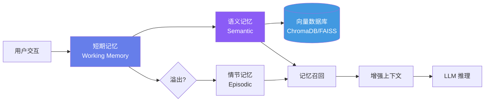
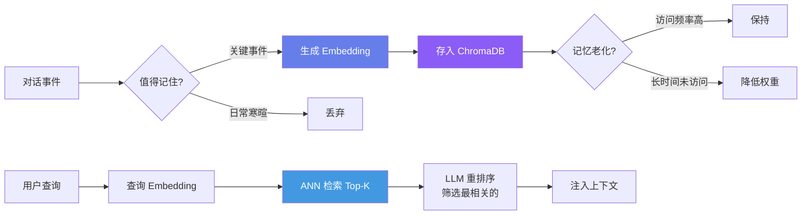

## 引言

前三篇的 Agent 有一个根本局限：**每次关闭后，它忘记了你的一切**——你的偏好、之前的对话内容、你告诉它的重要信息。一个真正有用的 Agent 需要记忆。

人类记忆是分层的：工作记忆（当前在想什么）、情节记忆（昨天发生了什么）、语义记忆（知道巴黎是法国首都）、程序记忆（知道怎么骑自行车）。我们将为 Agent 构建对应的四层记忆系统。



---

## 四层记忆模型

| 层级 | 人类类比 | Agent 实现 | 生命周期 | 容量 |
|------|---------|-----------|---------|------|
| **工作记忆** | 当前思考内容 | Messages 数组（第 3 篇） | 单次对话 | ~10K tokens |
| **情节记忆** | 昨天的事件 | 对话摘要 + 时间戳 | 跨会话 | 无限制 |
| **语义记忆** | 知识/概念 | 向量检索 (RAG) | 持久化 | 无限制 |
| **程序记忆** | 技能/习惯 | System Prompt + Skills | 持久化 | 固定 |

前两篇已覆盖工作记忆管理。本篇聚焦于**情节记忆和语义记忆**的实现。

---

## Embedding：文本到向量的映射

### 嵌入空间的几何直觉

Embedding 模型将文本映射到一个高维向量空间 \\(\\mathbb{R}^d\\)（通常 \\(d = 1536\\) 或 \\(3072\\)），使得语义相似的文本在空间中靠近：

```
                    语义空间中的"靠近"
                    ═══════════════

  "今天天气真好"  •                       • "机器学习模型训练"
                                          (远)
        • "阳光明媚适合郊游"
        (近 — 语义相似)
```

### Embedding 的形式化定义

**定义 1（文本嵌入）**：一个嵌入模型是一个函数 \\(E: \\mathcal{V}^* \\to \\mathbb{R}^d\\)，将任意长度的文本序列映射为一个固定维度的稠密向量：

\\[
\\mathbf{v} = E(\\text{text}) \\in \\mathbb{R}^d
\\]

理想的嵌入满足：语义相似度 \\(\\approx\\) 空间邻近度：

\\[
\\text{sim}(\\text{text}_1, \\text{text}_2) \\approx \\cos(\\mathbf{v}_1, \\mathbf{v}_2) = \\frac{\\mathbf{v}_1 \\cdot \\mathbf{v}_2}{\\|\\mathbf{v}_1\\| \\cdot \\|\\mathbf{v}_2\\|}
\\]

### 余弦相似度与内积的等价性

当所有向量被归一化（\\(\\|\\mathbf{v}\\| = 1\\)）时：

\\[
\\cos(\\mathbf{v}_1, \\mathbf{v}_2) = \\mathbf{v}_1 \\cdot \\mathbf{v}_2 \\quad (\\text{因为 } \\|\\mathbf{v}_1\\| = \\|\\mathbf{v}_2\\| = 1)
\\]

OpenAI 和大多数 embedding API 返回的向量已经 L2 归一化，因此**向量内积直接等于余弦相似度**。这极大简化了检索：只需计算查询向量与库中向量的内积，取 Top-K。

### Embedding 模型的选择

| 模型 | 维度 | 适合场景 | 成本 |
|------|------|---------|------|
| OpenAI `text-embedding-3-small` | 512/1536 | 通用中文/英文 | $0.02/1M tokens |
| OpenAI `text-embedding-3-large` | 256/1024/3072 | 高精度需求 | $0.13/1M tokens |
| BGE-M3 (BAAI) | 1024 | 多语言/长文本(8K) | 免费(本地) |
| Jina Embeddings v3 | 1024 | 任务特定嵌入 | 有免费额度 |

---

## 语义记忆的实现

### 完整代码

```python
import json
import time
from openai import OpenAI
import chromadb
from chromadb.config import Settings

class SemanticMemory:
    """基于向量检索的语义记忆系统"""

    def __init__(self, persist_dir: str = "./agent_memory"):
        self.client = OpenAI()
        self.chroma = chromadb.PersistentClient(
            path=persist_dir,
            settings=Settings(anonymized_telemetry=False)
        )
        self.collection = self.chroma.get_or_create_collection(
            name="agent_memories",
            metadata={"hnsw:space": "cosine"}  # 使用余弦距离
        )

    def remember(self, content: str, memory_type: str = "fact",
                 metadata: dict = None) -> str:
        """
        存入一条记忆。

        Args:
            content: 记忆内容文本
            memory_type: 类型 (fact/preference/event/lesson)
            metadata: 额外元数据（时间戳、来源等）
        Returns:
            记忆 ID
        """
        # 1. 生成 embedding
        embedding = self._embed(content)

        # 2. 存储到向量数据库
        mem_id = f"mem_{int(time.time() * 1000)}"
        self.collection.add(
            ids=[mem_id],
            embeddings=[embedding],
            documents=[content],
            metadatas=[{
                "type": memory_type,
                "timestamp": time.time(),
                **(metadata or {})
            }]
        )
        return mem_id

    def recall(self, query: str, n_results: int = 5,
               memory_type: str = None) -> list[dict]:
        """
        检索相关记忆。

        Args:
            query: 查询文本（用自然语言描述你想找什么）
            n_results: 返回结果数
            memory_type: 过滤记忆类型
        Returns:
            相关记忆列表 [{"content": ..., "score": ..., "metadata": ...}]
        """
        query_embedding = self._embed(query)

        # 构建过滤条件
        where = {"type": memory_type} if memory_type else None

        results = self.collection.query(
            query_embeddings=[query_embedding],
            n_results=n_results,
            where=where,
            include=["documents", "metadatas", "distances"]
        )

        memories = []
        for i, doc in enumerate(results["documents"][0]):
            memories.append({
                "content": doc,
                "distance": results["distances"][0][i],
                "similarity": 1 - results["distances"][0][i],  # cosine → similarity
                "metadata": results["metadatas"][0][i]
            })
        return memories

    def _embed(self, text: str) -> list[float]:
        """调用 embedding API 生成向量"""
        response = self.client.embeddings.create(
            model="text-embedding-3-small",
            input=text,
            dimensions=512  # 降维节省空间和加速检索
        )
        return response.data[0].embedding

    def forget(self, memory_id: str) -> None:
        """删除一条记忆"""
        self.collection.delete(ids=[memory_id])

    def get_stats(self) -> dict:
        """获取记忆统计"""
        all_items = self.collection.get(include=["metadatas"])
        types = {}
        for meta in all_items["metadatas"]:
            t = meta.get("type", "unknown")
            types[t] = types.get(t, 0) + 1
        return {
            "total_memories": len(all_items["ids"]),
            "by_type": types
        }


# ── 使用示例 ──
mem = SemanticMemory("./my_agent_memory")

# 存入记忆
mem.remember("用户杨钱俊是医疗机器人算法工程师，关注医学图像处理",
             memory_type="fact")
mem.remember("用户偏好使用 Python 和 PyTorch，不喜欢 TensorFlow",
             memory_type="preference")
mem.remember("上周用户在研究 nnU-Net 分割模型，遇到数据预处理问题",
             memory_type="event")

# 召回记忆
results = mem.recall("用户对深度学习的偏好")
for r in results:
    print(f"[{r['metadata']['type']}] {r['content']} "
          f"(相似度: {r['similarity']:.3f})")

# 过滤特定类型
facts = mem.recall("用户背景", memory_type="fact")
```

### 记忆的生命周期管理



---

## 近似最近邻搜索的数学原理

### 为什么需要 ANN？

暴力搜索的复杂度为 \\(O(N \\cdot d)\\)，其中 \\(N\\) 是记忆条数，\\(d\\) 是向量维度。当 \\(N = 10^6, d = 512\\) 时，单次查询需要 5.12 亿次浮点运算。这对于实时对话是不可接受的。

近似最近邻（ANN）将复杂度降低到 \\(O(\\log N)\\)。

### HNSW 算法原理（ChromaDB 底层）

**Hierarchical Navigable Small World (HNSW)** 是 ChromaDB 使用的索引算法 <cite>[4]</cite>。

**算法直觉**：类似跳表（Skip List）——在不同"粒度"层级上建立图索引，搜索时从高层（粗粒度）逐步下降到低层（细粒度）。

```
层级 2 (最粗):   •───────•           ← 长距离跳跃
                  │               │
层级 1:       •───•───•───•───•   ← 中等距离
              │   │   │   │   │
层级 0 (最细): •─•─•─•─•─•─•─•─•  ← 精确搜索
              ↑
            入口点
```

**算法 1（HNSW 搜索）**：
1. 从最高层的入口点开始
2. 在当前层执行贪心搜索（每次移动到最近邻的未访问节点）
3. 到达局部最优后，下降到下一层
4. 在最底层（层级 0）执行最终的精搜索
5. 返回 Top-K 结果

**复杂度分析**：

\\[
O(\\log N \\cdot M)
\\]

其中 \\(M\\) 是每层每个节点的最大连接数（通常 \\(M = 16\\)），与 \\(\\log N\\) 相乘后远小于暴力搜索的 \\(O(N \\cdot d)\\)。

### 召回率 vs 速度权衡

ChromaDB/HNSW 的核心参数 `ef_search` 控制搜索广度：

| ef_search | 召回率 | 速度 | 适用 |
|-----------|--------|------|------|
| 10 | ~85% | 极快 | 实时对话 |
| 50 | ~95% | 快 | 一般使用 |
| 200 | ~99% | 中等 | 高精度需求 |
| 500 | ~99.5% | 慢 | 离线分析 |

```python
# 创建 collection 时设置
self.collection = self.chroma.get_or_create_collection(
    name="agent_memories",
    metadata={
        "hnsw:space": "cosine",
        "hnsw:M": 16,               # 每层连接数
        "hnsw:construction_ef": 100, # 构建时的搜索广度
        "hnsw:search_ef": 50        # 查询时的搜索广度
    }
)
```

---

## 情节记忆：事件的时序存储

语义记忆回答"用户喜欢什么"，情节记忆回答"昨天发生了什么"。

### 实现

```python
import sqlite3
import json

class EpisodicMemory:
    """基于 SQLite 的情节记忆系统"""

    def __init__(self, db_path: str = "./agent_memory/episodes.db"):
        self.conn = sqlite3.connect(db_path)
        self.conn.execute("""
            CREATE TABLE IF NOT EXISTS episodes (
                id INTEGER PRIMARY KEY AUTOINCREMENT,
                session_id TEXT,
                timestamp REAL,
                summary TEXT,
                importance REAL DEFAULT 0.5,
                tags TEXT DEFAULT '[]'
            )
        """)
        self.conn.execute("""
            CREATE VIRTUAL TABLE IF NOT EXISTS episodes_fts
            USING fts5(summary, content='episodes',
                       content_rowid='id')
        """)
        self.conn.commit()

    def record(self, session_id: str, summary: str,
               importance: float = 0.5, tags: list[str] = None) -> int:
        """记录一段对话的情节"""
        cursor = self.conn.execute(
            "INSERT INTO episodes (session_id, timestamp, summary, "
            "importance, tags) VALUES (?, ?, ?, ?, ?)",
            (session_id, time.time(), summary, importance,
             json.dumps(tags or []))
        )
        self.conn.commit()
        return cursor.lastrowid

    def recall_recent(self, n: int = 10) -> list[dict]:
        """回忆最近的情节"""
        cursor = self.conn.execute(
            "SELECT * FROM episodes ORDER BY timestamp DESC LIMIT ?", (n,)
        )
        return [self._row_to_dict(r) for r in cursor.fetchall()]

    def search(self, query: str, limit: int = 5) -> list[dict]:
        """FTS5 全文检索情节"""
        cursor = self.conn.execute(
            "SELECT e.* FROM episodes e "
            "JOIN episodes_fts ef ON e.id = ef.rowid "
            "WHERE episodes_fts MATCH ? "
            "ORDER BY e.importance * e.timestamp DESC LIMIT ?",
            (query, limit)
        )
        return [self._row_to_dict(r) for r in cursor.fetchall()]

    def _row_to_dict(self, row) -> dict:
        return {
            "id": row[0], "session_id": row[1],
            "timestamp": row[2], "summary": row[3],
            "importance": row[4], "tags": json.loads(row[5])
        }
```

### 自动情节提取

关键设计：**Agent 在对话结束时自动总结情节**：

```python
def auto_extract_episode(agent, conversation_text: str) -> str:
    """让 LLM 自动判断对话中值得记住的信息"""
    response = agent.client.chat.completions.create(
        model="gpt-4o-mini",
        messages=[{
            "role": "system",
            "content": (
                "你是记忆提取器。从以下对话中提取值得记住的信息。"
                "输出格式：每条一行，开头为类型标签 [fact]/[preference]/[event]/[task]。"
                "只提取有长期价值的信息，忽略日常寒暄。"
            )
        }, {
            "role": "user",
            "content": conversation_text
        }],
        temperature=0.1
    )
    return response.choices[0].message.content
```

---

## 统一记忆接口

将语义记忆和情节记忆封装为统一接口：

```python
class AgentMemory:
    """Agent 的统一记忆系统"""

    def __init__(self, persist_dir: str = "./agent_memory"):
        self.semantic = SemanticMemory(f"{persist_dir}/semantic")
        self.episodic = EpisodicMemory(f"{persist_dir}/episodes.db")

    def remember(self, content: str, memory_type: str = "fact",
                 importance: float = 0.5) -> str:
        """存一条记忆，自动路由到合适存储"""
        if memory_type in ("fact", "preference", "lesson"):
            return self.semantic.remember(content, memory_type)

        if memory_type in ("event", "session"):
            # 全文索引用于精确搜索
            self.episodic.record(
                session_id=f"sess_{int(time.time())}",
                summary=content,
                importance=importance
            )
            return "episodic_recorded"

        # 默认：同时存储
        mem_id = self.semantic.remember(content, memory_type)
        self.episodic.record(
            session_id=f"sess_{int(time.time())}",
            summary=content,
            importance=importance
        )
        return mem_id

    def recall(self, query: str, n_results: int = 5) -> list[dict]:
        """统一召回：同时搜索语义和情节记忆"""
        semantic_results = self.semantic.recall(query, n_results)
        episodic_results = self.episodic.search(query, n_results)

        # 合并去重、按相关性排序
        all_results = semantic_results + episodic_results
        all_results.sort(key=lambda x: x.get("similarity",
                            x.get("importance", 0)), reverse=True)
        return all_results[:n_results]

    def build_context_prompt(self, query: str) -> str:
        """构建注入 LLM 的记忆上下文"""
        memories = self.recall(query)
        if not memories:
            return ""

        lines = ["## 相关记忆\n"]
        for m in memories:
            lines.append(f"- [{m.get('metadata', {}).get('type', 'memory')}] "
                        f"{m['content']}")
        return "\n".join(lines)
```

---

## 与 Agent 的集成

```python
class MemoryAwareAgent:
    def __init__(self, system_prompt: str, registry: ToolRegistry,
                 persist_dir: str = "./agent_memory"):
        self.client = OpenAI()
        self.registry = registry
        self.memory = AgentMemory(persist_dir)
        self.max_iter = 10

        # 核心：system prompt 注入记忆
        self.base_system_prompt = system_prompt

    def _build_system_prompt(self, user_query: str) -> str:
        """构建包含记忆上下文的 system prompt"""
        memory_context = self.memory.build_context_prompt(user_query)
        if memory_context:
            return (f"{self.base_system_prompt}\n\n"
                    f"{memory_context}\n\n"
                    f"请参考以上记忆来个性化你的回复。")
        return self.base_system_prompt

    def run(self, user_query: str) -> str:
        system_prompt = self._build_system_prompt(user_query)
        messages = [
            {"role": "system", "content": system_prompt},
            {"role": "user", "content": user_query}
        ]
        schemas = self.registry.get_schemas()

        conversation_log = [f"[user]: {user_query}"]

        for _ in range(self.max_iter):
            response = self.client.chat.completions.create(
                model="gpt-4o",
                messages=messages,
                tools=schemas if schemas else None
            )
            msg = response.choices[0].message

            if msg.tool_calls:
                for tc in msg.tool_calls:
                    fn_args = json.loads(tc.function.arguments)
                    result = self.registry.execute(tc.function.name, fn_args)
                    messages.append({"role": "assistant",
                                     "content": None, "tool_calls": [tc]})
                    messages.append({"role": "tool",
                                     "tool_call_id": tc.id, "content": result})
                    conversation_log.append(
                        f"[tool:{tc.function.name}]: {result[:200]}")
            else:
                final = msg.content or ""
                conversation_log.append(f"[assistant]: {final[:200]}")

                # 自动提取并保存记忆
                self._auto_memorize("\n".join(conversation_log))
                return final

        return "达到最大迭代次数。"

    def _auto_memorize(self, conversation_text: str) -> None:
        """对话结束后自动提取有价值的信息"""
        # 使用便宜模型提取记忆
        response = self.client.chat.completions.create(
            model="gpt-4o-mini",
            messages=[{
                "role": "system",
                "content": (
                    "从对话中提取值得长期记住的信息。每行一条，格式："
                    "'类型 | 内容'。类型: fact/preference/event。"
                    "只提取有长期价值的信息。如无有价值信息则回复 'NONE'。"
                )
            }, {
                "role": "user",
                "content": conversation_text
            }],
            temperature=0.1
        )
        extracted = response.choices[0].message.content
        if extracted and extracted.strip() != "NONE":
            for line in extracted.strip().split("\n"):
                if "|" in line:
                    mem_type, content = line.split("|", 1)
                    self.memory.remember(
                        content.strip(),
                        memory_type=mem_type.strip()
                    )
```

---

## 记忆检索的精度分析

### RAG 检索质量公式

设记忆库中有 \\(N\\) 条记忆，其中 \\(R\\) 条与当前查询相关。检索系统返回 \\(K\\) 条结果，其中 \\(r\\) 条是真正相关的。则：

\\[
\\text{Precision}@K = \\frac{r}{K}, \\quad \\text{Recall}@K = \\frac{r}{R}
\\]

**定理 1（检索精度下界）**：设查询向量与相关记忆的期望余弦相似度为 \\(\\bar{s}_{rel}\\)，与不相关记忆的期望相似度为 \\(\\bar{s}_{irr}\\)。则 Recall@K 的经验下界为：

\\[
\\text{Recall}@K \\geq 1 - \\frac{N - R}{N} \\cdot \\exp\\left(-\\lambda \\cdot (\\bar{s}_{rel} - \\bar{s}_{irr})\\right)
\\]

其中 \\(\\lambda\\) 是嵌入模型的分辨率参数。

**实践意义**：
- \\(\\bar{s}_{rel} - \\bar{s}_{irr}\\) 越大（嵌入模型越好分辩），检索质量越高
- \\(R / N\\) 越小（相关记忆越稀有），检索越具挑战性
- 记忆超过 10,000 条时，需考虑混合检索（向量 + 关键词）

### 混合检索策略

```python
def hybrid_search(query: str, alpha: float = 0.7) -> list[dict]:
    """结合向量检索（alpha）和关键词检索（1-alpha）"""
    vector_results = memory.semantic.recall(query, n_results=10)
    keyword_results = memory.episodic.search(query, limit=10)

    # 分数融合
    combined = {}
    for r in vector_results:
        combined[r["content"]] = alpha * r["similarity"]

    for r in keyword_results:
        kw_score = (1 - alpha) * r.get("importance", 0.5)
        if r["content"] in combined:
            combined[r["content"]] += kw_score
        else:
            combined[r["content"]] = kw_score

    sorted_items = sorted(combined.items(),
                         key=lambda x: x[1], reverse=True)
    return [{"content": c, "score": s} for c, s in sorted_items]
```

---

## 本章小结

本文构建了 Agent 的四层记忆系统：

1. **工作记忆**（第 3 篇）：Messages 数组，~10K tokens
2. **情节记忆**（本篇）：SQLite + FTS5，存储对话摘要 + 全文检索
3. **语义记忆**（本篇）：向量数据库 (ChromaDB/HNSW)，跨会话知识持久化
4. **自动记忆提取**：用便宜模型在对话结束后自动总结有价值信息

**关键数学结果**：
- 余弦相似度 = 归一化向量的内积
- HNSW 将检索复杂度从 \\(O(N \\cdot d)\\) 降至 \\(O(\\log N \\cdot M)\\)
- Recall@K 随嵌入模型的区分度（\\(\\bar{s}_{rel} - \\bar{s}_{irr}\\)）指数提升

**下一篇预告**：多 Agent 协作——超越单 Agent 的局限，实现并行执行、审查-修正循环和角色分工。

---

## 参考文献

<ol class="references">
<li><em>OpenAI. "Embeddings Guide."</em> OpenAI Platform Documentation, 2024.<br><a href="https://platform.openai.com/docs/guides/embeddings">https://platform.openai.com/docs/guides/embeddings</a></li>
<li><em>Malkov, Y. A., Yashunin, D. "Efficient and robust approximate nearest neighbor search using Hierarchical Navigable Small World graphs."</em> IEEE TPAMI 2018.<br><a href="https://arxiv.org/abs/1603.09320">https://arxiv.org/abs/1603.09320</a></li>
<li><em>ChromaDB. "Chroma — the open-source embedding database."</em> GitHub, 2024.<br><a href="https://github.com/chroma-core/chroma">https://github.com/chroma-core/chroma</a></li>
<li><em>Packer, C., et al. "MemGPT: Towards LLMs as Operating Systems."</em> arXiv 2023.<br><a href="https://arxiv.org/abs/2310.08560">https://arxiv.org/abs/2310.08560</a></li>
<li><em>Lewis, P., et al. "Retrieval-Augmented Generation for Knowledge-Intensive NLP Tasks."</em> NeurIPS 2020.<br><a href="https://arxiv.org/abs/2005.11401">https://arxiv.org/abs/2005.11401</a></li>
<li><em>BAAI. "BGE-M3: Multi-Lingual, Multi-Granularity, Multi-Functionality Embedding Model."</em> arXiv 2024.<br><a href="https://arxiv.org/abs/2402.03216">https://arxiv.org/abs/2402.03216</a></li>
<li><em>Johnson, J., Douze, M., Jégou, H. "Billion-scale similarity search with GPUs."</em> IEEE TBD 2019. (FAISS)<br><a href="https://arxiv.org/abs/1702.08734">https://arxiv.org/abs/1702.08734</a></li>
<li><em>OpenAI. "New embedding models and API updates."</em> OpenAI Blog, Jan 2024.<br><a href="https://openai.com/index/new-embedding-models-and-api-updates/">https://openai.com/index/new-embedding-models-and-api-updates/</a></li>
</ol>
