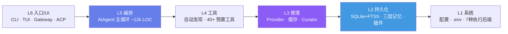
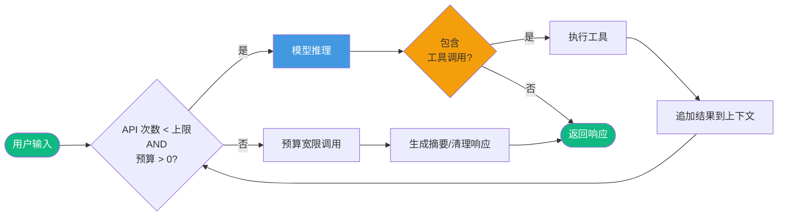
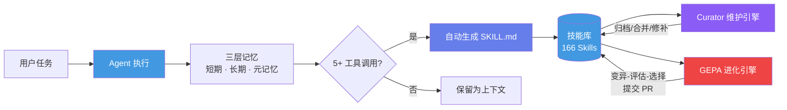
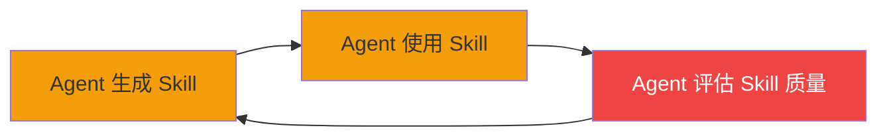

## 引言

2026 年 2 月 25 日，Nous Research 发布了 **Hermes Agent**——一个开源的自进化 AI 智能体框架。此后 7 周内，它获得了超过 **105,000 GitHub Stars**，增速超过 LangChain 和 AutoGPT 在同一发布窗口内的总和 <cite>[1]</cite>。截至 2026 年 5 月，最新版本 v0.13.0 已拥有 500+ 贡献者、20 个消息平台接入、7 种执行后端，以及一项被 ICLR 2026 接收为 Oral 论文的核心算法——**GEPA（Genetic-Pareto Prompt Evolution）**<cite>[2]</cite>。

然而，Hermes Agent 的崛起同样伴随着争议：来自中国团队 EvoMap 的抄袭指控、Skill 架构中"自信任问题"的结构性缺陷，以及 AI 时代开源代码"架构级洗稿"的行业性讨论 <cite>[3]</cite>。

本文基于一手资料（GitHub 仓库、学术论文、社区技术分析），系统解析 Hermes Agent 的架构设计、自进化机制和工程争议。

> **信息来源说明**：本文数据来源于 GitHub 公开仓库、arXiv 学术论文、社区技术分析及官方文档。Stars 数、版本号等数据截至 2026 年 5 月。

---

## 一、Hermes Agent 是什么

### 1.1 定位

Hermes Agent 是一个**开源的自进化 AI 智能体框架**，由 Nous Research（联合创始人 teknium1 主导）开发，MIT 协议发布 <cite>[1]</cite>。其设计宣言是 "The agent that grows with you"——不是一个被动的工具执行器，而是一个会从每次交互中学习的长期伴侣。

```
Hermes Agent 设计哲学：

  "循环要简单，扩展要解耦，记忆要工程化"

  ┌─────────────────────────────────────────────┐
  │  简单核（同步 while + 预算）                    │
  │  → 可控、可中断、可调试                         │
  ├─────────────────────────────────────────────┤
  │  插件化扩展（plugin 优先于改 core）              │
  │  → 核心稳定，生态灵活                           │
  ├─────────────────────────────────────────────┤
  │  工程化记忆（SQLite + FTS5 + Curator）         │
  │  → 长期成长，经验沉淀                           │
  └─────────────────────────────────────────────┘
```

### 1.2 增长轨迹

| 时间节点 | Stars | 里程碑 |
|----------|-------|--------|
| 2026-02-25 | 0 | 首次公开发布 |
| 2026-03 中 | ~48,000 | 安全加固、多平台支持 |
| 2026-04-08 | ~47,000+ | v0.8.0 GEPA 自进化引擎发布 |
| 2026-04-17 | ~95,600 | 突破 10 万 Star |
| 2026-05-07 | ~142,000+ | v0.13.0 Tenacity Release |

> **GitHub 仓库**：[NousResearch/hermes-agent](https://github.com/NousResearch/hermes-agent) — 自进化 AI 智能体框架，MIT 协议。

---

## 二、六层架构解析

Hermes 采用**六层分层架构**，自底向上从系统配置到用户界面逐层抽象 <cite>[4]</cite>：



### 2.1 各层职责

| 层级 | 组件 | 职责 |
|------|------|------|
| **L6** | CLI / TUI / Gateway / ACP | 用户入口：命令行、终端 UI、20+ IM 平台、IDE 集成 |
| **L5** | `AIAgent` 主循环 | 同步对话循环，约 12,000 行核心编排逻辑 |
| **L4** | `tools/registry.py` | 工具自动发现与注册，内置 40+ 预置工具 |
| **L3** | `agent/` 推理模块 | 多供应商抽象、上下文压缩、Curator 后台进化 |
| **L2** | `hermes_state.py` | SQLite + FTS5 全文搜索、三层记忆系统 |
| **L1** | 配置文件 | 7 种执行环境（本地/Docker/SSH/Modal/Daytona/Singularity/Vercel） |

---

## 三、核心 Agent 循环：简单、同步、预算驱动

Hermes 的核心循环不是复杂的 DAG 引擎，而是一个**同步 `while` 循环**——这是其最重要的架构决策之一 <cite>[4]</cite>。

### 3.1 循环伪代码

```python
while (api_call_count < max_iterations and iteration_budget.remaining > 0):
    response = client.chat.completions.create(
        model=model,
        messages=messages,
        tools=tool_schemas
    )
    if response.tool_calls:
        for tool_call in response.tool_calls:
            result = handle_function_call(tool_call.name, tool_call.args)
            messages.append(tool_result_message(result))
    else:
        return response.content
```

### 3.2 设计原则



**核心设计要点** <cite>[4]</cite>：

- **同步核心，异步仅用于 I/O 边界**：核心循环是同步的（`while` 而非 `async while`），异步只在流式响应和 Gateway 层面使用。这避免了 async/await 调试的复杂性。
- **预算驱动而非步数驱动**：`max_iterations`（默认 90）是硬上限，但 `iteration_budget` 是软调控器——按 Token 消耗和工具调用复杂度动态计算剩余预算。
- **Grace Call**：预算耗尽前触发 `_budget_grace_call`，给予 Agent 最后一次推理机会以生成摘要或清理响应。
- **可中断**：每轮迭代检查 `_interrupt_requested` 标志，`Ctrl+C` 或 `/stop` 命令可立即暂停 Agent。

---

## 四、自学习三位一体

这是 Hermes 最具区分度的架构创新——一个**闭环学习系统**，由三层联动机制构成 <cite>[4][5]</cite>。



### 4.1 三层记忆系统

| 记忆类型 | 存储方式 | 生命周期 | 用途 |
|----------|----------|----------|------|
| **短期记忆** | 向量缓存 + 上下文窗口 | 单次会话 | 当前对话历史、工具调用结果 |
| **长期记忆** | SQLite + FTS5 全文搜索 | 跨会话持久化 | 历史交互摘要、用户偏好、项目知识 |
| **元记忆** | 学习过程记录 | 持续累积 | 记录"学到了什么"和"为什么这样学" |

`MEMORY.md`（约 800 tokens）记录项目环境、常见陷阱和关键约定；`USER.md`（约 500 tokens）存储用户画像——习惯、语言偏好、详细程度要求 <cite>[4]</cite>。

### 4.2 自动技能生成

当 Agent 完成一个涉及 5 个以上工具调用的复杂任务后，它会**自动创建** `SKILL.md` 文件 <cite>[4][5]</cite>。每个 Skill 包含：

- **触发条件**：什么场景下应该激活该技能
- **分步流程**：具体执行步骤
- **已知陷阱与修复方案**：从失败中提炼的经验

技能采用**渐进式披露**：Agent 首先只看到技能索引（低 Token 开销），仅在任务匹配时加载完整内容。技能在使用过程中发现过时或错误后**自我修补**。Hermes 兼容 `agentskills.io` 开放标准——技能可在不同框架间共享 <cite>[5]</cite>。

当前技能库：**166 个追踪技能**（87 内置 + 79 可选），覆盖 26+ 类别 <cite>[1]</cite>。

### 4.3 Curator — 后台自进化引擎

`agent/curator.py`（约 75KB）是 Hermes 的"园丁"，在 Agent 空闲时后台运行 <cite>[4]</cite>：

- 定期触发（`interval_hours` 可配置）
- 仅在空闲窗口运行，避免打断用户会话
- 自动归档过期技能（`stale_after_days`）
- 合并重叠技能，输出每次运行的审计报告

---

## 五、GEPA：遗传-帕累托提示进化

### 5.1 论文概览

GEPA 是 Hermes 自进化能力的学术基础，被 ICLR 2026 接收为 **Oral** 论文（最高等级录用）<cite>[2]</cite>。

> **论文卡片**
>
> **标题**：GEPA: Genetic-Pareto Prompt Evolution for Self-Improving AI Agents
> **作者**：Nous Research (teknium1 et al.)
> **发表**：arXiv:2507.19457, ICLR 2026 Oral
> **项目**：[hermes-agent-self-evolution](https://github.com/NousResearch/hermes-agent-self-evolution)

### 5.2 核心机制

GEPA 的核心思想是：**让模型阅读自己的完整执行轨迹，用自然语言反思失败原因，而非仅接受"成功/失败"的标量信号** <cite>[2]</cite>。


### 5.3 关键实验结果

| 指标 | GEPA 表现 |
|------|----------|
| vs GRPO（强化学习） | 平均高出 **6%**，最大差距 **20 个百分点** |
| 所需数据量 | 仅为 GRPO 的 **1/35** |
| vs MIPROv2（AIME-2025 数学） | 高出 **12%** |
| 每次优化成本 | 约 **$2–$10**（纯 API 调用，无需 GPU） |
| 进化阶段 | 5 阶段（Phase 1 SKILL.md → Phase 5 持续自动化流水线） |

GEPA 的关键突破在于：**不需要 GPU 训练**。它使用 API 调用进行变异和评估，使得小型团队和个人开发者也能负担自进化能力 <cite>[2]</cite>。

---

## 六、Provider 抽象与执行后端

### 6.1 可插拔 Transport ABC

v0.11.0 引入了基于抽象基类的 Transport 架构，所有消息归一化为 OpenAI 格式 <cite>[1]</cite>：

| Transport | 用途 |
|-----------|------|
| `AnthropicTransport` | 原生 Anthropic Messages API |
| `ChatCompletionsTransport` | OpenAI 兼容供应商 |
| `ResponsesApiTransport` | OpenAI Responses API + Codex |
| `BedrockTransport` | AWS Bedrock Converse API |

支持 20+ 模型供应商：Nous Portal（400+ 模型）、OpenAI、Anthropic、AWS Bedrock、Google Gemini、DeepSeek、Kimi、GLM、MiniMax、Ollama、HuggingFace、xAI Grok、NVIDIA NIM 等 <cite>[1]</cite>。

### 6.2 七种执行后端

| 后端 | 适用场景 |
|------|----------|
| **Local** | 直接 Shell 执行 |
| **Docker** | 容器隔离 |
| **SSH** | 远程主机 |
| **Modal** | 无服务器 GPU，空闲休眠，近乎零成本 |
| **Daytona** | 无服务器持久化沙箱 |
| **Singularity** | HPC 容器 |
| **Vercel Sandbox** | 边缘运行时 |

架构设计目标之一是**在 $5/月的 VPS 上运行**——将重推理负载外移到云 API <cite>[4]</cite>。

---

## 七、EvoMap 抄袭争议

### 7.1 事件时间线

2026 年 4 月 15 日，中国 AI 团队 **EvoMap** 公开指控 Hermes Agent 系统性抄袭了其开源自进化智能体引擎 **Evolver** <cite>[3]</cite>。

| 日期 | 事件 |
|------|------|
| 2025-07-22 | Hermes Agent 立项，初始提交（无自进化能力） |
| 2026-01-31 | Evolver 确立自进化范式，发布 PCEC 循环 |
| **2026-02-01** | **Evolver 正式开源**（ClawHub 10 分钟登顶热门） |
| 2026-02-18 起 | Hermes 密集引入安全门控、三层记忆、技能管理等 |
| 2026-03-06 | Hermes 将定位改为"自进化 AI 智能体" |
| **2026-04-15** | **EvoMap 公开指控抄袭** |

### 7.2 三大核心指控

1. **10 步主循环一一对应**：两个项目的核心进化循环在 10 个步骤上完全对齐，仅用不同编程语言实现（Node.js vs Python）<cite>[3]</cite>。

2. **12 组术语系统性替换**：Gene→SKILL.md、Capsule→技能执行记录、solidify→skill_manage(create)、memoryGraph→MEMORY.md——概念一一对应但术语全部替换 <cite>[3]</cite>。

3. **7 份公开材料零引用**：Hermes 引用了 GEPA/DSPy 等学术工作，但对先行开源的 Evolver 没有任何提及或致谢 <cite>[3]</cite>。

### 7.3 Nous Research 的回应

- 官方账号首次回应：「我们仓库 2025 年 7 月就有了。我们是'先驱'。删除你们的账号。」随后删除并拉黑 <cite>[3]</cite>。
- 联合创始人 Teknium：声称从未听说过 EvoMap，否认抄袭 <cite>[3]</cite>。
- 业务负责人 Tommy Eastman（B站直播）：「代码仓库已经存在一年多了。直到那些推文出现，我才听说 EvoMap。」<cite>[3]</cite>。

EvoMap 反驳指出：Hermes 主仓库在 2026 年 2 月 25 日前一直是**私有项目**，自进化模块到 3 月才推出 <cite>[3]</cite>。此后 EvoMap 将协议从 MIT 变更为 GPL-3.0 并改为混淆发布。

> 此事件不是孤例。2026 年出现了多起类似争议：美团 Tabbit vs 陪读蛙、微软 Peerd vs Spegel、Cursor Composer 2 套壳 Kimi K2.5 等，反映出 AI 时代"架构级洗稿"已成为行业性问题。

---

## 八、自信任问题：Skill 架构的结构性缺陷

尽管 Hermes Agent 的自进化 Skill 循环是一个真正的架构创新，但社区技术分析揭示了其面临的结构性挑战 <cite>[6]</cite>。

### 8.1 核心矛盾

Hermes 的技能闭环中存在一个根本问题：**Agent 同时是技能的作者、执行者和质量裁判**。这种自说自话的机制不是在复合质量，而是在复合自信——这两者有本质区别 <cite>[6]</cite>。



### 8.2 五大具体张力

| 问题 | 描述 | 严重度 |
|------|------|--------|
| **瞬态失败固化** | 网络超时等临时失败被固化为"此工具不可用"的 Skill，Agent 逐渐回避只是暂时失败过的工具 | 高 |
| **无法分类自身失败** | 90 轮硬上限熔断器在前，但 Agent 不识别失败模式，不断重试相同序列直到被截断 | 高 |
| **Skill 缺乏时效性** | 无 `last_verified_at`、`success_rate` 等字段。API 已弃用但 Skill 仍自信指向失效 endpoint | 中 |
| **用户策略被覆盖** | Honcho 辩证引擎将用户显式硬约束（如"永远不用 Python 3.9"）重新归类为软偏好 | 中 |
| **GEPA 静默失败** | 特定配置下 GEPA 退化为 MIPROv2，约束验证器误报阻塞流水线 | 低 |

### 8.3 被低估的贡献：可验证知识持久化

公平地讲，Hermes 有一个被低估的重要贡献：**Skill 是磁盘上的 Markdown 文件**——可读、可编辑、可版本对比。Curator 做出决策时产出可审计的理由。这与权重层面的学习（模型微调）有根本性不同：你无法打开文件去读神经网络从某个任务中学到了什么 <cite>[6]</cite>。

当前缺口不在于系统缺乏洞察自身行为的能力，而在于**验证基础设施没有跟上生成基础设施**。

---

## 九、对开发者的启示

### 9.1 Agent 自进化的本质

Hermes 和 GEPA 的核心启示是：**自进化 Agent 不需要 GPU 集群**。GEPA 每次运行仅需 $2–$10，通过自然语言反思和遗传搜索，在 1/35 的数据量下超越了强化学习方法 <cite>[2]</cite>。这意味着小型团队也有能力构建持续改进的 Agent 系统。

### 9.2 验证比生成更重要

自进化系统的瓶颈不在于"能不能自动写 Skill"，而在于"能不能验证 Skill 的可靠性"。当前 GEPA 的 pytest 验证只能检查功能正确性，无法判断语义适用性和长期一致性 <cite>[6]</cite>。构建自进化系统时，**验证基础设施的投入应不低于生成基础设施**。

### 9.3 架构简洁性的价值

Hermes 的核心循环是一个同步 `while` 循环，而非复杂的图引擎。这种**拒绝不必要的异步抽象**的设计决策，使得核心路径可预测、可调试、可中断——这些特性在长期自主运行中比性能优势更重要 <cite>[4]</cite>。

---

## 十、总结

Hermes Agent 代表了 2026 年 AI Agent 从"工具链组合"向"自主进化系统"的范式转变，但这一转变既带来了真正的创新，也暴露了新的挑战。

**核心要点**：

- **六层架构**实现了从系统配置到用户界面的清晰分层，核心循环保持同步 `while` + 预算驱动的简洁设计
- **自学习三位一体**（三层记忆 / 自动 Skill 生成 / Curator 后台维护）构成了闭环学习系统，166 个追踪技能覆盖 26+ 类别
- **GEPA** 以 $2–$10 的成本、1/35 的数据量实现超越 GRPO 的自进化能力，被 ICLR 2026 接收为 Oral 论文
- **EvoMap 抄袭争议**反映了 AI 时代"架构级洗稿"的行业性问题，也揭示了开源代码在快速迭代中的归属困境
- **自信任问题**是自进化 Agent 的结构性挑战——验证基础设施必须跟上生成基础设施
- **MIT 协议 + 20 平台 + 7 后端的工程广度**使 Hermes 成为目前部署最灵活的开源 Agent 框架之一

> **诚实评估**：Hermes Agent 是严肃的工程作品。自进化 Skill 循环是真正的架构创新，GEPA 提供了轻量级外部验证的希望。但结构性自信任问题同样真实——一个足够复杂到能编写自己认知指令的系统，需要足够鲁棒到能幸存一次网络超时。理解这些问题的团队可以用好 Hermes；无视它们的团队可能在累积一个满是自信、过时且结构脆弱的知识库。

---

## 参考文献

<ol class="references">
<li>Nous Research. <em>Hermes Agent — The self-improving AI agent</em>.<br>
<a href="https://github.com/NousResearch/hermes-agent">github.com/NousResearch/hermes-agent</a></li>

<li>teknium1 et al. (Nous Research). <em>GEPA: Genetic-Pareto Prompt Evolution for Self-Improving AI Agents</em>.<br>
arXiv:2507.19457, ICLR 2026 Oral.<br>
<a href="https://github.com/NousResearch/hermes-agent-self-evolution">github.com/NousResearch/hermes-agent-self-evolution</a></li>

<li>EvoMap Team. <em>EvoMap Module-by-Module Evidence: Hermes Agent Architecture Plagiarism Allegation</em>. April 2026.<br>
<a href="https://en.theblockbeats.news/flash/341350">theblockbeats.news</a> ·
<a href="https://36kr.com/p/3769124278649353">36kr.com (中文)</a></li>

<li>Hermes Agent Contributors. <em>Hermes Agent Architecture &amp; DeepWiki</em>.<br>
<a href="https://deepwiki.com/0xNyk/awesome-hermes-agent">deepwiki.com/0xNyk/awesome-hermes-agent</a></li>

<li>Nous Research. <em>Hermes Agent Official Documentation</em>.<br>
<a href="https://github.com/mudrii/hermes-agent-docs">github.com/mudrii/hermes-agent-docs</a></li>

<li>Vishal Keerthan. <em>The Self-Trust Problem in Hermes Agent's Skill Architecture</em>. dev.to, April 2026.<br>
<a href="https://dev.to/pvishalkeerthan/the-self-trust-problem-in-hermes-agents-skill-architecture-18bi">dev.to/pvishalkeerthan</a></li>

<li>Hermes Agent v0.11.0 Release Notes. <em>Interface Release: React/Ink TUI, Transport ABC, Multi-Agent Architecture Plans</em>. April 2026.<br>
<a href="https://github.com/NousResearch/hermes-agent/releases/tag/v2026.4.23">github.com/NousResearch/hermes-agent/releases</a></li>

<li>Hermes Agent v0.13.0 Release Notes. <em>Tenacity Release: Multi-Agent Kanban, Goal Loop, 20 Platforms</em>. May 2026.<br>
<a href="https://github.com/NousResearch/hermes-agent/releases/tag/v2026.5.7">github.com/NousResearch/hermes-agent/releases</a></li>
</ol>

---

*本文中所有技术数据均基于上述公开来源，截至 2026 年 5 月。EvoMap 争议相关描述基于双方公开声明和媒体报道，不代表本文作者立场。*
