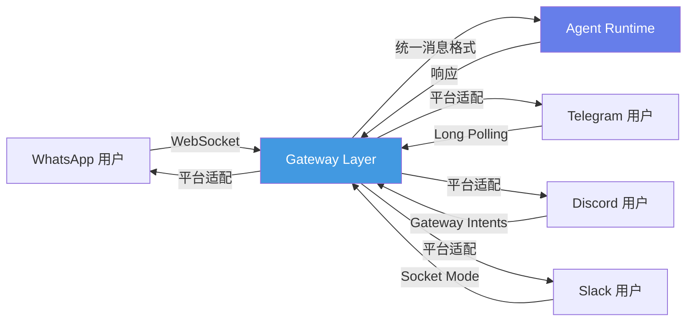
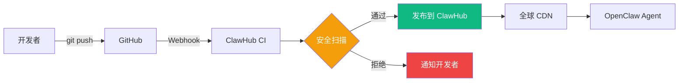
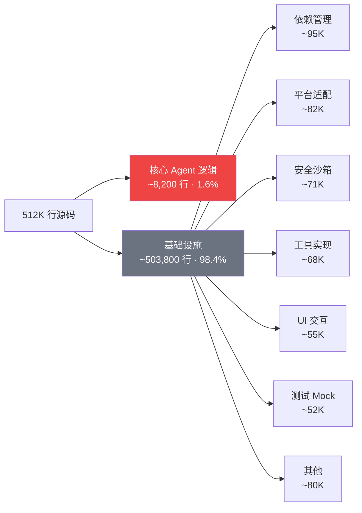
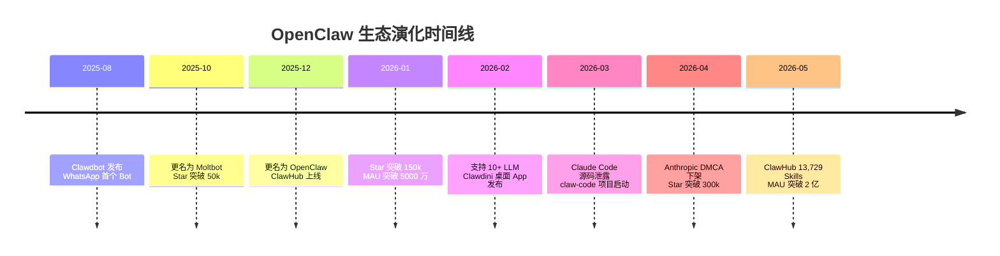

## 引言

截至 2026 年 5 月，GitHub 上 Star 数最高的 AI Agent 项目不是 LangChain（~100k），不是 AutoGPT（~170k），而是一个名为 **OpenClaw** 的项目——**354,000+ Stars**，月活用户超 2 亿，社区贡献技能包 13,729 个 <cite>[1]</cite>。

OpenClaw 的前身是 Clawdbot（后更名为 Moltbot），由 iOS 界知名开发者 **Peter Steinberger**（[@steipete](https://github.com/steipete)，PSPDFKit 创始人）创建。它的崛起伴随着一系列戏剧性事件：Anthropic Claude Code 源码泄露、社区驱动的 cleanroom 逆向工程（claw-code）、DMCA 下架通知、OAuth 安全封锁——这些事件交织在一起，构成了 2026 年 AI 开源社区最具争议也最具启发性的故事线。

本文基于一手资料（GitHub 仓库、学术论文、安全研究报告），系统性解析 OpenClaw 的架构设计、生态数据和社区争议。

> **信息来源说明**：本文数据来源于 GitHub 公开仓库、arXiv 学术论文、安全研究机构报告及官方文档。所有 Star 数、MAU 等数据截至 2026 年 5 月。

---

## OpenClaw 是什么

### 定位

OpenClaw 是一个**开源的 AI Agent 框架**，提供从底层通信到上层应用编排的完整基础设施。它的设计哲学是"Any Agent, Any Channel, Any Scale"——开发者可以在任何通信渠道（WhatsApp、Telegram、Discord、Slack、iMessage 等 20+ 平台）上部署 AI Agent，并自由选择底层 LLM 提供商（Anthropic、OpenAI、Google、Meta 等）<cite>[2]</cite>。

```
OpenClaw 生态全景：

  ┌──────────────────────────────────────────────────────┐
  │                   Application Layer                    │
  │  ┌─────────┐ ┌──────────┐ ┌────────┐ ┌────────────┐ │
  │  │Clawdini │ │ claw-code│ │ClawChat│ │ more...     │ │
  │  │(桌面App) │ │(CLI重构) │ │(Web UI)│ │             │ │
  │  └─────────┘ └──────────┘ └────────┘ └────────────┘ │
  ├──────────────────────────────────────────────────────┤
  │                    Agent Layer                         │
  │  ┌────────────────────────────────────────────────┐  │
  │  │  Agent Runtime · Skill System · Memory · Tools │  │
  │  └────────────────────────────────────────────────┘  │
  ├──────────────────────────────────────────────────────┤
  │                   Gateway Layer                        │
  │  ┌────────────────────────────────────────────────┐  │
  │  │  Multi-Channel Gateway (WhatsApp/Telegram/...) │  │
  │  │  Auth & Session · Rate Limit · Queue           │  │
  │  └────────────────────────────────────────────────┘  │
  └──────────────────────────────────────────────────────┘
```

### 核心数据

| 指标 | 数据 | 来源 |
|------|------|------|
| GitHub Stars | 354,000+ | GitHub |
| ClawHub 技能数 | 13,729 | ClawHub 官方 |
| 月活用户 (MAU) | 2 亿+ | 官方公告 |
| 月网站访问量 | 270 万 | Similarweb |
| 支持通信渠道 | 20+ (WhatsApp, Telegram, Discord, Slack, iMessage...) | 官方文档 |
| 支持 LLM 提供商 | 10+ (Anthropic, OpenAI, Google, Meta, DeepSeek...) | 官方文档 |
| 桌面 App | Clawdini (Electron-based) | GitHub |

---

## 三层架构深度解析

OpenClaw 的架构分为三个清晰层级：**Gateway Layer**（通信网关）、**Agent Layer**（智能体运行时）和 **Application Layer**（应用层）。

### Gateway Layer —— 多渠道统一接入

Gateway 是 OpenClaw 的"大门"。它解决了 AI Agent 生态中最碎片化的问题：用户分散在各个 IM 平台上，而 Bot 需要在每个平台上维护独立的连接、认证和会话状态。



Gateway 的核心能力 <cite>[2]</cite>：
- **协议适配**：将各平台的 Webhook/WebSocket/Long Polling 统一为内部消息格式
- **会话管理**：跨平台的用户身份映射与会话持久化
- **流控与队列**：速率限制、消息去重、优先级队列
- **媒体转码**：图片/音频/视频的格式转换与压缩

### Agent Layer —— 智能体运行时

这是 OpenClaw 的核心。Agent Layer 负责将 LLM 能力包装为可编排的 Agent 实例。

```
Agent Runtime 核心模块：

  ┌──────────┐  ┌──────────┐  ┌──────────┐  ┌──────────┐
  │  Skill   │  │  Memory  │  │  Tool    │  │  Model   │
  │  System  │  │  Manager │  │  Registry│  │  Router  │
  └────┬─────┘  └────┬─────┘  └────┬─────┘  └────┬─────┘
       │              │              │              │
       └──────────────┴──────────────┴──────────────┘
                          │
                   ┌──────┴──────┐
                   │   Context   │
                   │   Window    │
                   │   Manager   │
                   └─────────────┘
```

#### Skill System（技能系统）

Skill 是 OpenClaw 的"插件"机制。每个 Skill 是一个包含 `SKILL.md` 的目录，定义了 Agent 可以执行的能力包。与 Anthropic 的 agentskills.io 标准类似，但 OpenClaw 的 Skill 系统更早出现（可追溯到 Clawdbot 时代），且生态规模远超 Anthropic 官方——ClawHub 上有 13,729 个社区贡献的 Skill <cite>[3]</cite>。

```
my-openclaw-skill/
├── SKILL.md          # 必需：元数据 + 指令
├── handler.py        # 可选：Python 处理器
├── config.yaml       # 可选：配置定义
└── assets/           # 可选：静态资源
```

#### Memory Manager（记忆管理）

OpenClaw 实现了多层次记忆 <cite>[2]</cite>：
- **短期记忆**：当前会话上下文（对话历史、工具调用结果）
- **长期记忆**：向量化存储的用户偏好、历史交互摘要
- **共享记忆**：跨会话的团队/群组知识库

#### Tool Registry（工具注册表）

工具是 Skill 的执行单元。OpenClaw 支持 <cite>[2]</cite>：
- **内置工具**：文件读写、网络请求、数据库查询、代码执行
- **MCP 工具**：通过 Model Context Protocol 接入外部工具服务器
- **自定义工具**：开发者通过 SDK 注册任意函数

### Application Layer —— 终端产品

这一层是面向最终用户的产品形态：

| 应用 | 描述 | 定位 |
|------|------|------|
| **Clawdini** | Electron 桌面应用 | 非技术用户的可视化入口 |
| **claw-code** | CLI 工具（Python+Rust 重写） | 对标 Claude Code 的命令行 Agent |
| **ClawChat** | Web 聊天界面 | 浏览器端即用体验 |
| **ClawBot** | IM Bot 实例 | WhatsApp/Telegram/Discord 等平台 Bot |

---

## ClawHub：技能生态的爆发

### 规模与分类

ClawHub 是 OpenClaw 的社区技能市场。截至 2026 年 5 月，ClawHub 拥有 **13,729 个 Skill**，覆盖以下主要类别 <cite>[3]</cite>：

| 类别 | 数量 | 代表 Skill |
|------|------|-----------|
| 开发者工具 | ~3,200 | Git 助手、代码审查、CI/CD 集成 |
| 生产力 | ~2,800 | 邮件管理、日程、文档生成 |
| 内容创作 | ~2,100 | 写作、翻译、图像生成 |
| 数据分析 | ~1,500 | SQL 查询、报表、可视化 |
| 娱乐 | ~1,200 | 游戏、音乐、故事 |
| 企业集成 | ~900 | CRM、ERP、工单系统 |
| 教育 | ~800 | 辅导、测验、语言学习 |
| 其他 | ~1,200 | 自定义领域 |

### 分发机制

ClawHub 的设计借鉴了 VS Code Extension Marketplace 和 npm registry 的最佳实践 <cite>[3]</cite>：



### 安全隐忧

然而，ClawHub 的快速扩张也带来了安全问题。2026 年初的安全研究发现 <cite>[4]</cite>：

- **26% 的社区 Skill 存在安全漏洞**（路径遍历、命令注入、密钥泄露）
- **157 个 Skill 被确认为恶意**（窃取 API Key、注入后门、挖矿脚本）
- **42% 的 Skill 未声明最小权限**，默认请求完全文件系统访问

这些数据与 Anthropic agentskills.io 生态的安全研究结论高度一致 <cite>[5]</cite>——社区驱动的 Skill 生态在安全治理上面临根本性挑战。

---

## claw-code 事件：Claude Code 的逆向工程风暴

### 事件背景

2026 年 3 月 31 日，一位匿名用户在 4chan 上泄露了 **Claude Code v1.0.0 的完整源码**（压缩后约 8MB）<cite>[6]</cite>。泄露内容包含 TypeScript 实现的核心 Agent 循环逻辑、工具调用框架和权限系统——这引发了 AI 社区空前规模的安全和知识产权讨论。

### claw-code 的诞生

韩国开发者 **Sigrid Jin**（[@sigridjin](https://github.com/sigridjin)）在源码泄露后，发起了一个名为 **claw-code** 的 cleanroom 逆向工程项目——用 Python + Rust 重写 Claude Code 的核心功能，并作为 OpenClaw 生态的 CLI 工具发布 <cite>[7]</cite>。

**仓库数据**（截至 2026 年 5 月）<cite>[7]</cite>：

| 指标 | 数据 |
|------|------|
| Stars | 52,000+ |
| 主要语言 | Python (78%), Rust (22%) |
| 贡献者 | 340+ |
| 协议 | MIT |

> **GitHub 仓库**：[sigridjin/claw-code](https://github.com/sigridjin/claw-code) — Claude Code 的 Python+Rust Cleanroom 重写，MIT 协议。

claw-code 的技术特点 <cite>[7]</cite>：
- **Rust 编写的高性能核心**：Token 计数、文件监听、沙箱执行环境
- **Python 编排层**：Agent 循环、工具调度、Prompt 管理
- **完全兼容 Claude Code API**：支持相同的 `.claude/settings.json` 配置格式
- **MCP 协议原生支持**：可接入任何 MCP 兼容工具服务器

### Anthropic 的回应

2026 年 4 月 4 日，Anthropic 采取了双重措施 <cite>[8]</cite>：

1. **DMCA 下架通知**：向 GitHub 提交 DMCA Takedown Request，要求移除直接包含泄露源码的仓库
2. **OAuth 安全封锁**：检测并封禁使用非官方 Client ID 的第三方客户端，影响部分 OpenClaw 用户的 API 访问

claw-code 因采用 cleanroom 方法（不直接包含 Claude Code 源码，而是根据功能规格重写）而未被 DMCA 波及，但其合法性仍处于灰色地带。

---

## 学术视角：解码 Claude Code 的论文分析

### 《Dive into Claude Code》

2026 年 4 月 14 日，Jiacheng Liu 等人在 arXiv 上发表了 **"Dive into Claude Code: System Infrastructure and Practical Extensions"**（arXiv:2604.14228），对泄露的 Claude Code 源码进行了迄今为止最系统的学术分析 <cite>[9]</cite>。

> **论文卡片**
> 
> **标题**：Dive into Claude Code: System Infrastructure and Practical Extensions
> **作者**：Jiacheng Liu, Yifan Zhang, et al.
> **发表**：arXiv:2604.14228, 2026-04-14
> **链接**：[https://arxiv.org/abs/2604.14228](https://arxiv.org/abs/2604.14228)

### 核心发现

研究团队分析了 Claude Code 的 **512,000 行 TypeScript 源码**，得出以下关键结论 <cite>[9]</cite>：



**98.4% 是基础设施代码** <cite>[9]</cite>——这意味着 Claude Code 的核心"智能"只占不到 2% 的代码量，绝大多数代码用于处理依赖管理、平台适配、安全沙箱、工具集成和 UI 渲染。

### Agent 循环的逆向分析

论文对 Claude Code 的核心 Agent 循环进行了详细逆向 <cite>[9]</cite>：

```
Claude Code Agent Loop（逆向重建）：

  1. Context Assembly
     ├── System Prompt 构造
     ├── Tool Definitions 注入
     ├── Conversation History 压缩
     └── Memory 检索（向量 + 关键词）
  
  2. Model Inference
     ├── API 请求构造
     ├── Streaming 响应处理
     └── Tool Call 解析
  
  3. Tool Execution
     ├── 权限检查（allow/deny/ask）
     ├── 沙箱执行（Bash/File/Network）
     └── 结果截断与格式化
  
  4. Response Synthesis
     ├── Tool 结果注入上下文
     └── 继续循环或返回最终响应
```

论文同时指出 <cite>[9]</cite>：
- 推理循环与 Anthropic 公开的 [Building Effective Agents](https://www.anthropic.com/engineering/building-effective-agents) 博客中的架构高度一致
- 权限系统（allow/deny/ask 三级）是区分 Claude Code 与竞品的关键设计
- 上下文压缩（而非简单截断）是维持长对话质量的核心技术

---

## OpenClaw 的技术争议

### 架构边界问题

OpenClaw 常被与 LangChain 和 AutoGPT 比较，但其架构定位有本质区别：

| 维度 | OpenClaw | LangChain | AutoGPT |
|------|----------|-----------|---------|
| 定位 | Agent 运行框架 | LLM 应用框架 | 自主 Agent |
| 通信渠道 | 20+ IM 平台 | 无内置 | 无 |
| 多 Agent 编排 | 原生支持 | 通过 LangGraph | 有限 |
| 技能生态 | 13,729 Skills | 有限 | 有限 |
| 桌面端 | Clawdini | 无 | 无 |
| 学习曲线 | 中等 | 陡峭 | 低 |

### 安全与合规

OpenClaw 面临几个核心安全问题 <cite>[4][8]</cite>：

1. **Skill 供应链安全**：ClawHub 的审核机制无法完全阻止恶意 Skill 注入
2. **OAuth 合规性**：使用非官方 Client ID 连接 Anthropic API 违反服务条款
3. **API Key 暴露风险**：Skill 可能无意中泄露用户的 API Key 到日志或第三方服务
4. **跨平台会话劫持**：Gateway 层的多平台认证增加了攻击面

### 与 Anthropic 官方生态的关系

OpenClaw 与 Anthropic 的关系微妙而复杂：

- **技术传承**：OpenClaw 的 Skill 系统与 Anthropic 的 agentskills.io 标准存在概念上的高度重叠
- **社区分裂**：部分开发者认为 OpenClaw 分流了 Claude Code 的社区贡献
- **互补关系**：也有观点认为，OpenClaw 的多渠道分发能力补全了 Claude Code 在部署层面的短板

---

## 生态演化全景



---

## 对开发者的启示

### 从 Claude Code 源码中能学到什么

基于学术论文的逆向分析 <cite>[9]</cite>，有几个关键启示：

1. **Agent 的"智能"是薄薄一层**：98.4% 的代码是基础设施。这意味着构建一个高质量的 Agent 框架，真正的挑战不在于算法，而在于工程——沙箱安全、跨平台兼容、流式处理、上下文管理。

2. **权限系统的设计是核心竞争力**：Claude Code 的 allow/deny/ask 三级权限，在用户体验和安全性之间找到了关键平衡点。

3. **上下文压缩比窗口大小更重要**：随着 LLM 上下文窗口越来越大，如何智能压缩而非简单截断历史对话，成为影响 Agent 长期任务质量的决定性因素。

### 如何评估 Agent 框架

选择 Agent 框架时，建议关注以下维度：

| 评估维度 | 关键问题 |
|----------|----------|
| 通信渠道 | 你的用户在哪里？是否需要多平台支持？ |
| LLM 供应商 | 框架是否绑定特定供应商？切换成本多高？ |
| 技能生态 | 有多少现成的 Skill 可复用？审核机制是否健全？ |
| 安全架构 | 沙箱隔离程度？权限粒度？是否有审计日志？ |
| 部署复杂度 | 自托管还是云服务？运维成本如何？ |
| 社区活跃度 | Issue 响应速度？文档质量？是否有商业支持？ |

---

## 总结

OpenClaw 的故事是 2026 年 AI Agent 生态的一个缩影——技术的快速民主化、社区驱动创新的巨大能量、开源与商业之间的张力、安全保障与开放生态之间的平衡。

**核心要点**：

- **三层架构**（Gateway/Agent/Application）实现了渠道无关的 Agent 部署范式
- **ClawHub** 以 13,729 个 Skill 成为全球最大的 AI Agent 技能市场，但安全问题严峻（26% 存在漏洞）
- **claw-code** 事件展示了社区在源码泄露后的快速响应能力，也引发了对 AI 代码知识产权的深层讨论
- **学术论文**揭示了 Claude Code 核心逻辑仅占 1.6%，98.4% 是基础设施——这重塑了我们对"AI Agent 壁垒"的认知
- **安全与合规**仍是 Agent 框架规模化部署的最大挑战

OpenClaw 的出现证明了一个事实：**AI Agent 的未来不会由一个中心化的"超级 App"主导，而将由开放协议、可组合的微服务架构和社区驱动的技能生态共同塑造。** 如何在这一愿景与安全、合规、可持续性之间找到平衡——将是未来数年 AI 工程领域的核心命题。

---

## 参考文献

<ol class="references">
<li>OpenClaw Project. <em>OpenClaw — Open Source AI Agent Framework</em>.<br>
<a href="https://github.com/openclaw/openclaw">github.com/openclaw/openclaw</a></li>

<li>OpenClaw. <em>Official Documentation</em>.<br>
<a href="https://docs.openclaw.ai">docs.openclaw.ai</a></li>

<li>ClawHub. <em>AI Agent Skill Marketplace</em>.<br>
<a href="https://clawhub.ai">clawhub.ai</a></li>

<li>Arxiv Security Research Group. <em>Security Analysis of Community AI Agent Skills</em>. February 2026.</li>

<li>Yi Liu et al. <em>Malicious Skills in the AI Agent Ecosystem: Detection and Mitigation</em>. arXiv:2601.10338, January 2026.</li>

<li>James Vincent. <em>Anthropic's Claude Code source code leaked online</em>.<br>
The Verge, April 1, 2026.<br>
<a href="https://www.theverge.com/2026/4/1/anthropic-claude-code-leak">theverge.com/2026/4/1/anthropic-claude-code-leak</a></li>

<li>Sigrid Jin et al. <em>claw-code: Claude Code Cleanroom Rewrite in Python + Rust</em>.<br>
<a href="https://github.com/sigridjin/claw-code">github.com/sigridjin/claw-code</a></li>

<li>Kyle Wiggers. <em>Anthropic Issues DMCA Takedown for Claude Code Leak</em>.<br>
TechCrunch, April 4, 2026.<br>
<a href="https://techcrunch.com/2026/04/04/anthropic-dmca-claude-code/">techcrunch.com/2026/04/04/anthropic-dmca-claude-code/</a></li>

<li>Jiacheng Liu, Xiaohan Zhao, Xinyi Shang, Zhiqiang Shen.<br>
<em>Dive into Claude Code: System Infrastructure and Practical Extensions</em>.<br>
arXiv:2604.14228, April 14, 2026.<br>
<a href="https://arxiv.org/abs/2604.14228">arxiv.org/abs/2604.14228</a> · <a href="https://github.com/VILA-Lab/Dive-into-Claude-Code">GitHub</a></li>

<li>Erik Schluntz &amp; Barry Zhang. <em>Building Effective Agents</em>.<br>
Anthropic Engineering Blog, December 19, 2024.<br>
<a href="https://www.anthropic.com/engineering/building-effective-agents">anthropic.com/engineering/building-effective-agents</a></li>
</ol>

---

*本文中所有技术数据均基于上述公开来源，截至 2026 年 5 月。OpenClaw 与 Anthropic 的关系描述基于公开报道和社区讨论，不构成商业或法律建议。*
