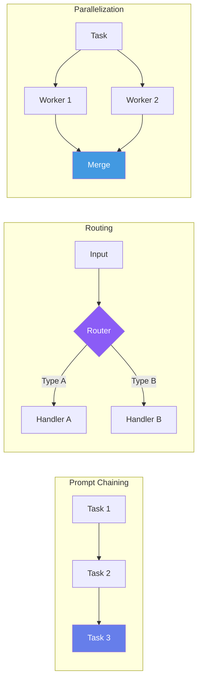
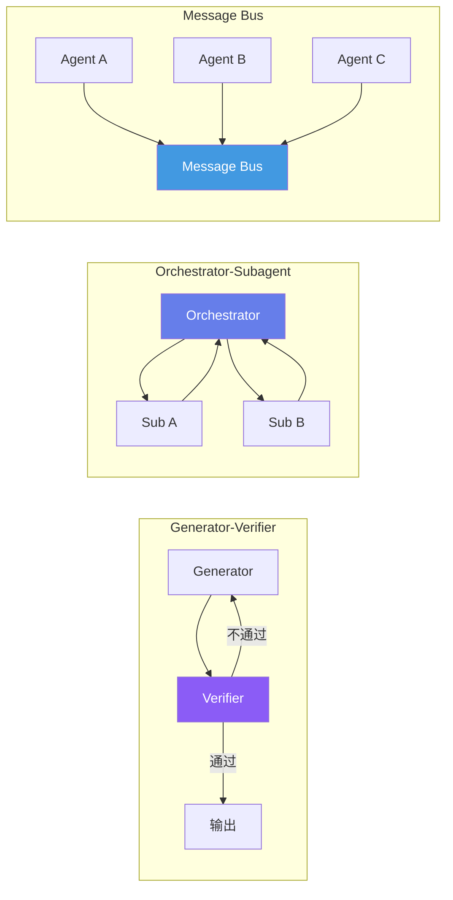
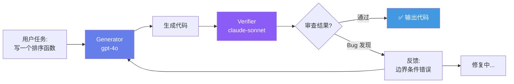
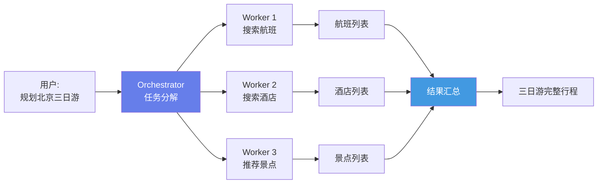

## 引言

单 Agent 有两个根本局限：

1. **串行瓶颈**：一次只能做一件事。查询航班、预订酒店、规划路线必须逐个进行。
2. **确认偏差**：Agent 写出的代码由同一个 Agent 审查，容易遗漏错误。

解决方案：多 Agent 协作。如同软件开发团队有开发者、审查者、测试者，Agent 也需要分工协作。

---

## Anthropic 6 种单流程模式

Anthropic 在其官方 Agent 设计指南中提出了 6 种基础模式 <cite>[1]</cite>：



| 模式 | 结构 | 适用场景 | 复杂度 |
|------|------|---------|--------|
| **Prompt Chaining** | 顺序管道 A→B→C | 代码生成→审查→修复 | ⭐ |
| **Routing** | 分类→分发 | 按问题类型分派专家 | ⭐ |
| **Parallelization** | 并行执行→合并 | 同时搜索多数据源 | ⭐⭐ |
| **Orchestrator-Workers** | 中央调度 N 工人 | 复杂多步任务 | ⭐⭐⭐ |
| **Evaluator-Optimizer** | 生成→评估→迭代 | 需要质量保证的任务 | ⭐⭐⭐ |
| **Autonomous Agent** | 完全自治循环 | 长期运行的开放任务 | ⭐⭐⭐⭐ |

---

## 5 大多 Agent 协调模式

### 模式总览



### 五种模式对比

| 模式 | 拓扑 | 通信方式 | 适用场景 |
|------|------|---------|---------|
| **Generator-Verifier** | 链式循环 | 评审意见传递 | 代码审查、内容审核 |
| **Orchestrator-Subagent** | 星型 | 任务-结果对 | 复杂任务分解 |
| **Agent Teams** | 全连接 | 角色对话 | 头脑风暴、辩论 |
| **Message Bus** | 总线 | 发布-订阅 | 事件驱动系统 |
| **Shared State** | 黑板 | 读写共享内存 | 协作推理 |

---

## Generator-Verifier：代码审查双 Agent

### 算法设计



### 完整实现

```python
import json
from openai import OpenAI

class GeneratorVerifierTeam:
    """Generator-Verifier 双 Agent 协作"""

    def __init__(self, max_revisions: int = 3):
        self.client = OpenAI()
        self.max_revisions = max_revisions

    def solve(self, task: str, test_cases: list[dict] = None) -> dict:
        """
        双 Agent 协作求解任务。

        Args:
            task: 任务描述
            test_cases: [{"input": ..., "expected": ...}]
        Returns:
            {"solution": ..., "iterations": N, "passed": bool}
        """
        # Phase 1: Generator 生成初始解
        code = self._generate(task)
        revision_history = [code]

        for iteration in range(self.max_revisions):
            # Phase 2: Verifier 审查
            review = self._verify(task, code, test_cases)

            if review["approved"]:
                return {
                    "solution": code,
                    "iterations": iteration + 1,
                    "revisions": revision_history,
                    "passed": True,
                    "review_comments": review["comments"]
                }

            # Phase 3: Generator 根据反馈修改
            code = self._revise(task, code, review["feedback"])
            revision_history.append(code)

        return {
            "solution": code,
            "iterations": self.max_revisions,
            "revisions": revision_history,
            "passed": False,
            "review_comments": review.get("feedback", "达到最大修改次数")
        }

    def _generate(self, task: str) -> str:
        response = self.client.chat.completions.create(
            model="gpt-4o",
            messages=[{
                "role": "system",
                "content": ("你是一个资深 Python 开发者。根据任务描述编写高质量代码。"
                           "包含类型注解、docstring 和边界条件处理。只输出代码，"
                           "不要额外解释。")
            }, {
                "role": "user",
                "content": task
            }],
            temperature=0.2
        )
        return response.choices[0].message.content

    def _verify(self, task: str, code: str,
                test_cases: list[dict] = None) -> dict:
        """Verifier: 审查代码质量"""
        prompt = f"""审查以下代码。原始任务：{task}

```python
{code}
```

请从以下维度审查：
1. **正确性**：逻辑是否正确？边界条件是否处理？
2. **性能**：时间复杂度是否合理？
3. **可读性**：命名是否清晰？注释是否恰当？
4. **安全性**：是否存在注入、溢出等风险？

{f"测试用例：{json.dumps(test_cases, indent=2)}" if test_cases else ""}

回复 JSON 格式：
{{"approved": true/false, "score": 0-100, "feedback": "修改建议", "comments": [...]}}"""

        response = self.client.chat.completions.create(
            model="gpt-4o",  # 不同模型 → 独立视角
            messages=[{
                "role": "system",
                "content": "你是一个严格的代码审查者。找出所有问题，不要放水。"
            }, {
                "role": "user",
                "content": prompt
            }],
            temperature=0.1
        )
        return json.loads(response.choices[0].message.content)

    def _revise(self, task: str, code: str, feedback: str) -> str:
        """Generator: 根据反馈修改代码"""
        response = self.client.chat.completions.create(
            model="gpt-4o",
            messages=[{
                "role": "system",
                "content": "根据审查反馈修改代码。只输出修改后的完整代码。"
            }, {
                "role": "user",
                "content": f"原始任务：{task}\n\n当前代码：\n{code}"
                          f"\n\n审查反馈：{feedback}"
            }],
            temperature=0.2
        )
        return response.choices[0].message.content
```

---

## Orchestrator-Workers：任务分解与调度

### 模式说明

Orchestrator 接收复杂任务 → 分解为子任务 → 分配给 Workers → 汇总结果：



### 核心实现

```python
from concurrent.futures import ThreadPoolExecutor, as_completed
import concurrent.futures

class OrchestratorWorkers:
    def __init__(self, registry: ToolRegistry):
        self.client = OpenAI()
        self.registry = registry
        self.executor = ThreadPoolExecutor(max_workers=4)

    def solve(self, task: str) -> str:
        # Step 1: Orchestrator 分解任务
        subtasks = self._decompose(task)
        print(f"[Orchestrator] 分解为 {len(subtasks)} 个子任务")

        # Step 2: 并行执行子任务
        futures = {}
        for i, subtask in enumerate(subtasks):
            future = self.executor.submit(
                self._execute_subtask, subtask
            )
            futures[future] = i

        # Step 3: 收集结果
        results = [None] * len(subtasks)
        for future in as_completed(futures):
            idx = futures[future]
            results[idx] = future.result()
            print(f"[Worker {idx}] 完成")

        # Step 4: 汇总合成
        return self._synthesize(task, subtasks, results)

    def _decompose(self, task: str) -> list[str]:
        """Orchestrator 将复杂任务分解为独立子任务"""
        response = self.client.chat.completions.create(
            model="gpt-4o",
            messages=[{
                "role": "system",
                "content": (
                    "将复杂任务分解为 3-5 个相互独立的子任务。"
                    "每个子任务应能独立完成，不需要其他子任务的结果。"
                    "输出 JSON 数组，每个元素是子任务描述字符串。"
                )
            }, {
                "role": "user",
                "content": task
            }],
            temperature=0.1
        )
        return json.loads(response.choices[0].message.content)

    def _execute_subtask(self, subtask: str) -> str:
        """Worker 独立执行子任务"""
        # 每个 Worker 是一个独立的 SimpleAgent 实例
        agent = SimpleAgent(
            system_prompt="你是一个高效的执行者。完成任务并返回结果。",
            registry=self.registry
        )
        return agent.run(subtask)

    def _synthesize(self, task: str, subtasks: list[str],
                    results: list[str]) -> str:
        """Orchestrator 汇总结果"""
        response = self.client.chat.completions.create(
            model="gpt-4o",
            messages=[{
                "role": "system",
                "content": "将子任务的结果合成为一个完整、连贯的回答。"
            }, {
                "role": "user",
                "content": (
                    f"原始任务：{task}\n\n"
                    + "\n\n".join(
                        f"子任务 {i}: {s}\n结果: {r}"
                        for i, (s, r) in enumerate(
                            zip(subtasks, results))
                    )
                )
            }],
            temperature=0.3
        )
        return response.choices[0].message.content
```

---

## 多 Agent 的数学分析

### 并行加速比

**定理 1（Orchestrator-Workers 加速比）**：设任务可分解为 \\(K\\) 个独立子任务，每个子任务执行时间为 \\(T_i\\)，Orchestrator 调度开销为 \\(T_o\\)，汇总开销为 \\(T_s\\)。则总执行时间为：

\\[
T_{\\text{parallel}} = T_o + \\max\\{T_1, T_2, \\ldots, T_K\\} + T_s
\\]

相比串行执行 \\(T_{\\text{serial}} = \\sum_i T_i\\)，加速比为：

\\[
S = \\frac{\\sum_i T_i}{T_o + \\max_i T_i + T_s} \\leq K
\\]

**实际加速比**：当子任务均匀时 \\(S \\approx K / (1 + \\epsilon)\\) 其中 \\(\\epsilon \\approx 0.2\\) 是通信开销比例。4 个 Worker 的实际加速比约为 3.3×。

### Generator-Verifier 的可靠性增益

**定理 2（审查可靠性）**：设 Generator 单次生成正确解的概率为 \\(p_g\\)，Verifier 正确识别错误的概率为 \\(p_v\\)（召回率），错误识别准确的概率为 \\(p_f\\)（假阳性率为 \\(1 - p_f\\)）。经过最多 \\(N\\) 轮修正后，最终输出正确的概率为：

\\[
P_{\\text{correct}} = 1 - (1 - p_g) \\cdot \\prod_{i=1}^{N} \\left(1 - p_v \\cdot p_g^{(i)}\\right)
\\]

其中 \\(p_g^{(i)}\\) 是第 \\(i\\) 次修正后生成正确解的概率。典型值：\\(p_g = 0.7, p_v = 0.85, N = 2 \\Rightarrow P_{\\text{correct}} \\approx 0.94\\)。

这解释了为什么 Generator-Verifier 能显著提升代码质量——单 Agent 70% 的正确率经两轮审查后可达 94%。

### 可靠性 vs 成本的权衡

| 策略 | 正确率 | LLM 调用次数 | 延迟 |
|------|--------|-------------|------|
| 单 Agent | ~70% | 1× | 快 |
| Generator-Verifier (1轮) | ~85% | 2× | 中等 |
| Generator-Verifier (2轮) | ~94% | 3× | 较慢 |
| 3-Agent 多数投票 | ~89% | 3×（并行） | 快 |

**多数投票的数学**：三个独立 Agent 投票取多数的正确率（设每个 Agent 正确率 \\(p\\)）：

\\[
P_{\\text{vote}} = p^3 + 3p^2(1-p) = 3p^2 - 2p^3
\\]

当 \\(p = 0.7\\) 时，\\(P_{\\text{vote}} = 0.784\\)；当 \\(p = 0.8\\) 时，\\(P_{\\text{vote}} = 0.896\\)。

---

## Agent Teams：角色扮演协作

### 设计理念

让多个 Agent 扮演不同角色进行对话式协作。例如：

```python
class AgentTeam:
    """多 Agent 团队——角色扮演协作"""

    def __init__(self, members: list[dict]):
        """
        members = [
            {"name": "产品经理", "role": "定义需求和验收标准"},
            {"name": "架构师", "role": "设计系统架构"},
            {"name": "开发者", "role": "实现代码"},
            {"name": "QA", "role": "设计和运行测试"}
        ]
        """
        self.members = members
        self.history: list[dict] = []

    def discuss(self, topic: str, rounds: int = 3) -> str:
        """团队成员轮流发言讨论"""
        context = f"团队讨论主题：{topic}\n\n团队成员：\n"
        for m in self.members:
            context += f"- {m['name']}: {m['role']}\n"

        for round_num in range(rounds):
            for member in self.members:
                response = self._speak(member, context)
                self.history.append({
                    "round": round_num,
                    "speaker": member["name"],
                    "content": response
                })
                context += f"\n[{member['name']}]: {response}\n"

        # 最终综合
        return self._summarize(topic, context)

    def _speak(self, member: dict, context: str) -> str:
        response = self.client.chat.completions.create(
            model="gpt-4o",
            messages=[{
                "role": "system",
                "content": (
                    f"你是团队的{member['name']}。你的职责：{member['role']}。"
                    f"基于讨论上下文，从你的专业角度发表意见。"
                    f"可以赞同、反对或补充其他成员的观点。"
                )
            }, {
                "role": "user",
                "content": (
                    f"当前讨论上下文：\n{context}\n\n"
                    f"请以{member['name']}的身份发言。"
                )
            }],
            temperature=0.7  # 更高温度鼓励多样化观点
        )
        return response.choices[0].message.content
```

---

## 多 Agent 系统中的博弈论视角

### 协调博弈

多 Agent 协作可以建模为**协调博弈**：每个 Agent \\(i\\) 选择一个行动 \\(a_i\\)，获得效用 \\(U_i(a_1, \\ldots, a_n)\\)。

在理想协作中：
- **共同目标**：\\(U_i = U_j\\) 对所有 \\(i, j\\)（团队利益一致）
- **信息共享**：Agent 间通过消息交换私有信息
- **Nash 均衡**：在没有 Agent 能通过单方面改变策略来提高效用时达到

### 去中心化决策的挑战

当 Agent 被授予独立决策权时，可能出现：

1. **信息不对齐**：Agent A 不知道 Agent B 已找到更好方案
2. **重复劳动**：两个 Agent 独立做同样的事
3. **责任扩散**：没人对最终结果负责

**解决方案**：始终保留一个 **Orchestrator Agent** 作为最终决策者。

---

## 本章小结

本文构建了多 Agent 协作系统：

1. **6 种单流程模式**：从串行链到完全自治
2. **5 大多 Agent 协调模式**：Generator-Verifier、Orchestrator-Workers 等
3. **Generator-Verifier 代码实现**：双 Agent 审查循环，正确率从 70% 提升到 94%
4. **数学分析**：并行加速比 \\(S \\leq K\\)，审查可靠性的概率提升公式，多数投票的 \\(3p^2 - 2p^3\\) 规律

**下一篇预告**：MCP & A2A——Anthropic 和 Google 推出的 Agent 通信标准协议，让你的 Agent 与外部世界无缝集成。

---

## 参考文献

<ol class="references">
<li><em>Anthropic. "Building Effective Agents — 6 Core Patterns."</em> Anthropic Research Blog, Dec 2024.<br><a href="https://www.anthropic.com/research/building-effective-agents">https://www.anthropic.com/research/building-effective-agents</a></li>
<li><em>Anthropic. "Multi-Agent Design Patterns."</em> Anthropic Agent SDK Documentation, 2025.<br><a href="https://docs.anthropic.com/en/docs/agents-and-tools/multi-agent-patterns">https://docs.anthropic.com/en/docs/agents-and-tools/multi-agent-patterns</a></li>
<li><em>Wang, L., et al. "A Survey on Large Language Model based Autonomous Agents."</em> arXiv 2023.<br><a href="https://arxiv.org/abs/2308.11432">https://arxiv.org/abs/2308.11432</a></li>
<li><em>Li, G., et al. "CAMEL: Communicative Agents for 'Mind' Exploration of Large Language Model Society."</em> NeurIPS 2023.<br><a href="https://arxiv.org/abs/2303.17760">https://arxiv.org/abs/2303.17760</a></li>
<li><em>Park, J. S., et al. "Generative Agents: Interactive Simulacra of Human Behavior."</em> UIST 2023.<br><a href="https://arxiv.org/abs/2304.03442">https://arxiv.org/abs/2304.03442</a></li>
<li><em>Wu, Q., et al. "AutoGen: Enabling Next-Gen LLM Applications via Multi-Agent Conversation."</em> arXiv 2023.<br><a href="https://arxiv.org/abs/2308.08155">https://arxiv.org/abs/2308.08155</a></li>
<li><em>CrewAI. "Multi-Agent Orchestration Framework."</em> GitHub, 2024.<br><a href="https://github.com/crewAIInc/crewAI">https://github.com/crewAIInc/crewAI</a></li>
<li><em>Hong, S., et al. "MetaGPT: Meta Programming for A Multi-Agent Collaborative Framework."</em> ICLR 2024.<br><a href="https://arxiv.org/abs/2308.00352">https://arxiv.org/abs/2308.00352</a></li>
</ol>
