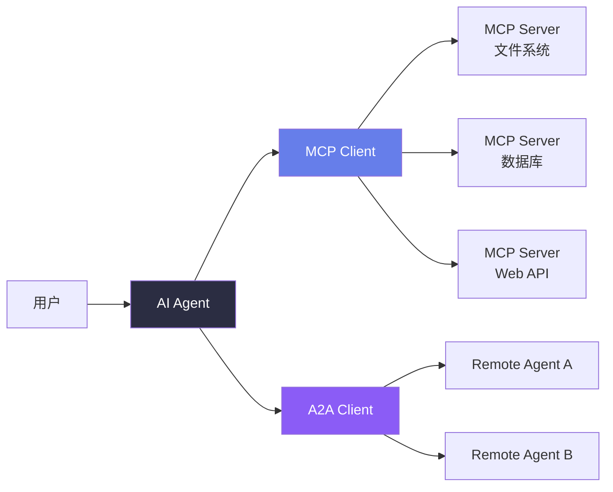
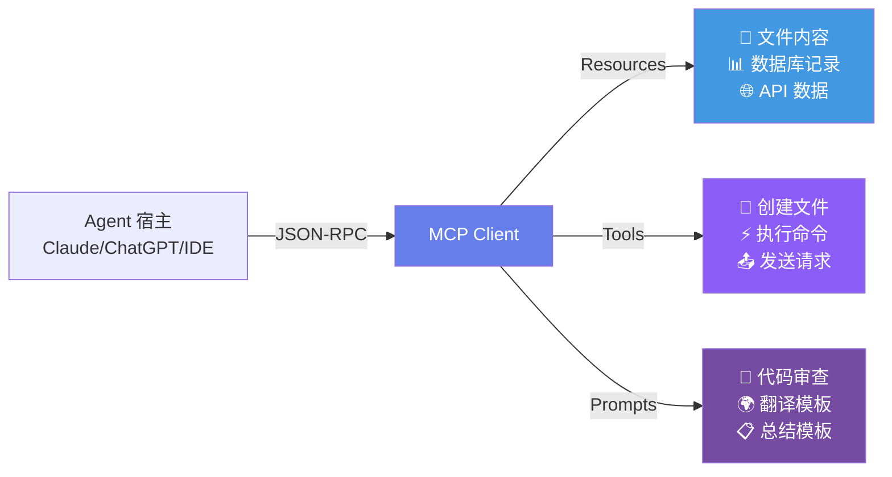
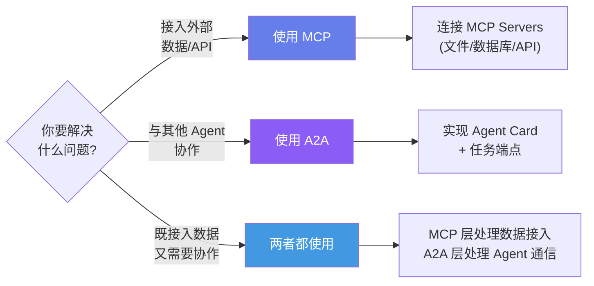
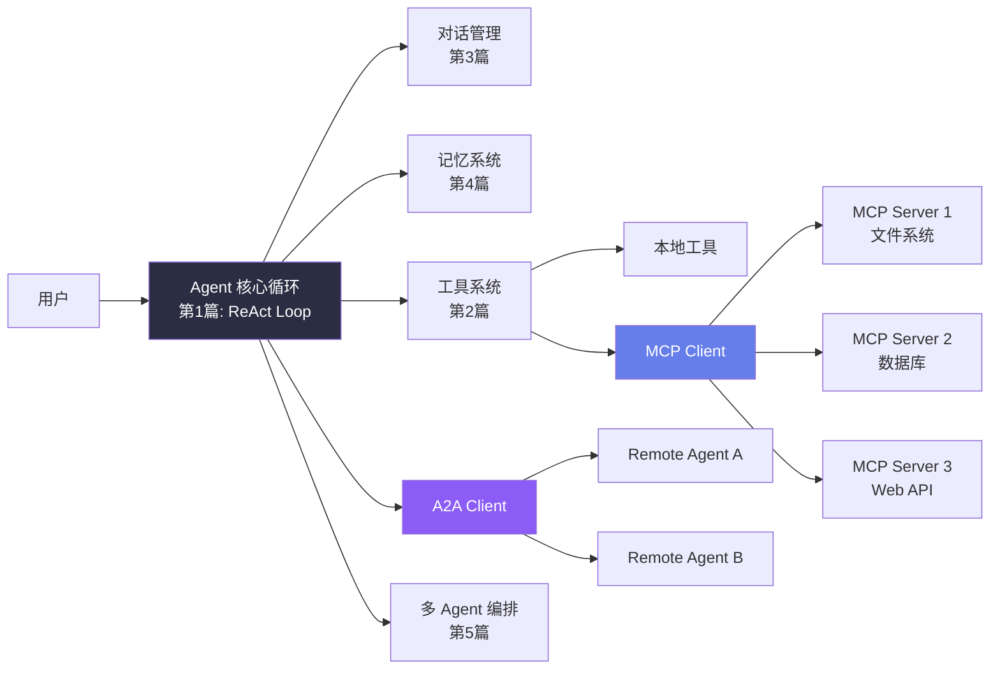

## 引言

截至 2026 年 5 月，AI Agent 领域最重要的基础设施进展不是某个新模型或新框架，而是**通信协议的标准化**。

两个关键协议正在定义 Agent 与外界的交互方式：

- **MCP（Model Context Protocol）**：Anthropic 于 2024 年 11 月推出，解决 "Agent 如何接入外部工具和数据源" 的问题 <cite>[1]</cite>
- **A2A（Agent-to-Agent）**：Google 于 2025 年 4 月推出，解决 "Agent 之间如何标准化通信" 的问题 <cite>[2]</cite>

本文从协议设计的底层原理出发，给出完整的使用和实现指南。

---

## 协议栈总览



**MCP 和 A2A 的分工**：
- MCP：Agent ↔ 工具/数据源（垂直集成）
- A2A：Agent ↔ Agent（水平协作）

---

## MCP 协议深度解析

### 设计哲学：USB-C for AI

MCP 的设计灵感来自 USB-C——一个统一的接口标准，取代了此前每个设备需要专用连接线的混乱局面。在 MCP 之前，每个 LLM 提供商、每个数据源都有自己的集成方式：

```
没有 MCP 的世界：
  Agent → OpenAI Function Calling → 工具 A
  Agent → Anthropic Tool Use → 工具 B  
  Agent → LangChain Tool → 工具 C
  → N 个工具需要 N 种集成方式

有 MCP 的世界：
  Agent → MCP Client → MCP Server → 任何工具/数据
  → 1 种集成方式覆盖所有工具
```

### 三大核心原语

MCP 定义了三种 Server 暴露给 Client 的资源类型：

| 原语 | 用途 | 类比 | 示例 |
|------|------|------|------|
| **Resources** | 暴露数据 | GET 请求 | 文件内容、数据库记录、API 响应 |
| **Tools** | 暴露操作 | POST 请求 | 创建文件、执行 SQL、发送消息 |
| **Prompts** | 暴露模板 | 预定义提示 | 代码审查模板、翻译模板 |



### 协议通信机制

MCP 使用 **JSON-RPC 2.0** 作为传输协议，支持两种传输方式：

- **stdio**：标准输入输出（本地进程通信）
- **HTTP + SSE**：远程服务器通信

```json
// Client → Server: 请求工具列表
{
  "jsonrpc": "2.0",
  "id": 1,
  "method": "tools/list",
  "params": {}
}

// Server → Client: 返回可用工具
{
  "jsonrpc": "2.0",
  "id": 1,
  "result": {
    "tools": [
      {
        "name": "read_file",
        "description": "读取文件内容",
        "inputSchema": {
          "type": "object",
          "properties": {
            "path": {"type": "string"}
          },
          "required": ["path"]
        }
      }
    ]
  }
}
```

---

## MCP 客户端实现

### 使用官方 Python SDK

```python
import asyncio
from mcp import ClientSession, StdioServerParameters
from mcp.client.stdio import stdio_client

class MCPAgent:
    """集成 MCP 协议的 Agent"""

    def __init__(self):
        self.client = OpenAI()
        self.mcp_tools: list[dict] = []
        self.mcp_session = None

    async def connect_server(self, command: str, args: list[str]):
        """连接到 MCP Server"""
        server_params = StdioServerParameters(
            command=command,
            args=args
        )

        # stdio_client 返回 read/write 流
        self.stdio_ctx = stdio_client(server_params)
        read, write = await self.stdio_ctx.__aenter__()

        # 创建会话
        self.mcp_session = ClientSession(read, write)
        await self.mcp_session.__aenter__()

        # 初始化
        await self.mcp_session.initialize()

        # 获取工具列表
        result = await self.mcp_session.list_tools()
        self.mcp_tools = [
            {
                "type": "function",
                "function": {
                    "name": tool.name,
                    "description": tool.description,
                    "parameters": tool.inputSchema
                }
            }
            for tool in result.tools
        ]
        print(f"已连接 MCP Server, 加载 {len(self.mcp_tools)} 个工具")

    async def call_mcp_tool(self, name: str, arguments: dict) -> str:
        """调用 MCP Server 的工具"""
        result = await self.mcp_session.call_tool(name, arguments)
        return str(result.content[0].text)

    async def run(self, user_query: str) -> str:
        """Agent 循环（集成 MCP 工具）"""
        messages = [
            {"role": "system",
             "content": "你可以使用 MCP Server 提供的工具。"},
            {"role": "user", "content": user_query}
        ]

        # 合并 MCP 工具和本地工具
        all_tools = self.mcp_tools + self.local_tools

        for _ in range(10):
            response = self.client.chat.completions.create(
                model="gpt-4o",
                messages=messages,
                tools=all_tools
            )
            msg = response.choices[0].message

            if msg.tool_calls:
                for tc in msg.tool_calls:
                    fn_name = tc.function.name
                    fn_args = json.loads(tc.function.arguments)

                    # 判断是否为 MCP 工具
                    if any(t["function"]["name"] == fn_name
                           for t in self.mcp_tools):
                        result = await self.call_mcp_tool(
                            fn_name, fn_args)
                    else:
                        result = self.registry.execute(
                            fn_name, fn_args)

                    messages.append({
                        "role": "assistant",
                        "content": None,
                        "tool_calls": [tc]
                    })
                    messages.append({
                        "role": "tool",
                        "tool_call_id": tc.id,
                        "content": result
                    })
            else:
                return msg.content or ""

        return "达到最大迭代次数。"


# ── 使用示例：连接文件系统 MCP Server ──
async def main():
    agent = MCPAgent()

    # 连接 Anthropic 官方文件系统 MCP Server
    await agent.connect_server(
        command="npx",
        args=["-y", "@modelcontextprotocol/server-filesystem",
              "/Users/username/Documents"]
    )

    # 现在 Agent 可以读写文件系统
    result = await agent.run(
        "读取我的所有 Python 文件，找出最长的函数"
    )
    print(result)

asyncio.run(main())
```

### MCP 工具与自定义工具的混合管理

```python
class HybridToolManager:
    """混合管理 MCP 工具和本地自定义工具"""

    def __init__(self):
        self.mcp_tools: dict[str, callable] = {}
        self.local_tools: dict[str, ToolInfo] = {}
        self.tool_sources: dict[str, str] = {}  # 追踪工具来源

    def register_local(self, fn):
        """注册本地工具（第二篇的 @tool 装饰器）"""
        info = ToolInfo.from_function(fn)
        self.local_tools[info.name] = info
        self.tool_sources[info.name] = "local"

    async def register_mcp(self, session: ClientSession):
        """从 MCP Server 加载工具"""
        result = await session.list_tools()
        for tool in result.tools:
            self.mcp_tools[tool.name] = session  # 保存 session 引用
            self.tool_sources[tool.name] = "mcp"

    def get_all_schemas(self) -> list[dict]:
        """获取所有工具的 OpenAI schema"""
        schemas = []
        for name, info in self.local_tools.items():
            schemas.append(info.schema)
        # MCP 工具 schema 通过 list_tools 获取
        return schemas
```

---

## 构建一个 MCP Server

理解了 Client 端后，我们来实现一个 MCP Server：

```python
# my_server.py — 自定义 MCP Server
from mcp.server import Server, NotificationOptions
from mcp.server.models import InitializationCapabilities
import mcp.server.stdio
import mcp.types as types

# 创建 Server 实例
server = Server("my-custom-server")

# ── 注册 Resources ──
@server.list_resources()
async def list_resources() -> list[types.Resource]:
    """暴露可用的数据资源"""
    return [
        types.Resource(
            uri="config://settings",
            name="应用配置",
            description="当前应用的配置参数",
            mimeType="application/json"
        ),
        types.Resource(
            uri="data://users",
            name="用户数据",
            description="系统中的用户列表",
            mimeType="application/json"
        )
    ]

@server.read_resource()
async def read_resource(uri: str) -> str:
    """读取指定资源的内容"""
    if uri == "config://settings":
        return json.dumps({
            "theme": "dark",
            "language": "zh-CN",
            "max_iterations": 10
        })
    elif uri == "data://users":
        return json.dumps({
            "users": [
                {"name": "杨钱俊", "role": "admin"},
                {"name": "张三", "role": "viewer"}
            ]
        })
    raise ValueError(f"Unknown resource: {uri}")

# ── 注册 Tools ──
@server.list_tools()
async def list_tools() -> list[types.Tool]:
    """暴露可用的工具"""
    return [
        types.Tool(
            name="search_knowledge_base",
            description="在知识库中搜索相关文档",
            inputSchema={
                "type": "object",
                "properties": {
                    "query": {
                        "type": "string",
                        "description": "搜索查询"
                    },
                    "top_k": {
                        "type": "integer",
                        "description": "返回结果数",
                        "default": 5
                    }
                },
                "required": ["query"]
            }
        ),
        types.Tool(
            name="create_reminder",
            description="创建一条提醒",
            inputSchema={
                "type": "object",
                "properties": {
                    "title": {"type": "string"},
                    "time": {
                        "type": "string",
                        "description": "ISO 8601 格式时间"
                    },
                    "priority": {
                        "type": "string",
                        "enum": ["low", "medium", "high"]
                    }
                },
                "required": ["title", "time"]
            }
        )
    ]

@server.call_tool()
async def call_tool(name: str, arguments: dict) -> list[types.TextContent]:
    """执行工具调用"""
    if name == "search_knowledge_base":
        query = arguments["query"]
        top_k = arguments.get("top_k", 5)
        # 实际项目中调用向量数据库
        result = f"搜索 '{query}' 返回 {top_k} 条结果"
        return [types.TextContent(type="text", text=result)]

    elif name == "create_reminder":
        title = arguments["title"]
        time_str = arguments["time"]
        priority = arguments.get("priority", "medium")
        result = f"已创建提醒: '{title}' @ {time_str} (优先级: {priority})"
        return [types.TextContent(type="text", text=result)]

    raise ValueError(f"Unknown tool: {name}")

# ── 注册 Prompts ──
@server.list_prompts()
async def list_prompts() -> list[types.Prompt]:
    """暴露可用的提示模板"""
    return [
        types.Prompt(
            name="code_review",
            description="代码审查模板",
            arguments=[
                types.PromptArgument(
                    name="language",
                    description="编程语言",
                    required=True
                )
            ]
        )
    ]

@server.get_prompt()
async def get_prompt(name: str, arguments: dict) -> types.GetPromptResult:
    """获取提示模板内容"""
    if name == "code_review":
        language = arguments.get("language", "Python")
        return types.GetPromptResult(
            messages=[
                types.PromptMessage(
                    role="user",
                    content=types.TextContent(
                        type="text",
                        text=(f"请审查以下 {language} 代码，从正确性、"
                              f"性能、可读性、安全性四个维度给出意见。")
                    )
                )
            ]
        )

# ── 启动 Server ──
async def main():
    async with mcp.server.stdio.stdio_server() as (read, write):
        await server.run(
            read, write,
            InitializationCapabilities(
                sampling={},
                experimental={}
            )
        )

if __name__ == "__main__":
    asyncio.run(main())
```

---

## A2A：Agent-to-Agent 协议

### A2A 的设计目标

Google 的 A2A 协议解决了 MCP 未覆盖的问题：**Agent 间通信** <cite>[2]</cite>。

```
MCP (Anthropic):           A2A (Google):
  Agent → 工具/数据           Agent → Agent

  垂直集成                   水平协作
  ─────────                  ─────────
  Agent                      Agent A ←→ Agent B
    │                           │          │
    ├── MCP Server 1            │    A2A   │
    ├── MCP Server 2            └──────────┘
    └── MCP Server 3
```

### A2A 核心概念

| 概念 | 说明 |
|------|------|
| **Agent Card** | Agent 的"名片"，描述其能力、端点、输入输出格式 |
| **Task** | 工作单元，有唯一 ID 和状态 |
| **Message** | Agent 间交换的消息，支持文本/文件/结构化数据 |
| **Artifact** | Task 的产出物，可以是文本/代码/文件/结构化数据 |

### A2A 风格的 Agent 通信实现

```python
from dataclasses import dataclass, asdict
import requests
import uuid

@dataclass
class AgentCard:
    """Agent 的能力描述——A2A 的核心概念"""
    name: str
    description: str
    url: str
    capabilities: list[str]
    input_format: str = "text"
    output_format: str = "text"

class A2AAgent:
    """支持 A2A 协议通信的 Agent"""

    def __init__(self, name: str, description: str,
                 capabilities: list[str], port: int = 8000):
        self.card = AgentCard(
            name=name,
            description=description,
            url=f"http://localhost:{port}",
            capabilities=capabilities
        )

    def delegate_task(self, target_agent_card: AgentCard,
                      task_description: str,
                      context: dict = None) -> dict:
        """
        将任务委托给另一个 Agent。

        Args:
            target_agent_card: 目标 Agent 的能力卡片
            task_description: 任务描述
            context: 附加上下文
        Returns:
            任务结果
        """
        task_id = str(uuid.uuid4())

        # A2A 风格的消息格式
        request = {
            "task_id": task_id,
            "from": self.card.name,
            "task": task_description,
            "context": context or {},
            "expected_format": target_agent_card.output_format
        }

        # 发送到目标 Agent
        response = requests.post(
            f"{target_agent_card.url}/tasks",
            json=request,
            timeout=300
        )
        return response.json()

    def discover_agents(self, registry_url: str) -> list[AgentCard]:
        """从注册中心发现可用 Agent"""
        response = requests.get(f"{registry_url}/agents")
        return [AgentCard(**data) for data in response.json()]


# ── A2A Agent 服务器 ──
from fastapi import FastAPI

app = FastAPI()
agent_card = AgentCard(
    name="CodeReviewAgent",
    description="专门审查 Python/TypeScript 代码",
    capabilities=["code_review", "bug_detection", "style_check"],
    url="http://localhost:8001"
)

@app.get("/.well-known/agent-card")
def get_agent_card():
    """A2A 标准端点：返回 Agent Card"""
    return asdict(agent_card)

@app.post("/tasks")
def handle_task(request: dict):
    """处理来自其他 Agent 的任务委托"""
    task_id = request["task_id"]
    task_desc = request["task"]

    # 执行审查...
    result = perform_code_review(task_desc)

    return {
        "task_id": task_id,
        "status": "completed",
        "result": result,
        "artifacts": [{"type": "review_report", "content": result}]
    }
```

---

## MCP vs A2A 的选择指南



| 维度 | MCP | A2A |
|------|-----|-----|
| 推出方 | Anthropic (2024.11) | Google (2025.04) |
| 解决的问题 | Agent ↔ 工具/数据 | Agent ↔ Agent |
| 传输协议 | JSON-RPC 2.0 (stdio/HTTP) | HTTP + JSON |
| 核心概念 | Resources / Tools / Prompts | Agent Card / Task / Artifact |
| 生态成熟度 | 较成熟 (100+ 官方Server) | 快速成长中 |
| 与 Claude 的关系 | 深度集成 | 独立协议 |

---

## 统一架构：MCP + A2A + 前五篇组件



前六篇的代码至此可以组装为一个完整的 Agent 框架：

```python
class FullStackAgent:
    """整合本系列全部组件的完整 Agent"""

    def __init__(self):
        self.registry = ToolRegistry()         # 第2篇
        self.conv_manager = ConversationManager(...)  # 第3篇
        self.memory = AgentMemory("./memory")  # 第4篇
        self.mcp_session = None                # 本篇
        self.a2a_peers: list[AgentCard] = []  # 本篇
        self.multi_agent = GeneratorVerifierTeam()  # 第5篇

    # ... 所有能力统一接入
```

---

## 本章小结

1. **MCP 三大原语**：Resources（数据）、Tools（操作）、Prompts（模板）
2. **MCP Client 实现**：通过 Python SDK 连接任意 MCP Server，工具自动注册
3. **MCP Server 开发**：注册 Resources/Tools/Prompts，一行代码启动
4. **A2A 协议**：Agent Card 描述能力，Task 驱动协作，Artifact 承载产出
5. **统一架构**：MCP 处理垂直集成，A2A 处理水平协作，两者互补

**下一篇预告**：评估与安全——构建 50 个测试用例的评测集，实现 LLM-as-Judge 自动评估，设计 Agent 安全护栏。

---

## 参考文献

<ol class="references">
<li><em>Anthropic. "Introducing the Model Context Protocol (MCP)."</em> Anthropic Blog, Nov 2024.<br><a href="https://www.anthropic.com/news/model-context-protocol">https://www.anthropic.com/news/model-context-protocol</a></li>
<li><em>Google. "Announcing the Agent-to-Agent (A2A) Protocol."</em> Google Developers Blog, Apr 2025.<br><a href="https://developers.googleblog.com/en/a2a-a-new-era-of-agent-interoperability/">https://developers.googleblog.com/en/a2a-a-new-era-of-agent-interoperability/</a></li>
<li><em>MCP Specification (Latest).</em> modelcontextprotocol.io, 2025.<br><a href="https://modelcontextprotocol.io/specification">https://modelcontextprotocol.io/specification</a></li>
<li><em>MCP Python SDK.</em> GitHub, 2025.<br><a href="https://github.com/modelcontextprotocol/python-sdk">https://github.com/modelcontextprotocol/python-sdk</a></li>
<li><em>MCP Servers Directory (Official).</em> GitHub, 2025.<br><a href="https://github.com/modelcontextprotocol/servers">https://github.com/modelcontextprotocol/servers</a></li>
<li><em>Google. "A2A Protocol Specification."</em> GitHub, 2025.<br><a href="https://github.com/google/A2A">https://github.com/google/A2A</a></li>
<li><em>JSON-RPC 2.0 Specification.</em> jsonrpc.org.<br><a href="https://www.jsonrpc.org/specification">https://www.jsonrpc.org/specification</a></li>
<li><em>Anthropic. "MCP Developer Guide."</em> Anthropic Docs, 2025.<br><a href="https://docs.anthropic.com/en/docs/mcp">https://docs.anthropic.com/en/docs/mcp</a></li>
</ol>
