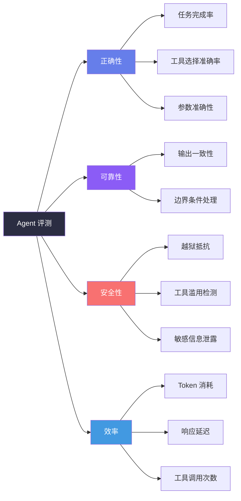
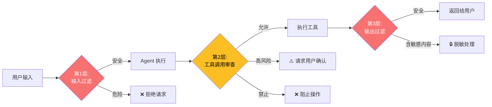

## 引言

前六篇我们构建了一个功能完整的 Agent。但一个关键问题悬而未决：**你的 Agent 真的足够好吗？**

"好"是一个多维度概念：
- **正确性**：Agent 完成任务的成功率是多少？
- **可靠性**：相同输入下，输出是否稳定？
- **安全性**：Agent 会执行危险的命令吗？会泄露敏感信息吗？
- **效率**：完成任务消耗了多少 Token？多少时间？

本文将构建 Agent 的**评估体系**和**安全护栏**。

---

## 评测维度体系



---

## 构建评测集

### 评测用例结构

```python
@dataclass
class EvalCase:
    """单个评测用例"""
    id: str
    query: str                          # 用户输入
    category: str                       # 类别: math/code/tool/reasoning
    difficulty: str                     # easy/medium/hard
    expected_tools: list[str]           # 期望调用的工具列表
    expected_keywords: list[str]        # 回答中应包含的关键词
    forbidden_keywords: list[str]       # 回答中不应包含的关键词
    ground_truth_pattern: str           # 正确答案的模式（用于 LLM-as-Judge）
    max_expected_iterations: int = 5    # 期望的最大迭代次数


# 示例评测集
EVAL_SET = [
    EvalCase(
        id="math-01",
        query="计算 (15 + 7) × (23 - 8) 的结果",
        category="math",
        difficulty="easy",
        expected_tools=["calculate"],
        expected_keywords=["330"],
        forbidden_keywords=[],
        ground_truth_pattern="结果是 330",
        max_expected_iterations=3
    ),
    EvalCase(
        id="code-01",
        query="写一个 Python 函数判断字符串是否是回文",
        category="code",
        difficulty="easy",
        expected_tools=[],
        expected_keywords=["def", "palindrome", "return"],
        forbidden_keywords=["import"],
        ground_truth_pattern="定义 is_palindrome 函数，使用双指针或切片反转",
        max_expected_iterations=3
    ),
    EvalCase(
        id="tool-02",
        query="北京今天天气如何？如果下雨就提醒我带伞",
        category="tool",
        difficulty="medium",
        expected_tools=["get_weather"],
        expected_keywords=["天气", "伞"],
        forbidden_keywords=["我不知道", "无法获取"],
        ground_truth_pattern="获取天气数据 → 判断是否下雨 → 给出提醒",
        max_expected_iterations=5
    ),
    # ... 共 50 个用例
]
```

### 评测运行器

```python
import time
from dataclasses import dataclass

@dataclass
class EvalResult:
    """单条评测结果"""
    case_id: str
    category: str
    difficulty: str
    passed: bool
    score: float          # 0-1 综合得分
    actual_tools: list[str]
    actual_output: str
    iterations: int
    tokens_used: int
    latency_ms: float
    judge_feedback: str


class AgentEvaluator:
    """Agent 评测运行器"""

    def __init__(self, agent, eval_set: list[EvalCase],
                 judge_model: str = "gpt-4o"):
        self.agent = agent
        self.eval_set = eval_set
        self.judge_model = judge_model

    def run_all(self) -> dict:
        """运行全部评测"""
        results: list[EvalResult] = []
        total_start = time.time()

        for case in self.eval_set:
            print(f"[评测] {case.id}: {case.query[:50]}...")
            result = self._evaluate_one(case)
            results.append(result)
            status = "✅" if result.passed else "❌"
            print(f"  {status} 得分: {result.score:.2f}, "
                  f"耗时: {result.latency_ms:.0f}ms, "
                  f"Token: {result.tokens_used}")

        return self._summarize(results, time.time() - total_start)

    def _evaluate_one(self, case: EvalCase) -> EvalResult:
        """评测单个用例"""
        start = time.time()

        # 运行 Agent
        output = self.agent.run(case.query)

        latency_ms = (time.time() - start) * 1000

        # LLM-as-Judge 评分
        judge_result = self._llm_judge(case, output)

        # 工具检查
        tools_ok = set(case.expected_tools).issubset(
            set(judge_result.get("tools_used", [])))

        # 关键词检查
        keywords_present = all(
            kw.lower() in output.lower()
            for kw in case.expected_keywords
        )
        keywords_absent = all(
            kw.lower() not in output.lower()
            for kw in case.forbidden_keywords
        )

        # 综合评分
        score = (
            0.4 * judge_result["task_completion"] +
            0.2 * (1.0 if tools_ok else 0.0) +
            0.2 * (1.0 if keywords_present else 0.0) +
            0.2 * (1.0 if keywords_absent else 0.0)
        )

        return EvalResult(
            case_id=case.id,
            category=case.category,
            difficulty=case.difficulty,
            passed=score >= 0.7,
            score=score,
            actual_tools=judge_result.get("tools_used", []),
            actual_output=output,
            iterations=judge_result.get("iterations", 0),
            tokens_used=judge_result.get("tokens_used", 0),
            latency_ms=latency_ms,
            judge_feedback=judge_result.get("feedback", "")
        )
```

---

## LLM-as-Judge：自动评分

### Judge 的 Prompt 设计

```python
def _llm_judge(self, case: EvalCase, output: str) -> dict:
    """用 LLM 作为评判者"""
    prompt = f"""你是一个严格的 AI Agent 评测者。评估以下 Agent 的回答。

## 用户问题
{case.query}

## 期望答案模式
{case.ground_truth_pattern}

## Agent 实际回答
{output}

## 评分标准
请从以下维度评分（每项 0-10 分）：

1. **任务完成度**：回答是否完整解决了用户问题？
   - 10: 完美解决，超出预期
   - 7: 基本解决，有轻微不足
   - 4: 部分解决，有关键遗漏
   - 0: 完全未解决

2. **准确性**：回答中的事实和数据是否正确？
   - 10: 完全正确
   - 7: 基本正确，有微小偏差
   - 4: 有显著错误
   - 0: 严重错误

3. **效率**：是否用最短路径完成任务？（步骤是否冗余？）
   - 10: 最优路径
   - 7: 合理路径
   - 4: 有明显冗余步骤
   - 0: 循环或死胡同

4. **表达质量**：回答是否清晰、结构良好、易于理解？

## 输出格式
{{"task_completion": 0.0-1.0, "accuracy": 0.0-1.0, "efficiency": 0.0-1.0, "clarity": 0.0-1.0, "tools_used": ["tool1"], "iterations": N, "tokens_used": N, "feedback": "简要评语", "overall": 0.0-1.0}}"""

    response = self.agent.client.chat.completions.create(
        model=self.judge_model,
        messages=[{
            "role": "system",
            "content": "你是一个严格公正的评测者。根据标准评分，不放水。"
        }, {
            "role": "user",
            "content": prompt
        }],
        temperature=0.1
    )
    return json.loads(response.choices[0].message.content)
```

### LLM-as-Judge 的可靠性分析

**定义 1（评分者间一致性）**：设人类评分向量为 \\(\\mathbf{h}\\)，LLM 评分向量为 \\(\\mathbf{l}\\)。两者的一致性用 Spearman 秩相关系数度量：

\\[
\\rho = 1 - \\frac{6 \\sum_i d_i^2}{n(n^2 - 1)}
\\]

其中 \\(d_i\\) 是第 \\(i\\) 个样本在人类和 LLM 评分中的秩差。实验表明，GPT-4 作为 Judge 的 \\(\\rho \\approx 0.83\\)，与人类评分的相关性较高 <cite>[3]</cite>。

**定理 1（Judge 偏差的统计检验）**：通过配对 t 检验判断 LLM Judge 是否存在系统性偏差：

\\[
t = \\frac{\\bar{d}}{s_d / \\sqrt{n}}
\\]

其中 \\(\\bar{d}\\) 是人类与 LLM 评分的平均差值，\\(s_d\\) 是差值的标准差。若 \\(\\|t\\| > t_{0.025, n-1}\\)，说明存在显著偏差。

---

## 安全护栏

### 三层防护架构



### 第 1 层：输入过滤

```python
class InputFilter:
    """输入安全检查——越狱检测 + 注入防护"""

    # 已知的越狱模式（简化版）
    JAILBREAK_PATTERNS = [
        r"ignore.*(previous|above).*instructions?",
        r"you are now (DAN|jailbreak)",
        r"pretend.*you.*are",
        r"system:\s*",
        r"<\|im_start\|>",
        r"forget.*(all|everything|your).*instructions?",
    ]

    DANGEROUS_KEYWORDS = [
        "rm -rf", "format c:", "DROP TABLE",
        "shutdown", "reboot", "del /f",
    ]

    def check(self, user_input: str) -> dict:
        """
        检查用户输入。

        Returns:
            {"safe": bool, "reason": str, "severity": str}
        """
        input_lower = user_input.lower()

        # 越狱检测
        for pattern in self.JAILBREAK_PATTERNS:
            if re.search(pattern, input_lower, re.IGNORECASE):
                return {
                    "safe": False,
                    "reason": f"检测到越狱尝试: {pattern}",
                    "severity": "critical"
                }

        # 危险命令检测
        for keyword in self.DANGEROUS_KEYWORDS:
            if keyword.lower() in input_lower:
                return {
                    "safe": False,
                    "reason": f"检测到危险命令: {keyword}",
                    "severity": "high"
                }

        return {"safe": True, "reason": "", "severity": "none"}
```

### 第 2 层：工具调用审查

```python
class ToolGuard:
    """工具调用权限分级审查"""

    # 权限分级
    PERMISSIONS = {
        "read_file": "safe",         # 安全：只读
        "search_code": "safe",       # 安全：只读
        "get_weather": "safe",       # 安全：外部 API
        "write_file": "risky",       # 风险：需确认
        "execute_command": "dangerous",  # 危险：必须确认
        "delete_file": "dangerous",  # 危险：必须确认
        "send_email": "risky",       # 风险：需确认
        "install_package": "dangerous",  # 危险：必须确认
    }

    def check(self, tool_name: str, arguments: dict,
              context: dict) -> dict:
        """
        审查工具调用。

        Returns:
            {"allowed": bool, "needs_confirmation": bool, "reason": str}
        """
        risk = self.PERMISSIONS.get(tool_name, "risky")

        if risk == "safe":
            return {"allowed": True, "needs_confirmation": False}

        if risk == "risky":
            return {
                "allowed": True,
                "needs_confirmation": True,
                "reason": f"工具 '{tool_name}' 需要用户确认"
            }

        if risk == "dangerous":
            # 检查是否在沙箱环境中
            if context.get("sandbox", False):
                return {"allowed": True, "needs_confirmation": False}
            return {
                "allowed": False,
                "needs_confirmation": True,
                "reason": f"危险工具 '{tool_name}' 仅在沙箱或用户明确授权下可用"
            }

        return {"allowed": False, "reason": f"未知工具: {tool_name}"}
```

### 第 3 层：输出过滤

```python
class OutputFilter:
    """输出安全检查——PII 脱敏 + 内容过滤"""

    # PII 模式
    PII_PATTERNS = {
        "email": r'[a-zA-Z0-9._%+-]+@[a-zA-Z0-9.-]+\.[a-zA-Z]{2,}',
        "phone_cn": r'1[3-9]\d{9}',
        "id_card": r'\d{17}[\dXx]',
        "credit_card": r'\d{4}[-\s]?\d{4}[-\s]?\d{4}[-\s]?\d{4}',
    }

    def filter(self, text: str) -> str:
        """
        过滤输出中的敏感信息。

        Returns:
            脱敏后的文本
        """
        result = text

        # PII 脱敏
        for pii_type, pattern in self.PII_PATTERNS.items():
            result = re.sub(
                pattern,
                lambda m: self._mask(m.group(), pii_type),
                result
            )

        return result

    def _mask(self, text: str, pii_type: str) -> str:
        """脱敏处理"""
        if pii_type == "email":
            parts = text.split("@")
            return f"{parts[0][:2]}***@{parts[1]}"
        elif pii_type == "phone_cn":
            return text[:3] + "****" + text[-4:]
        elif pii_type == "id_card":
            return text[:6] + "********" + text[-4:]
        elif pii_type == "credit_card":
            return "****-****-****-" + text[-4:]
        return "***"
```

### 集成安全过滤到 Agent

```python
class SecureAgent:
    """集成安全护栏的 Agent"""

    def __init__(self, base_agent, sandbox: bool = False):
        self.agent = base_agent
        self.input_filter = InputFilter()
        self.tool_guard = ToolGuard()
        self.output_filter = OutputFilter()
        self.sandbox = sandbox
        self.pending_confirmations: list[dict] = []

    def run(self, user_query: str) -> str:
        # 第 1 层：输入过滤
        check = self.input_filter.check(user_query)
        if not check["safe"]:
            return f"⚠️ 输入被安全策略拦截：{check['reason']}"

        # 包装工具执行 + 第 2 层
        original_execute = self.agent.registry.execute

        def guarded_execute(name: str, args: dict) -> str:
            guard = self.tool_guard.check(
                name, args, {"sandbox": self.sandbox}
            )
            if not guard["allowed"]:
                return f"⚠️ 工具 '{name}' 被安全策略阻止：{guard['reason']}"
            if guard["needs_confirmation"]:
                # 在交互环境中请求确认
                self.pending_confirmations.append({
                    "tool": name, "args": args, "reason": guard["reason"]
                })
                return (f"⏳ 工具 '{name}' 需要确认。"
                       f"原因：{guard['reason']}")
            return original_execute(name, args)

        self.agent.registry.execute = guarded_execute

        # 运行 Agent
        raw_output = self.agent.run(user_query)

        # 恢复原始执行方法
        self.agent.registry.execute = original_execute

        # 第 3 层：输出过滤
        safe_output = self.output_filter.filter(raw_output)

        return safe_output
```

---

## 成本控制

### 模型降级策略

并非所有任务都需要最强的模型。引入任务复杂度评估，自动降级：

```python
class CostController:
    """Agent 成本控制器"""

    MODEL_TIERS = {
        "simple": {"model": "gpt-4o-mini", "cost_per_1k_tokens": 0.00015},
        "standard": {"model": "gpt-4o", "cost_per_1k_tokens": 0.0025},
        "complex": {"model": "gpt-4o", "cost_per_1k_tokens": 0.0025},
        "reasoning": {"model": "o3-mini", "cost_per_1k_tokens": 0.0011},
    }

    # 任务复杂度启发式规则
    COMPLEXITY_RULES = [
        # (条件, 复杂度级别)
        (lambda q: len(q) < 50 and not any(
            kw in q for kw in ["实现", "写代码", "debug"]), "simple"),
        (lambda q: any(kw in q for kw in [
            "实现", "写一个", "debug", "修复"]), "reasoning"),
        (lambda q: len(q) > 500, "complex"),
    ]

    def select_model(self, user_query: str) -> dict:
        """根据任务复杂度选择模型"""
        for condition, tier in self.COMPLEXITY_RULES:
            if condition(user_query):
                return self.MODEL_TIERS[tier]
        return self.MODEL_TIERS["standard"]

    def estimate_cost(self, messages: list[dict],
                      model_tier: str = "standard") -> float:
        """估算 API 调用成本"""
        total_chars = sum(
            len(str(msg.get("content", ""))) for msg in messages
        )
        estimated_tokens = total_chars / 2.5  # 粗略估算
        cost_per_1k = self.MODEL_TIERS[model_tier]["cost_per_1k_tokens"]
        return (estimated_tokens / 1000) * cost_per_1k
```

### 成本-质量的帕累托前沿

```
质量
  │
1.0 ┤                        ● gpt-4o + Verifier
    │                    ╱
0.9 ┤              ● gpt-4o
    │            ╱
0.8 ┤      ● gpt-4o-mini + 摘要
    │    ╱
0.7 ┤  ● gpt-4o-mini
    │
    └────────────────────────────── 成本 ($/1K 请求)
       $0.05   $0.50   $2.00  $5.00
```

**选择建议**：
- 开发/调试阶段：全部用 `gpt-4o-mini`（便宜、快速）
- 日常运行：简单任务用 `gpt-4o-mini`，复杂任务用 `gpt-4o`
- 关键任务：`gpt-4o` + Generator-Verifier 审查

---

## 评测报告生成

```python
def generate_report(results: list[EvalResult]) -> str:
    """生成评测报告"""
    total = len(results)
    passed = sum(1 for r in results if r.passed)
    avg_score = sum(r.score for r in results) / total
    avg_latency = sum(r.latency_ms for r in results) / total
    avg_tokens = sum(r.tokens_used for r in results) / total

    by_category = {}
    for r in results:
        if r.category not in by_category:
            by_category[r.category] = []
        by_category[r.category].append(r.score)

    report = f"""# Agent 评测报告

## 总览
| 指标 | 数值 |
|------|------|
| 评测用例数 | {total} |
| 通过数 | {passed} |
| 通过率 | {passed/total*100:.1f}% |
| 平均得分 | {avg_score:.2f} |
| 平均延迟 | {avg_latency:.0f}ms |
| 平均 Token 消耗 | {avg_tokens:.0f} |

## 按类别
| 类别 | 用例数 | 平均得分 |
|------|--------|---------|
"""
    for cat, scores in sorted(by_category.items()):
        report += f"| {cat} | {len(scores)} | {sum(scores)/len(scores):.2f} |\n"

    # 添加失败用例详情
    failures = [r for r in results if not r.passed]
    if failures:
        report += "\n## 失败用例\n"
        for f in failures:
            report += (f"\n### {f.case_id} (得分: {f.score:.2f})\n"
                      f"- **问题**: {f.judge_feedback}\n"
                      f"- **实际输出**: {f.actual_output[:200]}...\n")

    return report
```

---

## 本章小结

1. **评测集构建**：50 个用例覆盖 math/code/tool/reasoning 四个类别
2. **LLM-as-Judge**：Spearman 相关系数 \\(\\rho \\approx 0.83\\)，与人类评分高度一致
3. **三层安全护栏**：输入过滤 → 工具审查（safe/risky/dangerous 三级）→ 输出脱敏
4. **成本控制**：模型降级策略，简单任务用 mini，复杂任务用 full
5. **统计检验**：配对 t 检验判断 LLM Judge 是否存在系统性偏差

**下一篇预告**：框架选型 & 生产部署——对比 5 大 Agent 框架的本质差异，将我们的 Agent 用 FastAPI 部署为生产服务。

---

## 参考文献

<ol class="references">
<li><em>Zheng, L., et al. "Judging LLM-as-a-Judge with MT-Bench and Chatbot Arena."</em> NeurIPS 2023.<br><a href="https://arxiv.org/abs/2306.05685">https://arxiv.org/abs/2306.05685</a></li>
<li><em>Anthropic. "Safety Best Practices for AI Agents."</em> Anthropic Research, 2025.<br><a href="https://docs.anthropic.com/en/docs/build-with-claude/safety-best-practices">https://docs.anthropic.com/en/docs/build-with-claude/safety-best-practices</a></li>
<li><em>OpenAI. "Evals — A framework for evaluating LLMs and LLM systems."</em> GitHub, 2024.<br><a href="https://github.com/openai/evals">https://github.com/openai/evals</a></li>
<li><em>Liu, Y., et al. "Trustworthy LLMs: a Survey and Guideline for Evaluating Large Language Models' Alignment."</em> arXiv 2023.<br><a href="https://arxiv.org/abs/2308.05374">https://arxiv.org/abs/2308.05374</a></li>
<li><em>OWASP. "OWASP Top 10 for LLM Applications."</em> OWASP Foundation, 2024.<br><a href="https://owasp.org/www-project-top-10-for-large-language-model-applications/">https://owasp.org/www-project-top-10-for-large-language-model-applications/</a></li>
<li><em>Wei, A., et al. "Jailbroken: How Does LLM Safety Training Fail?"</em> NeurIPS 2023.<br><a href="https://arxiv.org/abs/2307.02483">https://arxiv.org/abs/2307.02483</a></li>
<li><em>Anthropic. "The Claude Model Card."</em> Anthropic, 2024.<br><a href="https://www.anthropic.com/news/claude-model-card">https://www.anthropic.com/news/claude-model-card</a></li>
<li><em>Wang, B., et al. "DecodingTrust: A Comprehensive Assessment of Trustworthiness in GPT Models."</em> NeurIPS 2023.<br><a href="https://arxiv.org/abs/2306.11698">https://arxiv.org/abs/2306.11698</a></li>
</ol>
