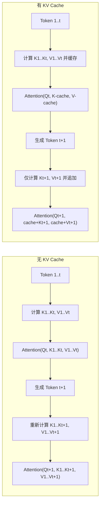
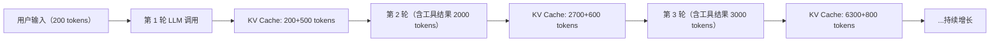
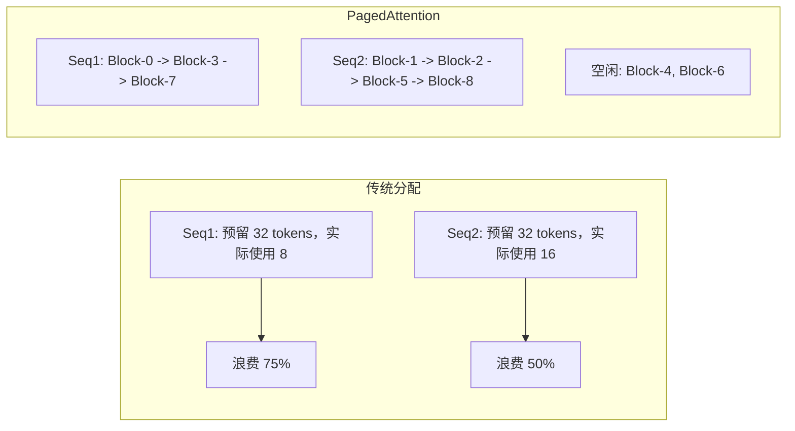

## 引言

当你的 Agent 在一个循环中调用 LLM 50 次（这在多步推理中很常见），每次调用都从头计算所有 token 的注意力——这不仅浪费算力，更是延迟和费用的杀手。

**KV Cache** 正是解决这个问题的核心技术。它不是锦上添花的优化，而是 LLM 推理的基础设施。不理解 KV Cache，就无法理解 Agent 的成本结构和延迟瓶颈。

本文将带你从矩阵运算出发，建立对 KV Cache 的完整认知。

## 为什么需要 KV Cache？

### 自回归生成的冗余计算

LLM 的自回归生成过程：给定前文 \\( x_{1:t-1} \\)，预测第 \\( t \\) 个 token \\( x_t \\) 。每一轮，我们需要计算：

\\[
\text{Attention}(Q, K, V) = \text{softmax}\left(\frac{QK^T}{\sqrt{d_k}}\right)V
\\]

其中 \\( Q, K, V \in \mathbb{R}^{t \times d_k} \\) 是当前序列长度 \\( t \\) 的矩阵。

**关键观察**：当生成第 \\( t+1 \\) 个 token 时，前 \\( t \\) 个 token 的 K 和 V 向量与生成第 \\( t \\) 个 token 时**完全相同**。唯一新增的计算是：
- 第 \\( t+1 \\) 个 token 的 Q、K、V 向量
- 第 \\( t+1 \\) 个 Q 对所有 K 的注意力

这构成了 KV Cache 的基本动机——**缓存已计算的 K 和 V，避免重复计算**。



### 计算量对比

对于序列长度 \\( n \\)，单层单头的自注意力计算量：

| 阶段 | 无 KV Cache | 有 KV Cache |
|------|------------|------------|
| 第1个 token | \\( O(n^2 d) \\) | \\( O(n^2 d) \\) |
| 第2个 token | \\( O((n+1)^2 d) \\) | \\( O(n \cdot d) \\) |
| 第k个 token | \\( O((n+k)^2 d) \\) | \\( O((n+k) \cdot d) \\) |

KV Cache 将生成阶段的注意力计算从**二次复杂度降为线性复杂度**。配合 FlashAttention <cite>[2]</cite> 等 IO-aware 算法，实际推理速度可提升 2-4 倍。

## KV Cache 的显存数学

### 显存占用公式

对于给定的模型和输入，KV Cache 的显存占用：

\\[
M_{\text{KV}} = 2 \times L \times H \times d_h \times n \times B \times P
\\]

其中：
- \\( L \\) = 层数（如 Llama-3-8B: 32 层）
- \\( H \\) = 每层注意力头数（32 头）
- \\( d_h \\) = 每头维度（128）
- \\( n \\) = 序列长度（token 数）
- \\( B \\) = batch size
- \\( P \\) = 精度字节数（FP16 = 2, INT8 = 1, INT4 = 0.5）
- 系数 2 是因为 K 和 V 各一份

**实际计算示例**（Llama-3-8B, batch=1, FP16）：

\\[
M_{\text{KV}}(n) = 2 \times 32 \times 32 \times 128 \times n \times 1 \times 2 \\\\
= 524,288 \times n \text{ bytes} \\\\
\approx 0.5 \text{ MB / token}
\\]

这意味着：
- 4K token 上下文 → ~2 GB
- 32K token 上下文 → ~16 GB
- 128K token 上下文 → ~64 GB（仅 KV Cache！）

### Agent 场景的特殊性

Agent 通常在一个会话中进行**多轮 LLM 调用**。每一轮都累积 KV Cache：



这就是为什么 Agent 的上下文窗口管理（第3篇的对话管理）与 KV Cache 密切相关——**长上下文不仅消耗 token 预算，还消耗显存**。

## PagedAttention 与 vLLM

### KV Cache 的内存碎片问题

传统的 KV Cache 为每个序列预分配**连续显存块**（大小为 max_seq_len × cache_size_per_token）。这导致：
- **内部碎片**：实际序列长度 < max_seq_len 时浪费显存
- **外部碎片**：多个序列的分配/释放导致显存碎片
- **低利用率**：限制了 serving 的并发数

### PagedAttention 的核心思想

vLLM 的 PagedAttention <cite>[1]</cite> 借鉴了操作系统的**虚拟内存分页**机制：

- 将 KV Cache 划分为固定大小的 **block**（如 16 个 token）
- Block 不需要物理连续，通过**页表**映射
- 新 token 追加时分配新 block，序列结束时释放所有 block



**实际效果**：PagedAttention 可以将显存利用率从 20-40% 提升到 **80-95%**，在相同硬件上支持 2-4 倍的并发请求。

### Prefix Caching

更进一步，如果多个请求共享相同的 system prompt（Agent 场景极其常见），vLLM 可以**共享 prefix 的 KV Cache block**：

```
请求 A: [System Prompt (2000 tokens)] → [User Msg A] → [Agent Response A]
请求 B: [System Prompt (2000 tokens)] → [User Msg B] → [Agent Response B]
                                  ↑
                         这部分 KV Cache 完全共享！
```

这在 Agent serving 场景中节省 30-50% 的显存。

## KV Cache 量化

### 量化的数学本质

KV Cache 量化是将 K/V 激活值从 FP16 压缩到低精度：

\\[
\hat{x} = \text{round}\left(\frac{x - \text{offset}}{\text{scale}}\right) \times \text{scale} + \text{offset}
\\]

关键挑战在于 K/V 激活的**分布特性**与权重不同：
- 权重分布相对稳定，可以预先标定
- K/V 激活随输入动态变化，需要**在线标定**
- 某些注意力头对量化误差极为敏感（"heavy hitter" 现象）

### 量化精度对比

| 精度 | 每token显存 | 8B模型32K显存 | 质量影响 |
|------|-----------|-------------|---------|
| FP16 | 0.5 MB | 16 GB | 无 |
| INT8 | 0.25 MB | 8 GB | < 0.5% 困惑度损失 |
| INT4 | 0.125 MB | 4 GB | 1-2% 困惑度损失 |
| FP8 (H100+) | 0.25 MB | 8 GB | 极小 |

实际选择取决于任务敏感度：
- **代码生成 Agent**：建议 INT8，代码质量对精度更敏感
- **对话/摘要 Agent**：INT4 通常可接受
- **数学推理 Agent**：FP16 或 INT8，精度损失可能引起计算错误

## Agent 开发者的实践指南

### 选择合适的推理引擎

| 引擎 | 特点 | 适用场景 |
|------|------|---------|
| vLLM | PagedAttention, prefix caching, 高吞吐 | 生产环境 API serving |
| llama.cpp | CPU/GPU 混合, 多种量化格式 | 本地 Agent, 边缘部署 |
| SGLang | RadixAttention, 结构化生成 | 复杂 Agent 工作流 <cite>[3]</cite> |
| HuggingFace TGI | 易用, 生态好 | 快速原型 |

### 降低 Agent 的 KV Cache 压力的策略

1. **复用 system prompt**：所有请求使用相同的 system prompt，利用 prefix caching
2. **及时清理历史**：当对话超出需要时，截断或摘要（见第3篇），释放 KV Cache
3. **批量处理**：将独立工具调用结果合并到一次 LLM 调用中
4. **选择合适的模型规模**：Agent 循环中的每一步不一定需要最强模型——简单的工具选择可以用小模型

### 监控指标

部署 Agent 服务时，关注以下指标：
- **TTFT**（Time to First Token）：包括 prefill 阶段的计算 + KV Cache 分配
- **ITL**（Inter-Token Latency）：每个 decode token 的延迟，受 KV Cache 大小直接影响
- **Cache Hit Rate**：prefix caching 的命中率
- **显存碎片率**：已分配但未使用的显存比例

## 总结

KV Cache 看似是推理引擎的内部优化，但实际上它深刻影响着 Agent 的设计决策：

- **为什么要把 system prompt 固定下来？** → 为了 prefix caching
- **为什么 Agent 循环不能无限长？** → KV Cache 在吃掉显存
- **为什么工具返回要精简？** → 不仅省 token，还省显存
- **8B vs 70B 模型的选择不仅是质量问题** → 70B 的 KV Cache 消耗是 8B 的 ~10 倍

理解 KV Cache，你才能理解 Agent 的成本结构。

---

## 参考文献

<ol class="references">
<li><em>Kwon, W., et al. "Efficient Memory Management for Large Language Model Serving with PagedAttention."</em> SOSP 2023.<br><a href="https://arxiv.org/abs/2309.06180">https://arxiv.org/abs/2309.06180</a></li>
<li><em>Dao, T., et al. "FlashAttention: Fast and Memory-Efficient Exact Attention with IO-Awareness."</em> NeurIPS 2022.<br><a href="https://arxiv.org/abs/2205.14135">https://arxiv.org/abs/2205.14135</a></li>
<li><em>Sheng, Y., et al. "SGLang: Efficient Execution of Structured Language Model Programs."</em> NeurIPS 2024.<br><a href="https://arxiv.org/abs/2312.07104">https://arxiv.org/abs/2312.07104</a></li>
</ol>
