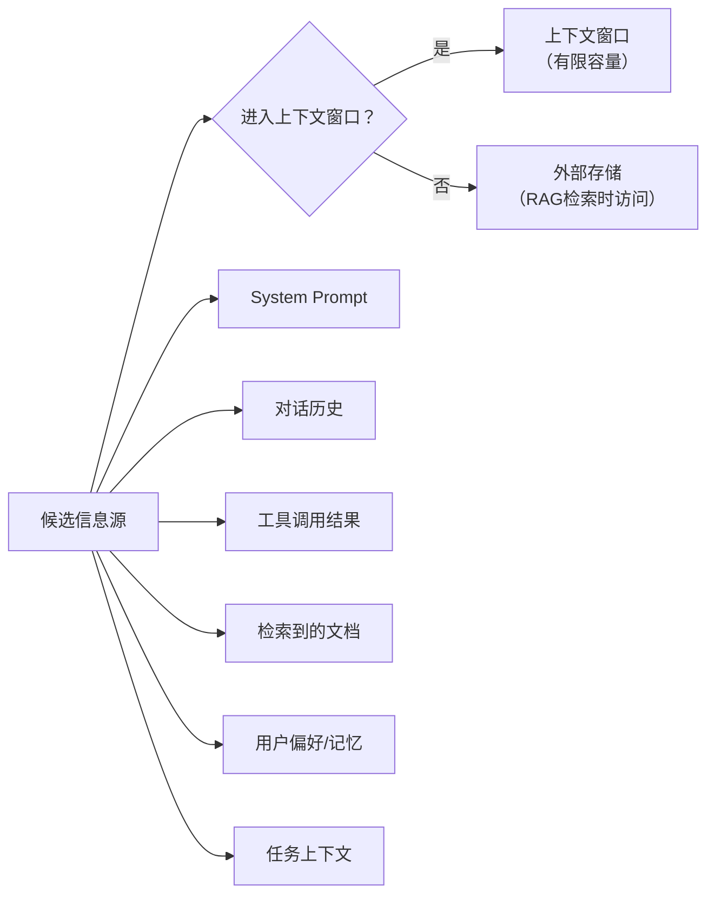

## 引言

"Prompt Engineering 就是写提示词"——这是 2023 年的认知。到了 2026 年，Prompt Engineering 已经演变为一个系统工程问题：**如何将任务需求、领域知识、约束条件和交互历史编码到有限的上下文窗口中，使得 LLM 的输出尽可能准确、稳定、低成本**。

DeepSeek 的 Harness 岗位描述中，Prompt Engineering 与 Context Engineering、Harness Engineering 并列。这不是巧合——三者共同构成了 Agent 与 LLM 之间的**接口层**。

## Prompt 的信息论视角

### Prompt 作为有损压缩

一个反直觉的认知：**Prompt 的本质是有损压缩**。你需要将复杂任务的全部信息压缩到几千 token 中，而 LLM 需要解压这些信息来完成任务。

\\[
\text{Task Information} \gg \text{Prompt Capacity} \ll \text{Context Window}
\\]

这揭示了 Prompt Engineering 的核心矛盾：**信息密度 vs 可理解性**。

### 信息损失的三个来源


- **损失1**：很多隐性知识难以用语言精确表达
- **损失2**：token 限制迫使你省略细节
- **损失3**：模型可能以不同于预期的方向解读 prompt

好的 Prompt Engineering 就是**在给定 token 预算下最小化这三层信息损失**。

## System Prompt 架构设计

### 结构分层

一个生产级的 System Prompt 应该有清晰的分层结构：

```
┌─────────────────────────────────────┐
│ Layer 1: 角色定义 (Role Identity)     │  ← 你是谁，你的能力边界
├─────────────────────────────────────┤
│ Layer 2: 行为准则 (Behavior Rules)    │  ← 你应该怎么做，不应该怎么做
├─────────────────────────────────────┤
│ Layer 3: 工具定义 (Tool Definitions)  │  ← 你可以使用什么工具，怎么用
├─────────────────────────────────────┤
│ Layer 4: 格式规范 (Output Format)     │  ← 你的输出应该长什么样
├─────────────────────────────────────┤
│ Layer 5: 知识注入 (Knowledge Injection)│  ← 你需要知道什么领域知识
├─────────────────────────────────────┤
│ Layer 6: 示例 (Examples)             │  ← Few-shot 示例
└─────────────────────────────────────┘
```

### 各层的设计原则

**Layer 1 — 角色定义**：精确描述 Agent 的身份边界

✅ 好："你是一个代码审查助手，专注于发现 Python 代码中的安全漏洞和性能问题。你不出于安全/性能之外的任何建议。"
❌ 差："你是一个编程专家，请帮助用户解决问题。"

**Layer 2 — 行为准则**：用肯定句描述期望行为，必要时使用否定句划定边界

```
你应当：
- 在给出建议前，首先理解用户代码的上下文
- 解释每个问题背后的原理

你不应当：
- 修改代码的功能性行为
- 对代码风格提出主观意见
```

**Layer 3 — 工具定义**：这个我们已经在第2篇中详细讨论过。关键是让工具描述对 LLM 友好。

**Layer 4 — 格式规范**：使用结构化的输出约束减少歧义

**Layer 5 — 知识注入**：领域术语表、API 文档摘要、常见陷阱

**Layer 6 — Few-Shot 示例**：见下节

### Token 预算分配

一个典型的 4000-token System Prompt 的预算分配建议：

| 层级 | 建议占比 | 理由 |
|------|---------|------|
| 角色定义 | 5-8% | 简洁即可，但要精确 |
| 行为准则 | 15-20% | 直接影响输出质量 |
| 工具定义 | 30-40% | Agent 场景中占比最大 |
| 格式规范 | 5-10% | 开销小但价值高 |
| 知识注入 | 15-25% | 取决于领域复杂度 |
| Few-Shot | 10-20% | 质量高但边际收益递减 |

## Few-Shot 选择的数学策略

### 随机选择的局限

最简单的 Few-Shot 是随机选几个示例。但这有两个问题：
- **冗余**：选了高度相似的示例
- **遗漏**：没覆盖边缘情况

### MMR（最大边际相关性）采样

借用信息检索中的 MMR 算法 <cite>[1]</cite> 来选择多样性高的示例：

\\[
\text{MMR}(d_i) = \lambda \cdot \text{Sim}(d_i, q) - (1 - \lambda) \cdot \max_{d_j \in S} \text{Sim}(d_i, d_j)
\\]

其中：
- \\( \text{Sim}(d_i, q) \\)：候选示例与查询的相关性
- \\( \max_{d_j \in S} \text{Sim}(d_i, d_j) \\)：候选示例与已选示例的最大相似度
- \\( \lambda \\)：平衡相关性与多样性

```python
def mmr_select(examples, query_embedding, k, lambda_=0.7):
    """MMR 算法选择 k 个多样化的 Few-Shot 示例"""
    selected = []
    remaining = list(range(len(examples)))
    
    # 第一个：选最相关的
    first = max(remaining, key=lambda i: cosine_sim(examples[i].embedding, query_embedding))
    selected.append(first)
    remaining.remove(first)
    
    # 后续：MMR 选择
    for _ in range(k - 1):
        best = max(remaining, key=lambda i: 
            lambda_ * cosine_sim(examples[i].embedding, query_embedding) -
            (1 - lambda_) * max(cosine_sim(examples[i].embedding, examples[j].embedding) 
                                for j in selected))
        selected.append(best)
        remaining.remove(best)
    
    return selected
```

### Few-Shot 的边际收益递减

实验表明，Few-Shot 示例数量与性能提升不是线性关系：

\\[
\text{Gain}(n) \propto \frac{1}{\sqrt{n}}
\\]

通常 **3-5 个精心选择的示例** 就可以捕获大部分收益。更多的示例不仅消耗 token，还可能导致模型过度拟合示例中的特定模式。

## Context Engineering

### 什么应该进入上下文窗口？

Context Engineering 是 Prompt Engineering 的延伸——它关注的是**信息选择**。Liu et al. 的研究 <cite>[3]</cite> 表明，LLM 对上下文中间位置的信息利用效率最低（"Lost in the Middle" 现象），这进一步强化了信息排序和选择的重要性：



决策框架：
- **必入**：当前任务必需的信息
- **应入**：可能影响决策的信息，且体积可控
- **择入**：相关性高但体积大的信息（用 RAG 替代直接放入）
- **不入**：已过期、已解决、或与新任务无关的信息

### 信息密度的优化

不是最小化 token 数，而是**最大化信息密度**：

\\[
\text{Information Density} = \frac{\text{有用信息量}}{\text{消耗的 Token 数}}
\\]

实践技巧：
- 用结构化格式（JSON, YAML）代替自然语言描述结构化数据
- 去除礼貌用语和冗余修饰（对 LLM 而言，"请"和"谢谢"不增加信息量）
- 工具返回结果做摘要后再放入上下文

## DSPy 式自动优化

### 手动 Prompt Engineering 的问题

手动调 prompt 是**不可复现、不可扩展、不可迁移**的。一个 prompt 在 GPT-4 上表现好，在 Claude 上可能完全不行。

DSPy <cite>[2]</cite> 的核心思想：**将 Prompt Engineering 转化为优化问题**。

\\[
\theta^* = \arg\max_\theta \mathbb{E}_{(x,y) \sim \mathcal{D}} [\text{Metric}(f_\theta(x), y)]
\\]

其中 \\( \theta \\) 是 prompt 的参数（如 Few-Shot 示例的选择、指令的措辞），\\( f_\theta \\) 是 LLM 在 prompt \\( \theta \\) 下的行为。

### 自动优化的层次

| 层次 | 优化内容 | 方法 |
|------|---------|------|
| 示例选择 | 选哪些 Few-Shot 示例 | MMR, Embedding 检索 |
| 指令优化 | 指令措辞 | LLM 自我反思 + A/B 测试 |
| 结构优化 | 输出格式 | 约束解码, Grammar |
| 组合优化 | 多 prompt 编排 | 路由, 级联 |

## 总结

从"写提示词"到"系统工程"，Prompt Engineering 的进化反映了 Agent 工程化的宏观趋势：

1. **System Prompt → 分层结构化设计**，而不是一长段自然语言
2. **Few-Shot → 基于多样性采样的自动选择**，而不是人工挑选
3. **Context Engineering → 信息密度优先**，而不是越多越好
4. **手动调优 → DSPy 式自动优化**，让模型自己找到最佳 prompt

一个值得反思的事实：最好的 Agent 开发者往往不是 prompt 写得最"花哨"的人，而是**最清楚什么信息需要进入上下文窗口、什么信息不需要**的人。

---

## 参考文献

<ol class="references">
<li><em>Carbonell, J. & Goldstein, J. "The Use of MMR, Diversity-Based Reranking for Reordering Documents."</em> SIGIR 1998.<br><a href="https://dl.acm.org/doi/10.1145/290941.291025">https://dl.acm.org/doi/10.1145/290941.291025</a></li>
<li><em>Khattab, O., et al. "DSPy: Compiling Declarative Language Model Calls into Self-Improving Pipelines."</em> NeurIPS 2024.<br><a href="https://arxiv.org/abs/2310.03714">https://arxiv.org/abs/2310.03714</a></li>
<li><em>Liu, N. F., et al. "Lost in the Middle: How Language Models Use Long Contexts."</em> TACL 2024.<br><a href="https://arxiv.org/abs/2307.03172">https://arxiv.org/abs/2307.03172</a></li>
</ol>
