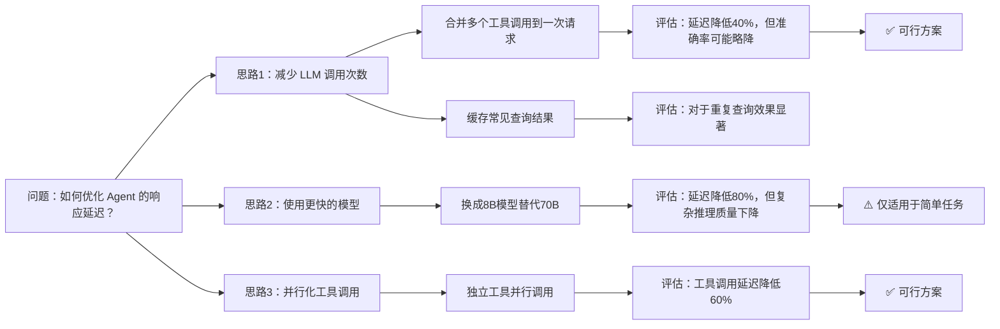
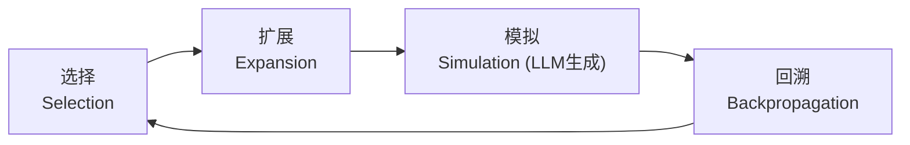
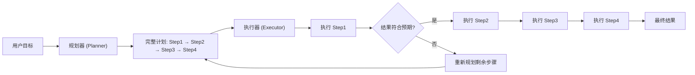

## 引言

AI Agent 和普通聊天机器人的本质区别是什么？不是工具调用，不是记忆系统——而是**推理与规划能力**。

一个真正的 Agent 需要在开放目标下思考："我应该先做什么？有哪些可能的路径？如果这条路走不通怎么办？" 这背后是 LLM 推理（Reasoning）与规划（Planning）的核心问题。

DeepSeek 的 Harness 岗位描述中，Reasoning 和 Planning 被列为与 Agent Loop、Tool Use 并列的核心知识点。本文将系统对比四种推理范式，并给出数学原理与实际选型建议。

## 推理 vs 规划：一个关键区分

虽然常被并列提及，但 Reasoning 和 Planning 在本质上是不同层次的认知活动：

| 维度 | Reasoning（推理） | Planning（规划） |
|------|------------------|-----------------|
| 本质 | 从已知推导未知 | 从当前状态规划到达目标的路径 |
| 核心操作 | 逻辑演绎、归纳、类比 | 状态搜索、路径分解、资源分配 |
| 数学基础 | 逻辑学、概率论 | 搜索理论、优化理论、MDP |
| 典型技术 | CoT, Self-Consistency | ToT, MCTS, Plan-and-Execute |
| 产出 | 结论、判断、分析 | 步骤序列、行动方案 |

在 Agent 的实际运行中，两者紧密交织：**规划需要推理来评估每一步的可行性，推理需要规划来组织思考的步骤**。

## Chain-of-Thought：推理的基础范式

### 数学直觉

Chain-of-Thought（CoT）<cite>[1]</cite> 的核心思想是：将复杂推理问题分解为中间步骤。从概率角度看：

\\[
P(y \mid x) = \sum_{z_1, z_2, ..., z_k} P(y \mid z_k, x) \prod_{i=1}^{k} P(z_i \mid z_{i-1}, ..., z_1, x)
\\]

其中 \\( z_i \\) 是中间推理步骤。CoT 不是改变了模型的能力，而是**改变了概率质量在 token 空间中的分配方式**——通过将计算分摊到多个中间 token 上，让模型有更多的"思考空间"。

### Self-Consistency：多数投票的力量

Wang et al. <cite>[2]</cite> 提出 Self-Consistency：采样多条推理路径，选择最一致的答案。

\\[
y^* = \arg\max_y \sum_{i=1}^{N} \mathbb{1}[f(\text{CoT}_i(x)) = y]
\\]

直觉：对于有唯一正确答案的推理任务，正确的推理过程虽然表述不同，但结论应该一致；而错误的推理往往导致分散的答案。

### CoT 的局限

- **线性思维**：CoT 是一条直线，无法探索分支
- **错误传播**：早期步骤的错误会级联放大
- **没有回溯**：发现走错路后无法"回头重新想"

## Tree-of-Thoughts：把推理变成搜索

### 核心思想

Tree-of-Thoughts（ToT）<cite>[3]</cite> 将推理重新定义为**在思维空间中的树搜索问题**：



ToT 的每一步包括两个操作：
1. **生成（Generate）**：从当前节点生成可能的下一步思考
2. **评估（Evaluate）**：对每个候选思考打分，决定是否继续探索

### BFS vs DFS 策略

\\[
\text{BFS}: \text{Score}(z_{1:k}) = \frac{1}{k} \sum_{i=1}^{k} \log P_\theta(z_i \mid z_{1:i-1}, x)
\\]

\\[
\text{DFS}: \text{Select} = \arg\max_{z \in \text{candidates}} V_\theta(z \mid \text{path})
\\]

- **BFS**：每层展开所有候选，保留 top-K，再展开下一层。适合需要全局比较的推理。
- **DFS**：沿一条路径深入，遇到死路再回溯。适合路径很可能唯一正确的推理。

### 蒙特卡洛树搜索（MCTS）与 LLM

AlphaGo 式的 MCTS 也可以用于 LLM 推理：



在每一步：
1. **Selection**：从根节点沿 UCB 最大的路径下降
2. **Expansion**：在当前节点用 LLM 生成可能的下一步
3. **Simulation**：快速 rollout 到终止状态，获取 reward
4. **Backpropagation**：将 reward 沿路径回传，更新节点统计

\\[
\text{UCB}(s, a) = Q(s, a) + c \sqrt{\frac{\ln N(s)}{N(s, a)}}
\\]

其中 \\( Q(s, a) \\) 是状态-动作对的平均 reward，\\( N(s) \\) 是状态访问次数，\\( c \\) 控制探索/利用平衡。

## ReAct vs Plan-and-Execute：Agent 的两大范式

### ReAct：边想边做

ReAct（Reasoning + Acting）<cite>[4]</cite> 将推理和行动交错进行：

```
Thought → Action → Observation → Thought → Action → Observation → ...
```

**优势**：灵活，能根据环境反馈实时调整
**劣势**：缺乏全局规划，可能在局部最优中迷失

### Plan-and-Execute：先规划后执行

Plan-and-Execute 范式将规划和执行分离：



**优势**：全局视野，步骤间有清晰依赖关系
**劣势**：环境变化时需要重新规划，开销大

### 混合策略

现代 Agent 框架（如 Claude Code）采用混合策略：

```
高层次 Plan-and-Execute（整体任务规划）
    ↓
    每个 Plan Step 内使用 ReAct（处理执行中的不确定性）
        ↓
        遇到重大偏离时触发 Re-plan
```

这类似于人类的工作方式：先有一个大致的"待办清单"，然后在每个具体任务中灵活应对。

## 推理时计算 Scaling

### 推理时计算的 Scaling Law

OpenAI 的研究 <cite>[5]</cite> 表明，推理时计算（test-time compute）也遵循 scaling law：

\\[
\text{Performance} \propto \log(\text{Inference Compute})
\\]

具体而言，有两种 scaling 方式：
- **串行 Scaling**：生成更长的 CoT、更多的推理步骤
- **并行 Scaling**：生成多条推理路径，取最优（如 Self-Consistency、Best-of-N）

两者的计算效率不同：

\\[
\text{Efficiency}_{\text{parallel}} = \frac{\Delta \text{Performance}}{\Delta \text{Compute}} \approx \frac{1}{\sqrt{N}}
\\]

\\[
\text{Efficiency}_{\text{sequential}} = \frac{\Delta \text{Performance}}{\Delta \text{Compute}} \propto \frac{1}{\text{steps}^\alpha}, \alpha < 0.5
\\]

这意味着**串行推理比并行采样的边际收益递减更慢**——在计算预算有限时，优先让模型"多想几步"而不是"多想几条路"。

### Agent 场景的实用建议

| 任务类型 | 推荐策略 | 理由 |
|---------|---------|------|
| 代码生成 | CoT + Self-Consistency | 答案是确定的，多条路径投票有效 |
| 复杂调试 | ToT (BFS, depth=3) | 需要探索多种假设 |
| 多步任务执行 | Plan-and-Execute + ReAct | 全局规划 + 局部灵活 |
| 数学证明 | CoT with verification | 需要验证而非投票 |
| 创意写作 | 简单 CoT | 不存在唯一正确答案 |

## 总结

推理与规划不是 Agent 的"高级功能"，而是 Agent 区别于普通 chatbot 的核心能力。理解 CoT、ToT、ReAct、Plan-and-Execute 四种范式及其数学基础，是设计有效 Agent 的前提。

一个实用的判断框架：
- **简单确定性任务** → CoT
- **需要探索多路径** → ToT
- **环境动态变化** → ReAct
- **多步依赖任务** → Plan-and-Execute
- **复杂 Agent 系统** → 混合策略

---

## 参考文献

<ol class="references">
<li><em>Wei, J., et al. "Chain-of-Thought Prompting Elicits Reasoning in Large Language Models."</em> NeurIPS 2022.<br><a href="https://arxiv.org/abs/2201.11903">https://arxiv.org/abs/2201.11903</a></li>
<li><em>Wang, X., et al. "Self-Consistency Improves Chain of Thought Reasoning in Language Models."</em> ICLR 2023.<br><a href="https://arxiv.org/abs/2203.11171">https://arxiv.org/abs/2203.11171</a></li>
<li><em>Yao, S., et al. "Tree of Thoughts: Deliberate Problem Solving with Large Language Models."</em> NeurIPS 2023.<br><a href="https://arxiv.org/abs/2305.10601">https://arxiv.org/abs/2305.10601</a></li>
<li><em>Yao, S., et al. "ReAct: Synergizing Reasoning and Acting in Language Models."</em> ICLR 2023.<br><a href="https://arxiv.org/abs/2210.03629">https://arxiv.org/abs/2210.03629</a></li>
<li><em>Snell, C., et al. "Scaling LLM Test-Time Compute Optimally can be More Effective than Scaling Model Parameters."</em> NeurIPS 2024.<br><a href="https://arxiv.org/abs/2408.03314">https://arxiv.org/abs/2408.03314</a></li>
</ol>
