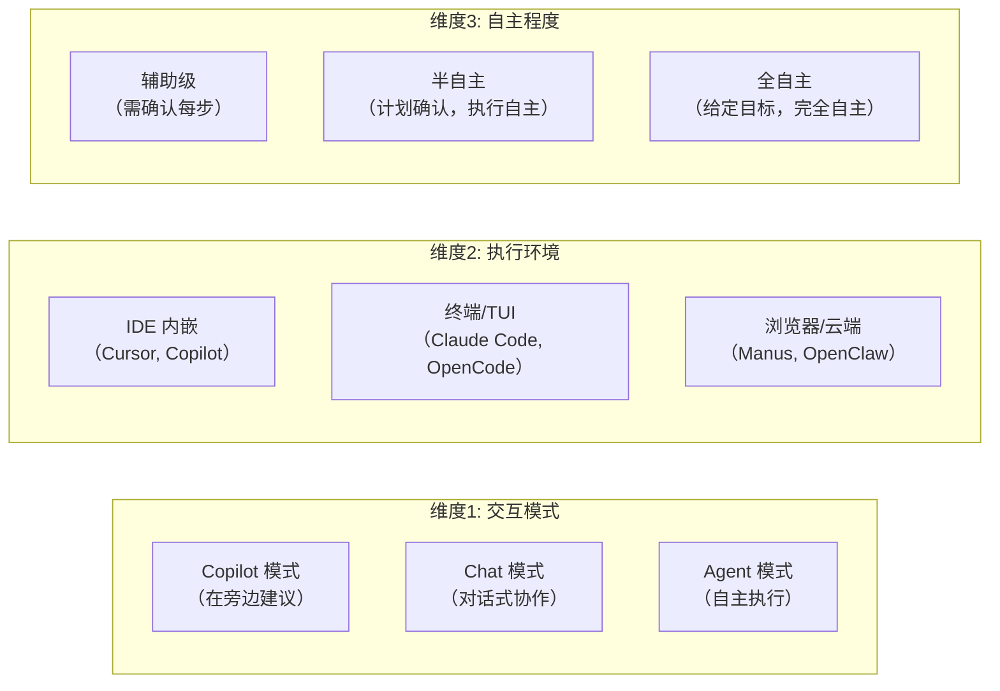
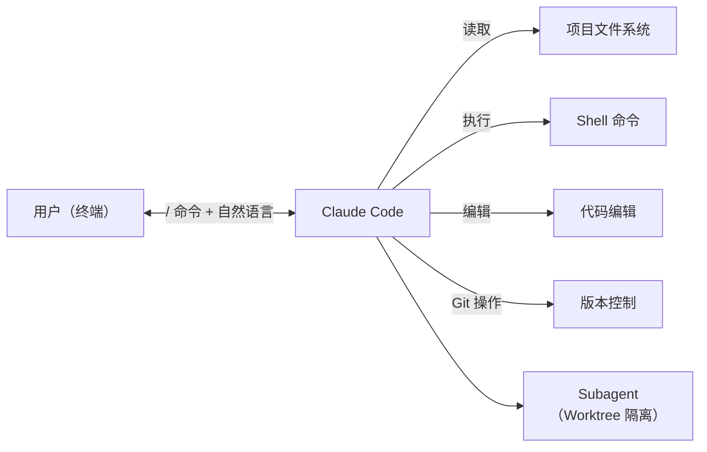
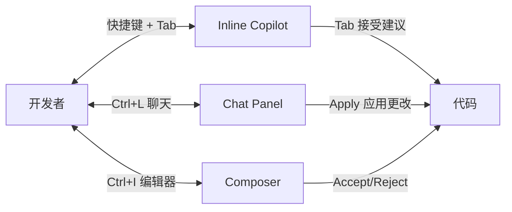
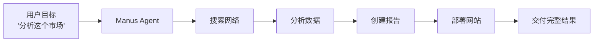
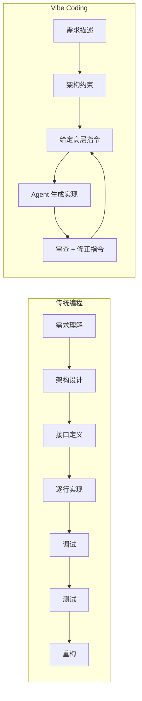
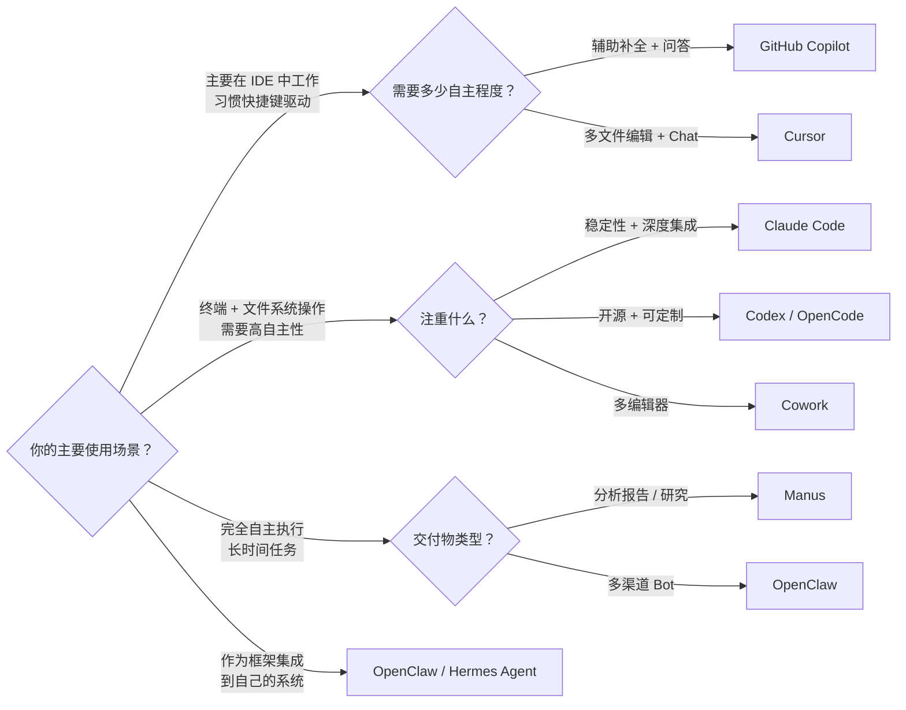

## 引言

DeepSeek 的 Harness 产品经理岗位要求候选人"深度使用过 Claude Code、Cowork、Codex、Cursor、OpenCode、GitHub Copilot、Manus、OpenClaw、Hermes 等类似产品"。这列出了 2026 年 AI Agent 产品的主流阵营。

这些产品虽然都被称为"AI Agent"，但它们的架构、交互模式、自主程度差异巨大。从辅助型 IDE 插件到完全自主的 Agent 框架，本文建立一个统一的评估框架来理解和对比它们。

## Agent 产品的三维分类框架

### 三个核心维度



### 产品分类矩阵

| 产品 | 交互模式 | 执行环境 | 自主程度 | 核心定位 |
|------|---------|---------|---------|---------|
| **GitHub Copilot** | Copilot | IDE | 辅助级 | 代码补全助手 |
| **Cursor** | Chat + Copilot | IDE | 辅助-半自主 | AI-first IDE |
| **Claude Code** | Agent | 终端 | 半自主 | 终端 Agent |
| **Codex / OpenCode** | Agent | 终端 | 半自主-全自主 | 开源终端 Agent |
| **Cowork** | Agent | 终端+IDE | 半自主 | 多编辑器 Agent |
| **Manus** | Agent | 浏览器 | 全自主 | 通用任务 Agent |
| **OpenClaw** | Agent | 全平台 | 全自主 | Agent 框架 |
| **Hermes Agent** | Agent | 终端 | 全自主 | 自进化 Agent |

## 产品深度对比

### Claude Code：Agent 优先的终端体验



**架构特点**：
- 全终端操作，无 GUI 依赖
- 直接操作文件系统、执行 Shell、管理 Git
- 支持 Subagent 委派（Worktree 隔离）
- 工具定义数量：~40+（Read, Write, Edit, Bash, Grep, Glob, Agent, WebFetch...）
- 交互模式：用户给目标 → Agent 自主规划执行 → 关键节点确认

**设计哲学**：Agent 不是在 IDE 里聊天，而是**真正拥有操作计算机的能力** <cite>[3]</cite>。

### Cursor：AI-first IDE



**架构特点**：
- GUI 优先，快捷键驱动的 Agent 交互
- 三层交互：Copilot（补全）、Chat（问答）、Composer（多文件编辑）
- 上下文感知：自动包含当前文件、相关文件、终端输出
- 保守的自主程度：始终要求用户确认或拒绝更改

**设计哲学**：Agent 是 IDE 的一个功能，不是替代 IDE。开发者始终在控制循环中。

### GitHub Copilot：从补全到 Agent 的进化

Copilot 的进化轨迹反映了 Agent 产品形态的演变：

```
2022: 代码补全（仅当前行）
  ↓
2023: Copilot Chat（对话式问答）
  ↓
2024: Copilot Workspace（任务级代码生成）
  ↓
2025: Agent Mode（自主修复、PR 描述、测试生成）
  ↓
2026: Codex CLI 合并（终端 Agent 能力）
```

**当前形态**：Copilot 正在从辅助工具转型为 Agent，但受限于 IDE 场景，自主程度仍是同类最低的。

### Manus：通向通用 Agent 的实验

Manus 是 2026 年最激进的 Agent 产品之一：

- **完全自主**：给定一个高级目标，Agent 自主搜索、分析、创建交付物
- **浏览器沙箱**：在云端浏览器中执行所有操作
- **长时间运行**：单个任务可以运行数十分钟到数小时
- **完整交付物**：不只是文本回答，而是完整的分析报告、网站、数据分析



**代价**：高度自主意味着用户**失去过程控制**——你只能看到结果，中间出错了你也无法纠正。

### OpenClaw：框架而非产品

OpenClaw（354k+ Stars）<cite>[1]</cite> 的定位与其他产品不同——它是**Agent 框架**，不是面向终端用户的产品：

| 维度 | OpenClaw vs Claude Code |
|------|------------------------|
| 类型 | 框架（需自己搭建） | 产品（开箱即用） |
| 渠道 | WhatsApp, Telegram, Discord 等 20+ 平台 | 终端 / IDE |
| 技能生态 | ClawHub: 13,729+ Skills | 内置工具 + MCP |
| 模型 | 可插拔（Anthropic, OpenAI, Google...） | Anthropic Claude |
| 目标用户 | 开发者、企业 | 开发者 |

## Vibe Coding：本质是什么？

### Vibe Coding 不是"不写代码"

"Andrej Karpathy 的 Vibe Coding 概念 <cite>[2]</cite> 被严重误解了。Vibe Coding 不是'放弃理解代码'，而是**将认知负荷从实现细节转移到系统设计和高层决策**。



### Vibe Coding 改变的三个层次

**层次 1：代码生成**
"用自然语言描述 → Agent 生成代码"——这是最表层的理解。

**层次 2：架构协作**
不仅是生成代码，而是与 Agent 协作设计架构。你说"这里应该用工厂模式"，Agent 实现并解释为什么这个选择合理（或不合理）。

**层次 3：意图编程**
最高层次——你描述的是**意图和约束**，而非实现细节：
- 不是"写一个 for 循环遍历数组" → 而是"找出所有不符合规则的用户"
- 不是"用 Docker 部署这个服务" → 而是"让它能在生产环境运行"

### Vibe Coding 的实践边界

| 适合 | 不适合 |
|------|--------|
| 原型和 MVP 快速迭代 | 安全关键系统 |
| 标准化技术栈（React, FastAPI） | 极端性能敏感代码（HFT, 嵌入式） |
| 个人项目和小团队 | 需要合规审计的代码 |
| CRUD / API / UI 开发 | 带专利保护的算法核心 |

**Vibe Coding 的核心能力不是"写 prompt"，而是**审查 Agent 输出**——在几秒内判断生成的代码是否正确、安全、合理。这需要比传统编程更强的代码理解力。

## 产品选择决策树



## 对 Agent 开发者的启示

### Agent 产品的核心权衡

每个 Agent 产品都是以下三个维度的三角平衡：

```
        自主程度
          /\
         /  \
        /    \
       /  产品 \
      /  定位点  \
     /____________\
  安全性          用户体验
```

- **提高自主程度 → 牺牲安全性和过程控制**
- **增强安全性 → 增加确认步骤，降低体验流畅度**
- **优化用户体验 → 可能隐藏重要决策信息**

### 2026 年的趋势判断

1. **IDE Agent 趋同**：Cursor、Copilot、Codex 在功能上快速趋同
2. **终端 Agent 分化**：Claude Code 走深度集成路线，OpenCode 走开源可定制路线
3. **通用 Agent 探索**：Manus 式全自主 Agent 仍在寻找 product-market fit
4. **框架-产品边界模糊**：OpenClaw 从框架向产品演进，Claude Code API 从产品向平台演进

## 总结

Agent 产品形态的多样性反映了这个领域的核心张力：**自主程度越高，产品越强大，但用户越难信任**。

对于 DeepSeek Harness 团队而言，关键问题不是"复制哪个产品"，而是**找到适合 DeepSeek 模型的交互模式和执行边界**——这也正是"Model + Harness = Agent"公式中，Harness 需要回答的核心问题。

Vibe Coding 不是放弃理解代码，而是将认知资源重新分配：从"怎么写"到"写什么"。

---

## 参考文献

<ol class="references">
<li><em>OpenClaw Project. "OpenClaw — Open Source AI Agent Framework."</em> GitHub, 2026.<br><a href="https://github.com/openclaw/openclaw">https://github.com/openclaw/openclaw</a></li>
<li><em>Karpathy, A. "Vibe Coding: The New Way to Program."</em> 2025.<br><a href="https://karpathy.bearblog.dev/vibe-coding/">https://karpathy.bearblog.dev/vibe-coding/</a></li>
<li><em>Anthropic. "Claude Code Documentation."</em> 2025-2026.<br><a href="https://docs.anthropic.com/en/docs/claude-code/overview">https://docs.anthropic.com/en/docs/claude-code/overview</a></li>
</ol>
