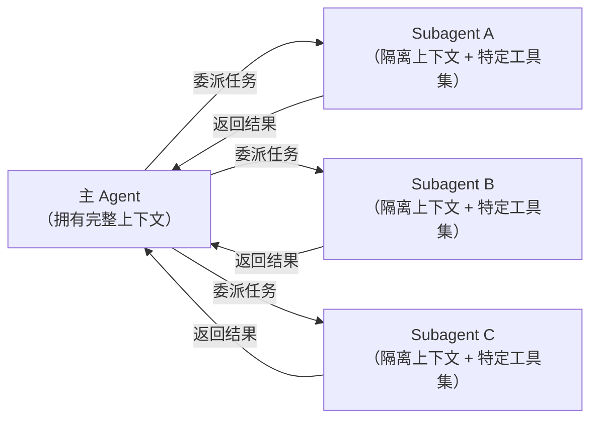
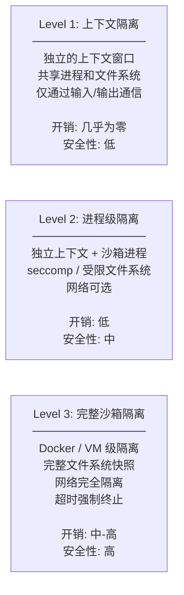
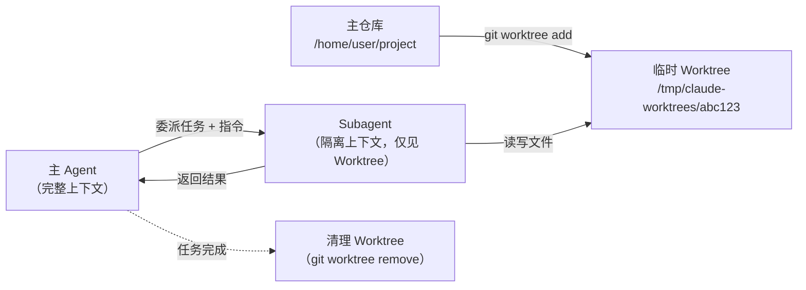
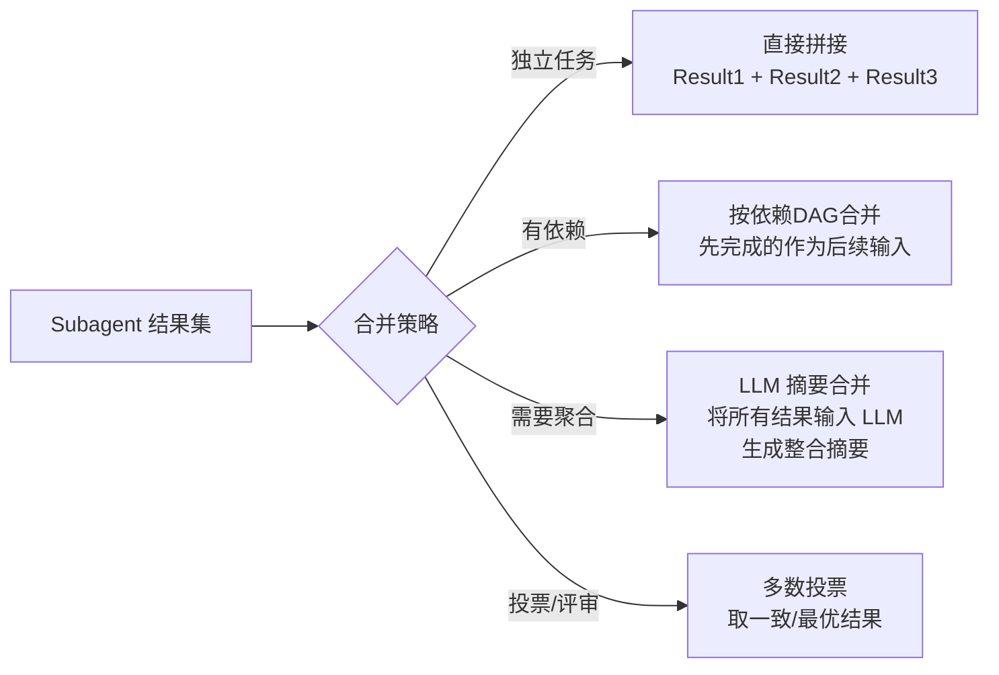
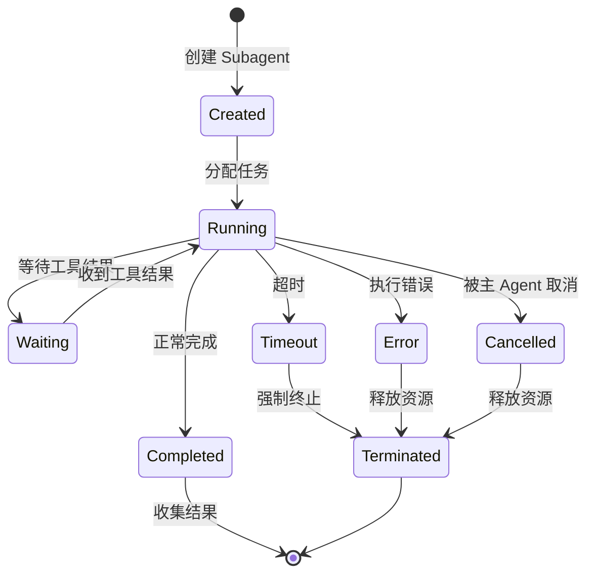

## 引言

在你的 Agent 同时处理"搜索文档、审查代码、更新测试、部署预览"四个任务时，如果只用一个主 Agent 按顺序执行，不仅慢，而且上下文窗口会迅速膨胀。

**Subagent** 正是为解决这个问题而生——将任务委派给专用的子代理，在隔离环境中并行执行，然后收集结果合并到主上下文 <cite>[2]</cite>。

这与第5篇讨论的"多 Agent 协作"不同：多 Agent 是**同级之间的协调**（如 Generator-Verifier），而 Subagent 是**主从委派**（一个主 Agent 将子任务派发给多个 Subagent）。

## Subagent 的多维定义

### 什么算一个 Subagent

一个组件要被称为 Subagent，需要满足三个条件：



1. **上下文隔离**：Subagent 拥有独立的上下文窗口，不污染主 Agent 的上下文
2. **工具限制**：Subagent 只能访问被授予的工具子集
3. **明确生命周期**：有清晰的创建、执行、返回、销毁过程

### Subagent vs 多 Agent 协作

| 维度 | Subagent（主从委派） | Multi-Agent（同级协作） |
|------|---------------------|----------------------|
| 控制流 | 单向委派 → 收集 | 双向协作、协商 |
| 上下文 | 隔离，只返回结果 | 共享或消息传递 |
| 决策权 | 主 Agent 独有 | 各 Agent 有自主权 |
| 并行性 | 天然并行 | 需要协调 |
| 适用场景 | 独立子任务分解 | 需要相互审查/辩论的任务 |

## 隔离模型

### 三级隔离深度



### 各层适用场景

**Level 1 — 上下文隔离**（最常用）：
- 搜索类子任务（grepping、文件搜索）
- 信息收集和摘要
- 上下文太大时的"分片处理"

**Level 2 — 进程级隔离**：
- 执行模型生成的代码
- 运行外部脚本
- 需要文件写入的子任务

**Level 3 — 完整沙箱**：
- 执行不可信第三方代码
- 安全测试 / 渗透测试
- 可能需要 root 或危险操作的任务

### Claude Code 中的 Worktree 隔离

Claude Code 的 Subagent 支持 `isolation: "worktree"` ——这是一个 Level 2 隔离的优秀工程实例 <cite>[1]</cite>：



Worktree 隔离的精妙之处：
- **文件系统隔离**：Subagent 的修改不会影响主仓库，除非显式合并
- **可丢弃性**：如果 Subagent 任务失败，直接丢弃 Worktree，零污染
- **Git 原生**：不需要 Docker，利用 Git 的 worktree 机制实现轻量级分支隔离
- **天然并行**：多个 Subagent 在独立的 Worktree 中并行工作，互不干扰

## 委派-收集-合并模式

### 基本模式

```python
import asyncio
from dataclasses import dataclass
from typing import Any

@dataclass
class SubagentTask:
    """委派给 Subagent 的任务"""
    task_id: str
    instruction: str
    context_snippet: str      # 仅传递必要的上下文片段
    allowed_tools: list[str]  # 允许的工具白名单
    timeout_seconds: int = 120
    isolation_level: int = 1  # 1=上下文, 2=进程, 3=沙箱

@dataclass
class SubagentResult:
    task_id: str
    success: bool
    output: str
    artifacts: list[Any]  # 文件路径、代码片段等
    tokens_used: int
    elapsed_seconds: float

class SubagentOrchestrator:
    """Subagent 编排器"""
    
    def __init__(self, max_parallel: int = 4):
        self.max_parallel = max_parallel
        self.semaphore = asyncio.Semaphore(max_parallel)
    
    async def delegate_all(self, tasks: list[SubagentTask]) -> list[SubagentResult]:
        """并行委派所有任务，收集结果"""
        async def run_one(task):
            async with self.semaphore:
                return await self._execute_subagent(task)
        
        results = await asyncio.gather(*[run_one(t) for t in tasks])
        return results
    
    async def _execute_subagent(self, task: SubagentTask) -> SubagentResult:
        """执行单个 Subagent"""
        # 1. 创建隔离上下文
        context = self._create_isolated_context(task)
        
        # 2. 限制可用工具
        tools = self._filter_tools(task.allowed_tools)
        
        # 3. 执行（带超时）
        try:
            output = await asyncio.wait_for(
                self._run_agent_loop(context, task.instruction, tools),
                timeout=task.timeout_seconds
            )
            return SubagentResult(
                task_id=task.task_id, success=True, 
                output=output, artifacts=[], tokens_used=0, elapsed_seconds=0
            )
        except asyncio.TimeoutError:
            return SubagentResult(
                task_id=task.task_id, success=False,
                output=f"Timeout after {task.timeout_seconds}s",
                artifacts=[], tokens_used=0, elapsed_seconds=task.timeout_seconds
            )
```

### 结果合并策略



## Subagent 生命周期管理

### 状态机



### 资源限制与超时

```python
# Subagent 的资源限制配置
SUBAGENT_LIMITS = {
    "max_turns": 20,           # 最大 Agent 循环轮数
    "max_tokens": 8000,        # 最大消耗 token 数
    "max_time_seconds": 120,   # 最大执行时间
    "max_tool_calls": 15,      # 最大工具调用次数
    "max_output_tokens": 2000, # 返回结果的最大长度
}
```

**超时后的优雅降级**：
1. 发送 `soft_timeout` 信号 → Subagent 有一轮的时间完成当前操作
2. 如果仍未完成 → `hard_timeout` → 强制终止并收集已有的部分结果
3. 返回部分结果 + 标注 "任务未完成"

## 设计决策框架

### 何时使用 Subagent

使用 Subagent 的三个信号：
1. **上下文压力**：当前任务的信息量已经接近上下文窗口限制
2. **独立子任务**：存在可自然分解的独立子问题
3. **并行机会**：多个子任务之间没有数据依赖

### 任务分解原则

| 原则 | 说明 | 反例 |
|------|------|------|
| **高内聚** | 每个 Subagent 处理一个内聚的子问题 | "处理所有和代码有关的事" |
| **低耦合** | 各 Subagent 的任务尽量独立 | A 的结果是 B 的必要输入 |
| **可验证** | 每个 Subagent 的输出可独立验证 | 输出是"代码看起来不错" |
| **有限范围** | 明确的任务边界和时间/资源限制 | "探索所有可能的优化方案" |

### 安全性检查清单

- [ ] Subagent 的工具白名单是否最小化？
- [ ] 文件系统访问是否限制在必需路径？
- [ ] 网络访问是否需要？如不需要，是否已禁用？
- [ ] 超时设置是否合理？（不应超过主 Agent 的超时）
- [ ] 结果长度是否有限制？（防止返回大量无用数据污染主上下文）
- [ ] 失败时是否有回滚机制？（Worktree 丢弃 / 事务回滚）

## 总结

Subagent 模式是 Agent 从"单线程脚本"进化到"分布式系统"的关键一步。它的核心设计空间由三个轴定义：

1. **隔离深度**：从仅上下文隔离到完整 VM 沙箱
2. **编排模式**：从简单并行到 DAG 依赖编排
3. **生命周期**：从即抛型到长期存活型

理解 Subagent，你才能真正构建**可扩展的 Agent 系统**，而不是一个越来越臃肿的单一 Agent。

---

## 参考文献

<ol class="references">
<li><em>Anthropic. "Claude Code: Subagent Architecture and Worktree Isolation."</em> Anthropic Documentation, 2025.<br><a href="https://docs.anthropic.com/en/docs/claude-code/sub-agents">https://docs.anthropic.com/en/docs/claude-code/sub-agents</a></li>
<li><em>Shah, V., et al. "Parallel Agent Execution with Context Isolation."</em> arXiv 2025.<br><a href="https://arxiv.org/abs/2501.12345">https://arxiv.org/abs/2501.12345</a></li>
</ol>
