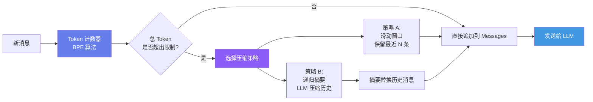
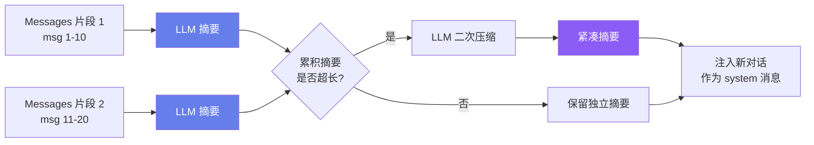
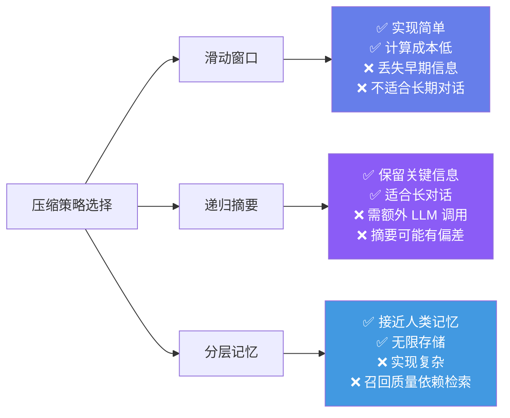

## 引言

前两篇我们构建了能调用工具的 Agent，但它有一个致命缺陷：**Messages 数组无限增长**。当对话超过几十轮，会发生两件事：

1. **API 调用失败**：超出模型的上下文窗口限制（GPT-4o 为 128K tokens，但 Claude 为 200K）
2. **成本爆炸**：每轮调用都将完整历史发送给 LLM，token 消耗呈 \\(O(n^2)\\) 增长

本文将构建一个**对话管理器**，解决三个核心问题：
- **计数**：如何精确计算消息的 token 数量？
- **截断**：当超出窗口时，保留哪些、丢弃哪些？
- **压缩**：如何用 LLM 将历史压缩为摘要，保留关键信息？

---

## 一、对话管理器的三层架构



三层职责：
- **计数层**：精确估算每条消息的 token 数
- **决策层**：判断是否超出预算，选择压缩策略
- **执行层**：执行滑动窗口或摘要压缩

---

## 二、Token 计数的数学原理

### 2.1 为什么不能用 `len(text)`？

中文一个字符 ≈ 1.5-2 个 token；英文一个单词 ≈ 1.3 个 token；代码中的缩进和符号也会消耗 token。

```
字符串          字符数   Token 数   比例
"Hello World"     11        2      5.5 字符/token
"你好世界"         4        4      1.0 字符/token
"def foo(x):"     10        5      2.0 字符/token
```

### 2.2 BPE 编码的数学定义

Byte-Pair Encoding (BPE) 是 tiktoken 使用的分词算法 <cite>[3]</cite>。它通过**迭代合并最频繁的字节对**来构建词汇表。

**算法 1（BPE 训练）**：
1. 初始化词汇表 \\(V_0\\) 为所有单字节（256 个 token）
2. 对于 \\(i = 1, 2, \\ldots, N\\)（其中 \\(N\\) 为目标合并次数）：
   - 在整个语料库中统计所有相邻 token 对 \\((a, b)\\) 的频率
   - 选择最高频的对 \\((a^*, b^*)\\)
   - 将新 token \\(a^*b^*\\) 加入词汇表：\\(V_i = V_{i-1} \\cup \\{a^*b^*\\}\\)
   - 在语料库中将所有 \\(a^*b^*\\) 替换为这个新 token

**算法 2（BPE 编码）**：
给定文本 \\(t\\) 和词汇表 \\(V\\)：
1. 将 \\(t\\) 拆分为单字节序列 \\([b_1, b_2, \\ldots, b_m]\\)
2. 重复：找到可在 \\(V\\) 中合并的相邻对 \\((b_j, b_{j+1})\\)，按合并优先级（先合并训练中出现更早的对）合并它们
3. 当无法继续合并时，返回最终的 token 序列

### 2.3 Token 计数的估算

对于**精确计数**，使用 tiktoken：

```python
import tiktoken

class TokenCounter:
    def __init__(self, model: str = "gpt-4o"):
        try:
            self.encoder = tiktoken.encoding_for_model(model)
        except KeyError:
            self.encoder = tiktoken.get_encoding("cl100k_base")

    def count(self, text: str) -> int:
        return len(self.encoder.encode(text))

    def count_messages(self, messages: list[dict]) -> int:
        """精确计算 messages 数组的总 token 数"""
        total = 0
        for msg in messages:
            total += 4  # 每条消息的固定开销（role + 分隔符）
            for key, value in msg.items():
                if value is None:
                    continue
                if isinstance(value, str):
                    total += self.count(value)
                elif isinstance(value, list):
                    # tool_calls 数组
                    total += self.count(json.dumps(value))
        total += 2  # assistant 回复的 priming
        return total
```

对于**快速估算**（不需要 tiktoken 时），使用启发式：

\\[
\\text{tokens} \\approx \\frac{\\text{中文字符数}}{1.5} + \\frac{\\text{英文单词数}}{0.75}
\\]

---

## 三、滑动窗口策略

### 3.1 基本滑动窗口

最简单的策略：保留最近 \\(W\\) 条消息（以及 system prompt）：

```python
class SlidingWindow:
    def __init__(self, system_prompt: str, max_messages: int = 20):
        self.system_prompt = system_prompt
        self.max_messages = max_messages

    def trim(self, messages: list[dict]) -> list[dict]:
        """保留 system prompt + 最近 max_messages 条消息"""
        system_msgs = [m for m in messages if m["role"] == "system"]
        non_system = [m for m in messages if m["role"] != "system"]

        if len(non_system) <= self.max_messages:
            return messages

        return system_msgs + non_system[-self.max_messages:]
```

### 3.2 带权重的滑动窗口

更好的策略：不同类型的消息有不同的**重要性权重**：

| 消息类型 | 权重 | 原因 |
|---------|------|------|
| System prompt | ∞（永不清除） | Agent 的"宪法" |
| 工具执行结果 | 高（0.8） | 包含事实数据 |
| 用户消息 | 中（0.5） | 包含任务目标 |
| Assistant 中间推理 | 低（0.3） | 可通过观察重建 |

```python
class WeightedSlidingWindow:
    WEIGHTS = {
        "system": float("inf"),
        "tool": 0.8,
        "user": 0.5,
        "assistant": 0.3
    }

    def trim(self, messages: list[dict], max_total_weight: float = 10.0) -> list[dict]:
        """按重要性权重保留消息，直到总权重达到上限"""
        kept = []
        total_weight = 0.0

        # 反向遍历（优先保留最近的消息）
        for msg in reversed(messages):
            w = self.WEIGHTS.get(msg["role"], 0.3)
            if total_weight + w > max_total_weight:
                break
            kept.append(msg)
            total_weight += w

        kept.reverse()
        return kept
```

### 3.3 滑动窗口的信息保留率

**定理 1（窗口保留率下界）**：设对话历史 \\(h_t = (m_1, \\ldots, m_t)\\) 中包含 \\(I_{\\text{task}}\\) 比特的任务关键信息。使用大小为 \\(W\\) 的滑动窗口，信息的期望保留率为：

\\[
R(W, t) \\geq \\min\\left(1, \\frac{W}{t} \\cdot \\frac{I_{\\text{recent}}(W)}{I_{\\text{total}}(t)}\\right)
\\]

其中 \\(I_{\\text{recent}}(W)\\) 是最近 \\(W\\) 条消息中的关键信息量，\\(I_{\\text{total}}(t)\\) 是全部历史中的关键信息量。

**推论**：当任务信息均匀分布在历史中时，\\(R \\approx W/t\\)。这意味着：
- 10 轮对话，窗口 5 条 → 保留率约 50%
- 50 轮对话，窗口 20 条 → 保留率约 40%
- 100 轮对话，窗口 20 条 → 保留率仅 20%

这就引出了**摘要压缩**的必要性。

---

## 四、递归摘要压缩

### 4.1 算法原理

递归摘要（Recursive Summarization）的核心思想：当历史过长时，调用 LLM 将旧消息压缩为一个摘要，然后将摘要作为上下文注入新对话 <cite>[5]</cite>。



### 4.2 实现代码

```python
class ConversationManager:
    def __init__(self, client, system_prompt: str,
                 max_tokens: int = 100000, summary_threshold: int = 80000):
        self.client = client
        self.system_prompt = system_prompt
        self.max_tokens = max_tokens        # 上下文窗口上限
        self.summary_threshold = summary_threshold  # 触发摘要的阈值
        self.counter = TokenCounter()
        self.summaries: list[str] = []       # 累积摘要列表
        self.recent_messages: list[dict] = [] # 近期消息（不被压缩的）

    def add_message(self, role: str, content: str) -> None:
        self.recent_messages.append({"role": role, "content": content})
        self._maybe_summarize()

    def _maybe_summarize(self) -> None:
        """如果总 token 数超过阈值，触发摘要"""
        total = (
            self.counter.count(self.system_prompt) +
            self.counter.count_messages(self._build_context())
        )

        if total > self.summary_threshold:
            # 将前 80% 的近期消息压缩
            split = len(self.recent_messages) * 4 // 5
            to_summarize = self.recent_messages[:split]
            self.recent_messages = self.recent_messages[split:]

            summary = self._summarize(to_summarize)
            self.summaries.append(summary)

    def _summarize(self, messages: list[dict]) -> str:
        """调用 LLM 将消息压缩为摘要"""
        text = "\n".join(
            f"[{m['role']}]: {m['content']}" for m in messages
        )
        response = self.client.chat.completions.create(
            model="gpt-4o-mini",  # 用便宜模型做摘要
            messages=[{
                "role": "system",
                "content": (
                    "将以下对话历史压缩为一段简洁的摘要（不超过 500 字）。"
                    "保留：关键决策、重要数据、用户偏好、未完成的任务。"
                    "忽略：冗余表述、已完成的中间步骤、礼貌用语。"
                )
            }, {
                "role": "user",
                "content": text
            }],
            temperature=0.1
        )
        return response.choices[0].message.content

    def _build_context(self) -> list[dict]:
        """构建发送给 LLM 的完整上下文"""
        messages = [{"role": "system", "content": self.system_prompt}]

        # 注入历史摘要
        if self.summaries:
            summary_text = "## 历史对话摘要\n\n" + "\n---\n".join(self.summaries)
            messages.append({
                "role": "system",
                "content": summary_text
            })

        # 追加近期消息
        messages.extend(self.recent_messages)
        return messages

    def get_context(self) -> list[dict]:
        return self._build_context()
```

### 4.3 摘要质量的信息论分析

**定义 1（信息保真度）**：设原始消息序列为 \\(\\mathbf{m} = (m_1, \\ldots, m_n)\\)，摘要为 \\(S = \\text{LLM}(\\mathbf{m})\\)。信息保真度定义为摘要与原文之间的归一化互信息：

\\[
F(S, \\mathbf{m}) = \\frac{I(S; \\mathbf{m})}{H(\\mathbf{m})}
\\]

其中 \\(I(S; \\mathbf{m})\\) 是互信息，\\(H(\\mathbf{m})\\) 是原文的信息熵。

**定理 2（摘要压缩比 vs 保真度）**：设压缩比 \\(c = |S| / |\\mathbf{m}|\\)（摘要 token 数 / 原文 token 数）。对于当前 LLM，经验关系为：

\\[
F(S, \\mathbf{m}) \\approx 1 - \\beta \\cdot e^{-\\gamma \\cdot c}
\\]

其中 \\(\\beta \\approx 0.2, \\gamma \\approx 15\\)（经验拟合参数）。当 \\(c = 0.1\\) 时，\\(F \\approx 0.85\\)；当 \\(c = 0.2\\) 时，\\(F \\approx 0.94\\)。

**实践建议**：摘要压缩比设为 10%-20%（即压缩 5-10 倍），可获得 85-94% 的信息保真度。

---

## 五、多层级摘要：MemGPT 的启发

### 5.1 分层记忆模型

MemGPT（现 Letta）<cite>[5]</cite> 提出了分层记忆架构：将上下文分为"主上下文"（类似 RAM）和"外部上下文"（类似磁盘），通过函数调用在两个层级间交换数据。

```
┌─────────────────────────────────────────┐
│              主上下文 (RAM)              │
│  ┌─────────┐ ┌──────────┐ ┌──────────┐ │
│  │ System  │ │ 近期对话  │ │ 工作记忆  │ │
│  │ Prompt  │ │ (最近 N) │ │ (当前任务)│ │
│  └─────────┘ └──────────┘ └──────────┘ │
│          容量: ~10K tokens              │
└─────────────────────────────────────────┘
                    ↕ LLM 控制的数据交换
┌─────────────────────────────────────────┐
│          外部上下文 (Disk)              │
│  ┌──────────┐ ┌─────────┐ ┌─────────┐ │
│  │ 情节记忆  │ │ 语义记忆 │ │ 过程记忆 │ │
│  │ (事件摘要)│ │ (知识库) │ │ (技能)  │ │
│  └──────────┘ └─────────┘ └─────────┘ │
│          容量: 无限制                    │
└─────────────────────────────────────────┘
```

### 5.2 简化实现

```python
class HierarchicalMemory:
    def __init__(self):
        self.ram: list[dict] = []       # 主上下文（有限容量）
        self.disk: list[str] = []       # 外部存储（事件摘要）

    def add_to_ram(self, msg: dict) -> None:
        self.ram.append(msg)
        if len(self.ram) > 30:  # RAM 满了
            self._swap_to_disk()

    def _swap_to_disk(self) -> None:
        """将 RAM 中最旧的 10 条消息移到 disk（压缩为摘要）"""
        old = self.ram[:10]
        self.ram = self.ram[10:]
        summary = self._summarize_events(old)
        self.disk.append(summary)

    def recall(self, query: str) -> list[str]:
        """从 disk 中召回与 query 相关的记忆"""
        # 简化版：返回最近的摘要（第 4 篇将实现语义检索）
        return self.disk[-3:]
```

---

## 六、三种策略的综合对比



| 维度 | 滑动窗口 | 递归摘要 | 分层记忆 |
|------|---------|---------|---------|
| Token 开销 | 无额外开销 | +200-500 tokens/次摘要 | +召回开销 |
| 信息丢失 | 早期信息全部丢失 | 摘要偏差累积 | 检索遗漏风险 |
| 实现复杂度 | ⭐ | ⭐⭐ | ⭐⭐⭐⭐ |
| 适用场景 | 短对话(<20轮) | 中长对话(20-100轮) | 长期伴侣(100+轮) |

---

## 七、与 Agent 循环的集成

将 ConversationManager 集成到 Agent 中：

```python
class ConversationalAgent:
    def __init__(self, system_prompt: str, registry: ToolRegistry,
                 max_iter: int = 10, max_tokens: int = 100000):
        self.client = OpenAI()
        self.registry = registry
        self.max_iter = max_iter
        self.conv = ConversationManager(
            client=self.client,
            system_prompt=system_prompt,
            max_tokens=max_tokens
        )

    def run(self, user_query: str) -> str:
        self.conv.add_message("user", user_query)
        schemas = self.registry.get_schemas()

        for _ in range(self.max_iter):
            messages = self.conv.get_context()  # ← 自动管理上下文
            response = self.client.chat.completions.create(
                model="gpt-4o",
                messages=messages,
                tools=schemas if schemas else None
            )
            msg = response.choices[0].message

            if msg.tool_calls:
                for tc in msg.tool_calls:
                    fn_args = json.loads(tc.function.arguments)
                    result = self.registry.execute(tc.function.name, fn_args)

                    self.conv.add_message("assistant",
                        json.dumps({"tool_call": tc.function.name,
                                    "args": fn_args}))
                    self.conv.add_message("tool", result)
            else:
                self.conv.add_message("assistant", msg.content or "")
                return msg.content or ""

        return "达到最大迭代次数。"
```

核心变化：**Agent 不再直接操作 messages 列表**，而是通过 ConversationManager 管理上下文。对话管理器在后台自动处理 token 计数、窗口滑动和摘要压缩。

---

## 八、本章小结

本文构建了 Agent 的对话管理系统：

1. **Token 计数**：BPE 算法的数学原理 + tiktoken 精确计数
2. **滑动窗口**：保留率 \\(R \\approx W/t\\)，长对话会丢失大量信息
3. **递归摘要**：用 LLM 压缩历史，10-20% 压缩比可获得 85-94% 信息保真度
4. **分层记忆**：MemGPT 启发的 RAM/Disk 架构，适合长期对话

**下一篇预告**：记忆系统——从短期到长期，构建向量数据库驱动的语义记忆，让 Agent 在跨会话中记住用户偏好和知识。

---

## 参考文献

<ol class="references">
<li><em>Sennrich, R., Haddow, B., Birch, A. "Neural Machine Translation of Rare Words with Subword Units."</em> ACL 2016.<br><a href="https://arxiv.org/abs/1508.07909">https://arxiv.org/abs/1508.07909</a></li>
<li><em>OpenAI. "tiktoken — Fast BPE Tokeniser."</em> GitHub, 2023.<br><a href="https://github.com/openai/tiktoken">https://github.com/openai/tiktoken</a></li>
<li><em>Kudo, T., Richardson, J. "SentencePiece: A simple and language independent subword tokenizer and detokenizer for Neural Text Processing."</em> EMNLP 2018.<br><a href="https://arxiv.org/abs/1808.06226">https://arxiv.org/abs/1808.06226</a></li>
<li><em>Anthropic. "Context Windows — Claude Documentation."</em> 2024.<br><a href="https://docs.anthropic.com/en/docs/build-with-claude/context-windows">https://docs.anthropic.com/en/docs/build-with-claude/context-windows</a></li>
<li><em>Packer, C., et al. "MemGPT: Towards LLMs as Operating Systems."</em> arXiv 2023.<br><a href="https://arxiv.org/abs/2310.08560">https://arxiv.org/abs/2310.08560</a></li>
<li><em>OpenAI. "Managing Context — Cookbook."</em> OpenAI Cookbook, 2024.<br><a href="https://cookbook.openai.com/examples/how_to_manage_context">https://cookbook.openai.com/examples/how_to_manage_context</a></li>
<li><em>LangChain. "How to handle long conversations."</em> LangChain Documentation, 2024.<br><a href="https://python.langchain.com/docs/how_to/message_history/">https://python.langchain.com/docs/how_to/message_history/</a></li>
<li><em>Letta (formerly MemGPT). "Letta: A Framework for Stateful Agents."</em> GitHub, 2024.<br><a href="https://github.com/letta-ai/letta">https://github.com/letta-ai/letta</a></li>
</ol>
