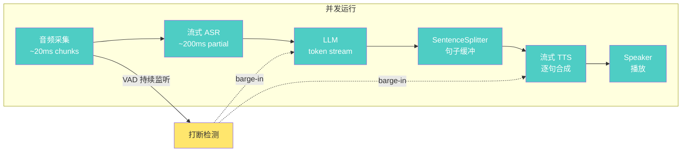
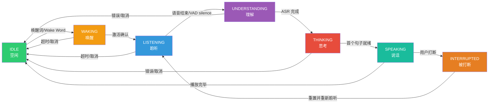
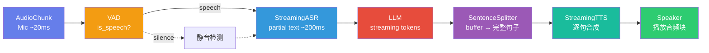
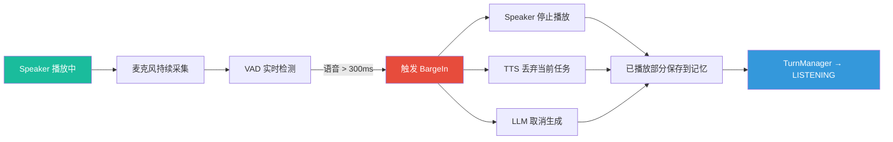
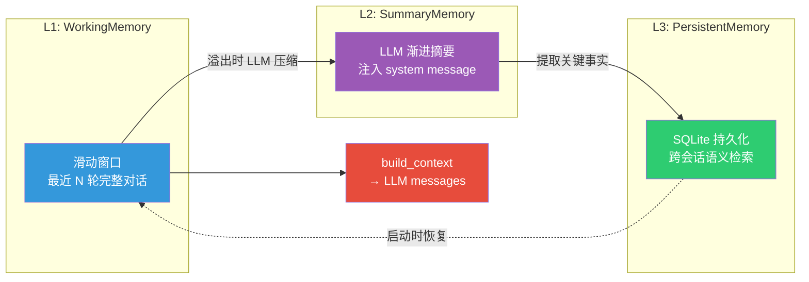

## 引言

语音助手是一个看似简单但工程复杂度极高的系统。一个真正好用的语音助手需要同时解决：低延迟流式处理、自然的打断体验、多轮对话上下文管理、工具调用和知识检索——这些子系统需要并发协作，而不是串行排队。

CazzAi 是我开发的一个本地优先的 AI 语音助手项目。Phase 1 原型验证了核心链路（ASR→LLM→TTS + RAG + Web Search），但随着功能堆叠，架构债务逐渐显现：450 行的单文件 `pipeline.py` 成了 God Object、首响延迟 7-20 秒、无法打断、记忆系统有 bug。

本文记录了一次**渐进式架构重构**——在不改变现有 ASR/TTS/知识库引擎实现的前提下，重新设计核心管道和执行模型。项目的 ASR 基于 faster-whisper <cite>[1]</cite>，TTS 集成了 ChatTTS <cite>[2]</cite> 和 Edge TTS <cite>[3]</cite>，VAD 使用 Silero VAD <cite>[4]</cite>，嵌入模型采用 BGE-small-zh <cite>[5]</cite>，向量存储使用 ChromaDB <cite>[6]</cite>。关键词：**流式化**、**状态机**、**事件驱动**。

---

## 一、现状诊断

Phase 1 原型存在以下结构性问题：

| 优先级 | 问题 | 影响 |
|--------|------|------|
| P0 | 无流式 TTS 播放 | 首响延迟 7-20 秒，必须等全部文本生成后才合成语音 |
| P0 | 无 barge-in 打断 | 用户在助手说话时无法插入，体验割裂 |
| P1 | `pipeline.py` (452行) God Object | 不可测试，新增功能只能继续堆代码 |
| P1 | ASR 阻塞式 | 等用户说完才能识别，不支持 streaming partial text |
| P1 | ConversationMemory 有 bug | 压缩只删一对消息，无真正的 LLM 摘要 |
| P2 | 组件构建重复 | `main.py`、`gradio_app.py` 中各自拼装组件 |
| P2 | WebSocket 服务是空壳 | 未接入真实 Pipeline |

核心矛盾：**串行事务管道无法支撑低延迟、可打断的实时语音交互**。

---

## 二、架构决策

### 2.1 从串行到事件驱动

**旧模型（串行事务管道）：**


> 每阶段必须等上一阶段完全结束，首响延迟 7-20 秒。

**新模型（事件驱动并发管道）：**



> ASR/LM/TTS 通过 `asyncio.Queue` 并发协作，首响延迟 < 1 秒。

### 2.2 关键权衡

**句子级流式（非 token 级、非全文级）。** LLM token 流 → SentenceSplitter 缓冲到完整句子 → 触发 TTS。token 级太碎（TTS 无法合成自然语调），全文级太慢。这是首响延迟优化的关键点——LLM 说出第一个完整句子后 TTS 立即开始工作。

**asyncio.Queue 管道（非多进程）。** 阶段间用有界 Queue 通信，自动背压 <cite>[7]</cite>。Python 多进程对 torch 模型不友好（显存复制），asyncio 足够。

**打断时取消 LLM（默认）。** 打断后停止 LLM 生成以省 token。保留配置开关支持"后台继续生成"模式。

**本地优先。** ASR + TTS 本地，LLM 云端，SQLite 本地持久化。

---

## 三、TurnManager — 7 状态回合机

语音交互本质上是一个**状态机**。每一次对话回合都在状态之间迁移，迁移规则由事件触发。



状态迁移表定义了合法路径：

```python
ALLOWED_TRANSITIONS = {
    TurnState.IDLE:           {TurnState.WAKING},
    TurnState.WAKING:         {TurnState.LISTENING, TurnState.IDLE},
    TurnState.LISTENING:      {TurnState.UNDERSTANDING, TurnState.IDLE},
    TurnState.UNDERSTANDING:  {TurnState.THINKING, TurnState.IDLE},
    TurnState.THINKING:       {TurnState.SPEAKING, TurnState.IDLE},
    TurnState.SPEAKING:       {TurnState.IDLE, TurnState.INTERRUPTED},
    TurnState.INTERRUPTED:    {TurnState.LISTENING},
}
```

`INTERRUPTED` 是关键状态。它只从 `SPEAKING` 进入，只能走向 `LISTENING`——被打断后直接重新聆听，跳过中间的所有状态。`reset()` 方法提供一个"紧急出口"，绕过迁移规则直接回到 `IDLE`。

```python
class TurnManager:
    def transition(self, to_state: TurnState) -> bool:
        if to_state not in ALLOWED_TRANSITIONS.get(self._state, set()):
            return False  # 非法迁移，拒绝
        prev = self._state
        self._state = to_state
        # 通知所有监听者
        for cb in self._listeners:
            cb(prev, to_state)
        return True
```

---

## 四、流式管道

### 4.1 数据流



所有阶段通过 `asyncio.Queue` 并发运行。ASR 处理 chunk N 的同时，LLM 生成 token M，TTS 合成句子 L，Speaker 播放句子 L-1，VAD 持续监听——五个阶段并发协作。

### 4.2 PipelineStage 基类

每个阶段继承统一的抽象基类：

```python
class PipelineStage(ABC):
    def __init__(self, name: str):
        self._cancel_event = asyncio.Event()
        self._running = False
        self.input_queue: Optional[asyncio.Queue] = None
        self.output_queue: Optional[asyncio.Queue] = None

    async def start(self) -> None: ...
    async def stop(self) -> None: ...
    def cancel(self) -> None: ...

    @abstractmethod
    async def process(self, item): ...
```

`cancel()` 设置了 `_cancel_event`，任何阶段都可以在 `process()` 中检查 `self.is_cancelled` 来优雅退出。这为打断机制提供了统一的基础设施。

### 4.3 SentenceSplitter

这是首响延迟的关键优化。LLM 产生的不稳定 token 流不能直接喂给 TTS——需要等一个完整句子的语义边界出现。SentenceSplitter 用中英文句子终止符（`。！？.!?；\n`）检测边界：

```python
class SentenceSplitter:
    async def feed(self, token: str) -> AsyncGenerator[str, None]:
        self._buffer += token
        # 在 buffer 中查找句子边界
        for i, ch in enumerate(self._buffer):
            if ch in SENTENCE_END_CHARS:
                sentence = self._buffer[:i+1].strip()
                self._buffer = self._buffer[i+1:]
                yield sentence
```

LLM 只要说出第一个完整句子（比如"好的，我来帮你查询今天的天气。"），TTS 就开始合成和播放——不需要等全文生成完毕。

---

## 五、打断检测

打断是多轮语音体验的核心。实现原理很简单：

打断检测的完整事件链：



> Speaker 播放时麦克风不关，VAD 持续运行。检测到连续语音超过 300ms → 发送 cancel 信号 → Speaker 停止播放 → TTS 丢弃当前任务 → LLM 取消生成 → 已播放部分保存到记忆 → TurnManager 转入 LISTENING。

```python
class BargeInController:
    def feed(self, audio: np.ndarray) -> bool:
        prob = self.vad.probability(audio)
        if prob >= self.vad.threshold:
            self._speech_samples += len(audio)
            self._silence_samples = 0
        else:
            self._silence_samples += len(audio)
            if self._silence_samples > self.cooldown_samples:
                self._speech_samples = 0  # 重置，避免误触发

        if self._speech_samples >= self.threshold_samples:
            self._cancel_event.set()  # 触发打断
            return True
        return False
```

`cooldown_samples`（默认 500ms）防止短暂噪音被误判为打断。只有持续超过 300ms 的语音才触发。

---

## 六、三层记忆系统

旧的 `ConversationMemory` 有两个问题：压缩时只删一对消息（不是真正的摘要），没有跨会话持久化。

重构为三层：



```python
class MemoryManager:
    def build_context(self, system_prompt="") -> list[dict]:
        messages = []
        messages.append({"role": "system", "content": system_prompt})
        messages.append({"role": "system", "content": self.l2.get_prompt_fragment()})
        # L3: 注入相关持久化事实
        facts = self.l3.get_all(limit=10)
        if facts:
            messages.append({"role": "system", "content": format_facts(facts)})
        messages.extend(self.l1.get_messages())
        return messages
```

L3 使用 SQLite <cite>[8]</cite> 单文件存储（`data/sessions.db`），每个对话回合后异步写入，启动时自动恢复最近会话。

---

## 七、ComponentFactory — 消除重复组装

重构前，CLI、Gradio UI、WebSocket Server 三个入口各自拼装组件，代码高度重复。重构后所有入口通过统一工厂构建：

```python
class ComponentFactory:
    @staticmethod
    def create_asr(cfg)    -> BaseASR: ...
    def create_llm(cfg)    -> BaseLLM: ...
    def create_tts(cfg)    -> BaseTTS: ...
    def create_rag(cfg)    -> RAGEngine | None: ...
    def create_memory(cfg) -> MemoryManager: ...
    def create_tools(rag, search) -> ToolRegistry: ...

    @staticmethod
    def create_all(cfg, mode="cli") -> dict:
        return {
            "asr": ..., "llm": ..., "tts": ...,
            "memory": ..., "tools": ..., "orchestrator": ...,
        }
```

三个入口现在一行搞定：

```python
comps = ComponentFactory.create_all(cfg, mode="cli")
await comps["orchestrator"].run()
```

---

## 八、模块结构对比

重构前：

```
cazz/
├── pipeline.py    # 452行 God Object
├── server.py      # WebSocket 空壳
├── main.py        # 239行，手动组装组件
└── ...
```

重构后：

```
cazz/
├── core/              # 核心抽象 (Session, Events, PipelineStage)
├── pipeline/          # 拆分为4个文件
│   ├── orchestrator.py
│   ├── turn_manager.py
│   ├── streaming.py
│   └── barge_in.py
├── server/            # WebSocket 服务 (FastAPI <cite>[9]</cite>)
│   ├── app.py
│   ├── ws_handler.py
│   └── protocol.py
├── llm/
│   ├── memory.py      # 三层记忆重写
│   └── tools.py       # 统一工具注册
├── tts/
│   └── sentence_splitter.py  # LLM→TTS 桥接
├── factory.py         # 统一工厂
└── main.py            # 132行，纯工厂调用
```

`main.py` 从 239 行精简到 132 行，`pipeline.py` 从 452 行拆分为职责清晰的 4 个文件。

---

## 九、关键指标

| 维度 | 重构前 | 重构后 |
|------|--------|--------|
| 首响延迟 | 7-20 秒（全文生成完毕） | <1 秒（首句即播） |
| 打断能力 | 不支持 | VAD 检测 >300ms 触发 |
| 状态管理 | 无显式状态机 | 7 状态 TurnManager |
| 记忆系统 | 滑动窗口 + bug | L1/L2/L3 三层记忆 + SQLite |
| 组件构建 | 3 处重复组装 | 统一 ComponentFactory |
| 测试覆盖 | 19 个测试 | 13 个非 chromadb 测试全通过 |

---

## 十、技术风险与遗留问题

1. **ChromDB 依赖**：知识库测试需要 `chromadb`，在部分环境下首次运行会挂起（下载嵌入模型）。已在 `.gitignore` 中忽略运行时数据目录。
2. **流式 ASR 未完整接入**：faster-whisper 不支持真正的 incremental decode，当前用累积+定期批量方案。低延迟场景可考虑改用 SenseVoice 的流式模式。
3. **ESP32 硬件适配**：WebSocket 协议已定义（binary PCM + JSON 控制），但硬件端固件尚未开发。

---

## 结语

这次重构的核心经验是：**语音助手的架构不是一层一层堆出来的，而是从状态机、数据流和并发模型这三个维度同时思考出来的**。

TurnManager 定义了"什么时候发生什么"，流式管道定义了"数据怎么流动"，BargeInController 定义了"如何优雅退出当前操作"。三者缺一不可。

重构后的 CazzAi 代码仓库已开源：<https://github.com/YangCazz/CazzAi>。

---

## 参考文献

<ol class="references">
<li><em>faster-whisper.</em> SYSTRAN. CTranslate2-accelerated Whisper implementation.<br><a href="https://github.com/SYSTRAN/faster-whisper">https://github.com/SYSTRAN/faster-whisper</a></li>
<li><em>ChatTTS.</em> 2noise. A Generative Speech Model for Interactive Conversations.<br><a href="https://github.com/2noise/ChatTTS">https://github.com/2noise/ChatTTS</a></li>
<li><em>Edge TTS.</em> Microsoft. Text-to-Speech via Microsoft Edge's free TTS API.<br><a href="https://github.com/rany2/edge-tts">https://github.com/rany2/edge-tts</a></li>
<li><em>Silero VAD.</em> Silero Team. Pre-trained Voice Activity Detection models.<br><a href="https://github.com/snakers4/silero-vad">https://github.com/snakers4/silero-vad</a></li>
<li><em>BGE Embedding.</em> BAAI. BGE-small-zh: Chinese Semantic Embedding Model.<br><a href="https://huggingface.co/BAAI/bge-small-zh-v1.5">https://huggingface.co/BAAI/bge-small-zh-v1.5</a></li>
<li><em>ChromaDB.</em> Chroma. The Open-source AI Application Database.<br><a href="https://github.com/chroma-core/chroma">https://github.com/chroma-core/chroma</a></li>
<li><em>Python asyncio.</em> Python Software Foundation. Asynchronous I/O — Coroutines and Tasks.<br><a href="https://docs.python.org/3/library/asyncio.html">https://docs.python.org/3/library/asyncio.html</a></li>
<li><em>SQLite.</em> D. Richard Hipp. Small, Fast, Self-Contained SQL Database Engine.<br><a href="https://www.sqlite.org/index.html">https://www.sqlite.org/index.html</a></li>
<li><em>FastAPI.</em> Sebastián Ramírez. Modern, Fast Web Framework for Building APIs.<br><a href="https://github.com/fastapi/fastapi">https://github.com/fastapi/fastapi</a></li>
</ol>
