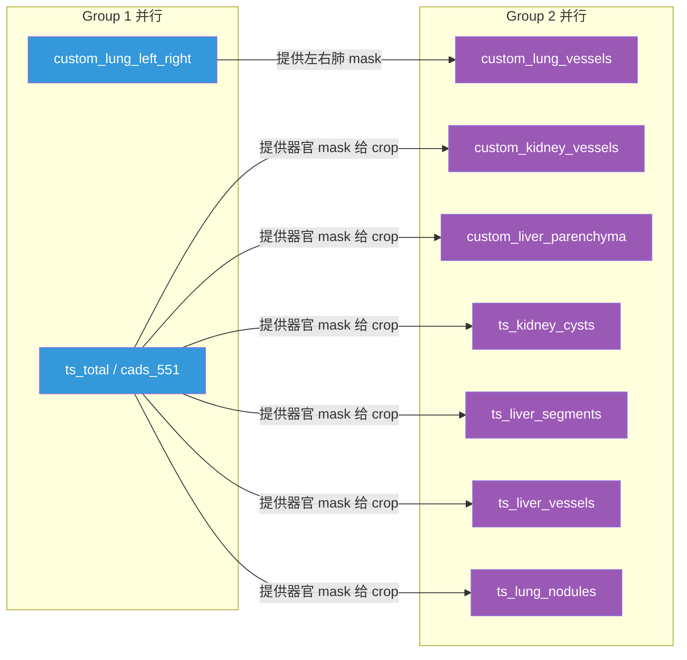
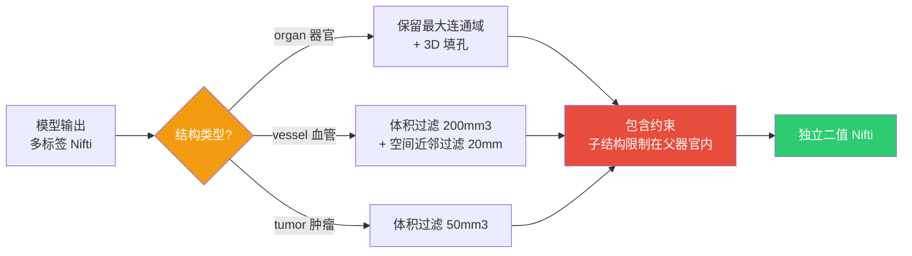

## 引言

腹部/胸部 CT 多器官自动分割是医学图像分析的基础任务，也是手术导航、治疗规划和影像组学的前提。然而，实际落地一个分割系统面临的核心挑战不是模型精度——而是**工程调度**。

开源的 TotalSegmentator <cite>[1]</cite> 能分割 104 类结构，CADS <cite>[2]</cite> 覆盖 18 个腹部器官，加上针对特定结构的自训练 nnUNet <cite>[3]</cite> 模型——每个模型各有所长，但它们是独立训练的，输出格式、标签体系、空间分辨率各不相同。如何将它们整合为一次调用、一套输出的统一工具？

WiseSegmentator 是我的答案。它不训练新模型，而是在已有模型之上构建一套调度、裁剪、后处理与分发管线。

---

## 核心矛盾

多模型 CT 分割系统面临三个层级的工程矛盾：

| 层级 | 矛盾 | 具体表现 |
|------|------|---------|
| 调度层 | 多模型 vs 单次推理 | 9 个模型需要排序、去重、依赖管理，不能每跑一个手工执行一次 |
| 计算层 | 全图推理 vs 显存限制 | 512x512x345 的 CT 全图推理跑一次就要 ~250 tiles，12GB 显卡加载两个模型就 OOM |
| 输出层 | 异构标签 vs 统一格式 | CADS 用 task_551 的 ID 体系，TotalSegmentator 用 task_name 体系，自训练模型各有自己的 label map |

核心矛盾：**如何用 12GB 显卡在合理时间内跑完一次多器官全量分割，并输出规范化的结果？**

---

## 架构概览


三条核心链路贯穿始终：

1. **解析链路**：一级目标（肺/肾/肝/胆囊）→ 二级目标（左肺、肺动脉、肺结节...）→ 所需模型集合。支持 `-s` 精确筛选二级结构，自动注入 crop 依赖的前序模型。
2. **执行链路**：依赖图 → 拓扑排序 → 分组（Group 1 无依赖模型并行，Group 2 依赖模型并行）。锚点模型可切换（`ts_total` 全覆盖 vs `cads_551` 轻量）。
3. **输出链路**：推理完成的模型输出按结构名拆分为独立二值 Nifti → 按一级目标分发 → 结构特定后处理 → 包含约束。

---

## 两级目标体系

这是整个框架的入口设计。两级目标体系的灵感来自解剖学的层级结构：

```
一级目标: lung
  ├── 二级目标: lung_left_right  → 结构: lung_left, lung_right
  ├── 二级目标: lung_lobes       → 结构: 5 个肺叶
  ├── 二级目标: pulmonary_artery → 结构: pulmonary_artery
  ├── 二级目标: pulmonary_vein   → 结构: pulmonary_vein
  └── 二级目标: lung_nodules     → 结构: lung_nodules
```

每个二级目标关联一个**默认模型**（`default_model`）：

```json
{
  "lung": {
    "secondary_targets": {
      "lung_left_right":  {"default_model": "custom_lung_left_right"},
      "lung_lobes":       {"default_model": "cads_551"},
      "pulmonary_artery": {"default_model": "custom_lung_vessels"},
      "pulmonary_vein":   {"default_model": "custom_lung_vessels"},
      "lung_nodules":     {"default_model": "ts_lung_nodules"}
    }
  }
}
```

当用户指定 `-p lung kidney` 时，TargetManager 展开所有二级目标 → 收集 default_model → 自动去重合并为全局模型集合。如果加上 `-s lung_left,pulmonary_artery`，则只收集这两个二级对应的模型，其余跳过。

**模型来源优先级**（同一结构被多个模型覆盖时）：`custom > ts > cads`。自训练模型针对特定数据训练精度最高，TS 通用性好，CADS 作为 fallback。

---

## 执行计划：从依赖图到分组并行



ModelCallPlanner 的核心逻辑是拓扑排序：维护一个 `dependency_graph`（模型 → 其依赖的模型集合），每轮找出所有依赖已满足的模型作为一组。Group 1 是无依赖模型（锚点模型 + 肺左右分割），Group 2 是依赖 Group 1 输出的 crop 模型。

`base_model` 切换的影响在这里体现：`-b cads_551` 会将 `ts_total` 从计划中替换为 `cads_551`，同时所有依赖 `ts_total` 的模型自动改为依赖 `cads_551`。`cads_551` 的 `tile_step_size` 从 0.5 提升至 0.75，tile 数从 ~80 降至 ~35，关键路径加速约 55%。

---

## ROI 裁剪推理：核心性能优化

这是整个系统最重要的优化。CT 图像 512x512x345 的全图推理非常昂贵，但很多"二级"结构只出现在器官局部区域。例如，肾血管只存在于肾门附近（占全图体积的 5-20%）。


在 `task_registry.json` 中为需要裁剪的任务配置 crop 规则：

```json
{
  "custom_kidney_vessels": {
    "crop": {
      "source_task": "cads_551",
      "structures": ["kidney_left", "kidney_right"],
      "addon_mm": 20
    }
  }
}
```

实现细节：
1. 从前序模型分割结果中提取指定结构的 mask（如 kidney_left + kidney_right 的并集）
2. 计算 mask 的 bounding box，按 `addon_mm` 扩展（防止边缘结构被截断）
3. 裁剪原始图像到 ROI，保存为临时文件
4. 在裁剪后的小图像上推理
5. 将推理结果零填充还原到原始空间

以肾血管为例：全图推理需要 1287 tiles（~136s），裁剪后仅覆盖肾门附近区域，tile 数大幅减少。肺血管裁剪到左右肺区域后约 150 tiles（全图 250）。

---

## Predictor 生命周期管理

nnUNet 模型加载的开销远大于推理本身：网络初始化约 50s，而实际 GPU 推理仅占总时间的约 11%。同时，12GB 显存放不下两个模型。

解决策略：**每个模型推理完成后立即释放，VRAM 中始终只保留当前模型**。

```python
def _execute_nnunet_task(self, task_config, ...):
    segmentation = self._execute_xxx_model(model_config, ...)
    # 每个模型只执行一次，推理完成后立即释放 Predictor
    self._release_predictor_by_task_config(task_config)
    return segmentation

def _release_predictor_by_task_config(self, task_config):
    predictor = self._predictor_cache.pop(cache_key, None)
    if predictor is not None:
        del predictor
        gc.collect()
        torch.cuda.empty_cache()
```

Predictor 缓存使用双重检查锁（double-check locking）确保线程安全：创建在锁外进行（避免阻塞其他线程的 IO），插入在锁内进行（防止重复创建）。

---

## 结构特定后处理

不同的解剖结构需要不同的后处理策略——一刀切的阈值过滤会破坏模型好不容易学到的边界。



**器官**（最大连通域 + 3D 填孔）：适用于 lung、kidney、liver、gallbladder、肺叶、肝段。假设模型主输出是连续的一团（解剖学本如此），去掉散在的孤立误检体素，填充内部空洞。

**血管**（体积过滤 + 近邻过滤）：以最大连通域为锚点，通过带物理 spacing 的欧氏距离变换，只保留距离锚点 20mm 以内的其他连通域。这能剔除远离主干血管的离散误检，同时保留分支结构。

**肿瘤**（体积过滤）：只移除 < 50mm^3 的碎片。肿瘤本身形状不规则，不能用连通域数量或空间约束来过度处理。

**包含约束**：`liver_tumor` 必须在 `liver` 的膨胀区域（margin 5mm）内，`kidney_cyst` 必须在 `kidney` 内。超出父器官边界的体素被视为误检直接移除。

所有 scipy 操作都在非零区域的 bounding box 内执行，避免全图计算。

---

## 推理与后处理重叠

传统流水线是"全推理 → 全后处理"，但后处理是 CPU 密集型、推理是 GPU 密集型——它们可以重叠。

实现方式：每完成一个模型推理后，检查哪些一级目标的所需模型已全部就绪 → 立即在后台线程提交该目标的提取+后处理任务。这样后处理与后续模型的推理并发运行：

```
时间轴 →
Group 1 推理: [custom_lung_left_right] [ts_total       ]
Group 2 推理: [custom_lung ][custom_kidney][...]
后处理:              [Lung 提取+后处理  ][Kidney 提取... ]
                    ↑ 肺模型齐备即触发    ↑ 肾模型齐备即触发
```

在多目标（all）场景下，这种重叠节省约 25-30s。

---

## 配置驱动的扩展体系

所有目标定义、模型注册、标签映射、后处理规则均通过 JSON 配置管理。添加新器官或新模型时，修改配置即可，无需改动代码：

| 配置文件 | 作用 |
|---------|------|
| `targets.json` | 一级/二级目标定义，每个二级的 default_model |
| `task_registry.json` | 任务配置：模型路径、来源、crop 规则 |
| `cads_structures.json` | CADS label_id → structure_name |
| `totalsegmentator_structures.json` | TS label_id → structure_name |
| `custom_structures.json` | 自训练模型 label_id → structure_name |

扩展新目标的标准流程是 7 步配置文件操作 + 1 步 CLI 注册，全程不改核心逻辑。

---

## 关键指标

| 维度 | 数据 |
|------|------|
| 支持一级目标 | 4（肺/肾/肝/胆囊） |
| 支持二级结构 | 30+ |
| 集成模型数 | 9（去重执行） |
| 全目标推理耗时 | ~4 min 39s（512x512x345 CT, 12GB GPU） |
| 后处理与推理重叠 | 节省 ~25-30s |
| VRAM 占用 | 始终只保留当前模型，12GB 可用 |
| 单元测试 | 115 passed, 61% 覆盖率 |
| Python 兼容 | 3.9 - 3.12 |

---

## 已知限制与演进方向

1. **模型加载开销**：每个 nnUNet 模型首次加载 ~50s（网络初始化），而实际 GPU 推理仅占总时间的 ~11%。ONNX / TensorRT 转换可降至 ~10s 并提速 2-5x。
2. **单 GPU 串行**：默认 `max_workers=1`，受 12GB 显存限制。但 Group 2 内的 crop 模型互不依赖，可在 24GB+ 显卡上并行执行。
3. **自训练模型域适应**：`custom_kidney_vessels` 训练于 CTA 数据，在普通 CT 上表现受限。
4. **模型权重分发**：目前需手动放置权重文件到约定目录，尚未自动下载。

未来方向：Group 2 模型按 ROI 体积动态调度并行、自动模型权重下载、批量处理复用 Predictor。

---

## 结语

医学图像分割的工程化不是在模型精度上"卷 SOTA"，而是解决多模型协同中的调度、显存和规范化输出问题。两级目标体系提供了精确到单个结构的控制粒度，ROI 裁剪让 12GB 显卡也能跑完 9 个模型的联合推理，结构特定后处理保证了解剖学合理性。

WiseSegmentator 代码仓库已开源：<https://github.com/YangCazz/CazzSegmentator>。

---

## 参考文献

<ol class="references">
<li><em>TotalSegmentator.</em> Wasserthal J, et al. Robust Semantic Segmentation of 104 Anatomical Structures in CT Images.<br><a href="https://github.com/wasserth/TotalSegmentator">https://github.com/wasserth/TotalSegmentator</a></li>
<li><em>CADS.</em> Cross-Abdomen Domain Segmentation model set, based on nnUNet.<br><a href="https://github.com/wasserth/TotalSegmentator">https://github.com/wasserth/TotalSegmentator</a></li>
<li><em>nnUNet.</em> Isensee F, et al. Self-configuring Method for Semantic Segmentation.<br><a href="https://github.com/MIC-DKFZ/nnUNet">https://github.com/MIC-DKFZ/nnUNet</a></li>
<li><em>nibabel.</em> Neuroimaging Informatics Technology Initiative. Python library for Nifti file I/O.<br><a href="https://nipy.org/nibabel/">https://nipy.org/nibabel/</a></li>
<li><em>scipy.ndimage.</em> SciPy Developers. Multi-dimensional Image Processing.<br><a href="https://docs.scipy.org/doc/scipy/reference/ndimage.html">https://docs.scipy.org/doc/scipy/reference/ndimage.html</a></li>
</ol>
