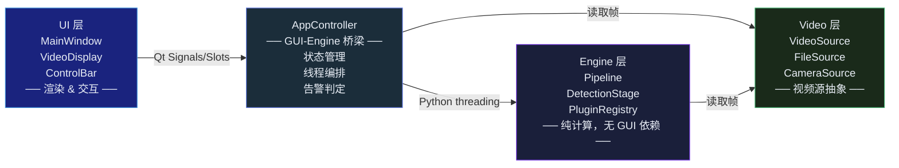
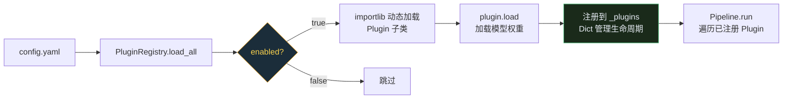
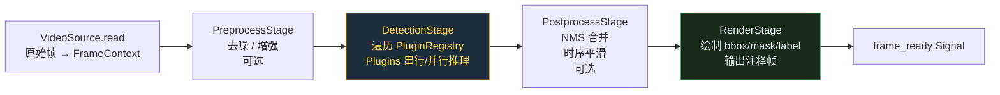
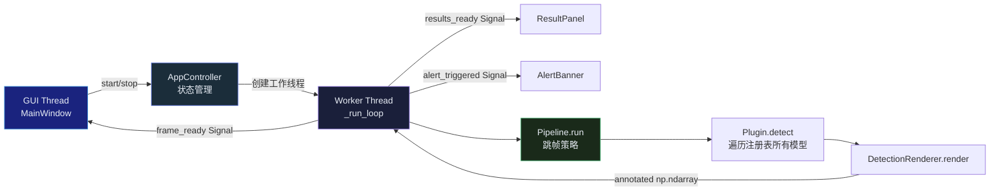
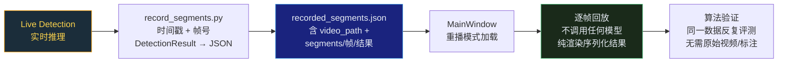

## 引言

WiseSurgery 是一个内窥镜手术智能识别系统，支持出血点、手术器械、异物和烟雾四种术中实时检测。它最初作为快速原型开发——PyQt6 界面直接调用 YOLO 模型，几百行代码堆在一个文件里，功能跑通就算完成。

但当需要同时管理四个检测模型、支持运行时动态启停、处理视频文件/摄像头双输入源时，原始架构的裂缝迅速扩大：模型加载代码散落在 UI 回调里，视频读取和推理挤在同一线程，添加新检测类型需要改动七八处代码。

这篇文章记录 v3.0.0 的架构重构——**不是为了"看起来更规范"，而是因为旧架构已经阻碍了功能迭代。**

---

## 旧架构的问题

重构前的代码结构大致是这样的：

```
src/
├── gui/main_window.py      # 界面 + 模型加载 + 推理调度 + 结果渲染
├── core/model_manager.py   # 模型管理（耦合了具体模型类型）
├── core/detection_engine.py # 检测引擎（和 GUI 循环紧密绑定）
└── utils/                  # 散落的工具函数
```

四个核心问题：

1. **GUI 和业务逻辑耦合**。`main_window.py` 里既有 `QWidget` 布局，又有 `YOLO.load()`，还有推理循环的 `while True`。调试任何一个维度都需要理解另外两个。

2. **模型扩展需要改多处代码**。新增一个检测类型（比如"组织损伤识别"），需要改 `model_manager`、`detection_engine`、`main_window` 三个模块，然后在五六处地方添加条件分支。

3. **视频处理和推理在同一线程**。摄像头 `cap.read()` 阻塞 + YOLO 推理阻塞 = 界面卡顿。暂停、恢复、跳帧的逻辑散落在各处，状态管理靠布尔变量和 `time.sleep()`。

4. **没有清晰的模块边界**。日志、配置、常量四处散落，测试无从下手——几乎所有功能都需要启动完整 GUI 才能验证。

---

## 新架构：三层解耦

新架构的核心思想：**GUI 不应该知道模型的存在，引擎不应该知道窗口的存在。**



目录结构也随之调整：

```
src/
├── app/controller.py        # 应用生命周期编排
├── engine/
│   ├── pipeline.py          # 可组合的检测流水线
│   ├── stage.py             # PipelineStage 抽象基类
│   ├── registry.py          # 配置驱动的 Plugin 注册表
│   ├── plugins/
│   │   ├── base.py          # DetectionPlugin + DetectionResult
│   │   ├── bleeding.py      # 出血点检测 (YOLO)
│   │   ├── instrument.py    # 器械检测 + 分割 (YOLO)
│   │   ├── foreign_object.py # 异物检测 (YOLO)
│   │   └── smoke.py         # 烟雾分类 (MobileNet)
│   └── postprocessing/
│       └── renderer.py      # 检测结果渲染（框/掩码/标签）
├── video/
│   ├── source.py            # VideoSource ABC
│   ├── reader.py            # 线程安全 VideoReader
│   ├── file_source.py       # 视频文件源
│   └── camera_source.py     # 摄像头源
├── ui/                      # GUI 组件（纯视图）
└── shared/                  # 日志、配置、常量、序列化
```

---

## 四个关键设计决策

### Plugin 抽象：让每个检测模型成为独立插件

所有检测模型实现同一个接口：

```python
class DetectionPlugin(ABC):
    @property
    @abstractmethod
    def name(self) -> str: ...

    @abstractmethod
    def load(self) -> None: ...

    @abstractmethod
    def detect(self, frame: np.ndarray) -> DetectionResult: ...

    @abstractmethod
    def unload(self) -> None: ...
```

`BleedingPlugin`、`InstrumentPlugin`、`ForeignObjectPlugin` 各自封装 YOLO 模型的加载和推理<sup><a href="#参考文献">[1]</a></sup>，`SmokePlugin` 封装 MobileNet 分类器<sup><a href="#参考文献">[3]</a></sup>。每个 Plugin 负责自己的模型生命周期（load/unload）、置信度阈值、设备选择。

**统一返回类型** `DetectionResult` —— 无论检测到的是 bounding box 还是分类标签，外部消费方只看到一个统一的数据结构：

```python
@dataclass
class DetectionResult:
    source: str                    # 插件名
    boxes: list[tuple[float, ...]]  # [x1, y1, x2, y2]
    scores: list[float]            # 置信度
    labels: list[str]              # 标签
    masks: list[np.ndarray] | None # 分割掩码（可选）
    metadata: dict                 # 扩展字段（烟雾概率等）
```

`metadata` 是关键——它允许不同类型的检测器携带自己的扩展数据，而不需要修改基类。烟雾检测器的 `has_smoke` 和 `smoke_confidence` 就放在 `metadata` 里。

### PluginRegistry：配置驱动的模型管理



旧架构中，启用/禁用模型需要改代码。新架构用 `config.yaml` 驱动：

```yaml
models:
  bleeding_detection:
    enabled: true
    plugin_class: BleedingPlugin
    model_path: models/bleeding_detection/best.pt
    confidence_threshold: 0.5
  smoke_detection:
    enabled: true
    plugin_class: SmokePlugin
    model_path: models/smoke_detection/best.pth
    model_type: mobilenet
    num_classes: 2
```

`PluginRegistry` 在启动时遍历配置，为每个 `enabled: true` 的条目加载对应的 Plugin 类：

```python
class PluginRegistry:
    _BUILTIN_PLUGINS = {
        'BleedingPlugin': 'src.engine.plugins.bleeding',
        'InstrumentPlugin': 'src.engine.plugins.instrument',
        'ForeignObjectPlugin': 'src.engine.plugins.foreign_object',
        'SmokePlugin': 'src.engine.plugins.smoke',
    }

    def load_all(self) -> list[str]:
        loaded = []
        for name, cfg in self._config.get('models', {}).items():
            if not cfg.get('enabled', False):
                continue
            self._load_one(name, cfg)
            loaded.append(name)
        return loaded
```

运行时还可以动态调用 `enable()` / `disable()` ——前者延迟加载模型权重，后者立即卸载释放显存。`reload()` 则是一个组合操作，用于配置更新后重新加载。

**这个设计的一个好处**：添加新检测类型时，只需要三步——(1) 写一个 `DetectionPlugin` 子类，(2) 在 `_BUILTIN_PLUGINS` 注册映射，(3) 在 `config.yaml` 添加配置项。不需要改动 Pipeline、Controller、UI 的任何代码。

### Pipeline：可编排的检测流水线

Pipeline 是处理阶段的线性组合。当前只有一个 `DetectionStage`，但设计允许后续插入预处理（去噪/增强）、后处理（NMS 合并、时序平滑）等阶段：



`DetectionStage` 的实现：

```python
class PipelineStage(ABC):
    @abstractmethod
    def process(self, ctx: FrameContext) -> FrameContext: ...

class DetectionStage(PipelineStage):
    def process(self, ctx: FrameContext) -> FrameContext:
        results = {}
        for plugin in self._registry:
            start = time.perf_counter()
            result = plugin.detect(ctx.frame)
            results[plugin.name] = result
            if (time.perf_counter() - start) * 1000 > 100:
                logger.debug(f"{plugin.name}: {elapsed:.0f}ms")
        ctx.results = results
        return ctx
```

每个 Stage 接收 `FrameContext`，往里面放东西，传给下一个 Stage。帧可以原地修改（例如预处理做去噪），结果持续累加。这是一种通用的流式处理模式——帧进来了，经过若干道工序后带着所有中间产物出去。

每个 Plugin 的推理耗时被单独记录，超过 100ms 就输出 debug 日志。四个模型各 50ms 和四个模型各 200ms，前者可以做实时检测，后者需要考虑跳帧策略——这个度量是性能优化的入口。

### AppController：GUI 和 Engine 之间的唯一桥梁

这是整个架构里最关键的一个类。



它的核心职责：

1. **拥有 Engine 层的所有对象**（`PluginRegistry`、`Pipeline`、`DetectionRenderer`）
2. **管理工作线程**（从 GUI 线程分离推理循环）
3. **通过 Qt Signals 向 GUI 报告结果**（`frame_ready`、`results_ready`、`alert_triggered`）<sup><a href="#参考文献">[2]</a></sup>
4. **实现跳帧策略**（每 N 帧做一次推理，其余帧复用上次结果）

```python
class AppController(QObject):
    frame_ready = pyqtSignal(np.ndarray)     # 渲染后的画面
    results_ready = pyqtSignal(dict)          # 原始检测结果
    alert_triggered = pyqtSignal(str, str, str, int)  # 告警
    state_changed = pyqtSignal(AppState)      # 状态变化

    def _run_loop(self):
        while not self._stop.is_set():
            frame = self._source.read()
            if self._frame_counter % 3 == 1:  # 跳帧
                self._last_results = self._pipeline.run(frame)
            output = self._renderer.render(frame, self._last_results)
            self.frame_ready.emit(output)
```

GUI 层（`MainWindow`）做的事情非常简单：接收 `frame_ready` 信号，把 `np.ndarray` 喂给 `VideoDisplayWidget` 显示；接收 `results_ready` 信号，把字典传给 `ResultPanel` 渲染。它不调用任何 YOLO API，不管理任何线程，不知道视频是从文件还是摄像头来的。

这种设计让**在无 GUI 环境下运行检测**成为可能——只需要 `Pipeline.run(frame)`，不依赖 PyQt。事实上，后续的命令行批量推理功能就完全复用了这套 Engine 层。

---

## 视频源抽象

另一个常被忽视的点是视频源。旧代码中，`cv2.VideoCapture` 的调用散落在主窗口各处——打开文件、读取帧、进度条跳转、错误处理，全在 UI 代码里。

新设计用一个统一的抽象：

```python
class VideoSource(ABC):
    def open(self) -> bool: ...
    def close(self) -> None: ...
    def read(self) -> np.ndarray | None: ...
    def seek(self, position_percent: int) -> bool: ...
    def info(self) -> VideoInfo: ...
```

`FileSource` 和 `CameraSource` 各自实现这个接口。对 Engine 层来说，它只知道"有一个 VideoSource，调用 `.read()` 就能拿到一帧"。

`FileSource` 的 `preview()` 方法值得一提——在用户选择视频文件后、点"开始"之前，它打开一个临时 reader 读第一帧显示在界面上。这个操作和主推理循环完全独立，用完后 reader 立即关闭，不给主循环留泄露的句柄。

---

## 告警系统

手术监控系统的告警延迟直接影响临床价值。WiseSurgery 的告警通过 `AppController._check_alerts()` 在推理循环中判定：

```python
def _check_alerts(self, results: dict[str, DetectionResult]):
    for name, r in results.items():
        if name == 'bleeding_detection' and len(r.boxes) > 0:
            if max(r.scores) > 0.8:
                self.alert_triggered.emit('danger', '检测到出血点', ...)
        elif name == 'smoke_detection' and r.metadata.get('has_smoke'):
            if r.metadata.get('smoke_confidence', 0) > 0.7:
                self.alert_triggered.emit('warning', '检测到烟雾', ...)
```

`AlertBanner` 组件接收到信号后，在视频画面顶部以动画横幅展示告警——红色出血警告（`danger`）和黄色烟雾警告（`warning`）在视觉上有明确区分。`duration` 参数控制横幅持续时间，到期后自动消失。

这个系统后续的一个扩展方向是：将告警判定逻辑从 `AppController` 中抽出来成为一个独立的 `AlertStage`，挂到 Pipeline 末端。这样告警规则也能通过配置文件定义，而不需要硬编码在 Controller 里。

---

## 重播模式：非破坏性的结果验证

医疗 AI 系统的一个特殊需求是**可审计性**——你需要能够事后查看"在那个时间点系统看到了什么、判定了什么"。



WiseSurgery 的 `scripts/record_segments.py` 在推理时同时录制两样东西：原始视频帧的时间戳，和每帧的检测结果（序列化为 JSON）。

`scripts/replay_recorded.py` 和 MainWindow 内置的重播模式加载这份记录，逐帧回放标注好的画面。重播不调用任何模型——它只是把序列化好的 `DetectionResult` 重新渲染到视频帧上。

这意味着算法团队可以用同一份录制数据反复验证模型改进的效果，不需要重新标注、不需要找原始视频。`scripts/record_segments_batch.py` 更进一步，支持批量处理整个目录的视频文件。

---

## 经验总结

### "以后再重构"通常是假的

旧架构的很多耦合不是设计出来的，是堆积出来的——每次加新功能时多做一点捷径，十个捷径叠在一起就是一团乱麻。v3 重构花了相当大的精力，但如果从一开始就有清晰的模块边界，后续每个功能改动都会更快。

### 抽象不是为了"好看"，是为了隔离变化

Plugin 抽象值不值得？如果只有一个检测模型，过度设计。但当你有四个不同后端（YOLO x3 + MobileNet x1），且每个的配置维度不同时，统一的 `DetectionPlugin` 接口就是所有上层代码的稳定锚点。Pipeline 和 Controller 不知道也不应该知道它们下面跑的是 YOLO 还是 PyTorch 原生模型。

### Qt Signals 是 GUI 解耦的正确方式

PyQt 项目最常见的反模式是"信号槽连接到一个 lambda，lambda 里做了五件事"。WiseSurgery 坚持一个原则<sup><a href="#参考文献">[2]</a></sup>：**Signal Handler 只做视图更新**——接收数据、刷新 widget、完事。所有业务逻辑都在 Controller 或 Engine 层的线程里完成，结果通过信号单向流向 GUI。GUI 永远不需要等待 Engine。

### 配置驱动 > 代码驱动

`config.yaml` + `PluginRegistry` 的组合意味着：添加模型 = 写一个 Plugin 类 + 改一行配置。不需要重新编译、不需要改 UI、不需要改 Controller。对于需要频繁调整模型参数的研究环境，这是刚需而不是 nice-to-have。

### 录制回放是医疗 AI 的重要基础设施

这个功能在 v1 和 v2 里都没有，是 v3 架构重构后才自然浮现出来的——因为 `DetectionResult` 是 dataclass，天然可以序列化；因为 VideoSource 是抽象，重播时只需要一个虚假的帧源。好的架构不是提前规划所有功能，而是让新功能可以被"自然叠加"。

---

## 结语

WiseSurgery v3.0.0 的代码量实际比 v2 少了约 30%，但功能完整度和可维护性远超旧版本。删除的代码里有很多是旧的耦合逻辑——那些在 GUI 和业务逻辑间勉强调和的胶水代码。

重构后的 Engine 层完全独立于 PyQt，这让后续做命令行工具、批量处理、自动化测试都变得简单。Plugin 体系建立后，添加新的检测类型从"改七八处"变成了"写一个类 + 改一行配置"。

代码仓库：<https://github.com/YangCazz/WiseSurgery>

---

## 参考文献

1. *Ultralytics YOLO.* Jocher G, et al. YOLO: Real-time Object Detection.  
   <https://github.com/ultralytics/ultralytics>
2. *PyQt6 Documentation.* Riverbank Computing. Python bindings for Qt.  
   <https://www.riverbankcomputing.com/static/Docs/PyQt6/>
3. *MobileNet.* Howard AG, et al. Efficient Convolutional Neural Networks for Mobile Vision Applications.  
   <https://arxiv.org/abs/1704.04861>
{: .references }
