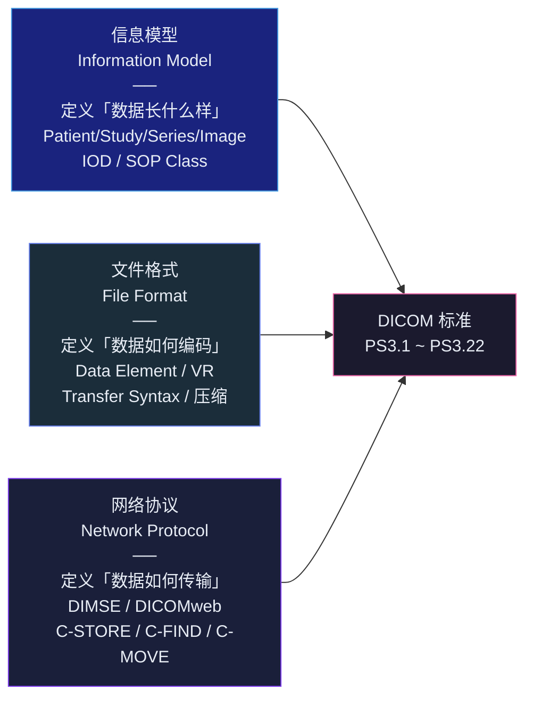
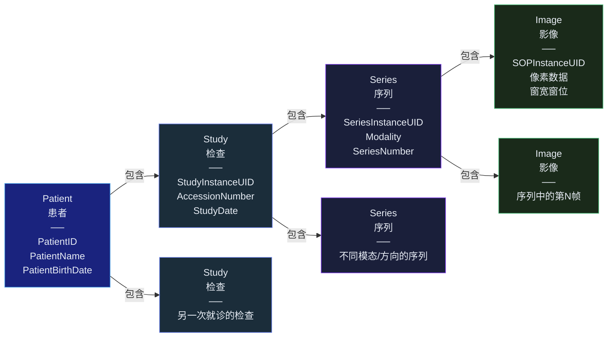
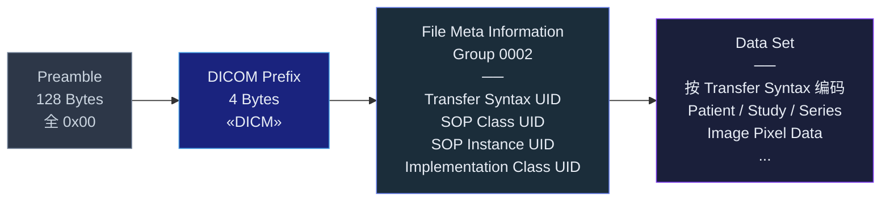
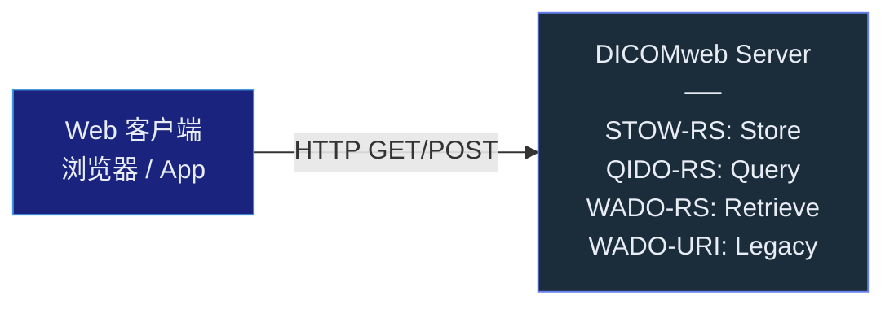
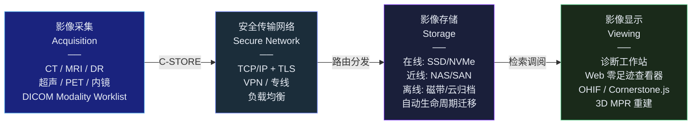
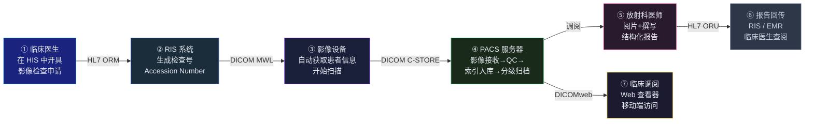

## 引言

你去医院做 CT 或 MRI，扫描结束后，影像科医生在你的检查还没做完时就已在阅片室里看到了图像。几分钟后，临床医生在诊室里打开电脑，调出了同一组影像和刚写完的诊断报告。

这背后是一整套协议、文件格式和系统架构在协同工作——**DICOM** 负责影像的编码与传输，**PACS** 负责影像的存储与管理。两者是医学影像数字化的基石，也是每一个医学影像 AI 工程师必须躬身理解的基础设施。

这篇文章按由浅入深的逻辑组织：先理解 DICOM 的信息模型和文件格式，再掌握网络协议和 PACS 系统架构，最后通过 Python 代码和 Docker 部署完成实战闭环。所有关键概念均标注了 DICOM 标准出处<cite>[1]</cite>，方便循证查阅。

---

## 为什么需要 DICOM？

在 DICOM 诞生之前（1980 年代），每家影像设备厂商都有自己的私有图像格式。西门子的 CT 图像只能在西门子的工作站上看，GE 的 MRI 图像需要 GE 的软件才能解析。医院里堆满了各家厂商的独立工作站，影像交换几乎不可能。

**DICOM（Digital Imaging and Communications in Medicine）** 由 ACR（美国放射学会）和 NEMA（美国电气制造商协会）于 1983 年发起，1993 年发布 DICOM 3.0 正式版<cite>[2]</cite>。它不是单个协议，而是一个完整的标准体系——由 NEMA DICOM 标准委员会维护，最新版为 2025b/2026b<cite>[1]</cite>。

**DICOM 标准的"三位一体"：**



DICOM 标准按 Part 组织（PS3.1 到 PS3.22），核心部分如下<cite>[1]</cite>：

| Part | 内容 | 典型用途 |
|---|---|---|
| PS3.3 | 信息对象定义（IOD） | 定义"CT 图像应该包含哪些属性" |
| PS3.4 | 服务类规范（SOP Class） | 定义"CT 图像支持哪些操作" |
| PS3.5 | 数据结构与编码 | 定义 Tag、VR、Transfer Syntax |
| PS3.6 | 数据字典 | 所有 DICOM Tag 的注册表 |
| PS3.7 | 消息交换（DIMSE） | C-STORE、C-FIND、C-MOVE 等操作 |
| PS3.8 | 网络通信支持 | TCP/IP、TLS |
| PS3.10 | 文件格式 | `.dcm` 文件的结构 |
| PS3.15 | 安全与系统管理 | 加密、数字签名 |
| PS3.18 | Web 服务（DICOMweb） | RESTful STOW-RS/QIDO-RS/WADO-RS |
| PS3.22 | 实时通信（DICOM-RTV） | 手术直播、远程超声实时视频流 |

---

## DICOM 信息模型：数据的骨架

### Patient → Study → Series → Image 四层模型

DICOM 用严格的层级结构组织所有医学影像数据。理解这四层是理解 DICOM 的前提<cite>[2]</cite>：



每一个层级都有全局唯一的 UID 来标识：

| 层级 | 唯一标识符 | 说明 |
|---|---|---|
| Study | `StudyInstanceUID` (0020,000D) | 一次就诊检查的全局 ID |
| Series | `SeriesInstanceUID` (0020,000E) | 一次扫描中某个序列的全局 ID |
| Image | `SOPInstanceUID` (0008,0018) | 单张影像的全局唯一 ID |

### IOD：信息对象定义

**IOD（Information Object Definition）** 是对某类医学数据的完整"属性清单"。比如 CT Image IOD 规定了：一个 CT 图像必须包含 Patient 模块、General Study 模块、Image Pixel 模块等等<cite>[1]</cite>。

每个 IOD 由若干 **IE（Information Entity）** 组成，每个 IE 又包含若干 **Module**，每个 Module 由若干 **Attribute** 组成：

```
CT Image IOD
├── Patient IE
│   └── Patient Module → PatientName, PatientID, PatientBirthDate
├── Study IE
│   └── General Study Module → StudyInstanceUID, StudyDate, AccessionNumber
├── Series IE
│   └── General Series Module → SeriesInstanceUID, Modality, SeriesNumber
├── Equipment IE
│   └── General Equipment Module → Manufacturer, InstitutionName
└── Image IE
    ├── Image Pixel Module → Rows, Columns, BitsAllocated, PixelData
    └── CT Image Module → KVP, ExposureTime, RotationDirection
```

### SOP Class = IOD + Service

**SOP Class（Service-Object Pair Class）** 是 DICOM 最核心的概念——它将"数据定义"（IOD）与"可执行操作"（Service）绑定在一起<cite>[1]</cite>。

换个通俗的类比：IOD 像是"数据表的结构定义"，SOP Class 像是"API 端点 = 数据表 + 允许的 HTTP 方法"。

每个 SOP Class 有唯一的 SOD Class UID。常见的存储类 SOP Class：

| SOP Class 名称 | UID | 用途 |
|---|---|---|
| CT Image Storage | `1.2.840.10008.5.1.4.1.1.2` | CT 影像存储 |
| MR Image Storage | `1.2.840.10008.5.1.4.1.1.4` | MR 影像存储 |
| US Image Storage | `1.2.840.10008.5.1.4.1.1.6.1` | 超声影像存储 |
| Secondary Capture Image | `1.2.840.10008.5.1.4.1.1.7` | 二次采集图像 |
| Grayscale Softcopy Presentation State | `1.2.840.10008.5.1.4.1.1.1.1` | GSPS 显示参数 |
| X-Ray Radiation Dose SR | `1.2.840.10008.5.1.4.1.1.88.67` | 辐射剂量结构化报告 |

### UID 系统：全局唯一的基石

DICOM 中一切事物的全局标识都依赖 UID（Unique Identifier）。UID 遵循 ISO 8824 的 OID 体系，格式为 `<org root>.<suffix>`，最大 64 字符<cite>[4]</cite>。

**关键规则：**

- **`1.2.840.10008`** 是 NEMA 注册的根节点，**仅用于 DICOM 标准定义**，不得用于私有 UID<cite>[4]</cite>
- **禁止解析 UID 语义**：UID 不应被程序解析出含义，只应做等值比对
- **禁止派生**：不要拿别人的 UID 加后缀来生成新 UID
- **私有 UID**：机构需从 ANSI（美国）等注册机构申请自己的 org root，然后在内部保证 suffix 的唯一性

---

## DICOM 文件格式：像素的容器

### 文件结构全景

一个 `.dcm` 文件的结构如下<cite>[2]</cite>：



**关键点：** File Meta Information Header 始终使用 **Explicit VR Little Endian** 编码，不论后续 Data Set 的 Transfer Syntax 是什么。这确保了任何 DICOM 解析器都能先读取元信息，再根据其中的 Transfer Syntax UID 正确解码后续数据。

### Data Element：数据的基本单元

Data Set 由若干 **Data Element** 有序排列而成。每个 Data Element 的结构取决于编码方式<cite>[3]</cite>：

**Explicit VR（显式值类型）：**

```
┌──────────┬──────────┬──────────┬──────────┐
│  Tag     │   VR     │   VL     │  Value   │
│  4 Bytes │ 2 Bytes  │2/4 Bytes │ Variable │
└──────────┴──────────┴──────────┴──────────┘
```

**Implicit VR（隐式值类型，默认传输语法）：**

```
┌──────────┬──────────┬──────────┐
│  Tag     │   VL     │  Value   │
│  4 Bytes │ 4 Bytes  │ Variable │
└──────────┴──────────┴──────────┘
```

**Tag 的构成：** 4 字节分为 Group Number（2 字节）+ Element Number（2 字节）。常用 Tag 示例<cite>[3]</cite>：

| Tag | 属性名 | 含义 |
|---|---|---|
| `(0010,0010)` | PatientName | 患者姓名 |
| `(0010,0020)` | PatientID | 患者 ID |
| `(0020,000D)` | StudyInstanceUID | 检查实例 UID |
| `(0020,000E)` | SeriesInstanceUID | 序列实例 UID |
| `(0008,0018)` | SOPInstanceUID | 影像实例 UID |
| `(0008,0060)` | Modality | 设备类型（CT/MR/US/...） |
| `(0028,0010)` | Rows | 图像高度（像素） |
| `(0028,0011)` | Columns | 图像宽度（像素） |
| `(0028,0100)` | BitsAllocated | 每像素分配的位数 |
| `(0028,0103)` | PixelRepresentation | 0=无符号, 1=有符号 |
| `(7FE0,0010)` | PixelData | **图像像素数据本体** |

### Value Representation（VR）类型体系

VR 定义了每个 Tag 对应的数据类型。PS3.6 数据字典维护了所有 Tag → VR 的映射<cite>[3]</cite>。

**常用字符串 VR：**

| VR | 含义 | 最大长度 |
|---|---|---|
| `PN` | Person Name | 64 字符/组 |
| `LO` | Long String | 64 字符 |
| `SH` | Short String | 16 字符 |
| `DA` | Date（YYYYMMDD） | 8 字节固定 |
| `TM` | Time（HHMMSS.frac） | 16 字节 |
| `UI` | Unique Identifier | 64 字节 |
| `CS` | Code String | 16 字节 |

**数值 VR：**

| VR | 含义 | 字节数 |
|---|---|---|
| `US` | Unsigned Short (16-bit) | 2 |
| `UL` | Unsigned Long (32-bit) | 4 |
| `SS` | Signed Short | 2 |
| `SL` | Signed Long | 4 |
| `FL` | Float Single (IEEE 754 binary32) | 4 |
| `FD` | Float Double (IEEE 754 binary64) | 8 |

**二进制/容器 VR：**

| VR | 含义 | 注意 |
|---|---|---|
| `OB` | Other Byte | 字节序无关 |
| `OW` | Other Word (16-bit) | 需考虑字节序 |
| `SQ` | Sequence of Items | 嵌套 Data Set |
| `UN` | Unknown | 字节序无关 |

### Transfer Syntax（传输语法）

Transfer Syntax 定义了 Data Set 的编码方式，包括字节序、VR 处理方式和像素数据压缩<cite>[3]</cite>：

| 传输语法 UID | 名称 | 特点 |
|---|---|---|
| `1.2.840.10008.1.2` | Implicit VR Little Endian | **默认语法**，无 VR 字段 |
| `1.2.840.10008.1.2.1` | Explicit VR Little Endian | **最常用**，有 VR 字段 |
| `1.2.840.10008.1.2.2` | Explicit VR Big Endian | 已废弃 |
| `1.2.840.10008.1.2.5` | RLE Lossless | 无损游程编码 |
| `1.2.840.10008.1.2.4.50` | JPEG Baseline（有损） | 1:10 压缩比 |
| `1.2.840.10008.1.2.4.70` | JPEG Lossless | 1:3 压缩比 |
| `1.2.840.10008.1.2.4.80` | JPEG-LS Lossless | 更优无损压缩 |
| `1.2.840.10008.1.2.4.90` | JPEG 2000 Lossless | 支持渐进式传输 |
| `1.2.840.10008.1.2.4.201` | HTJ2K（High-Throughput JPEG 2000） | 现代高性能压缩 |
| `1.2.840.10008.1.2.4.110` | JPEG XL | 2025 年新增 |

### 像素数据编码

图像像素存储在 `(7FE0,0010)` PixelData 标签中。对于未压缩图像，像素值是一块连续的字节数组，其布局由以下标签共同决定<cite>[3]</cite>：

- `(0028,0010)` Rows — 图像高度
- `(0028,0011)` Columns — 图像宽度
- `(0028,0100)` BitsAllocated — 每像素位数（如 8 或 16）
- `(0028,0101)` BitsStored — 实际有效位数
- `(0028,0102)` HighBit — 最高有效位位置
- `(0028,0103)` PixelRepresentation — 0=无符号, 1=有符号（补码）
- `(0028,0002)` SamplesPerPixel — 1=灰度, 3=RGB
- `(0028,0004)` PhotometricInterpretation — `MONOCHROME1`/`MONOCHROME2`/`RGB`/`YBR_FULL`

对于压缩图像（Encapsulated），PixelData 的 Value Length 设为 `FFFFFFFFH`（Undefined Length），内部以 Fragments 形式存储压缩码流。

---

## DICOM 网络协议：影像的流转

### DIMSE：DICOM 消息服务元素

**DIMSE（DICOM Message Service Element）** 是基于 TCP/IP 的应用层协议集，定义了影像设备间通信的核心操作<cite>[5]</cite>。DIMSE 采用客户端-服务器模型，角色分为：

- **SCU（Service Class User）**：发起请求的一方（如 CT 设备请求存储图像）
- **SCP（Service Class Provider）**：提供服务的一方（如 PACS 服务器接收并存储图像）

### 四大核心 DIMSE 操作

| 操作 | 全称 | 作用 | 类比 | 数据流向 |
|---|---|---|---|---|
| **C-STORE** | Composite Store | 发送 DICOM 数据到对方存储 | HTTP PUT / 文件上传 | SCU → SCP |
| **C-FIND** | Composite Find | 按条件查询元数据（不传输图像本体） | HTTP GET（仅返回索引） | SCU → SCP → SCU |
| **C-MOVE** | Composite Move | 请求 PACS 将数据推送到第三方节点 | 重定向下载 | SCU → SCP → 第三方 |
| **C-ECHO** | Verification | 心跳检测，验证 DICOM 连通性 | PING | SCU ⇄ SCP |

**C-MOVE 与 C-GET 的关键区别：**

C-MOVE 让 PACS 主动将数据**推送到第三方目标**（目标需预先配置为 SCP 监听模式），适合跨系统迁移。C-GET 则在**同一关联内**由服务器返回数据给请求客户端，不涉及第三方，但正逐步被 DICOMweb 的 WADO-RS 取代<cite>[5]</cite>。

### DICOM Association 协商

在 DICOM 节点间传输数据前，必须先建立 **Association（关联）**。协商过程类似于 TLS 握手<cite>[5]</cite>：

```
SCU                                          SCP
 │                                            │
 │── A-ASSOCIATE-RQ ────────────────────────→│
 │   "我是 CT_SCU，我要向你存 CT 图像"         │
 │   携带：Called AE Title, Calling AE Title   │
 │   Presentation Context（SOP Class + TS 列表）│
 │                                            │
 │←─ A-ASSOCIATE-RP ──────────────────────── │
 │   "同意/拒绝"                               │
 │   同意：返回匹配的 Presentation Context      │
 │                                            │
 │── DIMSE 操作（C-STORE/C-FIND/...） ──────→│
 │                                            │
 │── A-RELEASE-RQ ──────────────────────────→│
 │←─ A-RELEASE-RP ────────────────────────── │
 │                                            │
```

**关键参数：**
- **AE Title（Application Entity Title）**：16 字节以内的唯一标识，如 `CT_SCU`、`PACS_SCP`。两台 DICOM 设备的 AE Title 必须互相匹配才能通信。
- **Presentation Context**：SCU 列出自己支持的 SOP Class + Transfer Syntax 组合，SCP 逐个回复接受或拒绝。

### DICOMweb：RESTful API 时代

传统 DIMSE 基于 TCP 104 端口和二进制协议，不友好于 Web 和移动端。DICOMweb（PS3.18）提供了基于 HTTP 的 RESTful 替代方案<cite>[6]</cite>：



| DICOMweb 协议 | 对应 DIMSE | HTTP 方法 | 用途 |
|---|---|---|---|
| **STOW-RS**（Store Over the Web） | C-STORE | POST | 上传 DICOM 文件 |
| **QIDO-RS**（Query Based on ID for DICOM Objects） | C-FIND | GET | 查询 Patients/Studies/Series/Instances |
| **WADO-RS**（Web Access to DICOM Objects） | C-MOVE/C-GET | GET | 检索 DICOM 实例/帧 |
| **WADO-URI** | C-MOVE | GET + URL 参数 | 旧版，逐步被 WADO-RS 取代 |

QIDO-RS 查询示例（查询某患者的所有检查）：

```
GET /dicom-web/studies?00100020=ACC123456&includefield=all
Accept: application/dicom+json
```

DICOMweb 是现代云端 PACS 和零足迹 Web 阅片器（如 OHIF Viewer）的基础——通过浏览器直接调用 REST API 获取影像和元数据，无需安装任何客户端软件<cite>[6]</cite>。

---

## PACS 系统架构：医院的影像中枢

### 四大核心组件

**PACS（Picture Archiving and Communication System）** 是整个医院影像工作流的中枢系统<cite>[7]</cite>：



### 分层存储策略

医学影像数据量巨大——一家三甲医院日均产生 50-200GB 影像。PACS 采用分层存储控制成本<cite>[7]</cite>：

| 层级 | 存储介质 | 保存时限 | 访问延迟 |
|---|---|---|---|
| **在线** | SSD/NVMe、高性能 SAN | 近期 3-12 个月 | <10ms |
| **近线** | HDD NAS、对象存储 | 1-5 年 | <1s |
| **离线** | 磁带库、冷云存储（AWS Glacier） | 长期归档（法律规定 15 年以上） | 分钟级 |

系统通过配置策略自动将老数据从在线迁移到近线再到离线——这个过程对医生完全透明，他们只感觉到"所有历史影像都能查到"。

### 与医院信息系统的集成

PACS 不是孤岛。它需要与多个医院信息系统交互<cite>[7]</cite>：

| 系统 | 全称 | 交互方式 | 传递的信息 |
|---|---|---|---|
| **RIS** | 放射科信息系统 | HL7 v2 ORM/ORU | 检查申请、报告回传 |
| **HIS** | 医院信息系统 | HL7 v2 ADT | 患者入出转、挂号信息 |
| **EMR** | 电子病历 | HL7 v2 / FHIR | 诊断报告、关键影像 |
| **Worklist** | 设备工作列表 | DICOM Modality Worklist | 预约信息→设备自动填充患者信息 |

**HL7 v2 消息类型速览：**

| 消息类型 | 含义 | 触发时机 |
|---|---|---|
| ADT^A01 | 患者入院 | 住院登记时 |
| ADT^A03 | 患者出院 | 出院结算时 |
| ORM^O01 | 检查申请 | 医生开检查单时 |
| ORU^R01 | 检查报告 | 放射科医生完成报告时 |

### 完整临床工作流闭环



---

## 实战：用 Python 操作 DICOM

### 使用 pydicom 读取和解析 DICOM 文件

`pydicom` 是 Python 生态中最成熟的 DICOM 文件读写库<cite>[8]</cite>。

```bash
pip install pydicom matplotlib
```

**读取并查看 DICOM 文件的基本信息：**

```python
import pydicom
from pydicom.errors import InvalidDicomError

def read_dicom(filepath):
    """读取并打印 DICOM 文件的关键信息"""
    try:
        ds = pydicom.dcmread(filepath)
    except InvalidDicomError:
        print(f"不是有效的 DICOM 文件: {filepath}")
        return None

    # 查看文件元信息
    print(f"Transfer Syntax: {ds.file_meta.TransferSyntaxUID}")
    print(f"SOP Class UID:   {ds.file_meta.MediaStorageSOPClassUID}")

    # 访问常见标签（pydicom 支持属性名和 Tag 两种方式）
    print(f"Patient Name:     {ds.get('PatientName', 'N/A')}")
    print(f"Patient ID:       {ds.get('PatientID', 'N/A')}")
    print(f"Study Date:       {ds.get('StudyDate', 'N/A')}")
    print(f"Modality:         {ds.get('Modality', 'N/A')}")
    print(f"Rows × Columns:   {ds.Rows} × {ds.Columns}")
    print(f"Bits Allocated:   {ds.BitsAllocated}")
    print(f"Samples/Pixel:    {ds.SamplesPerPixel}")

    # 如果存在窗宽窗位，读取显示参数
    window_center = ds.get('WindowCenter', None)
    window_width  = ds.get('WindowWidth',  None)
    if window_center is not None:
        print(f"Window Center/Width: {window_center} / {window_width}")

    return ds

# 使用示例
ds = read_dicom('example.dcm')
```

**提取像素数据并显示：**

```python
import matplotlib.pyplot as plt

def show_dicom_image(ds):
    """从 DICOM 数据集中提取并显示图像"""
    pixel_array = ds.pixel_array

    # 如果是多帧图像（如增强 CT），取第一帧
    if pixel_array.ndim == 3:
        pixel_array = pixel_array[0]

    # 对 CT 图像应用窗宽窗位
    if ds.Modality == 'CT':
        wc = ds.WindowCenter
        ww = ds.WindowWidth
        if hasattr(wc, '__iter__'):
            wc, ww = wc[0], ww[0]
        w_min = wc - ww / 2
        w_max = wc + ww / 2
        pixel_array = pixel_array.clip(w_min, w_max)

    plt.imshow(pixel_array, cmap='gray')
    plt.title(f"{ds.Modality} - {ds.get('PatientName', 'Unknown')}")
    plt.axis('off')
    plt.show()

show_dicom_image(ds)
```

### 使用 pynetdicom 实现 DICOM 网络通信

`pynetdicom` 实现了 DIMSE 协议，支持 C-ECHO、C-STORE、C-FIND、C-MOVE 等操作<cite>[9]</cite>。

```bash
pip install pynetdicom
```

**C-ECHO：验证与 PACS 服务器的连通性：**

```python
from pynetdicom import AE
from pynetdicom.sop_class import VerificationSOPClass

def echo_test(server_addr, server_port, our_ae_title, server_ae_title):
    """向 DICOM 服务器发送 C-ECHO 请求"""
    ae = AE(ae_title=our_ae_title)
    ae.add_requested_context(VerificationSOPClass)

    assoc = ae.associate(server_addr, server_port, ae_title=server_ae_title)
    if assoc.is_established:
        print(f"C-ECHO 成功！连接 {server_addr}:{server_port} 正常。")
        assoc.release()
    else:
        print(f"C-ECHO 失败：无法建立与 {server_addr}:{server_port} 的关联。")

# 测试与本地 Orthanc 的连接
echo_test('127.0.0.1', 4242, 'TEST_SCU', 'ORTHANC')
```

**C-FIND：查询 PACS 中的检查记录：**

```python
from pynetdicom import AE, QueryRetrievePresentationContexts
from pynetdicom.sop_class import StudyRootQueryRetrieveInformationModelFind
from pydicom.dataset import Dataset

def find_studies(server_addr, server_port, our_ae, server_ae, patient_id):
    """按 PatientID 查询 PACS 中的 Study 记录"""
    ae = AE(ae_title=our_ae)
    ae.add_requested_context(StudyRootQueryRetrieveInformationModelFind)

    ds = Dataset()
    ds.QueryRetrieveLevel = 'STUDY'
    ds.PatientID = patient_id
    ds.StudyInstanceUID = ''      # 空值 = 要求返回该字段
    ds.StudyDate = ''
    ds.StudyDescription = ''
    ds.ModalitiesInStudy = ''

    assoc = ae.associate(server_addr, server_port, ae_title=server_ae)
    if assoc.is_established:
        results = assoc.send_c_find(ds, query_model='S')
        for status, result in results:
            if result:
                print(f"Study UID: {result.StudyInstanceUID}")
                print(f"  Date: {result.StudyDate}")
                print(f"  Description: {result.get('StudyDescription', 'N/A')}")
                print(f"  Modalities: {result.get('ModalitiesInStudy', 'N/A')}")
                print()
        assoc.release()

# 查询患者 ID 为 "PAT001" 的所有检查
find_studies('127.0.0.1', 4242, 'TEST_SCU', 'ORTHANC', 'PAT001')
```

**C-STORE：发送 DICOM 文件到 PACS：**

```python
from pynetdicom import AE, StoragePresentationContexts
from pydicom import dcmread

def send_dicom(server_addr, server_port, our_ae, server_ae, filepath):
    """将本地 DICOM 文件发送到 PACS 服务器"""
    ds = dcmread(filepath)
    sop_class_uid = ds.file_meta.MediaStorageSOPClassUID

    ae = AE(ae_title=our_ae)
    ae.add_requested_context(sop_class_uid)

    assoc = ae.associate(server_addr, server_port, ae_title=server_ae)
    if assoc.is_established:
        status = assoc.send_c_store(ds)
        if status and status.Status == 0x0000:
            print(f"C-STORE 成功：{filepath} 已发送到 {server_ae}")
        else:
            print(f"C-STORE 失败：status = {status.Status if status else 'None'}")
        assoc.release()

send_dicom('127.0.0.1', 4242, 'TEST_SCU', 'ORTHANC', 'example.dcm')
```

### DICOM 字符编码陷阱

DICOM 文件中的中文患者姓名经常乱码。原因是 `(0008,0005)` SpecificCharacterSet 标签指定的字符集与解析器默认的 ISO 646（ASCII）不匹配。

```python
import pydicom

ds = pydicom.dcmread('chinese_patient.dcm')
print(f"Character Set: {ds.get('SpecificCharacterSet', 'ISO_IR 6 (ASCII)')}")
# 如果输出 'ISO_IR 192' 或 'GB18030'，则使用对应的 codec 解码
print(f"Patient Name: {ds.PatientName}")

# 写入文件时正确设置字符集
ds.SpecificCharacterSet = 'ISO_IR 192'  # UTF-8
ds.PatientName = '张三^ZHANGSAN'
ds.save_as('output.dcm')
```

---

## 现代发展与未来趋势

### 云端 PACS 与影像数据湖

随着云计算普及，传统以医院机房为中心的 PACS 正向 **Cloud PACS / 影像数据湖** 迁移。影像归档不再绑定于特定物理设备，通过 DICOMweb 接口实现跨院区、跨地域的影像共享和远程诊断<cite>[10]</cite>。

### DICOM-RTV：实时视频传输

DICOM PS3.22 定义了 **DICOM-RTV（Real-Time Video）**，支持手术内窥镜、远程超声等实时视频流的标准化传输<cite>[1]</cite>。这填补了传统 DICOM 仅支持静态/多帧影像的空白，使远程手术指导和实时 AI 辅助成为可能。

### FHIR 与 DICOMweb 的融合

**FHIR（Fast Healthcare Interoperability Resources）** 是 HL7 的新一代医疗数据交换标准。FHIR R4 引入了 **ImagingStudy** 资源，可以通过 FHIR API 直接引用 DICOMweb 端点，构建覆盖临床数据+影像数据的统一患者视图<cite>[10]</cite>。

### 安全与隐私合规

DICOM PS3.15 定义了加密和数字签名方案。在实际部署中<cite>[11]</cite>：

- **传输加密**：使用 DICOM TLS 或 DICOMweb over HTTPS
- **数据脱敏**：在科研和 AI 训练场景下，必须清除或替换 Protected Health Information（PHI）标签
- **合规要求**：HIPAA（美国）、GDPR（欧盟）、等保 2.0 / 个人信息保护法（中国）

**DICOM 中常见需要脱敏的 PHI 标签：**

| Tag | 属性 | 处理方式 |
|---|---|---|
| `(0010,0010)` | PatientName | 替换为匿名 ID |
| `(0010,0020)` | PatientID | 替换为研究用 ID |
| `(0010,0030)` | PatientBirthDate | 仅保留年份 |
| `(0008,0020)` | StudyDate | 偏移随机天数 |
| `(0008,0080)` | InstitutionName | 删除或替换 |

---

## 实战：部署本地 PACS（Orthanc + Docker + OHIF Viewer）

**Orthanc** 是一个轻量级的开源 DICOM 服务器，支持 DIMSE 和 DICOMweb 双协议，内置 REST API 和 Web 管理界面<cite>[12]</cite>。配合 OHIF Viewer 可以实现完整的本地 PACS 闭环——存储、查询、阅片一体化。

### 使用 Docker Compose 一键部署

**项目结构：**

```
orthanc-deploy/
├── docker-compose.yml
├── config/
│   └── orthanc.json
├── orthanc-storage/     # DICOM 文件存储目录
└── orthanc-index/       # PostgreSQL 数据库目录
```

**`docker-compose.yml`：**

```yaml
services:
  orthanc:
    image: orthancteam/orthanc:26.1.0
    depends_on:
      - orthanc-db
    restart: unless-stopped
    ports:
      - "4242:4242"     # DICOM (DIMSE)
      - "8042:8042"     # HTTP / REST API / Web UI
    volumes:
      - ./orthanc-storage:/var/lib/orthanc/db
      - ./config/orthanc.json:/etc/orthanc/orthanc.json:ro
    environment:
      VERBOSE_STARTUP: "true"
      VERBOSE_ENABLED: "true"
      DICOM_WEB_PLUGIN_ENABLED: "true"
      POSTGRESQL_PLUGIN_ENABLED: "true"
      GDCM_PLUGIN_ENABLED: "true"
      STONE_WEB_VIEWER_PLUGIN_ENABLED: "true"
      OHIF_PLUGIN_ENABLED: "true"

  orthanc-db:
    image: postgres:15
    restart: unless-stopped
    ports:
      - "5432:5432"
    volumes:
      - ./orthanc-index:/var/lib/postgresql/data
    environment:
      POSTGRES_USER: orthanc
      POSTGRES_PASSWORD: orthanc
      POSTGRES_DB: orthanc
```

**`config/orthanc.json`（核心配置）：**

```json
{
  "Name": "My Local PACS",
  "DicomAet": "ORTHANC",
  "DicomPort": 4242,
  "HttpPort": 8042,
  "RemoteAccessAllowed": true,
  "AuthenticationEnabled": false,

  "PostgreSQL": {
    "EnableIndex": true,
    "EnableStorage": false,
    "Host": "orthanc-db",
    "Port": 5432,
    "Database": "orthanc",
    "Username": "orthanc",
    "Password": "orthanc",
    "IndexConnectionsCount": 25
  },

  "DicomWeb": {
    "Enable": true,
    "Root": "/dicom-web/",
    "EnableWado": true,
    "EnableStow": true,
    "EnableQido": true
  },

  "OrthancExplorer2": {
    "Enable": true,
    "IsDefaultOrthancUI": true,
    "UiOptions": {
      "EnableOpenInOhifViewer3": true,
      "EnableDeleteResources": true
    }
  },

  "DicomModalities": {
    "sample": ["SAMPLE_SCP", "sample-scp", 11112]
  }
}
```

**启动：**

```bash
docker compose up -d
```

部署完成后访问：
- **Orthanc Explorer 2**（管理界面）：`http://localhost:8042`
- **OHIF Viewer**（诊断级阅片器）：`http://localhost:8042/ohif/`
- **DICOMweb 端点**：`http://localhost:8042/dicom-web/`

### 通过 Python 脚本上传测试数据

```python
import requests
import os

ORTHANC_URL = 'http://localhost:8042'

def upload_dicom_folder(folder_path):
    """批量上传文件夹中的所有 DICOM 文件到 Orthanc"""
    for root, dirs, files in os.walk(folder_path):
        for fname in files:
            if fname.endswith('.dcm'):
                filepath = os.path.join(root, fname)
                with open(filepath, 'rb') as f:
                    resp = requests.post(
                        f'{ORTHANC_URL}/instances',
                        data=f,
                        headers={'Content-Type': 'application/octet-stream'}
                    )
                if resp.status_code == 200:
                    instance_id = resp.json().get('ID')
                    print(f'上传成功: {fname} → Instance {instance_id}')
                else:
                    print(f'上传失败: {fname} ({resp.status_code})')

upload_dicom_folder('./test_dicom_files/')
```

### 通过 Orthanc REST API 查询

```python
import requests

BASE = 'http://localhost:8042'

# 查询所有患者
patients = requests.get(f'{BASE}/patients').json()
for pid in patients:
    info = requests.get(f'{BASE}/patients/{pid}').json()
    print(f"Patient: {info['MainDicomTags'].get('PatientName', 'Unknown')}")
    # 查看该患者的 Study 列表
    studies = requests.get(f'{BASE}/patients/{pid}/studies').json()
    for sid in studies:
        sinfo = requests.get(f'{BASE}/studies/{sid}').json()
        print(f"  Study: {sinfo['MainDicomTags'].get('StudyDate', '?')}")
        series_list = requests.get(f'{BASE}/studies/{sid}/series').json()
        for seid in series_list:
            se = requests.get(f'{BASE}/series/{seid}').json()
            mod = se['MainDicomTags'].get('Modality', '?')
            instances = requests.get(f'{BASE}/series/{seid}/instances').json()
            print(f"    Series: {mod} ({len(instances)} images)")
```

### Orthanc 生产部署注意事项

| 注意点 | 说明 |
|---|---|
| **数据库** | 生产环境必须使用 PostgreSQL 替代默认的 SQLite。SQLite 在超过 25,000 个 Instance 后性能显著下降<cite>[12]</cite> |
| **存储** | 配置 `EnableStorage: false` 让 DICOM 文件存储在文件系统而非数据库中，避免 PostgreSQL 大对象 WAL 膨胀约 40% |
| **安全** | **绝不**在公网上直接暴露 DICOM 104 端口。使用 DICOMweb over HTTPS，或通过 SSH Tunnel / VPN 访问 |
| **备份** | DICOM 文件目录 + PostgreSQL 数据库需要分开备份。DICOM 文件包含完整元数据，可通过重新索引恢复 |
| **升级** | PostgreSQL 大版本升级（如 14→15）需独立执行 `pg_dump/pg_restore`，不能简单替换 Docker 镜像标签 |

---

## 总结

这篇文章从 DICOM 标准的三位一体架构出发，覆盖了信息模型、文件格式、网络协议、PACS 系统和实战部署六大层面。

回顾关键要点：

1. **DICOM 不是单一"格式"**，而是一整套标准体系——信息模型定义数据长什么样，文件格式定义数据如何编码，网络协议定义数据如何传输
2. **Patient → Study → Series → Image** 四层模型是理解一切 DICOM 数据组织的基础
3. **Data Element（Tag + VR + VL + Value）** 是 DICOM 文件的最小构造单元，pydicom 可以直接按 Tag 访问
4. **DIMSE（C-STORE/C-FIND/C-MOVE/C-ECHO）** 是传统 TCP 网络通信的核心，而 **DICOMweb** 是 Web/云时代的未来
5. **PACS** 不仅仅是"影像存储服务器"，它是影像采集→归档→阅片→报告全闭环的中枢
6. **Orthanc + Docker + OHIF Viewer** 可以在几分钟内搭建完整的本地 PACS 测试环境，是学习和开发的理想起点

对于从事医学影像 AI 的工程师来说，理解 DICOM 和 PACS 不只是"有用"，而是必要的——你的模型读进去的是 DICOM 文件，输出的结果最终也要嵌入到 PACS 工作流中。理解这一整套基础设施，才能真正理解你的代码在临床场景中的位置。

---

## 参考文献

1. *DICOM Standard (PS3.1–PS3.22).* NEMA DICOM Standards Committee. Current edition 2025b/2026b.  
   <https://www.dicomstandard.org/current/>
2. *Digital Imaging and Communications in Medicine (DICOM): A Practical Introduction and Survival Guide.* Pianykh OS. Springer, 2012.  
   <https://link.springer.com/book/10.1007/978-3-642-10850-1>
3. *DICOM PS3.5: Data Structure and Semantics.* NEMA, 2025a.  
   <https://dicom.nema.org/medical/dicom/2025a/output/chtml/part05/PS3.5.html>
4. *DICOM PS3.5 Chapter 9: Unique Identifiers (UIDs).* NEMA, 2025b.  
   <https://dicom.nema.org/medical/dicom/2025b/output/chtml/part05/chapter_9.html>
5. *DICOM PS3.7: Message Exchange.* NEMA.  
   <https://dicom.nema.org/medical/dicom/current/output/chtml/part07/PS3.7.html>
6. *DICOMweb: QIDO-RS, WADO-RS, and STOW-RS Explained.* Medicai Blog, 2025.  
   <https://blog.medicai.io/en/what-is-dicomweb/>
7. *What Is PACS? The Foundation of Digital Medical Imaging.* OnePACS.  
   <https://onepacs.com/blog/what-is-pacs/>
8. *pydicom: Pure Python package for working with DICOM files.* Mason D, et al.  
   <https://github.com/pydicom/pydicom>
9. *pynetdicom: A Python implementation of the DICOM networking protocol.* Biggs S.  
   <https://github.com/pydicom/pynetdicom>
10. *FHIR R4 ImagingStudy Resource.* HL7 International.  
    <https://hl7.org/fhir/R4/imagingstudy.html>
11. *DICOM PS3.15: Security and System Management Profiles.* NEMA, 2025.  
    <https://dicom.nema.org/medical/dicom/current/output/chtml/part15/PS3.15.html>
12. *Orthanc Book: The official documentation of Orthanc.* Jodogne S, et al.  
    <https://orthanc.uclouvain.be/book/>
{: .references }
