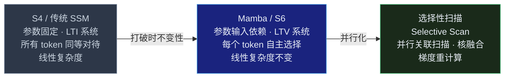
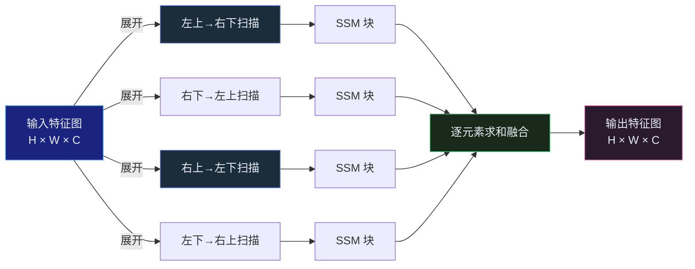

## 引言

Transformer 统治了深度学习近十年。但它的阿喀琉斯之踵从未消失：**自注意力的计算复杂度是 $O(L^2)$**，L 是序列长度。这意味着当你需要处理超长基因组序列、高分辨率医学图像、或长时间手术视频时，Transformer 的内存和算力开销会迅速失控。

过去几年，一条全新的技术路线悄然崛起——**状态空间模型（State Space Model, SSM）**。它用线性复杂度 $O(L)$ 替代平方复杂度 $O(L^2)$，同时在长程建模能力上逼近甚至超越 Transformer 的表现。而这条路线的最新里程碑，就是 **Mamba**<cite>[1]</cite>。

Mamba 的核心洞见可以用一句话概括：**让状态空间模型的参数依赖于输入，并用硬件感知的并行算法来克服计算瓶颈**。这篇文章从 SSM 的数学基础出发，逐层深入到 Mamba 的选择性机制、Vision Mamba 家族，以及医学图像分割中的实战应用。

---

## 状态空间模型基础

### 连续时间状态空间模型

状态空间模型（SSM）源于控制理论，用一个线性微分方程描述系统如何随输入信号演化<cite>[2]</cite>：

$$
\begin{aligned}
h'(t) &= A \cdot h(t) + B \cdot x(t) \quad &\text{—— 状态方程} \\
y(t)  &= C \cdot h(t) + D \cdot x(t) \quad &\text{—— 输出方程}
\end{aligned}
$$

其中：
- $x(t) \in \mathbb{R}$：输入信号（对深度学习而言是 token 嵌入的一个维度）
- $h(t) \in \mathbb{R}^N$：N 维隐状态（模型的「记忆」）
- $A \in \mathbb{R}^{N \times N}$：状态转移矩阵，控制状态如何自身演化
- $B \in \mathbb{R}^{N \times 1}$：输入投影向量，控制输入如何影响状态
- $C \in \mathbb{R}^{1 \times N}$：输出投影向量，控制状态如何映射为输出
- $D \in \mathbb{R}$：跳跃连接（skip connection），通常省略或学习

### 从连续到离散：零阶保持（ZOH）

要在离散的 token 序列上使用 SSM，需要将连续时间方程离散化。Mamba 使用**零阶保持（Zero-Order Hold, ZOH）**方法<cite>[1]</cite>：

$$
\begin{aligned}
\bar{A} &= \exp(\Delta \cdot A) \\
\bar{B} &= (\Delta \cdot A)^{-1} \cdot (\exp(\Delta \cdot A) - I) \cdot \Delta \cdot B
\end{aligned}
$$

离散化后的递归形式：

$$
\begin{aligned}
h_k &= \bar{A} \cdot h_{k-1} + \bar{B} \cdot x_k \\
y_k &= C \cdot h_k
\end{aligned}
$$

**Δ（步长）是关键参数**——它控制模型在当前 token 上停留多久，大 Δ 意味着"关注当前输入并快速遗忘过去"，小 Δ 意味着"保留历史信息"<cite>[3]</cite>。

### 为什么 SSM 这么高效？

SSM 在训练时可以用**卷积模式**：将递归展开为固定长度的卷积核，并行处理整个序列。推理时用**递归模式**：$O(1)$ 的恒定内存，每步只做一次矩阵向量乘法。

这种双重身份——训练时像 CNN 一样并行，推理时像 RNN 一样高效——是 SSM 家族最吸引人的特性。

---

## S4：结构化状态空间

**S4（Structured State Space Sequence Model）** 是第一个成功的深度 SSM 模型，由 Gu 等人于 2021 年提出<cite>[2]</cite>。

### 核心创新：HiPPO 初始化

S4 的关键突破是使用 **HiPPO 理论（High-order Polynomial Projection Operators）** 来初始化矩阵 A。HiPPO 矩阵的数学性质确保：**在给定固定大小的状态空间内，它能最优地压缩历史信息**<cite>[2]</cite>。

简单理解：HiPPO 矩阵让隐状态 h(t) 的每个维度对应 Legendre 多项式的系数，这些系数构成对过去输入信号的"最优多项式近似"。维度越高，能捕捉的细节越精细。

### DPLR 分解：计算效率的革命

原始 HiPPO 矩阵是稠密的——每次递归更新需要 $O(N^2)$ 操作。S4 发现 HiPPO 矩阵可以分解为 **DPLR（对角加低秩，Diagonal Plus Low-Rank）** 形式<cite>[2]</cite>：

$$
A = \Lambda - P \cdot Q^T
$$

其中 Λ 是对角矩阵，P、Q 是低秩矩阵。通过这一分解，卷积核可以用 Cauchy 核和 Woodbury 恒等式高效计算，**比原始实现快 30 倍，内存减少 400 倍**。

### S4 的根本局限：线性时不变

S4 的参数 A、B、C、Δ 在训练后固定不变——每个 token 被完全相同的方式处理。这称为**线性时不变性（Linear Time-Invariance, LTI）**。

问题在于：很多序列任务需要**内容感知的选择性**<cite>[1]</cite>。考虑这个例子——"The capital of France is ___"，正确答案"Paris"只需要关注最近的几个词；但"Recall the third word you read at the beginning of this paragraph"需要模型精确地从遥远的上下文中**选择性复制**特定信息。

Transformer 的注意力机制天然支持这种选择性。S4 却做不到——它的参数对所有输入一视同仁。在**选择性复制**和**归纳头**等关键能力上，S4 的表现远不如 Transformer<cite>[1]</cite>。

---

## Mamba：选择性状态空间模型 S6

Mamba 的核心思想是打破 S4 的线性时不变性<cite>[1]</cite>：



### 选择性机制

Mamba 让 B、C 矩阵和离散化步长 Δ **变为输入的函数**<cite>[1]</cite>：

| 参数 | S4 | Mamba | 直觉解释 |
|---|---|---|---|
| **A**（状态转移） | 固定（HiPPO） | 固定（S4D-Real 对角初始化） | 保持结构稳定性 |
| **B**（输入→状态） | 固定 | **输入依赖**：s_B(x) = Linear_N(x) | 像门控：选择性过滤无关信息 |
| **C**（状态→输出） | 固定 | **输入依赖**：s_C(x) = Linear_N(x) | 选择性决定从记忆中读什么 |
| **Δ**（步长） | 固定 | **输入依赖**：Δ = softplus(Linear(x) + bias) | 控制记忆/遗忘的平衡 |

Δ 的选择性是整个机制的核心——当模型遇到重要信息时，Δ 变大，模型"专注"当前输入并抑制历史状态的影响；遇到无关信息时，Δ 变小，模型"快速略过"<cite>[3]</cite>。

### Mamba 模块结构

```
输入 x (B, L, D)
    │
    ├── RMS Norm
    ├── Linear: D → 2×E  (E = expand × D, expand 默认为 2)
    │
    ├── Branch 1: Conv1d → SiLU → Selective SSM ─┐
    ├── Branch 2: SiLU ──────────────────────────→ × → Linear: E → D
    │                                                  │
    └── 残差连接 ←─────────────────────────────────────┘
```

**通道独立性：** Mamba 的 D 个通道各自拥有独立的 SSM 参数——A 矩阵是 D×N 的对角形式，B、C 也是每个通道独立计算。这种设计避免了 SSM 内部跨通道交互的开销，将复杂性推给了前后的线性投影层<cite>[1]</cite>。

### 硬件感知算法：选择性扫描

选择性机制打破了卷积表示——每个 token 有不同的参数，卷积核不再固定。这意味着必须回到递归计算。但纯递归在 GPU 上极慢（串行依赖）。

Mamba 的解决方案是**选择性扫描（Selective Scan）**，通过三个工程优化将看似必须串行的计算并行化<cite>[1]</cite>：

**并行关联扫描（Parallel Associative Scan）**

关联扫描是一种经典的并行算法：给定一个序列和一个二元结合操作符（如加法），可以在 $O(\log L)$ 步内计算出所有前缀和。Mamba 将 SSM 的递推步骤 `h_k = A_k · h_{k-1} + B_k · x_k` 定义为关联操作，从而并行化整个序列的处理<cite>[1]</cite>。

**核融合（Kernel Fusion）**

将离散化、选择性扫描、C 投影融合为一个 GPU 核函数。中间状态在 SRAM（片上高速缓存）中完成，避免写入 HBM（显存）——SRAM 的带宽是 HBM 的 10 倍以上。

**梯度重计算（Gradient Recomputation）**

反向传播时，不保存前向的中间状态（大小为 $B \times L \times D \times N$），而是在反向时按需重新计算。因为融合核函数足够快，重计算的成本远低于从 HBM 读取的成本。

**效率基准：** 选择性扫描比标准实现快 40 倍，Mamba 在长序列上的吞吐量是同等规模 Transformer 的 5 倍<cite>[1]</cite>。

---

## Mamba-2 与架构改进

Mamba-2（2024）是对原版的多项增强<cite>[4]</cite>：

**结构化状态空间对偶性。** Mamba-2 从理论上揭示：选择性 SSM 的矩阵变换与线性注意力（Linear Attention）之间存在**结构化对偶性**。这为 Mamba 的表达能力提供了与注意力机制等价的理论基础。

**更稳定的训练。** 通过改进的状态更新结构和更好的初始化策略，Mamba-2 在大规模训练中更加稳定，减少了对学习率调度的敏感度。

**更强的长序列性能。** 优化了状态维度 N 与序列长度 L 之间的比例关系，在百万级 token 的序列上仍保持精确的记忆能力。

**更容易扩展。** 状态更新的结构化设计使得模型更容易适配张量并行和数据并行，支持百亿参数级别的扩展。

**理论泛化分析。** 2025 年的研究从覆盖数角度建立了 Mamba 与自注意力的泛化界限，为理解 Mamba 的理论能力提供了新视角<cite>[4]</cite>。

---

## Vision Mamba 家族

将 1D 选择性 SSM 应用到 2D/3D 图像面临核心挑战：**如何定义"序列顺序"？**

自然语言有天然的从左到右顺序，但图像没有。不同扫描策略直接决定了感受野的形状和空间信息的保留程度。

### 主要架构对比

| 模型 | 扫描策略 | 架构风格 | 关键创新 |
|---|---|---|---|
| **Vim**（2024） | 正反向 1D 扫描 | ViT 风格（无层次） | 双向 SSM 建模全局上下文<cite>[5]</cite> [GitHub](https://github.com/hustvl/Vim) |
| **VMamba**（2024） | **四方向 SS2D**（上下左右） | Swin 风格（层次化） | 2D 选择性扫描，跨扫描特征融合<cite>[6]</cite> [GitHub](https://github.com/MzeroMiko/VMamba) |
| **LocalMamba**（2024） | 窗口内 + 窗口间扫描 | 层次化 | 多尺度窗口扫描保留局部性<cite>[7]</cite> [GitHub](https://github.com/hunto/LocalMamba) |
| **EfficientVMamba**（2024） | 空洞扫描 + SE | 层次化 | 空洞扫描扩大感受野，降低计算量<cite>[9]</cite> [GitHub](https://github.com/terrypeiyumeng/EfficientVMamba) |

### VMamba 的核心：2D 选择性扫描（SS2D）

VMamba 的 SS2D 是最有代表性的视觉 SSM 设计<cite>[6]</cite>：



四个方向的扫描确保了每个像素都能从所有方向接收到上下文信息，跨扫描融合有效地近似了 2D 感受野。这种方法在 ImageNet 分类上达到了与 Swin Transformer 相当的精度，但推理时的 FLOPs 随分辨率线性增长（而非平方增长）<cite>[6]</cite>。

---

## 医学图像中的 Mamba 应用

Mamba 的线性复杂度使其在医学图像领域格外有吸引力——CT 和病理图像动辄数千像素，传统 Transformer 难以直接处理<cite>[8]</cite>。

### U-Mamba 与 Mamba-UNet 系列

将 Mamba 集成进 U-Net 架构成为 2024 年医学图像分割的重要方向<cite>[8]</cite>：

| 模型 | 核心设计 | 目标应用 |
|---|---|---|
| **U-Mamba**<cite>[10]</cite> | U-Net 编码器中的卷积块替换为 Mamba 块 | 3D 腹部器官分割 | [GitHub](https://github.com/bowang-lab/U-Mamba) |
| **Mamba-UNet** | 纯 Mamba 编码器 + CNN 解码器 | 2D 多器官分割 | — |
| **VM-UNet** | VMamba SS2D 作为编码器 | 2D 皮肤病变、细胞分割 | — |
| **Swin-UMamba**<cite>[11]</cite> | Swin 风格的层次化 Mamba 编码器 | 3D 体积分割，>90 FPS 实时推理 | [GitHub](https://github.com/JiarunLiu/Swin-UMamba) |

### 血管分割中的 Mamba

在视网膜血管分割中，Multi-scale Vision Mamba-UNet（2025）将多尺度特征提取与 Mamba 的长程依赖结合，在 DRIVE 和 CHASE_DB1 数据集上取得了有竞争力的结果<cite>[8]</cite>。

Mamba 在血管分割中的自然优势：血管是典型的**细长曲线结构**——宽度只有几个像素，但长度可能跨越整个图像。CNN 的局部感受野容易丢失长血管的连续性，而 Transformer 的高计算成本限制了高分辨率输入。Mamba 的线性复杂度 + 全局感受野恰好填补了这个空白。

### 未来趋势

**混合架构。** 纯 Mamba 在局部细节建模上不如卷积，纯 CNN 在全局上下文中不如 Mamba。Mamba-CNN-Transformer 混合架构（如 MambaVision、HybridMH）正在成为 2025 年的主流范式<cite>[4]</cite>。

**3D 体积分割。** Swin-UMamba 在 3D 医学图像分割中实现了 >90 FPS 的实时推理——这对于手术导航等实时场景至关重要。相比 3D Transformer，Mamba 在保持全局感受野的同时将内存占用降低了数倍<cite>[8]</cite>。

**掩码自回归预训练。** 利用 Mamba 的高效性进行大规模预训练（MAP），在多个医学图像基准上刷新了少样本学习的 SOTA<cite>[4]</cite>。

---

## 实战：用 Mamba 构建序列模型

以下代码展示 Mamba 模块的核心实现逻辑（基于 PyTorch 的简化版本，聚焦选择性 SSM 的核心计算）：

```python
import torch
import torch.nn as nn
import torch.nn.functional as F

class MambaBlock(nn.Module):
    """简化版 Mamba 模块：包含选择性 SSM 的核心逻辑"""

    def __init__(self, d_model, d_state=16, expand=2, d_conv=4):
        super().__init__()
        self.d_model = d_model
        self.d_inner = int(expand * d_model)
        self.d_state = d_state

        # 输入投影
        self.in_proj = nn.Linear(d_model, self.d_inner * 2)
        # 输出投影
        self.out_proj = nn.Linear(self.d_inner, d_model)
        # 1D 卷积（局部上下文建模）
        self.conv1d = nn.Conv1d(
            in_channels=self.d_inner,
            out_channels=self.d_inner,
            kernel_size=d_conv,
            groups=self.d_inner,  # 深度可分离卷积
            padding=d_conv - 1
        )
        # 选择性参数投影
        self.x_proj = nn.Linear(self.d_inner, d_state * 2 + 1)  # B, C, Δ
        # 可学习的 A 矩阵（对数空间保证正定性）
        self.A_log = nn.Parameter(torch.log(
            torch.arange(1, d_state + 1, dtype=torch.float32).unsqueeze(0)
        ))
        # 可学习的 Δ 偏置
        self.dt_proj = nn.Linear(d_state, 1)

    def selective_scan(self, u, delta, A, B, C):
        """
        选择性扫描核心：并行关联扫描简化版
        u: (B, L, D)  输入
        delta: (B, L, D)  步长
        A: (D, N)  状态转移矩阵
        B: (B, L, N)  输入投影
        C: (B, L, N)  输出投影
        """
        B, L, D = u.shape
        N = A.shape[1]

        # 离散化 A 和 B
        delta = F.softplus(delta)  # 确保 Δ > 0
        A_discrete = torch.exp(delta.unsqueeze(-1) * A)  # (B, L, D, N)
        B_discrete = delta.unsqueeze(-1) * B.unsqueeze(2)  # (B, L, D, N)

        # 递归扫描（简化：循环实现，生产环境使用并行扫描）
        h = torch.zeros(B, D, N, device=u.device, dtype=u.dtype)
        outputs = []
        for t in range(L):
            h = A_discrete[:, t] * h + B_discrete[:, t] * u[:, t].unsqueeze(-1)
            y = (h * C[:, t].unsqueeze(1)).sum(dim=-1)  # (B, D)
            outputs.append(y)
        return torch.stack(outputs, dim=1)  # (B, L, D)

    def forward(self, x):
        B, L, D = x.shape

        # 输入投影 + 分支拆分
        x_proj = self.in_proj(x)  # (B, L, 2*d_inner)
        x_ssm, x_gate = x_proj.chunk(2, dim=-1)

        # 1D 卷积（局部上下文）
        x_ssm_conv = self.conv1d(x_ssm.transpose(1, 2))[..., :L]
        x_ssm_conv = x_ssm_conv.transpose(1, 2)  # (B, L, d_inner)
        x_ssm_conv = F.silu(x_ssm_conv)

        # 选择性参数
        params = self.x_proj(x_ssm_conv)  # (B, L, 2N+1)
        B_sel = params[..., :self.d_state]
        C_sel = params[..., self.d_state:2*self.d_state]
        delta = params[..., -1]

        # 选择性扫描
        A = -torch.exp(self.A_log)  # (1, N) → broadcast to (D, N)
        y = self.selective_scan(x_ssm_conv, delta, A, B_sel, C_sel)

        # 门控 + 输出投影
        y = y * F.silu(x_gate)
        return self.out_proj(y)


# 简单测试
if __name__ == '__main__':
    block = MambaBlock(d_model=256)
    x = torch.randn(2, 128, 256)  # (batch=2, seq_len=128, d_model=256)
    y = block(x)
    print(f'Input:  {x.shape}')
    print(f'Output: {y.shape}')
    print(f'Params: {sum(p.numel() for p in block.parameters()):,}')
```

这段代码展示了 Mamba 选择性 SSM 的核心流程——输入投影、卷积预处理、选择性参数生成、离散化、递归扫描和门控融合。生产实现中会用并行关联扫描库（如 selective-scan-cuda）替代上述 for 循环，获得 40 倍的加速<cite>[1]</cite>。

---

## 总结

Mamba 的演进路线清晰地勾勒了后 Transformer 时代的一个重要方向：

1. **S4** 证明了深度 SSM 可以建模长程依赖，计算效率远超 Transformer——但缺乏内容感知的选择性<cite>[2]</cite>
2. **Mamba（S6）** 通过让参数依赖于输入，赋予了 SSM 类似注意力机制的选择能力，同时通过选择性扫描算法保持了线性复杂度<cite>[1]</cite>
3. **Vision Mamba** 系列将 1D 选择性 SSM 扩展到 2D/3D 视觉任务，通过多方向扫描和层次化架构逼近甚至超越 ViT/Swin<cite>[5]</cite><cite>[6]</cite>
4. **医学图像**是 Mamba 的理想应用场景——高分辨率、长序列、实时性要求，恰好对应 Mamba 线性复杂度的核心优势<cite>[8]</cite>

Mamba 不是 Transformer 的替代品——至少在短期内不是。更准确的描述是：**Mamba 是 Transformer 在长序列场景下的重要补充**。在需要关注全局上下文但输入序列极长的任务中（基因组学、长视频理解、高分辨率医学图像、长时间序列预测），Mamba 提供了 Transformer 难以企及的效率边界。

对于研究者和工程师来说，理解 Mamba 的原理不仅是"了解一个新架构"，更是**理解一种不同于注意力的序列建模范式**——状态空间模型正在将深度学习的长程建模能力推向新的效率前沿。

---

## 参考文献

1. *Mamba: Linear-Time Sequence Modeling with Selective State Spaces.* Gu A, Dao T. arXiv:2312.00752, 2023.  
   <https://arxiv.org/abs/2312.00752> · 代码仓库：<https://github.com/state-spaces/mamba>
2. *Efficiently Modeling Long Sequences with Structured State Spaces.* Gu A, Goel K, Ré C. ICLR 2022.  
   <https://arxiv.org/abs/2111.00396> · 代码仓库：<https://github.com/HazyResearch/state-spaces>
3. *How Mamba Works: A Theoretic and Intuitive Walkthrough.* Dao T, Gu A. Stanford MLSys Blog, 2024.  
   <https://tridao.me/blog/2024/mamba/>
4. *Mamba-2: Transformers are SSMs.* Dao T, Gu A. arXiv:2405.21060, 2024.  
   <https://arxiv.org/abs/2405.21060> · 代码仓库：<https://github.com/state-spaces/mamba>
5. *Vision Mamba: Efficient Visual Representation Learning with Bidirectional State Space Model.* Zhu L, et al. ICML 2024.  
   <https://arxiv.org/abs/2401.09417> · 代码仓库：<https://github.com/hustvl/Vim>
6. *VMamba: Visual State Space Model.* Liu Y, et al. NeurIPS 2024.  
   <https://arxiv.org/abs/2401.10166> · 代码仓库：<https://github.com/MzeroMiko/VMamba>
7. *LocalMamba: Visual State Space Model with Windowed Selective Scan.* Huang T, et al. ECCV 2024.  
   <https://arxiv.org/abs/2403.09338> · 代码仓库：<https://github.com/hunto/LocalMamba>
8. *A Comprehensive Survey of Mamba Architectures for Medical Image Analysis.* arXiv:2410.02362, 2024.  
   <https://arxiv.org/abs/2410.02362>
9. *EfficientVMamba: Atrous Selective Scan for Light Weight Visual Mamba.* Pei Y, et al. 2024.  
   <https://arxiv.org/abs/2403.09977> · 代码仓库：<https://github.com/terrypeiyumeng/EfficientVMamba>
10. *U-Mamba: Enhancing Long-range Dependency for Biomedical Image Segmentation.* Ma J, et al. 2024.  
    <https://arxiv.org/abs/2401.04722> · 代码仓库：<https://github.com/bowang-lab/U-Mamba>
11. *Swin-UMamba: Mamba-based UNet with ImageNet-based Pretraining.* Liu J, et al. MICCAI Workshop 2024.  
    <https://arxiv.org/abs/2402.03302> · 代码仓库：<https://github.com/JiarunLiu/Swin-UMamba>
{: .references }
