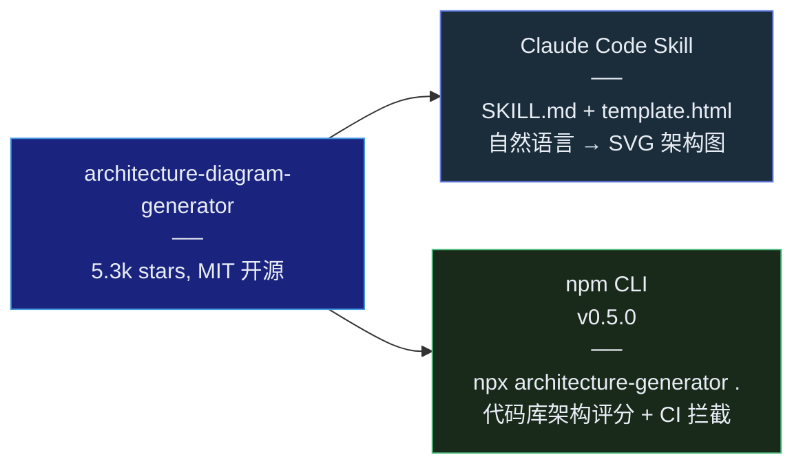

## 引言

画架构图是软件工程师最频繁但也最痛苦的工作之一。你打开 draw.io，拖拽十几个矩形，手动对齐连线，调整颜色，改了三版后老板说「能不能用暗色主题？」

**Architecture-Diagram-Generator**（以下简称 ADG）是 Cocoon-AI 开源的一个 Claude Code Skill，用一句话描述你的系统架构，它输出一张专业的暗色主题 SVG 架构图——没有拖拽、没有画布、没有手动对齐<cite>[1]</cite>。

但这不是一篇「又一个 AI 工具测评」。这篇文章从**系统设计的视角**拆解 ADG 的工程实现：它如何用 2 个文件替代传统图表工具，SKILL.md 中编码了怎样的设计系统，SVG 生成引擎如何保证视觉效果始终专业，以及 npm CLI 如何将同一套分析逻辑延伸到代码库架构审计。

---

## 项目概览：一个仓库，两套产品

ADG 的仓库结构揭示了一个有趣的工程决策<cite>[1]</cite>：



同一个仓库同时发布了 **Claude Code Skill** 和 **npm 命令行工具**。两者共享核心理念——「架构的可视化与量化」——但面向完全不同的使用场景：

| 维度 | Claude Code Skill | npm CLI |
|---|---|---|
| **输入** | 自然语言描述 | 代码库目录 |
| **输出** | 单文件 HTML/SVG 架构图 | 架构健康评分 (0-100) + 问题列表 |
| **触发方式** | Claude Code 对话 | `npx architecture-generator .` |
| **目标用户** | 任何需要画架构图的人 | 需要 CI 拦截架构腐化的团队 |
| **核心资产** | SKILL.md 设计系统 | AST 分析 + 依赖图算法 |

---

## 第一层：SKILL.md — 一份嵌入设计系统的操作手册

ADG 的 Skill 由仅两个文件组成<cite>[2]</cite>：

| 文件 | 角色 | 规模 |
|---|---|---|
| `SKILL.md` | 完整的设计系统规范 + SVG 生成规则 + 输出格式定义 | ~3000 tokens |
| `assets/template.html` | HTML 骨架：预置 CSS、SVG 画布、网格 pattern、按钮脚本 | ~200 行 |

没有 Python 后端。没有 API 调用。没有 MCP server。**Prompt 就是引擎**。

### 语义色彩系统

SKILL.md 中硬编码了一套基于组件「语义角色」的色彩映射<cite>[2]</cite>：

| 组件类型 | 语义 | 填充色 (rgba) | 边框色 |
|---|---|---|---|
| Frontend | 用户界面 | `rgba(8,51,68,0.4)` | `#22d3ee` (cyan-400) |
| Backend | 业务逻辑 | `rgba(6,78,59,0.4)` | `#34d399` (emerald-400) |
| Database | 数据持久化 | `rgba(76,29,149,0.4)` | `#a78bfa` (violet-400) |
| AWS/Cloud | 云基础设施 | `rgba(120,53,15,0.3)` | `#fbbf24` (amber-400) |
| Security | 认证授权 | `rgba(136,19,55,0.4)` | `#fb7185` (rose-400) |
| Message Bus | 异步通信 | `rgba(251,146,60,0.3)` | `#fb923c` (orange-400) |
| External | 第三方服务 | `rgba(30,41,59,0.5)` | `#94a3b8` (slate-400) |

**这种设计的工程价值：它把「审美判断」变成了「规则匹配」。** Claude 不需要判断「用什么颜色好看」，只需要识别组件的语义角色，然后查表映射色彩。这是 Agent Skill 设计中反复出现的模式——**用显式映射表替代模型的审美自由度**。

### SVG 生成的核心技术规则

SKILL.md 中还编码了大量 SVG 内联生成的「硬规则」<cite>[2]</cite>：

**双重矩形遮罩（Double-rect Masking）：** 每个组件由两个 SVG `<rect>` 组成——底层是不透明的 `#0f172a` 矩形（遮挡穿透的箭头线），上层是半透明的色彩矩形（提供视觉样式）。这个技巧解决了 SVG 中最常见的 bug：箭头线穿过半透明组件时依然可见。

**Z 轴排序：** 箭头线 → 安全组虚线框 → 区域边界虚线 → 组件矩形 → 标签文本。箭头先画，组件后画——确保所有连线都被组件遮挡，视觉上自然。

**网格背景：** 40×40px 的 SVG `<pattern>`，浅色网格线 (`#1e293b`，0.5px) 铺在 `#020617` (slate-950) 深色背景上。不是装饰——网格让对齐关系一眼可见，是架构图可读性的基础设施。

**标注层的排版系统：** 12px JetBrains Mono 组件名、9px 灰色子标签、8px 技术标注、7px 微型标签。层次清晰的排版本身就是一种「不需要思考的设计」。

### 输出结构规范

ADG 的输出不是一张孤立的图，而是完整的 HTML 页面<cite>[2]</cite>：

```
1. Header — 标题 + 在线状态脉动指示点
2. Main SVG — 圆角卡片中的架构图
3. Summary Cards — 3 张信息卡片（组件统计 / 数据流 / 设计要点）
4. Footer — 最小化元数据
```

内置三个按钮：Copy SVG、Export PNG、Export PDF——让架构图从「看的」变成「用的」。

---

## 第二层：npm CLI — 把架构分析变成可量化的工程

ADG 的 npm 包提供了完整的代码库架构分析管线<cite>[3]</cite>：

```bash
# 分析当前目录的架构
npx architecture-generator .

# 对比两次分析的差异
npx architecture-generator diff .

# CI 拦截：评分低于 80 或存在 high 级别问题 → 阻断
npx architecture-generator check . -t 80 --fail-on high
```

### 评分模型

| 维度 | 检测内容 | 影响 |
|---|---|---|
| 循环依赖 | A→B→C→A | 直接扣分，标记为 Critical |
| 层违规 | Controller 直接访问 DAO | 标记为 High，建议引入 Service 层 |
| 高耦合 | 模块 fan-in/fan-out > 阈值 | 标记为 Medium，建议接口抽象 |
| God Module | 单一文件 > 1000 行或 > 20 个依赖 | 标记为 Medium |
| 外部服务 | 对第三方 SDK 的依赖程度 | 信息级提示 |

### CI 集成的工程意义

`architecture-generator check` 命令把架构质量从「代码 review 时靠人工判断」变成了「CI 流水线的自动化检查」。这与 ESLint 检查代码风格、TypeScript 检查类型安全的逻辑一脉相承——**架构也是一种可以被静态分析的质量维度**<cite>[3]</cite>。

```json
// architecture-analyzer.json
{
  "preset": "balanced",
  "rules": {
    "maxModuleSize": 1000,
    "maxDependencies": 20,
    "maxFanOut": 15,
    "forbiddenImports": ["src/controllers/** -> src/database/**"]
  }
}
```

---

## 第三层：为什么这个设计值得学习？

### 对比传统方案

| 方案 | 学习成本 | 输出质量 | 可编程性 | 版本可控 |
|---|---|---|---|---|
| draw.io / Visio | 低 | 中（依赖操作者审美） | 无 | 二进制文件，diff 困难 |
| Mermaid / PlantUML | 中（记语法） | 中（主题有限） | 文本 DSL | 文本文件，git diff 友好 |
| **ADG Skill** | **极低（自然语言）** | **高（硬编码设计系统）** | **是（HTML/SVG 完全可编辑）** | **单文件 HTML，文本 diff** |

ADG 在「学习成本」和「输出质量」之间找到了一个独特的平衡点：**用 AI 的理解能力消除语法学习成本，用固化设计系统消除审美不确定性**。

### ADG 不能做什么

明确边界同样重要<cite>[1]</cite>：

- 不适合时序图、精确网络拓扑图、科学图表
- 50+ 组件的超复杂系统可能需要手动调整
- 暗色主题是固定的（浅色需要修改 CSS）
- 输出质量取决于描述的质量——模糊的描述产生模糊的图

---

## 第四层：从 ADG 看 Agent Skill 的设计模式

ADG 是 Agent Skill「Generator 模式」的教科书级案例<cite>[2]</cite>。它与前一篇讨论的 nature-skills 形成了互补：

| 维度 | nature-skills | ADG |
|---|---|---|
| **领域** | 学术论文写作 | 系统架构可视化 |
| **核心资产** | 25 条 Nature 写作规则 | 7 色语义映射 + 排版/间距规则 |
| **输出** | Markdown / .pptx / .svg | 单文件 HTML/SVG |
| **模板策略** | 规则堆叠 + 工作流编号 | 规则映射 + HTML 骨架填充 |
| **扩展方式** | references/ 模块化子文件 | 单 SKILL.md 集中管理 |

两者的共同基因：

- **SKILL.md 即产品**：不需要后端、不需要 API、不需要数据库
- **规则显式化**：所有「设计判断」都被转化为可执行的映射表
- **模板驱动输出**：提供骨架，AI 负责填充内容而非决定结构
- **输出可直接使用**：不需要二次加工，不需要额外工具打开

---

## 总结

Architecture-Diagram-Generator 不是一个复杂的项目——它只有两个核心文件，没有后端服务，没有外部 API 调用。但正是这种极简让它成为 Agent Skill 设计的典范：

1. **SKILL.md 是操作手册，不是散文**——色彩映射表、间距公式、Z 轴排序规则，每一项都是可执行的指令
2. **用系统化约束替代审美判断**——7 种语义色彩覆盖了 90% 的架构图场景，不需要 AI 做美学决策
3. **输出即产品**——带 Copy/PNG/PDF 按钮的自包含 HTML，从「展示」到「交付」一步到位
4. **Skill + CLI 双轨策略**——同一套分析逻辑，AI 对话和自动化流水线两套入口

当越来越多的 Agent Skill 出现，工程界会逐渐意识到：**最好的 Skill 不是最智能的，而是最「不自由」的**——它用精确的约束为模型减负，让 AI 从「拍脑袋」变成「查表执行」。

这也就是 ADG 那句 slogan 背后的工程哲学：**「Prompt 就是引擎，规则就是产品。」**

---

## 参考文献

1. *Architecture Diagram Generator.* Cocoon-AI. GitHub, 2026.  
   <https://github.com/Cocoon-AI/architecture-diagram-generator>
2. *ADG SKILL.md Design System.* Cocoon-AI / aiskillstore.  
   <https://raw.githubusercontent.com/aiskillstore/marketplace/main/skills/cocoon-ai/architecture-diagram/SKILL.md>
3. *architecture-diagram-generator npm package v0.5.0.* Cocoon-AI, 2026.  
   <https://www.npmjs.com/package/architecture-diagram-generator>
4. *Architecture Diagram Generator 实战：用自然语言生成可分享的深色主题架构图.* IT Note, 2026.  
   <https://www.itnotetk.com/2026/04/21/architecture-diagram-generator-claude-skill-svg/>
5. *一句话生成专业架构图，Claude Skill 新玩法.* 163.com, 2026.  
   <https://www.163.com/dy/article/KQVQFAEI0519EA27.html>
{: .references }
