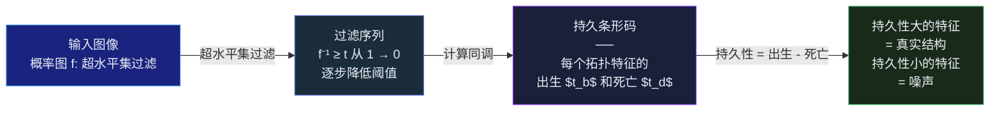

## 引言

分割模型输出一片白色区域，Dice 得分 0.92——看似近乎完美。但你放大一看：一条本该连续的血管在中间断开了，两个本应分离的结构被一条细微的"桥"错误地连接在一起。

这就是**像素级指标的结构性盲区**。Dice 和交叉熵只比较像素是否匹配，不关心这些像素是否构成了正确的拓扑结构。对于血管分割来说，一处断裂可能意味着完全错误的血流模型；对于神经元分割来说，错误的连接会颠覆整个连接组的分析结论<cite>[1]</cite>。

**拓扑结构学习（Topology-Aware Learning）** 正是为解决这一问题而生的研究方向。它试图在深度学习的损失函数中显式编码"结构正确性"的约束——不仅要求预测像素和标注一致，还要求预测的连通性、分支结构、孔洞数量与真实解剖结构一致。

这篇文章从拓扑学的数学基础出发，系统梳理持久同调、clDice、Betti Matching 等关键方法，最终落脚到血管分割的实战应用。

---

## 为什么像素级指标不够？

### Dice 的拓扑盲区

考虑一个简单的 1D 场景——预测两条平行线段<cite>[1]</cite>：

```
Ground Truth:  ████████████          ████████████
Prediction A:  ████████████          ████████████    → Dice = 1.00 ✓
Prediction B:  ████████████████████████████████████  → Dice = 0.80 ✗
Prediction C:  ████████████  ██████████████████████  → Dice = 0.85 ✗
```

Prediction B 错误地连接了两条线段（拓扑错误：$\beta_0$ 从 2 变成了 1），Dice 只惩罚了"多出来的像素"。Prediction C 在一条线段中产生了断裂（拓扑错误：$\beta_0$ 从 2 变成了 3），Dice 完全无法感知这处断裂对血流模拟的灾难性影响。

**血管分割的核心矛盾：** 血管仅占图像 5-15% 的像素（严重类别不平衡），但每一处断裂或错误连接都会导致完全错误的拓扑结构。Dice 损失天然倾向于把一切预测为背景——这种"保守"策略在拓扑上恰恰是最危险的<cite>[2]</cite>。

### 为什么传统分割损失不够？

| 损失函数 | 优化的对象 | 能感知拓扑吗？ |
|---|---|---|
| Cross-Entropy | 逐像素分类正确性 | 否——每个像素独立判断 |
| Dice Loss | 预测与标注的重叠面积 | 否——只关注"交并比"，不关心连通性 |
| Focal Loss | 对困难样本的加权交叉熵 | 否——仍是像素级 |
| Boundary Loss | 基于距离图的边界对齐 | 部分——间接约束形状，但不保证拓扑正确 |

这些损失函数共同的特点是：**所有像素都是平等的，没有"结构重要性"的概念**。在拓扑结构中，分叉点上的一个像素比普通血管段上的十个像素更关键——但交叉熵对它们一视同仁。

---

## 拓扑学基础：持久同调入门

### Betti 数：连通性的数字指纹

**Betti 数**是描述拓扑空间"形状特征"的基本不变量<cite>[3]</cite>：

| 维度 | Betti 数 | 描述 | 2D 图像中的含义 | 3D 体积中的含义 |
|---|---|---|---|---|
| 0 维 | $\beta_0$ | 连通分量的数量 | 独立血管段的数量 | 独立血管树的数量 |
| 1 维 | $\beta_1$ | 孔洞/环的数量 | 闭合环路（如血管环） | 管状通道（如血管腔内的环） |
| 2 维 | $\beta_2$ | 空洞/腔的数量 | 不适用于 2D | 封闭空腔（如心室） |

**血管分割的拓扑正确性条件：** $\beta_0$ 匹配（分支数量一致）、$\beta_1$ 匹配（环路一致，如果有的话）、无虚假断裂、无虚假连接<cite>[2]</cite>。

### 持久同调的核心思想

真实数据有噪声。持久同调（Persistent Homology）通过在多个尺度上"增长"拓扑结构来区分真实特征和噪声<cite>[3]</cite>：



**超水平集过滤**：从最高概率开始逐步降低阈值。t=1.0 时只有最高置信度的像素被包含（出生阶段）；t=0.0 时所有像素都被包含（死亡阶段）。每个拓扑特征（连通分量、孔洞）会在某个阈值"出生"（出现），在另一个阈值"死亡"（消失或合并）<cite>[3]</cite>。

**持久条形码（Persistence Barcode）**：每条横线代表一个拓扑特征，线的长度等于持久性（Persistence）：

$$
\text{persistence} = |t_{birth} - t_{death}|
$$

长条对应稳固的真实结构，短条对应噪声波动。

### 为什么持久同调适合做损失函数？

持久条形码是可微的——特征出生/死亡时间相对于输入图像概率值的梯度可以通过 **TopologyLayer** 等库计算<cite>[3]</cite>。这使我们可以写一个损失函数来：

- **拉长**正确拓扑特征的条形码（加强真实结构）
- **缩短**错误拓扑特征的条形码（消除虚假结构）

---

## 拓扑感知损失函数

### 第一代：持久同调匹配

Hu 等人（2019）首次将持久同调用作分割损失函数<cite>[4]</cite>。核心思路：计算预测图和标注图的持久条形码，最小化两者之间的 **Wasserstein 距离**。

这一方法在理论上优雅，但有一个致命缺陷：**条形码中的匹配特征在空间上可能不相关**。两个在条形码中距离很近的特征，在原图中可能位于完全不同的位置。这意味着损失函数可能在"奖励"错误的空间对应关系，导致训练不稳定<cite>[4]</cite>。

### clDice：基于中心线的拓扑保持

**clDice（centerline Dice）** 由 Shit 等人于 2021 年提出，专门针对管状结构（血管、神经元、道路）设计<cite>[5]</cite>。

**核心定义：**

$$
\operatorname{clDice} = \frac{2 \times |V_{pred} \cap S_{gt}|}{|V_{pred}| + |S_{gt}|}
$$

其中：
- $V_{pred}$：预测分割的前景体素集合
- $S_{gt}$：标注的中心线（骨架）体素集合

clDice 直观地编码了一个约束：**预测的前景必须"覆盖"标注的中心线**。如果预测中断了，中心线上相应位置就缺少前景覆盖，clDice 会显著下降<cite>[5]</cite>。

**软 clDice（soft-clDice）：** 使用可微的软骨架化（soft-skeletonize）操作，使 clDice 可以作为端到端训练的损失函数。骨架提取基于 min-pooling 和 max-pooling 的迭代形态学运算。

**理论保证：** 对于二值二维和三维分割，clDice 保证预测与标注在**同伦等价**（homotopy equivalence）意义上具有相同的拓扑结构<cite>[5]</cite>。

```mermaid
graph LR
    A[预测分割<br/>概率图] --> B[软骨架化<br/>Soft Skeletonize]
    C[标注分割<br/>二值掩码] --> D[硬骨架化<br/>Hard Skeletonize]
    B --> E[软 clDice<br/>$2 \times V_{pred} \cap S_{gt}$<br/>除以 $(V_{pred} + S_{gt})$]
    D --> E
    E --> F[与 Dice Loss 组合<br/>$\alpha \cdot clDice + \beta \cdot Dice$]
    style A fill:#1a237e,stroke:#4299e1,color:#e8edf5
    style C fill:#1a237e,stroke:#4299e1,color:#e8edf5
    style E fill:#1b2d3a,stroke:#667eea,color:#e8edf5
    style F fill:#1a2a1a,stroke:#48bb78,color:#e8edf5
```

### 第二代：Betti Matching（2024 SOTA）

Berger 等人在 MICCAI 2024 上提出了 **Betti Matching 损失**，建立了当前拓扑感知分割的最优方法<cite>[6]</cite>。

**与 HuTopo 的关键区别：**

Betti Matching 不直接在条码空间匹配，而是定义了一种**诱导匹配**——只有在原图空间中空间位置对应的拓扑特征，才会在损失中被配对。这解决了 HuTopo "空间不匹配"的根本问题<cite>[6]</cite>。

**多类别分解：** 对于 N 类分割，Betti Matching 将其分解为 N 个单类别（one-vs-rest）二值问题，在每个类别上独立计算持久同调和 Betti 匹配，避免了计算上不可行的多参数持久同调<cite>[6]</cite>。

**损失函数的两个分量：**

$$
\mathcal{L}_{BM} = \gamma^m \cdot \mathcal{L}_{BM}^m + \gamma^u \cdot \mathcal{L}_{BM}^u
$$

其中 $\mathcal{L}_{BM}^m$（匹配损失）加强预测中与标注匹配的拓扑特征（让它们更"持久"），$\mathcal{L}_{BM}^u$（不匹配损失）消除预测中存在但标注中没有的拓扑特征。

总损失：$\mathcal{L}_{total} = \alpha \cdot \mathcal{L}_{BM} + \mathcal{L}_{Dice}$

**空间保证：** Betti Matching 保证匹配的拓扑特征在**空间上对应**——这是 HuTopo 和 Persistence Diagram 匹配方法所不具备的关键性质<cite>[6]</cite>。

**3D 加速版：** Stucki 等人（2024）开发了 Betti Matching 3D 的高性能 C++ 实现（PyBind 封装），使 3D 体积数据上的拓扑感知训练首次在实际时间尺度内可行<cite>[7]</cite>。

---

## 血管分割中的拓扑方法

血管分割是拓扑结构学习最重要的应用场景之一。血管的临床意义直接取决于其拓扑连通性——一根断掉的血管无法输送血液，一处错误的吻合会导致完全错误的血流模拟。

### 方法全景

| 方法 | 拓扑约束方式 | 代表工作 | 适用场景 |
|---|---|---|---|
| **中心线监督** | 额外训练一个骨架预测分支 | Cascaded U-Net <cite>[8]</cite> | 脑血管、视网膜血管 |
| **clDice 损失** | 软骨架化 + 中心线重叠 | clDice <cite>[5]</cite> | 通用管状分割 |
| **持久同调损失** | 直接匹配持久条形码 | Betti Matching <cite>[6]</cite> | 通用拓扑保持 |
| **形态学先验** | Masked AE + 闭运算修复断裂 | Deep Closing <cite>[9]</cite> | 血管重建后处理 |
| **层次拓扑约束** | 点→线→面多级拓扑保持 | PASC-Net <cite>[10]</cite> | 多尺度血管网络 |
| **拓扑形状点** | 可微 tspDice 度量 | TSP-Warp-X <cite>[12]</cite> | 弱监督 + 全监督 |

### 拓扑感知血管分割的标准 Pipeline

```mermaid
graph LR
    A[输入图像<br/>CTA / MRA / 眼底照] --> B[分割网络<br/>U-Net / nnUNet<br/>+ 混合编码器]
    B --> C[像素级损失<br/>Dice + CE<br/>保证基本分割质量]
    B --> D[拓扑损失<br/>──<br/>clDice: 中心线覆盖<br/>Betti Matching: 持久同调<br/>Topograph: 图约束]
    C --> E[总损失<br/>$\mathcal{L} = \mathcal{L}_{pixel} + \lambda \cdot \mathcal{L}_{topo}$]
    D --> E
    E -->|反向传播| B
    style A fill:#1a237e,stroke:#4299e1,color:#e8edf5
    style B fill:#1b2d3a,stroke:#667eea,color:#e8edf5
    style C fill:#1a1f3a,stroke:#7c3aed,color:#e8edf5
    style D fill:#2a1a2e,stroke:#ed64a6,color:#e8edf5
    style E fill:#1a2a1a,stroke:#48bb78,color:#e8edf5
```

### 关键经验

**不要单独使用拓扑损失。** 拓扑损失是 Dice/CE 的**补充**而非替代。纯拓扑损失可能导致分割边界模糊——因为拓扑只关心"结构在不在"，不关心"边界精不精确"。实践中的最佳策略是 $\mathcal{L} = \mathcal{L}_{Dice} + \lambda \cdot \mathcal{L}_{Topo}$，其中 $\lambda$ 通常取 0.1~0.5<cite>[6]</cite>。

**预热训练很重要。** 在训练初期使用纯 Dice 损失让网络学习基本的分割能力，若干 epoch 后再引入拓扑损失——直接从头开始联合训练可能导致不稳定收敛<cite>[6]</cite>。

**选择合适的拓扑度量。** clDice 最适合纯粹的管状结构（血管、神经元）；Betti Matching 更适合有复杂拓扑的器官（心室、肝脏血管树）；对于多类别分割，Betti Matching 的多类别扩展提供了更系统的解决方案<cite>[6]</cite><cite>[5]</cite>。

---

## 实战：实现 clDice 损失

以下代码展示软 clDice 损失的核心实现：

```python
import torch
import torch.nn as nn
import torch.nn.functional as F

class SoftClDiceLoss(nn.Module):
    """软 clDice 损失：通过可微骨架化保持拓扑连通性
    参考文献: Shit et al., clDice - A Novel Topology-Preserving Loss
    """

    def __init__(self, iter_skel=5, iter_topk=4, smooth=1.0):
        super().__init__()
        self.iter_skel = iter_skel
        self.iter_topk = iter_topk
        self.smooth = smooth

    def soft_skel(self, x):
        """可微软骨架化：迭代 min-pooling 和 max-pooling"""
        B, C, H, W = x.shape
        for i in range(self.iter_skel):
            # Min-pooling: 腐蚀操作的可微近似
            min_pool = -F.max_pool2d(-x, kernel_size=3, stride=1, padding=1)
            # Max-pooling: 膨胀 + 保留细结构
            max_pool = F.max_pool2d(min_pool, kernel_size=3, stride=1, padding=1)
            # 保持原始值在局部最大值处
            x = torch.where(x == max_pool, x, torch.zeros_like(x))
        return x

    def soft_topk(self, x, k=4):
        """可微 Top-K：保留前 k 个最大值的软版本"""
        B, C, H, W = x.shape
        x_flat = x.view(B, C, -1)
        top_vals, _ = torch.topk(x_flat, k, dim=-1)
        threshold = top_vals[..., -1:]  # 第 k 大的值作为阈值
        return x * (x >= threshold.unsqueeze(-1).expand(-1, -1, H*W)
                   ).view(B, C, H, W).float()

    def forward(self, pred, target):
        """
        pred:  预测概率图 (B, 1, H, W)，值域 [0, 1]
        target: 二值标注 (B, 1, H, W)，值域 {0, 1}
        """
        # 硬骨架化标注（不可微，但不需要梯度）
        target_skel = self.soft_skel(target.float())

        # 软骨架化预测（可微）
        pred_skel = self.soft_skel(pred)

        # clDice 的两个分量
        # Tprec: 预测中心线在标注前景中的比例
        tprec = (pred_skel * target).sum() + self.smooth
        tprec /= pred_skel.sum() + self.smooth

        # Tsens: 标注中心线在预测前景中的比例
        tsens = (target_skel * pred).sum() + self.smooth
        tsens /= target_skel.sum() + self.smooth

        cl_dice = 2.0 * tprec * tsens / (tprec + tsens + 1e-7)
        return 1.0 - cl_dice


class CombinedLoss(nn.Module):
    """组合 Dice + clDice 的混合损失"""

    def __init__(self, dice_weight=1.0, cldice_weight=0.3):
        super().__init__()
        self.dice_weight = dice_weight
        self.cldice_weight = cldice_weight
        self.cldice = SoftClDiceLoss()

    def dice_loss(self, pred, target, smooth=1.0):
        pred_flat = pred.view(-1)
        target_flat = target.view(-1)
        intersection = (pred_flat * target_flat).sum()
        return 1.0 - (2.0 * intersection + smooth) / (
            pred_flat.sum() + target_flat.sum() + smooth
        )

    def forward(self, pred, target):
        loss_dice = self.dice_loss(pred, target)
        loss_cldice = self.cldice(pred, target)
        total = self.dice_weight * loss_dice + self.cldice_weight * loss_cldice
        return total, {'dice': loss_dice.item(), 'cldice': loss_cldice.item()}


# 使用示例
if __name__ == '__main__':
    criterion = CombinedLoss(dice_weight=1.0, cldice_weight=0.3)
    # 模拟预测和标注
    pred = torch.sigmoid(torch.randn(2, 1, 256, 256))
    target = (torch.rand(2, 1, 256, 256) > 0.95).float()
    loss, metrics = criterion(pred, target)
    print(f'Total Loss: {loss.item():.4f}')
    print(f'Dice: {metrics[\"dice\"]:.4f}, clDice: {metrics[\"cldice\"]:.4f}')
```

### 使用 Betti Matching 损失

对于需要更强拓扑保证的场景（如多类别器官分割），推荐 Betti Matching：

```python
# Betti Matching 3D 的高性能实现
# pip install betti-matching-3d  (from github.com/nstucki/Betti-Matching-3D)

from betti_matching_3d import BettiMatchingLoss

# 多类别拓扑损失
betti_loss = BettiMatchingLoss(num_classes=3, alpha=0.1)

# 总损失 = Dice + Betti Matching
total_loss = dice_loss(pred, target) + betti_loss(pred, target)
```

---

## 总结与未来展望

拓扑结构学习正在从"锦上添花"变为医学图像分割的"必要条件"。核心趋势：

1. **从像素到结构。** Dice 优化了"像不像"，拓扑损失优化了"对不对"。两者互补而非替代——实践中应该是 $\mathcal{L}_{pixel} + \lambda \cdot \mathcal{L}_{topo}$ 的组合<cite>[6]</cite>。

2. **从条形码到空间匹配。** HuTopo（2019）→ clDice（2021）→ Betti Matching（2024）的发展脉络显示：有效的拓扑损失必须在**空间上**匹配拓扑特征，仅在条形码空间匹配是不够的<cite>[6]</cite>。

3. **从 2D 到 3D。** Betti Matching 3D 的高性能 C++ 实现使 3D 体积数据上的拓扑感知训练变得实际可行——这是临床 CBCT/MRI 分割的关键推动力<cite>[7]</cite>。

4. **血管分割的特殊性。** 血管分割对拓扑正确性的要求高于绝大多数其他分割任务——一处断裂可能导致完全错误的血流模拟。clDice 和中心线监督是当前最实用的血管拓扑保持方法<cite>[5]</cite><cite>[8]</cite>。

5. **开放挑战。** 多参数持久同调的计算效率、非监督/弱监督下的拓扑约束、以及如何将拓扑先验与 Mamba/Transformer 架构深度融合——这些仍然是活跃的研究前沿。

对于从事医学图像分割的工程师来说，理解拓扑保持方法不再是一件可选项。当 Dice 分数已经在 0.9 以上时，进一步提升的瓶颈往往不在像素精度，而在结构正确性——而这正是拓扑结构学习要解决的核心问题。

---

## 参考文献

1. *Why Dice Loss is Not Enough: The Case for Topology-Aware Segmentation.* Hu X, et al. CVPR 2019 Workshop.  
   <https://arxiv.org/abs/1906.05434>
2. *Topology-Preserving Deep Image Segmentation.* Hu X, Li F, Samaras D, Chen C. NeurIPS 2019.  
   <https://proceedings.neurips.cc/paper/2019/hash/2d95666e2649fcfc6e3af75e09f5adb9-Abstract.html>
3. *A Topological Loss Function for Deep-Learning Based Image Segmentation Using Persistent Homology.* Clough JR, et al. IEEE TPAMI, 2022.  
   <https://arxiv.org/abs/1910.01877>
4. *Topology-Preserving Segmentation: A Survey.* Gupta S, et al. Medical Image Analysis, 2024.  
   <https://www.sciencedirect.com/journal/medical-image-analysis>
5. *clDice — A Novel Topology-Preserving Loss Function for Tubular Structure Segmentation.* Shit S, et al. CVPR 2021.  
   <https://arxiv.org/abs/2003.07311>
6. *Topologically Faithful Multi-class Segmentation in Medical Images.* Berger AH, et al. MICCAI 2024.  
   <https://arxiv.org/abs/2403.11001>
7. *Efficient Betti Matching Enables Topology-Aware 3D Segmentation via Persistent Homology.* Stucki N, et al. 2024.  
   <https://arxiv.org/abs/2407.04683>
8. *Topology Aware Multitask Cascaded U-Net for Cerebrovascular Segmentation.* Rougé P, et al. PLoS ONE, 2024.  
   <https://journals.plos.org/plosone/article?id=10.1371/journal.pone.0315010>
9. *Deep Closing: Enhancing Topological Connectivity in Medical Tubular Segmentation.* IEEE TMI, 2024.  
   <https://ieeexplore.ieee.org/document/10539073>
10. *PASC-Net: Plug-and-play Shape Self-learning Convolutions Network with Hierarchical Topology Constraints for Vessel Segmentation.* Biomedical Signal Processing and Control, 2025.  
    <https://arxiv.org/abs/2507.04008>
11. *PI-Att: Topology Attention for Segmentation Networks through Adaptive Persistence Image Representation.* Behpour S, et al. 2024.  
    <https://arxiv.org/abs/2408.08038>
12. *TSP-Warp-X: A Novel Topological Shape Point Metric Warping Loss for Vessel Segmentation.* Zhu Y, et al. TechRxiv, 2024.  
    <https://www.techrxiv.org/doi/full/10.36227/techrxiv.171527564.49170994>
{: .references }
