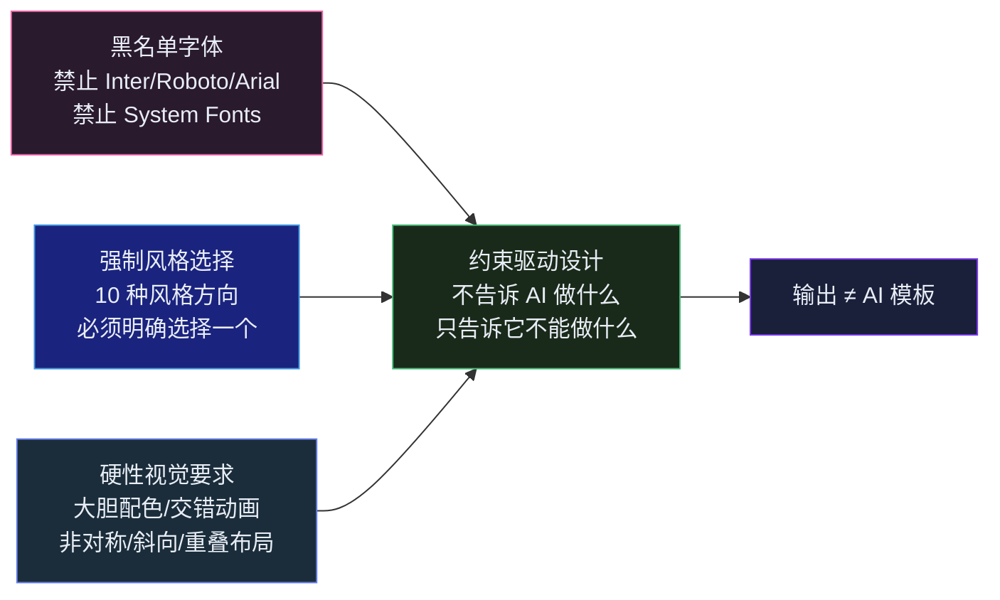

## 引言

2026 年 5 月，一个数字震动了 Agent Skills 社区：Anthropic 官方发布的 `frontend-design` Skill 安装量突破 56 万<cite>[1]</cite>。这个只有 42 行、约 1,300 tokens 的 SKILL.md 文件，成为了整个 Claude Code 生态中被安装最多的 Skill。

同一时期，GSAP（GreenSock Animation Platform）被 Webflow 收购后宣布所有插件免费商用<cite>[2]</cite>。GSAP 团队不是简单地发布了一篇博客——他们发布了 **gsap-skills**：一套将 GSAP 全部 API 知识拆解为 8 个模块化 Skill 的工程产物。

这不是巧合。2026 年正在成为「库作者为 AI Agent 写操作手册」的元年。背后的逻辑很简单：与其在每个 Prompt 里重新教 AI 正确的 API 用法，不如把知识凝结为一份 SKILL.md，让 Agent 按需加载。

这篇文章以 Agent 工程师的视角，拆解 GSAP Skills 生态的三个层级——官方核心、社区扩展、设计约束——以及它们共同揭示的 Agent Skill 设计新范式。

---

## 第一层：官方 `greensock/gsap-skills` — 库作者的操作手册

GSAP 团队发布的官方 Skill 包将整个动画库的知识体系拆解为 8 个独立模块<cite>[2]</cite>：

| Skill | 覆盖范围 | 为什么独立 |
|---|---|---|
| `gsap-core` | `gsap.to/from/fromTo`、easing、stagger、defaults | 最基础的 API，几乎所有动画都需要 |
| `gsap-timeline` | 序列编排、位置参数、标签、嵌套、播放控制 | Timeline 是 GSAP 的核心抽象，需要专门解释 |
| `gsap-scrolltrigger` | 滚动驱动动画、pin、scrub、refresh、cleanup | API 量足够大，独立加载避免浪费上下文 |
| `gsap-plugins` | Flip、Draggable、MotionPath、SplitText、MorphSVG 等 | 插件各有特定 API 和陷阱，需要细粒度说明 |
| `gsap-utils` | `clamp`、`mapRange`、`random`、`snap` 等工具函数 | 工具函数独立于动画 API，按需加载 |
| `gsap-react` | `useGSAP` hook、refs、`gsap.context()`、cleanup、SSR | React 特有的生命周期问题 |
| `gsap-performance` | `will-change`、transform-only、batch、ScrollTrigger 优化 | 性能是独立维度，与 API 使用无关 |
| `gsap-multi-framework` | Vue、Svelte、Angular 的集成模式和 cleanup | 框架差异足够大，需要分别说明 |

**这套拆分的工程逻辑**不是「把 GSAP 文档切成 8 份」，而是按**使用场景的独立性**划分：

- `gsap-core` + `gsap-timeline` 覆盖了 80% 的场景
- `gsap-scrolltrigger` 是独立的滚动动画领域
- `gsap-plugins` 中每个插件只在使用时才需要加载
- `gsap-react` 和 `gsap-multi-framework` 互斥——你不会同时用 React 和 Vue

这正是渐进披露机制在「库知识」场景下的最佳实践：**不是把文档一股脑塞给 AI，而是让 AI 像人类开发者一样「用到什么查什么」**<cite>[2]</cite>。

### 拆分粒度的权衡

GSAP 团队在 8 个模块和 1 个大文件之间做了明确的选择。一个来自社区的 Skill（685 行的 GSAP 集成 Skill）曾被分析工具标记为「考虑拆分」<cite>[1]</cite>——685 行对于一次性加载来说太重，但拆得太细（比如每个插件一个 Skill）又会导致过多的加载触发判断。

**这是一个新出现的工程问题：Skill 的「最佳粒度」是什么？** 初步的经验法则：300-400 行是一个 Skill 的理想上限；超过这个阈值，要么 Skill 承担了太多职责，要么应该分离出 `references/` 子文件。

---

## 第二层：`iotron/gsap-cookbook` — 从「能做什么」到「怎么做」

如果说官方 Skill 回答的是「GSAP 有什么 API」，社区 `iotron/gsap-cookbook` 回答的是「如何用 GSAP 做好动画」<cite>[3]</cite>。

9 个社区 Skill 的组织方式揭示了一个重要模式：

```
gsap-setup → gsap-animate（编排器）→ gsap-optimise → gsap-test
                ↓
    scroll · interact · text · svg · vfx
```

- **gsap-setup**：框架感知的初始化（Nuxt 3、Vue 3、React、Next.js）
- **gsap-animate**：编排器——根据布局类型选择正确的子 Skill
- **gsap-scroll**：ScrollTrigger 实战模式（reveal、parallax、pin+scrub、stacking cards）
- **gsap-interact**：3D tilt cards、spring physics、spotlight cursor、magnetic buttons
- **gsap-text**：SplitText 遮罩揭幕、ScrambleText 解码、kinetic character split
- **gsap-svg**：DrawSVG、MorphSVG、circuit tree 三层动画
- **gsap-vfx**：Glitch、marquee、rolling counters、floating、pulse rings
- **gsap-optimise**：25 点性能检查清单 + 反模式
- **gsap-test**：Vitest cleanup、Playwright hooks、发布前检查清单

**这与官方 Skill 的本质区别：官方 Skill 是 API Reference，社区 Skill 是 Cookbook。** 前者告诉你 `gsap.to()` 的参数，后者告诉你「滚动触发的卡片堆叠效果的三步实现法」。

### 五个来自生产环境的血泪教训

`gsap-cookbook` 最独特的价值在于它编码了「如果让我重新做一遍，我会避免的坑」<cite>[3]</cite>：

- `autoSplit: true` 没有配合 `onSplit()` 回调 → ResizeObserver 重新分割后元素引用全部失效
- SVG 中 `fill: 'none'` 而非 `fill: 'transparent'` → `'none'` 在 SVG 中意味着「未绘制」，GSAP 无法为其插值
- 多个共址的逐词 tween 缺少 `overwrite: false` → 全局 `overwrite: 'auto'` 在 y-slide 启动时杀死了 ScrambleText
- `ctx.revert()` **不会**移除 DOM 事件监听器——它只杀死 tween 和 ScrollTrigger
- 在 `SplitText.create()` 之前没有 `await document.fonts.ready` → fallback 字体测量导致 CLS

**这五条背后是一个重要的 Agent Skill 设计原则：反模式比正模式更有价值。** 告诉 AI「怎么做是对的」只能覆盖已知路径；告诉它「什么地方会出错」才能避免未知的陷阱。Cookbook 的价值不在于教 AI 新东西，而在于减少它犯已知错误的概率。

---

## 第三层：`frontend-design` — 用 1,300 tokens 杀死「AI 味」

Anthropic 官方发布的 `frontend-design` Skill 是目前整个生态中最受研究的案例<cite>[1]</cite>。它只有 42 行、约 1,300 tokens——但它的设计思想深刻影响了 GSAP Skills 和后续几乎所有前端 Skill。

### 它做了什么



核心逻辑：**LLM 默认输出的是训练分布的概率中心**——Inter 字体（前端仓库中最常见）、紫蓝渐变（SaaS 模板主色调）、三列卡片布局（Tailwind 默认模式）<cite>[1]</cite>。这些恰恰是用户认为「一眼 AI」的元素。

`frontend-design` 的策略不是让 AI 学新东西——而是用硬约束把它从「安全中心」推向「风格边缘」：

- 黑名单机制（禁止 Inter、禁止 Roboto、禁止 system fonts）→ 强制探索 Google Fonts 长尾
- 强制风格方向（Minimalist / Brutalist / Art Deco / Editorial 等 10 种）→ 拒绝模糊的「好看的」
- 硬性视觉要求（大胆配色、交错入场动画、非对称布局）→ 杜绝安全但平庸的设计

### 约束驱动 vs 指令驱动

这是 Agent Skill 设计中一个根本性的范式转变：

| 范式 | 策略 | 效果 |
|---|---|---|
| **指令驱动**（传统 Prompt） | 「做一个好看的登录页面」 | 模型的「好看」= 训练数据的均值 = 平庸 |
| **约束驱动**（Skill 设计） | 「禁止用 Inter、禁止三列卡片、必须有一个占据 60% 屏幕的不对称 hero」 | 模型被推向未知但有趣的解空间 |

**约束驱动设计的核心假设：AI 不需要被教会什么是「美」，它需要被阻止走「捷径」。**

---

## 第四层：Taste Skill — 可量化的设计参数化

如果说 `frontend-design` 用约束排除了糟糕的设计，**Taste Skill**（26.4K stars）则更进一步——它把设计变成了一组可调节的旋钮<cite>[4]</cite>：

| 维度 | 低值 | 高值 | 对应的 GSAP 参数 |
|---|---|---|---|
| **VARIANCE** | 规则对齐，对称布局 | 随机偏移，不对称 | `stagger` 分布、`x/y` 随机偏移量 |
| **MOTION** | 微小淡入，短持续时间 | 大型编排序列，长入场 | `duration`、`ease` 曲线、`stagger` 密度 |
| **DENSITY** | 大量留白，克制 | 高信息密度，图层叠加 | 元素数量、间距、z-index 层级 |

这种设计的工程价值：**Skill 不再是「一段话」，而是一组可调节的 API。** 用户可以在 `MOTION_INTENSITY=high` 和 `MOTION_INTENSITY=low` 之间选择，而不是每次重新描述「我想要多一点动画但也别太多」。

Taste Skill 还做了一个关键的架构决定：**生成中间表示（Design Tokens → Markup Skeleton → GSAP Animation Scaffold）而非直接输出框架代码。** 这让它在跨 Agent 环境中可移植——同一套 Tokens 可以被 Claude Code 的 React 生成器和 Codex 的 Vue 生成器分别消费<cite>[4]</cite>。

---

## 第五层：Skill 链 — 从生成到交付的完整流水线

GSAP Skills 生态最成熟的用法不是单个 Skill，而是**链式组合**<cite>[1]</cite>：

```
frontend-design    →  生成视觉方向 + 品牌 Tokens
gsap-core          →  实现基础动画 API
gsap-scrolltrigger →  添加滚动驱动效果
gsap-cookbook/vfx  →  叠加微交互
gsap-optimise      →  25 点性能审查
gsap-test          →  清理 + 预发布检查
```

这个链条在工程设计上等价于 CI 流水线——但传统 CI 检查的是代码质量（lint、type-check、test），而 Skill 链检查的是**设计质量**（风格一致性、动画性能、API 用法正确性）。

一个值得注意的实践：团队在项目中同时放置 `CLAUDE.md` 和使用 `DESIGN.md` 文件<cite>[1]</cite>：

```
DESIGN.md
├── Typography assignments: 标题用 "Playfair Display"，正文保持 "Source Sans Pro"
├── Color palette: #1a1a2e (primary), #e94560 (accent)
├── Border radius policy: 卡片 12px, 按钮 8px, input 6px
├── Animation budget: duration 0.3-0.8s, ease: power2.out, CSS-only 用于 hover
└── Component conventions: shadow 策略、spacing scale
```

**Skill 提供「如何做」，DESIGN.md 提供「在什么约束下做」。** 这种双层约束系统是 AI 生成保持多页面一致性的关键——Skill 说「大胆配色」，DESIGN.md 说「但只用这两个颜色」。

---

## 第六层：从 GSAP Skills 看 Agent Skill 设计的新范式

回顾整个 GSAP Skills 生态，可以提炼出几条新的设计规律：

### 库作者参与是 Skill 质量的护城河

GSAP 官方 Skill 和社区 Cookbook 的区别不仅仅是「准确 vs 实用」——而是「API 知识」和「使用经验」在 Agent Skill 格式下的不同价值密度。官方 Skill 保证了你不会因为 API 参数错误而 debug 两小时；社区 Cookbook 保证了你不会因为不知道 `ctx.revert()` 不清理 DOM 事件而线上翻车。

### 「反模式」是 Skill 中最被低估的内容

GSAP Cookbook 的 5 条血泪教训可能是整个 Skill 中最有价值的部分。设计 Skill 时，花 20% 的篇幅写「不要做什么」和「常见的 5 个坑」，其边际收益可能超过 80% 的「正确用法」内容。

### 渐进披露从「上下文节省」变成「认知模型」

当 Skill 数量增长到 8+ 个时，渐进披露不仅是节省上下文的工程手段——它本身就定义了一个学习路径。GSAP 官方 Skill 的 8 模块划分告诉 AI 一个隐式的「知识地图」：先学 core，再学 timeline，按需加载 scrolltrigger 和 plugins。这与人类开发者学习 GSAP 的路径完全一致。

### 中间表示是跨 Agent 可移植性的关键

Taste Skill 的 Design Tokens → Markup Skeleton → Animation Scaffold 三层架构，使其可以在 Claude Code、Codex、Cursor 等不同 Agent 之间复用。这暗示了 Agent Skill 设计的一个未来方向：**Skill 的输入和输出应该是 Agent-agnostic 的中间表示**，而非特定于某个模型的指令格式。

---

## 总结

GSAP Skills 生态的三层结构——官方 API 技能包、社区模式 Cookbook、设计约束系统——构成了一幅完整的 Agent Skill 设计图景：

1. **库作者为 Agent 写 Skill** 正在从「个别案例」变成「行业趋势」。Webflow/GSAP 收购后的第一个大动作不是新功能而是新 Skill——这个选择本身就是信号
2. **`frontend-design` 证明了「约束 > 指令」**：1,300 tokens 的禁止列表比 10,000 tokens 的正面指令更有效
3. **Cookbook 模式补齐了「API 知识」到「实践经验」的最后一公里**：反模式比正模式更有价值
4. **Skill 链 + DESIGN.md 给出了 AI 生成一致性的工程方案**：双层约束是解决「每次输出风格不同」的关键
5. **Agent Skill 正在形成自己的设计模式语言**：渐进披露、中间表示、约束驱动、反模式编码——这些不是 Prompt Engineering 的术语，而是新兴的 Agent Engineering 的工程词汇

对于前端工程师来说，理解 GSAP Skills 不是「又多了一个工具」，而是看到了一个清晰的未来：**库的文档不再只是给人看的——它也需要被 Agent 消费。** 而为 Agent 设计的文档，需要一套全新的编写范式。

---

## 参考文献

1. *Claude Code frontend-design Skill — Ultimate Guide.* Skywork.ai, 2026.  
   <https://skywork.ai/blog/claude-code-frontend-design-skill-ultimate-guide-2/>
2. *greensock/gsap-skills: Official GSAP AI Skill Pack.* GreenSock / Webflow, 2026.  
   <https://github.com/greensock/gsap-skills>
3. *9 AI Skills for GSAP in Vue/Nuxt & React — Open Source Companion to Official gsap-skills.* GSAP Community Forums, 2026.  
   <https://gsap.com/community/forums/topic/45389-9-ai-skills-for-gsap-in-vuenuxt-react/>
4. *Taste Skill: 面向 AI Agent 的可移植前端设计技能集合.* Leonxlnx, 2026.  
   <https://refft.com/Leonxlnx_taste-skill.html>
5. *The Agent Skills Standard: Google Antigravity vs. Claude Code.* JuheAPI Blog, 2026.  
   <https://www.juheapi.com/blog/the-agent-skills-standard-google-antigravity-vs-claude-code>
6. *「gsap-skills」官方 GSAP AI 技能包：让 Codex、Claude Code 和 Cursor 更稳地生成复杂网页动画.* Wefound, 2026.
7. *56 万人装了这个 Skill，Claude 生成的页面终于不像 AI 做的了！* CSDN, 2026.  
   <https://blog.csdn.net/wuShiJingZuo/article/details/161496098>
{: .references }
