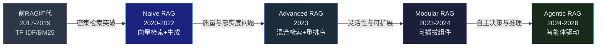
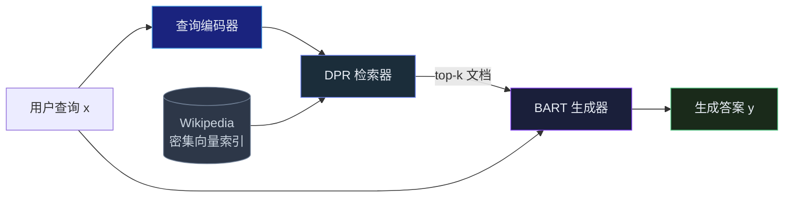
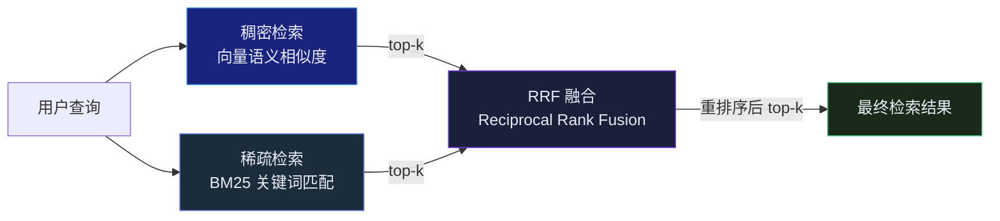
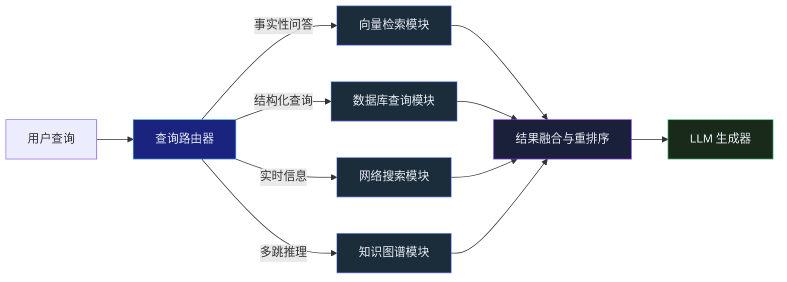
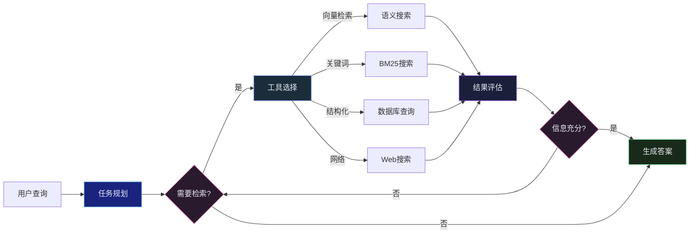
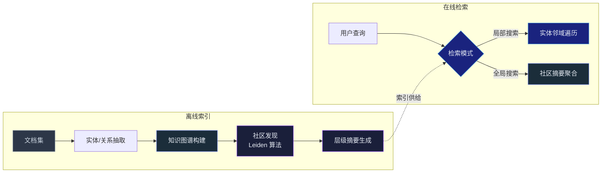

## 引言

大语言模型（LLM）拥有惊人的知识和推理能力，但面临三个根本性限制：**知识截止日期**（训练数据的时间边界）、**幻觉问题**（对不确定的事实信口开河）、**私有知识盲区**（无法访问企业内部文档）。

检索增强生成（Retrieval-Augmented Generation，RAG）是解决这三个问题的最主流范式。它的核心思想简洁而深刻：**在 LLM 生成答案之前，先从外部知识库中检索相关信息，将检索结果作为上下文注入生成过程**<cite>[1]</cite>。

自 2020 年 Meta AI 正式提出 RAG 概念以来<cite>[1]</cite>，这项技术经历了一条从学术原型到产业级基础设施的快速演进路径。到 2026 年，RAG 已经从单一的"检索-阅读"流水线发展为涵盖混合检索、智能体重排、知识图谱增强、多步推理的完整技术栈。

本文将系统梳理 RAG 技术的完整演进脉络，帮助你理解每个阶段要解决的核心问题和技术突破。



---

## 前 RAG 时代：信息检索的演变

在 RAG 出现之前，"检索-阅读"范式已经在问答系统中有了相当成熟的发展。

**2017 年，DrQA**（Chen et al.）提出了一个经典的开放域问答流水线：TF-IDF 检索器从 Wikipedia 中召回相关段落，然后一个 RNN 阅读器从这些段落中提取答案<cite>[2]</cite>。这个工作的意义在于建立了"先检索、后阅读"的架构模式，但检索和阅读是独立训练的。

**2018 年的 R³ 系统**（Reinforced Reader-Ranker）引入了一个关键概念：用强化学习来优化检索器与阅读器之间的协同<cite>[3]</cite>。检索不再是独立的黑盒——系统学会了检索那些"阅读器能看懂"的文档。

**2019 年是关键的转折年**。ORQA（Lee et al.）提出了隐式检索的概念，用密集向量代替稀疏关键词进行文档匹配，并首次将检索器与阅读器端到端训练<cite>[4]</cite>。同年，Wizard of Wikipedia 将检索增强引入对话系统，证明了这个范式在对话场景中的有效性。

| 年份 | 关键系统 | 核心贡献 |
|---|---|---|
| 2017 | DrQA | "检索-阅读"流水线雏形 |
| 2018 | R³ | 强化学习优化检索-阅读协同 |
| 2019 | ORQA | 密集检索 + 端到端训练 |
| 2019 | Wizard of Wikipedia | 检索增强对话 |

**这些工作共同为 RAG 的诞生铺平了道路**：它们证明了外部知识对生成质量的增益，积累了密集检索的技术储备，并验证了端到端训练检索器与阅读器的可行性。

---

## RAG 的诞生 (2020)：一场范式革命

2020 年，Meta AI 的 Lewis 等人发表了里程碑论文 *Retrieval-Augmented Generation for Knowledge-Intensive NLP Tasks*，正式命名并定义了 RAG 范式<cite>[1]</cite>。

### 核心架构

原始 RAG 的架构由三个组件构成：



**检索器**使用 DPR（Dense Passage Retrieval）——一种双编码器架构，用 BERT 分别编码查询和文档，通过向量内积计算相似度<cite>[5]</cite>。相比于 BM25 等传统稀疏检索方法，DPR 在 Top-20 召回率上提升了 9-19 个百分点。

**生成器**使用 BART-large——一个 4 亿参数的序列到序列模型。关键设计是检索到的文档与原始查询拼接后，一起送入生成器的编码器，让模型同时关注查询和检索结果。

### 两种解码策略

RAG 论文提出了两种变体，揭示了检索与生成的两种耦合方式：

**RAG-Sequence**：同一套检索文档用于生成整个输出序列：

$$
P(y|x) \approx \sum_{z \in \text{top-}k} P(z|x) \cdot P(y|x,z)
$$

其中 $z$ 是检索到的文档，模型对 top-k 篇文档的输出做加权求和。

**RAG-Token**：每个输出 token 可以基于不同的检索文档生成：

$$
P(y|x) = \prod_{i} \sum_{z} P(z|x) \cdot P(y_i \mid x, z, y_{1:i-1})
$$

这允许第 $i$ 个 token 关注与第 $i-1$ 个 token 不同的知识源，理论上更灵活。

### 关键意义

RAG 论文揭示了一个反直觉的结论：**一个 4 亿参数的 RAG 模型（BART + DPR），在知识密集型任务上的表现可以超越 110 亿参数的纯生成模型**。这意味着：

$$ \text{参数记忆} + \text{非参数知识库} > \text{更大的参数记忆} $$

这个公式奠定了 RAG 的经济学基础：用廉价的向量存储替代昂贵的模型参数来记忆知识。

同年，REALM（Guu et al.）更进一步，将检索增强引入预训练阶段——模型在掩码语言建模任务中学习同时优化检索器和编码器参数<cite>[6]</cite>。FiD（Fusion-in-Decoder）则提出了让生成器同时关注多篇检索文档的架构模式<cite>[7]</cite>。

---

## Naive RAG 时代 (2021-2022)：快速普及与瓶颈暴露

### 早期成果

2021 年是 RAG 研究的爆发期。FiD 架构在 Natural Questions 和 TriviaQA 上达到新的 SOTA<cite>[7]</cite>。EMDR² 提出用 EM 算法迭代训练检索器，无需人工标注的检索标签<cite>[8]</cite>。RAG 的应用边界从开放域 QA 扩展到对话、事实核查、代码生成等多个领域。

### ChatGPT 带来的范式转移

**2022 年 12 月，ChatGPT 发布**，成为 RAG 研究的真正分水岭。

在此之前，RAG 研究的主流路径是将检索器与一个中等规模的语言模型（如 BART、T5）进行联合微调。这条路径的问题在于微调成本高、泛化能力有限。

ChatGPT 的出现改变了游戏规则。**LLM 本身已经足够强大，不需要为了使用检索而重新训练**——只需要在推理时将检索结果拼接到提示词中即可。这种"外挂式 RAG"（off-the-shelf RAG）极大降低了 RAG 的门槛。

### Naive RAG 的三大缺陷

然而，"检索 + 拼接 + 生成"的朴素实现很快暴露出三个核心问题<cite>[9]</cite>：

| 缺陷 | 描述 | 典型表现 |
|---|---|---|
| **检索质量不稳定** | 用户查询与文档语义不匹配 | 问"如何部署"却检索到"安装依赖" |
| **生成忠实度不可控** | 模型可能忽略检索结果或过度依赖 | 编造文档中不存在的信息 |
| **上下文窗口不足** | 检索文档总量超出模型输入限制 | 关键信息被截断或遗漏 |

这三个问题直接驱动了下一阶段的技术演进。

---

## Advanced RAG (2023)：预处理与后处理时代

2023 年，社区针对 Naive RAG 的缺陷发展出一套系统性的改进方案，形成了 Advanced RAG 的技术范式。

### 查询处理：让检索更准

**查询改写（Query Rewriting）** 解决用户查询与文档语义不匹配的问题。当用户问"这东西怎么跑起来"时，LLM 先将口语化查询改写为更精确的"部署配置步骤"，再送入检索器。

**HyDE**（Hypothetical Document Embeddings）则另辟蹊径——先让 LLM 想象一个理想答案文档，用这个"假设文档"的嵌入向量去检索真实文档<cite>[10]</cite>。这种"用生成引导检索"的策略在许多基准上取得了显著的召回率提升。

### 混合检索：取长补短

这是 Advanced RAG 最重要的技术突破之一。



稠密检索擅长语义匹配——"汽车"和"轿车"的向量距离很近。稀疏检索（BM25）擅长精确关键词匹配——"Transformer 架构"必须包含 Transformer 这个词。两者互为补充。

融合策略通常采用 **RRF（Reciprocal Rank Fusion）**：

$$\text{RRF}(d) = \sum_{r \in R} \frac{1}{k + \text{rank}_r(d)}$$

其中 $k=60$ 是平滑常数，$R$ 是各检索器的结果集合。RRF 不依赖得分的绝对数值尺度（稀疏和稠密得分的量纲不同），只使用相对排名，因此天然适合多源融合。

### 重排序：善用算力换精度

重排序（Reranking）是 Advanced RAG 流水线的最后一环。从混合检索得到候选集后，用一个更精确（也更具计算成本）的模型对候选文档重新打分。

典型方案是 **Cross-Encoder 重排序**——将查询和候选文档拼接后送入一个预训练的交叉编码器（如 `BAAI/bge-reranker-v2-m3`），输出相关性分数<cite>[11]</cite>。与双编码器不同，交叉编码器能看到查询和文档的完整交互，因此判断更加准确。

成本权衡：双编码器（嵌入模型）处理 1 万篇文档毫秒级完成；交叉编码器重排 100 篇候选需要数百毫秒。可行的策略是"先粗筛、后精排"——用嵌入检索粗筛 50-100 篇，重排序挑出前 5-8 篇。

### 上下文压缩

当检索到的文档总量超出 LLM 的上下文窗口时，需要进行压缩。常见的做法包括：用小型 LLM 对每篇文档摘取与查询相关的句子（Extractive Compression），或直接以摘要方式重写（Abstractive Compression）。

---

## Modular RAG (2023-2024)：从流水线到可组合架构

2023 年下半年，LangChain 和 LlamaIndex 等框架的崛起推动了 RAG 的模块化。核心洞察是：**检索、生成、记忆、路由、搜索等功能应该是独立可插拔的模块，而不是硬编码的固定流程**<cite>[12]</cite>。

### 模块化架构



### Self-RAG：让模型学会反思

Self-RAG（Asai et al.）是 Modular RAG 时代最具代表性的工作之一<cite>[13]</cite>。它让 LLM 在生成过程中插入特殊的反思 token：

- `<Retrieve>`：是否需要检索
- `<Relevant>`：检索结果是否与查询相关
- `<Supported>`：生成的答案是否有检索文档的支持
- `<Useful>`：生成的答案是否解决了用户的问题

这种"自我反思"的能力使 RAG 从被动的流水线转变为主动的质量控制过程。

### CRAG：检索失败时的纠错机制

CRAG（Corrective RAG）专门处理检索质量不佳的情况<cite>[14]</cite>。当检索器评估自身检索结果质量低于阈值时，自动触发网络搜索作为补充知识源。这种"检索评估 → 结果纠错"的闭环机制，使系统在知识库不完整时也能保证回答质量。

---

## Agentic RAG (2024-2026)：让 RAG 学会思考和决策

2024 年起，AI Agent 的思想开始与 RAG 深度融合，催生了 Agentic RAG 范式。**本质变化是：检索不再是一个固定的流水线，而是一个由 Agent 自主决策的认知过程**。

### 从流水线到认知循环



Agentic RAG 引入了三个核心能力：

1. **规划**：将复杂查询分解为子问题，制定检索计划
2. **反思**：评估检索结果质量，决定是否需要改进查询或切换策略
3. **工具使用**：自主选择最合适的检索工具——向量数据库、SQL 查询、API 调用或网络搜索

### ReAct 框架

ReAct（Reason + Act）是 Agentic RAG 的基础框架<cite>[15]</cite>。它将推理和行动交替执行：

```
Thought: 用户想知道公司 Q3 的销售额，我需要查数据库。
Action: query_database("SELECT revenue FROM quarterly WHERE quarter='Q3'")
Observation: 结果为空，数据库只有月份粒度。
Thought: 需要改为按月份查询，然后汇总。
Action: query_database("SELECT SUM(revenue) FROM monthly WHERE month IN (7,8,9)")
Observation: 总营收为 1,250 万。
Thought: 现在有数据了，可以回答用户。
Answer: 公司 Q3 的总销售额为 1,250 万。
```

这种迭代修正的能力让 Agentic RAG 能够处理传统流水线无法应对的复杂多跳推理问题。

---

## GraphRAG (2024-2025)：知识图谱与向量检索的融合

Microsoft 在 2024 年 7 月开源的 GraphRAG 是近年来 RAG 领域最重要的进展之一<cite>[16]</cite>。

### 为什么要用图

传统向量检索擅长语义相似性匹配，但在多跳推理和全局总结时表现不佳。比如问"这个领域中所有方法的共同局限性是什么"，需要遍历多篇文档、抽取各自局限性、找出交集——这超出了向量检索的能力范围。

GraphRAG 的解决方案：用 LLM 将文档中的实体（人物、组织、概念）和关系抽取为知识图谱，然后用图遍历算法进行检索。

### 两阶段架构



GraphRAG 提供两种查询模式：
- **局部搜索**：从与查询相关的实体出发，遍历其邻居关系，适合具体事实查询
- **全局搜索**：利用 Leiden 社区发现算法将图划分为语义社区，每个社区生成层级摘要，适合"总结全貌"类问题

在跨文档推理任务上，GraphRAG 的幻觉率比朴素向量 RAG 低约 40%。

### 权衡与适用边界

GraphRAG 的成本是一个重要权衡。**索引阶段**：每个文档块需要 4-6 次 LLM 调用进行实体抽取和关系提取，使用 Llama 3.1 70B 模型时，每 100 万 token 的索引成本约 $2.5-3.6。相比之下，纯向量索引的成本几乎是零。

**适用判断**：

| 场景特征 | 推荐方案 |
|---|---|
| 单篇文档内的事实查找 | 向量 RAG 足够 |
| 跨文档的实体关系查询 | GraphRAG 优势明显 |
| 需要对整个知识库做全局总结 | GraphRAG 的全局搜索独有优势 |
| 实时更新的知识库 | 向量 RAG，GraphRAG 索引太慢 |

---

## 当前前沿 (2025-2026)：自适应与系统化

### 自适应 RAG

进入 2025-2026 年，RAG 的研究重点正在转向**自适应**——让系统根据查询类型、用户历史、检索质量自动调整检索策略<cite>[17]</cite>。

关键方向包括：
- **策略路由**：简单事实查询走快速向量检索，复杂推理查询走 Agentic 多步检索
- **动态阈值**：根据检索结果的质量分数自动决定是否需要重试、改写查询或触发网络搜索
- **用户反馈闭环**：利用用户的隐式反馈（点击、追问、修正）持续优化检索器和排序器参数

### 神经符号融合

知识图谱的结构化推理与向量语义检索正在走向深度融合。Microsoft Fabric 在 2026 年发布的 Graph-Powered AI Reasoning 就是这一趋势的代表——将 NL2GQL（自然语言转图查询语言）与向量检索并行使用，结果通过确定性图遍历进行验证，兼顾语义理解的灵活性和符号推理的可解释性。

### 隐私保护 RAG

随着 RAG 在企业场景的广泛部署，联邦检索（Federated Retrieval）和差分隐私技术成为新的研究热点。核心挑战是在不暴露敏感文档内容的前提下完成语义检索——检索器需要知道文档与查询的相关性，但不应能还原文档内容。

---

## 总结

回顾 RAG 从 2020 年到 2026 年的发展历程，我们可以看到一条清晰的演进主线：

| 阶段 | 核心问题 | 解决方案 | 典型系统 |
|---|---|---|---|
| Naive RAG | LLM 知识不完备 | 检索 + 拼接 + 生成 | 原始 RAG, REALM |
| Advanced RAG | 检索质量和忠实度 | 混合检索 + 重排序 + 压缩 | HyDE, BGE Reranker |
| Modular RAG | 灵活性不足 | 可插拔组件 + 路由 | LangChain, LlamaIndex |
| Agentic RAG | 复杂多跳推理 | 规划 + 反思 + 工具使用 | Self-RAG, ReAct RAG |
| GraphRAG | 跨文档推理 | 知识图谱 + 图遍历 | Microsoft GraphRAG |
| Adaptive RAG | 策略最优性 | 动态路由 + 反馈闭环 | 2025+ 前沿 |

RAG 的发展本质上是在回答一个核心问题：**如何以最低成本让 LLM 获得最相关的知识**。从朴素流水线到 Agentic 智能体，控制权逐步从开发者定义的固定规则，转移到模型自身的动态决策。

在后续文章中，我们将深入技术细节——包括分块策略的实现原理、混合检索的工程细节、以及如何将这些技术整合为一个可部署的生产级系统。

---

## 参考文献

1. *Retrieval-Augmented Generation for Knowledge-Intensive NLP Tasks.* Lewis P, et al. NeurIPS, 2020.  
   <https://arxiv.org/abs/2005.11401>
2. *Reading Wikipedia to Answer Open-Domain Questions.* Chen D, et al. ACL, 2017.  
   <https://arxiv.org/abs/1704.00051>
3. *R³: Reinforced Ranker-Reader for Open-Domain Question Answering.* Wang S, et al. AAAI, 2018.  
   <https://arxiv.org/abs/1709.00023>
4. *Latent Retrieval for Weakly Supervised Open Domain Question Answering.* Lee K, et al. ACL, 2019.  
   <https://arxiv.org/abs/1906.00300>
5. *Dense Passage Retrieval for Open-Domain Question Answering.* Karpukhin V, et al. EMNLP, 2020.  
   <https://arxiv.org/abs/2004.04906>
6. *REALM: Retrieval-Augmented Language Model Pre-Training.* Guu K, et al. ICML, 2020.  
   <https://arxiv.org/abs/2002.08909>
7. *Leveraging Passage Retrieval with Generative Models for Open Domain Question Answering.* Izacard G, Grave E. EACL, 2021.  
   <https://arxiv.org/abs/2007.01282>
8. *End-to-End Training of Multi-Document Reader and Retriever.* Sachan D S, et al. NeurIPS, 2021.  
   <https://arxiv.org/abs/2106.05346>
9. *Retrieval-Augmented Generation for Large Language Models: A Survey.* Gao Y, et al. arXiv, 2023.  
   <https://arxiv.org/abs/2312.10997>
10. *Precise Zero-Shot Dense Retrieval without Relevance Labels.* Gao L, et al. ACL, 2023.  
    <https://arxiv.org/abs/2212.10496>
11. *BGE: C-Pack — Packaged Resources to Advance Chinese Embedding.* Xiao S, et al. arXiv, 2023.  
    <https://arxiv.org/abs/2309.07597>
12. *A Survey on RAG: Progress, Gaps, and Future Directions.* Chen J, et al. arXiv, 2025.  
    <https://arxiv.org/abs/2507.18910>
13. *Self-RAG: Learning to Retrieve, Generate, and Critique through Self-Reflection.* Asai A, et al. ICLR, 2024.  
    <https://arxiv.org/abs/2310.11511>
14. *Corrective Retrieval Augmented Generation.* Yan S Q, et al. arXiv, 2024.  
    <https://arxiv.org/abs/2401.15884>
15. *ReAct: Synergizing Reasoning and Acting in Language Models.* Yao S, et al. ICLR, 2023.  
    <https://arxiv.org/abs/2210.03629>
16. *GraphRAG: Unlocking LLM Discovery on Narrative Private Data.* Edge D, et al. Microsoft Research, 2024.  
    <https://arxiv.org/abs/2404.16130> · 代码仓库：<https://github.com/microsoft/graphrag>
17. *Adaptive-RAG: Learning to Adapt Retrieval-Augmented LLMs.* Jeong S, et al. EMNLP, 2024.  
    <https://arxiv.org/abs/2403.14403>
{: .references }
