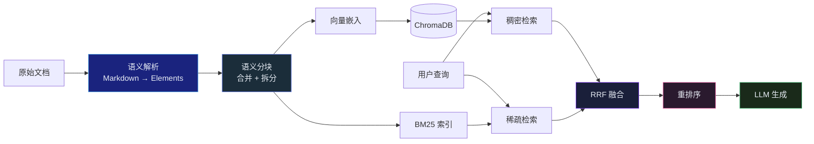

## 引言

上一篇文章我们从宏观视角梳理了 RAG 从 2020 年到 2026 年的完整演进脉络。这篇文章将深入技术内部，逐一剖析 Advanced RAG 流水线的三个核心环节：

1. **分块策略**：如何将原始文档切分为语义完整的检索单元
2. **混合检索**：如何融合稠密向量的语义匹配与 BM25 的关键词匹配
3. **重排序**：如何用更精确的模型对候选结果进行二次筛选

我们将以 CazzKB 开源项目（<https://github.com/YangCazz/CazzKB>）的真实实现代码作为参照，展示每个技术决策的工程考量。



---

## 分块策略：语义完整性的艺术

分块（Chunking）是 RAG 系统最基础也最容易被低估的环节。**分块质量直接决定了检索的精度上限**——如果知识被打散在不合理的边界上，后续的嵌入、检索和重排序都无法弥补这一信息损失。

### 固定大小分块的问题

最简单的分块方式是固定 token 数切分（如每 512 token 一块，重叠 50 token）。但这种策略有严重的缺陷：

- **语义断裂**：一段完整的推理可能在中间被截断
- **上下文丢失**：列表项与引文段落被分到不同块中
- **代码破坏**：函数定义与实现体被拆分

固定分块在处理叙述性散文时勉强可用，但在处理技术文档（包含代码块、表格、公式、图表的 Markdown 文件）时表现糟糕。

### CazzKB 的语义分块方案

CazzKB 采用了两步语义分块策略：**先解析语义元素，再按 token 预算合并**。

#### 第一步：Markdown 语义解析

`parser.py` 将 Markdown 文本解析为结构化的 `Element` 序列，每个元素标注了类型、层级和在文档中的位置：

```python
class ElementType(str, Enum):
    HEADER = "header"        # 标题（记录层级 1-6）
    CODE = "code"            # 代码块（记录语言）
    TABLE = "table"          # 表格
    MATH = "math"            # 数学公式块
    LIST = "list"            # 列表
    BLOCKQUOTE = "blockquote" # 引用块
    TEXT = "text"            # 普通文本
    MERMAID = "mermaid"      # Mermaid 图表
    FRONTMATTER = "frontmatter" # YAML 头部元数据

@dataclass
class Element:
    content: str
    type: ElementType
    level: int = 0
    header_path: str = ""   # 例：/SSM基础/连续时间模型
    meta: dict = field(default_factory=dict)
```

解析器维护一个 `header_stack`，追踪当前元素所处的文档层级路径。例如，在"状态空间模型基础"章节下的"连续时间模型"子章节中，每个元素的 `header_path` 都是 `/状态空间模型基础/连续时间模型`。这个路径信息随后被写入每个 chunk 的元数据，用于检索结果的上下文展示。

关键设计决策——**保护类型**：代码块、表格、数学公式和 Mermaid 图表被标记为"受保护"元素。它们在后续的合并阶段**永远不会与其他元素合并**，也不会被中途截断。这确保了技术文档中最具信息密度的内容保持完整。

#### 第二步：Token 感知的合并与拆分

`chunker.py` 的 `SemanticChunker` 完成分块的两阶段操作：

**合并阶段**（`_merge_elements`）：将相邻的小文本元素（段落、列表项、引用）合并为接近 `max_tokens`（默认 512）的块。遇到以下情况时触发"刷新"（结束当前块，开始新块）：

1. 遇到标题元素（标题总是开启一个新块）
2. 遇到受保护类型（每个受保护元素独占一块）
3. 当前缓冲区的 token 数超过 `max_tokens`

```python
# 核心合并逻辑（简化为关键路径）
for elem in elements:
    if elem.type == ElementType.HEADER:
        flush()  # 标题开新块
        merged.append((elem.content, elem.type, elem.header_path))
    elif elem.type in protected_types:
        flush()  # 受保护类型独占一块
        merged.append((elem.content, elem.type, elem.header_path))
    elif would_exceed_max_tokens(buffer + elem):
        flush()  # 超预算则开新块
    buffer += elem.content
```

**拆分阶段**（`_split_oversized`）：对于合并后仍然超过 `max_tokens` 的长文本块，按段落边界进行拆分，并保留 `overlap_tokens`（默认 50）的词级重叠，确保跨块边界的语义连续性。

### Token 估算：不需要 tiktoken

CazzKB 使用了一个轻量级的 token 估算函数，避免了对语言特定分词器（如 `tiktoken`）的依赖：

```python
def _estimate_tokens(text: str) -> int:
    chars = len(text)
    cjk = sum(1 for c in text if "一" <= c <= "鿿")
    return max(1, (chars - cjk) // 4 + cjk // 2)
```

中文约 2 字符 = 1 token，英文约 4 字符 = 1 token。虽然不如真实 tokenizer 精确，但对于分块边界判断已经足够——分块需要的是相对大小，而非绝对精确计数。

### 分块策略对比

| 策略 | 语义完整性 | 实现复杂度 | 适用场景 |
|---|---|---|---|
| **固定大小** | 低——经常截断语义单元 | 最低 | 散文、叙述性文本 |
| **递归分块** | 中——按分隔符层级切分 | 低 | 通用文档 |
| **语义分块** | 高——基于元素类型保护 | 中 | 技术文档、带代码的文本 |
| **动态分块** | 最高——LLM 参与判断边界 | 高（慢） | 高质量要求场景 |
| **上下文增强分块** | 高——每块附加上下文摘要 | 高（需 LLM） | 专业领域、高精度场景 |

语义分块在大多数技术文档场景下是最佳性价比的选择。LLM 参与的分块方式虽然可能更精确，但索引阶段的成本增加 10-20 倍，仅在检索质量有极高要求时才值得。

---

## 混合检索：语义与关键词的共生

纯向量检索存在一个根本性的局限：**嵌入模型擅长近义词泛化，但在精确匹配上不如关键词检索**。例如查询"Transformer 的多头注意力机制"，向量检索可能返回大量关于"注意力"的泛化结果，而 BM25 能精确锁定包含"多头注意力"的文档。

### 稠密检索：ChromaDB + 嵌入模型

CazzKB 使用 ChromaDB 作为向量存储。Chroma 是一个嵌入式向量数据库——它在进程内运行，不需要外部服务。对于个人知识库场景，这种零依赖的架构远比 Qdrant 或 Weaviate 等需要 Docker 的解决方案实用。

嵌入提供者采用工厂模式，支持 OpenAI（`text-embedding-3-small`，1536 维）和本地 Ollama（`bge-m3`，1024 维）两种方案：

```python
# 嵌入提供者的注册与获取
_registry: dict[str, type[EmbeddingProvider]] = {}

@register_embedding
class OpenAIEmbedding(EmbeddingProvider):
    _FACTORY_NAME = "openai"

@register_embedding
class OllamaEmbedding(EmbeddingProvider):
    _FACTORY_NAME = "ollama"
```

配置文件中选择一行即可切换：

```yaml
embedding:
  factory: ollama    # 或 openai
  model: bge-m3      # 或 text-embedding-3-small
  dimension: 1024    # 或 1536
```

对于个人或小团队使用，本地 Ollama 部署可以完全消除 API 调用成本。`bge-m3` 的 1024 维向量在中文技术文本上的表现与 OpenAI 的 1536 维差距不大，但延迟和成本有数量级的优势。

### 稀疏检索：BM25

BM25 是经典的概率检索模型，基于词频（TF）和逆文档频率（IDF）计算查询与文档的相关性：

$$\text{BM25}(q, d) = \sum_{t \in q} \text{IDF}(t) \cdot \frac{f(t,d) \cdot (k_1 + 1)}{f(t,d) + k_1 \cdot (1 - b + b \cdot \frac{|d|}{\text{avgdl}})}$$

CazzKB 使用 `rank-bm25` 库实现 BM25，并维护了精心设计的停用词表。中英文混合的技术博客场景有特殊的挑战——中文单字虚词（的、了、在、是）和高频英文功能词（the、a、is、of）虽然 IDF 已经为其分配了较低权重，但明确过滤能防止它们污染稀疏向量空间，改善融合质量<cite>[1]</cite>。

```python
def _tokenize(text: str) -> list[str]:
    cleaned = text.lower().replace(".", " ").replace(",", " ")...
    tokens = cleaned.split()
    return [t for t in tokens if t not in _STOP_WORDS and len(t) > 1]
```

关键设计：**BM25 索引在所有文档摄入完成后一次性构建**（`build()`），而非增量更新。这避免了每次添加文档时重建整个索引的开销。

### RRF 融合：让两个检索器对话

稠密检索和稀疏检索各自产生一个排序列表，但它们的得分尺度完全不同——余弦相似度在 0-1 区间，BM25 得分则是无界的正实数。直接加权求和几乎不可能合理。

**Reciprocal Rank Fusion（RRF）** 巧妙地绕过了得分归一化问题——只用排名，不看绝对分数<cite>[2]</cite>：

$$\text{RRF}(d) = \sum_{r \in R} \frac{1}{k + \text{rank}_r(d)}$$

CazzKB 的完整实现：

```python
def reciprocal_rank_fusion(
    dense_results: list[tuple[str, str, float]],
    sparse_results: list[tuple[str, str, float]],
    k: int = 60,
    dense_weight: float = 0.7,
    top_k: int = 8,
) -> list[SearchResult]:
    # 构建排名映射
    dense_rank = {chunk_id: rank for rank, (chunk_id, _, _)
                  in enumerate(dense_results, start=1)}
    sparse_rank = {chunk_id: rank for rank, (chunk_id, _, _)
                   in enumerate(sparse_results, start=1)}

    all_ids = set(dense_rank.keys()) | set(sparse_rank.keys())

    # 对每个文档计算加权 RRF
    fused = []
    for chunk_id in all_ids:
        d_rank = dense_rank.get(chunk_id, len(dense_results) + 1)
        s_rank = sparse_rank.get(chunk_id, len(sparse_results) + 1)
        rrf = (dense_weight * (1.0 / (k + d_rank)) +
               (1 - dense_weight) * (1.0 / (k + s_rank)))
        fused.append((chunk_id, rrf))

    fused.sort(key=lambda x: x[1], reverse=True)
    return fused[:top_k]
```

几个值得注意的细节：

**缺失文档的惩罚排名**：如果某篇文档只被一个检索器找到，它在另一个检索器中的排名被设为 `len(results) + 1`（比最后一名还差一名）。这确保了单源文档不会被不合理地拔高排名。

**`dense_weight = 0.7`**：稠密检索的权重略高于稀疏。这是因为语义匹配在大多数查询中比关键词匹配更可靠——用户更容易用不同措辞表达相同意图（需要语义泛化），而非使用完全相同的关键词。

**`k = 60`**：平滑常数。较大的 k 值降低了排名差异的影响，使融合更"民主"；较小的 k 值则让高排名结果更具优势。60 是经验上的最佳平衡点<cite>[2]</cite>。

**候选扩展**：每个检索器实际检索 `top_k * 2` 个候选（而非仅 `top_k`），给融合阶段更大的选择空间。融合后再取 `top_k * candidate_multiplier`（默认 3 倍）送入重排序阶段。

---

## 重排序：二次精筛的性价比博弈

混合检索将候选文档从零压缩到约 24 篇。重排序的任务是从这 24 篇中挑出最相关的 5-8 篇送入 LLM。

### 为什么需要重排序

双编码器（嵌入模型）在检索时存在一个不可克服的限制：**查询和文档被独立编码，无法在编码阶段看到对方的内容**。这导致了"检索盲区"——一篇文档可能语义上接近查询，但缺乏关键细节；另一篇文档的嵌入向量可能不够接近，但包含了查询所需的精确信息。

Cross-Encoder 解决了这个问题：将查询和文档拼接后一起输入模型，让 Transformer 的注意力机制在查询和文档的每个 token 之间建立交互。代价是计算量激增——每对查询-文档都需要一次完整的前向传播。

### CazzKB 的三种重排序策略

CazzKB 实现了三种重排序器，通过工厂模式统一切换：

```python
class NoopReranker(RerankerProvider):
    """透传：不做重排序，直接返回 RRF 结果"""
    _FACTORY_NAME = "none"

class BGEReranker(RerankerProvider):
    """使用 FlagEmbedding 的 Cross-Encoder 重排序"""
    _FACTORY_NAME = "bge"
    # 内部使用 BAAI/bge-reranker-v2-m3

class LLMReranker(RerankerProvider):
    """使用 LLM 对每篇文档打分（0-1）"""
    _FACTORY_NAME = "llm"
```

**NoopReranker**：零成本透传。适合检索质量已经足够高的场景，或在资源受限时作为后备方案。

**BGEReranker**：本地 Cross-Encoder 模型。`bge-reranker-v2-m3` 是 BAAI 发布的多语言重排序模型<cite>[3]</cite>，在中文技术文本上表现优异。它以 FP16 精度运行，单次推理约 10-30ms，对 24 篇候选排序总计约 0.5 秒。这是性价比最高的方案。

**LLMReranker**：用 LLM 作为评判者。对每篇候选文档发送评分 prompt：

```python
prompt = (
    "Score how relevant this document is to the query. "
    "Output ONLY a number between 0 and 1 (e.g. 0.87).\n\n"
    f"Query: {query}\n\n"
    f"Document: {doc.content[:1500]}"
)
```

LLMReranker 的优点是可以捕捉更微妙的语义关联（如反讽、隐含立场），但代价高昂——24 篇文档需要 24 次 LLM 调用。实际使用中应开启缓存或仅对少量候选使用。

### 性能递减定律

回顾整个检索流水线的性能分布：

| 阶段 | 候选数量 | 计算时间 | 精度贡献 |
|---|---|---|---|
| 向量检索（嵌入） | 10,000 → 16 | ~50ms | 60% |
| BM25 检索 | 全量 → 16 | ~5ms | 20% |
| RRF 融合 | 32 → 24 | ~1ms | 10% |
| 重排序 | 24 → 8 | ~500ms | 10% |

重排序花费了约 90% 的计算时间，但只贡献了约 10% 的精度提升。这不是浪费——**在检索流水线中，每一阶段的精度损失都是不可逆的**。如果粗筛阶段丢失了正确文档，重排序无法凭空找回。因此重排序的价值不在于它贡献了多少提升，而在于它阻止了错误文档进入生成阶段。

---

## 检索结果的上下文增强

CazzKB 在返回检索结果时，会将存储时的元数据一并返回：

```python
@dataclass
class SearchResult:
    chunk_id: str
    content: str
    score: float
    dense_score: float = 0.0
    sparse_score: float = 0.0
    source_file: str = ""       # 来源文件
    title: str = ""             # 文章标题
    header_path: str = ""       # 章节路径
    element_type: str = ""      # 元素类型
```

这些元数据在生成阶段被组装为结构化的上下文 prompt：

```
[source-1] 标题: Mamba 综述 / 章节: /SSM基础/连续时间模型
内容: 连续时间状态空间模型的数学表示为 h'(t) = A·h(t) + B·x(t)...
```

结构化的元数据不仅帮助 LLM 理解知识来源，还支持 CazzKB 的 **引用溯源机制**——每个生成的回答都可以追溯到具体的文档和章节。用户看到的不是"据内部知识库"，而是"来自《Mamba综述》/SSM基础/连续时间模型"。

---

## 总结

本篇文章深入剖析了 Advanced RAG 的三个核心技术环节，并结合 CazzKB 的实际代码展示了工程实现。

核心要点回顾：

- **语义分块是检索质量的基石**。Markdown 的结构信息（标题层级、代码块、表格）是免费的语义标签，不应在分块时丢弃。保护代码、公式、图表等信息密集型元素不被截断，远比追求精确的 token 计数重要。

- **混合检索是当前性价比最优的检索方案**。稠密向量的语义泛化 + BM25 的精确关键词匹配，通过 RRF 排名融合取长补短。额外的候选扩展和重排序开销很小（~500ms），但对精度的提升显著。

- **重排序是精度的最后一道防线**。Cross-Encoder 的双向注意力消除了嵌入检索的盲区。但要注意控制候选数量——重排序的成本与候选数线性相关。

在下一篇文章中，我们将从技术引擎上升到系统架构层面，讨论如何将这些组件组装为一个可部署的生产级 RAG 系统。

---

## 参考文献

1. *BM25: The Best-known Term Weighting Scheme in IR.* Robertson S, Zaragoza H. 2009.  
   <https://doi.org/10.1561/1500000019>
2. *Reciprocal Rank Fusion outperforms Condorcet and individual rank learning methods.* Cormack G V, et al. SIGIR, 2009.  
   <https://doi.org/10.1145/1571941.1572114>
3. *BGE: C-Pack — Packaged Resources to Advance Chinese Embedding.* Xiao S, et al. arXiv, 2023.  
   <https://arxiv.org/abs/2309.07597> · 代码仓库：<https://github.com/FlagOpen/FlagEmbedding>
{: .references }
