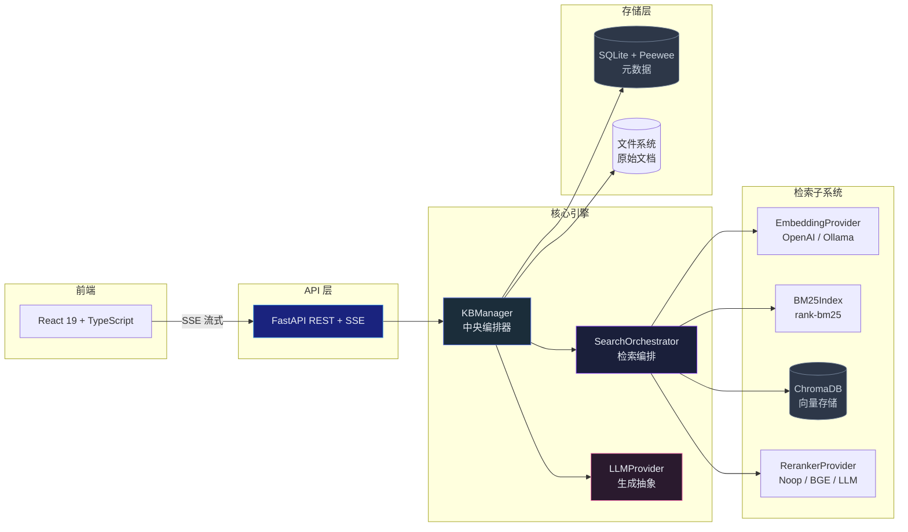
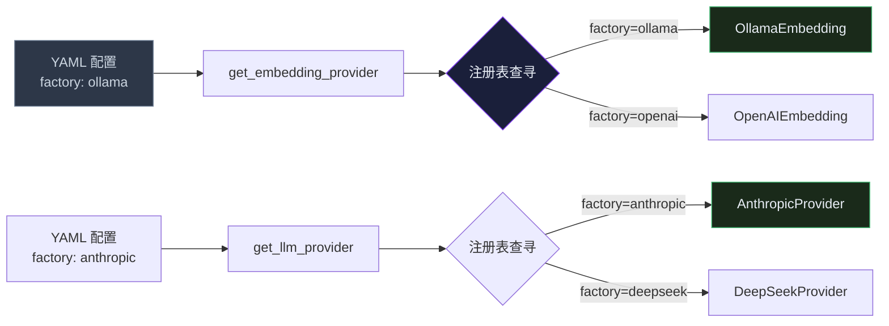
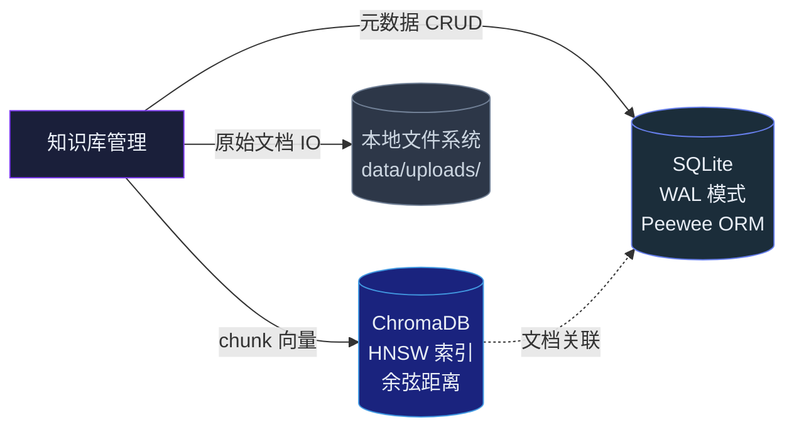
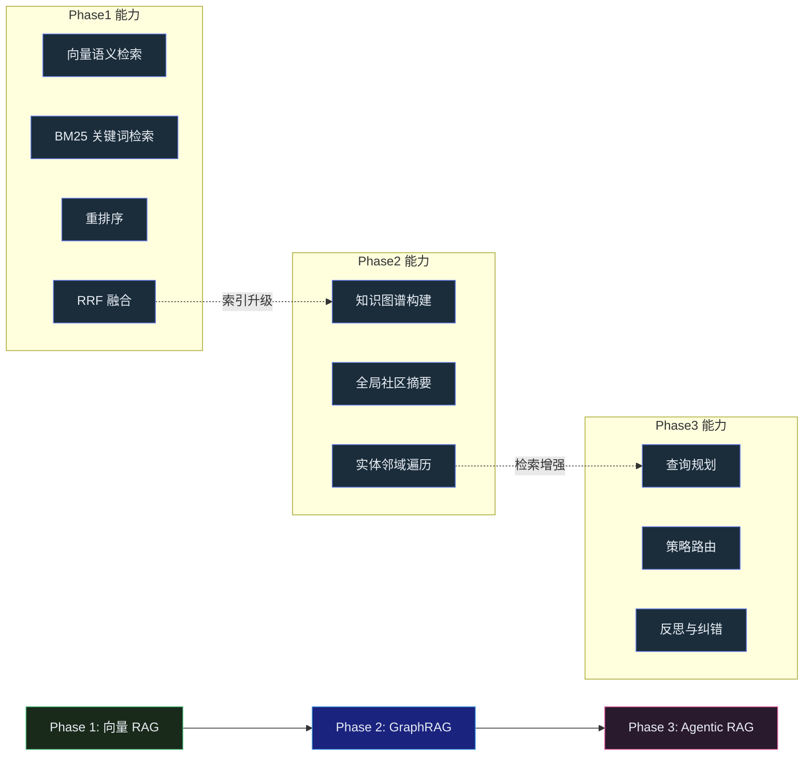

## 引言

前两篇文章分别梳理了 RAG 的技术演进全景<cite>[1]</cite>和核心检索引擎的实现细节<cite>[2]</cite>。本篇文章将从工程化视角出发，以 CazzKB（<https://github.com/YangCazz/CazzKB>）的完整架构为蓝本，讨论如何将 RAG 组件组装为一个可部署、可配置、可扩展的生产级系统。

我们将覆盖六个关键主题：整体架构设计、配置管理、Provider 抽象模式、流式响应、存储架构，以及从向量 RAG 到 GraphRAG 的扩展路径。

---

## CazzKB 的整体架构

CazzKB 是一个轻量级、自托管的个人知识库聊天助手。它的设计哲学是：**零外部服务依赖、配置驱动、Provider 可替换**。



### 技术栈选择的原则

| 组件 | 选择 | 替代方案 | 选择理由 |
|---|---|---|---|
| Web 框架 | FastAPI | Flask / Litestar | 原生 async、自动 OpenAPI、SSE 支持 |
| 向量数据库 | ChromaDB | Qdrant / Milvus | 嵌入式运行，零外部依赖 |
| 元数据存储 | SQLite + Peewee | PostgreSQL + SQLAlchemy | 轻量，单用户场景足够 |
| 嵌入模型 | BGE-M3 (1024d) | OpenAI (1536d) | 本地运行，零成本 |
| 前端 | React 19 + Vite | Next.js / Svelte | 最小化工具链，快速迭代 |
| ORM | Peewee | SQLAlchemy | 更轻量，SQLite 场景足够 |

核心原则：**每个选择都最小化外部依赖**。对个人知识库场景而言，不需要 Kubernetes、不需要 Docker Compose、不需要外部数据库——一个 Python 进程就能运行完整的 RAG 系统。

---

## 配置驱动的系统设计

CazzKB 的配置系统是整个架构的基石。它解决了一个关键问题：**如何让 RAG 系统的每个组件都可以在不改代码的情况下替换**。

### 分层配置

```yaml
# config/default.yaml
kb:
  chunk_size: 512
  chunk_overlap: 50
  top_k: 8

embedding:
  factory: ollama          # 切换嵌入提供者只需改这里
  model: bge-m3
  dimension: 1024
  base_url: http://localhost:11434

llm:
  factory: anthropic       # 切换 LLM 提供者只需改这里
  model: deepseek-v4-pro
  base_url: https://api.deepseek.com/anthropic
  max_tokens: 4096

retrieval:
  rrf_k: 60
  dense_weight: 0.7
  candidate_multiplier: 3

reranker:
  factory: none            # 重排序策略：none / bge / llm
  model: BAAI/bge-reranker-v2-m3

storage:
  chroma_path: data/chroma
  db_path: data/cazzkb.db
  upload_path: data/uploads
```

### 环境变量注入

API 密钥绝不写入 YAML 配置文件。配置加载器使用 `${VAR}` 占位符语法，在运行时从 `.env` 中注入：

```python
_VAR_RE = re.compile(r"\$\{(\w+)\}")

def _resolve_env(value: str) -> str:
    def _replacer(m):
        return os.environ.get(m.group(1), "")
    return _VAR_RE.sub(_replacer, value)
```

配置文件中写 `${ANTHROPIC_API_KEY}`，加载时自动替换为真实的密钥。这保证了配置文件可以安全地提交到版本控制，而密钥保留在 `.gitignore` 的 `.env` 中。

### 配置模型

使用 Python `dataclass` 定义类型安全的配置模型：

```python
@dataclass
class AppConfig:
    kb: KBConfig = field(default_factory=KBConfig)
    embedding: EmbeddingConfig = field(default_factory=EmbeddingConfig)
    llm: LLMConfig = field(default_factory=LLMConfig)
    retrieval: RetrievalConfig = field(default_factory=RetrievalConfig)
    reranker: RerankerConfig = field(default_factory=RerankerConfig)
    storage: StorageConfig = field(default_factory=StorageConfig)
```

`dataclass` 比 `TypedDict` 更适合配置场景——它提供默认值、类型检查和 IDE 自动补全，且不依赖运行时类型检查框架（如 Pydantic）。

---

## Provider 工厂模式：让组件可替换

CazzKB 有三类可替换的提供者：嵌入模型、LLM 和重排序器。它们都使用相同的工厂注册模式：



### 注册模式实现

```python
_registry: dict[str, type[LLMProvider]] = {}

def register_llm(cls: type[LLMProvider]) -> type[LLMProvider]:
    if cls._FACTORY_NAME:
        _registry[cls._FACTORY_NAME] = cls
    return cls

@register_llm
class AnthropicProvider(LLMProvider):
    _FACTORY_NAME = "anthropic"

@register_llm
class DeepSeekProvider(LLMProvider):
    _FACTORY_NAME = "deepseek"

def get_llm_provider(factory: str, model: str, **kwargs) -> LLMProvider:
    cls = _registry.get(factory)
    if cls is None:
        raise ValueError(f"Unknown llm factory: {factory}")
    return cls(model=model, **kwargs)
```

`@register_llm` 装饰器在模块加载时自动将类注册到全局字典中。添加新的提供者只需：写一个新类，加一行 `@register_llm`，在配置文件中修改 `factory` 字段。核心代码完全不需要修改。

这种模式借鉴了 Python 生态中 `entry_points` 的设计思想，但更轻量——不需要 `setuptools` 配置，不需要插件安装步骤。对于单一进程内的组件切换场景，装饰器注册是最简洁的方案。

### Anthropic 与 DeepSeek 适配

两个 LLM 提供者展示了 API 差异的适配：

```python
class AnthropicProvider(LLMProvider):
    def chat_stream(self, messages: list[ChatMessage]) -> Iterator[str]:
        system, msgs = self._convert_messages(messages)
        kwargs = {"model": self.model, "max_tokens": self.max_tokens,
                  "messages": msgs}
        if system:
            kwargs["system"] = system  # Anthropic 分离 system 参数
        with self.client.messages.stream(**kwargs) as s:
            for event in s:
                if event.type == "content_block_delta":
                    yield event.delta.text

class DeepSeekProvider(LLMProvider):
    def chat_stream(self, messages: list[ChatMessage]) -> Iterator[str]:
        msgs = [{"role": m.role, "content": m.content} for m in messages]
        # DeepSeek 使用 OpenAI 兼容 API，system 是普通消息
        resp = self.client.chat.completions.create(
            model=self.model, messages=msgs,
            max_tokens=self.max_tokens, stream=True,
        )
        for chunk in resp:
            if chunk.choices[0].delta.content:
                yield chunk.choices[0].delta.content
```

关键差异在 `_convert_messages`——Anthropic API 要求 `system` 作为顶层参数传入，而 OpenAI 兼容 API 将 system 视为普通消息。Provider 在内部适配这些差异，对外暴露统一的 `chat_stream()` 接口。

---

## SSE 流式响应：让用户感知进度

流式响应不仅仅是用户体验的改善，更是 RAG 系统性能的关键设计。

### 延迟的心理学

用户提交查询后的等待过程可以分为三个阶段：

| 阶段 | 操作 | 典型耗时 | 用户感知 |
|---|---|---|---|
| 检索 | 嵌入 + BM25 + RRF + 重排序 | 0.5-1.5s | **无反馈——焦虑期** |
| 首 Token | LLM 处理 context + 开始生成 | 0.5-2s | 看到第一个字——释然 |
| 生成 | 逐 token 输出 | 5-30s | 阅读中——满意 |

如果采用非流式响应，用户需要等待 3-30 秒才能看到任何输出。而流式响应在 1-3 秒内就能呈现首 token，将"等待"转化为"观看"。

### CazzKB 的 SSE 实现

后端使用 FastAPI 的 `StreamingResponse`：

```python
@router.post("/kb/{kb_id}/chat")
async def chat(kb_id: int, req: ChatRequest,
               manager: KBManager = Depends(get_kb_manager)):
    async def event_stream():
        for token in manager.chat(kb_id, req.query, req.conversation_id):
            yield f"data: {json.dumps({'token': token})}\n\n"
        yield f"data: {json.dumps({'done': True})}\n\n"

    return StreamingResponse(event_stream(), media_type="text/event-stream")
```

前端使用 Fetch API 读取 SSE 流：

```typescript
async function streamChat(kbId: number, query: string) {
  const response = await fetch(`/api/kb/${kbId}/chat`, {
    method: "POST",
    body: JSON.stringify({ query }),
  });
  const reader = response.body!.getReader();
  const decoder = new TextDecoder();

  while (true) {
    const { done, value } = await reader.read();
    if (done) break;
    const text = decoder.decode(value);
    for (const line of text.split("\n")) {
      if (line.startsWith("data: ")) {
        const data = JSON.parse(line.slice(6));
        if (data.done) return;
        // 逐字追加到 UI
        appendToken(data.token);
      }
    }
  }
}
```

相比于 WebSocket，SSE 更简单——它是单向的（服务端到客户端），不需要握手协议，不需要心跳维持，代理和防火墙兼容性更好。对于聊天应用的单向流式输出，SSE 是比 WebSocket 更合适的选择。

---

## 三层存储架构

CazzKB 的数据存储设计遵循了"每种数据用最合适的存储"原则：



### 向量存储：ChromaDB

ChromaDB 使用 HNSW 算法构建近似最近邻索引，以余弦距离作为相似度度量。每个知识库对应一个独立的 ChromaDB Collection（命名 `kb_{id}`），删除知识库时可以精确移除对应的向量数据。

选择 ChromaDB 而非 Qdrant 或 Milvus 的核心考量：**嵌入式部署**。ChromaDB 在 Python 进程内运行，使用 SQLite 作为持久化层，不需要独立的服务进程。对于单用户知识库（数千到数万篇文档），ChromaDB 的性能完全够用，而启动成本为零。

### 元数据存储：SQLite + Peewee

五张核心表：

| 表 | 职责 | 关键字段 |
|---|---|---|
| `knowledgebase` | 知识库基本信息 | name, description, chunk_count |
| `document` | 文档级别元数据 | filename, title, source_date, categories, tags |
| `chunk` | 分块内容与上下文 | content, header_path, element_type, metadata_json |
| `conversation` | 对话会话 | title, kb_id |
| `message` | 对话消息 | role, content, sources_json |

采用 WAL（Write-Ahead Logging）日志模式，读写不互斥。单用户场景下 WAL 模式足够，不需要更复杂的事务隔离级别。

`metadata_json` 列存储了 chunk 的完整元数据（前后 chunk ID、来源标签等），采用 JSON 字符串而非结构化列。这样做的好处是 Schema 变更灵活——添加新元数据字段不需要迁移数据库。

### 批量摄入优化

CazzKB 针对博客场景提供了批量摄入脚本（`scripts/ingest_blog.py`），将所有 Jekyll 博客文章一次性导入知识库。关键优化：**延迟 BM25 索引构建**。

```python
# 伪代码：批量摄入流程
for md_file in sorted(glob("_posts/*.md")):
    chunks = chunker.chunk(contents, filename)
    db.insert(chunks)           # 写入 SQLite
    chroma.add(embeddings)      # 写入 ChromaDB
    bm25_index.add(chunks)      # 加入 BM25 队列

bm25_index.build()              # 所有文档摄入完成后一次性构建
```

BM25 索引重建的计算复杂度与文档总数成正比。如果每摄入一篇文档就重建一次（摄入 N 篇文档需要 $O(N^2)$ 的时间），在 70+ 篇博客的场景下会有明显延迟。延迟到全部摄入后一次性重建，复杂度降为 $O(N)$。

---

## 评估体系：RAG 质量的不可能三角

将 RAG 系统部署到生产环境之前，需要回答三个问题：检索是否准确、生成是否忠实、答案是否有用。这三个维度构成了 RAG 质量的权衡空间。

### RAGAS 评估框架

RAGAS 是当前最流行的 RAG 自动评估框架<cite>[3]</cite>，定义了四个核心指标：

| 指标 | 评估对象 | 计算方法 |
|---|---|---|
| **Context Precision** | 检索质量 | 相关文档在检索结果中的排名位置 |
| **Context Recall** | 检索覆盖率 | 答案所需的信息是否被检索到 |
| **Faithfulness** | 生成忠实度 | 答案中的每个声明是否在检索文档中有依据 |
| **Answer Relevancy** | 答案相关性 | 答案是否直接解决了用户的问题 |

### 评估驱动选型

CazzKB 中重排序器的选择本质上是一个质量-成本-延迟的权衡问题：

| 重排序器 | 质量 | 延迟 | 成本 | 适用场景 |
|---|---|---|---|---|
| Noop | 基准线 | 0ms | 0 | 开发调试、低资源环境 |
| BGE | 中等提升 | ~500ms | 显存占用 | **生产默认** |
| LLM | 最高 | ~2-5s | API 调用费 | 高价值查询、最终精排 |

在实际使用中，建议以 BGE Reranker 作为日常默认，在遇到检索质量明显不足的查询时，可开启 LLMReranker。这种"分级重排序"策略在成本和效果之间取得了平衡。

### 人是最终的评估者

自动评估只能捕捉可量化的信号，但无法替代人的判断——"这个答案有没有真正帮助到我"只有提问者自己知道。CazzKB 的会话管理和引用溯源机制将评估粒度从"整段回答好不好"细化到"哪个来源的哪段话被用了"，为持续优化检索和分块策略提供了可追溯的数据。

---

## 从向量 RAG 到 GraphRAG：扩展路径

CazzKB 的 Phase 1 完成了向量 RAG 的完整实现。Phase 2 规划引入 GraphRAG，Phase 3 规划 Agentic RAG。这个扩展路径反映了 RAG 系统演进的一般规律。

### GraphRAG 的价值与成本

Microsoft GraphRAG<cite>[4]</cite> 的核心优势在于跨文档推理和全局总结。但它的索引成本也相当高——每 100 万 token 需要 4-6 次 LLM 调用来抽取实体和关系，使用 Llama 3.1 70B 模型时成本约 $2.5-3.6。



### 何时需要升级

不是所有场景都需要 GraphRAG。以下信号表明你应该考虑引入图结构：

- **多跳查询频繁**：用户经常问"某方法与某方法的共同点是什么"
- **全局总结需求**：用户经常要求对整个知识库做宏观概括
- **实体关系复杂**：知识库中的实体（人物、技术、概念）之间有密集的交叉引用
- **跨文档推理**：答案需要从多篇文档中抽取和拼接信息

如果用户的查询主要是"某概念的定义是什么""某配置怎么写"——向量 RAG 已经足够好了。

### CazzKB 的扩展架构

CazzKB 的 Provider 抽象模式天然支持 GraphRAG 扩展。新增一个 `GraphRetriever` 提供者，与现有的向量检索和 BM25 检索在 RRF 融合层并行工作：

```python
# Phase 2 规划：在 SearchOrchestrator 中扩展
def search(self, kb_id: str, query: str) -> list[SearchResult]:
    dense = self._dense_search(kb_id, query)
    sparse = self._sparse_search(kb_id, query)
    graph = self._graph_search(kb_id, query) if self.graph_enabled else []
    return reciprocal_rank_fusion(dense, sparse, graph)
```

Agentic RAG（Phase 3）则更进一步——不是固定地融合所有检索结果，而是让 LLM 作为 Agent，自主判断当前查询需要哪种检索策略，需要多少轮检索，以及何时答案充分可以停止检索。

这种分阶段演进的方式降低了复杂系统的开发风险：先在 Phase 1 验证核心流水线的正确性，再逐步引入更复杂的检索能力。

---

## 总结

本文以 CazzKB 为蓝本，讨论了 RAG 系统工程化的六个核心主题：

1. **整体架构**：FastAPI + ChromaDB + SQLite 的最小化外部依赖技术栈，通过中央编排器（KBManager）协调检索、生成和存储三个子系统。

2. **配置管理**：YAML 驱动的分层配置 + `${VAR}` 环境变量注入，保证配置的可版本控制性和密钥的安全性。

3. **Provider 工厂模式**：装饰器自动注册 + 字典查找，实现嵌入模型、LLM 和重排序器的无缝切换，同时适配不同 API（Anthropic / OpenAI 兼容）的差异。

4. **SSE 流式响应**：使用 Server-Sent Events 实现低成本的服务端推送，将用户等待转化为观看体验。

5. **三层存储**：ChromaDB 存向量、SQLite 存元数据、文件系统存原始文档，每种数据用最合适的存储引擎。

6. **扩展路径**：从向量 RAG（Phase 1）到 GraphRAG（Phase 2）到 Agentic RAG（Phase 3）的分阶段演进，避免过度工程化。

RAG 系统的工程化核心不在于堆砌技术组件，而在于**让每个组件在正确的位置发挥正确的作用，并通过清晰的抽象边界保证系统的可演进行**。

---

## 参考文献

1. Yang Qianjun. *RAG 技术演进全景：从朴素检索到智能体驱动.* YangCazz Blog, 2026.  
   <https://yangcazz.github.io>
2. Yang Qianjun. *RAG 核心引擎深度解析：分块、混合检索引擎与重排序.* YangCazz Blog, 2026.  
   <https://yangcazz.github.io>
3. *RAGAS: Automated Evaluation of Retrieval Augmented Generation.* Es S, et al. arXiv, 2024.  
   <https://arxiv.org/abs/2309.15217> · 代码仓库：<https://github.com/explodinggradients/ragas>
4. *GraphRAG: Unlocking LLM Discovery on Narrative Private Data.* Edge D, et al. Microsoft Research, 2024.  
   <https://arxiv.org/abs/2404.16130> · 代码仓库：<https://github.com/microsoft/graphrag>
{: .references }
