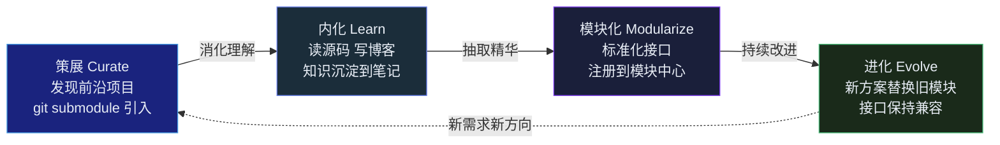
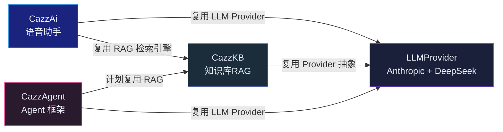

## 引言

过去三年，我在医疗手术机器人领域持续产出：10+ 篇深度学习经典论文解读、8 篇 GNN 原理与实战、8 篇医学图像分割全系列、8 篇目标检测、3 篇 Mamba/SSM 架构分析、13 篇 AI Agent 从零构建。加上最近完成的 3 篇 RAG 技术全景和 1 篇 CazzKB 升级实录，博客总字数超过 30 万。

同时，我维护着 9 个自研开源项目，横跨医学影像（CT 分割、内窥镜识别）、AI 基础设施（语音助手、知识库 RAG、Agent 框架）、物理 AI（3D 打印体膜）、开发者工具（专利撰写 Agent）和兴趣探索（量化交易）。

**问题不在于找不到学习资源——问题在于信息过量导致的知识碎片化。** 读完一篇论文，看完一个开源项目，如果不去主动做结构化的工作，这些知识就像沙滩上的脚印，下一波浪潮来时什么也不剩。

我把解决这个问题的过程沉淀为一套方法论。它不挑领域、不依赖具体工具，核心是四个步骤的循环。

---

## Meta-Loop：四步循环



每一步有具体的输入、操作和产出，不是空洞的流程口号。

| 步骤 | 输入 | 操作 | 产出 |
|---|---|---|---|
| **策展** | GitHub trending / Paper / Hacker News | 克隆 → 跑通 demo → 填评估表 | curated/ 目录，待内化队列 |
| **内化** | curated/ 中的项目源码 | 读源码 → 写博客 → 记笔记 | 博客文章 + learning-notes/ |
| **模块化** | 博客 + 学习笔记 | 抽取核心逻辑 → 标准化接口 → 注册 | module-registry/ 中的可复用模块 |
| **进化** | 新 paper / 新框架 | 替换旧模块 → 保持接口兼容 → 更新文档 | 升级后的模块，版本记录 |

下文逐一展开每一步的操作细节、踩过的坑，以及选型理由。

---

## 策展：不做重复造轮子的第一步

大多数工程师看到一个感兴趣的项目，做法是 Star — 然后忘掉。策展要解决的问题就是"Star → Never Read"的循环。

### 策展标准

不是每个 GitHub 仓库都值得策展。我设了六个评估维度：

| 维度 | 权重 | 检查点 |
|---|---|---|
| 技术前沿性 | 高 | 是不是当前 SOTA？有无独特创新？ |
| 代码可跑通 | 高 | 从克隆到跑通 demo 要多长时间？ |
| 模块可抽取 | 高 | 核心逻辑能否独立抽取为一个模块？ |
| 文档质量 | 中 | README / Wiki / 注释完善度 |
| 社区活跃度 | 中 | Star 数 / Issue 响应速度 / 更新频率 |
| 与主航道关联 | 高 | 对核心技术方向的关联度 |

**"代码可跑通"和"模块可抽取"是硬门槛。** 一个论文很漂亮但代码跑不通的项目，策展价值为零。一个功能完整但核心逻辑与 UI/配置强耦合的项目，抽取成本高到不值得。

### 策展载体

```bash
# 以 git submodule 引入，保持与上游的更新能力
git submodule add https://github.com/xxx/yyy.git curated/yyy

# 填写评估记录
curated/yyy-eval.md
```

子模块的好处：保持与上游仓库的连接，可以追踪更新；不污染主仓库的提交历史；删除只需 `git submodule deinit`。

### 案例：CazzSegmentator

`CazzSegmentator` 是一个腹部/胸部 CT 多器官自动分割框架。它策展了三个上游项目：

- **nnUNet**：自适应医学分割框架，数据预处理和训练管线成熟
- **TotalSegmentator**：全身 CT 分割模型，覆盖 100+ 结构
- **CADS**：腹部器官分割的特定优化

策展后做的事：不自己重新训练基础模型，而是写一个**模型调度层**——统一这几个上游模型的 API，自动处理依赖关系和去重，用 ROI 裁剪降低显存需求。最终这不是一个"缝合怪"，而是一个有明确技术增量的独立项目。

策展的核心价值不是"抄代码"，而是**在别人已经很擅长的事情上不浪费时间，把精力集中在拼图之间的缝隙**。

---

## 内化：写过才是真学会

策展进来的是别人的代码。内化要做的是把它变成自己的理解。

### 三层内化

| 层次 | 形式 | 深度 | 载体 |
|---|---|---|---|
| 笔记 | 源码阅读记录、算法推导 | 浅，但覆盖广 | `knowledge/learning-notes/` |
| 博客 | 从原理到实现到对比 | 深，结构化输出 | `yangcazz.github.io` |
| 代码 | 亲手实现一次核心逻辑 | 最深，肌肉记忆 | 模块化产物 |

**笔记是给自己看的，博客是给未来的自己看的。** 三个月后你回去翻笔记，大概率看不懂当时的速记。但一篇结构化的博客文章能让你在 5 分钟内重新进入当时的思考状态。

这也是为什么我在写博客这件事上投入了大量时间——不是为了流量，而是为了**对抗遗忘**。

### 案例：RAG 系列的内化路径

我最近完成的 RAG 系列是一个完整的内化案例：

1. **策展**：克隆 RAGFlow、LlamaIndex、AnythingLLM 到 `ref/`，跑通 demo
2. **笔记**：对比三者的分块策略、检索架构、Prompt 设计
3. **动手**：实现 CazzKB——一个从零写的 RAG 系统，语义分块 + BM25 + RRF 融合 + BGE 重排序
4. **博客输出**：三篇文章覆盖 RAG 演进史、核心技术栈、工程化实战

经过这一轮，RAG 从"一个知道大概原理的技术名词"变成了"知道每个环节有什么坑、有什么选择、优化的边界在哪"的领域知识。

**写完一个系列，你对这个领域的理解就不一样了。** 这不是玄学——写作迫使你把模糊的直觉转化为精确的表述，而精确是理解的前提。

---

## 模块化：让能力可复用

内化完成后，知识在脑子里，但代码还在不同的项目里散落。模块化的目标是把可复用的逻辑抽取出来，形成标准化的接口。

### 模块注册中心

`knowledge/module-registry/` 存放每个模块的接口定义和依赖关系。一个模块的注册信息：

```yaml
name: hybrid-retrieval
domain: RAG
interface:
  search: (query: str, top_k: int) -> list[SearchResult]
  index: (chunks: list[Chunk]) -> None
dependencies:
  - chroma-vector-store
  - bm25-sparse-index
  - rrf-fusion
consumers:
  - cazz-kb
  - cazz-ai
version: 1.0.0
```

这个注册表的价值在于：**当你要在新项目里复用某个能力时，不需要翻代码回忆接口——看一眼注册表就够了。**

### 模块化的判据

不是所有代码都值得模块化。判断标准：**这个逻辑在未来 6 个月内是否可能被另一个项目用到？**

- 数据预处理管线：大概率可以被新的分割任务复用 → 模块化
- 某个实验的特定超参搜索脚本：几乎不会复用 → 不模块化
- Embedding Provider 抽象：肯定会被新的 LLM 应用复用 → 模块化

过早模块化是过度工程，该模块化时不模块化是技术债务。

### 案例：CazzAi → CazzKB 的复用



`CazzAi` 的语音助手需要 RAG 能力来回答用户问题。但 `CazzAi` 不应该自己实现一套检索引擎——`CazzKB` 已经把这件事做透了。同理，`CazzAgent` 框架也需要 LLM Provider 抽象和知识检索能力。

**这就是模块化的核心价值：解决一次，到处复用。** 每一个新项目的启动成本都在下降——因为越来越多的能力已经是"拿来即用"的模块。

为了维持这种复用关系，建立了一个 Docker 8 服务的编排文件 (`docker-compose.yml`)，按 profile 分组（medical / platform / tools），一键启动需要的服务组合。端口通过 `ports.json` 集中管理，避免冲突。

---

## 进化：持续替换的底线是接口稳定

技术世界不会停。新论文、新框架、新范式每天都在涌现。Meta-Loop 的最后一步——进化——回答一个问题：**当更好的方案出现时，如何替换旧模块而不伤筋动骨？**

答案是：**模块化时定义的接口就是进化的契约。** 只要接口不变，内部实现可以随意替换。

### 实际替换案例

| 时间 | 模块 | 旧方案 | 新方案 | 接口变更 |
|---|---|---|---|---|
| 2026.05 | Embedding Provider | OpenAI text-embedding-3-small | Ollama bge-m3 | 无——改一行 YAML 配置 |
| 2026.05 | LLM Provider | OpenAI API | DeepSeek Anthropic 兼容端点 | 无——Provider 工厂自动适配 |
| 2026.06 | Reranker | Noop 透传 | BGE Cross-Encoder | 无——`reranker.factory: bge` |

三次替换都是**改一行配置**完成的。这是因为每个模块都定义在 Provider 接口后——消费者不关心谁提供服务，只关心接口契约。

### 进化的节奏

不是在每次新论文出来时立刻追新。策略是**定期扫描 + 按需替换**：

- 每季度扫一遍 `curated/` 中子模块的上游更新
- 有实质性的性能/功能提升时才启动替换
- 替换前在独立分支跑完整测试套件
- 替换后更新 `module-registry/` 的版本记录

这套节奏避免了"永远在追新但什么都没完成"的陷阱。策展和模块化之间的时间差，正是内化发生的地方。

---

## 总结

Meta-Loop 不是什么宏大理论——它是我在同时维护 9 个 AI 项目的过程中，被碎片化和重复造轮子逼出来的生存策略。

它的核心假设只有一个：**知识是资产，需要主动管理。** 不管理，信息过载；过度管理，浪费时间。四步循环——策展（找到好的）、内化（学成自己的）、模块化（做成通用的）、进化（保持新的）——是在这两个极端之间找到的平衡点。

这套方法不挑领域。你做的是 NLP、计算机视觉、自动驾驶还是量化交易，都一样适用。你不需要一次建好全部基础设施——从策展开始，从第一个项目开始，从第一篇博客开始。循环会自己转起来。

## 参考文献

1. *CazzKB — 个人知识库聊天助手.* YangCazz, 2026.  
   <https://github.com/YangCazz/CazzKB> · 代码仓库
2. *CazzTech — AI for Surgical Robotics.* YangCazz, 2026.  
   <https://github.com/YangCazz> · 项目矩阵
3. *Building a Second Brain.* Forte T. Atria Books, 2022.  
   <https://www.buildingasecondbrain.com/>
4. *How to Build a Personal Knowledge Management System.* Shu Omi. 2023.  
   <https://medium.com/@oshu>
{: .references }
