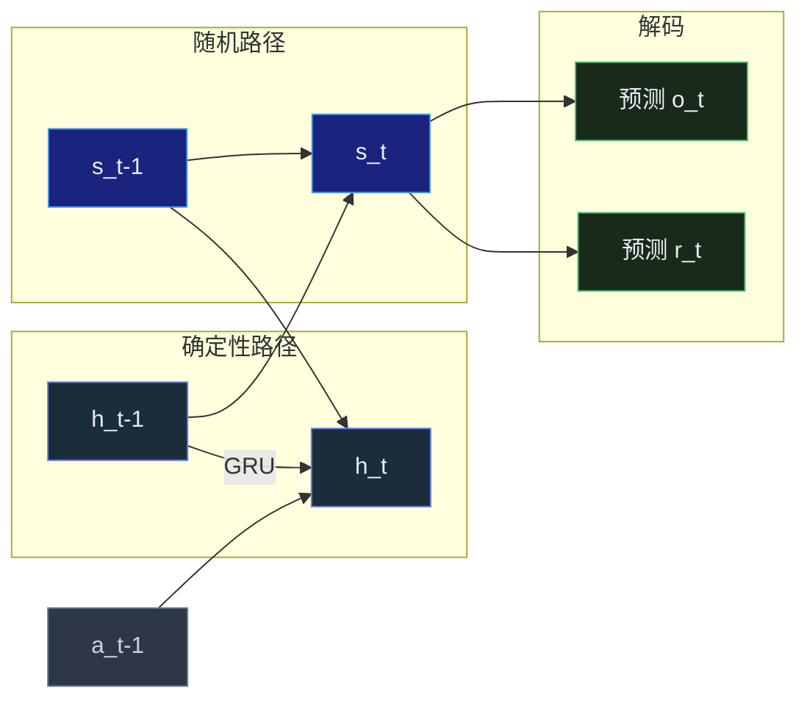
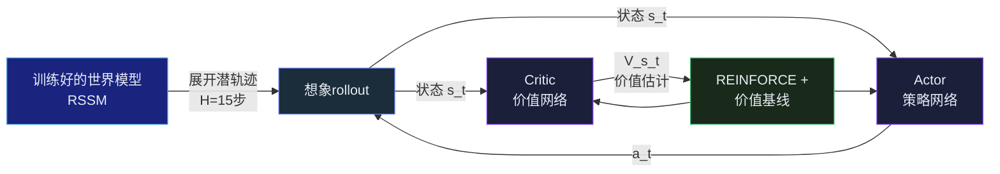
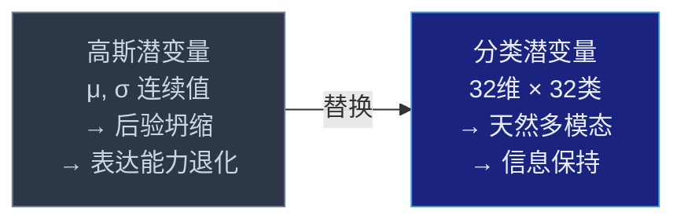
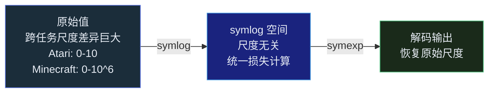



## 引言

2018 年，David Ha 和 Jurgen Schmidhuber 发表了一篇改变模型-based RL 方向的论文<cite>[1]</cite>。它的核心思想出奇地简单：**让智能体先学一个世界的压缩模型，然后在这个"梦境"里训练策略，而不是在真实环境中反复试错。**

这在今天看来理所当然，但在当时——深度强化学习还被 A3C、PPO 等 model-free 方法主导的年代——这是一个激进的转向。

此后五年，Danijar Hafner 领导的 Dreamer 系列将这一思路推向极致：DreamerV1 首次实现了在潜空间想象中学习策略<cite>[3]</cite>，DreamerV2 用离散潜变量征服了 55 款 Atari 游戏<cite>[4]</cite>，DreamerV3 则用一套固定超参数同时在 Atari、DeepMind Lab、Minecraft 和真实机器人上取得顶尖表现<cite>[5]</cite>。

本文的目标是从底层原理出发，逐层拆解这段技术演进的核心逻辑——不是简单的论文罗列，而是回答一个问题：**这些版本之间的每一次升级，到底解决了什么此前无法解决的问题？**

---

## World Models (2018)：三段式架构的诞生

Ha & Schmidhuber 的 World Models 论文提出了一个三段式架构，这三个组件的分工如此清晰，以至于成为了后续所有工作的概念框架。


### V (Vision)：将世界压缩为潜变量

智能体面对的原始观测是 64×64×3 的 RGB 图像。这是一个极其高维的空间——如果直接在这个空间里建模动态规律，计算量和样本需求都是灾难性的。

解决思路：用 VAE 将图像压缩为低维潜表示 $z_t$。具体来说：

- **编码器**将 $64 \times 64 \times 3 = 12,288$ 维的观测压缩为 32 维的潜变量 $z_t$
- **解码器**从 $z_t$ 重建图像，训练目标是最小化重建误差 + KL 正则项：

$$
\mathcal{L}_{VAE} = \mathbb{E}_{q(z|x)}[\log p(x|z)] - \beta \cdot D_{KL}(q(z|x) \| p(z))
$$

这个 VAE 的训练方式有一个巧妙的细节：**不是每一帧都编码**。论文中使用 4 个历史帧堆叠作为输入，让潜变量 $z_t$ 编码的不只是一帧的静态信息，还包含短时的运动线索。

关键收获是：$z_t$ 不再是一张图像的压缩，而是**对当前时刻"世界状态"的一个紧凑编码**。

### M (Memory)：学习世界的动态规律

有了 $z_t$，下一步是学习世界如何随时间演化。

M 组件是一个 MDN-RNN（混合密度网络 + 循环神经网络）：输入当前潜状态 $z_t$、动作 $a_t$ 和隐状态 $h_t$，输出下一时刻潜状态的概率分布 $P(z_{t+1} \mid z_t, a_t, h_t)$。

为什么是混合密度网络而不是简单的均方误差？因为世界的动态本质上是多模态的——从同一个状态采取同一个动作，可能产生完全不同的结果。高斯混合模型可以捕获这种分布的多峰性：

$$
P(z_{t+1} \mid z_t, a_t, h_t) = \sum_{k=1}^{K} \pi_k(z_t, a_t, h_t) \cdot \mathcal{N}(z_{t+1} \mid \mu_k, \sigma_k^2)
$$

其中 $\pi_k$ 是第 $k$ 个高斯分量的混合系数，$\mu_k$ 和 $\sigma_k^2$ 是其均值和方差。MDN-RNN 同时预测这些参数——混合系数决定各"未来走向"的权重，均值决定最可能的演化方向，方差决定不确定性。

### C (Controller)：在梦境中训练策略

第三部分是最反直觉的：**Controller 完全在 M 组件生成的"梦境"中训练，从未接触真实环境。**

Controller 是一个简单的线性模型：

$$
a_t = W_c \cdot [z_t, h_t]
$$

其中 $[z_t, h_t]$ 是潜变量和 RNN 隐状态的拼接，$W_c$ 是要学习的权重矩阵。

训练方法不是梯度下降，而是 **CMA-ES（协方差矩阵自适应进化策略）**：在 $W_c$ 的分布中采样一批参数，在梦境中 rollout，按累计奖励选择最优的参数，用这批参数更新采样分布的均值和协方差。

为什么是进化算法而不是反向传播？因为从奖励信号到 $W_c$ 的梯度路径很长（经过多次 RNN unrolling），梯度方差太大。CMA-ES 直接利用黑箱奖励信号，避免了梯度估计的不稳定性。

实验结果令人振奋：在 CarRacing-v0 中，Controller 在梦境中训练后，直接部署到真实环境就能流畅驾驶。在 VizDoom 的 TakeCover 任务中，它学会了躲避火球——这些行为**从未在真实环境中被"教"过**。

| 组件 | 作用 | 输入 | 输出 | 训练方式 |
|---|---|---|---|---|
| **Vision (V)** | 压缩观测 | 64×64×3 图像 | 32-dim $z_t$ | VAE 重建误差 + KL 正则 |
| **Memory (M)** | 预测动态 | $z_t, a_t, h_{t-1}$ | $P(z_{t+1})$ | 最大似然估计 |
| **Controller (C)** | 选择动作 | $z_t, h_t$ | $a_t \in \mathbb{R}^3$ | CMA-ES 进化策略 |

### 局限

尽管概念优雅，World Models 有三个关键局限：

1. **VAE 重建模糊**：GAN 压缩率更好，但训练更困难。模糊重建意味着 $z_t$ 丢失了细粒度视觉信息。
2. **MDN-RNN 长时预测退化**：RNN 的误差随 rollout 步数指数级累积。梦境越长，世界模型越不可靠。
3. **线性 Controller 表达能力有限**：CMA-ES 只优化 $W_c$，无法学习需要复杂非线性决策的策略。

这些局限正是后续工作的出发点。

---

## PlaNet (2019)：RSSM 的诞生

2019 年，Danijar Hafner 等人提出了 PlaNet<cite>[2]</cite>。这篇论文的核心贡献只有一个，但它是后续所有 Dreamer 工作的基石：**Recurrent State Space Model（RSSM）**。

### 为什么纯 RNN 或纯随机模型都不够

World Models 的 M 组件包含两个部分：一个确定性的 RNN（$h_t$）和一个随机的 MDN（预测 $z_t$）。但它们在架构上是分离的，没有形成统一的世界状态。

PlaNet 的洞察是：

- **纯确定性的 RNN** 擅长记忆——梯度通过时间反向传播可以学习长程依赖。但纯 RNN 难以建模多模态未来：如果从状态 A 做动作 B，有 50% 概率到状态 C、50% 概率到状态 D，RNN 只能输出一个平均值。
- **纯随机的潜变量模型**（如 VAE 抽 $z_t$）天然适合表达多模态分布。但独立的随机变量 $z_t$ 缺乏时间结构的显式编码：$z_t$ 和 $z_{t+1}$ 之间没有直接的结构化连接。

RSSM 的解决方案：**同时维护确定性和随机性两条路径，让它们在每一个时间步交互。**

### RSSM 架构



RSSM 的数学定义简洁但信息密度极高：

**确定性状态**（GRU 更新）：
$$
h_t = f_{\text{GRU}}(h_{t-1}, s_{t-1}, a_{t-1})
$$

**随机状态**（从先验分布采样）：
$$
s_t \sim p(s_t \mid h_t)
$$

**后验状态**（引入观测信息后修正）：
$$
s_t \sim q(s_t \mid h_t, o_t)
$$

训练时使用后验分布（因为有真实观测 $o_t$）；规划/想象时使用先验分布（因为没有观测，只能靠世界模型自己预测）。

训练目标包括图像重建损失和 KL 散度：

$$
\mathcal{L} = \underbrace{-\ln p(o_t \mid h_t, s_t)}_{\text{图像重建}} + \beta \cdot \underbrace{D_{KL}\big(q(s_t \mid h_t, o_t) \parallel p(s_t \mid h_t)\big)}_{\text{潜动态正则化}}
$$

这个损失函数值得仔细品味。第一项驱动潜变量编码足够的视觉信息来重建观测——没有它，模型可以把所有图像映射到同一个无意义的 $s_t$。第二项——KL 约束——驱动先验分布（没有观测时模型的预测）接近后验分布（有观测时的最优估计）。也就是说，它迫使模型**在没有观测的情况下也能做出准确的预测**。

PlaNet 用 CEM（交叉熵方法）做规划：在潜空间采样 N 条候选动作序列，用 RSSM 模拟每条序列的结果，选累计奖励最高的执行。

| 对比维度 | World Models | PlaNet |
|---|---|---|
| **时序建模** | MDN-RNN（单一随机模型） | RSSM（确定+随机双路径） |
| **状态粒度** | $z_t$（仅压缩当前帧） | $h_t + s_t$（历史上下文+当前不确定性） |
| **行为策略** | CMA-ES 进化（离线训练） | CEM 规划（在线规划） |
| **多模态** | MDN 混合高斯 | RSSM 随机状态天然支持 |
| **长程依赖** | RNN 隐状态 | GRU 确定性路径 |

---

## DreamerV1 (2020)：在想象中学习策略

PlaNet 在每一步都要跑 CEM 规划——在潜空间采样、模拟、评估，计算成本高。DreamerV1<cite>[3]</cite> 的核心想法是：**与其每次行动前都规划，不如在想象中训练一个策略网络，让它学会"凭直觉"决策。**

### 想象学习 (Learning by Imagination)

整个流程分为两步：

**第一步：训练世界模型。** 与 PlaNet 相同，用 RSSM 学习环境的潜动态——从观测 $o_t$ 到潜状态 $s_t$ 的编码，以及 $s_t$ 在动作 $a_t$ 下的转移规律。

**第二步：在想象中训练 Actor-Critic。** 这是 DreamerV1 的核心创新：



想象 rollout 的过程：从当前状态 $s_t$ 开始，Actor 输出一个动作 $a_t$，世界模型预测下一个状态 $s_{t+1}$ 和即时奖励 $r_t$，如此重复 $H = 15$ 步。每条想象轨迹产生一系列状态-动作-奖励三元组。

Critic 负责估计每个状态的价值 $V(s_t)$——该状态未来累计奖励的期望。训练目标是让 Critic 的估计尽可能接近实际 rollout 中的累计奖励。

有了 Critic 提供的价值基线，Actor 用 REINFORCE 风格的策略梯度来更新：

$$
\mathcal{L}_{\text{actor}} = -\mathbb{E}\left[ \sum_{t} \log \pi(a_t \mid s_t) \cdot \big(R_t - V(s_t)\big) \right]
$$

其中 $R_t$ 是从时刻 $t$ 开始的累计奖励，$V(s_t)$ 是 Critic 的价值估计。$R_t - V(s_t)$ 是优势函数——当动作产生的奖励高于预期时为正，低于预期时为负。乘以 $\log \pi$ 的梯度方向，Actor 被驱动去增加高优势动作的概率，降低低优势动作的概率。

在一个完整的 rollout 中，只有世界模型在做计算——想象环境中没有昂贵的渲染管线，没有物理模拟器，只有潜空间中的前向传播。这使得 DreamerV1 的样本效率远超 model-free 方法：**从真实环境中获取一个样本，就能在想象中生成数十个变体。**

---

## DreamerV2 (2021)：离散潜变量的崛起

DreamerV1 使用高斯分布的潜变量 $s_t$。DreamerV2<cite>[4]</cite> 发现了一个深刻的问题：**高斯潜变量在 RSSM 中倾向于"后验坍缩"——后验分布 $q(s_t \mid h_t, o_t)$ 变得与先验分布 $p(s_t \mid h_t)$ 几乎相同。**

### 后验坍缩问题

为什么会坍缩？因为 KL 正则项 $\beta \cdot D_{KL}(q \parallel p)$ 天然惩罚后验偏离先验。当 $\beta$ 不够大时（RL 场景下通常不能太大，否则模型不学习），模型发现"把后验拉近先验"比"学习更有信息量的潜变量"更容易优化。

而且，高斯分布的熵是 $\frac{1}{2} \log(2\pi e \sigma^2)$。模型可以通过降低 $\sigma$ 来降低熵，使得潜变量极端集中，丧失表达能力。

坍缩的结果是潜变量 $s_t$ 退化——它不再编码任何关于真实环境的信息。此时 RSSM 退化为一个普通的 GRU，世界模型失去了表达多模态不确定性的能力。

### 分类潜变量：根本性的解决

DreamerV2 的解决方案：**将每个随机维度从高斯变量替换为分类变量（categorical）。**

具体来说，$s_t$ 不是从 $\mathcal{N}(\mu, \sigma^2)$ 采样，而是从 32 个分类中每个选择一个类别（共 32 个维度，每个维度有 32 个类别，理论上可表示 $32^{32}$ 种不同的世界状态）：

$$
s_t \sim \text{Categorical}(\text{logits} = f(h_t))
$$

梯度通过 straight-through estimator 传播——前向传播使用 one-hot 采样，反向传播使用 softmax 近似的梯度。



分类潜变量天然免疫后验坍缩：分类分布的熵为 $-\sum_i p_i \log p_i$，均匀分布时熵最大。模型无法通过单一策略降低熵来简化优化——每个类别要么被平等使用（高熵，高信息量），要么被有效忽略（低熵，稀疏编码）。没有连续变量的"方差坍缩"捷径。

此外，DreamerV2 引入 KL balancing：先验分布的 KL 损失权重与后验分开，先验用更大的学习率去追赶后验，后验用更小的学习率防止被拉平：

$$
\mathcal{L}_{KL} = \alpha \cdot D_{KL}(q \parallel \text{sg}(p)) + (1 - \alpha) \cdot D_{KL}(\text{sg}(q) \parallel p)
$$

其中 $\text{sg}(\cdot)$ 是 stop-gradient 操作。$\alpha > 0.5$ 时，先验被鼓励去匹配后验，而非相反。

结果是惊人的：**DreamerV2 用单个 GPU 在 55 款 Atari 游戏中达到人类水平**——中位数人类归一化得分超过 100%。同时，它的数据效率是 model-free 方法的数十倍。

---

## DreamerV3 (2023)：一套参数统治所有领域

如果说 DreamerV1-V2 的进步是"工程优化"级别的，DreamerV3<cite>[5]</cite> 的野心则完全不同：**让同一个算法、同一套超参数，不做任何调整，在 Atari 100k、DeepMind Lab、Minecraft 和四足机器人上全部达到 SOTA。**

这听起来不太可能。Atari 是 2D 游戏，DeepMind Lab 是 3D 迷宫，Minecraft 是开放的沙盒世界，机器人是连续物理环境。它们的奖励尺度、图像分辨率、任务周期完全不同。一个方法如何适应所有这些？

### symlog 预测：一个使尺度无关的损失函数

DreamerV3 最核心的创新是一个看似微小的数学变换。

在传统方法中，世界模型预测下一个观测和奖励的像素值。但不同环境的像素强度和奖励值差异巨大——Atari 的奖励通常是 0 到 10，DeepMind Lab 的奖励可以到几百，Minecraft 的奖励可能跨越多个数量级。这意味着损失函数的尺度被任务决定，迫使每个任务都需要单独调参。

symlog 变换的定义：

$$
\text{symlog}(x) = \text{sign}(x) \cdot \log(|x| + 1)
$$

对正数和负数对称处理，原点附近近似线性（$\text{symlog}(x) \approx x$ 当 $\lvert x\rvert$ 很小），远处压缩为对数尺度。

逆变换：

$$
\text{symexp}(x) = \text{sign}(x) \cdot (\exp(|x|) - 1)
$$



关键操作：**世界模型在 symlog 空间中做预测和计算损失。** 解码器输出的是 symlog 编码值，损失是解码输出与 symlog(真实值) 之间的均方误差，而非原始像素空间的误差。这使得模型对"奖励是 0.1 还是 0.2"的敏感度与对"奖励是 1000 还是 2000"的敏感度一致。

### 固定超参的配套设计

symlog 本身还不够——DreamerV3 还配套了三个设计来确保固定超参的鲁棒性：

**Two-hot 编码**：奖励信号不是预测一个标量，而是预测一个 soft two-hot 向量——两个相邻 bin 的加权插值。如果奖励落在 bin 3 和 bin 4 之间，two-hot 编码为在 3 和 4 处各有一个非零值，权重取决于距离。相比直接回归标量，two-hot 提供了更丰富的梯度信号：模型需要学习奖励分布的形状，而非就一个点。

**Free bits**：对 KL 散度施加下限。如果先验与后验的 KL 散度低于阈值，该维度的 KL 损失被截断为 0。这意味着模型"免费"获得一定的信息量，不会被 KL 正则项过度压缩潜变量。Free bits 避免了潜变量的维度假性坍缩——当某个维度信息量不足时，不是坍缩为常数，而是自动被保护。

**SymNorm**：一个非中心的百分位归一化方法。对价值网络的输入（即 Critic 看到的状态表征）使用 5% 分位和 95% 分位做归一化，而非批量归一化的均值-方差。这对奖励的尺度变换不敏感——无论奖励是 0.1 还是 1000，价值网络的输入都被缩放到相同的范围。

### Minecraft 钻石成就

DreamerV3 在 Minecraft 中取得钻石——这是首个不依赖人类演示数据、仅靠世界模型和 RL 在 Minecraft 中完成这一成就的算法。

在 Minecraft 中找到一个钻石需要多步序列——砍树、造工作台、做木镐、挖石头、做石镐、挖铁矿石、造熔炉、熔炼铁锭、做铁镐、挖钻石。DreamerV3 的 Actor-Critic 在潜空间想象中学会了这一约 10-15 步的完整依赖链，无需任何人工标注或示范数据。

| 版本 | 潜变量类型 | 行为学习 | 核心创新 | 代表成果 |
|---|---|---|---|---|
| **World Models** | 高斯 (VAE) | CMA-ES 进化 | V-M-C 三段架构 | CarRacing, VizDoom |
| **PlaNet** | 高斯 (RSSM) | CEM 在线规划 | RSSM 双路径 | DeepMind Control Suite |
| **DreamerV1** | 高斯 (RSSM) | 想象中 Actor-Critic | 潜空间 RL 学习 | DeepMind Control Suite |
| **DreamerV2** | 分类 (32×32) | 想象中 Actor-Critic | 离散潜变量 + KL balancing | 55 款 Atari 人类水平 |
| **DreamerV3** | 分类 (symlog) | 想象中 Actor-Critic | symlog + two-hot + free bits + SymNorm | Atari + DMLab + Minecraft 钻石 |

---

## DreamerV3 代码结构

不深入源码很难真正理解 symlog 和 RSSM 的内部机制。以下是 DreamerV3 核心组件的简化实现：

世界模型的核心——RSSM 的 JAX 实现：

```python
class RSSM:
    """Recurrent State Space Model — DreamerV3的核心"""
    def __init__(self, stoch=32, discrete=32, hidden=512, deter=1024):
        self.stoch = stoch      # 随机维度数
        self.discrete = discrete  # 每维的类别数
        self.deter = deter       # 确定性状态维度

    def observe(self, deter, stoch, embed):
        """有观测时：计算后验随机状态"""
        x = jnp.concatenate([deter, embed], -1)
        logits = self.post_net(x)  # 后验网络输出类别 logits
        post = CommonDist.onehot(logits)  # 采样 one-hot
        return post

    def imagine(self, deter, stoch, action):
        """无观测时：从先验预测下一状态"""
        x = jnp.concatenate([deter, stoch, action], -1)
        deter = self.cell(x)           # GRU 确定性转移
        logits = self.prior_net(deter) # 先验网络预测
        prior = CommonDist.onehot(logits)
        return deter, prior

    def loss(self, prior, post, free=1.0):
        """KL 散度损失，带 free bits"""
        kl = (post.log_prob - prior.log_prob).mean()
        return jnp.maximum(kl, free)  # free bits 截断
```

symlog 预测的完整实现：

```python
def symlog(x):
    """对称对数变换"""
    return jnp.sign(x) * jnp.log(1 + jnp.abs(x))

def symexp(x):
    """对称对数逆变换"""
    return jnp.sign(x) * (jnp.exp(jnp.abs(x)) - 1)

def twohot_encode(value, bins, min_val, max_val):
    """将标量值编码为 two-hot 向量"""
    value = symlog(value)  # 先在 symlog 空间编码
    value = (value - min_val) / (max_val - min_val) * bins
    lo = jnp.floor(value).astype(jnp.int32)
    hi = jnp.ceil(value).astype(jnp.int32)
    # 线性插值到两个相邻 bin
    code = jnp.zeros(bins + 1)
    code = code.at[lo].add(hi - value)
    code = code.at[hi].add(value - lo)
    return code
```

这段代码揭示了一个关键设计：two-hot 编码在 symlog 空间中进行，而非原始空间。两个非线性变换叠加使用——symlog 压缩了数值尺度，two-hot 软化了离散化边界。

---

## DayDreamer：从模拟到真实

Dreamer 系列的验证环境主要是模拟器（Atari、DMControl、Minecraft）。DayDreamer<cite>[6]</cite> 证明了一点：**同样的算法、同样的代码，可以直接在真实机器人上工作。**

在 Unitree A1 四足机器人上，DayDreamer 在约 1 小时内学会了行走和转向，无需任何模拟器——所有训练数据都来自真实传感器，所有策略都在硬件上原地学习。

关键洞察：因为没有 sim-to-real gap（它根本不使用 sim），所以也没有 sim-to-real transfer 的问题。世界模型在真实环境中学到的潜动态直接就是真实世界的动力学。

---

## 总结

从 World Models 到 DreamerV3，五年的技术演进围绕一个核心命题：**如何让智能体在想象中学习，且学到的内容能迁移到真实世界。**

- **World Models (2018)** 提出了"梦境学习"的概念原型——用 VAE 压缩、RNN 预测、进化策略决策。
- **PlaNet (2019)** 用 RSSM 统一了确定性和随机性双路径，成为所有后续工作的基础架构。
- **DreamerV1 (2020)** 在 RSSM 之上添加 Actor-Critic，实现了潜空间的强化学习——不需要在线规划，智能体学会了凭直觉决策。
- **DreamerV2 (2021)** 用离散分类潜变量根治了后验坍缩，让世界模型的信息容量从"容易退化"变为"稳定保持"。
- **DreamerV3 (2023)** 用 symlog 实现了尺度无关的预测，配合 free bits、two-hot、SymNorm，做到了真正的一套参数跨所有领域。
- **DayDreamer (2022)** 证明了这一切可以直接在真实机器人上运行，没有 sim-to-real gap 因为根本没有 sim。

如果用一个隐喻来总结：World Models 架起了"感知"(V) 和"行动"(C) 之间的"记忆与预测"(M) 桥梁。Dreamer 系列则证明了**在这座桥上直接训练策略，比在真实世界中反复试错高效得多。**

而 DreamerV3 的固定超参设计暗示了一个更深层的原则：**一个足够好的世界模型，其学习动力学不应该依赖于它所学习的世界的内容。** 就像人脑不需要为下棋和开车重新设计神经元——世界模型的普适性是认知架构普适性的前提。

这个主题的延续将讨论：如果 Dreamer 系列是"从交互中学习世界模型"，那么 Sora 和 Genie 代表的"从互联网视频中学习世界模拟器"又会带来什么新的可能性？

---



## 参考文献

1. *World Models.* Ha D, Schmidhuber J. NeurIPS, 2018.  
   <https://arxiv.org/abs/1803.10122> · 代码仓库：<https://github.com/hardmaru/WorldModelsExperiments>
2. *Learning Latent Dynamics for Planning from Pixels.* Hafner D, Lillicrap T, Fischer I, Villegas R, Ha D, Lee H, Davidson J. ICML, 2019.  
   <https://arxiv.org/abs/1811.04551> · 代码仓库：<https://github.com/google-research/planet>
3. *Dream to Control: Learning Behaviors by Latent Imagination.* Hafner D, Lillicrap T, Ba J, Norouzi M. ICLR, 2020.  
   <https://arxiv.org/abs/1912.01603> · 代码仓库：<https://github.com/danijar/dreamer>
4. *Mastering Atari with Discrete World Models.* Hafner D, Lillicrap T, Norouzi M, Ba J. ICLR, 2021.  
   <https://arxiv.org/abs/2010.02193> · 代码仓库：<https://github.com/danijar/dreamerv2>
5. *Mastering Diverse Domains through World Models.* Hafner D, Pasukonis J, Ba J, Lillicrap T. 2023.  
   <https://arxiv.org/abs/2301.04104> · 代码仓库：<https://github.com/danijar/dreamerv3>
6. *DayDreamer: World Models for Physical Robot Learning.* Wu P, Escontrela A, Hafner D, Abbeel P, Goldberg K. CoRL, 2022.  
   <https://arxiv.org/abs/2206.14176> · 代码仓库：<https://github.com/danijar/daydreamer>
{: .references }
