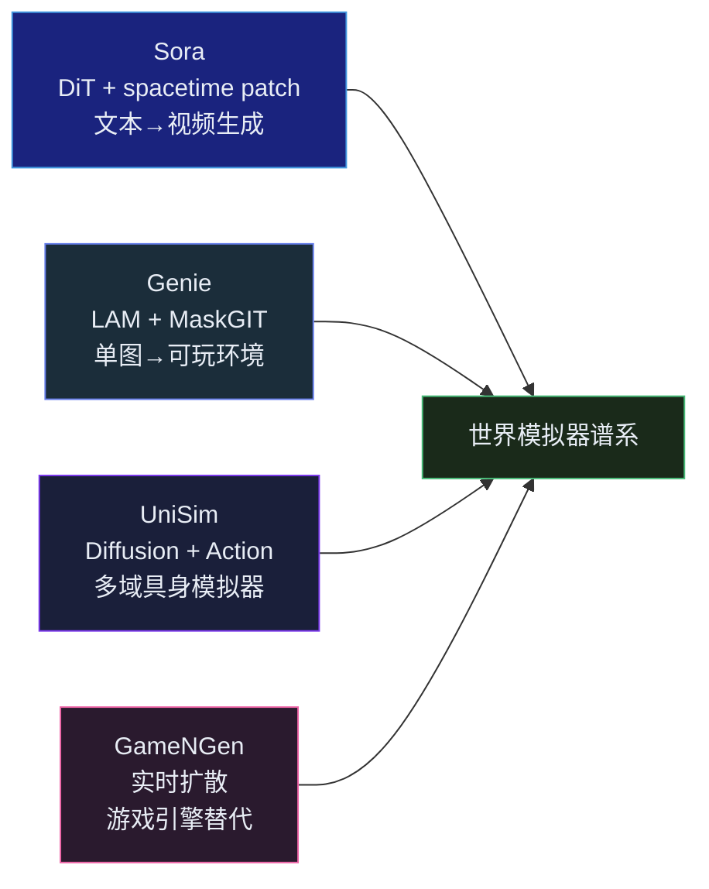
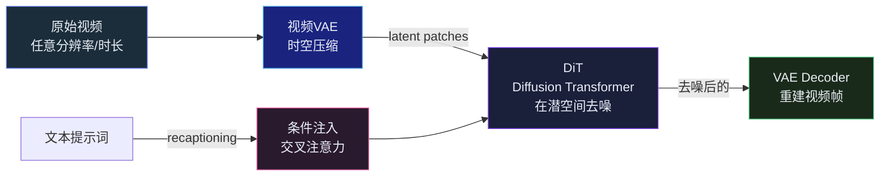
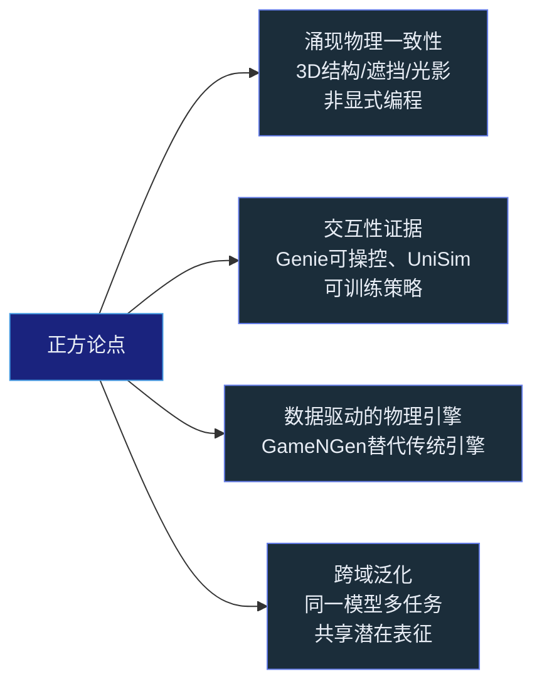
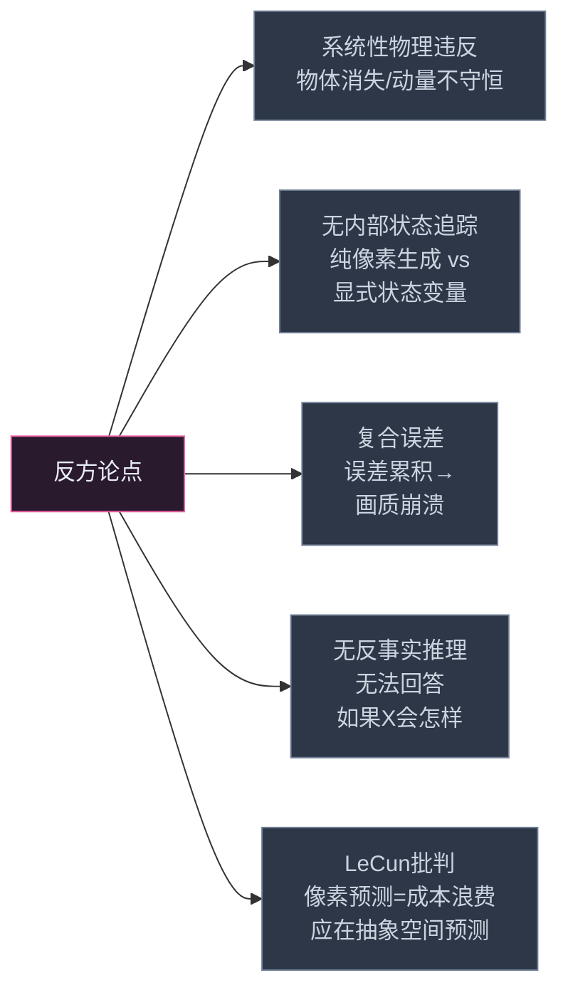



## 引言

2024 年 2 月，OpenAI 发布 Sora 的技术报告<cite>[1]</cite>，标题赫然写着「Video generation models as world simulators」。一石激起千层浪——视频生成模型从视觉娱乐工具，直接被推到了"世界模拟器"的哲学高度。

几乎同一时间，Google DeepMind 放出 Genie<cite>[2]</cite>——一个从互联网视频中训练出的可交互世界模型，用户输入一张图片和一个动作信号，它就能生成完整的 2D 游戏玩法。年末，Genie 2 将这个思路推向了 3D 世界。

但 LeCun 立刻泼了冷水：**生成像素的世界模型注定失败，真正有用的世界模型应该在抽象表示空间中预测**<cite>[10]</cite>。Gary Marcus 更直接地说：视频生成模型学会了"看起来像"物理，而不是物理本身。

这场争论触及了 AI 的一个根本问题：**什么才算是"理解"了世界？** 一个能生成逼真物理场景的模型，是否因此就拥有了一个世界模型？还是说，逼真和真实之间有一条永远无法跨越的鸿沟？

---

## 技术全景：视频世界模型的四路派系

在进入辩论之前，需要先理解四种不同的技术路线——它们对"世界模型"的定义和处理方式截然不同。

| 系统 | 输入 | 输出 | 交互性 | 核心架构 |
|---|---|---|---|---|
| **Sora** | 文本提示词 | 最长一分钟视频 | 无（纯生成） | DiT + spacetime patch |
| **Genie** | 单张图像 + 动作序列 | 可玩的 2D 游戏环境 | 实时交互 | LAM + MaskGIT |
| **UniSim** | 当前观察 + 动作 | 下一帧预测 + 奖励 | 跨域可交互 | Diffusion + Action |
| **GameNGen** | 历史帧 + 动作 | 实时游戏画面 | 实时交互（20+ FPS） | 扩散蒸馏 + 教师模型 |

---

## Sora：视频 DiT 的原理与争议

### 技术架构

Sora 不是凭空出现的——它是 DiT（Diffusion Transformer）类架构在视频领域的规模化应用<cite>[1]</cite><cite>[3]</cite>。理解它需要从三个核心技术组件出发：

**视频 VAE + spacetime patch**：首先，一个 3D VAE 将原始视频从像素空间压缩到潜空间——在时间维度和空间维度同时做压缩。压缩后的潜表示被切成 "spacetime patches"（时空补丁），就像 ViT 将图像切成 2D patch 一样，只不过现在是 (time, height, width) 的三维补丁。这些补丁被展平为 token 序列，输入给 DiT。

这个设计的巧妙之处在于，Spacetime Patch 天然支持**原生可变分辨率**——不同长宽比和时长的视频产生的不同数量的时空补丁。Sora 不需要像传统方法那样将所有视频裁剪/填充到固定尺寸。

**DiT（Diffusion Transformer）**：将 U-Net 替换为纯粹的 Transformer 块。扩散过程的每一步——从噪声中预测干净潜变量——都由 Transformer 完成。Transformer 的自注意力机制天然适合处理补丁之间的时空依赖。

**Recaptioning 提升文本对齐**：训练数据中的视频描述往往质量参差不齐。Sora 的解决方案是用一个内部的 captioning 模型重新为所有训练视频生成高质量描述，再用这些描述来训练。这类似于 DALL-E 3 的策略——通过提升文本监督的质量来提升生成质量。

### 物理涌现的迹象

Sora 的技术报告展示了一系列令人印象深刻的"涌现物理行为"：

- **3D 一致性**：摄像机平移时，远景和近景以正确的视差速度移动，暗示场景的深度结构被隐式建模
- **长程关联**：一个人咬一口汉堡后，汉堡上留下牙印——这个牙印会在此后多帧中保持存在，即使模型并未被显式训练"跟踪物体的持久修改"
- **基本物理交互**：流体在水杯中的晃动、光照在人物移动时的变化、毛发的物理摆动——这些都没有显式的物理公式指导，却能从数据中学到

OpenAI 的立场是直接的：**这些行为不是被人为编程进去的，而是从数据中涌现的。而涌现物理行为，正是世界模型的一个关键特征。**

---

## Genie：从单张图像到可玩世界

与 Sora 的"被动生成"不同，Genie<cite>[2]</cite> 的核心创新是**交互性**——它生成的不是视频，而是可操作的环境。

### Latent Action Model (LAM)

Genie 训练数据的最大问题是：互联网视频没有动作标签。你看到一段《超级马里奥》通关视频，但不知道玩家在每一帧按了什么键。

Genie 的解决方案是 **LAM（Latent Action Model，潜在动作模型）**——一个完全无监督的动作发现机制：

LAM 的工作方式：给定前几帧和后几帧，它推断可能产生这种视觉变化的一系列"潜在动作"。这不是预测玩家实际上按了什么键——那些信息不可得——而是**为视觉变化模式分配一套抽象的、语义连续的动作编码**。

训练完成后：
1. 用户提供一张**从未见过的图像**（例如一张手绘草图）
2. 用户选择一个潜在动作（在不同"方向"之间切换）
3. Genie 的动力学模型生成下一帧——图像中的角色开始移动、跳跃、与环境交互

Genie 的突破在于证明了：**交互世界的动力学规律可以从纯被动视频数据中无监督学习。**

### Genie 2 的 3D 扩展

2024 年底的 Genie 2 将这个思路推进到 3D。从一张概念图出发，模型生成一个可导航的 3D 场景——转动视角、向前移动——这些都如同在游戏引擎中一样流畅。输入从"图片"变成了"场景"，输出从"2D 游戏"变成了"3D 世界"。

---

## UniSim 与 GameNGen：世界模型作为替代引擎

### UniSim：跨域统一模拟器

UniSim<cite>[4]</cite> 的目标是：**一个模型，模拟所有领域。** 它在涵盖几十个不同具身AI数据集（包括真实机器人、模拟机器人、自动驾驶视频、机械臂操作）的混合数据上训练。给定当前观察和动作，它预测下一帧和奖励。

关键发现：在 UniSim 的潜空间中用 RL 训练的智能体策略，可以在不接触真实数据的情况下泛化到类似任务。某些任务上，在 UniSim 生成的模拟数据上训练的模型，表现超过了在传统专门化模拟器上训练的模型。

这意味着一个潜在的范式转变：**不只为每种任务建一个模拟器，而是训练一个通用的可微分模拟器。**

### GameNGen：扩散模型实时替代游戏引擎

GameNGen<cite>[5]</cite> 做了一个最大胆的实验：用扩散模型完全替换 DOOM 的游戏引擎。传统游戏引擎在每个帧执行物理模拟、碰撞检测、渲染管线。GameNGen 用扩散模型直接从过去的帧和当前按键输入预测下一帧。

要让扩散模型跑到 20+ FPS，需要对标准扩散过程做激进的蒸馏——将数百步的迭代去噪压缩到个位数步骤。虽然目前保真度有限（画面有明显的扩散伪影），但概念上是革命性的：**一个游戏不需要游戏引擎——它只需要一个足够好的世界模型。**

---

## 辩论：视频模型是真正的世界模型吗？

上述所有系统的技术成就毋庸置疑。但核心争议在于：**它们学到的是真实的物理和因果，还是仅仅学到了"看起来像物理"的视觉模式？**

### 正方阵营

**1. 涌现物理一致性**：Sora 的 3D 一致性、物体持久性、基本交互——这些不是被手动编码的规则，而是从足够多的数据中涌现的模式。如果模型没有学到某些形式的"物理"规律，它不可能在高维像素空间中长时间保持这些一致性。

**2. 交互性证据**：Genie 可以从一张从未见过的图像生成可交互的环境。这意味着模型不仅记住了训练数据的外观，还内化了"动作如何引起视觉变化"的规律——即环境动力学的某种可转移的形式。

**3. 数据驱动的物理引擎**：如果 GameNGen 真的能在某些游戏中替代传统游戏引擎，那就说明模型学到了足够精确的环境动力学来维持交互性——物理引擎和世界模型本质上都在解决同一个问题：根据当前状态和输入，预测下一状态。

**4. 跨域泛化**：UniSim 的跨域能力表明，模型可以在不同领域中共享一个关于"物理交互"的基础表征。

### 反方阵营

**1. 系统性物理违反**：仔细检查 Sora 的生成结果，会发现多种非偶然的物理错误——物体凭空出现和消失、碰撞检测失败（手指穿过桌子）、动量不守恒。这不像"学习过程中的噪声"，而更像是模型没有学到物理规律的硬约束。

**2. 无内部状态追踪**：Sora 的每一帧是围绕一个概率最大化的外观目标生成的。它没有内部的、结构化的状态表征——没有一个物体位置、速度、质量的追踪器。真正的世界模型需要显式的状态空间来驱动预测，而不是一个 look-up table 式的像素映射。

**3. 复合误差**：所有扩散模型的预测都带有残余误差。在多步 rollout 中，这些误差彼此叠加——第 $t+1$ 帧的误差会成为第 $t+2$ 帧输入的一部分，以此类推。传统世界模型（如 DreamerV3）通过对潜状态做结构化处理来抑制这种漂移，但视频扩散模型缺乏这种机制。长期 rollout 后画面必然崩坏<cite>[9]</cite>。

**4. 无反事实推理**：世界模型的核心能力之一是回答"如果", 我做了 X 而不是 Y，会发生什么"。视频模型只能生成最可能的未来，无法系统性地探索对抗性情景或极其罕见的事件。

**5. LeCun 的根本性批判**：LeCun 的论点是更深层的——预测像素本身就是一个方向性错误<cite>[10]</cite>。世界的绝大部分信息与决策无关（墙壁上每个像素的精确纹理不影响"哪里可以走"的判断）。一个有效的世界模型应该在**抽象的表示空间**中预测未来状态，而非在像素空间中。JEPA（Joint Embedding Predictive Architecture）正是为此设计的。

### 综合评估：现象模拟器 vs 因果引擎

| 维度 | 视频世界模型 | 传统物理引擎 | Dreamer/RSSM |
|---|---|---|---|
| **如何得到状态** | 隐式（像素生成中的潜在约束） | 显式（坐标、速度、质量） | 显式（潜状态 $h_t, s_t$） |
| **物理学** | 从数据涌现（不稳定） | 硬编码运动方程 | 从交互数据学习 |
| **反事实能力** | 极弱 | 天然支持 | 通过模型 rollout |
| **长期稳定性** | 复合误差 → 崩溃 | 完美数值稳定 | RSSM 隐状态抑制漂移 |
| **泛化范围** | 广（数据驱动） | 窄（需手工建模） | 中（同一领域内可迁移） |
| **计算需求** | 极高 | 低 | 中 |

**核心结论**：视频生成模型是**外观层面的现象模拟器（phenomenological simulator）**——它们学会了模拟世界看起来的样子，而非世界运行的因果机理。这使得它们在某些任务中非常强大（生成逼真的视觉呈现），但在本质上不满足"世界模型"的严格定义——可逆的、因果的、有内部状态的预测引擎。

但这并不意味着它们没有价值。一个精确的外观模拟器可以用作：(a) 视觉数据的生成器，用于训练下游智能体；(b) 对"世界看起来应该是什么样"的快速验证（与显式状态模型形成互补）；(c) 用户交互的视觉接口。

---

## 从模拟器到 Agent：三个应用方向

### 方向一：生成训练数据

最直接的应用：用视频世界模型为具身 AI 生成无限的训练数据<cite>[6]</cite><cite>[8]</cite>。GR-1<cite>[7]</cite> 和 UniPi<cite>[6]</cite> 都展示了视频生成模型可以为下游机器人策略提供有效的训练环境——智能体在"生成的世界"中学习，然后迁移到真实世界。

### 方向二：实时视觉验证

GameNGen 和 Genie 2 提供了实时、交互式的视觉反馈。这可以为 LLM Agent 提供一个"视觉沙盒"——在调用一个破坏性工具前，先在生成的环境中预览可能的后果。

### 方向三：外观层面的安全护栏

虽不是严格的因果世界模型，视频生成模型可以用于**快速识别明显危险的场景**——例如一个 Agent 在厨房中接近明火，或在导航路径上检测到障碍物。它是一个模糊的、但高覆盖度的第一道防线。

---

## 总结

视频生成世界模型的现状可以概括为：

**已证明的**：互联网规模的视频数据包含了丰富的物理规律信息，这些信息可以通过大规模生成模型提取并转化为可控的视觉输出。Genie 的可交互性证明了这一点不是偶然。

**尚未证明的**：这些模型是否建立了因果理解，还是仅仅学习了复杂的外观相关性。当涉及反事实推理、长期稳定预测和定量物理时，它们目前的表现不能令人信服。

**前进方向**：最可能的发展路径是将视频模型的视觉泛化能力与显式状态空间模型的结构化推理能力相结合。不是"二选一"，而是"视频生成做视觉、潜状态模型做物理"的混合架构。

如果视频世界模型是**"学来的现象模拟器"**，那么一个更根本的问题浮现出来：LLM——纯粹从文本中训练——能否习得更深刻的世界模型？第三篇文章将深入这场关于 LLM 内部的世界表征的激烈辩论。

---



## 参考文献

1. *Video generation models as world simulators.* Brooks T, Peebles B, et al. OpenAI, 2024.  
   <https://openai.com/research/video-generation-models-as-world-simulators>
2. *Genie: Generative Interactive Environments.* Bruce J, Dennis M, Edwards A, et al. Google DeepMind, 2024.  
   <https://arxiv.org/abs/2402.15391>
3. *Scalable Diffusion Models with Transformers (DiT).* Peebles W, Xie S. ICCV, 2023.  
   <https://arxiv.org/abs/2212.09748>
4. *UniSim: Learning Interactive Cross-Domain Real-World Simulation.* Yang M, Du Y, Ghasemipour K, et al. ICLR, 2024.  
   <https://arxiv.org/abs/2310.12325>
5. *GameNGen: Real-Time Neural Game Engine Using Diffusion Models.* Valevski D, et al. 2024.  
   <https://arxiv.org/abs/2408.14837>
6. *Learning Universal Policies via Text-to-Video Generation (UniPi).* Du Y, et al. NeurIPS, 2023.  
   <https://arxiv.org/abs/2302.00111>
7. *GR-1: Unleashing Large-Scale Video Generative Pre-training for Visual Robot Manipulation.* Wu C, et al. 2024.  
   <https://arxiv.org/abs/2312.13139>
8. *World Model on Million-Length Video and Language with RingAttention.* Liu H, et al. UC Berkeley, 2024.  
   <https://arxiv.org/abs/2402.08268>
9. *Is Sora a World Simulator? A Comprehensive Survey on General World Models and Beyond.* Zhu Z, et al. 2024.  
   <https://arxiv.org/abs/2405.03520>
10. *A Path Towards Autonomous Machine Intelligence.* LeCun Y. 2022.  
    <https://openreview.net/forum?id=BZ5a1r-kVsf>
{: .references }
