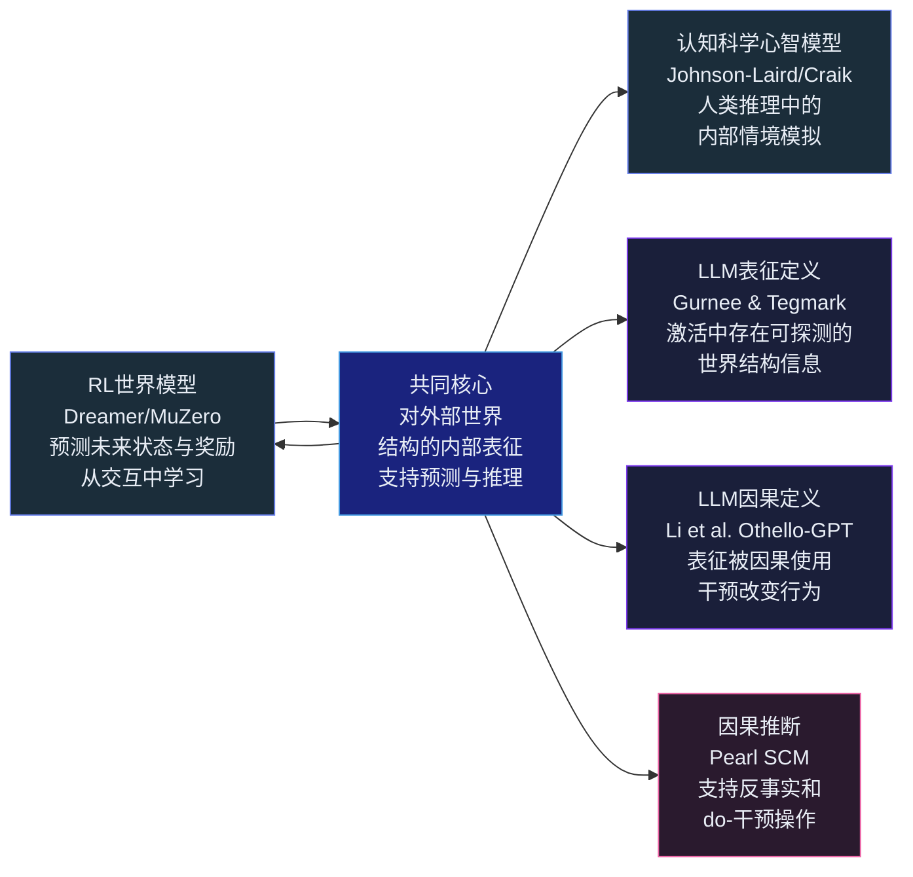



## 引言

2023 年，Kenneth Li 等人做了一个精巧的实验<cite>[1]</cite>：训练一个 GPT 模型预测黑白棋（Othello）的合法走子。训练数据只有棋谱文本——纯 tokens，没有棋盘状态标签。然后，他们用线性探针扫描模型内部激活，发现了一件令人不安的事：**模型的隐层中，一个完整的 8×8 棋盘状态被精确地编码着——包括那些在棋谱中从未被提及的空格。**

这意味着什么？一个仅仅被训练来预测"下一个 token"的模型，在其内部自发地构建了一个关于外部世界的结构化表征。它没有被告知"棋盘是一个 8×8 的网格"，它没有见过"白棋在 D4"这样的标注——它从纯文本序列的统计规律中推断出了一个独立于文本的世界结构。

这直接触及了 AI 领域当前最激烈的辩论之一：**大语言模型是否在训练中习得了一个内在的"世界模型"？还是仅仅学会了"看起来像理解"的表面统计模式？**

这个问题的答案，直接决定了我们能在多大程度上信任 LLM 作为 Agent 的推理引擎。

---

## 世界模型的五种定义：术语的澄清

在进入实验证据之前，需要先理清"世界模型"这个词在 LLM 语境下到底是什么意思——这也是这场辩论如此混乱的一个原因：不同的人用同一个词指代完全不同的事物。

| 定义 | 来源 | 核心主张 | 检测方法 |
|---|---|---|---|
| **表征存在** | Gurnee & Tegmark | 内部激活包含世界结构信息 | 线性探针 |
| **因果使用** | Li et al. (Othello-GPT) | 模型使用表征来做预测 | 因果干预 |
| **可模拟性** | 认知科学 / RL | 可以运行前向模拟，回答 what-if | 反事实测试 |
| **因果结构** | Pearl SCM | 编码变量间因果方向，支持 do-操作 | 因果推断测试 |
| **环境动力学模型** | Ha & Schmidhuber | 从交互中学习的显式状态转移模型 | 预测误差 + 规划表现 |

定义越严格（从表征存在 → 环境动力学模型），证据要求越高。本文聚焦于 LLM 语境中可操作的前三个层级。

---

## Othello-GPT：最精密的正方证据

Othello-GPT 实验的设计值得逐层拆解，因为它提供了一条完整的证据链——从"存在表征"到"表征被因果使用"<cite>[1]</cite>。

### 实验设计

**训练阶段**：在 Othello 棋谱（合法的落子序列）上训练一个标准 GPT。输入是像 "E3 D3 C4..." 这样的文本。关键点：**没有任何棋盘状态的标注。模型唯一看到的是走子符号。**

**探针探测阶段**：在 GPT 的每一层隐状态上训练一个线性探针——一个简单的线性分类器试图从激活向量中预测每个格子是黑棋、白棋还是空的。如果线性探针能够从激活中读出棋盘状态，就意味着这些信息以线性可解码的方式存在于模型中。

结果：**探针准确率高得惊人。** 在中层，线性探针可以几乎完美地重建整个棋盘状态。

**因果干预阶段**：这是最关键的一步。探针只能证明表征存在——但是否被模型实际使用？如果模型只是存储了棋盘状态作为某种"死代码"，那么修改这个表征不应该影响模型的预测。

实验者进行了两种干预：
1. 修改一个格子的状态表征（例如将"E3 是白棋"改为"E3 是黑棋"）
2. 观察模型的下一步走子预测是否以符合逻辑的方式改变（例如如果 E3 是黑棋，模型应该避免在 E3 落子）

结果表明：**干预产生的行为变化与被修改的棋盘状态完全一致。** 模型确实依赖这个表征来做预测。

### 为什么这个实验如此重要

三个原因：

1. **控制的完美性**：Othello 是一个封闭世界——8×8=64 个格子，3 种状态（空/黑/白），规则完全确定。没有任何训练数据歧义——"什么是棋盘"这个问题有一个唯一的正确表征。
2. **完全自发的表征学习**：模型没有接受任何关于"棋盘是一个空间"的指令。它从纯序列中学到了一个**空间结构**。
3. **因果验证而非相关性验证**：因果干预实验直接表明，这个表征不是训练过程中的某种"附带相关"，而是被模型作为决策的**因果输入**使用。

Othello-GPT 实验为正方立场提供了迄今为止最清晰、最难反驳的证据：**在纯文本的 next-token 预测训练中，一个世界模型可以自发涌现。**

---

## 空间与时间：更大的模型，更丰富的表征

如果 Othello 是一个"玩具世界"，Gurnee 和 Tegmark 的发现将证据推向了真实世界<cite>[2]</cite>。他们在 Llama-2-70B 的激活中用线性探针搜索了空间和时间的表征。

**空间表征**：发现多个层的激活中存在对地理坐标的线性可解码表征——不仅是国家级别，具体到城市的经纬度。更令人惊讶的是，有些**单个神经元**对特定的空间位置产生选择性响应，类似于哺乳动物海马体中的位置细胞。这些空间表征不是单层的偶然现象——在整个网络的多个深度都一致出现。

**时间表征**：类似地，模型中存在对时间跨度的表征——年份、年代、世纪。这些表征在多个尺度上保持一致性。模型似乎在内部建立了一条"时间线"。

**稳健性**：这些表征在多种文本类型中保持一致——维基百科、新闻、小说——说明它们不是特定语料的 artifact。

Gurnee 和 Tegmark 非常谨慎地解读他们的发现：**"发现表征不等于证明模型使用它。"** 他们只对表征的存在做了断言，没有做因果干预实验（在 70B 模型上做精细的 causal intervention 本身就是巨大的技术挑战）。

但这条证据线的力量在于它的广度：空间、时间、真值（Marks & Tegmark 发现的"真值方向"<cite>[3]</cite>）、颜色（Abdou 等人发现 BERT 的色词表征反映了人类 CIELAB 感知空间的结构<cite>[4]</cite>）——所有这些独立的研究表明，**LLM 内部表征了多样化的世界结构，而非仅仅是语言结构。**

---

## 反面声音：随机鹦鹉及其继承者

对立面的论证同样系统<cite>[5]</cite><cite>[6]</cite><cite>[7]</cite><cite>[8]</cite><cite>[9]</cite>。

### 随机鹦鹉 (Bender et al., 2021)

Bender 等人的"随机鹦鹉"论<cite>[5]</cite>是最知名的反方论点。它的核心论证分为两层：

第一层——**语言学论证**：LLM 的训练数据是文本形式（符号形式）的语言使用记录。语言形式与语言意义之间的关系不是符号内部的——意义来自于交流意图（即语言的使用者希望传达什么）和指称基础（即词语指向真实世界中的什么东西）。纯文本训练不能为模型提供任何一方。

第二层——**信息论论证**：语料库越大，越容易编码低概率的、不可信的、有害的文本序列。模型没有"判断力"来区分这些——它只是忠实地反映了数据的分布。

这篇论文发布时 GPT-3 刚出来不久。它的强烈措辞引发了持续的讨论，但后续实验——特别是 Othello-GPT——证明了至少在一个受控环境中，"纯文本不能产生理解"这一论断需要被大幅修正。

### 因果鹦鹉 (Zecevic et al., 2023)

Zecevic 等人<cite>[6]</cite>的论文将批判从"语言理解"扩展到了"因果理解"。他们发现 LLM 在表现出色的"因果推理"任务上，实际上是在利用文本中的**稀疏关联**而非因果理解。当实验控制了这些表面线索——保持文本形式但改变因果方向——模型的表现急剧下降。

关键发现是：LLM 擅长**因果话语**——即生成关于"A 导致 B"的流畅文本——但不擅长**因果推理**——即给定数据，推断真正的因果方向。

一个经典的反例：LLM 可以正确地说明"气压计读数下降意味着即将下雨"，也可以正确回答"下雨是否会导致气压计读数下降"。但它可能会混淆两者之间的因果方向——因为在文本中，这两种说法都大量出现。

### 组合性限制 (Dziri et al., 2023)

Dziri 等人的研究<cite>[7]</cite>揭示了一个更底层的限制：Transformer 在多步组合推理上的表现随着组合深度急剧下降。多位数乘法是一个最简单的测试：一个数字的每一位需要与另一个数字的每一位组合计算。当数字位数增加，准确率呈指数级下降。

这说明模型可能不是在执行"真正的组合性操作"（像人脑中做的那样），而是在匹配训练数据中见过的模式。一旦组合深度超出了训练数据覆盖的范围，模型就崩溃了。

### TC^0 理论限制 (Merrill & Sabharwal, 2023)

Merrill 等人<cite>[8]</cite>从计算复杂性理论的角度提供了形式化的限制：log-precision 的 Transformer（当前所有实际使用的 Transformer 都是 log-precision 的）只能解决复杂度类 TC^0 中的问题。这意味着某些需要真正线性推理步骤的任务——例如模拟一个有限状态自动机的长序列操作——在根本上超出了 Transformer 的表达能力。

这不是"训练不够好"的问题，而是架构层面的数学限制。

---

## 认知科学脉络

这场技术辩论背后是一条长达 80 年的认知科学思想线。

**Craik (1943)** 在《The Nature of Explanation》中首次提出：**大脑携带着"外部现实的微型模型"**——这就是"心智模型"和"世界模型"概念的思想起源<cite>[10]</cite>。

**Johnson-Laird (1983)** 发展了"心智模型"理论：人类推理不是通过逻辑规则的符号操作，而是通过**构造和操作内部情境模型**来进行的。当我们听到"猫在垫子上"这句话时，我们在脑海里构建的不只是一串符号——是一个可以"看到"猫和垫子空间关系的心理表征<cite>[11]</cite>。

**Searle (1980)** 的"中文屋"论证<cite>[12]</cite>被反方反复援引：一个系统可以通过行为测试（给出"正确"的输出）而不具备任何"理解"。Searle 用这个思想实验来反驳强 AI 论——如果一个人按照规则手册将中文符号翻译成英文符号，他（或整个系统）并不"理解"中文。

**Lake et al. (2017)** 的"Building Machines that Learn and Think Like People"<cite>[13]</cite> 提出人类认知依赖三种核心知识——**直觉物理学、直觉心理学和组合性**——这三种知识形成了一种先天或早期习得的"世界模型"，当前的 AI 系统（无论是在行为还是架构上）都不具备这些。

**Mitchell 和 Krakauer (2023)** 在一篇 PNAS 论文<cite>[9]</cite>中提出了也许是最有建设性的框架：**"'LLM 是否理解'这个问题本身就是个错误的问题。"** 理解不是二元的——它是一个多层次、多维度、连续的现象。LLM 在某些维度上表现出类理解的模式（如 Othello-GPT 的棋盘表征），在另一些维度上失效（如多步组合性）。我们需要更好的术语和框架，而非更激烈的二元立场。

---

## 证据矩阵

| 证据类型 | 正方发现 | 反方发现 | 当前共识 |
|---|---|---|---|
| **受控世界表征** | Othello-GPT：棋盘状态线性可解码，因果干预通过 | — | 正方立场最强有力的证据 |
| **真实世界表征** | 空间/时间/真值/颜色可探测 | 探测 ≠ 因果使用；需要更多因果验证 | 偏向正方，但需要 causal 研究跟进 |
| **因果推理** | 简单的因果话语生成正确 | 系统性因果方向推理失败 | 偏向反方 |
| **组合性** | 简单组合任务表现良好 | 多步组合指数级退化 | 反方证据强烈 |
| **反事实推理** | 训练分布内的反事实可回答 | 新颖反事实系统性地失败 | 偏向反方 |
| **理论限制** | — | TC^0 复杂度上限 | 反方有理论支撑，但尚不清楚是否构成实践瓶颈 |

**最精简的总结**：LLM 确实发展了某些形式的内部世界表征——"纯随机鹦鹉"这个立场在 Othello-GPT 之后已经站不住脚。但这些表征是不完整的、脆弱的，并且在需要深层组合性、因果性推理和反事实规划的任务中会系统性地失效——"LLM 已经拥有完整的人类式世界模型"这个立场同样站不住脚。

这场辩论的真正意义不在于"谁赢了"，而在于它引导我们走向一个更精确的问题：**LLM 的内部表征足以支撑什么样的 Agent 能力？还缺什么？**

这正是下一篇——也是本系列的最后一篇——要回答的问题。

---

## 总结

从 Othello-GPT 的精确因果实验，到 Gurnee 和 Tegmark 对 70B 模型的全面探针扫描，正方已经证明：**LLM 的内部确实构造了某种形式的世界表征——不仅是相关存留，而且（至少在受控环境中）被因果使用。**

从 Bender 的语言学批判，到 Dziri 的组合性测试，到 Merrill 的 TC^0 理论限制，反方系统性地展示了：**这些表征有根本性的局限——尤其是涉及到多步因果推理、反事实思考和组合泛化时。**

认知科学的思想传统为这场辩论提供了更深层的视角。Craik 的心智模型、Johnson-Laird 的情境模拟、Searle 的中文屋、Lake 的先天知识框架——这些概念提醒我们，"抽取表征"和"拥有世界模型"之间有一道鸿沟。发现神经元响应空间坐标，与拥有一个足够可靠来支撑安全 Agent 决策的世界模型，是两件完全不同的事。

但如果 LLM 确实拥有不完整但有用的世界表征，那么 Agent 设计的下一个关键问题就变成了：**如何用一个显式的、结构化的、可从交互中更新的世界模型来补充 LLM 的内部表征？**

---



## 参考文献

1. *Emergent World Representations: Exploring a Sequence Model Trained on a Synthetic Task.* Li K, Hopkins AK, Bau D, Viegas F, Pfister H, Wattenberg M. ICLR, 2023.  
   <https://arxiv.org/abs/2210.13382> · 代码仓库：<https://github.com/likenneth/othello_world>
2. *Language Models Represent Space and Time.* Gurnee W, Tegmark M. ICLR, 2024.  
   <https://arxiv.org/abs/2310.02207> · 代码仓库：<https://github.com/wesg52/world-models>
3. *The Geometry of Truth: Emergent Linear Structure in LLM Representations of True/False Statements.* Marks S, Tegmark M. 2023.  
   <https://arxiv.org/abs/2310.06824>
4. *Can Language Models Encode Perceptual Structure Without Grounding? A Case Study in Color.* Abdou M, et al. CoNLL, 2021.  
   <https://arxiv.org/abs/2109.06129>
5. *On the Dangers of Stochastic Parrots: Can Language Models Be Too Big?* Bender EM, Gebru T, McMillan-Major A, Shmitchell S. FAccT, 2021.  
   <https://dl.acm.org/doi/10.1145/3442188.3445922>
6. *Causal Parrots: Large Language Models May Talk Causality But Are Not Causal.* Zecevic M, Willig M, Dhami DS, Kersting K. TMLR, 2023.  
   <https://arxiv.org/abs/2308.13067>
7. *Faith and Fate: Limits of Transformers on Compositionality.* Dziri N, et al. NeurIPS, 2023.  
   <https://arxiv.org/abs/2305.18654>
8. *The Parallelism Tradeoff: Limitations of Log-Precision Transformers.* Merrill W, Sabharwal A. TACL, 2023.  
   <https://arxiv.org/abs/2207.05390>
9. *The Debate Over Understanding in AI's Large Language Models.* Mitchell M, Krakauer DC. PNAS, 2023.  
   <https://doi.org/10.1073/pnas.2215907120>
10. *The Nature of Explanation.* Craik KJW. Cambridge University Press, 1943.
11. *Mental Models: Towards a Cognitive Science of Language, Inference, and Consciousness.* Johnson-Laird PN. Harvard University Press, 1983.
12. *Minds, Brains, and Programs.* Searle JR. Behavioral and Brain Sciences, 1980.  
    <https://doi.org/10.1017/S0140525X00005756>
13. *Building Machines that Learn and Think Like People.* Lake BM, Ullman TD, Tenenbaum JB, Gershman SJ. Behavioral and Brain Sciences, 2017.  
    <https://arxiv.org/abs/1604.00289>
14. *World Models.* Ha D, Schmidhuber J. NeurIPS, 2018.  
    <https://arxiv.org/abs/1803.10122>
{: .references }
