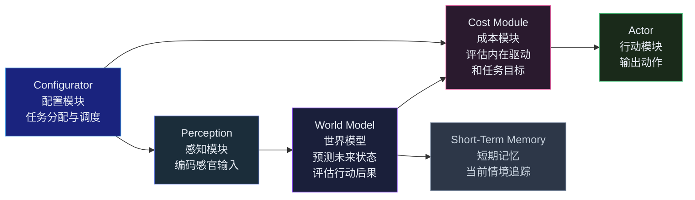
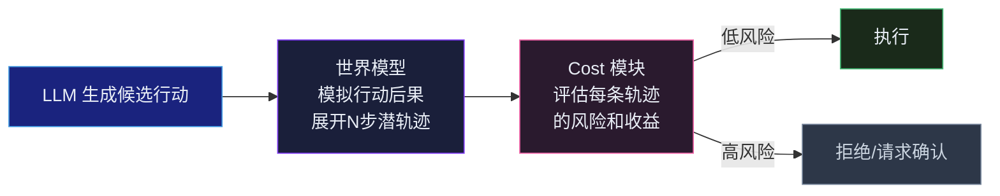
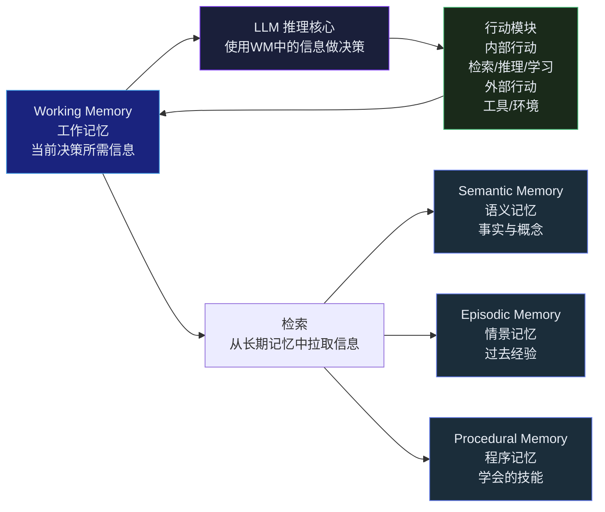
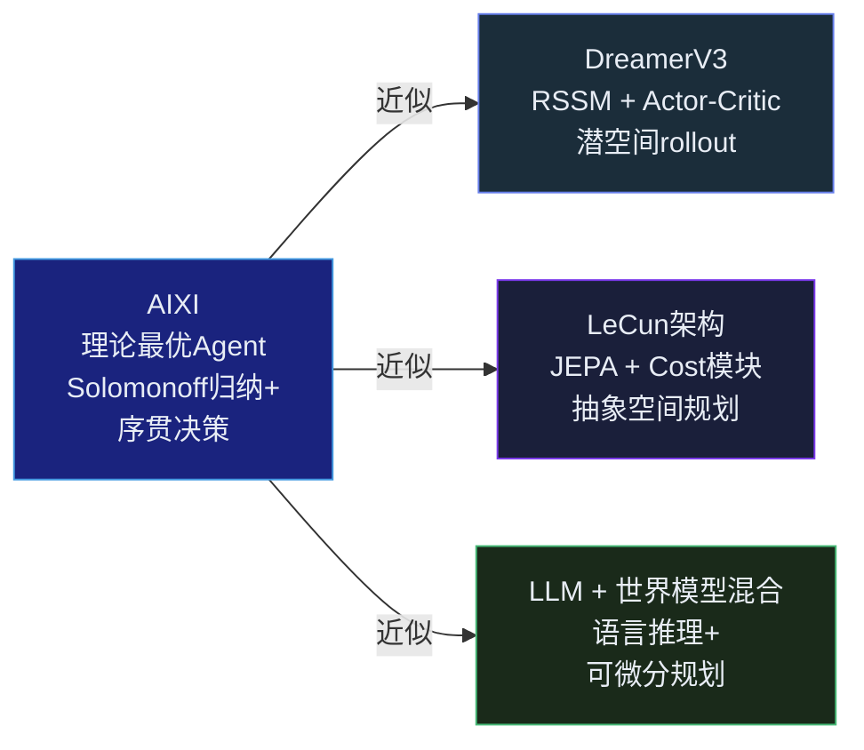
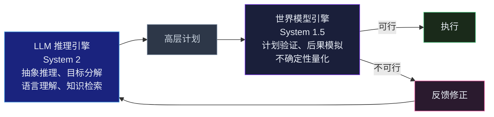



## 引言

LLM Agent 在过去两年经历了爆发式的架构演进——从 ReAct 的思考-行动交替<cite>[6]</cite>，到 Tree of Thoughts 的树搜索<cite>[7]</cite>，到 Voyager 的自动课程学习<cite>[8]</cite>，到 CoALA 的认知架构框架<cite>[9]</cite>。Agent 拥有了工具调用、长期记忆、多步规划、子任务委派——但它们仍然在一个根本性的维度上严重不足。

这个维度可以这样描述：一个人类工程师在终端里输入 `rm -rf /` 之前，大脑里会瞬间浮现出后果——文件消失、系统崩溃、生产停服。这是一种**前事实模拟**：在行动执行之前，在大脑中预览行动的可能结果。

当前的 LLM Agent 没有这个能力。它基于 next-token prediction 生成行动——它不是"模拟后果然后选择"，而是"直接输出最可能的下一个 token"。当这个 token 恰好是一个破坏性命令时，Agent 不会比生成一个无害回复时更犹豫。

这就是为什么 Agent 需要世界模型。本篇论证三个命题：

1. 世界模型是 Agent 安全性的架构级解决方案——不是 prompt 护栏，而是**在架构层面提供行动前模拟**
2. 世界模型是 LLM 规划能力的放大器——将基于语言统计的"模糊规划"升级为基于环境动力学的"可验证规划"
3. 世界模型与 LLM 的结合——而非单独进化任一方——将是 Agent 认知架构的下一个里程碑

---

## 当前 Agent 架构的"世界模型缺口"

几乎所有主流 LLM Agent 框架都有相同的盲区：

这个循环中没有"模拟"。LLM 规划 → 直接执行 → 观察结果 → 如果失败则修正。这是一个**reactive 架构**：Agent 通过真实世界的反馈来学习，而非通过内部模拟来预见。

| Agent 框架 | 规划方式 | 世界模型组件 | 行动前模拟 |
|---|---|---|---|
| **ReAct** | 思考-行动交替 | 无 | 无 |
| **AutoGPT** | 目标分解 | 无 | 无 |
| **Tree of Thoughts** | BFS/DFS 搜索推理链 | LLM 本身作为隐式世界模型 | 文本层面的"推理" |
| **Voyager** | LLM 分解 + 技能库 | Minecraft 引擎作为世界模型 | 环境反馈，非内部模拟 |
| **MetaGPT** | SOP 驱动的多角色协作 | 无 | 无 |
| **LangGraph** | 状态图编排 | 状态图作为结构化行动空间 | 无环境动力学 |
| **RAP** | MCTS + LLM 作为世界模型 | LLM 作为状态预测器 | 文本空间的 rollout |
| **LLM+P** | LLM 翻译为 PDDL → 经典规划器 | 规划器的完美领域动力学 | 完美但仅限 PDDL 领域 |

---

## LeCun 的自主智能架构：一个蓝图

2022 年，Yann LeCun 发表了一篇定位论文"A Path Towards Autonomous Machine Intelligence"<cite>[1]</cite>，提出了一个六模块的自主智能体架构。它至今仍是关于"Agent 应该长什么样"最完整、最有哲学深度的蓝图。

六个模块的分工如下：

| 模块 | 功能 | 类比 |
|---|---|---|
| **Configurator** | 接收任务描述，配置其他模块执行 | 前额叶的执行控制 |
| **Perception** | 感知原始感官输入（视觉、听觉等），编码为抽象表征 | 感觉皮层 |
| **World Model** | 给定状态表征和候选动作，预测下一个状态表征。**核心预测引擎** | 海马体+皮层预测回路 |
| **Cost** | 评估一个状态表征的"成本"——包括任务目标成本和内在不可变成本（如疼痛） | 杏仁核+多巴胺系统 |
| **Short-Term Memory** | 存储当前情境的状态追踪，一个可更新的工作记忆 gating 机制 | 工作记忆 |
| **Actor** | 给定状态表征和成本评估，选择动作以最小化预估成本 | 运动皮层 |

关键设计选择：World Model 预测的是**抽象表征**，而非原始像素。这是 LeCun 与 Sora 类视频世界模型的根本分歧——他不认为预测像素是走向智能的正路。

### JEPA：在抽象空间而非像素空间预测

LeCun 的 JEPA 系列<cite>[2]</cite><cite>[3]</cite> 具体化了这一哲学。

**I-JEPA**（Image JEPA）：对于一张图像，随机掩蔽几个区域。模型需要预测这些掩蔽区域的**表征**（经由 target encoder 计算的），而非它们的像素。预测通过一个 context encoder → predictor → target encoder 的管道完成。核心：两个 encoder 的输出在**潜空间**中对齐，而非在像素空间中。

**V-JEPA**（Video JEPA）：将相同的思想扩展到视频。掩蔽时空中的区域，预测被掩蔽区域的抽象特征，而非像素。结果：模型无需学习生成逼真图像就能学到关于物体运动、遮挡、物理交互的表征。

为什么这很重要？

LeCun 的论点：世界充满了与决策无关的信息。在你要决定从桌上拿起杯子时，杯子上每一个像素的反光细节都不影响你"伸手"这个动作。一个在像素空间中预测未来的模型，将其绝大部分计算能力浪费在生成这些与决策无关的细节上。而一个在抽象空间中预测的模型，可以将其全部能力集中在**与行动相关的状态变化**上。

---

## 世界模型的三重角色

在 Agent 架构中，世界模型承担三个不可替代的功能：

### 角色一：安全护栏——在行动前模拟后果

这是最直接的价值。在执行一个潜在破坏性行动之前，Agent 在内部世界模型中模拟其结果。如果模拟结果被 Cost 模块标记为高风险，Action 被阻止或降级。

这个概念与 Anthropic 的 Constitutional AI<cite>[13]</cite> 互补：Constitutional AI 提供文本层面的行为约束，世界模型提供**环境后果层面的物理约束**。一个是"这个行动是否符合价值原则"，另一个是"这个行动在物理上会造成什么后果"。

### 角色二：规划基座——让模糊规划变得可验证

纯 LLM 规划的问题：它在文本空间产生计划——"第一步做 A，第二步做 B，第三步做 C"。但 LLM 无法验证"做完 A 之后，B 是否真的可行"。

世界模型的角色：**将 LLM 的模糊规划转化为可验证的 rollout。** LLM 提出候选计划，世界模型模拟执行每一步，返回真实的状态变化和可行性反馈。

这与 RAP（Reasoning via Planning）<cite>[10]</cite> 的思想一致——MCTS 不只是在文本空间搜索，而是在一个**环境动态模型**中搜索——只是 RAP 仍是用 LLM 做状态预测，而理想情况下应由专门的、从交互数据中学到的世界模型来承担这个角色。

### 角色三：内省工具——知道你不知道什么

一个好的世界模型不仅预测"最可能发生什么"，还能量化预测的不确定性。当世界模型对多个可能的未来分配近乎相等的概率时，Agent 就知道自己处于一个高度不确定的、需要更多信息的状态。

这是元认知的基础：**知道什么时候自己不知道。** 纯 token-prediction 的模型不天然支持这种区分——没有一个机制来量化"我对这个预测的置信度有多低"。

一个带不确定性量化的世界模型可以触发信息搜集行为——在做出不可逆的行动之前，Agent 主动探查环境以降低不确定性。

---

## 混合范式的涌现

已有的一系列工作展示了 LLM + 显式世界模型的混合范式——尽管这些工作自己未必用"世界模型"的名字来称呼这一组合：

### AlphaGeometry：神经符号的完美案例

DeepMind 的 AlphaGeometry<cite>[11]</cite> 是最优雅的混合世界模型案例：**LLM（创造性的、不精确的波束搜索）提议几何辅助构造；符号引擎（完美的、确定性的几何世界模型）验证这些构造并在其形式系统中推导结论。**

LLM 不需要完美——它只需要大胆提议。符号引擎不需要创造力——它只需要严格验证。两者各自在对方薄弱的维度上提供了互补。LLM 充当了"假设生成器"，符号引擎充当了"假设验证器"——后者的完美世界模型确保了没有几何错误能逃过验证。

### Voyager：Minecraft 作为世界模型

Voyager<cite>[8]</cite> 虽然没有一个显式的、"学来的"世界模型，但它的架构暗含了同样的原则：LLM (GPT-4) 提议技能、分解任务、编写代码；Minecraft 的物理引擎验证一切——技能是否真的能制作出新物品，任务是否真的完成了。

用户的反馈（"我做出了一个木镐"→"我用木镐挖到了石头"）充当了世界模型的最基本形式——一个确定性的、真实的、完整的物理反馈循环。

这揭示了一个重要的事实：**环境本身就是一个"世界模型"——只是查询它的成本（真实交互）远高于查询一个学到的世界模型（潜空间中的前向传播）。**

### LLM+P：完美但窄的规划世界模型

LLM+P<cite>[12]</cite> 用了一个极端的策略：LLM 将自然语言翻译为 PDDL（计划领域定义语言），一个经典 AI 规划器产生最优计划，LLM 将其翻译回自然语言。这里的世界模型是**完美的**——PDDL 规划器拥有环境的完备、确定性的动力学知识。

代价是泛化性——场景必须能用 PDDL 精确建模，而这对于绝大多数真实世界任务是不可能的。

---

## CoALA：系统性的认知架构框架

Sumers 等人提出的 CoALA（Cognitive Architecture for Language Agents）<cite>[9]</cite> 是一个系统性的认知架构蓝图——它将认知科学中成熟的记忆模型与 LLM Agent 设计对接。

CoALA 框架中，世界模型不是一个显式的模块——但它的功能分布在整个架构中：

- **语义记忆**包含抽象的世界知识（类似于 LLM 从训练数据中获得的"世界模型"）
- **情景记忆**包含过去互动的具体经验（类似于从交互中学到的"环境动力学"）
- **工作记忆**是当前决策的中间状态暂存区（类似于潜状态 $h_t + s_t$）

CoALA 的价值在于：它为 LLM Agent 提供了一个**从认知科学出发的结构化语言**，来讨论世界模型在 Agent 中的位置和角色。它没有完成——世界模型仍然是最弱的模块——但它为这个问题提供了正确的框架。

---

## AIXI：理论最优解与实践逼近

在理论层面上，Marcus Hutter 的 AIXI<cite>[14]</cite> 给出了最优 Agent 的数学框架——尽管它在计算上不可实现：

$$
a_t^* = \arg\max_{a_t} \sum_{o_t, r_t} \cdots \max_{a_{t+m}} \sum_{o_{t+m}, r_{t+m}} [r_t + \cdots + r_{t+m}] \sum_{q: U(q, a_1, \ldots) = o_1, r_1, \ldots} 2^{-|q|}
$$

这个公式看起来吓人，但核心思想简单：**在所有可能的世界模型（程序 q）上加权求和，权重与程序的柯尔莫哥洛夫复杂度成反比，选择期望累积奖励最大的行动。**

AIXI 有两个与当前讨论直接相关的洞见：

1. **世界模型的本质是预测未来观测和奖励的程序**。这不一定是神经网络——它可以是一个符号程序、一个物理模型、一组微分方程。
2. **最优 Agent 的行为不需要完美的世界模型**。AIXI 对所有可能世界模型做加权平均，这意味着 Agent 可以用一个不完美的世界模型来逼近最优行为——只要它能正确估计世界模型的不确定性。

在实践中，DreamerV3 可以被看作 AIXI 的一个具体近似：RSSM 是一个参数化的世界模型（而非所有可能程序的加权和），Actor-Critic 用这个模型在潜空间中做 rollout-based 决策（而非精确的期望最大化）。**它的成功说明，AIXI 的近似在实践中可以非常强大——即使我们离理论最优还很远。**

---

## 收敛方向：双引擎 Agent 架构

综合前三篇的技术演进和本篇的架构分析，一个清晰的收敛方向浮现出来：

这个架构的核心是模块化的分工：

| 维度 | LLM 推理引擎 | 世界模型引擎 |
|---|---|---|
| **类比** | 大脑皮层（抽象推理） | 小脑+基底节（内部模拟+运动规划） |
| **操作空间** | 自然语言 / 抽象概念 | 结构化状态表征（连续+离散） |
| **推理模式** | 自回归 token 生成 | 潜空间 rollout + 规划 |
| **时间尺度** | 秒级到分钟级 | 毫秒级的内部模拟 |
| **不确定性** | 隐式（训练数据覆盖） | 显式（预测方差、free bits） |
| **安全贡献** | 文本护栏、价值对齐 | 物理后果模拟、风险预测 |
| **学习信号** | 静态语料库 | 实时环境交互 |

这个双引擎架构不是全新的构想——它早已存在于认知科学（Kahneman 的系统 1 / 系统 2）、RL（model-based vs model-free）和神经科学（皮层-皮层下分工）中。新的部分是：**LLM 终于提供了足够强大的"系统 2"引擎，而 DreamerV3 和 JEPA 展示了如何学习足够鲁棒的"系统 1.5"世界模型——两者的结合在工程上变得可行。**

---

## 当前挑战与开放问题

世界模型作为 Agent 基础设施的愿景面临着几个关键障碍：

**没有通用世界模型**：当前的学来世界模型是特定领域（Atari、DMControl、驾驶、机器人）的。跨领域的通用世界模型尚未出现。UniSim 和 DreamerV3 是朝这个方向的重要步骤，但距离"任何环境中的任何任务"还很远。Genie 和 Sora 从视频中学习的方法可能是一种扩展路径——但需要解决因果结构缺失的问题。

**世界模型本身的安全问题**：一个不完美的世界模型可能比没有世界模型更危险——它可能系统性地低估某些风险，产生虚假的安全感。如何验证世界模型在低概率高影响事件上的保真度？

**计算预算的分配**：rollout-based 规划的计算成本远高于单次前向预测。在 LLM 推理已经昂贵的情况下，如何平衡世界模型模拟和语言推理的计算预算？一个可能的答案是**分层规划**：高层计划在粗粒度上做全局搜索（LLM 做），低层模拟在细粒度上做局部验证（世界模型做）。

**从 LLM 的内部表征到显式世界模型的桥接**：第三篇展示了 LLM 已经拥有内部的世界表征。如何将它们"外化"为显式的、可更新、可用于规划的世界模型？这可能是最被低估的研究方向——不是从零训练世界模型，而是**从 LLM 中蒸馏出世界模型**。

---

## 总结

世界模型是 Agent 认知架构中最后一个尚未被系统化集成的核心组件。LLM 提供了抽象推理和语言理解，工具调用提供了行动能力，记忆系统提供了经验累积——但**行动前的后果预览、计划的物理可行性验证、不确定性的显式量化**——这些能力仍然缺失。

本系列四篇文章描绘了一条从 2018 年至今的技术轨迹：

- **第一篇**展示了从交互中学习世界模型的方法已经成熟——DreamerV3 可以在没有人工调整的情况下在截然不同的领域中学习
- **第二篇**分析了从视频中学习世界模拟器的可能性和边界——外观层面的模拟已经惊人，但因果理解仍然缺失
- **第三篇**梳理了 LLM 内部世界表征的证据和局限——表征存在，但不完整、脆弱、缺少因果结构
- **本篇**论证了这些技术线正在向同一个点收敛：**Agent = LLM（抽象推理）+ 世界模型（具身模拟）+ Cost（价值判断）+ Memory（经验积累）**

这不是一个遥远的愿景。DreamerV3 的代码是开源的。JEPA 的实现是开源的。LLM 的 API 是现成的。CoALA 的框架是公开发表的。将这些部分拼接成一个完整的 Agent 架构，不再需要突破性的新发明——需要的是一张正确的蓝图，和足够的工程勇气。

---



## 参考文献

1. *A Path Towards Autonomous Machine Intelligence.* LeCun Y. 2022.  
   <https://openreview.net/forum?id=BZ5a1r-kVsf>
2. *Self-Supervised Learning from Images with a Joint-Embedding Predictive Architecture (I-JEPA).* Assran M, et al. CVPR, 2023.  
   <https://arxiv.org/abs/2301.08243> · 代码仓库：<https://github.com/facebookresearch/ijepa>
3. *Revisiting Feature Prediction for Learning Visual Representations from Video (V-JEPA).* Bardes A, et al. 2024.  
   <https://arxiv.org/abs/2404.08471> · 代码仓库：<https://github.com/facebookresearch/vjepa>
4. *Mastering Diverse Domains through World Models (DreamerV3).* Hafner D, Pasukonis J, Ba J, Lillicrap T. 2023.  
   <https://arxiv.org/abs/2301.04104> · 代码仓库：<https://github.com/danijar/dreamerv3>
5. *World Models.* Ha D, Schmidhuber J. NeurIPS, 2018.  
   <https://arxiv.org/abs/1803.10122>
6. *ReAct: Synergizing Reasoning and Acting in Language Models.* Yao S, et al. ICLR, 2023.  
   <https://arxiv.org/abs/2210.03629>
7. *Tree of Thoughts: Deliberate Problem Solving with Large Language Models.* Yao S, et al. NeurIPS, 2023.  
   <https://arxiv.org/abs/2305.10601>
8. *Voyager: An Open-Ended Embodied Agent with Large Language Models.* Wang G, et al. 2023.  
   <https://arxiv.org/abs/2305.16291> · 代码仓库：<https://github.com/MineDojo/Voyager>
9. *Cognitive Architectures for Language Agents (CoALA).* Sumers T, et al. 2024.  
   <https://arxiv.org/abs/2309.02427>
10. *Reasoning with Language Model is Planning with World Model.* Hao S, et al. EMNLP, 2023.  
    <https://arxiv.org/abs/2305.14992>
11. *Solving Olympiad Geometry Without Human Demonstrations (AlphaGeometry).* Trinh T, et al. Nature, 2024.  
    <https://www.nature.com/articles/s41586-023-06747-5>
12. *LLM+P: Empowering Large Language Models with Optimal Planning Proficiency.* Liu B, et al. 2023.  
    <https://arxiv.org/abs/2304.11477>
13. *Constitutional AI: Harmlessness from AI Feedback.* Bai Y, et al. Anthropic, 2022.  
    <https://arxiv.org/abs/2212.08073>
14. *Universal Algorithmic Intelligence (AIXI).* Hutter M. 2005.  
    <https://arxiv.org/abs/cs/0510004>
{: .references }
