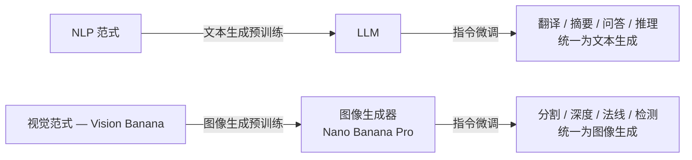
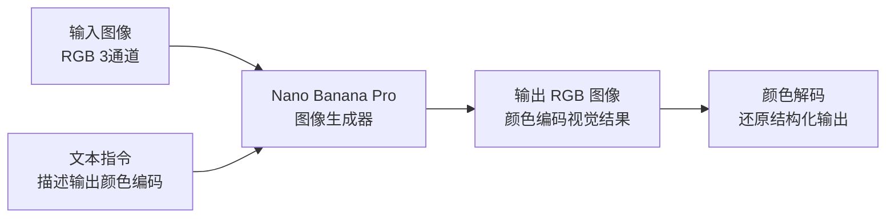
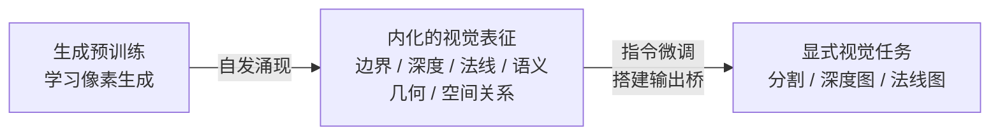

## 引言



2026 年 4 月，Google DeepMind 发表了一篇引发剧烈反响的论文<cite>[1]</cite>。他们做了一件此前从未被系统验证过的事：**把一个纯粹的图像生成模型，变成在分割、深度估计、表面法线等多个视觉任务上全面超越专用模型的通用学习者。**

论文的核心思想用上面这张图就能讲清楚：左侧是传统的"每个任务一把专用钥匙"范式——检测用检测头、分割用分割头、深度用回归头。右侧是 Vision Banana 的方案——**一切任务的输出都是 RGB 图像，一个生成模型处理所有。**

25 位作者——包括何恺明和谢赛宁作为 Leadership Sponsors——提出了一个看似简单但后果深远的主张：**图像生成模型本身就是强大的通才视觉学习者。**

他们给这个模型取名 Vision Banana。基座是 Nano Banana Pro——一个文本到图像的生成模型。他们没有给它添加分割头、深度估计头、法向量预测头——没有修改底层架构。他们做的事只有一件：**用极少量数据教它把视觉任务的答案"画"出来。**

结果呢？在零样本设定下，这个"画图模型"在语义分割上超过 SAM 3<cite>[2]</cite>，在深度估计上超过 Depth Anything V3<cite>[3]</cite>，在表面法线估计上超过 Lotus-2<cite>[4]</cite>——而且它的图像生成能力一点没丢。

这被广泛称为**计算机视觉的「GPT 时刻」**。要理解为什么，需要先从 NLP 的范式革命看起。

---

## 范式类比：GPT 统一文本，Vision Banana 统一视觉

在 NLP 领域，GPT 系列讲述了一个现在已经很熟悉的故事：**文本生成预训练 → 指令微调 → 一个模型统一所有语言任务。** 翻译、摘要、问答、推理——不再需要为每个任务设计专用架构和损失函数。模型先学会"写"，然后通过指令微调学会"按要求写"。

计算机视觉领域长期遵循的路线完全不同。分类有 ResNet，分割有 UNet/DeepLab，检测有 YOLO/Faster R-CNN，深度估计有 MiDaS/Depth Anything，表面法线有自己的专用网络。**每个任务一把专用钥匙。**

Vision Banana 的问法很简单：**如果图像生成是视觉的"语言建模"，会怎样？**

谢赛宁在社交媒体上写道："作为一个从像素级标注任务开始接触计算机视觉的人，看到这种成果会真切感受到——领域正发生重大变革。"

---

## 方法拆解：三步将生成模型变为视觉通才

Vision Banana 的技术方案有一种极简主义的美学——它没有发明新架构，而是重新定义了"视觉任务的输出格式"。

### 第一步：把所有视觉任务参数化为 RGB 图像

核心思想：**不再输出类别标签、深度值、mask 坐标——直接输出一张 RGB 图像，这张图像的颜色编码了所有需要的视觉信息。**

不同任务的编码方案：

| 任务 | 编码方式 | 解码方式 |
|---|---|---|
| **语义分割** | 提示词指定类别→颜色映射，如"把滑板画成纯黄 `⟨255,255,0⟩`" | 颜色聚类 → 像素级语义标签 |
| **实例分割** | 逐类推理，模型为不同实例动态分配可区分颜色 | 颜色聚类分离不同实例 |
| **表面法线** | `(x,y,z) ∈ [-1,1]³` 直接映射为 `(R,G,B)` | 天然对齐，无需特殊解码 |
| **度量深度** | 幂变换 + RGB 立方体棱边插值，构成双射映射 | 严格可逆，无损恢复物理深度值 |

### 第二步：深度估计的数学设计——最关键的技术细节

深度估计的编码方案是整个论文中最精巧的设计，值得仔细拆解。

深度值 $d \in [0, \infty)$ 需要被映射到 RGB 颜色空间 $[0, 1]^3$。这个映射必须是**可逆的**——生成的彩色图像要能精确解码回物理深度值。

**第一层变换：幂变换（Power Transform）**

$$
d_{\text{norm}} = \frac{d^\gamma}{d_\text{max}^\gamma}
$$

其中 $\gamma < 1$ 是压缩系数。这个变换的效果是：**近距获得更高的颜色分辨率，远距被压缩。** 这对机器人操作等近场场景非常关键——你需要区分 0.5m 和 0.55m，但不需要区分 80m 和 80.05m。

**第二层变换：RGB 立方体棱边上的分段线性插值**

$d_{\text{norm}} \in [0, 1]$ 被沿 RGB 色彩立方体的 7 条棱边进行分段线性插值（类似 3D Hilbert 曲线的首次迭代）：

这两层变换的叠加构成了一个严格的**双射（bijection）**——每个深度值对应唯一的 RGB 颜色，每个颜色对应唯一的深度值。这意味着解码过程中不会引入任何误差。

而且，整个流程**不需要相机内参**。传统深度估计方法需要知道焦距和光心位置才能从相对深度恢复度量深度。Vision Banana 直接从单张 RGB 图像输出度量深度——它从训练数据中隐式学习了场景尺度。

### 第三步：极轻量指令微调

数据配比是最反直觉的部分：

- **2D 视觉任务数据**：由内部模型对网络图像生成伪标注
- **3D 视觉任务数据**：完全来自合成渲染引擎——零真实世界深度数据
- **混合比例**：视觉任务数据以极低比例混入 NBP 原始生成训练数据
- **评测隔离**：所有评测基准的训练数据均被排除

这揭示了一个深层事实：**指令微调本质上只教模型如何将已有知识"格式化输出"，而非教它从头学习视觉理解。** 模型在生成预训练阶段已经学会了物体边界、空间关系、几何结构——指令微调只是释放了这些内化的表征。

---

## 实验结果：全面超越专用模型

### 2D 理解：分割

| 任务 | 数据集 | Vision Banana | 最佳对比模型 | 优势 |
|---|---|---|---|---|
| 语义分割 | Cityscapes | mIoU **0.699** | SAM 3: 0.652 | +4.7 点 |
| 指代分割 | RefCOCOg | cIoU **0.738** | SAM 3 Agent: 0.734 | +0.4 点 |
| 推理分割 | ReasonSeg | gIoU **0.793** | SAM 3 Agent: 0.770 | +2.3 点 |
| 实例分割 | SA-Co/Gold | pmF₁ 0.540 | DINO-X: 0.552 | −1.2 点 |

推理分割（ReasonSeg）是尤其值得注意的结果。ReasonSeg 要求模型根据复杂语言描述定位物体——例如"找出图片中那个被咬了一口的汉堡旁边的红色杯子"。这需要语言理解与视觉理解深度结合。Vision Banana + Gemini 2.5 Pro 的组合在这个任务上甚至超越了部分**在训练集上完整训练过**的非零样本方法。

**实例分割是唯一的短板**——SAM 3 在此任务上仍有优势。

以下是论文中的指代分割（Referring Segmentation）示例——输入图像 + 语言描述，模型直接在图上"画出"目标区域：

  
  
  输入
  预测

*鼠标悬停查看预测结果*

### 3D 理解：深度与表面法线

**度量深度估计**：

| 指标 | Vision Banana | 最佳对比 |
|---|---|---|
| 6 基准平均 δ₁ | **0.882** | UniK3D 提升 ~6 点 |
| 4 数据集平均 δ₁ | **0.929** | Depth Anything V3: 0.918 |
| AbsRel | 优于 MoGe-2 ~20% | — |

论文中有一个实地测试案例——在京都鹿苑寺外用普通手机拍摄，模型输出距离 13.71m，Google Maps 实测 12.87m，相对误差约 6.5%：

  
  
  输入
  深度预测

*鼠标悬停查看深度预测图*

**表面法线估计**：

| 场景 | Vision Banana | 最佳对比 |
|---|---|---|
| 室内 4 基准平均角度误差 | Mean 15.55°, Median **9.30°** | Lotus-2: Mean 16.56° |
| 户外 VKitti | 与 Lotus-2 持平 | Lotus-2 曾在 VKitti 2 上训练 |

更值得注意的是：Lotus-2 是一个**专门为表面法线估计设计**的模型，而 Vision Banana 是一个"顺带学会了表面法线"的生成模型。

  
  
  输入
  法线预测

*鼠标悬停查看法线预测图*

### 生成能力保留

| 测试 | 胜率 vs NBP | 结论 |
|---|---|---|
| GenAI-Bench（文生图） | **53.5%** | 不降反升 |
| ImgEdit（图像编辑） | 47.8% | 基本持平 |

**学会理解世界的模型，并没有忘记如何创造世界。**

---

## 为什么这有效：三个深层原因

### 原因一：生成预训练自发学会视觉理解

语言模型的逻辑——"预测下一个 token 的过程中自然学会了语法、语义和推理"——在视觉生成中找到了精确的类比。要生成一张语义正确、几何一致、光照合理的图像，模型必须在内部表征物体的边界（分割）、空间的前后关系（深度）、表面的朝向（法线）、材料的属性（纹理）。

**这些表征不是在指令微调阶段才被"教会"的——它们早已在生成预训练中被内化了。** 指令微调只是搭建了一座"桥"，让这些内化的表征能够以结构化的方式输出。

### 原因二：生成天然处理多模态歧义

视觉理解任务中普遍存在一对多问题。给定一张照片，某物体的准确边界在哪里？不同标注者可能给出不同的答案。深度估计存在固有模糊性——远处的山到底有多远？

判别式模型需要一个专门的机制来处理这种歧义——SAM 通过只对一个 mask 计算损失来回避这个问题，深度估计模型通过各种正则化来约束输出。生成模型则根本不需要处理歧义——它天然学习完整的数据分布。**歧义由设计本身消解——模型输出的是分布中的一个合理样本，而非"唯一正确答案"。**

### 原因三："想象力"比"识别"更强大

传统视觉模型的任务是"识别"——给定图像，提取其中已有的信息。生成模型的能力是"想象"——给定不完整或模糊的提示，推理出最合理的完整场景。

这个区别在推理分割（ReasonSeg）任务上体现得最明显。当用户要求"找出被咬了一口的汉堡旁边的红色杯子"，模型需要的不是识别一个已知类别的物体——它需要**理解场景中物体之间的关系，并基于这种关系推理目标位置**。这是一种更接近"想象场景布局"而非"匹配视觉模式"的能力。

---

## 与「世界模型」的对话

Vision Banana 的发布，为世界模型系列讨论的核心问题提供了新的实验证据。

本系列前三篇讨论了：(1) 从交互中学习的世界模型（Dreamer 系列），(2) 从视频中涌现的外观世界模拟器（Sora/Genie），和 (3) LLM 是否从文本中习得了世界表征。Vision Banana 为这个问题增加了一个视觉维度：**图像生成模型是否从像素生成的任务中习得了对视觉世界的结构化理解？**

答案是明确的——而且比 LLM 的"世界模型"证据更直接。LLM 的世界表征需要通过线性探针间接探测<cite>[5]</cite>，而 Vision Banana 的内部表征可以直接通过"让它画出来"来检验——生成的结果本身就是表征的可视化。一个能精确绘制深度图和表面法线的模型，不可能没有内部的三维世界表征。

更深一层：Vision Banana 暗示了一个可能的**"世界模型统一架构"**——一个模型同时具备生成（创造视觉世界）和理解（感知视觉世界）的能力。这与人类视觉系统的运行方式高度一致：我们的视觉皮层既负责感知，也负责心理意象——看见和想象共享同一个神经基板<cite>[6]</cite>。Vision Banana 可能首次在工程上实现了这种"感知-生成统一"。

---

## 局限与展望

**当前局限**：

- **实例分割仍然落后**——SAM 3 在此任务上保持优势，部分原因是训练数据限制
- **推理成本偏高**——Nano Banana Pro 规模的生成器进行视觉理解，计算成本远高于轻量专用模型。但历史规律是：当范式验证后，工程优化会迅速跟进
- **仅支持单目图像**——尚未覆盖多视角和视频。但论文团队已明确将视频生成器作为下一步方向

**未来方向**：

- **视频生成器的通用视觉学习**——如果单帧生成能学会 3D 结构，视频生成可能学会时序物理
- **扩大任务多样性**——当前只覆盖了分割、深度、法线。检测、跟踪、姿态估计、3D 重建等更多任务有待验证
- **与 LLM 的深度协同**——Vision Banana + Gemini 2.5 Pro 在 ReasonSeg 上的表现已经展示了这种协同的潜力

---

## 总结

Vision Banana 的意义超越了单纯的 benchmark 数字。它宣告了一个范式转换的可能性：**计算机视觉不再需要为每个任务训练专用模型。**

NLP 在 2017-2023 年间完成了从"每个任务一个模型"到"一个模型所有任务"的转型。视觉领域可能刚刚进入这个转型的元年。如果这个趋势持续，未来的视觉 AI 架构可能极其简单：**一个大模型，生成一切，理解一切。** 分割不是"识别像素的类别"，而是"画出掩码"；深度估计不是"回归距离"，而是"画出深度图"；目标检测不是"预测边界框坐标"，而是"圈出目标并给它上色"。

何恺明在 ResNet 时代重新定义了视觉特征的提取方式<cite>[7]</cite>，谢赛宁在 ConvNeXt 等工作中推动了视觉架构的现代化<cite>[8]</cite>。如今两人同时在 Vision Banana 上署名，从 ResNet 到 Vision Banana——视觉 AI 的二十年，正在从"如何更好地提取特征"的追问，切换到"如何通过生成来理解"的新范式。

---

## 参考文献

1. *Image Generators are Generalist Vision Learners.* Gabeur V, Long S, Peng S, et al. Google DeepMind, 2026.  
   <https://arxiv.org/abs/2604.20329> · 项目页：<https://vision-banana.github.io/>
2. *SAM 3: Segment Anything with Concepts and Prompts.* Meta AI, 2025.  
   <https://ai.meta.com/sam3/>
3. *Depth Anything V3: Robust Depth Estimation from Single Images.* Yang L, et al. 2025.  
   <https://arxiv.org/abs/2503.09362>
4. *Lotus-2: Robust Surface Normal Estimation.* 2025.  
   <https://arxiv.org/abs/2503.03362>
5. *Emergent World Representations: Exploring a Sequence Model Trained on a Synthetic Task.* Li K, et al. ICLR, 2023.  
   <https://arxiv.org/abs/2210.13382>
6. *Mental Imagery: Functional Mechanisms and Clinical Applications.* Pearson J, Naselaris T, Holmes EA, Kosslyn SM. Trends in Cognitive Sciences, 2015.  
   <https://doi.org/10.1016/j.tics.2015.08.003>
7. *Deep Residual Learning for Image Recognition.* He K, Zhang X, Ren S, Sun J. CVPR, 2016.  
   <https://arxiv.org/abs/1512.03385>
8. *A ConvNet for the 2020s.* Liu Z, Mao H, Wu CY, Feichtenhofer C, Darrell T, Xie S. CVPR, 2022.  
   <https://arxiv.org/abs/2201.03545>
{: .references }
