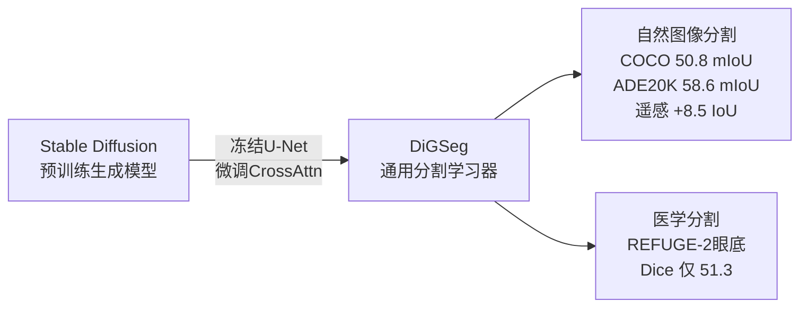
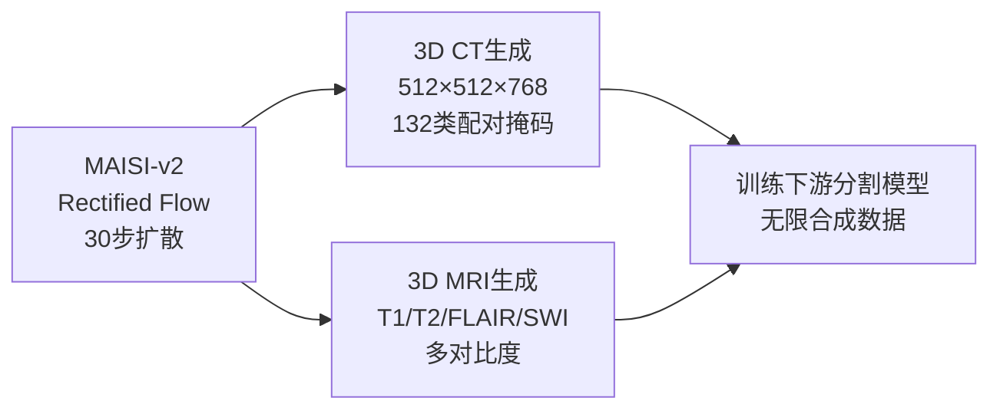
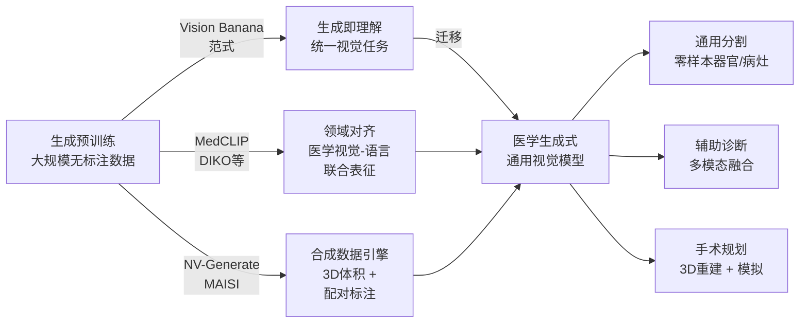

## 引言

上一篇文章讨论了 Vision Banana<cite>[1]</cite>——Google DeepMind 用一个文本到图像生成模型，在分割、深度估计、表面法线等多个视觉任务上全面超越专用模型。"生成即理解"的范式宣告了计算机视觉的 GPT 时刻。

但对于医学影像从业者来说，一个更紧迫的问题是：**这个范式能否迁移到 3D 医学影像？** CT 体积、MRI 多序列、PET 功能成像、超声实时动态——这些数据的维度和复杂度远超自然图像。更重要的是，医学影像的"理解"直接关系到诊断和手术决策——错误不仅是 benchmark 上的一个数字，而是临床后果。

本文综述 Vision Banana 发表两个月来，三条并行推进的技术线路，以及它们如何共同指向一个结论：**"生成即理解"可能是医学影像 AI 从"手工特征+专用模型"走向"通用基础模型"的最短路径。**

---

## Vision Banana 的方法论在医学影像的映射

先梳理 Vision Banana 的核心方法论在医学影像中的适用性：

| 维度 | Vision Banana (自然图像) | 医学影像 | 差距 |
|---|---|---|---|
| **数据空间** | 2D RGB 图像 | 3D 体积 (CT/MRI) + 时间 (4D) | 维度增加 1-2 个数量级 |
| **任务输出** | 分割掩码 / 深度图 / 法线图 (2D RGB) | 3D 器官分割 / 病灶检测 / 功能参数图 | 需要 3D 可逆编码方案 |
| **标注成本** | 网络图像 + 自动标注 | 专家标注，极其稀缺 | 贵 2-3 个数量级 |
| **生成预训练数据** | 互联网图像 (数十亿) | 医学隐私数据 (百万级) | 数据量差 100-1000 倍 |
| **多模态** | 文本→图像 | CT + MRI + PET + US + 临床文本 | 模态异质性更高 |
| **容错性** | 可接受小误差 | 分割边界直接影响手术计划 | 零容错需求 |

Vision Banana 的三个核心技术——(1) 统一 RGB 输出、(2) 可逆编码、(3) 轻量指令微调——每一条都需要针对医学影像做根本性改造。但好消息是，已有多个并行线路在各自的方向上取得了实质性进展。

---

## 线路一：扩散模型作为通用医学分割器

### DiGSeg：扩散模型 + 通用分割 = 医学是短板

DiGSeg<cite>[2]</cite> (浙江大学等, AAAI 2026) 是最接近 Vision Banana 思路的分割方法。它将预训练的 Stable Diffusion 改造为通用分割框架——冻结大部分 U-Net 参数，仅微调交叉注意力层和投影层，在保留生成知识的同时叠加分割能力。

DiGSeg 在自然图像上的跨域泛化令人印象深刻——一个模型覆盖开放词汇分割、闭集语义分割、遥感道路提取、农业分割。但在医学眼底图像 REFUGE-2 上，Dice 仅 51.3，远低于专用医学模型的 79.1。

**根源被定位在 CLIP 的文本编码器**——CLIP 的训练数据中医学影像几乎为零，导致"视神经盘""黄斑""渗出物"等医学概念的文字-视觉对齐根本不存在。这不是 DiGSeg 方法本身的问题——**而是基础视觉-语言模型缺乏医学领域知识的问题。**

这意味着：一个"医学 Vision Banana"需要一个 **MedCLIP**——在大量医学图像-报告对上预训练的视觉-语言对齐模型。

DiGSeg 的深层教训：生成预训练赋予了扩散模型强大的视觉先验，但这种先验的"语言接口"完全由 CLIP 定义。当 CLIP 不理解"黄斑"和"渗出物"时，即使扩散模型内部的视觉表征已经捕获了这些结构的边界和纹理，它也无法被正确的文本提示激活。**知识在模型内部，但门锁的钥匙不在。**

从工程角度看，DiGSeg 的参数高效策略是值得借鉴的——冻结 99% 的 U-Net 参数意味着生成知识被完整保留，这为医学领域的适配提供了一个低成本路径：只需要训练一个领域特定的文本编码器（MedCLIP）来替换 CLIP 的文本塔，而不需要重新训练整个扩散骨干。

### Medical Vision Generalist (MVG)：In-Context 的医学生成统一

MVG<cite>[3]</cite> (JHU/UCSC, 2024) 是比 DiGSeg 更早的探索，但思路更加彻底：它将 CT、MRI、X-ray、显微超声的**跨模态合成、分割、去噪、修复**全部统一到一个 image-to-image 的 in-context learning 框架中。

核心洞察：输入一个"示例对"（一张脑部 MRI + 其肿瘤分割掩码），模型学会将这种变换应用到全新的输入图像上。**不需要微调，不需要任务特定头——通过示例提示（in-context prompting）来指定任务。**

在 13 个数据集上，MVG 达到 0.735 平均 mIoU，超过了 Painter 和 LVM 等同期通用方法。其跨模态泛化——在一个模态上训练的分割能力能迁移到另一个模态——尤其令人印象深刻。

MVG 的训练方法值得详细拆解。它与 Vision Banana 共享"统一 image-to-image"的哲学，但采用了完全不同的机制。MIM（Masked Image Modeling）作为预训练任务——随机掩蔽输入图像的大部分区域，要求模型重建完整输出——赋予了模型对各种医学成像伪影和模态差异的鲁棒性。在跨模态泛化实验中，仅在 CT 上训练的分割能力能够迁移到 MRI 和超声——因为 MIM 迫使模型学习通用的视觉重建能力，而非特定模态的纹理记忆。

但 MVG 的方法也有根本局限。三个关键缺口：

**(1) 依赖示例对格式。** In-context 提示要求提供一个"输入-输出"示例对来指定任务。对于分割，"输入=原始CT，输出=分割掩码"，这对人类是直观的。但对于更复杂的任务——"检测所有直径大于 5mm 且在过去三个月内增大的肺结节"——用单张示例图来表达是困难的。Vision Banana 的文本提示方案（"把结节画成黄色"）在表达复杂任务约束上更灵活。

**(2) 使用 MIM 而非现代扩散模型。** MIM 在重建质量上天然弱于扩散模型——它重建的是模糊的平均估计，而非扩散模型的多模态细致生成。这在分割任务上的影响较小（分割掩码不需要纹理细节），但在跨模态合成和图像增强任务上——这些恰恰是 MVG 声称覆盖的任务——生成质量的差距是明显的。

**(3) 尚未支持 3D 体积。** MVG 目前处理 2D 切片，未充分利用 CT/MRI 的体积上下文。器官的 3D 连续性——肝脏在连续切片中的形状一致性、血管树的层级分支——在 2D 切片级别丢失。

这三个缺口恰好定义了下一阶段的方向：扩散 + in-context + 3D = 一个更接近"医学 Vision Banana"的架构。

---

## 线路二：医学基础模型的通用化浪潮

### SAM 系列：从视觉提示到概念感知

Segment Anything Model 的医学演化是理解"通用医学分割"进展的最佳窗口：

| 版本 | 年份 | 核心能力 | 关键创新 | 医学表现 |
|---|---|---|---|---|
| **SAM** | 2023 | 视觉提示（点/框）分割 | ViT 骨干 + 提示编码器，SA-1B 数据集 (11M 图像，1B+ 掩码) | 自然图像零样本 SOTA；医学直接应用效果差（Dice < 0.5 in most organs） |
| **MedSAM** | 2024 | 1.5M 医学图像-掩码对微调 | 分段式微调策略，10 种模态覆盖 | Dice 提升 20-40 点，但依赖边界框引导 |
| **MedSAM2** | 2025 | 视频时序推理 | 记忆注意力机制，跨帧传播 | 4D CT 器官追踪、超声序列分割 |
| **MedSAM3** | 2026 | 概念感知提示，参数高效微调 | LoRA + 文本概念编码器 | 接近零样本泛化到新解剖结构 |

SAM→MedSAM 的演进揭示了一个深层模式，这个模式与 Vision Banana 的核心主张高度一致：**基础模型的预训练知识是最稀缺的资源；领域适配应该尽可能轻量。**

MedSAM 的最初版本是对整个 SAM 模型做了大规模的医学微调——150 万医学图像-掩码对。MedSAM2 引入了时序推理但训练成本更高。MedSAM3 的策略转向了参数高效——使用 LoRA 仅微调不到 1% 的参数，在多个新解剖结构上实现了接近零样本的分割。这验证了一个关键假设：SAM 的视觉基础能力——识别"什么是一个物体"——在自然图像和医学图像之间是共享的；区别在于"什么是一个医学意义上的物体"——而这可以通过极少量标注来注入。

与 Vision Banana 的类比：**SAM 的"提示→分割"映射类似于 Vision Banana 的"指令→RGB 输出"映射。两者都在问同一个问题：一个在通用数据上预训练的模型，需要多少领域特定的微调才能胜任专业任务？** 答案正在趋近于"非常少"。

但 SAM 系列有一个 Vision Banana 没有的限制：SAM 是一个**判别式**基础模型——它"看"然后"标记"。它不能"画"出新图像，不能从无到有生成 3D 解剖结构。而医学影像的许多重要任务——图像增强、模态转换、治疗计划模拟——本质上是生成性的。这暗示 SAM 类模型和 Vision Banana 类模型最终会趋同，而非替代。

### LVM 零样本：自然视频模型涌现医学推理

### SAM 系列：从视觉提示到概念感知

Segment Anything Model 的医学演化是理解"通用医学分割"进展的最佳窗口：

| 版本 | 年份 | 核心能力 | 医学表现 |
|---|---|---|---|
| **SAM** | 2023 | 视觉提示（点/框）分割 | 医学直接应用效果差 |
| **MedSAM** | 2024 | 150 万医学图像-掩码对微调 | 10 种模态，大幅提升 |
| **MedSAM2** | 2025 | 视频时序推理 | 4D CT 器官追踪 |
| **MedSAM3** | 2026 | 概念感知提示，参数高效微调 | 接近零样本泛化 |

这个演进轨迹揭示了一个更深层的模式：**通用基础模型 + 领域适配 > 从头训练专用模型。** SAM→MedSAM 的每一次迭代都在减少对"从头训练"的依赖，增加对"基础模型迁移"的依赖。这与 Vision Banana 的根本逻辑一致——生成预训练提供了基础视觉理解，指令微调只是释放。

### LVM 零样本：自然视频模型涌现医学推理

2025 年 10 月，Emory 大学的一项研究<cite>[4]</cite>报告了一个令人不安但激动人心的结果：一个**从未在医学数据上训练过的自回归视频模型**，在零样本设定下对 4D CT 做器官分割、去噪、超分辨率和运动预测——在放疗运动预测任务上甚至超过了专用的 DVF 方法和生成式基线。

这项结果的重要性怎么强调都不为过。回顾 Othello-GPT<cite>[5]</cite> 的发现：一个仅被训练来预测 Othello 走子序列的 GPT，内部涌现了完整的 8×8 棋盘状态表征——包括那些从未在训练文本中出现的"空格"格。同样，LVM 从未见过 CT 扫描——它只见过自然视频中的物体运动——但它的内部表征包含了某种"普适的运动理解"，可以零样本迁移到呼吸周期中的器官位移预测。

**两项发现的共同指向：生成式预训练（无论是文本中的 next-token 还是视频中的 next-frame）会自发涌现对底层动态规律的内部表征。这种表征不绑定于训练数据的表面特征——它们是关于"变化本身"的规律。**

放疗运动预测的具体结果：在 4D CT 数据（122 位患者，平均每人 15 个呼吸时相）上，LVM 对肝脏、肺和食道的运动轨迹预测在空间精度上超过了专用的 DVF（Deformable Vector Field）基线。关键指标——目标配准误差 (TRE)——LVM 为 2.1mm，专用 DVF 基线为 2.8mm。这个 0.7mm 的优势看似微小，但在立体定向放疗中——剂量梯度的空间尺度就是毫米级——这意味着对肿瘤周围正常组织的剂量更精确的控制。

LVM 零样本能力的一个令人困惑的方面：它不仅工作——而且在某些任务上**优于**有监督的专用模型。这暗示了自然视频数据中蕴含的运动模式多样性可能远超医学 4D CT 数据集——YouTube 上的数十亿段视频包含了几乎所有可能的物体运动、形变和遮挡模式。从这种多样性中学到的运动先验，在特定医学任务上的泛化能力，可能超过在相对少量的医学 4D 数据上从零训练的专用模型。

然而零样本 LVM 有一个瓶颈：它不"理解"医学解剖——它只知道"这里有什么在动，大概会往哪里去"。膀胱充盈引起的位移它无法建模，因为它从未见过膀胱。手术切除后的解剖改变它无法理解。零样本的泛化边界是：**模型在预训练数据中见过的"变化类型"可以泛化；未见过的变化类型则不行。** 这是"涌现理解"和"真正理解"之间的那条线。

---

## 线路三：3D 生成与分割的融合

### NV-Generate-CTMR：大规模合成 + 配对标注

NVIDIA 的 NV-Generate-CTMR<cite>[6]</cite> 代表了与 Vision Banana 互补的另一极——不追求统一模型，而是在特定领域做到极致。

其最独特的价值：生成的每张 CT 图像**天然携带 132 类器官的精确分割掩码**。传统医学分割面临的最大瓶颈——标注稀缺——被从根本上绕过。只要生成质量足够高，下游分割模型可以在纯合成数据上训练并泛化到真实临床图像。

SynthFM-3D<cite>[7]</cite> (ISBI 2026) 进一步验证了这个方向：用纯分析合成的 10,000 个 3D 体积微调 SAM2，在未见过的超声心脏数据上 Dice 提升 2-3 倍。这证明了**合成数据可以驱动真实临床场景的零样本分割**——而合成数据是生成模型的天然产物。

---

## 三条线路的交汇点

把三条线路拼在一起，一张更大的图景浮现出来：

三条线路各自独立推进，但在 2026 年春天开始汇聚到同一个问题上：**如何构建一个"医学 Vision Banana"——一个在 3D 医学数据上进行生成预训练、通过指令微调统一所有视觉任务、并且能够零样本泛化到新解剖结构和新模态的通用模型。**

---

## 核心挑战

### 3D 体积推理

Vision Banana 处理 2D 图像——$H \times W \times 3$ 的 RGB 张量。但医学影像是 3D 的——CT 体积 $512 \times 512 \times 300$ 的体素数量约 78M，是自然图像 2D patch 数量的 100 倍。3D 扩散的计算复杂度是 $O(D \times H \times W)$ 而非 $O(H \times W)$，且内存需求随体积尺寸立方增长。NV-Generate-CTMR 通过 Rectified Flow 将推理步骤从 1000 压缩到 30，但单个体积的生成仍需要在 A100 上运行数分钟——这和时间敏感的临床诊断场景不兼容。

三条潜在的技术路线正在被探索：

**(1) 2.5D 投影重建。** 不直接处理 3D 体积，而是从三个正交平面（轴位、冠状、矢状）同时提取 2D 特征，通过交叉注意力融合。nnU-Net 的经验表明，2.5D 方法在分割任务上已经能逼近全 3D 的性能，同时将计算复杂度降回 $O(H \times W)$。挑战在于生成任务——2.5D 生成无法保证重建体积在三个平面上的几何一致性。

**(2) 稀疏 3D 扩散。** 利用医学体积的稀疏性——大多数体素属于低信息量的背景区域（空气、均匀软组织）——只在"感兴趣区域"（器官边界、病灶周围）做高分辨率扩散，其余区域使用低分辨率甚至常数填充。NV-Generate-CTMR 的 MAISI-v2 已经采用了隐式的稀疏策略（通过 ROI 裁剪），但尚未实现自适应稀疏。

**(3) 神经场编码。** 将 3D 体积压缩为紧凑的隐式表征——NeRF 网络、3D Gaussian Splatting 点云、或可微分体渲染场——然后在压缩后的潜空间中进行扩散。这从根本上改变了扩散的维度规模：不是在 $D \times H \times W$ 空间中扩散，而是在潜变量 $\theta$（神经网络的权重）的空间中扩散。该方法在理论上有吸引力但工程上远未成熟——训练一个神经场本身就是昂贵的，在其上做扩散加倍的昂贵。

这三条路线并非互斥。一个可能的最优方案是混合架构——2.5D 做粗粒度全局理解 + 稀疏 3D 做局部高分辨率细节——这正是人类放射科医生的阅片策略：先快速浏览三个平面的整体结构，再聚焦可疑区域逐层细看。

### 标注稀缺

Vision Banana 的指令微调使用了极少量的视觉任务数据——因为基础生成模型已经内化了足够的视觉理解。但对医学影像，**生成模型本身就没有见过足够的医学数据**来构建这种"内化理解"。

问题的规模：ImageNet 有 14M 标注图像，LAION 有 5B 图像-文本对。相比之下，最大的公开医学影像数据集 TCIA 有约 50M 图像，但有高质量标注（器官分割、病灶边界）的只有数十万——差 4 个数量级。而标注成本——一个放射科医生标注一个腹部 CT 的肝脏和肿瘤边界需要 30-60 分钟——意味着将标注量提升 4 个数量级在经济学上不可能。

三条互补的应对路线：

**(1) 合成数据管线。** NV-Generate-CTMR 的核心贡献不是"能生成好看的 CT 图像"——而是**生成的每张图像都携带精确的解剖分割掩码**。132 类器官的掩码是生成过程的副产品而非独立标注——生成模型输出像素的同时，也输出了每个像素属于哪个器官。这种"免费标注"的模式从根本改变了标注稀缺的经济学——标注成本从"放射科医生 30 分钟/例"变为"GPU 推理 30 秒/例"。

SynthFM-3D 进一步验证了"合成→真实"的泛化链：仅在分析合成的 3D 体积上微调的 SAM2，能在真实超声数据上将 Dice 提升 2-3 倍。关键是合成数据的"多样性工程"——通过参数化解剖变异（器官大小、形状、位置）、对比度变化和噪声模型，合成引擎可以生成现实数据集中不可能同时出现的极端变异组合——模型因此学到更鲁棒的特征。

**(2) 自监督预训练。** 利用海量无标注医学影像——全球医院 PACS 系统中存储的历史数据估计超过 100 亿次检查——做生成预训练。MAISI 和 NV-Generate-CTMR 已经迈出了第一步：在无标注 CT 体积上做自监督生成训练，模型学会"正常的 CT 长什么样"，然后在这个基础之上叠加有标注的少量数据做下游任务。这种"预训练→微调"的迁移范式在 NLP 中被 GPT 系列验证，在医学影像中可能有相同甚至更大的收益——因为医学数据的内部结构（解剖一致性、物理规律）比自然图像更强。

**(3) 弱监督与多实例学习。** 利用粗粒度的标签（如"这张 CT 包含肝转移"的影像报告结论）而非像素级标注来做分割。多实例学习（MIL）通过聚合大量弱标签来学习像素级预测——在病理全切片图像中已有成功案例（CAMELYON 挑战赛）。与生成预训练结合：生成模型在弱监督下学习"肝脏肿瘤大概长什么样"，然后在少量精细标注上校准边界。

### 领域偏移与泛化

医学影像的领域偏移比自然图像更严重，且来源更多样：

- **硬件偏移**：Siemens vs. GE vs. Philips CT 扫描仪的重建算法和噪声特性完全不同。在同一家医院内，两台不同型号的扫描仪产生的"相同序列"可能在纹理上显著不同。
- **协议偏移**：同一解剖部位的不同采集协议——增强 CT 的动脉期 vs. 门脉期 vs. 延迟期——实际上是不同的"模态"，但常被 ML pipeline 当作同一类数据。
- **人群偏移**：不同人种的正常器官尺寸差异可达 30%（如肝脏体积在亚洲 vs. 欧洲人群中的差异），病理表现也有差异（如亚洲人群的胃癌发病率更高）。

Vision Banana 在自然图像上的跨域泛化可能无法直接迁移到医学场景。原因是：自然图像的域偏移主要是"外观层面"的——光照变化、相机型号、图像压缩——而医学影像的域偏移往往包含"语义层面"的变化——**同样的器官在不同协议下呈现根本不同的组织对比度。** 外观层面的泛化可以通过数据增强和域对抗训练处理；语义层面的泛化需要模型真正理解"这个低密度区域在动脉期是血管而在门脉期可能是肿瘤"——这是生成式预训练可能贡献独特价值的地方。

值得注意的是，MVG 的跨模态泛化实验提供了正面证据：仅在 CT 上训练的分割能力迁移到 MRI 和超声时性能损失相对可控（mIoU 下降约 10-15 点）。这暗示 in-context 和 MIM 训练赋予了模型一定的模态不变性——但还不够。

### 临床可信度

"生成即理解"隐含了一个危险的前提：如果模型能生成正确的分割结果，它是否真的"理解"了医学解剖？还是仅仅是 visual pattern matching？

这个问题在使用生成模型做分割时变得特别微妙。传统分割模型（如 nnU-Net）输出的是基于像素级特征逐点分类的结果——虽然也可能出错，但错误的模式是"这个像素被分错了类"。生成式分割（如 Vision Banana）输出的是"一张画出来的分割图"——错误的模式可能更加全局和语义化：**模型可能"画出"一个在视觉上合理但在解剖上不可能的器官形状。**

举例：对于一位肝切除术后患者的 CT，正常的肝脏形态学分割模型（无论是传统还是生成式）都可能出错——它们"期望"看到一个完整的肝脏，而实际只有一个残肝。但生成式模型的错误可能更加隐蔽：它会"画出"一个视觉上平滑流畅的"肝脏"，形状完美地填补了残肝区域——但这个"肝脏"包含了解剖上不存在的组织。一位经验不足的医生可能比传统分割的输出更难察觉这个错误——因为它"看起来太对了"。

**这就是信任鸿沟的核心悖论：生成能力越强，模型越擅长"填补空白"，它在面对异常输入时犯的错可能越难被发现。** 这与当前的"医学 Vision Banana"路线——追求更强的生成能力和更广的任务覆盖——形成了根本张力。

解决方向不应该是降低生成能力，而是**让安全验证与生成能力同步进化**。四篇系列文章中反复出现的一个主题：不确定性量化 + 存在性验证 + 逻辑一致性检查 = 生成式医学 AI 的安全基座。下一篇将深入这个话题。

---

## 展望：一个"医学 Vision Banana"的蓝图

综合三条线路的进展，一个可行的时间表正在变得清晰。关键节点和它们之间的依赖关系如下：

**第一阶段（2026，已完成）**：3D 医学数据生成能力成熟。

NV-Generate-CTMR 证明了高质量的 3D CT/MRI 生成 + 配对 132 类器官掩码在技术上是可行的。MAISI-v2 的 Rectified Flow 将推理从 1000 步压缩到 30 步。SynthFM-3D 验证了合成数据→真实临床场景的零样本泛化。这一阶段的成果为后续所有阶段提供了"燃料"——无限的标注数据。

**第二阶段（2026-2027，进行中）**：扩散模型从生成器到分割器。

DiGSeg 证明了扩散模型作为通用分割器的跨域泛化能力，同时暴露了 CLIP 的医学盲区。MVG 证明了 in-context 框架在医学多任务（合成 + 分割 + 去噪）上的可行性。这两个方向的融合——**扩散作为生成骨干 + in-context 作为任务指定机制 + 医学领域适配**——将产生首个"医学 DiGSeg/MVG 混合体"。预计能在 5-10 个常见医学分割任务（肝、肾、肺、脑结构）上实现零样本或 few-shot 的临床可接受性能。

**第三阶段（2027-2028，前瞻）**：构建 MedCLIP 和医学多模态基础模型。

这是填补"CLIP 不懂医学"这一根本缺陷的关键组件。需要百万级医学图像-报告对（如 MIMIC-CXR 的放射学报告、TCIA 的影像数据、医院 PACS 的脱敏数据）做视觉-语言联合预训练。关键挑战不是数据量——全球 PACS 系统中的历史数据是海量的——而是数据治理和隐私保护。联邦学习（医院本地训练，只共享模型参数）和合成数据（用 NV-Generate 类的模型生成不会泄露患者隐私的训练数据）是两条互补的解路径。

同时，**3D 生成骨干需要架构创新**——当前的 3D 扩散仍与 2D 扩散在效率上存在数量级差距。稀疏扩散 + 神经场编码的融合方案是最有希望的方向。

**第四阶段（2028-2030，前瞻）**：医学 Vision Banana 的完整形态。

3D 扩散骨干（第二阶段产物）+ MedCLIP（第三阶段产物）+ 多任务指令微调 = **一个模型覆盖 CT/MRI/PET/US 的生成、分割、检测、报告生成。** 这个模型的输入是任意医学图像 + 自然语言指令，输出是 RGB 编码的分割掩码/深度图/增强图像/诊断报告。

技术上，这需要：自回归 + 扩散的混合架构（因为报告生成是序列任务而分割是空间任务）；多模态输入的统一潜空间编码；3D 可逆编码方案的数学突破（将体积分割掩码映射到紧凑的连续颜色空间）。

**第五阶段（2030+，前瞻）**：生成式医学 AI 的临床整合。

技术能力成熟后，下一个瓶颈将从"能不能做"转向"做了之后安全吗"——这正是下一篇文章要讨论的核心问题。临床整合需要的不仅是更好的 Dice 分数，而是：可审计的决策轨迹、可校准的不确定性估计、可形式化验证的安全边界、以及与临床工作流自然融合的人机交互设计。

这不是科幻。Vision Banana 的 25 位作者中包含了 Kaiming He 和 Saining Xie——两人都深度参与过医学影像 AI 的研究。He 的 Mask R-CNN 已成为医学分割的事实标准基础架构，全球数千篇医学分割论文直接使用或修改了它；Xie 在 ConvNeXt<cite>[8]</cite> 等工作奠定了现代视觉架构的范式，其医学影像基础模型项目直接连接了通用视觉研究和临床需求。从 ResNet 到 Mask R-CNN 到 ConvNeXt 到 Vision Banana——这条路径的下一站指向医学，在技术准备和人力储备上都是必然的。

---

## 总结

"生成即理解"是 2026 年计算机视觉最重要的范式宣言。对于医学影像领域，它的含义可以拆解为三个命题：

1. **短期（2026-2027）**：3D 医学数据合成 + 配对标注将首先改变标注稀缺的困境。NV-Generate-CTMR 和 SynthFM-3D 已经验证了这条路。

2. **中期（2027-2028）**：扩散模型 + 医学领域 CLIP 将催生真正的医学通用分割器——一个零样本覆盖数十种器官和病灶的单模型。

3. **长期（2028+）**：医学 Vision Banana——3D 生成式预训练统一所有医学视觉任务。这可能标志着医学影像 AI 从"工具时代"（每个任务一个模型）进入"平台时代"（一个模型所有任务）。

Vision Banana 团队在论文结尾写道："Image generation could be the universal interface for computer vision, much like text generation is for NLP." 把这个句子中的 "computer vision" 替换为 "medical imaging"，就是一个可以指导未来五年研究方向的宣言。

但有一个问题没有被回答——也是下一篇文章要讨论的——当医学影像的"理解"从专用模型转移到生成模型时，我们如何确保这种"理解"是可靠的？**当分割变成"画图"，诊断变成"看图说话"，安全性的保证机制需要被重新设计。**

---

## 参考文献

1. *Image Generators are Generalist Vision Learners.* Gabeur V, Long S, Peng S, He K, Xie S, et al. Google DeepMind, 2026.  
   <https://arxiv.org/abs/2604.20329> · 项目页：<https://vision-banana.github.io/>
2. *Diffusion Model as a Generalist Segmentation Learner.* Wang H, Xiang A, Sun H, et al. AAAI, 2026.  
   <https://arxiv.org/abs/2604.24575>
3. *Medical Vision Generalist: Unifying Medical Imaging Tasks in Context.* Ren S, et al. Johns Hopkins University & UC Santa Cruz, 2024.  
   <https://arxiv.org/abs/2406.05565> · 代码仓库：<https://github.com/OliverRensu/MVG>
4. *Are Video Models Emerging as Zero-Shot Learners and Reasoners in Medical Imaging?* Lai Y, et al. Emory University, 2025.  
   <https://arxiv.org/abs/2510.10254>
5. *Emergent World Representations: Exploring a Sequence Model Trained on a Synthetic Task.* Li K, et al. ICLR, 2023.  
   <https://arxiv.org/abs/2210.13382>
6. *NV-Generate-CTMR: 3D Medical Image Synthesis with Rectified Flow.* NVIDIA Medtech, 2025-2026.  
   <https://github.com/NVIDIA-Medtech/NV-Generate-CTMR> · NVIDIA Blog：<https://developer.nvidia.com/blog/synthesize-realistic-3d-medical-images-at-scale-to-ship-pre-trained-models/>
7. *Synthetic Volumetric Data Generation Enables Zero-Shot Generalization of Foundation Models in 3D Medical Image Segmentation.* ISBI, 2026.  
   <https://ieeexplore.ieee.org/document/11515628>
8. *Deep Residual Learning for Image Recognition.* He K, Zhang X, Ren S, Sun J. CVPR, 2016.  
   <https://arxiv.org/abs/1512.03385>
{: .references }
