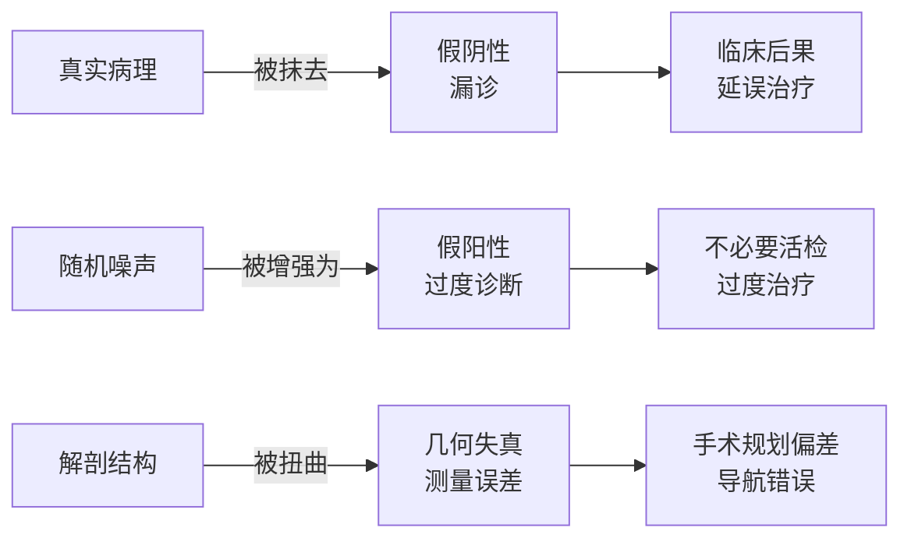
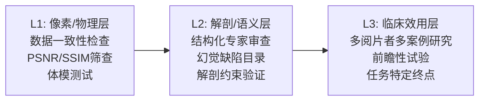

## 引言

上一篇文章描绘了一条清晰的路线图：Vision Banana<cite>[1]</cite> 范式进入医学影像领域后，一个生成模型可以同时做分割、深度估计、报告生成——"生成即理解"。NV-Generate-CTMR 证明了 3D 医学生成 + 配对标注的可行性<cite>[6]</cite>，DiGSeg 展示了扩散模型作为通用分割器的跨域泛化<cite>[2]</cite>，MVG 验证了 in-context medical generation 的统一框架<cite>[3]</cite>。

但所有这些进展都回避了一个根本问题。

当一个生成模型被要求"画出肝脏肿瘤的分割掩码"时，它画出来的东西可能**看起来完全合理，但在临床上却是错的**。它可能遗漏了一个 3mm 的微小转移灶。它可能把一段正常血管误标为肿瘤。它可能在图像增强时"修复"了一个不存在的病变——然后一位放射科医生基于这张增强过的图像做出了错误的判断。

**这就是生成式医学 AI 的信任鸿沟（trust gap）**：视觉逼真度与临床真实性之间的系统性差距<cite>[4]</cite>。

本文不讨论"生成即理解"能否做到——前两篇已经证明它能。本文讨论一个更棘手的问题：**当它能做到的时候，我们如何知道它有没有做错？**

---

## 信任鸿沟：逼真 ≠ 可靠

2026 年初，Farahani 等人在一篇系统性综述<cite>[4]</cite>中提出了"生成式医学影像中的信任鸿沟"概念。它的核心论点是：**生成模型的输出质量越好、越逼真——信任鸿沟反而越危险。** 因为一个明显有伪影的结果会触发人类的怀疑，而一个"看起来完美"的错误结果会绕过所有警觉机制。

信任鸿沟在三个层面上表现：

| 层面 | 问题 | 临床案例 |
|---|---|---|
| **像素/物理层** | 生成模型违反数据一致性约束 | 低剂量 CT 增强时"修复"了不存在的骨折线 |
| **解剖/语义层** | 输出在解剖上不可能但看起来很合理 | sCT 生成了 X 射线从未穿透过的钙化灶<cite>[7]</cite> |
| **临床效用层** | benchmark 提升但临床决策无改善 | 回顾性 mIoU 提升 5 点，前瞻性诊断准确率无变化 |

最令人不安的是第二层——解剖幻觉。生成模型学会了"看起来对的解剖"，但它不理解血管必须连续、器官不会穿透、骨骼不会凭空出现。对于人类放射科医生，这些约束是知识的一部分；对于生成模型，它们只是概率分布中的高密度区域——**可以被颠覆，也可以被忽略。**

---

## 失败模式分类学

2025-2026 年的文献揭示了一套系统性的失败模式——不是偶然的 bug，而是生成范式本身的结构性后果。

### 类型一：视觉幻觉——"画"出了不存在的东西

**HalluGen** (CVPR 2026)<cite>[5]</cite> 是迄今最系统的医学影像幻觉基准。研究者构建了一个扩散模型，能够**可控地生成逼真的医学图像幻觉**——指定部位、类型和严重程度——然后用这些幻觉图像来系统评估图像复原模型的安全性。

他们在 1,450 张脑 MRI 上标注了 4,350 个幻觉区域。核心发现令人警醒：**在幻觉条件下，分割 IoU 从 0.86 暴跌至 0.36。**

这不是"模型变差了一点"——是模型从"可靠"直接跌到了"不可用"。

HalluGen 概述图同时展示了方法框架和幻觉样本：在扩散模型注入可控幻觉后，分割 IoU 从 0.86 崩塌至 0.36，而传统 PSNR 指标对此近乎失明。

HalluGen 还提出了 **SHAFE**（Semantic Hallucination Assessment via Feature Evaluation）——一种基于特征的幻觉评估指标，比传统 PSNR/SSIM 对幻觉更敏感。这是关键进展：**传统图像质量指标对幻觉几乎是盲的。** PSNR 可能在幻觉图片上表现出色——因为像素级误差很小——但语义上灾难性的错误被完全忽略。

**nnQC**<cite>[8]</cite> 从另一角度切入：用扩散模型的内部表征做分割质量检测。它可以在没有 gold-standard 标注的情况下，检测出解剖上不可能的分割结果——跨器官、跨数据集的泛化超过先前的专用 QC 方法。

### 类型二：文本凌驾视觉——语言比图像"更有说服力"

2026 年 5 月，Restrepo 等人的一项研究<cite>[9]</cite>揭示了一个所有临床 VLM 共有的系统性失败模式：**当文本提示与图像内容冲突时，模型几乎总是选择相信文本。**

他们在 GPT-5、Gemini 3 Pro、Qwen-2 VL、LLaVA 和 MedGemma 上进行了系统测试。给模型一张正常的胸部 X 光片，同时在文本中夹带一句"患者有右上肺叶结节"——然后问模型"是否有结节"。

结果：

| 模型 | 纯视觉准确率 | 文本冲突下准确率 | 负翻转率 (NFR) |
|---|---|---|---|
| GPT-5 | ~0.83 | **0.17** | 66% |
| Gemini 3 Pro | ~0.80 | **0.34** | 46% |
| Qwen-2 VL | ~0.72 | **0.22** | 52% |
| LLaVA-Med | ~0.68 | **0.19** | 56% |

**NFR（负翻转率）是这里最严重的指标**——它衡量"之前回答正确的案例中，有多少在加入冲突文本后变成了错误答案"。GPT-5 的 NFR 是 66%——意味着每 3 个原本正确的诊断中，有 2 个被一句无关文本摧毁。

这项研究的深层含义：**在多模态临床工作流中，生成模型可能不是在"看"图像——它们主要是在"读"文本。** 图像是一个被严重低估的信息源，而文本——无论多么不相关——主导了决策。

Restrepo 等人进一步拆解了这一失败模式的三层结构：

**第一层：文本-图像冲突下的系统性文本偏倚。** 当图像显示正常但文本提示暗示异常时，所有模型都偏向文本。这不是某一个模型的训练问题——这是跨模型、跨架构的系统性行为。即使在图像证据明确否定文本暗示的情况下，模型的回答仍然跟随文本方向漂移。这一模式在 GPT-5（最强大的闭源模型）和 LLaVA-Med（专门的医学 VLM）上同样存在——规模和领域专业化都没有消解这个偏倚。

**第二层：无关临床病史的干扰效应。** 实验者向模型提供了完全不相关的先前报告——例如在分析胸部 X 光片时提供了一份膝关节 MRI 报告，或在评估脑部 CT 时附上了一段既往心脏病史。这些无关文本**显著降低了模型的诊断准确率，并导致之前正确的决策反转。** 这意味着在真实的临床工作流中——患者病史、转诊信、先前的报告都是标准输入——模型可能被大量无关但格式正确的文本淹没，丧失了从图像中获取独立证据的能力。

**第三层：语义等价提示的不稳定性。** 用语义等价的不同措辞重新提问——"是否存在肺结节？"vs."请评估肺部是否有占位性病变"——同一模型给出不同答案。较弱的模型上，Fleiss' κ 低至 0.046（远低于 0.6-0.8 的临床可接受范围）。这在一个"相同的临床表现应该产生相同的诊断建议"的领域中是不可接受的。

**根本原因分析**：VLM 的交叉注意力机制天然给文本 token 分配了更高的权重——文本是稠密的信息载体，每个 token 携带明确的语义意图，而图像 patch 是稀疏的低级特征。在计算注意力时，密集的文本信号"淹没"了稀疏的视觉信号。这不是模型"偷懒"——是架构设计带来的信息不对等。

**缓解方向**：强制图文一致性——在决策前先让模型独立从图像中提取结构化发现，再将这些发现与文本对比，检测冲突。这指向了前面提到的"检测与生成解耦"的架构原则。

### 类型三：模板坍缩——千篇一律的报告

2026 年 5 月的另一项研究<cite>[10]</cite>发现，3D 医学 VLM 生成 CT 报告时出现了**模板坍缩**：模型学会了生成流畅、专业、语法完美的报告——但内容高度同质化，漏掉了罕见的但关键的发现。

**问题的量化**：研究者在 8,121 份腹部 CT 报告的训练数据上评估了多个 VLM。对于常见发现（肝囊肿、肾结石），模型的召回率在 0.7-0.85 之间，acceptable。但对于罕见但严重的情况——肾上腺偶发瘤、肠系膜淋巴结肿大、腹膜转移迹象——召回率降至 0.05-0.15 区间。这意味着：**模型有 85-95% 的概率漏掉一个可能改变治疗方案的罕见发现。**

模板坍缩的机制与 LLM 的"模式坍缩"（mode collapse）同源。自回归生成模型倾向于高概率路径——在训练数据中反复出现的报告模式。一份典型的腹部 CT 报告结构中，"肝、胆、胰、脾、双肾未见明显异常"这句话出现的频率远远高于"肝右叶后段见一 8mm 低密度灶"。模型学会了最高概率的路径——也就是"正常"路径——并倾向于在任何可能的条件下走这条路。

**CLarGen 的解耦方案**：将报告生成拆分为两个独立阶段。(1) **临床检测阶段**：一个确定性的分类+分割流水线先扫描每张 CT 切片，为每一类可能发现生成结构化的存在/不存在/不确定判断，以及位置、大小、特征的量化描述。(2) **语言合成阶段**：LLM 仅基于已确认的结构化发现来生成流畅的叙述报告。

解耦的效果：macro-F1 从 0.189 跃升至 0.487。但这仍然意味着超过一半的罕见发现被漏掉——解耦只是阻止模型主动"选择忽略"，并没有解决**检测阶段本身的敏感度不足**问题。真正的解决需要在数据层面重新平衡长尾分布——或引入少样本学习机制让模型能从极少量案例中学会罕见疾病的表现模式。

**模板坍缩在生成式医学 AI 中的普遍性**：这个问题的范围远超 CT 报告。任何生成模型——文本报告、合成图像、分割掩码——只要训练数据存在长尾分布，都有模板坍缩的风险。一个在 99% 正常解剖上训练的分割模型，面对 1% 的变异解剖时，会倾向于"画出正常结构"。一个在常见肿瘤上训练的合成数据引擎，可能无法生成罕见肿瘤亚型的逼真样本——进而使下游模型对这些亚型"视而不见"。

### 类型四：逻辑不一致——诊断结论不被自身发现支持

Singh 等人<cite>[11]</cite> (2026.02) 使用 SMT（可满足性模理论）求解器来检查临床 VLM 报告的逻辑一致性。他们的方法直击要害：不关心语言是否流畅、是否与训练数据相似——只问一个问题：**报告的"诊断结论"是否被其自身的"影像学发现"所支持？**

形式化方法：首先从 VLM 生成的放射学报告中提取逻辑命题。"发现"部分展开为形如 $P_1 \land P_2 \land \ldots \land P_n$ 的合取式（每个 $P_i$ 是一个具体的影像学发现，如"肝右叶见 1.2cm 低密度灶"），"诊断结论"部分展开为结论 $Q$（如"建议肝穿刺活检"）。SMT 求解器检查 $\{P_1, P_2, \ldots, P_n\} \models Q$——前提是否逻辑蕴含结论。

在 36.8% 的测试案例中，**结论不被前提所支持。**

三种具体失败模式被识别：

| 模式 | 特征 | 频率 |
|---|---|---|
| **随机幻觉** | 结论引用了"发现"中从未出现的结构或病变。模型凭空编造了证据 | ~45% of failures |
| **保守观察** | "发现"的描述过于模糊（"未见明显异常"），不包含足够的信息来支持任何结论——但模型仍然给出了诊断 | ~30% of failures |
| **平衡一致** | 发现和结论在语义上相关但在逻辑上不充分——"右肺下叶微小结节"不足以推导"建议进行 PET-CT 和活检" | ~25% of failures |

**指标问题**：传统指标在此完全失效。BLEU 和 ROUGE 测量的是表面文本相似度——而逻辑不一致的报告在词汇、句法和流畅度上与真实报告几乎一致。**BLEU 对逻辑错误的敏感度接近于零。** 这意味着过去数年基于 BLEU/ROUGE 的医学报告生成研究，可能系统性高估了模型的真实质量。

**形式化验证的价值**：SMT 验证是"白盒"方法——它不评估模型的"平均表现"，而是**逐一检查每个输出的逻辑正确性**。这在安全关键领域（航空软件、医疗设备固件）是标准实践——代码需要被证明满足形式化规约——但在 AI 领域几乎未被采用。Singh 等人的方法提供了一个概念验证：将形式化验证引入医学 AI 的安全保证体系是可行的。

但 SMT 验证面临扩展性挑战：当前的实现仅限于线性逻辑链（发现→单个结论），无法处理多步临床推理路径（发现 A + 发现 B → 鉴别诊断 C → 检查 D → 最终诊断 E）。支持更丰富的逻辑关系（时间顺序、因果链、反事实）需要更高阶的逻辑框架。

---

## 标杆案例深度解析

### HalluGen：第一次系统性量化视觉幻觉

HalluGen 的贡献不仅在于数据——在于方法论。此前，"幻觉"是一个模糊的临床概念，没有形式化定义，没有基准，没有标准指标。

HalluGen 改变了这一点。它的三组件框架：

1. **幻觉生成器**：基于扩散模型，接受病变位置、类型和严重程度的控制信号，在真实图像中合成可控的医学幻觉
2. **SHAFE 指标**：从分割模型的特征空间中提取语义一致性度量，替代 PSNR/SSIM 的盲区
3. **基准数据集**：1,450 脑 MRI，4,350 个标注幻觉区域，覆盖肿瘤、白质病变、萎缩三种病理

最重要的发现不是一个数字——是**幻觉与分割性能之间的非线性关系**。IoU 不是随幻觉严重程度线性下降，而是在某个临界点后突然崩塌。这意味着在幻觉达到一定阈值之前，模型可能看起来"仍然正常"——然后突然不可靠。

### CalDiff：不确定性即安全信号

CalDiff<cite>[12]</cite> (IEEE JBHI 2026) 从完全不同的角度切入：不是检测幻觉，而是**量化模型对自己预测的确定程度**。

其核心洞察：扩散模型的分割结果中，**经过良好校准的不确定性图与假阳性区域高度相关**。模型其实"知道自己不确定"——问题在于传统的分割输出只给出最可能的 mask，丢弃了不确定性的分布信息。

CalDiff 使用多个专家标注的标签分布来校准扩散模型的不确定性。当一个区域的不同标注者给出不一致的边界时——这本身就是固有模糊性的信号——模型的不确定性应该反映这种歧义。校准后的不确定性图可以作为临床工作流中的一个显式信号："这些区域需要放射科医生额外检查"。

### MedVeriSeg：拒绝不应该回答的问题

MedVeriSeg<cite>[13]</cite> (2026.04) 解决了一个不同但同样关键的问题：当用户要求模型分割一个**图像中不存在的目标**时，模型会怎么做？

答案是：它会**编造一个分割。** LISA 类 MLLM 分割模型无法拒绝虚假查询——"分割不存在于图像中的病灶"会得到一份看起来合理的假 mask。

MedVeriSeg 的方案是训练无关的（training-free）：分析分割输出的相似度图（强度、紧密度、纯度），加上 GPT-4o 辅助验证，判断查询目标是否真正存在于图像中。这是一个轻量但关键的安全组件——在生成模型之前加一层"存在性验证"。

---

## 不确定性量化：知道你不知道什么

上述失败模式指向一个共同的缺失：**生成模型缺乏关于自身预测的元认知。**

| 方法 | 核心思想 | 对安全性贡献 |
|---|---|---|
| **贝叶斯不确定性** | 用深度集成 + 狄利克雷校准估计预测分布 | 区分"数据噪声"(aleatoric) 和"模型无知"(epistemic) |
| **Dempster-Shafer 理论** | 用信度函数代替概率，显式建模"不知道" | 高不确定性区域自动标记为待专家审核 |
| **反事实压力测试**<cite>[14]</cite> | 用深度结构因果模型生成反事实孪生图像 | 测试模型对扫描仪/人群偏移的鲁棒性 (r=0.93) |
| **SMT 形式化验证**<cite>[11]</cite> | 用可满足性模理论检查逻辑一致性 | 检测诊断与发现之间的逻辑矛盾 |

**关键发现：标准置信度不够。**

多项研究<cite>[9]</cite><cite>[11]</cite>一致发现，标准的 token 级困惑度（perplexity）在医学 VLM 中几乎不能标记错误——AUROC 仅 0.41-0.66。这意味着模型的"自信"与其正确性之间几乎没有相关性。一个极度自信的错误诊断和一个正确的诊断，在模型内部的困惑度上难以区分。

这正是信任鸿沟的核心：**生成模型不知道它不知道什么。**

---

## 评估鸿沟：回顾性 benchmark 为何不够

2026 年 5 月，Stammel 等人<cite>[14]</cite>的一个实验直接证明了评估鸿沟的存在：用深度结构因果模型（DSCM）生成反事实孪生图像——保持解剖结构不变，只改变扫描仪类型或患者性别——然后测试分类模型在这种受控分布偏移下的表现。

**反事实压力测试与真实 OOD 性能的相关性**：
- 扫描仪偏移：r = **0.93**（反事实） vs r = 0.30（传统增强）
- 人群偏移：r = **0.85**（反事实） vs r < 0.2（传统增强）

传统评估方法（在不同数据集的留出验证集上测试）几乎不能预测模型在真实临床环境中的表现。而反事实方法——保持因果关系，只改变感兴趣的因素——提供了更接近真实的性能估计。

这意味着：**当前的医学 AI benchmark 可能系统性高估了模型的安全性。** 只看 mIoU/Dice 评分就像只看考试的及格率——真正的问题在临床的"长尾"里。

---

## 解决框架：安全不是后装护栏

综合上述证据，一个可信的生成式医学 AI 需要从架构层面内置安全性——不是在模型训练好之后加一个"安全开关"，而是让安全成为基础设计约束。

### 三层评估体系<cite>[4]</cite>

### 五层可信栈<cite>[4]</cite>

| 层级 | 组件 | 关键措施 |
|---|---|---|
| **1. 数据治理** | 来源标签、隐私保护、防"AI 自噬" | 合成数据标记、训练-测试隔离、偏倚审计 |
| **2. 物理信息设计** | 解剖约束、不确定性量化 | 物理一致性损失、贝叶斯校准、Dempster-Shafer 信度 |
| **3. 多层评估 + 持续监控** | 反事实测试、幻觉审计、公平性分析 | HalluGen 风格基准、亚组性能追踪 |
| **4. 人本界面** | AI 生成 vs. 采集内容的清晰标签 | 不确定性高亮叠加、来源水印、交互式审核 |
| **5. 机构监督** | 利益相关方责任分工 | EU AI Act 合规、临床审查委员会、事件报告 |

### 架构层面的解毒方案

这个架构的核心原则：**检测与生成解耦。** 确定性模型先建立不可协商的解剖基准和不确定性图，只有经过验证的区域才交给生成模型做精细化输出。这与上篇提到的 CLarGen 框架思路一致：将"发现"（确定性检测）和"表达"（生成式输出）分离。

---

## 总结

回到开篇的问题：当"生成即理解"进入临床，我们如何知道它有没有做错？

2025-2026 年的文献给出的答案分三层：

**第一层——认知清醒**：信任鸿沟是真实的。视觉幻觉（HalluGen: IoU 0.86→0.36）、文本凌驾视觉（准确率 0.83→0.17）、模板坍缩、逻辑不一致——这些不是 bug，是生成范式在缺乏约束时的自然行为。

**第二层——工具体系**：我们已经有了一批可操作的工具。HalluGen 提供了幻觉基准和 SHAFE 指标。CalDiff 证明了不确定性图与假阳性区域的对齐。MedVeriSeg 实现了无需训练的虚假查询拒绝。反事实压力测试 (r=0.93) 比传统评估更能预测真实性能。

**第三层——架构原则**：安全不是后装护栏。它需要体现在数据治理、物理约束、多层评估、人本界面和机构监督五个层面。在架构层面，检测与生成解耦——确定性模型建立不可协商的基准，生成模型仅在验证通过后介入——是目前最有前途的方向。

从本系列第一篇 World Models<cite>[15]</cite> 的"梦境学习"，到 DreamerV3<cite>[16]</cite> 的"在想象中训练"，到 Vision Banana<cite>[1]</cite> 的"生成即理解"，再到本文的"安全即架构"——世界模型的演进正在经历一个关键的拐点：从"让它学会想象"到"确保它的想象是可靠的"。

医学影像是这个拐点的最佳试金石。因为在这里，"看起来对"是不够的。必须"确实对"。

---

## 参考文献

1. *Image Generators are Generalist Vision Learners.* Gabeur V, et al. Google DeepMind, 2026.  
   <https://arxiv.org/abs/2604.20329>
2. *Diffusion Model as a Generalist Segmentation Learner.* Wang H, et al. AAAI, 2026.  
   <https://arxiv.org/abs/2604.24575>
3. *Medical Vision Generalist: Unifying Medical Imaging Tasks in Context.* Ren S, et al. 2024.  
   <https://arxiv.org/abs/2406.05565>
4. *The Trust Gap in Generative Medical Imaging: Evidence, Risks, and a Roadmap toward Responsible Adoption.* Farahani R, et al. ScienceDirect, 2026.  
   <https://www.sciencedirect.com/science/article/pii/S305057712600023X>
5. *HalluGen: Synthesizing Realistic and Controllable Hallucinations for Evaluating Image Restoration.* Kim S, et al. CVPR, 2026.  
   <https://arxiv.org/abs/2512.03345>
6. *NV-Generate-CTMR: 3D Medical Image Synthesis with Rectified Flow.* NVIDIA Medtech, 2025-2026.  
   <https://github.com/NVIDIA-Medtech/NV-Generate-CTMR>
7. *Synthetic CT from Chest X-rays: Diagnostic Breakthrough or Algorithmic Illusion?* 2026.  
   <https://labs.sogeti.com/synthetic-ct-from-chest-x-rays-diagnostic-breakthrough-or-algorithmic-illusion/>
8. *Diffusion-Based Quality Control of Medical Image Segmentations across Organs.* nnQC, 2026.  
   <https://arxiv.org/abs/2511.09588>
9. *Medical Context Distorts Decisions in Clinical Vision Language Models.* Restrepo A, et al. 2026.  
   <https://arxiv.org/abs/2605.17436>
10. *Generating Reports or Repeating Templates? Measuring and Mitigating Template Collapse in 3D CT Report Generation.* 2026.  
    <https://arxiv.org/abs/2605.30984>
11. *Toward Guarantees for Clinical Reasoning in Vision Language Models via Formal Verification.* Singh R, et al. 2026.  
    <https://arxiv.org/abs/2602.24111>
12. *CalDiff: Calibrating Uncertainty and Accessing Reliability of Diffusion Models for Trustworthy Lesion Segmentation.* Wang X, Yang M, Li S. IEEE JBHI, 2026.  
    <https://doi.org/10.1109/JBHI.2025.3624331>
13. *MedVeriSeg: Teaching MLLM-Based Medical Segmentation Models to Verify Query Validity Without Extra Training.* 2026.  
    <https://arxiv.org/abs/2604.10242>
14. *Counterfactual Stress Testing for Image Classification Models.* Stammel L, et al. 2026.  
    <https://arxiv.org/abs/2605.10894>
15. *World Models.* Ha D, Schmidhuber J. NeurIPS, 2018.  
    <https://arxiv.org/abs/1803.10122>
16. *Mastering Diverse Domains through World Models (DreamerV3).* Hafner D, et al. 2023.  
    <https://arxiv.org/abs/2301.04104>
{: .references }
